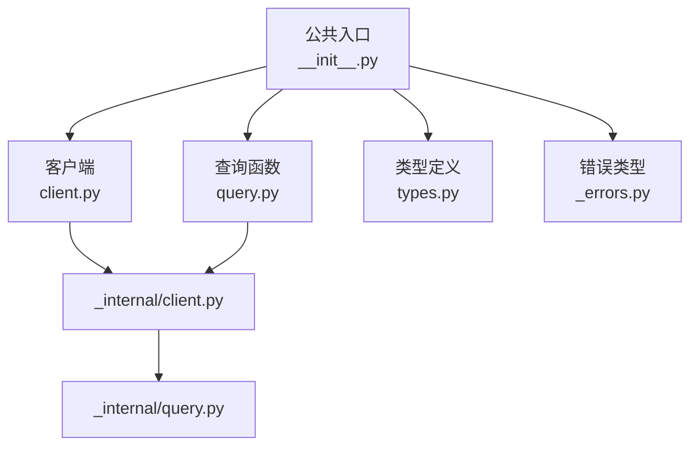
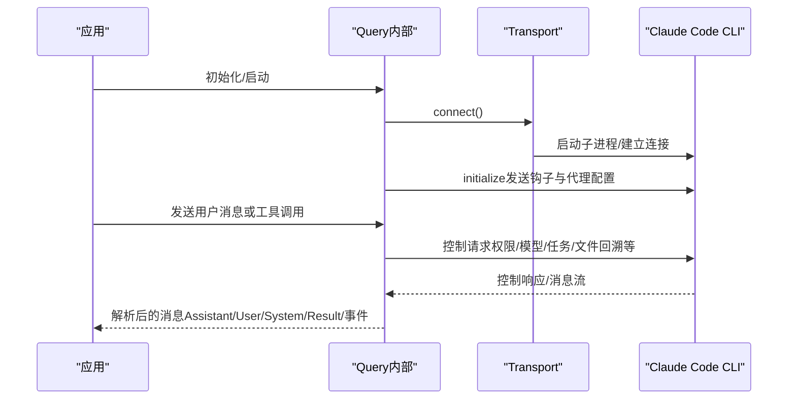
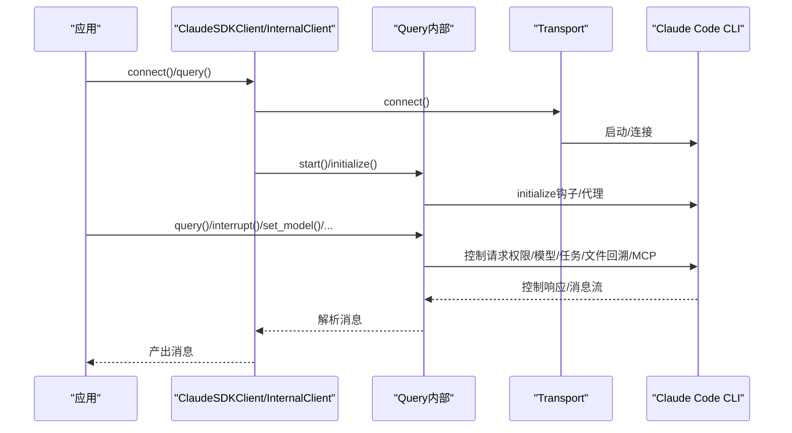
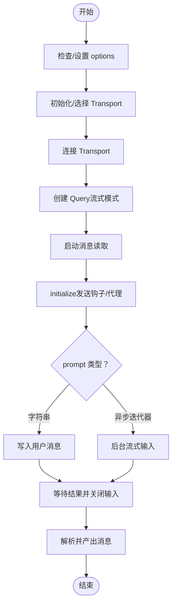
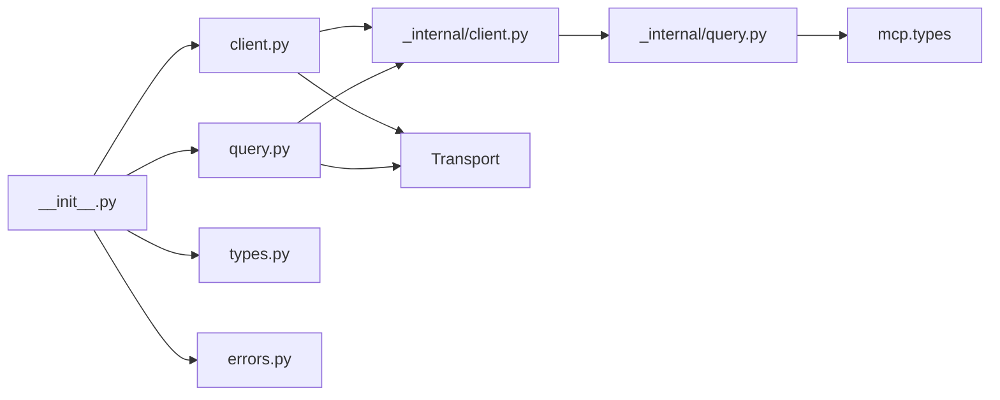

# API 参考

<cite>
**本文引用的文件**
- [src/claude_agent_sdk/__init__.py](file://src/claude_agent_sdk/__init__.py)
- [src/claude_agent_sdk/client.py](file://src/claude_agent_sdk/client.py)
- [src/claude_agent_sdk/query.py](file://src/claude_agent_sdk/query.py)
- [src/claude_agent_sdk/types.py](file://src/claude_agent_sdk/types.py)
- [src/claude_agent_sdk/_errors.py](file://src/claude_agent_sdk/_errors.py)
- [src/claude_agent_sdk/_internal/client.py](file://src/claude_agent_sdk/_internal/client.py)
- [src/claude_agent_sdk/_internal/query.py](file://src/claude_agent_sdk/_internal/query.py)
- [examples/quick_start.py](file://examples/quick_start.py)
- [examples/tools_option.py](file://examples/tools_option.py)
- [examples/system_prompt.py](file://examples/system_prompt.py)
- [examples/mcp_calculator.py](file://examples/mcp_calculator.py)
- [examples/hooks.py](file://examples/hooks.py)
- [README.md](file://README.md)
</cite>

## 目录
1. [简介](#简介)
2. [项目结构](#项目结构)
3. [核心组件](#核心组件)
4. [架构总览](#架构总览)
5. [详细组件分析](#详细组件分析)
6. [依赖分析](#依赖分析)
7. [性能考虑](#性能考虑)
8. [故障排查指南](#故障排查指南)
9. [结论](#结论)
10. [附录](#附录)

## 简介
本文件为 Claude Agent SDK（Python）的完整 API 参考，覆盖以下内容：
- 公共接口与类型定义：函数签名、参数类型、返回值、异常信息
- ClaudeSDKClient 类的全部方法：构造函数、查询方法、会话管理、生命周期方法
- query() 函数的重载与配置项说明
- 类型系统：ClaudeAgentOptions、Message 类型与工具类型
- 工具装饰器与 SDK MCP 服务器创建函数
- 钩子系统 API 说明与使用示例
- 每个 API 的使用示例与注意事项

## 项目结构
SDK 主要由以下模块组成：
- 公共入口与导出：__init__.py
- 客户端与查询：client.py、query.py
- 内部实现：_internal/client.py、_internal/query.py
- 类型定义：types.py
- 错误类型：_errors.py
- 示例：examples/*（用于演示 API 使用）

图表来源
- [src/claude_agent_sdk/__init__.py:1-445](file://src/claude_agent_sdk/__init__.py#L1-L445)
- [src/claude_agent_sdk/client.py:1-500](file://src/claude_agent_sdk/client.py#L1-L500)
- [src/claude_agent_sdk/query.py:1-127](file://src/claude_agent_sdk/query.py#L1-L127)
- [src/claude_agent_sdk/_internal/client.py:1-146](file://src/claude_agent_sdk/_internal/client.py#L1-L146)
- [src/claude_agent_sdk/_internal/query.py:1-679](file://src/claude_agent_sdk/_internal/query.py#L1-L679)

章节来源
- [README.md:1-360](file://README.md#L1-L360)
- [src/claude_agent_sdk/__init__.py:1-445](file://src/claude_agent_sdk/__init__.py#L1-L445)

## 核心组件
- 公共导出与工具装饰器
  - 工具装饰器：tool(name, description, input_schema, annotations) -> SdkMcpTool
  - SDK MCP 服务器创建：create_sdk_mcp_server(name, version, tools) -> McpSdkServerConfig
  - 查询函数：query(prompt, options=None, transport=None) -> AsyncIterator[Message]
  - 客户端类：ClaudeSDKClient
  - 类型与错误：ClaudeAgentOptions、Message、各种消息与状态类型、权限与钩子类型、错误类型等

章节来源
- [src/claude_agent_sdk/__init__.py:100-341](file://src/claude_agent_sdk/__init__.py#L100-L341)
- [src/claude_agent_sdk/query.py:12-127](file://src/claude_agent_sdk/query.py#L12-L127)
- [src/claude_agent_sdk/client.py:21-500](file://src/claude_agent_sdk/client.py#L21-L500)
- [src/claude_agent_sdk/types.py:1029-1199](file://src/claude_agent_sdk/types.py#L1029-L1199)

## 架构总览
SDK 通过 Transport 抽象与 Claude Code CLI 进行双向通信；内部使用 Query 类处理控制协议（如权限请求、钩子回调、MCP 服务器桥接等），并以消息流的形式向上层暴露统一的消息类型。

图表来源
- [src/claude_agent_sdk/_internal/query.py:119-164](file://src/claude_agent_sdk/_internal/query.py#L119-L164)
- [src/claude_agent_sdk/_internal/client.py:44-146](file://src/claude_agent_sdk/_internal/client.py#L44-L146)
- [src/claude_agent_sdk/_internal/query.py:172-235](file://src/claude_agent_sdk/_internal/query.py#L172-L235)

## 详细组件分析

### ClaudeSDKClient 类 API
- 作用：支持双向、交互式对话，适合聊天界面、调试探索、多轮对话、实时输入与中断能力。
- 关键特性：维护会话上下文、支持流式输入、可中断、动态切换权限模式/模型、MCP 服务器管理、任务停止、文件回溯等。

构造函数
- 方法签名：ClaudeSDKClient(options=None, transport=None)
- 参数
  - options: ClaudeAgentOptions，可选，默认使用默认配置
  - transport: Transport，可选，自定义传输层
- 行为：设置默认入口标记，保存 options 与 transport

连接与生命周期
- connect(prompt=None|AsyncIterable[dict]|str) -> None
  - 支持空流（保持连接）、字符串提示、异步迭代器提示
  - 自动校验 can_use_tool 与 permission_prompt_tool_name 的互斥性
  - 自动提取 SDK MCP 服务器实例
  - 计算初始化超时（从环境变量读取）
  - 初始化 Query 并启动消息读取
- receive_messages() -> AsyncIterator[Message]
  - 解析并逐条产出消息，遇到 ResultMessage 后可作为单次响应结束
- receive_response() -> AsyncIterator[Message]
  - 便捷方法：自动在收到 ResultMessage 后终止
- disconnect() -> None
  - 关闭 Query 与 Transport
- 上下文管理：__aenter__/__aexit__，进入时自动 connect，退出时自动 disconnect

查询与消息发送
- query(prompt: str|AsyncIterable[dict], session_id="default") -> None
  - 字符串：封装为用户消息并写入
  - 异步迭代器：逐条写入，自动补全 session_id
- interrupt() -> None：仅在流式模式下可用
- set_permission_mode(mode) -> None：切换权限模式（default、acceptEdits、plan、bypassPermissions）
- set_model(model) -> None：切换模型（可为 None 使用默认）
- rewind_files(user_message_id) -> None：将跟踪的文件回溯到指定用户消息的状态（需启用文件检查点）
- reconnect_mcp_server(server_name) -> None：重连断开或失败的 MCP 服务器
- toggle_mcp_server(server_name, enabled) -> None：启用/禁用 MCP 服务器
- stop_task(task_id) -> None：停止运行中的任务
- get_mcp_status() -> McpStatusResponse：查询所有 MCP 服务器连接状态
- get_server_info() -> dict|None：获取服务器初始化信息（命令、输出样式等）

注意事项
- 限制：v0.0.20 起，不建议在不同异步运行时上下文间复用同一实例（内部持有 anyio 任务组）
- 流式模式：上述多数方法仅在流式模式下生效

章节来源
- [src/claude_agent_sdk/client.py:62-500](file://src/claude_agent_sdk/client.py#L62-L500)
- [src/claude_agent_sdk/_internal/query.py:119-679](file://src/claude_agent_sdk/_internal/query.py#L119-L679)

### query() 函数 API
- 作用：一次性/单向流式交互，适合简单问题、批处理、自动化脚本等。
- 方法签名：query(*, prompt: str|AsyncIterable[dict], options=None, transport=None) -> AsyncIterator[Message]
- 参数
  - prompt：字符串或异步迭代器字典
    - 字典结构包含 type、message、parent_tool_use_id、session_id 等字段
  - options：ClaudeAgentOptions，可选，默认配置
  - transport：Transport，可选，自定义传输层
- 返回：消息迭代器（Assistant/User/System/Result/事件等）
- 使用场景对比
  - ClaudeSDKClient：交互式、双向、可中断、会话管理
  - query：一次性、单向、无中断、无会话状态

章节来源
- [src/claude_agent_sdk/query.py:12-127](file://src/claude_agent_sdk/query.py#L12-L127)
- [src/claude_agent_sdk/_internal/client.py:44-146](file://src/claude_agent_sdk/_internal/client.py#L44-L146)

### 类型系统与配置

#### ClaudeAgentOptions（配置项概览）
- tools: list[str] | ToolsPreset | None
- allowed_tools: list[str]
- system_prompt: str | SystemPromptPreset | None
- mcp_servers: dict[str, McpServerConfig] | str | Path
- permission_mode: PermissionMode | None
- continue_conversation: bool
- resume: str | None
- max_turns: int | None
- max_budget_usd: float | None
- disallowed_tools: list[str]
- model: str | None
- fallback_model: str | None
- betas: list[SdkBeta]
- permission_prompt_tool_name: str | None
- cwd: str | Path | None
- cli_path: str | Path | None
- settings: str | None
- add_dirs: list[str|Path]
- env: dict[str, str]
- extra_args: dict[str, str|None]
- max_buffer_size: int | None
- debug_stderr: sys.stderr（已弃用）
- stderr: Callable[[str], None] | None
- can_use_tool: CanUseTool | None
- hooks: dict[HookEvent, list[HookMatcher]] | None
- user: str | None
- include_partial_messages: bool
- fork_session: bool
- agents: dict[str, AgentDefinition] | None
- setting_sources: list[SettingSource] | None
- sandbox: SandboxSettings | None
- plugins: list[SdkPluginConfig]
- max_thinking_tokens: int | None（已弃用）
- thinking: ThinkingConfig | None
- effort: "low"|"medium"|"high"|"max"|None
- output_format: dict[str, Any] | None
- enable_file_checkpointing: bool

章节来源
- [src/claude_agent_sdk/types.py:1029-1199](file://src/claude_agent_sdk/types.py#L1029-L1199)

#### 消息与内容块类型
- Message：Union(UserMessage | AssistantMessage | SystemMessage | ResultMessage | StreamEvent | RateLimitEvent)
- UserMessage：content: str|list[ContentBlock], uuid, parent_tool_use_id, tool_use_result
- AssistantMessage：content: list[ContentBlock], model, parent_tool_use_id, error
- SystemMessage：subtype, data
- ResultMessage：duration_ms, duration_api_ms, is_error, num_turns, session_id, stop_reason, total_cost_usd, usage, result, structured_output
- StreamEvent：uuid, session_id, event, parent_tool_use_id
- ContentBlock：TextBlock | ThinkingBlock | ToolUseBlock | ToolResultBlock
- TextBlock：text
- ThinkingBlock：thinking, signature
- ToolUseBlock：id, name, input
- ToolResultBlock：tool_use_id, content, is_error

章节来源
- [src/claude_agent_sdk/types.py:766-953](file://src/claude_agent_sdk/types.py#L766-L953)

#### 权限与钩子类型
- PermissionMode："default"|"acceptEdits"|"plan"|"bypassPermissions"
- CanUseTool：Callable[[str, dict, ToolPermissionContext], Awaitable[PermissionResult]]
- PermissionResult：PermissionResultAllow | PermissionResultDeny
- HookEvent："PreToolUse"|"PostToolUse"|"PostToolUseFailure"|"UserPromptSubmit"|"Stop"|"SubagentStop"|"PreCompact"|"Notification"|"SubagentStart"|"PermissionRequest"
- HookMatcher：matcher(str|None), hooks(list[HookCallback]), timeout(float|None)
- HookCallback：(HookInput, tool_use_id, HookContext) -> Awaitable[HookJSONOutput]

章节来源
- [src/claude_agent_sdk/types.py:17-158](file://src/claude_agent_sdk/types.py#L17-L158)
- [src/claude_agent_sdk/types.py:160-473](file://src/claude_agent_sdk/types.py#L160-L473)

#### MCP 服务器类型与工具装饰器
- SdkMcpTool：name, description, input_schema, handler, annotations
- tool(name, description, input_schema, annotations=None) -> 装饰器，返回 SdkMcpTool
- create_sdk_mcp_server(name, version="1.0.0", tools=None) -> McpSdkServerConfig
- McpServerConfig：McpStdioServerConfig | McpSSEServerConfig | McpHttpServerConfig | McpSdkServerConfig
- McpSdkServerConfig：type="sdk", name, instance（Server 实例）
- McpStatusResponse：mcpServers:list[McpServerStatus]

章节来源
- [src/claude_agent_sdk/__init__.py:100-341](file://src/claude_agent_sdk/__init__.py#L100-L341)
- [src/claude_agent_sdk/types.py:493-641](file://src/claude_agent_sdk/types.py#L493-L641)

### 工具装饰器与 SDK MCP 服务器

工具装饰器
- 用途：定义可在 SDK MCP 服务器中使用的工具函数，具备类型安全与注解支持
- 签名：tool(name, description, input_schema, annotations=None)
- 输入 schema 支持：
  - 字典映射（参数名->类型）
  - TypedDict 类
  - JSON Schema 字典
- 返回：SdkMcpTool 实例，供 create_sdk_mcp_server 使用

SDK MCP 服务器创建
- 签名：create_sdk_mcp_server(name, version="1.0.0", tools=None)
- 行为：注册 list_tools 与 call_tool 处理器，自动转换输入/输出 schema 与内容格式
- 返回：McpSdkServerConfig，可直接放入 ClaudeAgentOptions.mcp_servers

使用示例
- 参见示例：examples/mcp_calculator.py 展示了如何定义多个工具并创建服务器，再在 ClaudeSDKClient 中使用

章节来源
- [src/claude_agent_sdk/__init__.py:111-341](file://src/claude_agent_sdk/__init__.py#L111-L341)
- [examples/mcp_calculator.py:1-194](file://examples/mcp_calculator.py#L1-L194)

### 钩子系统 API
- HookEvent：事件枚举集合
- HookMatcher：匹配器与回调列表，支持超时
- HookCallback：(HookInput, tool_use_id, HookContext) -> Awaitable[HookJSONOutput]
- HookJSONOutput：同步/异步输出结构，含 continue_、suppressOutput、stopReason、decision、systemMessage、reason、hookSpecificOutput 等字段
- 在 ClaudeAgentOptions 中以 hooks: dict[HookEvent, list[HookMatcher]] 配置

使用示例
- 参见示例：examples/hooks.py 展示了多种钩子模式（PreToolUse、PostToolUse、UserPromptSubmit、决策字段、执行控制等）

章节来源
- [src/claude_agent_sdk/types.py:160-473](file://src/claude_agent_sdk/types.py#L160-L473)
- [examples/hooks.py:1-351](file://examples/hooks.py#L1-L351)

### 查询流程与控制协议序列图

图表来源
- [src/claude_agent_sdk/client.py:94-185](file://src/claude_agent_sdk/client.py#L94-L185)
- [src/claude_agent_sdk/_internal/client.py:44-146](file://src/claude_agent_sdk/_internal/client.py#L44-L146)
- [src/claude_agent_sdk/_internal/query.py:119-235](file://src/claude_agent_sdk/_internal/query.py#L119-L235)

### 查询函数算法流程

图表来源
- [src/claude_agent_sdk/query.py:12-127](file://src/claude_agent_sdk/query.py#L12-L127)
- [src/claude_agent_sdk/_internal/client.py:44-146](file://src/claude_agent_sdk/_internal/client.py#L44-L146)

## 依赖分析
- 导出与聚合
  - __init__.py 将错误类型、内部会话操作、Transport、Client、query、types 等统一导出
- 内部耦合
  - Client 与 InternalClient 均依赖 Transport 与 Query
  - Query 依赖 Transport 与 MCP 类型（mcp.types）
- 外部依赖
  - mcp.server、mcp.types（用于 SDK MCP 服务器桥接）
  - anyio（任务组、内存对象流、超时控制）

图表来源
- [src/claude_agent_sdk/__init__.py:1-445](file://src/claude_agent_sdk/__init__.py#L1-L445)
- [src/claude_agent_sdk/_internal/query.py:10-26](file://src/claude_agent_sdk/_internal/query.py#L10-L26)

章节来源
- [src/claude_agent_sdk/__init__.py:1-445](file://src/claude_agent_sdk/__init__.py#L1-L445)
- [src/claude_agent_sdk/_internal/query.py:10-26](file://src/claude_agent_sdk/_internal/query.py#L10-L26)

## 性能考虑
- SDK MCP 服务器运行于同一进程，避免 IPC 开销，性能优于外部 MCP 服务器
- 流式模式下，Query 会在存在 SDK MCP 或钩子时等待首个结果后再关闭输入，确保双向控制协议通信
- 可通过环境变量 CLAUDE_CODE_STREAM_CLOSE_TIMEOUT 控制等待超时时间
- 传输层缓冲大小可通过 ClaudeAgentOptions.max_buffer_size 调整

## 故障排查指南
常见错误类型
- ClaudeSDKError：基础异常
- CLIConnectionError：无法连接到 Claude Code
- CLINotFoundError：未找到 Claude Code
- ProcessError：CLI 进程失败（含 exit_code、stderr）
- CLIJSONDecodeError：无法解析 CLI 输出的 JSON
- MessageParseError：消息解析失败

排查要点
- 确认 Claude Code 已安装且可执行（或通过 options.cli_path 指定路径）
- 检查 stderr 回调或日志输出，定位 CLI 错误
- 若出现 JSON 解码错误，检查 CLI 输出是否符合预期格式
- 若出现连接错误，确认运行时上下文一致（不跨异步运行时复用 Client）

章节来源
- [src/claude_agent_sdk/_errors.py:1-57](file://src/claude_agent_sdk/_errors.py#L1-L57)

## 结论
本参考文档系统梳理了 Claude Agent SDK 的公共 API、类型体系、工具与钩子机制以及客户端与查询函数的使用方式。结合示例文件，开发者可快速上手并正确使用 SDK 的核心能力，包括交互式对话、工具扩展、钩子控制与 MCP 服务器集成。

## 附录

### 使用示例索引
- 快速开始与基础查询：examples/quick_start.py
- 工具选项与系统提示：examples/tools_option.py、examples/system_prompt.py
- SDK MCP 服务器与计算器：examples/mcp_calculator.py
- 钩子系统示例：examples/hooks.py

章节来源
- [examples/quick_start.py:1-77](file://examples/quick_start.py#L1-L77)
- [examples/tools_option.py:1-112](file://examples/tools_option.py#L1-L112)
- [examples/system_prompt.py:1-87](file://examples/system_prompt.py#L1-L87)
- [examples/mcp_calculator.py:1-194](file://examples/mcp_calculator.py#L1-L194)
- [examples/hooks.py:1-351](file://examples/hooks.py#L1-L351)