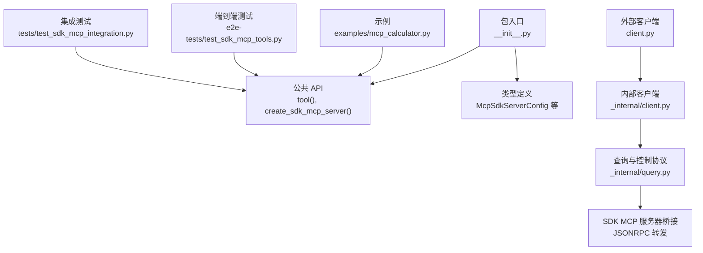
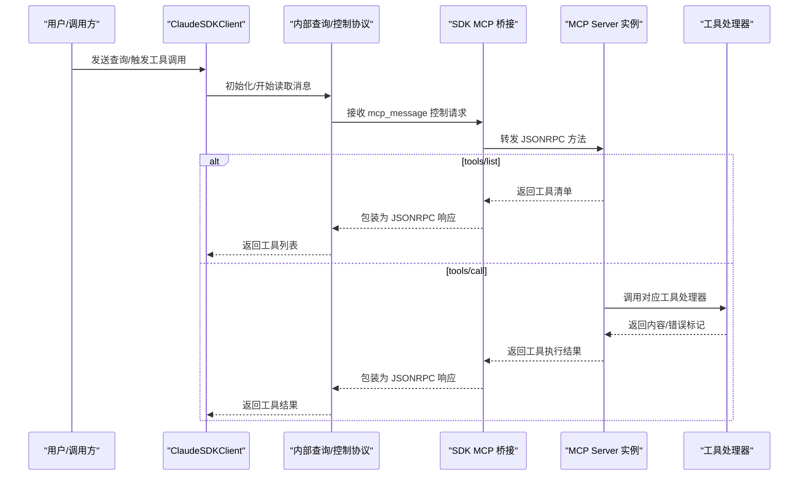
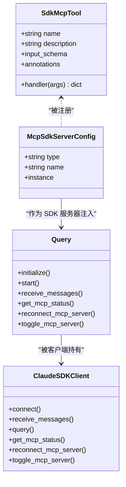
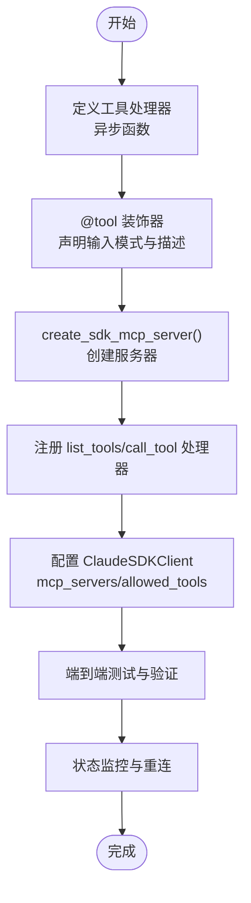

# MCP 服务器 API

<cite>
**本文引用的文件**
- [src/claude_agent_sdk/__init__.py](file://src/claude_agent_sdk/__init__.py)
- [src/claude_agent_sdk/types.py](file://src/claude_agent_sdk/types.py)
- [src/claude_agent_sdk/client.py](file://src/claude_agent_sdk/client.py)
- [src/claude_agent_sdk/_internal/client.py](file://src/claude_agent_sdk/_internal/client.py)
- [src/claude_agent_sdk/_internal/query.py](file://src/claude_agent_sdk/_internal/query.py)
- [examples/mcp_calculator.py](file://examples/mcp_calculator.py)
- [e2e-tests/test_sdk_mcp_tools.py](file://e2e-tests/test_sdk_mcp_tools.py)
- [tests/test_sdk_mcp_integration.py](file://tests/test_sdk_mcp_integration.py)
</cite>

## 目录
1. [简介](#简介)
2. [项目结构](#项目结构)
3. [核心组件](#核心组件)
4. [架构总览](#架构总览)
5. [详细组件分析](#详细组件分析)
6. [依赖关系分析](#依赖关系分析)
7. [性能考量](#性能考量)
8. [故障排查指南](#故障排查指南)
9. [结论](#结论)
10. [附录](#附录)

## 简介
本文件系统性地梳理了 Claude Agent SDK 中的 MCP（Model Context Protocol）服务器相关 API，重点覆盖：
- tool() 装饰器：如何定义类型安全的工具函数，参数要求、输入模式与返回格式
- create_sdk_mcp_server()：如何创建内联（in-process）MCP 服务器，参数与配置项
- SdkMcpTool 类：数据结构与使用方式
- 工具函数开发指南：类型安全、错误处理、结果格式化
- MCP 服务器生命周期管理与状态监控
- 完整示例与最佳实践
- 与外部 MCP 服务器的区别与优势

## 项目结构
围绕 MCP 服务器能力，SDK 的关键模块如下：
- 公共入口与导出：在包级导出工具装饰器、服务器工厂函数与类型
- 类型定义：MCP 服务器配置、状态、工具信息等强类型结构
- 内部客户端与查询层：负责控制协议、消息流、SDK MCP 服务器桥接
- 示例与测试：演示工具定义、权限控制、状态查询与端到端行为

图表来源
- [src/claude_agent_sdk/__init__.py:95-340](file://src/claude_agent_sdk/__init__.py#L95-L340)
- [src/claude_agent_sdk/types.py:493-640](file://src/claude_agent_sdk/types.py#L493-L640)
- [src/claude_agent_sdk/_internal/query.py:394-530](file://src/claude_agent_sdk/_internal/query.py#L394-L530)

章节来源
- [src/claude_agent_sdk/__init__.py:95-340](file://src/claude_agent_sdk/__init__.py#L95-L340)
- [src/claude_agent_sdk/types.py:493-640](file://src/claude_agent_sdk/types.py#L493-L640)

## 核心组件
- SdkMcpTool：封装单个工具的元数据与处理器，供 create_sdk_mcp_server() 注册
- tool() 装饰器：声明式定义工具，自动包装为 SdkMcpTool
- create_sdk_mcp_server()：创建内联 MCP 服务器实例，并注册 list_tools/call_tool 处理器
- 类型系统：McpSdkServerConfig、McpServerStatus、McpToolInfo 等

章节来源
- [src/claude_agent_sdk/__init__.py:100-176](file://src/claude_agent_sdk/__init__.py#L100-L176)
- [src/claude_agent_sdk/__init__.py:178-340](file://src/claude_agent_sdk/__init__.py#L178-L340)
- [src/claude_agent_sdk/types.py:519-640](file://src/claude_agent_sdk/types.py#L519-L640)

## 架构总览
SDK MCP 服务器在应用进程内运行，通过内部查询层桥接 CLI 控制协议与 MCP JSONRPC 方法。工具调用链路如下：

图表来源
- [src/claude_agent_sdk/_internal/query.py:394-530](file://src/claude_agent_sdk/_internal/query.py#L394-L530)
- [src/claude_agent_sdk/_internal/query.py:448-510](file://src/claude_agent_sdk/_internal/query.py#L448-L510)
- [src/claude_agent_sdk/__init__.py:250-340](file://src/claude_agent_sdk/__init__.py#L250-L340)

## 详细组件分析

### SdkMcpTool 数据结构与使用
- 字段
  - name：工具唯一标识
  - description：工具描述
  - input_schema：输入模式，支持字典映射、TypedDict 或 JSON Schema
  - handler：异步处理器，接收参数字典，返回包含 content 的字典
  - annotations：可选的工具注解（如只读、破坏性、开放世界）
- 使用方式
  - 通过 @tool 装饰器创建，再传入 create_sdk_mcp_server()

章节来源
- [src/claude_agent_sdk/__init__.py:100-109](file://src/claude_agent_sdk/__init__.py#L100-L109)
- [src/claude_agent_sdk/__init__.py:111-176](file://src/claude_agent_sdk/__init__.py#L111-L176)

### tool() 装饰器
- 参数要求
  - name：字符串，唯一标识
  - description：字符串，工具用途说明
  - input_schema：可为字典映射（参数名到类型）、TypedDict 或 JSON Schema
  - annotations：可选，工具注解
- 输入模式
  - 单一参数为 dict，键来自 input_schema
  - 支持简单类型映射或复杂 JSON Schema
- 返回格式
  - 必须返回包含 "content" 键的字典
  - content 为文本或图像内容数组
  - 可选 "is_error": True 表示错误
- 异步与类型安全
  - 要求异步函数定义
  - 建议配合 TypedDict 或 JSON Schema 提升类型安全

章节来源
- [src/claude_agent_sdk/__init__.py:111-176](file://src/claude_agent_sdk/__init__.py#L111-L176)

### create_sdk_mcp_server() 函数
- 参数
  - name：服务器名称（用于 mcp_servers 配置引用）
  - version：版本字符串（仅信息用途）
  - tools：SdkMcpTool 列表（可为空）
- 行为
  - 创建 MCP Server 实例
  - 注册 list_tools：根据 input_schema 生成 JSON Schema 并返回工具清单
  - 注册 call_tool：按名称查找工具，调用处理器，转换返回内容为 MCP 格式
  - 返回 McpSdkServerConfig：包含 type="sdk"、name、instance
- 生命周期
  - 由 SDK 自动管理；可通过 ClaudeSDKClient 的状态接口进行监控与控制

章节来源
- [src/claude_agent_sdk/__init__.py:178-340](file://src/claude_agent_sdk/__init__.py#L178-L340)
- [src/claude_agent_sdk/types.py:519-525](file://src/claude_agent_sdk/types.py#L519-L525)

### MCP 服务器类型与状态
- McpSdkServerConfig：内联服务器配置（type="sdk"）
- McpServerStatus：连接状态（connected/pending/failed/needs-auth/disabled）
- McpToolInfo：工具信息（含 annotations）
- McpStatusResponse：批量状态响应

章节来源
- [src/claude_agent_sdk/types.py:519-640](file://src/claude_agent_sdk/types.py#L519-L640)

### 工具函数开发指南
- 类型安全
  - 使用 TypedDict 或 JSON Schema 描述输入参数
  - 在 handler 中严格校验参数类型与范围
- 错误处理
  - 正确设置 "is_error": True
  - 返回清晰的错误提示文本
- 结果格式化
  - content 数组中支持文本与图像条目
  - 文本条目需包含 "type":"text" 和 "text"
  - 图像条目需包含 "type":"image"、"data"、"mimeType"
- 权限与许可
  - 通过 allowed_tools/disallowed_tools 控制可用工具
  - 可结合 can_use_tool 回调进行动态决策

章节来源
- [src/claude_agent_sdk/__init__.py:111-176](file://src/claude_agent_sdk/__init__.py#L111-L176)
- [src/claude_agent_sdk/_internal/client.py:44-146](file://src/claude_agent_sdk/_internal/client.py#L44-L146)

### MCP 服务器生命周期管理与状态监控
- 连接状态查询
  - ClaudeSDKClient.get_mcp_status() 返回 McpStatusResponse
  - 支持断开重连与启用/禁用服务器
- 重连与切换
  - reconnect_mcp_server(server_name)
  - toggle_mcp_server(server_name, enabled)
- 初始化与握手
  - 内部查询层负责 initialize 请求与 SDK MCP 服务器握手

章节来源
- [src/claude_agent_sdk/client.py:385-416](file://src/claude_agent_sdk/client.py#L385-L416)
- [src/claude_agent_sdk/client.py:314-360](file://src/claude_agent_sdk/client.py#L314-L360)
- [src/claude_agent_sdk/_internal/query.py:119-163](file://src/claude_agent_sdk/_internal/query.py#L119-L163)

### 与外部 MCP 服务器的区别与优势
- 内联服务器（SDK）
  - 同进程运行，无 IPC 开销，性能更优
  - 部署简单，调试方便，可直接访问应用状态
  - 生命周期由 SDK 自动管理
- 外部服务器（stdio/sse/http）
  - 需要独立进程或服务，具备更强隔离性
  - 可跨语言/平台扩展，适合复杂场景
- 共存能力
  - SDK 支持同时配置 SDK 与外部服务器，统一路由

章节来源
- [src/claude_agent_sdk/__init__.py:181-189](file://src/claude_agent_sdk/__init__.py#L181-L189)
- [tests/test_sdk_mcp_integration.py:151-174](file://tests/test_sdk_mcp_integration.py#L151-L174)

## 依赖关系分析

图表来源
- [src/claude_agent_sdk/__init__.py:100-109](file://src/claude_agent_sdk/__init__.py#L100-L109)
- [src/claude_agent_sdk/types.py:519-525](file://src/claude_agent_sdk/types.py#L519-L525)
- [src/claude_agent_sdk/_internal/query.py:53-111](file://src/claude_agent_sdk/_internal/query.py#L53-L111)
- [src/claude_agent_sdk/client.py:21-75](file://src/claude_agent_sdk/client.py#L21-L75)

章节来源
- [src/claude_agent_sdk/_internal/query.py:53-111](file://src/claude_agent_sdk/_internal/query.py#L53-L111)
- [src/claude_agent_sdk/client.py:21-75](file://src/claude_agent_sdk/client.py#L21-L75)

## 性能考量
- 内联服务器避免 IPC 与序列化开销，适合高频工具调用
- 工具处理器应尽量轻量，避免阻塞事件循环
- 对于耗时任务，建议使用异步 I/O 或后台任务队列
- 合理设置初始化超时与流关闭超时，平衡交互体验与资源占用

## 故障排查指南
- 工具未被调用
  - 检查是否在 allowed_tools 中正确配置
  - 确认工具名称与命名空间一致（例如 mcp__<server>__<tool>）
- 工具返回错误
  - 在返回字典中设置 "is_error": True，并提供可读错误信息
- 服务器状态异常
  - 使用 get_mcp_status() 获取当前状态
  - 失败时查看 error 字段，必要时调用 reconnect_mcp_server()
- 权限问题
  - 若未配置 allowed_tools，工具默认不可用
  - 可使用 can_use_tool 回调进行动态授权与输入修改

章节来源
- [e2e-tests/test_sdk_mcp_tools.py:21-95](file://e2e-tests/test_sdk_mcp_tools.py#L21-L95)
- [src/claude_agent_sdk/client.py:385-416](file://src/claude_agent_sdk/client.py#L385-L416)
- [src/claude_agent_sdk/_internal/client.py:44-146](file://src/claude_agent_sdk/_internal/client.py#L44-L146)

## 结论
SDK MCP 服务器通过 tool() 装饰器与 create_sdk_mcp_server() 提供了高性能、易部署、强类型的安全工具扩展能力。结合 ClaudeSDKClient 的状态监控与控制接口，开发者可以构建稳定、可观测的工具生态。对于需要更高隔离性或跨语言扩展的场景，可与外部 MCP 服务器共存使用。

## 附录

### 工具开发流程图

图表来源
- [src/claude_agent_sdk/__init__.py:111-176](file://src/claude_agent_sdk/__init__.py#L111-L176)
- [src/claude_agent_sdk/__init__.py:178-340](file://src/claude_agent_sdk/__init__.py#L178-L340)
- [src/claude_agent_sdk/client.py:385-416](file://src/claude_agent_sdk/client.py#L385-L416)

### 示例与最佳实践
- 示例：计算器工具集
  - 展示多工具定义、错误处理与客户端集成
  - 参考路径：[examples/mcp_calculator.py](file://examples/mcp_calculator.py)
- 端到端测试
  - 验证工具执行、权限控制与多工具顺序调用
  - 参考路径：[e2e-tests/test_sdk_mcp_tools.py](file://e2e-tests/test_sdk_mcp_tools.py)
- 集成测试
  - 验证 SDK 与外部服务器共存配置
  - 参考路径：[tests/test_sdk_mcp_integration.py](file://tests/test_sdk_mcp_integration.py)