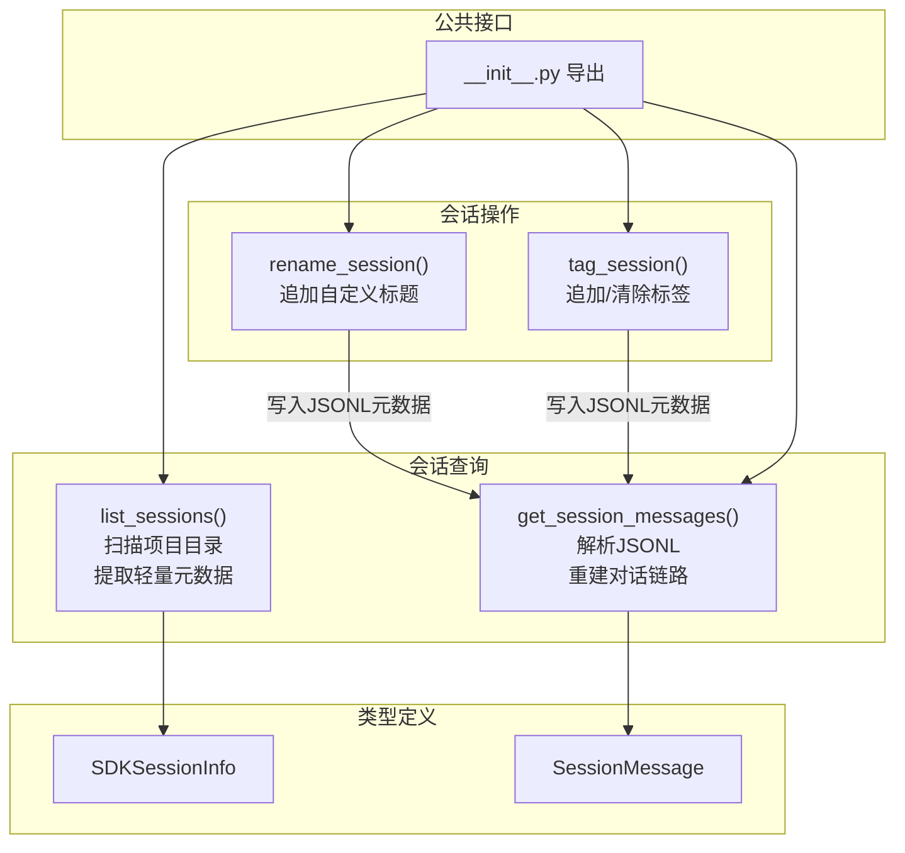
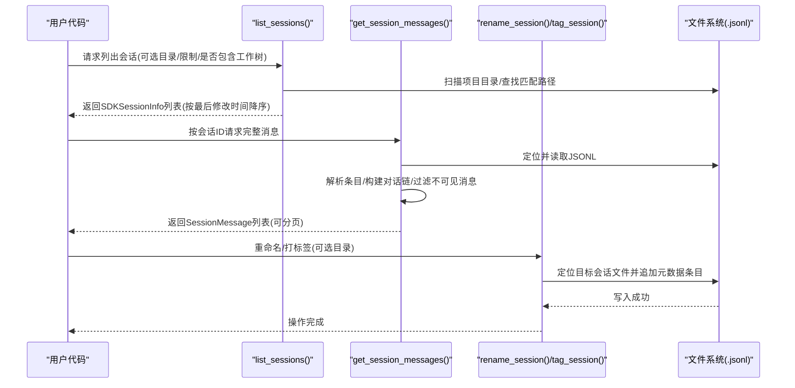
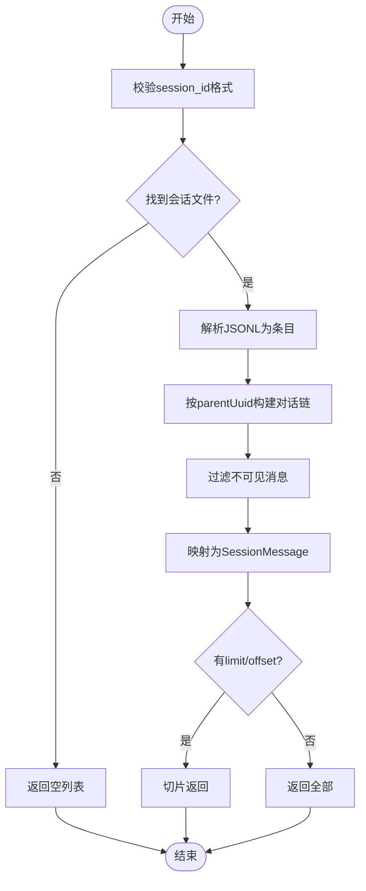
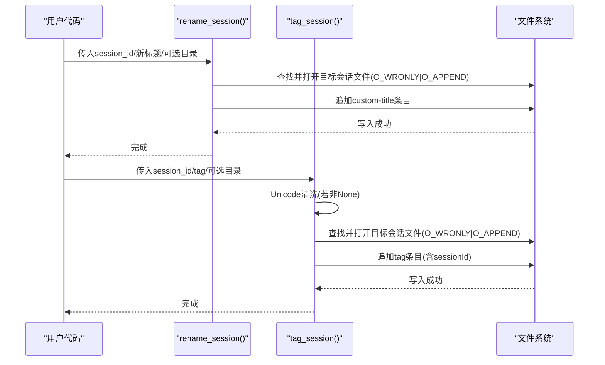
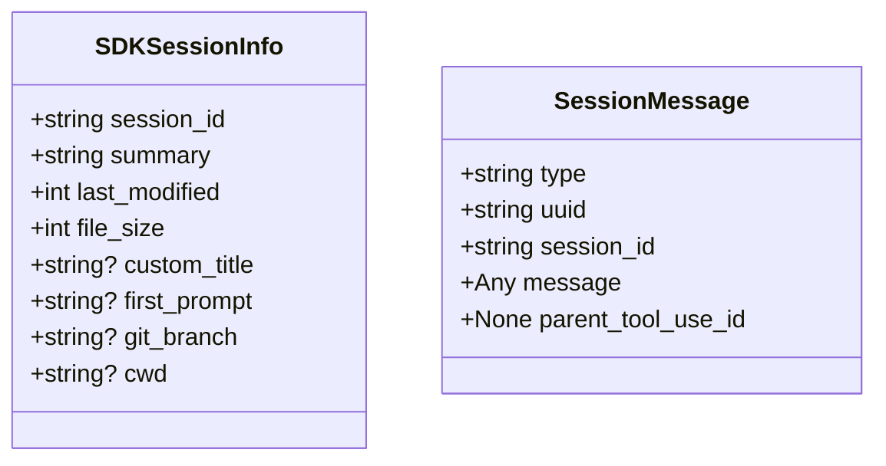
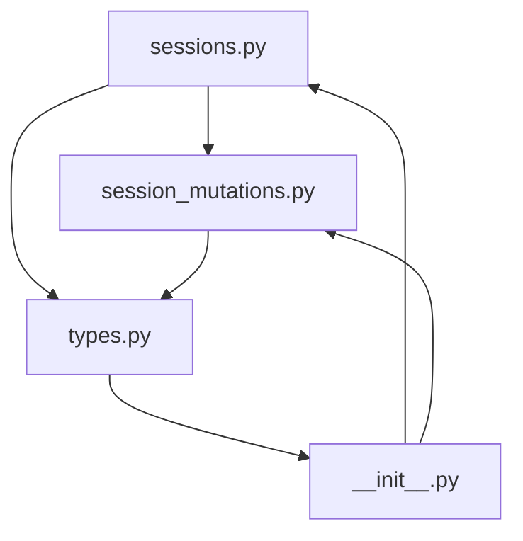

# 会话管理 API

<cite>
**本文档引用的文件**
- [src/claude_agent_sdk/_internal/sessions.py](file://src/claude_agent_sdk/_internal/sessions.py)
- [src/claude_agent_sdk/_internal/session_mutations.py](file://src/claude_agent_sdk/_internal/session_mutations.py)
- [src/claude_agent_sdk/types.py](file://src/claude_agent_sdk/types.py)
- [src/claude_agent_sdk/__init__.py](file://src/claude_agent_sdk/__init__.py)
- [tests/test_sessions.py](file://tests/test_sessions.py)
</cite>

## 目录
1. [简介](#简介)
2. [项目结构](#项目结构)
3. [核心组件](#核心组件)
4. [架构概览](#架构概览)
5. [详细组件分析](#详细组件分析)
6. [依赖关系分析](#依赖关系分析)
7. [性能考量](#性能考量)
8. [故障排除指南](#故障排除指南)
9. [结论](#结论)
10. [附录](#附录)

## 简介
本文件系统性地阐述 Claude Agent SDK 中的会话管理 API，涵盖会话查询与操作两大类功能：  
- 查询类：list_sessions()（列出会话）、get_session_messages()（获取会话消息）  
- 操作类：rename_session()（重命名会话）、tag_session()（为会话打标签）

同时，文档解释 SDKSessionInfo、SessionMessage 等核心类型，说明会话生命周期与状态跟踪机制，提供数据获取与处理方法、最佳实践与性能优化建议，并阐明会话与客户端实例的关系及完整的使用示例。

## 项目结构
会话管理相关代码主要分布在以下模块中：
- 会话查询与重建：src/claude_agent_sdk/_internal/sessions.py
- 会话元数据写入（重命名/打标签）：src/claude_agent_sdk/_internal/session_mutations.py
- 类型定义：src/claude_agent_sdk/types.py
- 公共导出入口：src/claude_agent_sdk/__init__.py
- 行为验证与边界条件测试：tests/test_sessions.py

**图表来源**
- [src/claude_agent_sdk/_internal/sessions.py:593-927](file://src/claude_agent_sdk/_internal/sessions.py#L593-L927)
- [src/claude_agent_sdk/_internal/session_mutations.py:42-161](file://src/claude_agent_sdk/_internal/session_mutations.py#L42-L161)
- [src/claude_agent_sdk/types.py:960-1011](file://src/claude_agent_sdk/types.py#L960-L1011)
- [src/claude_agent_sdk/__init__.py:16-17](file://src/claude_agent_sdk/__init__.py#L16-L17)

**章节来源**
- [src/claude_agent_sdk/_internal/sessions.py:1-927](file://src/claude_agent_sdk/_internal/sessions.py#L1-L927)
- [src/claude_agent_sdk/_internal/session_mutations.py:1-302](file://src/claude_agent_sdk/_internal/session_mutations.py#L1-L302)
- [src/claude_agent_sdk/types.py:960-1011](file://src/claude_agent_sdk/types.py#L960-L1011)
- [src/claude_agent_sdk/__init__.py:16-17](file://src/claude_agent_sdk/__init__.py#L16-L17)

## 核心组件
- list_sessions()：在指定项目或全项目范围内扫描会话，基于 stat + 头尾截取读取元数据，返回 SDKSessionInfo 列表。支持限制数量、是否包含 git 工作树、去重与按最后修改时间排序。
- get_session_messages()：根据会话 UUID 读取完整 JSONL 转录，解析为条目后重建对话链（依据 parentUuid），过滤非可见消息，输出 SessionMessage 列表，支持分页。
- rename_session()：向会话 JSONL 追加自定义标题条目，实现安全重命名；重复调用时以文件末尾最后一个为准。
- tag_session()：向会话 JSONL 追加标签条目，支持清除标签（传入 None）；标签在存储前进行 Unicode 清洗。
- 类型 SDKSessionInfo：list_sessions() 返回的会话元信息，包含会话 ID、摘要、最后修改时间、文件大小、自定义标题、首条提示、Git 分支、工作目录等。
- 类型 SessionMessage：get_session_messages() 返回的消息对象，包含类型、UUID、会话 ID、原始消息体、父工具调用 ID 等。

**章节来源**
- [src/claude_agent_sdk/_internal/sessions.py:593-927](file://src/claude_agent_sdk/_internal/sessions.py#L593-L927)
- [src/claude_agent_sdk/_internal/session_mutations.py:42-161](file://src/claude_agent_sdk/_internal/session_mutations.py#L42-L161)
- [src/claude_agent_sdk/types.py:960-1011](file://src/claude_agent_sdk/types.py#L960-L1011)

## 架构概览
会话管理 API 的整体交互流程如下：

**图表来源**
- [src/claude_agent_sdk/_internal/sessions.py:593-927](file://src/claude_agent_sdk/_internal/sessions.py#L593-L927)
- [src/claude_agent_sdk/_internal/session_mutations.py:42-161](file://src/claude_agent_sdk/_internal/session_mutations.py#L42-L161)

## 详细组件分析

### 组件 A：会话查询 API
- list_sessions()
  - 功能要点
    - 支持按项目目录扫描，或跨所有项目扫描
    - 支持包含 git 工作树扫描，自动处理长路径哈希不一致问题
    - 基于 stat + 头尾截取读取元数据，避免全文件解析
    - 过滤 sidechain、仅元数据会话、非 UUID 文件名等
    - 去重（保留最新 last_modified）
    - 排序（按 last_modified 降序）
  - 返回值：SDKSessionInfo 列表
  - 示例场景：项目内快速浏览最近会话、跨项目聚合展示、配合 limit 控制返回数量
- get_session_messages()
  - 功能要点
    - 读取完整 JSONL，解析为条目集合
    - 通过 parentUuid 构建对话链，优先选择主链叶子节点
    - 过滤非 user/assistant、isMeta、isSidechain、teamName 等不可见消息
    - 输出 SessionMessage 列表，支持 offset/limit 分页
  - 返回值：SessionMessage 列表
  - 示例场景：历史对话回放、分页加载、内容分析与统计

**图表来源**
- [src/claude_agent_sdk/_internal/sessions.py:838-927](file://src/claude_agent_sdk/_internal/sessions.py#L838-L927)

**章节来源**
- [src/claude_agent_sdk/_internal/sessions.py:593-927](file://src/claude_agent_sdk/_internal/sessions.py#L593-L927)
- [tests/test_sessions.py:242-553](file://tests/test_sessions.py#L242-L553)

### 组件 B：会话操作 API
- rename_session()
  - 行为：向会话 JSONL 追加 custom-title 条目，多次调用以文件末尾为准
  - 参数：session_id、新标题、可选项目目录
  - 错误：无效 UUID 抛异常；找不到文件抛异常
- tag_session()
  - 行为：向会话 JSONL 追加 tag 条目；传入 None 可清空标签
  - 标签清洗：去除危险 Unicode 字符，确保 CLI 过滤兼容
  - 参数：session_id、标签字符串或 None、可选项目目录
  - 错误：无效 UUID 抛异常；标签为空白抛异常；找不到文件抛异常

**图表来源**
- [src/claude_agent_sdk/_internal/session_mutations.py:42-161](file://src/claude_agent_sdk/_internal/session_mutations.py#L42-L161)

**章节来源**
- [src/claude_agent_sdk/_internal/session_mutations.py:42-161](file://src/claude_agent_sdk/_internal/session_mutations.py#L42-L161)

### 组件 C：类型定义
- SDKSessionInfo
  - 字段：session_id、summary、last_modified、file_size、custom_title、first_prompt、git_branch、cwd
  - 用途：list_sessions() 返回的元信息载体
- SessionMessage
  - 字段：type（"user" 或 "assistant"）、uuid、session_id、message（原始消息字典）、parent_tool_use_id（始终为 None）
  - 用途：get_session_messages() 返回的历史消息载体

**图表来源**
- [src/claude_agent_sdk/types.py:960-1011](file://src/claude_agent_sdk/types.py#L960-L1011)

**章节来源**
- [src/claude_agent_sdk/types.py:960-1011](file://src/claude_agent_sdk/types.py#L960-L1011)

### 组件 D：会话生命周期与状态跟踪
- 生命周期阶段
  - 创建：首次生成 .jsonl 会话文件，写入第一条 user 消息
  - 运行：持续追加 user/assistant/progress/system/attachment 等条目
  - 元数据变更：通过追加 custom-title/tag 条目实现重命名/打标签
  - 结束：会话文件保持不变，可通过 list_sessions() 持续检索
- 状态跟踪
  - last_modified：由文件系统 mtime 转换而来（毫秒级）
  - summary：优先 customTitle，其次 summary，再次首条用户提示
  - git_branch/cwd：从文件头/尾部元数据提取，尾部优先
  - sidechain：过滤 sidechain 会话，避免干扰
- 并发与一致性
  - 写入采用 O_WRONLY|O_APPEND，避免 TOCTOU 风险
  - CLI 侧对尾部扫描进行缓存合并，SDK 写入会被吸收并以最新值为准

**章节来源**
- [src/claude_agent_sdk/_internal/sessions.py:593-927](file://src/claude_agent_sdk/_internal/sessions.py#L593-L927)
- [src/claude_agent_sdk/_internal/session_mutations.py:168-256](file://src/claude_agent_sdk/_internal/session_mutations.py#L168-L256)

### 组件 E：会话与客户端实例的关系
- 会话与客户端实例无强绑定：会话数据位于文件系统（~/.claude/projects/.../*.jsonl），API 通过目录参数定位或全局扫描
- 客户端实例（ClaudeSDKClient）用于实时交互与流式消息，会话管理 API 用于离线查询与元数据操作
- 使用建议：在需要离线分析或批量处理时，优先使用会话管理 API；在需要实时对话时使用客户端实例

**章节来源**
- [src/claude_agent_sdk/__init__.py:16-17](file://src/claude_agent_sdk/__init__.py#L16-L17)

## 依赖关系分析
- list_sessions() 依赖文件系统扫描、路径规范化、Git 工作树检测、轻量元数据提取
- get_session_messages() 依赖完整 JSONL 解析、parentUuid 链路重建、可见性过滤、消息映射
- rename_session()/tag_session() 依赖会话文件定位、原子追加写入、Unicode 清洗
- 类型 SDKSessionInfo/SessionMessage 作为数据契约，被查询与操作 API 广泛使用

**图表来源**
- [src/claude_agent_sdk/_internal/sessions.py:1-927](file://src/claude_agent_sdk/_internal/sessions.py#L1-L927)
- [src/claude_agent_sdk/_internal/session_mutations.py:1-302](file://src/claude_agent_sdk/_internal/session_mutations.py#L1-L302)
- [src/claude_agent_sdk/types.py:960-1011](file://src/claude_agent_sdk/types.py#L960-L1011)
- [src/claude_agent_sdk/__init__.py:16-17](file://src/claude_agent_sdk/__init__.py#L16-L17)

**章节来源**
- [src/claude_agent_sdk/_internal/sessions.py:1-927](file://src/claude_agent_sdk/_internal/sessions.py#L1-L927)
- [src/claude_agent_sdk/_internal/session_mutations.py:1-302](file://src/claude_agent_sdk/_internal/session_mutations.py#L1-L302)
- [src/claude_agent_sdk/types.py:960-1011](file://src/claude_agent_sdk/types.py#L960-L1011)
- [src/claude_agent_sdk/__init__.py:16-17](file://src/claude_agent_sdk/__init__.py#L16-L17)

## 性能考量
- list_sessions() 采用“stat + 头尾截取”策略，避免全文件解析，适合大规模项目目录扫描
- get_session_messages() 需要完整解析 JSONL，建议配合 limit/offset 实现分页，避免一次性加载过多消息
- rename_session()/tag_session() 为小开销追加写入，但需注意并发写入冲突；CLI 侧具备尾部扫描合并能力，多次调用不会产生重复元数据
- Git 工作树扫描可能带来额外 IO，如不需要可关闭 include_worktrees 以提升性能

[本节为通用指导，无需特定文件引用]

## 故障排除指南
- list_sessions() 返回空列表
  - 检查 CLAUDE_CONFIG_DIR 是否正确设置
  - 确认项目目录存在且包含 .jsonl 文件
  - 若为长路径，确认哈希后缀匹配或启用工作树扫描
- get_session_messages() 返回空列表
  - 确认 session_id 为有效 UUID
  - 确认会话文件存在且非空
  - 检查是否存在仅元数据/无可见消息的情况
- rename_session()/tag_session() 抛出异常
  - 无效 UUID：检查输入格式
  - 标题/标签为空白：确保去除空白后非空
  - 文件未找到：确认目录参数与实际存储位置一致
- 并发写入冲突
  - SDK 写入采用原子追加模式，CLI 侧会吸收尾部扫描窗口内的写入，最终以最新值为准

**章节来源**
- [tests/test_sessions.py:242-553](file://tests/test_sessions.py#L242-L553)
- [src/claude_agent_sdk/_internal/session_mutations.py:42-161](file://src/claude_agent_sdk/_internal/session_mutations.py#L42-L161)

## 结论
会话管理 API 提供了高效、可靠的会话查询与操作能力：  
- list_sessions() 以极低开销覆盖大规模项目扫描与聚合展示  
- get_session_messages() 精确重建对话链，支持分页与过滤  
- rename_session()/tag_session() 通过原子追加实现安全的元数据变更  
结合类型 SDKSessionInfo/SessionMessage，开发者可以轻松实现会话浏览、历史回放、元数据管理与批量分析等场景。

[本节为总结性内容，无需特定文件引用]

## 附录

### API 参考与示例路径
- list_sessions() 用法示例
  - [示例路径:616-631](file://src/claude_agent_sdk/_internal/sessions.py#L616-L631)
- get_session_messages() 用法示例
  - [示例路径:893-908](file://src/claude_agent_sdk/_internal/sessions.py#L893-L908)
- rename_session() 用法示例
  - [示例路径:65-73](file://src/claude_agent_sdk/_internal/session_mutations.py#L65-L73)
- tag_session() 用法示例
  - [示例路径:127-139](file://src/claude_agent_sdk/_internal/session_mutations.py#L127-L139)

### 最佳实践
- 列表查询
  - 合理设置 limit，避免一次性返回过多会话
  - 在需要时开启 include_worktrees，确保跨工作树会话可见
  - 使用 last_modified 排序，结合 offset/limit 实现分页
- 历史读取
  - 对大会话使用 limit/offset 分页，避免内存压力
  - 如需稳定排序，先按 last_modified 排序再分页
- 元数据变更
  - 重命名与打标签为幂等操作，多次调用以最后一次为准
  - 标签应进行 Unicode 清洗，避免注入风险
- 并发与一致性
  - 与其他进程（如 CLI）同时写入时，遵循 SDK 的原子追加策略
  - 如遇冲突，等待 CLI 合并后再发起下一次写入

**章节来源**
- [src/claude_agent_sdk/_internal/sessions.py:593-927](file://src/claude_agent_sdk/_internal/sessions.py#L593-L927)
- [src/claude_agent_sdk/_internal/session_mutations.py:42-161](file://src/claude_agent_sdk/_internal/session_mutations.py#L42-L161)