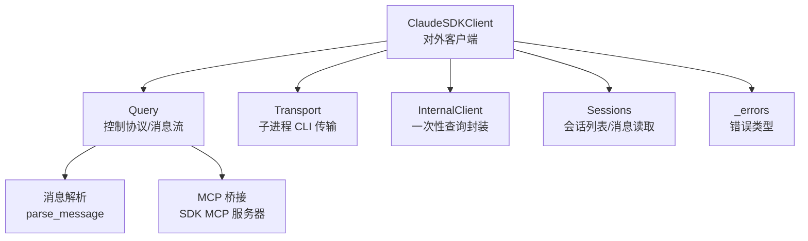
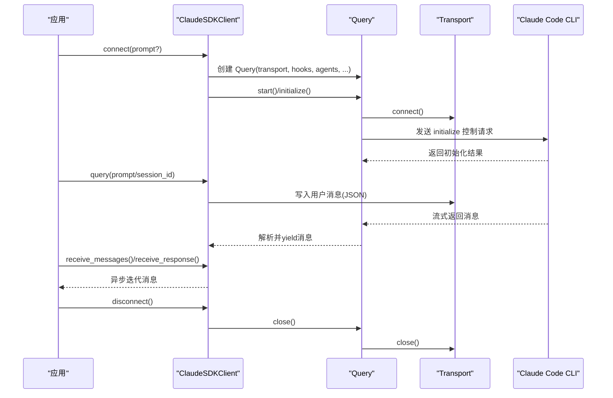
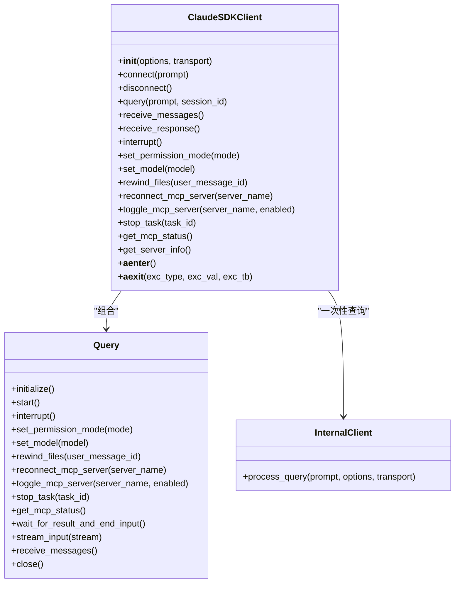
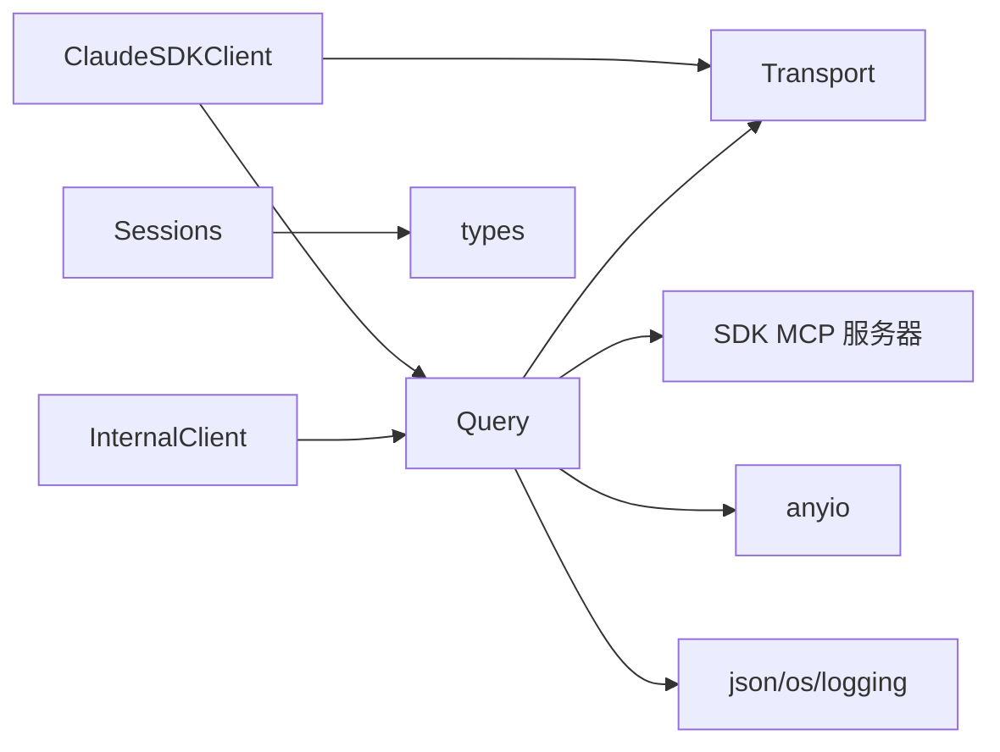

# 客户端 API

<cite>
**本文引用的文件**
- [client.py](file://src/claude_agent_sdk/client.py)
- [_internal/client.py](file://src/claude_agent_sdk/_internal/client.py)
- [query.py](file://src/claude_agent_sdk/query.py)
- [_internal/query.py](file://src/claude_agent_sdk/_internal/query.py)
- [types.py](file://src/claude_agent_sdk/types.py)
- [_errors.py](file://src/claude_agent_sdk/_errors.py)
- [sessions.py](file://src/claude_agent_sdk/_internal/sessions.py)
- [streaming_mode.py](file://examples/streaming_mode.py)
- [README.md](file://README.md)
</cite>

## 目录
1. [简介](#简介)
2. [项目结构](#项目结构)
3. [核心组件](#核心组件)
4. [架构总览](#架构总览)
5. [详细组件分析](#详细组件分析)
6. [依赖关系分析](#依赖关系分析)
7. [性能考量](#性能考量)
8. [故障排查指南](#故障排查指南)
9. [结论](#结论)
10. [附录](#附录)

## 简介
本文件为 ClaudeSDKClient 类的完整 API 文档，覆盖构造函数与初始化选项、实例方法（含 query 的多种重载）、会话管理、异步使用模式、生命周期与资源清理、错误处理与超时配置等。文档同时给出与内部 Query 控制协议、消息解析、MCP 服务器桥接相关的架构说明，并提供来自示例脚本中的最佳实践参考路径。

## 项目结构
- 入口类：ClaudeSDKClient（对外公开）
- 内部实现：
  - Query：控制协议、消息流、工具权限回调、MCP 桥接、任务控制等
  - InternalClient：一次性查询流程封装
  - Sessions：会话列表与消息读取
- 类型与错误：
  - types：消息类型、选项、钩子、MCP 状态、会话信息等
  - _errors：错误类型

图表来源
- [client.py:21-500](file://src/claude_agent_sdk/client.py#L21-L500)
- [_internal/query.py:53-679](file://src/claude_agent_sdk/_internal/query.py#L53-L679)
- [types.py:1030-1199](file://src/claude_agent_sdk/types.py#L1030-L1199)
- [_errors.py:1-57](file://src/claude_agent_sdk/_errors.py#L1-L57)
- [sessions.py:593-634](file://src/claude_agent_sdk/_internal/sessions.py#L593-L634)

章节来源
- [client.py:21-500](file://src/claude_agent_sdk/client.py#L21-L500)
- [types.py:1030-1199](file://src/claude_agent_sdk/types.py#L1030-L1199)

## 核心组件
- ClaudeSDKClient：面向交互式、双向对话的客户端，支持中断、权限模式切换、模型切换、MCP 服务器管理、任务停止、文件回溯、服务器信息查询、消息接收等。
- Query：内部控制协议与消息流处理，负责初始化握手、工具权限决策、钩子回调、MCP 请求转发、结果等待与输入关闭策略。
- InternalClient：一次性查询流程封装，适合无状态、单向流式交互。
- Sessions：会话列表与历史消息读取，提供 SDKSessionInfo 与 SessionMessage 类型。
- 错误体系：CLIConnectionError、CLINotFoundError、ProcessError、CLIJSONDecodeError、MessageParseError 等。

章节来源
- [client.py:21-500](file://src/claude_agent_sdk/client.py#L21-L500)
- [_internal/query.py:53-679](file://src/claude_agent_sdk/_internal/query.py#L53-L679)
- [types.py:955-1199](file://src/claude_agent_sdk/types.py#L955-L1199)
- [_errors.py:1-57](file://src/claude_agent_sdk/_errors.py#L1-L57)

## 架构总览
ClaudeSDKClient 在 connect() 后创建并启动 Query，Query 通过 Transport 与 Claude Code CLI 建立双向控制通道。Query 负责：
- 初始化握手（initialize），发送钩子与代理定义
- 接收消息并解析为 SDK 消息类型
- 处理控制请求（工具权限、钩子回调、MCP 消息、任务控制等）
- 输入流控制（在存在 SDK MCP 或钩子时等待首个结果后再关闭 stdin）

图表来源
- [client.py:94-185](file://src/claude_agent_sdk/client.py#L94-L185)
- [_internal/query.py:165-171](file://src/claude_agent_sdk/_internal/query.py#L165-L171)
- [_internal/query.py:119-163](file://src/claude_agent_sdk/_internal/query.py#L119-L163)
- [_internal/query.py:648-657](file://src/claude_agent_sdk/_internal/query.py#L648-L657)

## 详细组件分析

### ClaudeSDKClient 类 API

- 构造函数
  - 参数
    - options: ClaudeAgentOptions | None，默认 None 时使用默认构造
    - transport: Transport | None，默认 None 时使用 SubprocessCLITransport
  - 行为
    - 设置 options 与自定义 transport
    - 设置环境变量 CLAUDE_CODE_ENTRYPOINT
  - 注意
    - 若 options.can_use_tool 为真，prompt 必须为 AsyncIterable；否则抛出 ValueError
    - can_use_tool 与 permission_prompt_tool_name 互斥

章节来源
- [client.py:62-75](file://src/claude_agent_sdk/client.py#L62-L75)
- [client.py:112-127](file://src/claude_agent_sdk/client.py#L112-L127)
- [types.py:1030-1100](file://src/claude_agent_sdk/types.py#L1030-L1100)

- 连接与生命周期
  - connect(prompt: str | AsyncIterable[dict[str, Any]] | None = None) -> None
    - 自动以空 AsyncIterable 作为 prompt（仅保持连接）若未提供
    - 配置 can_use_tool 时自动设置 permission_prompt_tool_name="stdio"
    - 使用自定义 transport 或创建 SubprocessCLITransport
    - 初始化 Query，启动读取任务并执行 initialize
    - 若传入 AsyncIterable prompt，后台启动 stream_input
  - disconnect() -> None：关闭 Query 并释放 transport
  - 上下文管理器：__aenter__/__aexit__，进入时 connect，退出时 disconnect

章节来源
- [client.py:94-185](file://src/claude_agent_sdk/client.py#L94-L185)
- [client.py:484-500](file://src/claude_agent_sdk/client.py#L484-L500)

- 查询与消息流
  - query(prompt: str | AsyncIterable[dict[str, Any]], session_id: str = "default") -> None
    - 字符串 prompt：序列化为用户消息并写入 transport
    - AsyncIterable prompt：逐条写入，确保每条包含 session_id
  - receive_messages() -> AsyncIterator[Message]
    - 从 Query 接收原始消息并解析为 SDK 消息类型
    - 未连接时抛 CLIConnectionError
  - receive_response() -> AsyncIterator[Message]
    - receive_messages() 的便捷包装，遇到 ResultMessage 即终止（包含该 ResultMessage）

章节来源
- [client.py:198-227](file://src/claude_agent_sdk/client.py#L198-L227)
- [client.py:186-197](file://src/claude_agent_sdk/client.py#L186-L197)
- [client.py:443-483](file://src/claude_agent_sdk/client.py#L443-L483)

- 控制协议与运行时操作
  - interrupt() -> None：发送中断请求（需处于流式模式）
  - set_permission_mode(mode: str) -> None：设置权限模式（default/acceptEdits/plan/bypassPermissions）
  - set_model(model: str | None = None) -> None：切换模型
  - rewind_files(user_message_id: str) -> None：回溯到指定用户消息时的文件状态（需启用文件检查点）
  - reconnect_mcp_server(server_name: str) -> None：重连断开或失败的 MCP 服务器
  - toggle_mcp_server(server_name: str, enabled: bool) -> None：启用/禁用 MCP 服务器
  - stop_task(task_id: str) -> None：停止运行中的任务
  - get_mcp_status() -> McpStatusResponse：查询 MCP 服务器连接状态
  - get_server_info() -> dict[str, Any] | None：获取服务器初始化信息（命令、输出样式等）

章节来源
- [client.py:228-417](file://src/claude_agent_sdk/client.py#L228-L417)
- [client.py:418-442](file://src/claude_agent_sdk/client.py#L418-L442)

- 会话管理（外部 API）
  - list_sessions(directory: str | None = None, limit: int | None = None, include_worktrees: bool = True) -> list[SDKSessionInfo]
    - 列出会话元数据（摘要、最后修改时间、大小、自定义标题、首提示、Git 分支、工作目录）
  - get_session_messages(session_id: str, directory: str | None = None) -> list[SessionMessage]
    - 读取历史会话消息（按时间链重建对话）

章节来源
- [sessions.py:593-634](file://src/claude_agent_sdk/_internal/sessions.py#L593-L634)
- [types.py:960-1011](file://src/claude_agent_sdk/types.py#L960-L1011)

- 异常与错误处理
  - CLIConnectionError：未连接时调用方法抛出
  - 其他错误：CLINotFoundError、ProcessError、CLIJSONDecodeError、MessageParseError

章节来源
- [client.py:188-189](file://src/claude_agent_sdk/client.py#L188-L189)
- [_errors.py:1-57](file://src/claude_agent_sdk/_errors.py#L1-L57)

- 异步使用与最佳实践
  - 示例参考：examples/streaming_mode.py 展示了基本流式、并发收发、中断、手动消息处理、带选项查询、工具使用块识别、控制协议能力与错误处理等模式
  - 关键建议：
    - 使用 async with ClaudeSDKClient() 确保连接与断开
    - 在需要中断能力时，必须持续消费 receive_messages/receive_response
    - 对于 can_use_tool，prompt 必须为 AsyncIterable
    - 使用 receive_response() 获取完整响应（包含 ResultMessage）后结束当前轮次

章节来源
- [streaming_mode.py:59-512](file://examples/streaming_mode.py#L59-L512)
- [client.py:94-127](file://src/claude_agent_sdk/client.py#L94-L127)

### Query 类（内部控制协议）
- 主要职责
  - 初始化握手、控制请求路由、钩子回调、工具权限决策、SDK MCP 服务器桥接、任务控制、输入流控制
- 关键方法
  - initialize()：发送 initialize 控制请求，返回初始化结果
  - start()：启动读取消息的任务组
  - _read_messages()：读取并分发消息，处理控制请求/响应、错误传播、流结束信号
  - _handle_control_request()：分派 can_use_tool、hook_callback、mcp_message 等
  - _send_control_request()：发送控制请求并等待响应，支持超时
  - _handle_sdk_mcp_request()：对 SDK MCP 服务器进行方法分派（tools/list、tools/call 等）
  - get_mcp_status()、interrupt()、set_permission_mode()、set_model()、rewind_files()、reconnect_mcp_server()、toggle_mcp_server()、stop_task()
  - wait_for_result_and_end_input()、stream_input()：输入流控制逻辑
  - receive_messages()、close()

章节来源
- [_internal/query.py:53-679](file://src/claude_agent_sdk/_internal/query.py#L53-L679)

### InternalClient（一次性查询）
- 主要职责
  - 将 query() 函数封装为内部流程：创建 Transport、构建 Query、初始化、发送 prompt、流式接收消息、最终关闭
- 关键点
  - 支持字符串 prompt（发送后等待结果并结束输入）与 AsyncIterable prompt（后台流式发送）
  - 严格遵循 can_use_tool 与 permission_prompt_tool_name 的互斥规则

章节来源
- [_internal/client.py:44-146](file://src/claude_agent_sdk/_internal/client.py#L44-L146)

### 类图（代码级）

图表来源
- [client.py:21-500](file://src/claude_agent_sdk/client.py#L21-L500)
- [_internal/query.py:53-679](file://src/claude_agent_sdk/_internal/query.py#L53-L679)
- [_internal/client.py:20-146](file://src/claude_agent_sdk/_internal/client.py#L20-L146)

## 依赖关系分析
- 组件耦合
  - ClaudeSDKClient 依赖 Query 与 Transport，负责高层 API 与生命周期管理
  - Query 依赖 Transport、消息解析、MCP 服务器桥接、anyio 任务组
  - InternalClient 与 Query 共享控制协议与消息处理逻辑
- 外部依赖
  - mcp.types（用于 SDK MCP 服务器方法分派）
  - anyio（任务组、内存对象流、超时）
  - json、os、logging 等标准库

图表来源
- [client.py:94-185](file://src/claude_agent_sdk/client.py#L94-L185)
- [_internal/query.py:53-679](file://src/claude_agent_sdk/_internal/query.py#L53-L679)
- [_internal/client.py:44-146](file://src/claude_agent_sdk/_internal/client.py#L44-L146)
- [sessions.py:593-634](file://src/claude_agent_sdk/_internal/sessions.py#L593-L634)
- [types.py:1030-1199](file://src/claude_agent_sdk/types.py#L1030-L1199)

章节来源
- [client.py:94-185](file://src/claude_agent_sdk/client.py#L94-L185)
- [_internal/query.py:53-679](file://src/claude_agent_sdk/_internal/query.py#L53-L679)
- [_internal/client.py:44-146](file://src/claude_agent_sdk/_internal/client.py#L44-L146)
- [sessions.py:593-634](file://src/claude_agent_sdk/_internal/sessions.py#L593-L634)

## 性能考量
- 流式输入与输出
  - Query 在存在 SDK MCP 或钩子时，等待首个结果到达后再关闭 stdin，避免控制协议通信丢失
  - receive_messages() 使用内存对象流缓冲，可配置 max_buffer_size（通过 options.max_buffer_size）
- 任务组与并发
  - Query 使用 anyio 任务组并行处理消息读取与输入流，提高吞吐
- 超时与资源回收
  - initialize 请求使用可配置超时（CLAUDE_CODE_STREAM_CLOSE_TIMEOUT 环境变量影响）
  - disconnect/close 时取消任务组并关闭传输，防止资源泄漏

章节来源
- [_internal/query.py:115-118](file://src/claude_agent_sdk/_internal/query.py#L115-L118)
- [_internal/query.py:614-631](file://src/claude_agent_sdk/_internal/query.py#L614-L631)
- [_internal/query.py:659-668](file://src/claude_agent_sdk/_internal/query.py#L659-L668)
- [client.py:150-156](file://src/claude_agent_sdk/client.py#L150-L156)

## 故障排查指南
- 常见错误
  - CLIConnectionError：未调用 connect() 直接使用方法
  - CLINotFoundError：找不到 Claude Code CLI
  - ProcessError：CLI 进程失败（含 exit_code 与 stderr）
  - CLIJSONDecodeError：无法解析 CLI 输出的 JSON
  - MessageParseError：消息解析失败
- 调试建议
  - 使用 options.stderr 回调或环境变量查看 CLI 输出
  - 在需要中断能力时，确保持续消费消息流
  - 对于 can_use_tool，确保 prompt 为 AsyncIterable
  - 使用 examples/streaming_mode.py 中的错误处理示例作为参考

章节来源
- [_errors.py:1-57](file://src/claude_agent_sdk/_errors.py#L1-L57)
- [client.py:112-127](file://src/claude_agent_sdk/client.py#L112-L127)
- [streaming_mode.py:421-465](file://examples/streaming_mode.py#L421-L465)

## 结论
ClaudeSDKClient 提供了面向交互式、双向对话的完整能力，结合 Query 的控制协议与消息流管理，能够灵活处理工具权限、钩子、MCP 服务器、任务控制与文件回溯等高级场景。通过合理的异步使用模式、超时配置与资源清理，可在复杂应用中稳定运行。会话管理方面，可通过 sessions 模块读取历史会话与消息，辅助构建更丰富的用户体验。

## 附录

### 方法参数与返回值速查
- connect(prompt: str | AsyncIterable[dict[str, Any]] | None = None) -> None
- query(prompt: str | AsyncIterable[dict[str, Any]], session_id: str = "default") -> None
- receive_messages() -> AsyncIterator[Message]
- receive_response() -> AsyncIterator[Message]
- interrupt() -> None
- set_permission_mode(mode: str) -> None
- set_model(model: str | None = None) -> None
- rewind_files(user_message_id: str) -> None
- reconnect_mcp_server(server_name: str) -> None
- toggle_mcp_server(server_name: str, enabled: bool) -> None
- stop_task(task_id: str) -> None
- get_mcp_status() -> McpStatusResponse
- get_server_info() -> dict[str, Any] | None
- disconnect() -> None

章节来源
- [client.py:94-442](file://src/claude_agent_sdk/client.py#L94-L442)

### 选项与类型参考
- ClaudeAgentOptions：工具、系统提示、MCP 服务器、权限模式、工作目录、环境变量、钩子、部分消息流、文件检查点、代理定义、插件、思维配置、输出格式等
- Message/ContentBlock：UserMessage、AssistantMessage、SystemMessage、ResultMessage、TextBlock、ToolUseBlock、ToolResultBlock、ThinkingBlock、StreamEvent、RateLimitEvent
- McpStatusResponse/McpServerStatus：MCP 服务器状态与工具信息

章节来源
- [types.py:1030-1199](file://src/claude_agent_sdk/types.py#L1030-L1199)

### 示例与最佳实践参考
- examples/streaming_mode.py：展示了基本流式、并发收发、中断、手动消息处理、带选项查询、工具使用块识别、控制协议能力与错误处理等

章节来源
- [streaming_mode.py:59-512](file://examples/streaming_mode.py#L59-L512)