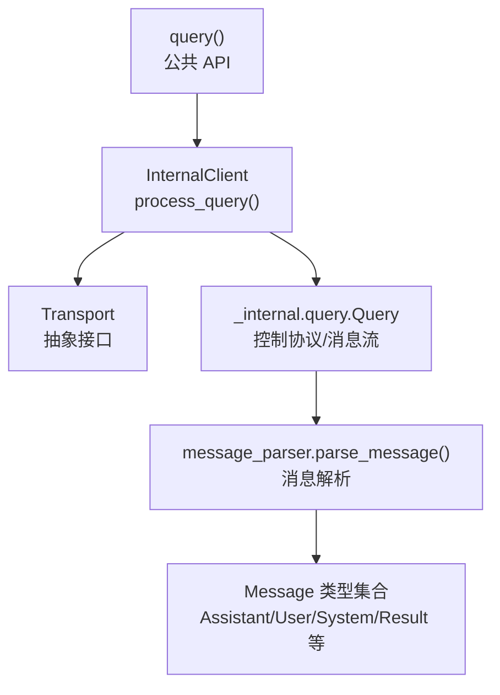
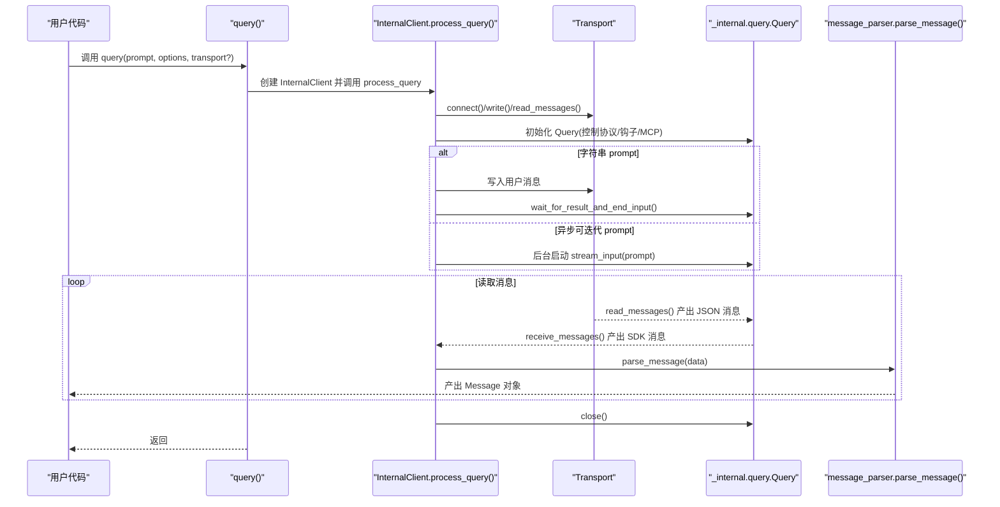
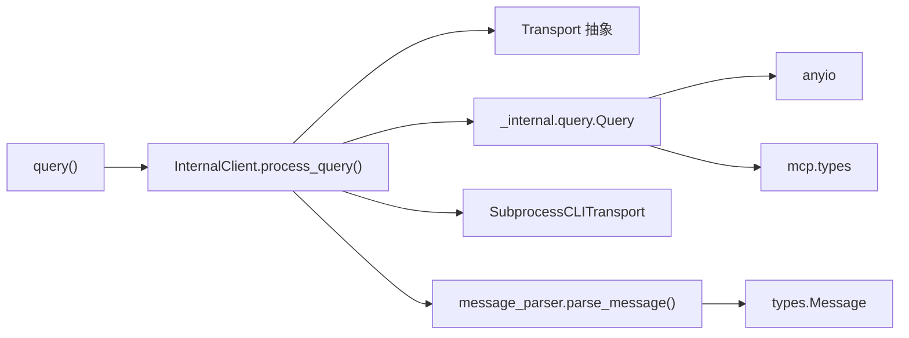

# 查询 API

<cite>
**本文引用的文件**
- [query.py](file://src/claude_agent_sdk/query.py)
- [client.py（内部）](file://src/claude_agent_sdk/_internal/client.py)
- [query.py（内部）](file://src/claude_agent_sdk/_internal/query.py)
- [types.py](file://src/claude_agent_sdk/types.py)
- [_errors.py](file://src/claude_agent_sdk/_errors.py)
- [client.py（公共）](file://src/claude_agent_sdk/client.py)
- [quick_start.py](file://examples/quick_start.py)
- [streaming_mode.py](file://examples/streaming_mode.py)
- [test_query.py](file://tests/test_query.py)
</cite>

## 目录
1. [简介](#简介)
2. [项目结构](#项目结构)
3. [核心组件](#核心组件)
4. [架构总览](#架构总览)
5. [详细组件分析](#详细组件分析)
6. [依赖分析](#依赖分析)
7. [性能考量](#性能考量)
8. [故障排查指南](#故障排查指南)
9. [结论](#结论)
10. [附录](#附录)

## 简介
本文件为 query() 函数的完整 API 文档，覆盖以下方面：
- 所有重载形式：字符串查询、流式查询、异步迭代器查询
- 函数参数与配置项：prompt、ClaudeAgentOptions、自定义 Transport
- 返回值与消息类型：异步生成器与消息流
- 使用场景与示例路径：从简单单次查询到复杂配置
- 错误处理与异常类型
- 性能与最佳实践

## 项目结构
query() 是公共 API 的入口，内部通过 InternalClient 调用 _internal.query.Query 与 Transport 进行交互，并在需要时自动创建 SubprocessCLITransport。其消息解析由 message_parser 完成，最终统一产出 SDK 的消息类型集合。

图表来源
- [query.py:12-127](file://src/claude_agent_sdk/query.py#L12-L127)
- [client.py（内部）:44-146](file://src/claude_agent_sdk/_internal/client.py#L44-L146)
- [query.py（内部）:53-679](file://src/claude_agent_sdk/_internal/query.py#L53-L679)
- [types.py:945-952](file://src/claude_agent_sdk/types.py#L945-L952)

章节来源
- [query.py:12-127](file://src/claude_agent_sdk/query.py#L12-L127)
- [client.py（内部）:44-146](file://src/claude_agent_sdk/_internal/client.py#L44-L146)

## 核心组件
- query() 公共 API：接受 prompt、options、transport，返回异步迭代器，逐条产出消息对象。
- InternalClient.process_query()：内部实现，负责连接 Transport、初始化 Query、处理输入、解析消息并关闭资源。
- Query（内部）：封装控制协议、工具权限回调、钩子回调、MCP 服务器桥接、消息流读取与控制请求发送。
- Transport 抽象：定义 connect/write/read_messages/close/is_ready/end_input 等方法，支持自定义实现。
- ClaudeAgentOptions：查询配置，包括系统提示、工具、权限模式、工作目录、MCP 服务器、钩子、思维配置、输出格式等。
- 消息类型：AssistantMessage、UserMessage、SystemMessage、ResultMessage、StreamEvent、RateLimitEvent 等。

章节来源
- [query.py:12-127](file://src/claude_agent_sdk/query.py#L12-L127)
- [client.py（内部）:44-146](file://src/claude_agent_sdk/_internal/client.py#L44-L146)
- [query.py（内部）:53-679](file://src/claude_agent_sdk/_internal/query.py#L53-L679)
- [types.py:1030-1199](file://src/claude_agent_sdk/types.py#L1030-L1199)

## 架构总览
下图展示 query() 的调用链路与关键交互点。

图表来源
- [query.py:12-127](file://src/claude_agent_sdk/query.py#L12-L127)
- [client.py（内部）:44-146](file://src/claude_agent_sdk/_internal/client.py#L44-L146)
- [query.py（内部）:165-679](file://src/claude_agent_sdk/_internal/query.py#L165-L679)

## 详细组件分析

### 函数签名与重载
- 主要签名
  - async def query(*, prompt: str | AsyncIterable[dict[str, Any]], options: ClaudeAgentOptions | None = None, transport: Transport | None = None) -> AsyncIterator[Message]
- 重载说明
  - 字符串查询：prompt 为 str，内部自动写入一条用户消息并等待结果。
  - 流式查询：prompt 为 AsyncIterable[dict[str, Any]]，内部以后台任务持续写入消息流，直至结束。
  - 自定义 Transport：可传入自定义 Transport 实现，替代默认的 SubprocessCLITransport。

章节来源
- [query.py:12-127](file://src/claude_agent_sdk/query.py#L12-L127)

### 参数详解
- prompt
  - 字符串：表示一次性问题或指令。
  - 异步可迭代字典：每项需包含 type、message（role/content）、parent_tool_use_id、session_id 等字段；用于“单向流式”交互（即先发完所有消息，再接收全部响应）。
- options（ClaudeAgentOptions）
  - 工作目录：cwd
  - 权限模式：permission_mode（default、acceptEdits、plan、bypassPermissions）
  - 系统提示：system_prompt 或 preset
  - 工具：allowed_tools/disallowed_tools/tools/presets
  - MCP 服务器：mcp_servers（支持 stdio/sse/http/sdk/proxy）
  - 钩子：hooks（事件名到匹配器列表）
  - 输出格式：output_format（结构化输出）
  - 思维配置：thinking（adaptive/enabled/disabled 及预算）
  - 其他：模型、最大轮次、预算、环境变量、额外参数、调试回调等
- transport（可选）
  - 自定义 Transport 实现，将覆盖默认的子进程传输。

章节来源
- [query.py:45-63](file://src/claude_agent_sdk/query.py#L45-L63)
- [types.py:1030-1199](file://src/claude_agent_sdk/types.py#L1030-L1199)

### 返回值与消息类型
- 返回值：异步迭代器 AsyncIterator[Message]
- 常见消息类型
  - AssistantMessage：助手回复，包含文本块、思考块、工具使用块、工具结果块
  - UserMessage：用户消息（含工具结果时）
  - SystemMessage：系统消息（如任务通知、速率限制事件等）
  - ResultMessage：会话结果，包含耗时、API 耗时、是否错误、轮次数、会话 ID、总费用等
  - StreamEvent：部分消息更新事件
  - RateLimitEvent：速率限制状态变化事件
- 结束条件：当收到 ResultMessage 或流结束标记时，迭代器自然终止。

章节来源
- [types.py:766-952](file://src/claude_agent_sdk/types.py#L766-L952)
- [query.py（内部）:648-657](file://src/claude_agent_sdk/_internal/query.py#L648-L657)

### 使用场景与示例路径
- 简单单次查询
  - 示例路径：[quick_start.py:15-25](file://examples/quick_start.py#L15-L25)
- 带配置的查询
  - 示例路径：[quick_start.py:27-44](file://examples/quick_start.py#L27-L44)
- 工具使用查询
  - 示例路径：[quick_start.py:46-66](file://examples/quick_start.py#L46-L66)
- 流式单向交互（异步可迭代）
  - 示例路径：[query.py（内部）:632-647](file://src/claude_agent_sdk/_internal/query.py#L632-L647)
- 自定义 Transport
  - 示例路径：[query.py:99-113](file://src/claude_agent_sdk/query.py#L99-L113)

章节来源
- [quick_start.py:15-66](file://examples/quick_start.py#L15-L66)
- [query.py（内部）:632-647](file://src/claude_agent_sdk/_internal/query.py#L632-L647)
- [query.py:99-113](file://src/claude_agent_sdk/query.py#L99-L113)

### 错误处理与异常类型
- 常见异常
  - CLIConnectionError：无法连接 Claude Code
  - CLINotFoundError：未找到 CLI
  - ProcessError：CLI 进程失败（含退出码与标准错误）
  - CLIJSONDecodeError：无法解码 CLI 输出中的 JSON
  - MessageParseError：无法解析消息
- 控制协议错误
  - Query 在内部读取消息时，若收到 error 类型消息，会抛出异常
- 输入校验
  - 当 options.can_use_tool 存在时，prompt 必须为 AsyncIterable；否则抛出 ValueError
- 测试验证
  - 单测覆盖了字符串与异步可迭代两种 prompt 路径在存在 SDK MCP 服务器或钩子时对 stdin 关闭时机的正确行为

章节来源
- [_errors.py:6-57](file://src/claude_agent_sdk/_errors.py#L6-L57)
- [client.py（内部）:52-71](file://src/claude_agent_sdk/_internal/client.py#L52-L71)
- [query.py（内部）:172-235](file://src/claude_agent_sdk/_internal/query.py#L172-L235)
- [test_query.py:114-308](file://tests/test_query.py#L114-L308)

### 内部流程与控制协议要点
- 初始化握手
  - Query.initialize() 发送 initialize 请求，携带 hooks 与 agents 配置
- 控制请求
  - 支持中断、设置权限模式、切换/重连 MCP 服务器、停止任务等
- 输入生命周期
  - 字符串 prompt：写入后等待首个结果，再关闭 stdin
  - 异步可迭代 prompt：后台持续写入，直到流结束，再按策略关闭 stdin
- 消息解析
  - receive_messages() 过滤 end/error 特殊消息，parse_message() 将原始数据转换为 SDK 消息对象

章节来源
- [query.py（内部）:119-164](file://src/claude_agent_sdk/_internal/query.py#L119-L164)
- [query.py（内部）:347-393](file://src/claude_agent_sdk/_internal/query.py#L347-L393)
- [query.py（内部）:614-647](file://src/claude_agent_sdk/_internal/query.py#L614-L647)
- [client.py（内部）:115-146](file://src/claude_agent_sdk/_internal/client.py#L115-L146)

## 依赖分析
- query() 依赖 InternalClient.process_query()，后者依赖 Transport 抽象与 Query 控制协议类
- Query 依赖 anyio 进行并发与内存通道，依赖 mcp.types 处理 MCP 请求
- 消息类型集中在 types.py 中定义，供 parse_message 解析后统一产出

图表来源
- [query.py:12-127](file://src/claude_agent_sdk/query.py#L12-L127)
- [client.py（内部）:44-146](file://src/claude_agent_sdk/_internal/client.py#L44-L146)
- [query.py（内部）:53-679](file://src/claude_agent_sdk/_internal/query.py#L53-L679)
- [types.py:945-952](file://src/claude_agent_sdk/types.py#L945-L952)

章节来源
- [query.py:12-127](file://src/claude_agent_sdk/query.py#L12-L127)
- [client.py（内部）:44-146](file://src/claude_agent_sdk/_internal/client.py#L44-L146)
- [query.py（内部）:53-679](file://src/claude_agent_sdk/_internal/query.py#L53-L679)

## 性能考量
- 流式输入 vs 单次输入
  - 异步可迭代适合长对话或批量消息，避免一次性构造大字符串
- stdin 关闭策略
  - 存在 SDK MCP 服务器或钩子时，延迟关闭 stdin，确保控制请求得到处理
- 缓冲与背压
  - Query 内部使用内存对象流，max_buffer_size 可通过 options.max_buffer_size 调整
- 并发与任务组
  - anyio 任务组用于并发读取与控制请求处理，注意避免跨运行时上下文使用同一实例
- 超时与清理
  - 控制请求超时、stdin 关闭超时、异常时快速清理资源

章节来源
- [query.py（内部）:104-118](file://src/claude_agent_sdk/_internal/query.py#L104-L118)
- [query.py（内部）:614-647](file://src/claude_agent_sdk/_internal/query.py#L614-L647)
- [client.py（内部）:100-146](file://src/claude_agent_sdk/_internal/client.py#L100-L146)

## 故障排查指南
- 连接失败
  - 检查 CLI 是否安装、路径是否正确、环境变量是否设置
  - 参考异常类型：CLIConnectionError、CLINotFoundError
- JSON 解码失败
  - 检查 CLI 输出是否完整、编码是否正确
  - 参考异常类型：CLIJSONDecodeError
- 消息解析失败
  - 检查消息格式是否符合 SDK 规范
  - 参考异常类型：MessageParseError
- 权限与工具
  - 若启用 can_use_tool，请确保 prompt 为 AsyncIterable；否则会抛出 ValueError
- 控制协议超时
  - 某些控制请求（如 MCP 初始化）可能需要更长时间，可通过环境变量调整超时
- stdin 提前关闭
  - 若存在 SDK MCP 服务器或钩子，应确保消费消息流以允许 SDK 等待首个结果后再关闭 stdin

章节来源
- [_errors.py:6-57](file://src/claude_agent_sdk/_errors.py#L6-L57)
- [client.py（内部）:52-71](file://src/claude_agent_sdk/_internal/client.py#L52-L71)
- [query.py（内部）:172-235](file://src/claude_agent_sdk/_internal/query.py#L172-L235)
- [test_query.py:114-308](file://tests/test_query.py#L114-L308)

## 结论
query() 提供了简洁而强大的单次/单向流式查询能力，适用于自动化脚本、批处理与一次性任务。对于需要双向交互、中断、动态会话管理的场景，建议使用 ClaudeSDKClient。通过 ClaudeAgentOptions 可灵活配置系统提示、工具、MCP 服务器、钩子与输出格式；通过自定义 Transport 可扩展到远程或非子进程通信场景。

## 附录

### API 定义与参数一览
- 函数：async def query(*, prompt: str | AsyncIterable[dict[str, Any]], options: ClaudeAgentOptions | None = None, transport: Transport | None = None) -> AsyncIterator[Message]
- 参数
  - prompt：字符串或异步可迭代消息字典
  - options：ClaudeAgentOptions（系统提示、工具、权限、MCP、钩子、思维、输出格式等）
  - transport：可选自定义 Transport
- 返回：异步迭代器，逐条产出 Message 对象

章节来源
- [query.py:12-127](file://src/claude_agent_sdk/query.py#L12-L127)

### 消息类型一览
- AssistantMessage、UserMessage、SystemMessage、ResultMessage、StreamEvent、RateLimitEvent
- 统一类型别名为 Message

章节来源
- [types.py:766-952](file://src/claude_agent_sdk/types.py#L766-L952)

### 示例索引
- 基础查询：[quick_start.py:15-25](file://examples/quick_start.py#L15-L25)
- 带选项查询：[quick_start.py:27-44](file://examples/quick_start.py#L27-L44)
- 工具使用查询：[quick_start.py:46-66](file://examples/quick_start.py#L46-L66)
- 流式单向交互：[query.py（内部）:632-647](file://src/claude_agent_sdk/_internal/query.py#L632-L647)
- 自定义 Transport：[query.py:99-113](file://src/claude_agent_sdk/query.py#L99-L113)

章节来源
- [quick_start.py:15-66](file://examples/quick_start.py#L15-L66)
- [query.py（内部）:632-647](file://src/claude_agent_sdk/_internal/query.py#L632-L647)
- [query.py:99-113](file://src/claude_agent_sdk/query.py#L99-L113)