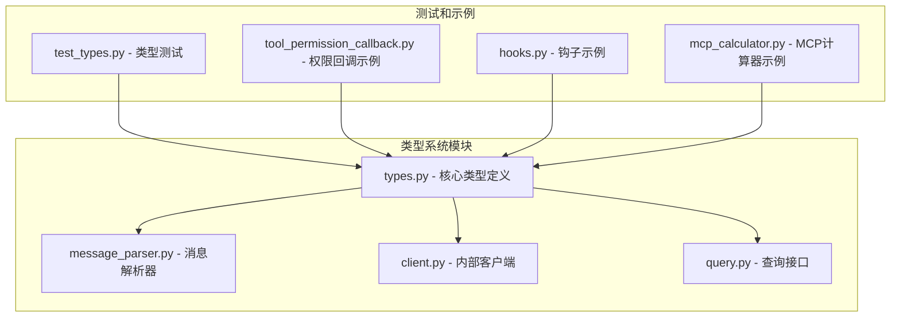
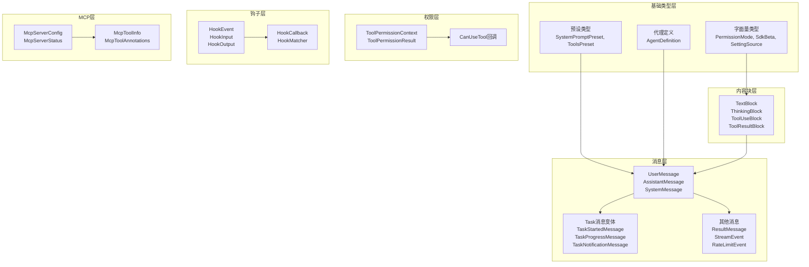
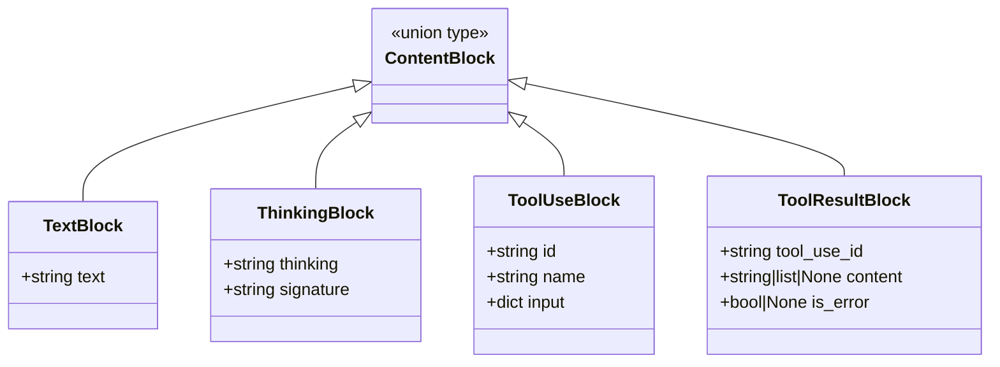
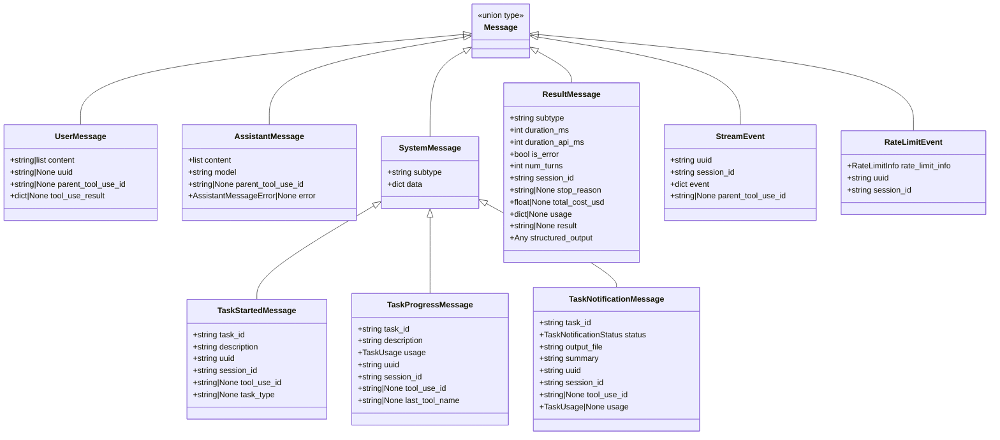
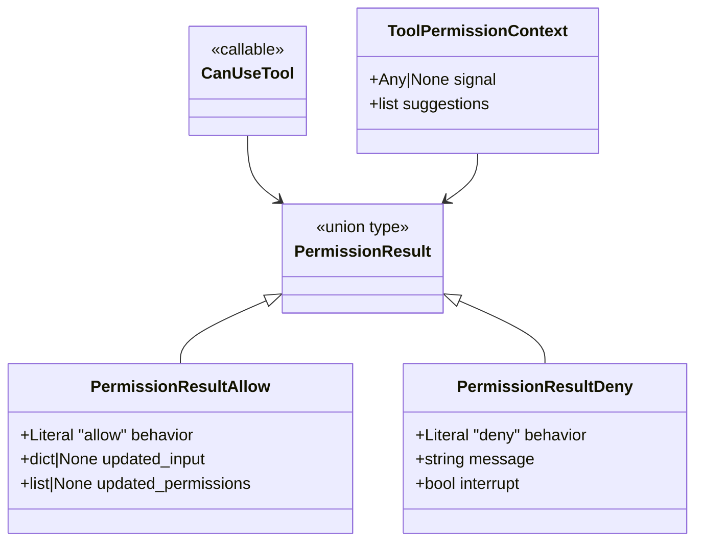
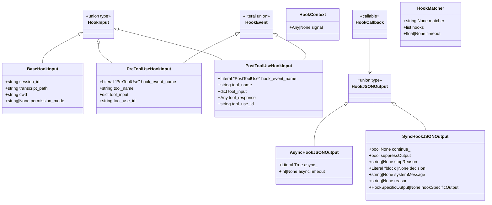
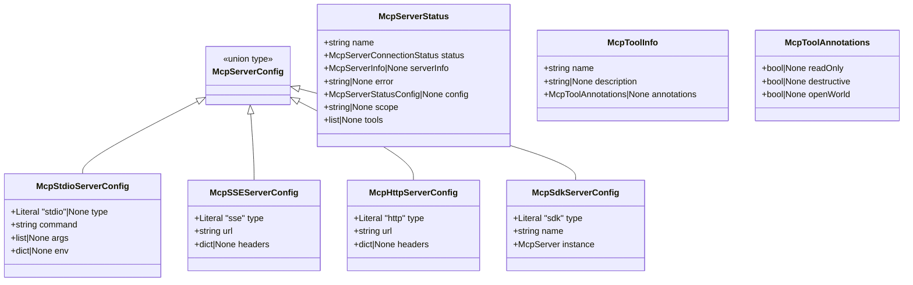
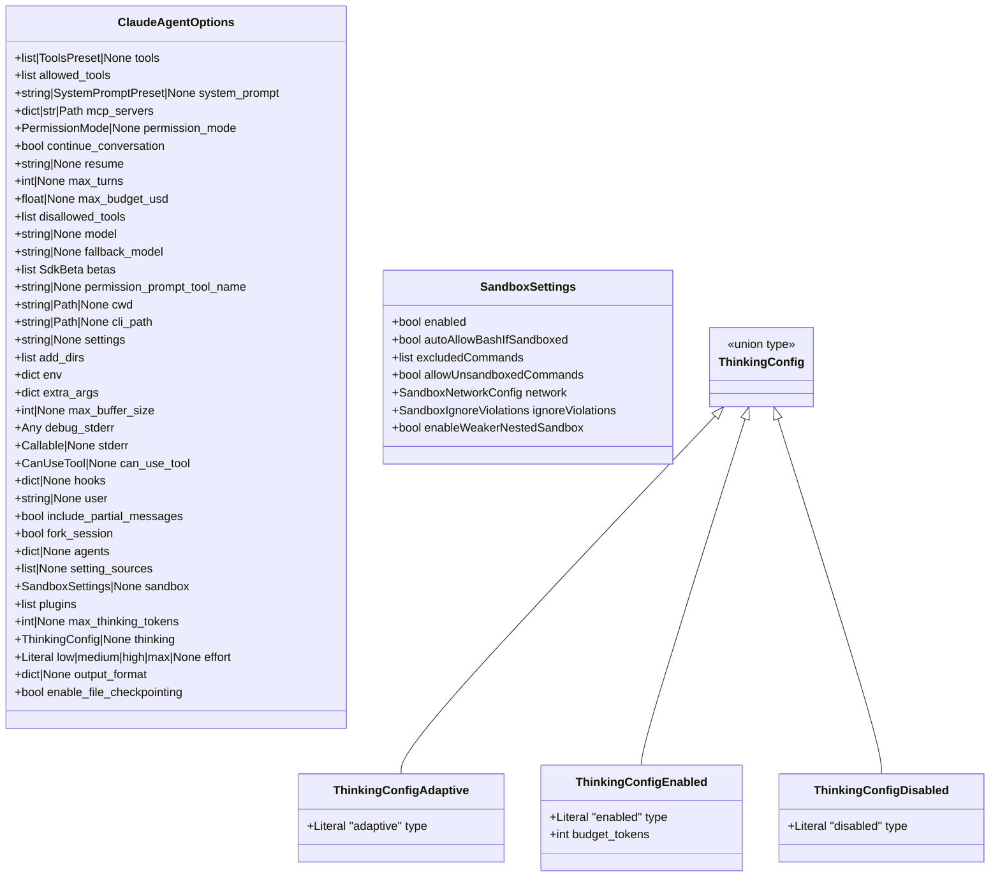
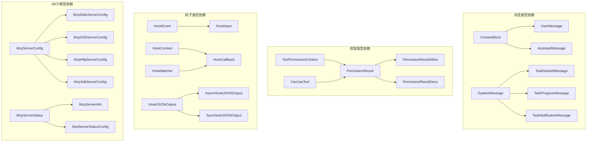

# 类型定义

<cite>
**本文档引用的文件**
- [types.py](file://src/claude_agent_sdk/types.py)
- [message_parser.py](file://src/claude_agent_sdk/_internal/message_parser.py)
- [client.py](file://src/claude_agent_sdk/_internal/client.py)
- [query.py](file://src/claude_agent_sdk/query.py)
- [test_types.py](file://tests/test_types.py)
- [tool_permission_callback.py](file://examples/tool_permission_callback.py)
- [hooks.py](file://examples/hooks.py)
- [mcp_calculator.py](file://examples/mcp_calculator.py)
</cite>

## 目录
1. [简介](#简介)
2. [项目结构](#项目结构)
3. [核心组件](#核心组件)
4. [架构概览](#架构概览)
5. [详细组件分析](#详细组件分析)
6. [依赖关系分析](#依赖关系分析)
7. [性能考虑](#性能考虑)
8. [故障排除指南](#故障排除指南)
9. [结论](#结论)

## 简介

本文档提供了 Claude Agent SDK 的完整类型系统 API 参考。该类型系统定义了 SDK 中所有公共类型，包括消息相关类型、工具类型、钩子类型以及 MCP 服务器类型。文档详细说明了每个类型的字段定义、数据类型和用途，并提供了类型之间的继承关系和组合关系图。

## 项目结构

Claude Agent SDK 的类型系统主要位于 `src/claude_agent_sdk/types.py` 文件中，该文件包含了所有核心类型定义。类型系统采用模块化设计，支持多种类型组合和继承模式。

**图表来源**
- [types.py:1-1199](file://src/claude_agent_sdk/types.py#L1-L1199)
- [message_parser.py:1-251](file://src/claude_agent_sdk/_internal/message_parser.py#L1-L251)

**章节来源**
- [types.py:1-1199](file://src/claude_agent_sdk/types.py#L1-L1199)

## 核心组件

类型系统包含以下主要组件类别：

### 基础类型定义
- **字面量类型**: `PermissionMode`、`SdkBeta`、`SettingSource` 等
- **预设类型**: `SystemPromptPreset`、`ToolsPreset`
- **代理定义**: `AgentDefinition`

### 消息类型系统
- **内容块类型**: `TextBlock`、`ThinkingBlock`、`ToolUseBlock`、`ToolResultBlock`
- **消息类型**: `UserMessage`、`AssistantMessage`、`SystemMessage`
- **系统消息变体**: `TaskStartedMessage`、`TaskProgressMessage`、`TaskNotificationMessage`
- **结果消息**: `ResultMessage`、`StreamEvent`、`RateLimitEvent`

### 工具权限类型
- **权限上下文**: `ToolPermissionContext`
- **权限结果**: `PermissionResultAllow`、`PermissionResultDeny`
- **权限回调**: `CanUseTool`

### 钩子类型系统
- **钩子事件**: `HookEvent`
- **钩子输入**: 多种特定事件的输入类型
- **钩子输出**: 对应的输出类型
- **钩子回调**: `HookCallback`
- **钩子匹配器**: `HookMatcher`

### MCP 服务器类型
- **服务器配置**: `McpStdioServerConfig`、`McpSSEServerConfig`、`McpHttpServerConfig`、`McpSdkServerConfig`
- **服务器状态**: `McpServerStatus`、`McpServerInfo`
- **工具信息**: `McpToolInfo`、`McpToolAnnotations`

**章节来源**
- [types.py:17-800](file://src/claude_agent_sdk/types.py#L17-L800)
- [types.py:801-1199](file://src/claude_agent_sdk/types.py#L801-L1199)

## 架构概览

类型系统采用分层架构设计，从基础类型到复杂组合类型形成清晰的层次结构：

**图表来源**
- [types.py:27-800](file://src/claude_agent_sdk/types.py#L27-L800)
- [types.py:801-1199](file://src/claude_agent_sdk/types.py#L801-L1199)

## 详细组件分析

### 消息类型系统

消息类型系统是类型系统的核心组成部分，支持多种消息格式和内容块类型。

#### 内容块类型

**图表来源**
- [types.py:729-764](file://src/claude_agent_sdk/types.py#L729-L764)

#### 消息类型

**图表来源**
- [types.py:766-952](file://src/claude_agent_sdk/types.py#L766-L952)

**章节来源**
- [types.py:729-952](file://src/claude_agent_sdk/types.py#L729-L952)
- [message_parser.py:29-251](file://src/claude_agent_sdk/_internal/message_parser.py#L29-L251)

### 工具权限类型

工具权限系统提供了细粒度的工具访问控制机制。

**图表来源**
- [types.py:124-157](file://src/claude_agent_sdk/types.py#L124-L157)

**章节来源**
- [types.py:124-157](file://src/claude_agent_sdk/types.py#L124-L157)
- [tool_permission_callback.py:26-94](file://examples/tool_permission_callback.py#L26-L94)

### 钩子类型系统

钩子系统提供了强大的事件驱动扩展机制。

**图表来源**
- [types.py:160-473](file://src/claude_agent_sdk/types.py#L160-L473)

**章节来源**
- [types.py:160-473](file://src/claude_agent_sdk/types.py#L160-L473)
- [hooks.py:46-154](file://examples/hooks.py#L46-L154)

### MCP 服务器类型

MCP（Model Context Protocol）服务器配置和状态管理类型。

**图表来源**
- [types.py:493-640](file://src/claude_agent_sdk/types.py#L493-L640)

**章节来源**
- [types.py:493-640](file://src/claude_agent_sdk/types.py#L493-L640)
- [mcp_calculator.py:142-168](file://examples/mcp_calculator.py#L142-L168)

### 选项配置类型

查询选项和配置类型。

**图表来源**
- [types.py:1029-1100](file://src/claude_agent_sdk/types.py#L1029-L1100)

**章节来源**
- [types.py:1029-1100](file://src/claude_agent_sdk/types.py#L1029-L1100)

## 依赖关系分析

类型系统内部存在复杂的依赖关系，通过继承和组合实现功能扩展。

**图表来源**
- [types.py:729-1199](file://src/claude_agent_sdk/types.py#L729-L1199)

**章节来源**
- [types.py:729-1199](file://src/claude_agent_sdk/types.py#L729-L1199)

## 性能考虑

类型系统在设计时考虑了性能优化：

1. **内存效率**: 使用 `@dataclass` 装饰器提供高效的属性访问
2. **类型检查**: 利用 `TypedDict` 和 `Literal` 类型确保运行时类型安全
3. **异步支持**: 所有回调函数都支持异步操作
4. **流式处理**: 支持流式消息处理以减少内存占用

## 故障排除指南

### 常见类型错误

1. **消息解析错误**: 当消息格式不符合预期时会抛出 `MessageParseError`
2. **权限验证失败**: 工具权限回调必须返回正确的 `PermissionResult` 类型
3. **钩子参数错误**: 钩子回调必须接受正确的参数类型和顺序

### 调试技巧

1. **类型检查**: 使用 `isinstance()` 函数验证对象类型
2. **字段验证**: 检查必需字段是否存在
3. **序列化测试**: 验证对象是否可以正确序列化为字典

**章节来源**
- [message_parser.py:29-251](file://src/claude_agent_sdk/_internal/message_parser.py#L29-L251)
- [test_types.py:25-429](file://tests/test_types.py#L25-L429)

## 结论

Claude Agent SDK 的类型系统提供了强大而灵活的数据结构定义，支持复杂的消息处理、工具权限控制、钩子扩展和 MCP 服务器集成。通过清晰的类型层次结构和丰富的组合模式，开发者可以构建可靠且可维护的应用程序。

类型系统的设计充分考虑了 Python 的类型检查特性，同时保持了与 JavaScript/TypeScript 生态系统的兼容性。通过适当的使用和扩展，开发者可以充分利用类型系统的强类型特性来提高代码质量和开发效率。