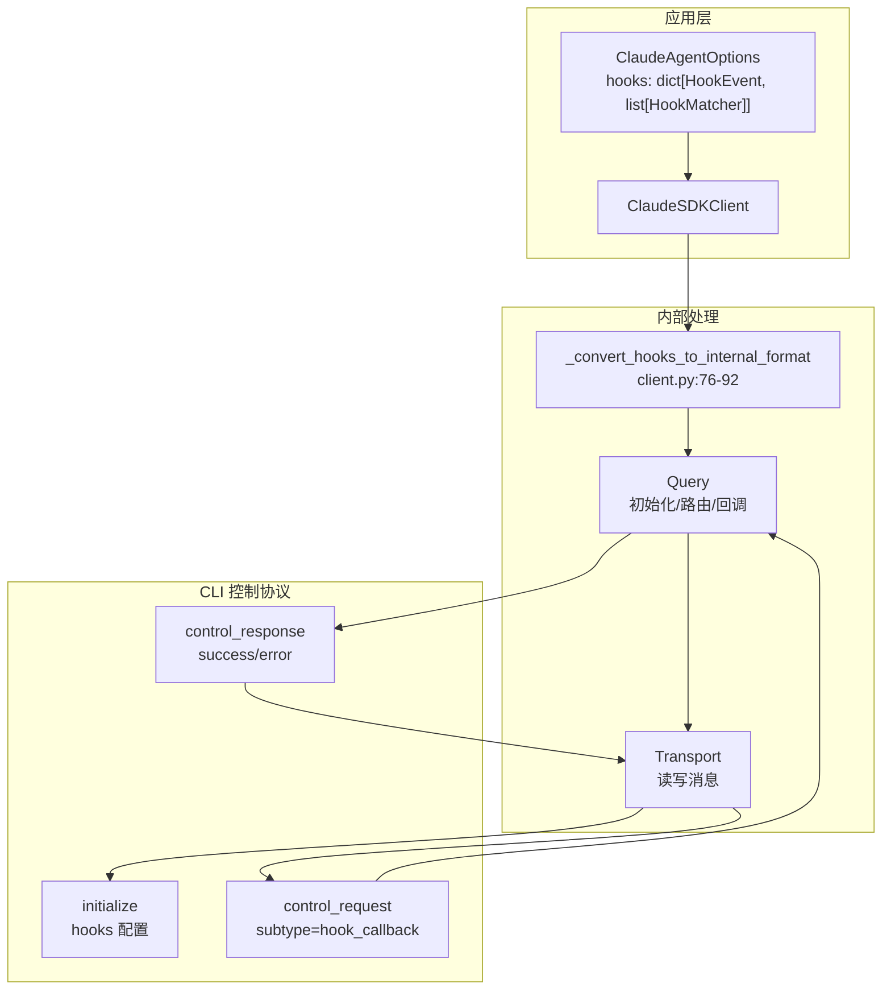
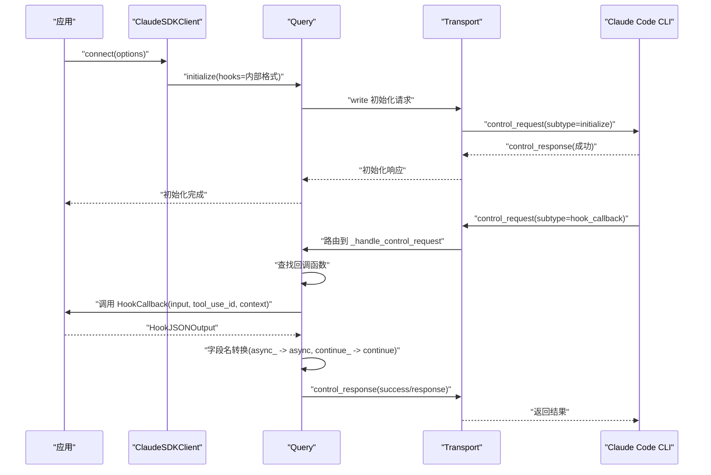
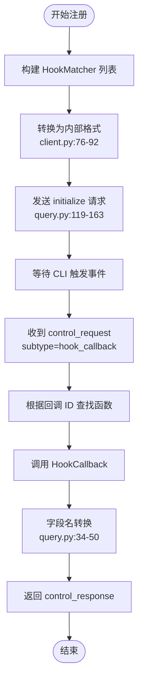
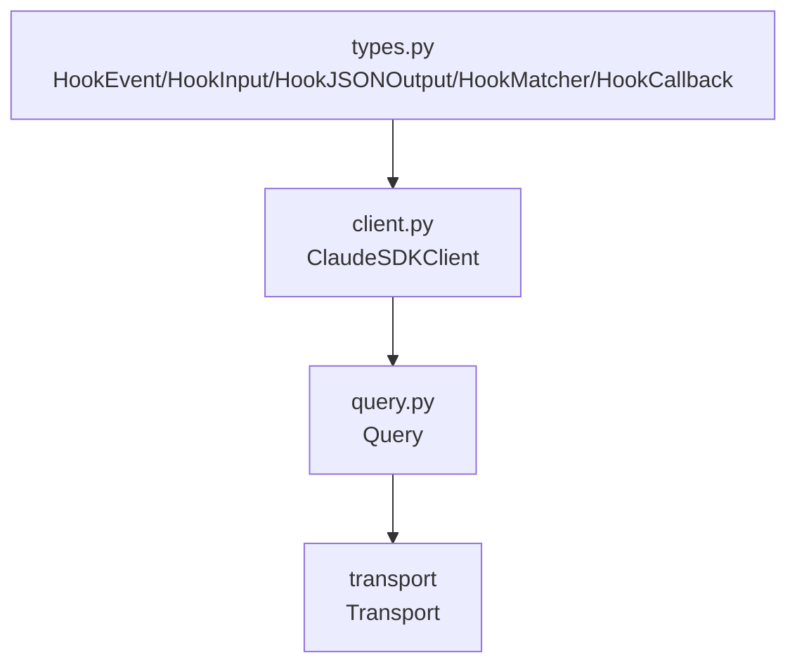

# 钩子系统 API

<cite>
**本文档引用的文件**
- [types.py](file://src/claude_agent_sdk/types.py)
- [client.py](file://src/claude_agent_sdk/client.py)
- [query.py](file://src/claude_agent_sdk/_internal/query.py)
- [hooks.py](file://examples/hooks.py)
- [test_hooks.py](file://e2e-tests/test_hooks.py)
- [test_hook_events.py](file://e2e-tests/test_hook_events.py)
- [test_types.py](file://tests/test_types.py)
- [README.md](file://README.md)
</cite>

## 目录
1. [简介](#简介)
2. [项目结构](#项目结构)
3. [核心组件](#核心组件)
4. [架构总览](#架构总览)
5. [详细组件分析](#详细组件分析)
6. [依赖关系分析](#依赖关系分析)
7. [性能考虑](#性能考虑)
8. [故障排除指南](#故障排除指南)
9. [结论](#结论)
10. [附录](#附录)

## 简介
本文件系统性地阐述 Claude Agent SDK 的钩子（Hook）系统 API，覆盖以下内容：
- 所有钩子类型及其输入输出结构
- HookCallback 函数签名与参数
- HookMatcher 的匹配规则与使用方式
- 各类钩子事件的触发时机与处理逻辑
- 钩子的注册与管理流程
- 钩子与工具权限系统的集成
- 最佳实践、常见使用场景与完整开发示例

## 项目结构
钩子系统主要由以下模块组成：
- 类型定义：在 types.py 中定义了所有钩子相关的类型、输入输出结构、HookMatcher 和 HookCallback 签名
- 客户端封装：ClaudeSDKClient 在连接时将用户配置的 HookMatcher 转换为内部格式，并传递给底层 Query
- 控制协议处理：Query 负责初始化钩子、路由控制请求、调用钩子回调并将结果转换为 CLI 可识别的字段
- 示例与测试：examples/hooks.py 提供多种钩子使用示例；e2e-tests 验证端到端行为；tests/test_types.py 验证类型定义

**图表来源**
- [client.py:76-92](file://src/claude_agent_sdk/client.py#L76-L92)
- [query.py:119-163](file://src/claude_agent_sdk/_internal/query.py#L119-L163)
- [query.py:236-346](file://src/claude_agent_sdk/_internal/query.py#L236-L346)

**章节来源**
- [client.py:76-92](file://src/claude_agent_sdk/client.py#L76-L92)
- [query.py:119-163](file://src/claude_agent_sdk/_internal/query.py#L119-L163)

## 核心组件
- 钩子事件枚举：定义了全部可用的钩子事件类型，如 PreToolUse、PostToolUse、PostToolUseFailure、UserPromptSubmit、Stop、SubagentStop、PreCompact、Notification、SubagentStart、PermissionRequest
- 钩子输入类型：每个事件对应一个强类型输入结构，包含会话标识、转录路径、工作目录等通用字段，以及事件特有的字段
- 钩子输出类型：同步输出支持 continue_、suppressOutput、stopReason、decision、systemMessage、reason，以及事件特定的 hookSpecificOutput
- HookCallback：异步回调函数签名，接收 HookInput、可选的 tool_use_id、HookContext，并返回 HookJSONOutput
- HookMatcher：用于组织钩子的匹配器，包含 matcher 模式、回调列表、超时设置

**章节来源**
- [types.py:160-172](file://src/claude_agent_sdk/types.py#L160-L172)
- [types.py:175-310](file://src/claude_agent_sdk/types.py#L175-L310)
- [types.py:313-383](file://src/claude_agent_sdk/types.py#L313-L383)
- [types.py:455-472](file://src/claude_agent_sdk/types.py#L455-L472)
- [types.py:475-491](file://src/claude_agent_sdk/types.py#L475-L491)

## 架构总览
钩子系统通过双向控制协议与 Claude Code CLI 交互。客户端在连接阶段将 HookMatcher 转换为内部配置并发送初始化请求；当 CLI 触发钩子事件时，Query 接收 control_request 并调用对应的 HookCallback，最终将结果转换为 CLI 可识别的字段并返回。

**图表来源**
- [client.py:166-180](file://src/claude_agent_sdk/client.py#L166-L180)
- [query.py:119-163](file://src/claude_agent_sdk/_internal/query.py#L119-L163)
- [query.py:236-346](file://src/claude_agent_sdk/_internal/query.py#L236-L346)
- [query.py:34-50](file://src/claude_agent_sdk/_internal/query.py#L34-L50)

## 详细组件分析

### 钩子事件与输入类型
- PreToolUseHookInput：工具使用前触发，包含工具名、工具输入、工具使用 ID 等
- PostToolUseHookInput：工具使用后触发，包含工具响应
- PostToolUseFailureHookInput：工具使用失败触发，包含错误信息与中断标记
- UserPromptSubmitHookInput：用户提交提示词时触发
- StopHookInput：会话停止时触发
- SubagentStopHookInput：子代理停止时触发
- PreCompactHookInput：压缩前触发
- NotificationHookInput：通知事件触发
- SubagentStartHookInput：子代理启动时触发
- PermissionRequestHookInput：权限请求时触发，包含工具建议

这些类型的字段均在 types.py 中明确定义，确保强类型约束与 IDE 支持。

**章节来源**
- [types.py:210-238](file://src/claude_agent_sdk/types.py#L210-L238)
- [types.py:240-252](file://src/claude_agent_sdk/types.py#L240-L252)
- [types.py:254-262](file://src/claude_agent_sdk/types.py#L254-L262)
- [types.py:264-270](file://src/claude_agent_sdk/types.py#L264-L270)
- [types.py:272-279](file://src/claude_agent_sdk/types.py#L272-L279)
- [types.py:281-287](file://src/claude_agent_sdk/types.py#L281-L287)
- [types.py:289-296](file://src/claude_agent_sdk/types.py#L289-L296)

### 钩子输出与控制字段
- 同步输出结构支持：
  - continue_：是否继续执行
  - suppressOutput：是否抑制转录模式下的标准输出
  - stopReason：停止原因
  - decision：阻断决策（当前仅在部分事件有意义）
  - systemMessage：显示给用户的系统消息
  - reason：向 Claude 提供的决策理由
  - hookSpecificOutput：事件特定输出，如 permissionDecision、additionalContext、updatedMCPToolOutput 等
- 异步输出结构：
  - async_：延迟钩子执行
  - asyncTimeout：异步操作超时（毫秒）

字段名转换：Python 使用 async_ 与 continue_ 避免关键字冲突，Query 在发送给 CLI 前自动转换为 async 与 continue。

**章节来源**
- [types.py:408-452](file://src/claude_agent_sdk/types.py#L408-L452)
- [query.py:34-50](file://src/claude_agent_sdk/_internal/query.py#L34-L50)

### HookCallback 函数签名与参数
- 输入参数：
  - input：强类型 HookInput，按事件类型区分
  - tool_use_id：可选的工具使用 ID
  - context：HookContext，预留信号支持
- 返回值：HookJSONOutput（同步或异步）
- 回调注册：Query 将 HookMatcher 中的回调函数映射为唯一回调 ID，在初始化时下发给 CLI

**章节来源**
- [types.py:455-472](file://src/claude_agent_sdk/types.py#L455-L472)
- [query.py:135-147](file://src/claude_agent_sdk/_internal/query.py#L135-L147)

### HookMatcher 匹配规则与使用方法
- matcher：字符串模式，用于匹配工具名称或组合（如 "Bash|Write"），None 表示匹配所有
- hooks：回调函数列表
- timeout：该匹配器下所有回调的超时时间（秒）
- 注册方式：在 ClaudeAgentOptions.hooks 中以事件名为键，值为 HookMatcher 列表

**章节来源**
- [types.py:475-491](file://src/claude_agent_sdk/types.py#L475-L491)
- [client.py:76-92](file://src/claude_agent_sdk/client.py#L76-L92)

### 钩子事件触发时机与处理逻辑
- PreToolUse：在工具调用前，可用于安全检查、策略决策、上下文注入
- PostToolUse：在工具调用后，可用于审计、反馈、输出改写
- PostToolUseFailure：工具调用失败时，可用于错误恢复、告警
- UserPromptSubmit：用户提交提示词时，可用于上下文增强
- Stop/SubagentStop：会话或子代理停止时，可用于资源清理
- PreCompact：压缩前，可用于状态保存
- Notification：通知事件，可用于外部系统联动
- SubagentStart：子代理启动时，可用于隔离与追踪
- PermissionRequest：权限请求时，可用于策略评估与建议

**章节来源**
- [types.py:160-172](file://src/claude_agent_sdk/types.py#L160-L172)
- [test_hook_events.py:19-62](file://e2e-tests/test_hook_events.py#L19-L62)
- [test_hook_events.py:66-110](file://e2e-tests/test_hook_events.py#L66-L110)
- [test_hook_events.py:114-157](file://e2e-tests/test_hook_events.py#L114-L157)
- [test_hook_events.py:161-197](file://e2e-tests/test_hook_events.py#L161-L197)

### 钩子注册与管理
- 客户端转换：ClaudeSDKClient 将 HookMatcher 转换为内部字典格式，包含 matcher、hooks、timeout
- 初始化下发：Query 在 initialize 请求中下发钩子配置，CLI 记录回调 ID 并在事件发生时调用
- 运行时路由：Query 根据回调 ID 查找并调用对应 HookCallback，处理异常并返回控制响应

**图表来源**
- [client.py:76-92](file://src/claude_agent_sdk/client.py#L76-L92)
- [query.py:119-163](file://src/claude_agent_sdk/_internal/query.py#L119-L163)
- [query.py:236-346](file://src/claude_agent_sdk/_internal/query.py#L236-L346)
- [query.py:34-50](file://src/claude_agent_sdk/_internal/query.py#L34-L50)

**章节来源**
- [client.py:76-92](file://src/claude_agent_sdk/client.py#L76-L92)
- [query.py:119-163](file://src/claude_agent_sdk/_internal/query.py#L119-L163)
- [query.py:236-346](file://src/claude_agent_sdk/_internal/query.py#L236-L346)

### 钩子与工具权限系统的集成
- 权限请求事件：PermissionRequestHookInput 在权限决策前触发，允许基于策略生成建议
- 工具权限回调：can_use_tool 与 HookCallback 共存时，前者优先处理工具权限，后者处理钩子事件
- 决策字段：PreToolUse 的 permissionDecision/permissionDecisionReason 与 Hook 输出中的 decision/reason 协同工作

**章节来源**
- [types.py:289-296](file://src/claude_agent_sdk/types.py#L289-L296)
- [types.py:442-447](file://src/claude_agent_sdk/types.py#L442-L447)
- [query.py:245-287](file://src/claude_agent_sdk/_internal/query.py#L245-L287)

### 钩子开发最佳实践
- 明确匹配范围：合理使用 matcher 字符串，避免过于宽泛导致误触发
- 超时控制：为敏感钩子设置合理的 timeout，防止阻塞
- 错误处理：在 HookCallback 中捕获异常并返回结构化错误信息
- 上下文注入：利用 additionalContext 提供审计与调试信息
- 异步处理：对于耗时操作使用 async_ 与 asyncTimeout
- 组合使用：PreToolUse 用于前置控制，PostToolUse 用于后置审计与反馈

**章节来源**
- [hooks.py:46-71](file://examples/hooks.py#L46-L71)
- [hooks.py:85-103](file://examples/hooks.py#L85-L103)
- [hooks.py:105-136](file://examples/hooks.py#L105-L136)
- [hooks.py:138-154](file://examples/hooks.py#L138-L154)
- [test_hooks.py:17-70](file://e2e-tests/test_hooks.py#L17-L70)
- [test_hooks.py:74-113](file://e2e-tests/test_hooks.py#L74-L113)

### 常见使用场景
- 安全策略：阻止危险命令或文件写入
- 审计与合规：记录工具使用上下文与决策理由
- 错误恢复：在 PostToolUseFailure 中进行降级处理
- 用户体验：在 UserPromptSubmit 中注入上下文，提升对话质量
- 子代理管理：在 SubagentStart/Stop 中进行资源隔离与追踪

**章节来源**
- [hooks.py:156-194](file://examples/hooks.py#L156-L194)
- [hooks.py:195-216](file://examples/hooks.py#L195-L216)
- [hooks.py:218-240](file://examples/hooks.py#L218-L240)
- [hooks.py:242-277](file://examples/hooks.py#L242-L277)
- [hooks.py:279-301](file://examples/hooks.py#L279-L301)

### 完整钩子开发示例
- PreToolUse：基于命令模式阻断危险操作
- UserPromptSubmit：添加自定义上下文
- PostToolUse：审查工具输出并提供反馈
- 权限决策：使用 permissionDecision 控制工具执行
- 执行控制：使用 continue_ 与 stopReason 停止执行

**章节来源**
- [hooks.py:46-154](file://examples/hooks.py#L46-L154)
- [hooks.py:156-301](file://examples/hooks.py#L156-L301)

## 依赖关系分析
- ClaudeSDKClient 依赖 types.HookMatcher 与 types.HookEvent，负责将用户配置转换为内部格式
- Query 依赖 Transport 进行双向通信，处理 control_request/control_response
- HookCallback 与 HookMatcher 通过 Query 的回调映射机制关联

**图表来源**
- [client.py:11-18](file://src/claude_agent_sdk/client.py#L11-L18)
- [query.py:17-26](file://src/claude_agent_sdk/_internal/query.py#L17-L26)

**章节来源**
- [client.py:11-18](file://src/claude_agent_sdk/client.py#L11-L18)
- [query.py:17-26](file://src/claude_agent_sdk/_internal/query.py#L17-L26)

## 性能考虑
- 超时设置：为 HookMatcher 设置合适的 timeout，避免长时间阻塞
- 异步处理：对 IO 密集型任务使用 async_，减少主线程阻塞
- 匹配优化：合理设计 matcher 模式，减少不必要的回调调用
- 日志与审计：在 HookCallback 中谨慎使用日志，避免影响性能

## 故障排除指南
- 钩子未触发：确认事件类型正确、matcher 模式匹配、HookMatcher 正确注册
- 字段名不生效：确保使用 async_ 与 continue_，Query 会自动转换为 async 与 continue
- 权限冲突：can_use_tool 与 PermissionRequest 钩子同时存在时，注意决策优先级
- 超时问题：适当提高 HookMatcher.timeout 或优化钩子逻辑

**章节来源**
- [query.py:34-50](file://src/claude_agent_sdk/_internal/query.py#L34-L50)
- [query.py:245-287](file://src/claude_agent_sdk/_internal/query.py#L245-L287)
- [test_types.py:262-288](file://tests/test_types.py#L262-L288)

## 结论
钩子系统为 Claude Agent SDK 提供了强大的扩展能力，通过强类型输入输出、灵活的匹配规则与完善的控制协议，开发者可以在关键节点插入策略、审计与反馈逻辑。结合权限系统与 MCP 工具生态，可以构建安全、可控且可扩展的智能代理应用。

## 附录
- 官方文档与示例参考：README.md 中的钩子示例与使用说明
- 端到端验证：e2e-tests/test_hooks.py 与 e2e-tests/test_hook_events.py 展示了真实场景下的钩子行为
- 类型定义验证：tests/test_types.py 确保各钩子输入输出类型的正确性

**章节来源**
- [README.md:187-238](file://README.md#L187-L238)
- [test_hooks.py:17-157](file://e2e-tests/test_hooks.py#L17-L157)
- [test_hook_events.py:19-197](file://e2e-tests/test_hook_events.py#L19-L197)
- [test_types.py:240-429](file://tests/test_types.py#L240-L429)