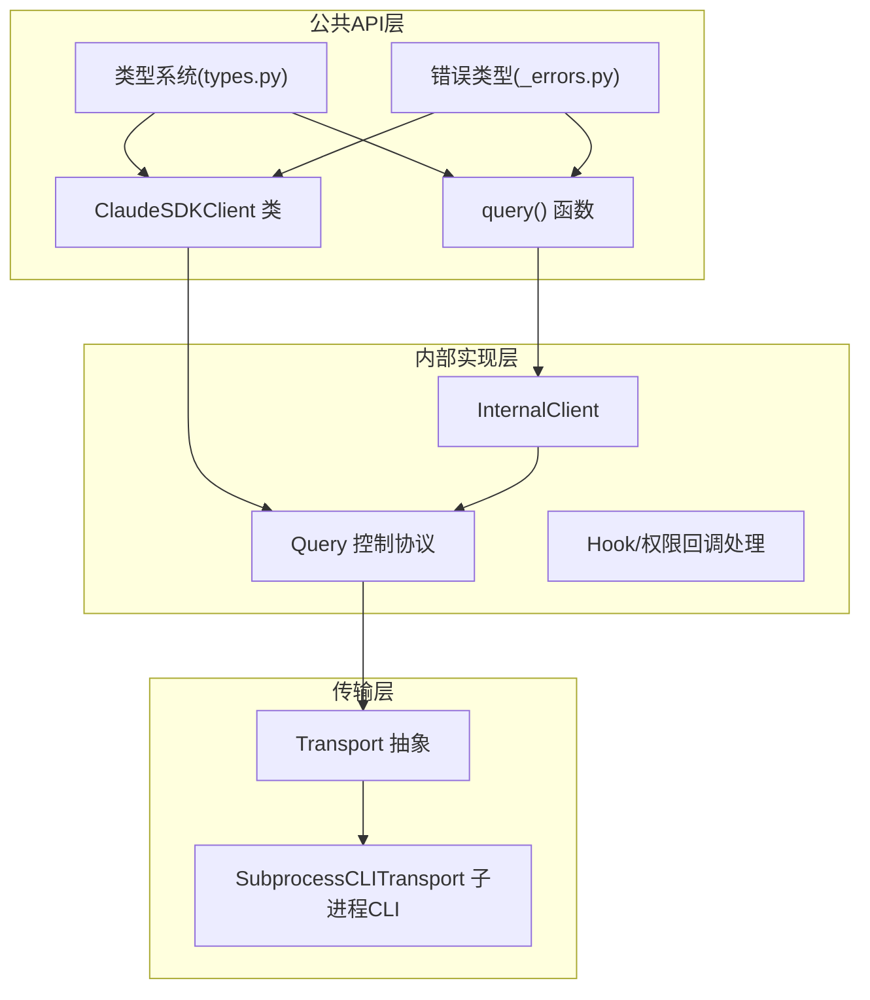
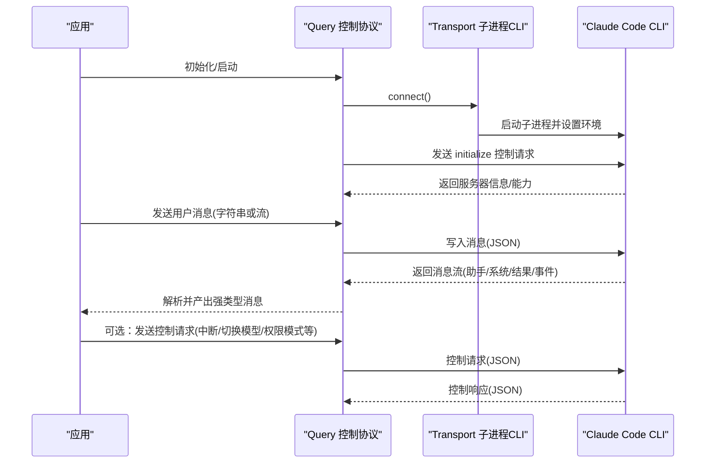
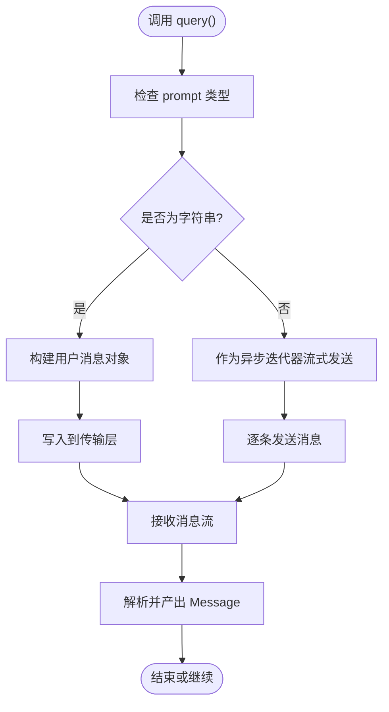
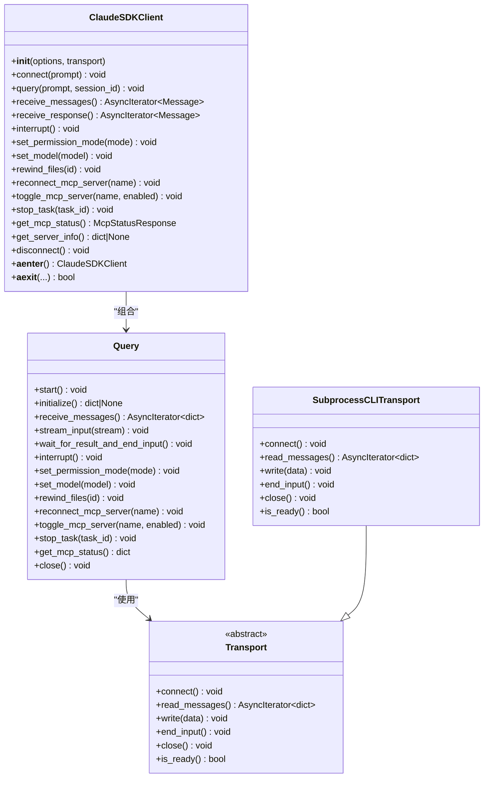
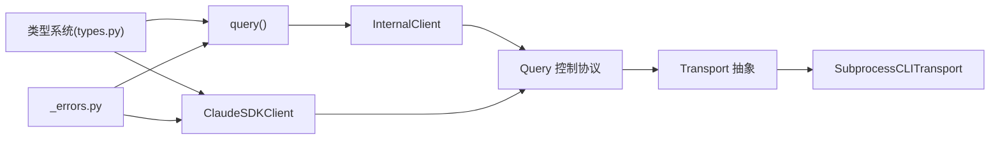

# API参考

<cite>
**本文档引用的文件**
- [src/claude_agent_sdk/__init__.py](file://src/claude_agent_sdk/__init__.py)
- [src/claude_agent_sdk/client.py](file://src/claude_agent_sdk/client.py)
- [src/claude_agent_sdk/query.py](file://src/claude_agent_sdk/query.py)
- [src/claude_agent_sdk/types.py](file://src/claude_agent_sdk/types.py)
- [_errors.py](file://src/claude_agent_sdk/_errors.py)
- [_internal/client.py](file://src/claude_agent_sdk/_internal/client.py)
- [_internal/query.py](file://src/claude_agent_sdk/_internal/query.py)
- [_internal/transport/subprocess_cli.py](file://src/claude_agent_sdk/_internal/transport/subprocess_cli.py)
- [examples/quick_start.py](file://examples/quick_start.py)
- [examples/streaming_mode.py](file://examples/streaming_mode.py)
- [examples/tools_option.py](file://examples/tools_option.py)
- [examples/system_prompt.py](file://examples/system_prompt.py)
- [tests/test_client.py](file://tests/test_client.py)
- [tests/test_query.py](file://tests/test_query.py)
</cite>

## 目录
1. [简介](#简介)
2. [项目结构](#项目结构)
3. [核心组件](#核心组件)
4. [架构总览](#架构总览)
5. [详细组件分析](#详细组件分析)
6. [依赖分析](#依赖分析)
7. [性能考虑](#性能考虑)
8. [故障排查指南](#故障排查指南)
9. [结论](#结论)
10. [附录](#附录)

## 简介
本文件为 Claude Agent SDK 的完整 Python API 参考，覆盖以下内容：
- query() 函数：参数、返回值、使用示例与最佳实践
- ClaudeSDKClient 类：初始化、查询、接收响应、控制协议与连接管理
- 类型系统：消息类型、配置类型、错误类型、工具类型与钩子类型
- 版本兼容性与废弃提示
- 常见陷阱与最佳实践

## 项目结构
SDK 采用分层设计：
- 公共 API 层：对外导出的 query()、ClaudeSDKClient、类型与错误
- 内部实现层：内部客户端、查询控制协议与传输抽象
- 传输层：基于 Claude Code CLI 的子进程通信
- 示例与测试：演示与验证 API 行为



**图表来源**
- [src/claude_agent_sdk/__init__.py:343-444](file://src/claude_agent_sdk/__init__.py#L343-L444)
- [src/claude_agent_sdk/client.py:21-500](file://src/claude_agent_sdk/client.py#L21-L500)
- [src/claude_agent_sdk/query.py:12-127](file://src/claude_agent_sdk/query.py#L12-L127)
- [src/claude_agent_sdk/types.py:1030-1199](file://src/claude_agent_sdk/types.py#L1030-L1199)
- [_errors.py:6-57](file://src/claude_agent_sdk/_errors.py#L6-L57)
- [_internal/client.py:20-146](file://src/claude_agent_sdk/_internal/client.py#L20-L146)
- [_internal/query.py:53-679](file://src/claude_agent_sdk/_internal/query.py#L53-L679)
- [_internal/transport/subprocess_cli.py:33-630](file://src/claude_agent_sdk/_internal/transport/subprocess_cli.py#L33-L630)

**章节来源**
- [src/claude_agent_sdk/__init__.py:1-445](file://src/claude_agent_sdk/__init__.py#L1-L445)
- [src/claude_agent_sdk/client.py:1-500](file://src/claude_agent_sdk/client.py#L1-L500)
- [src/claude_agent_sdk/query.py:1-127](file://src/claude_agent_sdk/query.py#L1-L127)
- [src/claude_agent_sdk/types.py:1-1199](file://src/claude_agent_sdk/types.py#L1-L1199)
- [_errors.py:1-57](file://src/claude_agent_sdk/_errors.py#L1-L57)
- [_internal/client.py:1-146](file://src/claude_agent_sdk/_internal/client.py#L1-L146)
- [_internal/query.py:1-679](file://src/claude_agent_sdk/_internal/query.py#L1-L679)
- [_internal/transport/subprocess_cli.py:1-630](file://src/claude_agent_sdk/_internal/transport/subprocess_cli.py#L1-L630)

## 核心组件
- query()：一次性或单向流式交互入口，适合简单状态无关任务
- ClaudeSDKClient：双向、可中断、带会话管理的交互客户端
- 类型系统：消息、配置、权限、钩子、MCP、会话等类型
- 错误体系：统一异常基类与 CLI 连接相关错误
- 传输层：通过 Claude Code CLI 子进程进行双向流式通信

**章节来源**
- [src/claude_agent_sdk/query.py:12-127](file://src/claude_agent_sdk/query.py#L12-L127)
- [src/claude_agent_sdk/client.py:21-500](file://src/claude_agent_sdk/client.py#L21-L500)
- [src/claude_agent_sdk/types.py:1030-1199](file://src/claude_agent_sdk/types.py#L1030-L1199)
- [_errors.py:6-57](file://src/claude_agent_sdk/_errors.py#L6-L57)

## 架构总览
SDK 在运行时建立到 Claude Code CLI 的子进程连接，使用 JSON 流格式在 stdin/stdout 上交换消息；同时通过控制协议支持：
- 工具权限决策回调
- 钩子回调（PreToolUse/PostToolUse/…）
- MCP 服务器桥接（含内嵌 SDK MCP 服务器）



**图表来源**
- [_internal/query.py:165-235](file://src/claude_agent_sdk/_internal/query.py#L165-L235)
- [_internal/transport/subprocess_cli.py:335-411](file://src/claude_agent_sdk/_internal/transport/subprocess_cli.py#L335-L411)
- [_internal/transport/subprocess_cli.py:515-586](file://src/claude_agent_sdk/_internal/transport/subprocess_cli.py#L515-L586)

## 详细组件分析

### query() 函数 API
- 功能：一次性或单向流式查询，适合无状态、无需中断的场景
- 参数
  - prompt: str 或 AsyncIterable[dict[str, Any]]
    - 字符串：单轮查询
    - 异步迭代器：持续发送多条消息，适用于逐步输入
  - options: ClaudeAgentOptions | None，默认 None（内部构造默认实例）
  - transport: Transport | None，默认 None（自动选择子进程传输）
- 返回：AsyncIterator[Message]
- 使用要点
  - 单轮查询：直接传入字符串 prompt
  - 流式输入：传入异步生成器，逐条发送消息
  - 选项：通过 ClaudeAgentOptions 控制工具、系统提示、预算、工作目录等
  - 错误：连接失败、CLI 不存在、解析错误等抛出相应异常
- 示例路径
  - [examples/quick_start.py:19](file://examples/quick_start.py#L19)
  - [examples/tools_option.py:27](file://examples/tools_option.py#L27)
  - [examples/system_prompt.py:18](file://examples/system_prompt.py#L18)



**图表来源**
- [src/claude_agent_sdk/query.py:12-127](file://src/claude_agent_sdk/query.py#L12-L127)
- [_internal/client.py:44-146](file://src/claude_agent_sdk/_internal/client.py#L44-L146)

**章节来源**
- [src/claude_agent_sdk/query.py:12-127](file://src/claude_agent_sdk/query.py#L12-L127)
- [_internal/client.py:44-146](file://src/claude_agent_sdk/_internal/client.py#L44-L146)
- [tests/test_client.py:14-72](file://tests/test_client.py#L14-L72)

### ClaudeSDKClient 类 API
- 初始化
  - __init__(options: ClaudeAgentOptions | None = None, transport: Transport | None = None)
  - 默认 options 使用 ClaudeAgentOptions()
  - 支持自定义 transport（否则使用 SubprocessCLITransport）
- 连接与生命周期
  - connect(prompt: str | AsyncIterable[dict] | None = None) -> None
  - __aenter__/__aexit__ 自动连接/断开
  - disconnect() -> None
- 查询与消息
  - query(prompt: str | AsyncIterable[dict], session_id: str = "default") -> None
  - receive_messages() -> AsyncIterator[Message]
  - receive_response() -> AsyncIterator[Message]（遇 ResultMessage 停止）
- 控制协议与管理
  - interrupt() -> None（仅流式模式有效）
  - set_permission_mode(mode: str) -> None
  - set_model(model: str | None = None) -> None
  - get_mcp_status() -> McpStatusResponse
  - reconnect_mcp_server(server_name: str) -> None
  - toggle_mcp_server(server_name: str, enabled: bool) -> None
  - stop_task(task_id: str) -> None
  - rewind_files(user_message_id: str) -> None
  - get_server_info() -> dict[str, Any] | None
- 限制与注意事项
  - 不同 async 运行时上下文不可复用同一实例（内部维护 anyio 任务组）
  - can_use_tool 回调与 permission_prompt_tool_name 互斥，且需流式模式



**图表来源**
- [src/claude_agent_sdk/client.py:21-500](file://src/claude_agent_sdk/client.py#L21-L500)
- [_internal/query.py:53-679](file://src/claude_agent_sdk/_internal/query.py#L53-L679)
- [_internal/transport/subprocess_cli.py:33-630](file://src/claude_agent_sdk/_internal/transport/subprocess_cli.py#L33-L630)

**章节来源**
- [src/claude_agent_sdk/client.py:21-500](file://src/claude_agent_sdk/client.py#L21-L500)
- [_internal/query.py:53-679](file://src/claude_agent_sdk/_internal/query.py#L53-L679)
- [_internal/transport/subprocess_cli.py:33-630](file://src/claude_agent_sdk/_internal/transport/subprocess_cli.py#L33-L630)

### 类型系统概览
- 消息类型
  - UserMessage、AssistantMessage、SystemMessage、ResultMessage、StreamEvent、RateLimitEvent
  - ContentBlock：TextBlock、ThinkingBlock、ToolUseBlock、ToolResultBlock
- 配置类型
  - ClaudeAgentOptions：工具、系统提示、MCP 服务器、权限模式、预算、工作目录、钩子、代理/插件/沙箱等
  - ThinkingConfig：adaptive/enabled/disabled 及预算
- 权限与工具
  - PermissionMode、PermissionResult、PermissionUpdate、CanUseTool
  - SdkPluginConfig、SandboxSettings
- 钩子与控制协议
  - HookEvent、HookInput、HookSpecificOutput、HookCallback、HookMatcher
  - SDKControlRequest/Response、ControlResponse/Error
- MCP 服务器
  - McpServerConfig/McpSdkServerConfig、McpStatusResponse、McpToolInfo
- 会话与历史
  - SDKSessionInfo、SessionMessage、list_sessions/get_session_messages、rename_session/tag_session

**章节来源**
- [src/claude_agent_sdk/types.py:17-1199](file://src/claude_agent_sdk/types.py#L17-L1199)

### 错误类型
- ClaudeSDKError：SDK 异常基类
- CLIConnectionError：无法连接 CLI
- CLINotFoundError：未找到 CLI
- ProcessError：CLI 进程失败（含退出码与标准错误）
- CLIJSONDecodeError：CLI 输出 JSON 解码失败
- MessageParseError：消息解析失败

**章节来源**
- [_errors.py:6-57](file://src/claude_agent_sdk/_errors.py#L6-L57)

### MCP 服务器与工具装饰器
- tool() 装饰器：定义 SDK 内嵌 MCP 工具，返回 SdkMcpTool
- create_sdk_mcp_server()：创建内嵌 MCP 服务器配置，供 ClaudeAgentOptions.mcp_servers 使用
- SdkMcpTool：名称、描述、输入模式、处理器与注解

```mermaid
sequenceDiagram
participant Dev as "开发者"
participant DEC as "@tool 装饰器"
participant Srv as "create_sdk_mcp_server"
participant Opt as "ClaudeAgentOptions.mcp_servers"
participant Cli as "ClaudeSDKClient/Query"
Dev->>DEC : 定义工具函数
DEC-->>Dev : 返回 SdkMcpTool
Dev->>Srv : 创建 SDK MCP 服务器
Srv-->>Opt : 返回 McpSdkServerConfig
Dev->>Cli : 传入选项(含 mcp_servers)
Cli->>Cli : 初始化/桥接 SDK MCP 请求
```

**图表来源**
- [src/claude_agent_sdk/__init__.py:100-341](file://src/claude_agent_sdk/__init__.py#L100-L341)
- [_internal/query.py:394-531](file://src/claude_agent_sdk/_internal/query.py#L394-L531)

**章节来源**
- [src/claude_agent_sdk/__init__.py:100-341](file://src/claude_agent_sdk/__init__.py#L100-L341)
- [_internal/query.py:394-531](file://src/claude_agent_sdk/_internal/query.py#L394-L531)

## 依赖分析
- 外部依赖
  - mcp.types：MCP 类型（工具注解、工具列表/调用请求）
  - anyio：异步 I/O、任务组、锁与内存对象流
  - json：消息编解码
- 内部耦合
  - ClaudeSDKClient 组合 Query
  - Query 使用 Transport 抽象
  - SubprocessCLITransport 实现 Transport 并与 CLI 交互
  - InternalClient 提供 query() 的内部实现



**图表来源**
- [src/claude_agent_sdk/query.py:12-127](file://src/claude_agent_sdk/query.py#L12-L127)
- [_internal/client.py:20-146](file://src/claude_agent_sdk/_internal/client.py#L20-L146)
- [_internal/query.py:53-679](file://src/claude_agent_sdk/_internal/query.py#L53-L679)
- [_internal/transport/subprocess_cli.py:33-630](file://src/claude_agent_sdk/_internal/transport/subprocess_cli.py#L33-L630)

**章节来源**
- [src/claude_agent_sdk/query.py:12-127](file://src/claude_agent_sdk/query.py#L12-L127)
- [_internal/client.py:20-146](file://src/claude_agent_sdk/_internal/client.py#L20-L146)
- [_internal/query.py:53-679](file://src/claude_agent_sdk/_internal/query.py#L53-L679)
- [_internal/transport/subprocess_cli.py:33-630](file://src/claude_agent_sdk/_internal/transport/subprocess_cli.py#L33-L630)

## 性能考虑
- 流式模式：始终以流式模式与 CLI 通信，便于及时响应控制请求与 MCP 交互
- 缓冲区大小：可通过 ClaudeAgentOptions.max_buffer_size 控制 stdout 缓冲上限
- 子进程 I/O：使用 anyio 文本流与锁保证并发安全
- MCP 服务器：内嵌 SDK MCP 服务器避免进程间通信开销，提升性能
- 超时控制：控制请求与初始化有超时机制，避免阻塞

[本节为通用指导，不涉及具体文件分析]

## 故障排查指南
- CLI 未找到/版本过低
  - 现象：抛出 CLINotFoundError 或版本警告
  - 排查：确认 CLI 安装路径、版本满足最低要求
  - 参考：[SubprocessCLITransport._find_cli:64-95](file://src/claude_agent_sdk/_internal/transport/subprocess_cli.py#L64-L95)，[SubprocessCLITransport._check_claude_version:587-626](file://src/claude_agent_sdk/_internal/transport/subprocess_cli.py#L587-L626)
- 连接失败/进程退出
  - 现象：CLIConnectionError、ProcessError
  - 排查：检查工作目录、环境变量、CLI 退出码与 stderr
  - 参考：[SubprocessCLITransport.connect:335-411](file://src/claude_agent_sdk/_internal/transport/subprocess_cli.py#L335-L411)，[SubprocessCLITransport._read_messages_impl:519-586](file://src/claude_agent_sdk/_internal/transport/subprocess_cli.py#L519-L586)
- JSON 解码错误
  - 现象：CLIJSONDecodeError
  - 排查：增大 max_buffer_size 或检查输出格式
  - 参考：[SubprocessCLITransport._read_messages_impl:519-586](file://src/claude_agent_sdk/_internal/transport/subprocess_cli.py#L519-L586)
- 控制请求超时
  - 现象：控制请求超时异常
  - 排查：检查钩子/SDK MCP 服务器响应时间
  - 参考：[_internal/query.py_send_control_request:347-393](file://src/claude_agent_sdk/_internal/query.py#L347-L393)
- 无法中断
  - 现象：interrupt() 无效
  - 排查：确保处于流式模式并持续消费消息
  - 参考：[ClaudeSDKClient.interrupt:228-232](file://src/claude_agent_sdk/client.py#L228-L232)

**章节来源**
- [_internal/transport/subprocess_cli.py:335-626](file://src/claude_agent_sdk/_internal/transport/subprocess_cli.py#L335-L626)
- [_internal/query.py:347-393](file://src/claude_agent_sdk/_internal/query.py#L347-L393)
- [src/claude_agent_sdk/client.py:228-232](file://src/claude_agent_sdk/client.py#L228-L232)

## 结论
- query() 适合一次性、无状态任务；ClaudeSDKClient 适合需要双向交互、中断与会话管理的复杂应用
- 类型系统完善，涵盖消息、配置、权限、钩子、MCP 与会话
- 传输层稳定可靠，结合控制协议实现丰富的运行时控制能力
- 建议优先使用流式模式与合适的选项配置，合理使用钩子与 SDK MCP 服务器以增强功能

[本节为总结，不涉及具体文件分析]

## 附录

### API 使用示例索引
- 快速开始与基础查询
  - [examples/quick_start.py:19](file://examples/quick_start.py#L19)
- 流式模式与多轮对话
  - [examples/streaming_mode.py:63](file://examples/streaming_mode.py#L63)
- 工具选项与系统提示
  - [examples/tools_option.py:27](file://examples/tools_option.py#L27)
  - [examples/system_prompt.py:18](file://examples/system_prompt.py#L18)

**章节来源**
- [examples/quick_start.py:1-77](file://examples/quick_start.py#L1-L77)
- [examples/streaming_mode.py:1-512](file://examples/streaming_mode.py#L1-L512)
- [examples/tools_option.py:1-112](file://examples/tools_option.py#L1-L112)
- [examples/system_prompt.py:1-87](file://examples/system_prompt.py#L1-L87)

### 最佳实践与常见陷阱
- 最佳实践
  - 使用 ClaudeSDKClient 进行多轮交互与实时控制
  - 通过 ClaudeAgentOptions 精细控制工具、权限与预算
  - 使用流式模式并持续消费消息以启用中断与钩子
  - 合理设置 max_buffer_size 与 stderr 回调
  - 使用 SDK MCP 服务器提升工具调用性能
- 常见陷阱
  - 在不同 async 上下文复用同一 ClaudeSDKClient 实例
  - 将 can_use_tool 与 permission_prompt_tool_name 同时使用
  - 未在流式模式下消费消息导致中断无效
  - 忽略 stderr 输出导致问题难以定位

**章节来源**
- [src/claude_agent_sdk/client.py:53-60](file://src/claude_agent_sdk/client.py#L53-L60)
- [src/claude_agent_sdk/types.py:1030-1199](file://src/claude_agent_sdk/types.py#L1030-L1199)