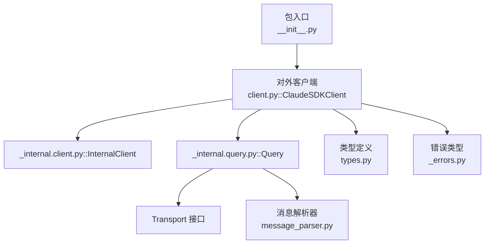
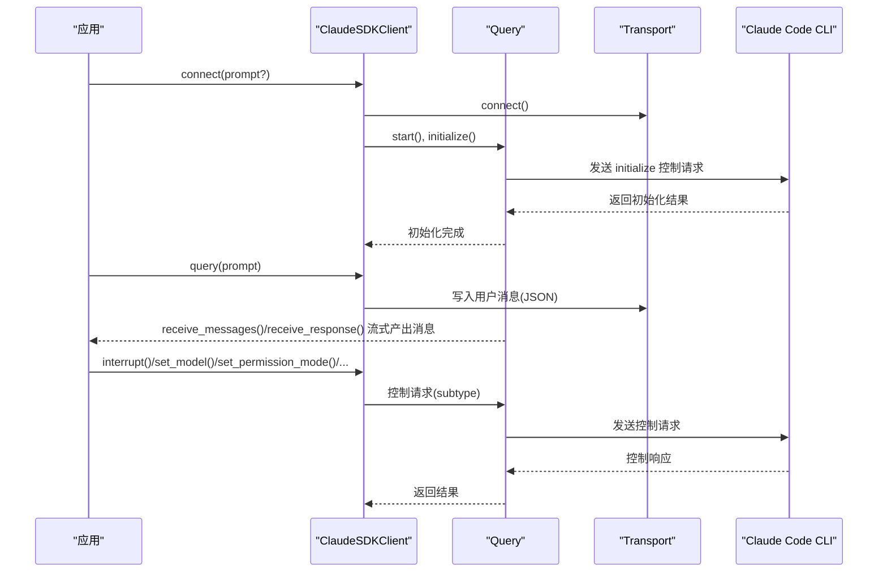
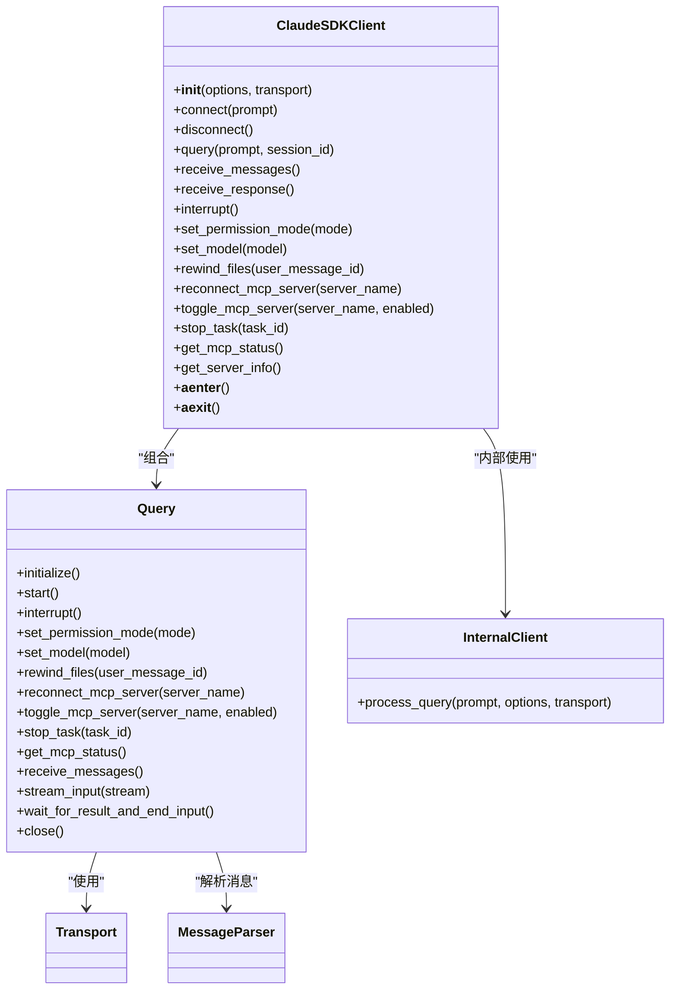

# 客户端接口

<cite>
**本文引用的文件**
- [client.py](file://src/claude_agent_sdk/client.py)
- [_internal/client.py](file://src/claude_agent_sdk/_internal/client.py)
- [types.py](file://src/claude_agent_sdk/types.py)
- [query.py](file://src/claude_agent_sdk/query.py)
- [_internal/query.py](file://src/claude_agent_sdk/_internal/query.py)
- [_internal/message_parser.py](file://src/claude_agent_sdk/_internal/message_parser.py)
- [_errors.py](file://src/claude_agent_sdk/_errors.py)
- [streaming_mode.py](file://examples/streaming_mode.py)
- [quick_start.py](file://examples/quick_start.py)
- [tools_option.py](file://examples/tools_option.py)
- [__init__.py](file://src/claude_agent_sdk/__init__.py)
</cite>

## 目录
1. [简介](#简介)
2. [项目结构](#项目结构)
3. [核心组件](#核心组件)
4. [架构总览](#架构总览)
5. [详细组件分析](#详细组件分析)
6. [依赖分析](#依赖分析)
7. [性能考虑](#性能考虑)
8. [故障排查指南](#故障排查指南)
9. [结论](#结论)
10. [附录](#附录)

## 简介
本文件为 ClaudeSDKClient 类的完整 API 文档，覆盖其初始化参数、连接管理、消息收发、控制协议操作、状态管理与生命周期，并提供异步编程最佳实践与错误处理策略。ClaudeSDKClient 提供双向交互能力，支持流式消息、中断、会话管理与工具权限控制，适用于构建聊天界面、调试探索、多轮对话与实时应用。

## 项目结构
- 入口模块导出：在包级导出中包含 ClaudeSDKClient、query、Transport、各类消息类型与错误类型，便于直接从包名导入。
- 核心实现：
  - 外部 API：src/claude_agent_sdk/client.py（对外暴露的 ClaudeSDKClient）
  - 内部实现：src/claude_agent_sdk/_internal/client.py（内部查询流程）、src/claude_agent_sdk/_internal/query.py（控制协议与消息流）
  - 类型定义：src/claude_agent_sdk/types.py（消息类型、选项、MCP 服务器配置等）
  - 消息解析：src/claude_agent_sdk/_internal/message_parser.py（将 CLI 输出解析为强类型消息对象）
  - 错误类型：src/claude_agent_sdk/_errors.py（CLI 连接、进程、JSON 解码、消息解析等错误）

图表来源
- [__init__.py:1-445](file://src/claude_agent_sdk/__init__.py#L1-L445)
- [client.py:1-500](file://src/claude_agent_sdk/client.py#L1-L500)
- [_internal/client.py:1-146](file://src/claude_agent_sdk/_internal/client.py#L1-L146)
- [_internal/query.py:1-679](file://src/claude_agent_sdk/_internal/query.py#L1-L679)
- [_internal/message_parser.py:1-251](file://src/claude_agent_sdk/_internal/message_parser.py#L1-L251)
- [types.py:1-1199](file://src/claude_agent_sdk/types.py#L1-L1199)
- [_errors.py:1-57](file://src/claude_agent_sdk/_errors.py#L1-L57)

章节来源
- [__init__.py:1-445](file://src/claude_agent_sdk/__init__.py#L1-L445)
- [client.py:1-500](file://src/claude_agent_sdk/client.py#L1-L500)
- [types.py:1-1199](file://src/claude_agent_sdk/types.py#L1-L1199)

## 核心组件
- ClaudeSDKClient：对外公开的客户端类，负责连接、消息发送与接收、控制协议操作（如中断、模型切换、权限模式变更、MCP 状态查询与重连等）。
- Query：内部控制协议与消息流处理器，封装与 CLI 的双向通信、控制请求/响应路由、Hook 回调、工具权限回调、SDK MCP 服务器桥接。
- InternalClient：内部一次性查询流程封装，用于 query() 函数或非持久连接场景。
- 消息解析器：将 CLI 输出的原始字典转换为强类型消息对象（UserMessage、AssistantMessage、SystemMessage、ResultMessage 等）。
- 类型系统：涵盖 ClaudeAgentOptions、消息类型、MCP 服务器配置、Hook 输入输出、权限更新等。
- 错误体系：CLIConnectionError、CLINotFoundError、ProcessError、CLIJSONDecodeError、MessageParseError 等。

章节来源
- [client.py:21-500](file://src/claude_agent_sdk/client.py#L21-L500)
- [_internal/query.py:53-679](file://src/claude_agent_sdk/_internal/query.py#L53-L679)
- [_internal/client.py:20-146](file://src/claude_agent_sdk/_internal/client.py#L20-L146)
- [_internal/message_parser.py:29-251](file://src/claude_agent_sdk/_internal/message_parser.py#L29-L251)
- [types.py:1-1199](file://src/claude_agent_sdk/types.py#L1-L1199)
- [_errors.py:6-57](file://src/claude_agent_sdk/_errors.py#L6-L57)

## 架构总览
ClaudeSDKClient 在 connect() 后创建并启动 Query，Query 通过 Transport 与 CLI 子进程进行双向通信。Query 负责：
- 初始化握手（initialize），发送 Hook 配置与可选 Agent 定义
- 启动后台任务组持续读取消息
- 将 SDK 消息投递到内存通道，供 receive_messages()/receive_response() 消费
- 处理控制请求（工具权限、Hook 回调、SDK MCP 请求等）
- 支持中断、模型切换、权限模式变更、MCP 状态查询与重连、任务停止等控制命令

图表来源
- [client.py:94-185](file://src/claude_agent_sdk/client.py#L94-L185)
- [_internal/query.py:165-393](file://src/claude_agent_sdk/_internal/query.py#L165-L393)

章节来源
- [client.py:94-185](file://src/claude_agent_sdk/client.py#L94-L185)
- [_internal/query.py:165-393](file://src/claude_agent_sdk/_internal/query.py#L165-L393)

## 详细组件分析

### ClaudeSDKClient 类 API

- 初始化
  - 参数
    - options: ClaudeAgentOptions（可选）。若为 None，则使用默认构造。
    - transport: Transport（可选）。若提供，将使用自定义传输；否则使用子进程传输。
  - 行为：保存 options 与 transport；设置环境变量以标记入口点。

- 连接管理
  - connect(prompt: str | AsyncIterable[dict[str, Any]] | None = None) -> None
    - 若未提供 prompt，内部使用空的异步生成器保持连接打开。
    - 校验 can_use_tool 与 permission_prompt_tool_name 的互斥性；若启用 can_use_tool，prompt 必须为 AsyncIterable。
    - 使用自定义 transport 或创建 SubprocessCLITransport 并 connect。
    - 构造 Query（始终以流式模式运行），启动读取任务并执行 initialize。
    - 如有初始 prompt 流，将其放入 Query 的任务组中异步发送。
  - disconnect() -> None：关闭 Query 与 Transport，清理内部状态。
  - __aenter__/__aexit__：上下文管理器，进入时自动 connect，退出时自动 disconnect。

- 消息发送与接收
  - query(prompt: str | AsyncIterable[dict[str, Any]], session_id: str = "default") -> None
    - 字符串 prompt：包装为用户消息并写入 Transport。
    - 异步迭代器 prompt：逐条写入，确保每条消息包含 session_id。
  - receive_messages() -> AsyncIterator[Message]
    - 从 Query 的消息通道消费，解析为强类型消息对象（UserMessage、AssistantMessage、SystemMessage、ResultMessage 等）。
  - receive_response() -> AsyncIterator[Message]
    - receive_messages() 的便捷包装，遇到 ResultMessage 即终止（包含该 ResultMessage）。

- 控制协议与会话管理
  - interrupt() -> None：发送中断控制请求（仅流式模式有效）。
  - set_permission_mode(mode: str) -> None：动态切换权限模式（default、acceptEdits、plan、bypassPermissions）。
  - set_model(model: str | None = None) -> None：切换当前模型。
  - rewind_files(user_message_id: str) -> None：回滚文件至指定用户消息时刻（需开启文件检查点与 replay-user-messages）。
  - reconnect_mcp_server(server_name: str) -> None：重连失败或断开的 SDK MCP 服务器。
  - toggle_mcp_server(server_name: str, enabled: bool) -> None：启用/禁用 MCP 服务器。
  - stop_task(task_id: str) -> None：停止运行中的任务。
  - get_mcp_status() -> McpStatusResponse：查询所有 MCP 服务器连接状态。
  - get_server_info() -> dict[str, Any] | None：返回初始化信息（可用命令、输出样式等）。

- 状态与生命周期
  - 连接状态：_transport 与 _query 存在即视为已连接；disconnect() 清空。
  - 会话状态：通过 session_id 与 Query 的消息通道维持多轮对话上下文。
  - 错误状态：未连接时调用发送/控制方法会抛出 CLIConnectionError；消息解析失败抛出 MessageParseError；CLI 进程异常抛出 ProcessError；找不到 CLI 抛出 CLINotFoundError。

- 异步限制
  - 客户端内部维护一个持久 anyio 任务组，从 connect 到 disconnect 保持活跃。因此不建议跨不同异步运行时上下文复用同一实例（例如不同的 trio nursery 或 asyncio task group）。

章节来源
- [client.py:62-500](file://src/claude_agent_sdk/client.py#L62-L500)
- [_internal/query.py:53-679](file://src/claude_agent_sdk/_internal/query.py#L53-L679)
- [_internal/message_parser.py:29-251](file://src/claude_agent_sdk/_internal/message_parser.py#L29-L251)
- [_errors.py:6-57](file://src/claude_agent_sdk/_errors.py#L6-L57)

### Query 类（内部控制协议）
- 职责
  - 维护控制请求/响应的唯一 ID 与等待事件，处理控制请求（工具权限、Hook 回调、SDK MCP 请求）。
  - 通过 Transport 读取消息，区分 SDK 消息与控制消息，将 SDK 消息投递到内存通道。
  - 提供控制命令：interrupt、set_permission_mode、set_model、rewind_files、reconnect_mcp_server、toggle_mcp_server、stop_task、get_mcp_status。
  - 管理流关闭时机：在存在 SDK MCP 或 Hook 的情况下，等待首个 ResultMessage 后再关闭输入。

- 关键字段
  - _initialized、_closed、_initialization_result：初始化状态与结果缓存。
  - _message_send/_message_receive：SDK 消息内存通道。
  - _tg：anyio 任务组，用于后台读取消息。
  - _first_result_event：用于控制流关闭的信号事件。

章节来源
- [_internal/query.py:53-679](file://src/claude_agent_sdk/_internal/query.py#L53-L679)

### InternalClient（一次性查询）
- 作用：为 query() 函数提供内部实现，统一处理传输、初始化、输入流与消息消费。
- 行为：与 ClaudeSDKClient 类似，但不维护持久连接，适合一次性、无状态查询。

章节来源
- [_internal/client.py:20-146](file://src/claude_agent_sdk/_internal/client.py#L20-L146)
- [query.py:12-127](file://src/claude_agent_sdk/query.py#L12-L127)

### 消息类型与解析
- 消息类型：UserMessage、AssistantMessage、SystemMessage（含 task_* 子类型）、ResultMessage、StreamEvent、RateLimitEvent 等。
- 解析逻辑：根据 type/subtype 分派到对应强类型对象，缺失字段抛出 MessageParseError；未知类型跳过以兼容新版本 CLI。

章节来源
- [types.py:766-1199](file://src/claude_agent_sdk/types.py#L766-L1199)
- [_internal/message_parser.py:29-251](file://src/claude_agent_sdk/_internal/message_parser.py#L29-L251)

### 使用示例与最佳实践

- 基本流式交互
  - 使用上下文管理器自动 connect/disconnect，发送字符串或异步迭代器消息，使用 receive_response() 获取完整响应。
  - 参考：examples/streaming_mode.py 中的多个示例。

- 多轮对话
  - 在 receive_response() 结束后再次 query() 发送后续问题，保持会话上下文。

- 并发收发
  - 后台任务持续 consume receive_messages()，同时主流程发送 query()，实现并发交互。

- 中断与控制
  - 为启用中断，必须在后台消费消息；随后可调用 interrupt()。
  - 可动态切换权限模式与模型，查询 MCP 状态并重连失败服务器。

- 错误处理
  - 捕获 CLIConnectionError、ProcessError、MessageParseError 等；在 finally 中确保 disconnect()。

- 异步编程最佳实践
  - 不跨不同异步运行时上下文复用同一实例（客户端内部维护 anyio 任务组）。
  - 在需要中断与 Hook/MCP 的场景，务必消费消息流以允许控制协议正常工作。
  - 使用超时与取消机制避免阻塞；合理设置 CLAUDE_CODE_STREAM_CLOSE_TIMEOUT 环境变量以控制流关闭等待时间。

章节来源
- [streaming_mode.py:1-512](file://examples/streaming_mode.py#L1-L512)
- [quick_start.py:1-77](file://examples/quick_start.py#L1-L77)
- [tools_option.py:1-112](file://examples/tools_option.py#L1-L112)
- [client.py:53-60](file://src/claude_agent_sdk/client.py#L53-L60)

## 依赖分析
- ClaudeSDKClient 依赖
  - Transport：抽象传输层，默认使用子进程传输。
  - Query：控制协议与消息流处理。
  - 消息解析器：将 CLI 输出解析为强类型消息。
  - 类型系统：消息类型、选项、MCP 配置、Hook 输入输出。
  - 错误类型：CLI 连接、进程、JSON 解码、消息解析。

- 内部耦合
  - InternalClient 与 Query 共享初始化与消息消费逻辑，但不维护持久连接。
  - Query 依赖 anyio 任务组与内存通道，负责控制请求/响应路由与 SDK MCP 服务器桥接。

图表来源
- [client.py:62-500](file://src/claude_agent_sdk/client.py#L62-L500)
- [_internal/query.py:53-679](file://src/claude_agent_sdk/_internal/query.py#L53-L679)
- [_internal/client.py:20-146](file://src/claude_agent_sdk/_internal/client.py#L20-L146)
- [_internal/message_parser.py:29-251](file://src/claude_agent_sdk/_internal/message_parser.py#L29-L251)

章节来源
- [client.py:62-500](file://src/claude_agent_sdk/client.py#L62-L500)
- [_internal/query.py:53-679](file://src/claude_agent_sdk/_internal/query.py#L53-L679)
- [_internal/client.py:20-146](file://src/claude_agent_sdk/_internal/client.py#L20-L146)

## 性能考虑
- 流式模式：始终以流式模式运行，确保 Hook 与 SDK MCP 服务器的双向通信，避免不必要的延迟。
- 流关闭策略：在存在 SDK MCP 或 Hook 的情况下，等待首个 ResultMessage 后再关闭输入，以保证控制协议完整交互。
- 任务组与内存通道：使用 anyio 任务组与内存通道，避免阻塞与数据丢失；合理设置缓冲大小与超时。
- MCP 服务器：SDK MCP 服务器在进程内运行，减少 IPC 开销；外部 MCP 服务器需考虑网络与序列化成本。

## 故障排查指南
- 连接失败
  - 检查 CLI 是否安装与可用；捕获 CLINotFoundError 与 CLIConnectionError。
  - 确认环境变量与工作目录设置是否正确。
- 消息解析错误
  - 捕获 MessageParseError，检查 CLI 输出格式变化或未知消息类型。
- 进程异常
  - 捕获 ProcessError，查看 exit_code 与 stderr。
- 中断无效
  - 确保在后台持续消费消息流，以便控制协议能够处理中断请求。
- 流关闭过早
  - 设置 CLAUDE_CODE_STREAM_CLOSE_TIMEOUT 环境变量，调整等待首个 ResultMessage 的超时时间。

章节来源
- [_errors.py:6-57](file://src/claude_agent_sdk/_errors.py#L6-L57)
- [_internal/query.py:614-631](file://src/claude_agent_sdk/_internal/query.py#L614-L631)

## 结论
ClaudeSDKClient 提供了完整的流式双向交互能力，结合 Query 的控制协议与消息解析，能够满足复杂对话、工具权限控制、MCP 服务器集成与实时中断等需求。遵循异步编程最佳实践与错误处理策略，可在生产环境中稳定运行。

## 附录

### API 方法速查表
- 初始化与生命周期
  - __init__(options=None, transport=None)
  - connect(prompt=None)
  - disconnect()
  - __aenter__(), __aexit__()
- 消息收发
  - query(prompt, session_id="default")
  - receive_messages() -> AsyncIterator[Message]
  - receive_response() -> AsyncIterator[Message]
- 控制协议
  - interrupt()
  - set_permission_mode(mode)
  - set_model(model)
  - rewind_files(user_message_id)
  - reconnect_mcp_server(server_name)
  - toggle_mcp_server(server_name, enabled)
  - stop_task(task_id)
  - get_mcp_status() -> McpStatusResponse
  - get_server_info() -> dict[str, Any] | None

章节来源
- [client.py:94-499](file://src/claude_agent_sdk/client.py#L94-L499)