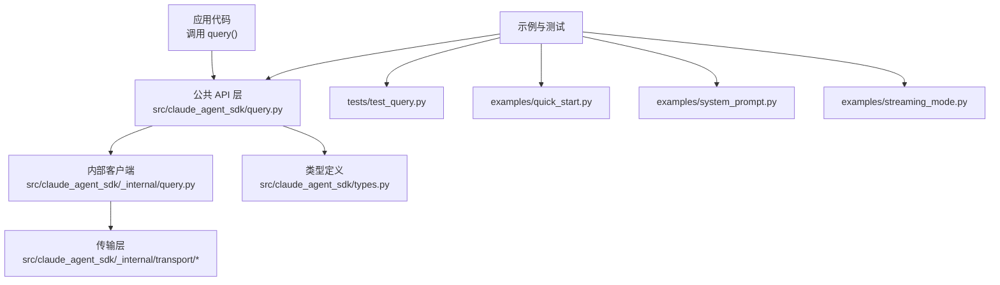
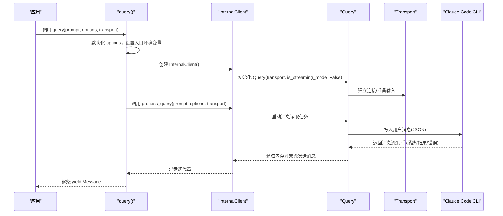
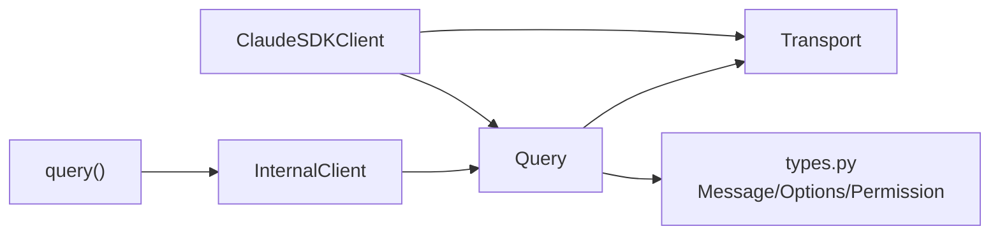

# 查询接口

<cite>
**本文引用的文件列表**
- [query.py](file://src/claude_agent_sdk/query.py)
- [_internal/query.py](file://src/claude_agent_sdk/_internal/query.py)
- [client.py](file://src/claude_agent_sdk/client.py)
- [types.py](file://src/claude_agent_sdk/types.py)
- [test_query.py](file://tests/test_query.py)
- [quick_start.py](file://examples/quick_start.py)
- [system_prompt.py](file://examples/system_prompt.py)
- [streaming_mode.py](file://examples/streaming_mode.py)
</cite>

## 目录
1. [简介](#简介)
2. [项目结构](#项目结构)
3. [核心组件](#核心组件)
4. [架构总览](#架构总览)
5. [详细组件分析](#详细组件分析)
6. [依赖分析](#依赖分析)
7. [性能考量](#性能考量)
8. [故障排查指南](#故障排查指南)
9. [结论](#结论)
10. [附录](#附录)

## 简介
本文件面向开发者，系统化地阐述 query() 函数的 API 使用方式与实现细节，覆盖以下关键点：
- 参数与返回值类型
- prompt 的两种模式：字符串模式（一次性查询）与 AsyncIterable 模式（单向流式交互）
- options 中 ClaudeAgentOptions 的关键配置项及其作用与默认值
- 完整使用示例：简单查询、带选项配置、流式模式、自定义传输
- query() 与 ClaudeSDKClient 的区别与适用场景
- 错误处理与最佳实践

## 项目结构
围绕 query() 的核心代码位于以下模块：
- 公共 API 层：对外导出的 query() 函数
- 内部实现层：内部客户端与控制协议处理
- 类型定义层：消息、选项、权限、钩子等类型
- 示例与测试：验证行为与用法

图表来源
- [query.py:12-127](file://src/claude_agent_sdk/query.py#L12-L127)
- [_internal/query.py:53-679](file://src/claude_agent_sdk/_internal/query.py#L53-L679)
- [types.py:1030-1199](file://src/claude_agent_sdk/types.py#L1030-L1199)
- [test_query.py:1-439](file://tests/test_query.py#L1-L439)
- [quick_start.py:1-77](file://examples/quick_start.py#L1-L77)
- [system_prompt.py:1-87](file://examples/system_prompt.py#L1-L87)
- [streaming_mode.py:1-512](file://examples/streaming_mode.py#L1-L512)

章节来源
- [query.py:1-127](file://src/claude_agent_sdk/query.py#L1-L127)
- [types.py:1030-1199](file://src/claude_agent_sdk/types.py#L1030-L1199)

## 核心组件
- query() 函数：对外暴露的一次性或单向流式查询入口，返回异步迭代器，逐条产出消息。
- InternalClient：内部客户端，负责初始化与调度底层 Query 实例。
- Query 类：封装控制协议、工具权限回调、钩子回调、MCP 服务器桥接、消息流管理与生命周期控制。
- ClaudeAgentOptions：查询选项集合，涵盖工具、系统提示、权限模式、工作目录、模型、钩子、MCP 服务器、调试输出等。
- Message 类型族：用户消息、助手消息、系统消息、结果消息、流事件、限流事件等。

章节来源
- [query.py:12-127](file://src/claude_agent_sdk/query.py#L12-L127)
- [_internal/query.py:53-679](file://src/claude_agent_sdk/_internal/query.py#L53-L679)
- [types.py:945-1199](file://src/claude_agent_sdk/types.py#L945-L1199)

## 架构总览
query() 的调用链路如下：
- 应用通过 query(prompt, options, transport) 发起请求
- 若未提供 options，默认构造 ClaudeAgentOptions()
- 设置环境变量以标识入口为“sdk-py”
- 创建 InternalClient 并委托其 process_query
- InternalClient 将控制权交给 Query，后者基于 Transport 进行读写
- Query 在需要时处理控制请求（如工具权限、钩子、MCP 消息），并将消息通过内存对象流回传给上层
- 上层以异步迭代器消费消息，直至结束标记

图表来源
- [query.py:12-127](file://src/claude_agent_sdk/query.py#L12-L127)
- [_internal/query.py:165-235](file://src/claude_agent_sdk/_internal/query.py#L165-L235)
- [types.py:945-1199](file://src/claude_agent_sdk/types.py#L945-L1199)

## 详细组件分析

### query() 函数 API 详解
- 函数签名与职责
  - 函数名：query
  - 返回类型：AsyncIterator[Message]
  - 用途：一次性或单向流式查询，适合无需双向通信与会话状态的场景
- 参数
  - prompt: 支持两种模式
    - 字符串：一次性发送，适用于简单问题、批处理、自动化脚本
    - AsyncIterable[dict[str, Any]]：单向流式发送多轮消息，每条消息需包含 type、message、parent_tool_use_id、session_id 等字段
  - options: 可选，ClaudeAgentOptions 配置；若为 None 则默认构造
  - transport: 可选，自定义传输实现；若提供则优先使用
- 行为与约束
  - 单向：先发完所有 prompt，再接收全部响应
  - 无中断：不支持在流中主动中断
  - 无会话：每次调用独立，不维护上下文
- 使用建议
  - 选择 query() 当你需要“一次性”、“无状态”的查询
  - 选择 ClaudeSDKClient 当你需要“可中断”、“可续聊”、“动态控制”的交互

章节来源
- [query.py:12-127](file://src/claude_agent_sdk/query.py#L12-L127)

### prompt 参数的两种模式
- 字符串模式
  - 适用：简单问题、批量处理、CI/CD 自动化
  - 特点：自动包装为单条用户消息，一次性发送
- AsyncIterable 模式（单向流式）
  - 适用：需要分步输入、逐步反馈的场景（仍为单向，不可后续追加）
  - 消息结构要点：type、message（role/content）、parent_tool_use_id、session_id
  - 流程：先发完所有消息，再接收所有响应

章节来源
- [query.py:46-54](file://src/claude_agent_sdk/query.py#L46-L54)
- [test_query.py:313-371](file://tests/test_query.py#L313-L371)

### options 参数与 ClaudeAgentOptions 配置项
ClaudeAgentOptions 的关键字段（非穷举，仅列与 query() 直接相关者）：
- tools / allowed_tools / disallowed_tools：工具集与白/黑名单
- system_prompt：系统提示，可为字符串或预设类型
- permission_mode：权限模式，影响工具执行策略
  - default：CLI 对危险工具进行确认
  - acceptEdits：自动接受文件编辑
  - bypassPermissions：允许所有工具（谨慎使用）
- cwd：工作目录
- model / fallback_model：模型选择
- mcp_servers：MCP 服务器配置（含 SDK MCP 服务器）
- hooks：钩子匹配器与回调
- include_partial_messages：是否包含部分消息更新
- enable_file_checkpointing：启用文件检查点（与 ClaudeSDKClient 更相关）
- stderr：CLI 标准错误回调
- env / extra_args / cli_path / settings / add_dirs / betas / agents / setting_sources / sandbox / plugins / thinking / output_format 等

默认值与行为
- 若 options 为 None，则默认构造 ClaudeAgentOptions()
- permission_mode 默认未设置，遵循 CLI 默认策略
- cwd 默认未设置，使用当前工作目录
- system_prompt 默认未设置，使用默认系统提示（若未显式指定）

章节来源
- [types.py:1030-1199](file://src/claude_agent_sdk/types.py#L1030-L1199)
- [query.py:55-63](file://src/claude_agent_sdk/query.py#L55-L63)

### Query 类与控制协议
- 角色与职责
  - 管理控制请求/响应路由
  - 处理工具权限回调与钩子回调
  - 管理消息流与初始化握手
  - 在存在 SDK MCP 服务器或钩子时，延迟关闭 stdin，确保控制请求得到处理
- 关键方法
  - initialize()：初始化控制协议（在流式模式下）
  - start()：启动消息读取任务
  - stream_input()：向传输写入消息流
  - receive_messages()：从内存流接收消息
  - close()：关闭任务组与传输
  - 控制协议方法：interrupt、set_permission_mode、set_model、rewind_files、reconnect_mcp_server、toggle_mcp_server、stop_task、get_mcp_status
- 生命周期与资源管理
  - 使用 anyio 的内存对象流与任务组
  - 在读取任务异常时，向流注入错误消息并结束流
  - 在首次结果到达后，根据配置决定何时关闭 stdin

章节来源
- [_internal/query.py:53-679](file://src/claude_agent_sdk/_internal/query.py#L53-L679)

### 与 ClaudeSDKClient 的区别与适用场景
- query()
  - 单向、无状态、一次性
  - 适合简单查询、批处理、自动化脚本
  - 不支持中断、不维护会话
- ClaudeSDKClient
  - 双向、有状态、可交互
  - 支持中断、会话管理、动态消息发送
  - 适合聊天界面、REPL、长对话、实时应用

章节来源
- [query.py:25-43](file://src/claude_agent_sdk/query.py#L25-L43)
- [client.py:21-60](file://src/claude_agent_sdk/client.py#L21-L60)

### 使用示例与最佳实践
- 简单查询
  - 参考：examples/quick_start.py
  - 关键点：直接传入字符串 prompt，遍历异步迭代器获取消息
- 带选项配置
  - 参考：examples/system_prompt.py
  - 关键点：通过 ClaudeAgentOptions 指定 system_prompt、allowed_tools 等
- 流式模式（单向）
  - 参考：tests/test_query.py
  - 关键点：实现 AsyncIterable，逐条产出消息字典；注意 session_id 与 message 结构
- 自定义传输
  - 参考：query() 文档注释中的示例
  - 关键点：实现 Transport 接口并传入 transport 参数

章节来源
- [quick_start.py:15-76](file://examples/quick_start.py#L15-L76)
- [system_prompt.py:14-87](file://examples/system_prompt.py#L14-L87)
- [test_query.py:313-371](file://tests/test_query.py#L313-L371)
- [query.py:99-113](file://src/claude_agent_sdk/query.py#L99-L113)

### 错误处理与边界行为
- 控制协议错误
  - Query 在处理控制请求时捕获异常，并通过控制响应返回错误
- 传输异常
  - 读取任务异常时，向消息流注入错误消息并结束流
- stdin 关闭策略
  - 存在 SDK MCP 服务器或钩子时，等待首个结果后再关闭 stdin，避免丢失控制请求
  - 不存在时立即关闭 stdin
- 超时与取消
  - 控制请求存在超时机制，超时抛出异常
  - 读取任务支持取消，预期行为

章节来源
- [_internal/query.py:172-235](file://src/claude_agent_sdk/_internal/query.py#L172-L235)
- [_internal/query.py:347-393](file://src/claude_agent_sdk/_internal/query.py#L347-L393)
- [test_query.py:114-197](file://tests/test_query.py#L114-L197)
- [test_query.py:310-372](file://tests/test_query.py#L310-L372)

## 依赖分析
- query() 依赖 InternalClient 与 Transport
- InternalClient 依赖 Query 与 Transport
- Query 依赖 anyio、mcp.types、类型定义（PermissionResult、SDKControlRequest 等）
- ClaudeSDKClient 提供双向能力，内部同样依赖 Query 与 Transport

图表来源
- [query.py:7-9](file://src/claude_agent_sdk/query.py#L7-L9)
- [_internal/query.py:17-26](file://src/claude_agent_sdk/_internal/query.py#L17-L26)
- [types.py:1030-1199](file://src/claude_agent_sdk/types.py#L1030-L1199)
- [client.py:9-18](file://src/claude_agent_sdk/client.py#L9-L18)

章节来源
- [query.py:7-9](file://src/claude_agent_sdk/query.py#L7-L9)
- [_internal/query.py:17-26](file://src/claude_agent_sdk/_internal/query.py#L17-L26)
- [types.py:1030-1199](file://src/claude_agent_sdk/types.py#L1030-L1199)
- [client.py:9-18](file://src/claude_agent_sdk/client.py#L9-L18)

## 性能考量
- 流式输入与输出
  - 使用内存对象流进行消息传递，避免阻塞
  - 控制请求超时可配置，避免长时间等待
- 传输层
  - 可替换为自定义 Transport 以适配不同运行时或平台
- 资源管理
  - 读取任务在异常时及时清理，避免资源泄漏
  - stdin 关闭时机优化，减少不必要的等待

## 故障排查指南
- 无法收到控制响应
  - 检查是否存在 SDK MCP 服务器或钩子；这些情况下需要保持 stdin 打开直到首个结果
  - 参考测试用例对 stdin 关闭时机的验证
- 权限被拒绝
  - 检查 permission_mode 与 can_use_tool 回调配置
  - 确认 allowed_tools/disallowed_tools 与工具名称一致
- 模型或系统提示无效
  - 确认 model/fallback_model 与 system_prompt 设置正确
- 传输异常
  - 检查自定义 Transport 的实现与连接状态
  - 查看 stderr 输出回调（若配置）

章节来源
- [test_query.py:114-197](file://tests/test_query.py#L114-L197)
- [test_query.py:310-372](file://tests/test_query.py#L310-L372)
- [types.py:1030-1199](file://src/claude_agent_sdk/types.py#L1030-L1199)

## 结论
- query() 适合“一次性、无状态、单向”的查询场景，API 简洁、易用且性能稳定
- ClaudeSDKClient 适合“可中断、可续聊、动态控制”的交互场景，功能更丰富但复杂度更高
- 正确理解 prompt 的两种模式与 options 的关键配置项，是写出健壮脚本与应用的关键

## 附录
- 示例参考路径
  - 快速开始：examples/quick_start.py
  - 系统提示示例：examples/system_prompt.py
  - 流式模式示例：examples/streaming_mode.py
  - 单元测试验证：tests/test_query.py