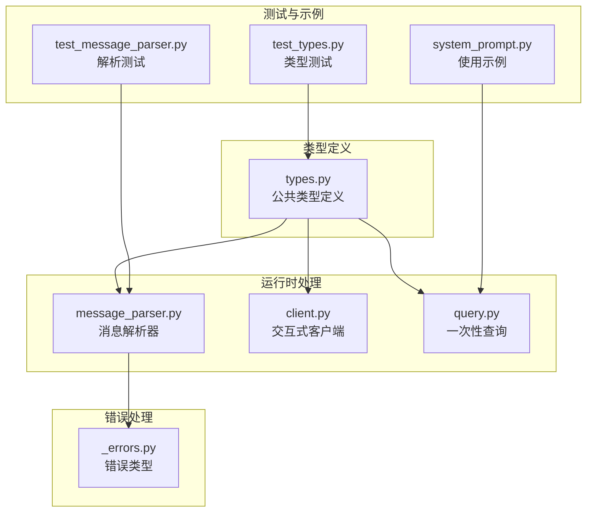
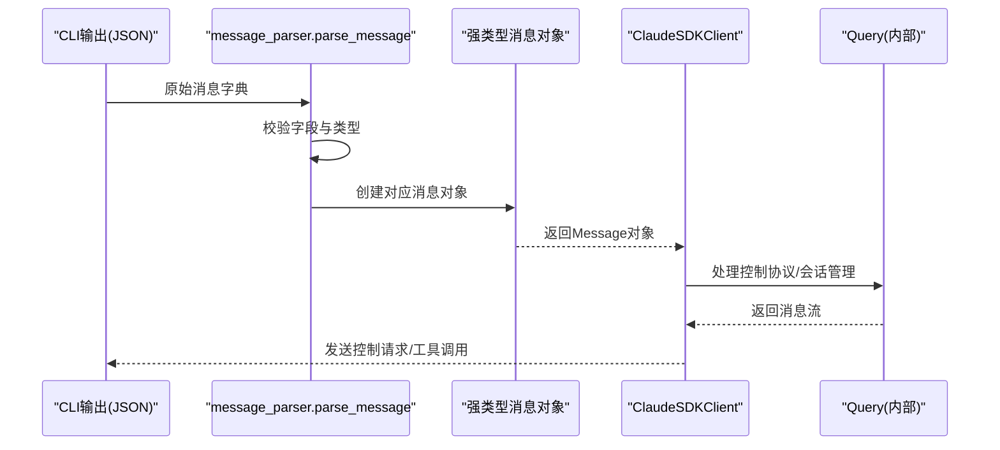
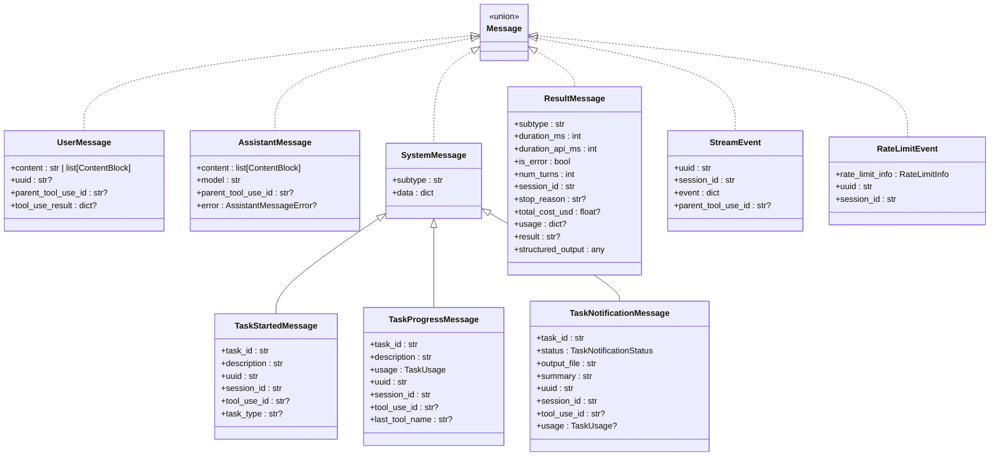
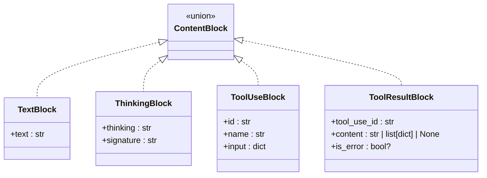
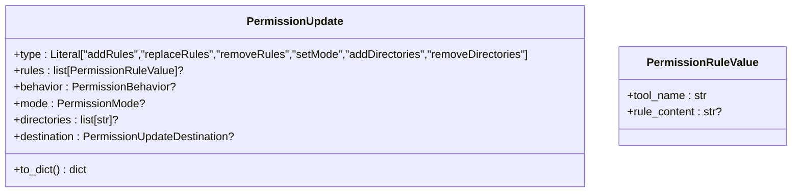
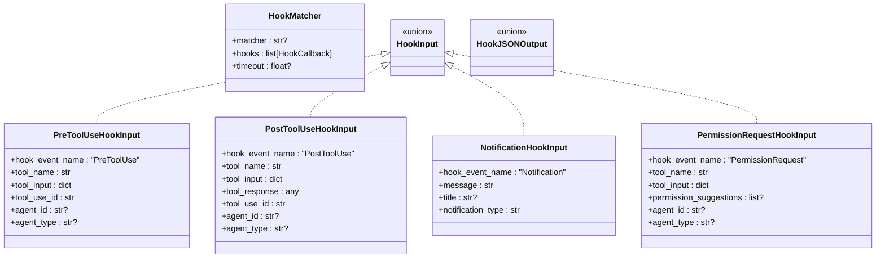
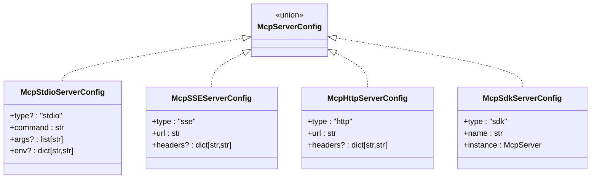
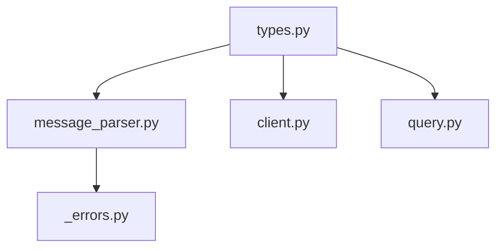

# 类型系统

<cite>
**本文档引用的文件**
- [types.py](file://src/claude_agent_sdk/types.py)
- [message_parser.py](file://src/claude_agent_sdk/_internal/message_parser.py)
- [client.py](file://src/claude_agent_sdk/client.py)
- [query.py](file://src/claude_agent_sdk/query.py)
- [_errors.py](file://src/claude_agent_sdk/_errors.py)
- [test_types.py](file://tests/test_types.py)
- [test_message_parser.py](file://tests/test_message_parser.py)
- [system_prompt.py](file://examples/system_prompt.py)
</cite>

## 目录
1. [简介](#简介)
2. [项目结构](#项目结构)
3. [核心组件](#核心组件)
4. [架构概览](#架构概览)
5. [详细组件分析](#详细组件分析)
6. [依赖分析](#依赖分析)
7. [性能考虑](#性能考虑)
8. [故障排除指南](#故障排除指南)
9. [结论](#结论)

## 简介
本文件详细描述了 Claude Agent SDK 的类型系统API，涵盖所有公共类型定义、字段说明、类型注解、使用示例、验证规则和约束条件。重点包括：
- 消息类型层次结构：用户消息、助手消息、系统消息、结果消息
- 配置类型：ClaudeAgentOptions
- 内容块类型：TextBlock、ThinkingBlock、ToolUseBlock、ToolResultBlock
- 权限控制、钩子系统、MCP服务器配置等高级类型
- 类型之间的关系与继承结构
- 实际使用示例与最佳实践

## 项目结构
类型系统主要位于 `src/claude_agent_sdk/types.py`，并与消息解析器、客户端和查询函数协同工作：
- types.py：定义所有公共类型（消息、内容块、配置、权限、钩子、MCP等）
- message_parser.py：将CLI输出解析为强类型消息对象
- client.py：提供交互式客户端，支持流式消息、中断、权限模式切换等
- query.py：提供一次性查询接口，适合简单场景
- _errors.py：定义SDK错误类型，包括消息解析错误
- 测试与示例：验证类型行为并演示使用方式

**图表来源**
- [types.py:1-1199](file://src/claude_agent_sdk/types.py#L1-L1199)
- [message_parser.py:1-251](file://src/claude_agent_sdk/_internal/message_parser.py#L1-L251)
- [client.py:1-500](file://src/claude_agent_sdk/client.py#L1-L500)
- [query.py:1-127](file://src/claude_agent_sdk/query.py#L1-L127)
- [_errors.py:1-57](file://src/claude_agent_sdk/_errors.py#L1-L57)

**章节来源**
- [types.py:1-1199](file://src/claude_agent_sdk/types.py#L1-L1199)
- [message_parser.py:1-251](file://src/claude_agent_sdk/_internal/message_parser.py#L1-L251)
- [client.py:1-500](file://src/claude_agent_sdk/client.py#L1-L500)
- [query.py:1-127](file://src/claude_agent_sdk/query.py#L1-L127)

## 核心组件
本节概述所有公共类型及其职责：
- 消息类型：UserMessage、AssistantMessage、SystemMessage、ResultMessage、StreamEvent、RateLimitEvent
- 内容块类型：TextBlock、ThinkingBlock、ToolUseBlock、ToolResultBlock
- 配置类型：ClaudeAgentOptions
- 权限类型：PermissionMode、PermissionBehavior、PermissionUpdate、PermissionRuleValue
- 钩子类型：HookEvent、HookInput、HookJSONOutput、HookCallback、HookMatcher
- MCP类型：McpServerConfig、McpServerStatus、McpToolInfo等
- 其他：ThinkingConfig、SandboxSettings、SdkPluginConfig等

**章节来源**
- [types.py:17-1199](file://src/claude_agent_sdk/types.py#L17-L1199)

## 架构概览
类型系统围绕消息流展开，从CLI输出到强类型对象的转换流程如下：

**图表来源**
- [message_parser.py:29-251](file://src/claude_agent_sdk/_internal/message_parser.py#L29-L251)
- [client.py:94-185](file://src/claude_agent_sdk/client.py#L94-L185)
- [types.py:945-952](file://src/claude_agent_sdk/types.py#L945-L952)

## 详细组件分析

### 消息类型层次结构
消息类型通过联合类型统一管理，支持多态处理：
- Message = UserMessage | AssistantMessage | SystemMessage | ResultMessage | StreamEvent | RateLimitEvent
- SystemMessage 下有 TaskStartedMessage、TaskProgressMessage、TaskNotificationMessage 子类
- AssistantMessageError 定义助手消息错误枚举

**图表来源**
- [types.py:766-952](file://src/claude_agent_sdk/types.py#L766-L952)
- [types.py:817-886](file://src/claude_agent_sdk/types.py#L817-L886)

**章节来源**
- [types.py:766-952](file://src/claude_agent_sdk/types.py#L766-L952)
- [message_parser.py:29-251](file://src/claude_agent_sdk/_internal/message_parser.py#L29-L251)

### 内容块类型
内容块用于表示消息中的不同内容单元，支持文本、思考、工具调用和工具结果：
- TextBlock：纯文本内容
- ThinkingBlock：思考内容（含签名）
- ToolUseBlock：工具调用（含ID、名称、输入）
- ToolResultBlock：工具结果（含工具ID、内容、是否错误）

**图表来源**
- [types.py:729-763](file://src/claude_agent_sdk/types.py#L729-L763)

**章节来源**
- [types.py:729-763](file://src/claude_agent_sdk/types.py#L729-L763)
- [message_parser.py:58-128](file://src/claude_agent_sdk/_internal/message_parser.py#L58-L128)

### 配置类型：ClaudeAgentOptions
ClaudeAgentOptions 提供丰富的配置项，涵盖工具、系统提示、MCP服务器、权限模式、模型选择、钩子、沙箱、插件等。以下为关键字段说明与作用域：

- 工具与权限
  - tools: 工具列表或预设
  - allowed_tools: 明确允许的工具列表
  - disallowed_tools: 明确禁止的工具列表
  - permission_mode: 权限模式（default、acceptEdits、plan、bypassPermissions）
  - permission_prompt_tool_name: 控制协议工具名（用于权限提示）
  - can_use_tool: 工具使用回调（异步，返回权限结果）

- 系统提示与会话
  - system_prompt: 字符串或预设系统提示
  - continue_conversation: 继续对话
  - resume: 会话恢复标识
  - max_turns: 最大轮次
  - max_budget_usd: 最大预算（美元）

- 模型与Beta特性
  - model/fallback_model: 主模型与回退模型
  - betas: Beta功能列表（如context-1m-2025-08-07）

- 工作目录与路径
  - cwd: 工作目录
  - cli_path: CLI可执行文件路径
  - settings: 设置文件路径

- 环境变量与额外参数
  - env: 环境变量映射
  - extra_args: 任意CLI标志

- 缓冲区与调试
  - max_buffer_size: CLI stdout最大缓冲大小
  - debug_stderr/stderr: 调试输出回调

- 钩子与代理
  - hooks: 钩子事件到匹配器的映射
  - user: 用户标识

- 部分消息流与会话控制
  - include_partial_messages: 是否包含部分消息
  - fork_session: 恢复时是否分叉新会话

- 自定义代理与设置源
  - agents: 自定义代理定义
  - setting_sources: 设置来源（user、project、local）

- 沙箱与插件
  - sandbox: 沙箱配置（网络、忽略违规等）
  - plugins: SDK插件配置（本地插件）

- 思维与输出格式
  - thinking: 思维配置（adaptive/enabled/disabled）
  - effort: 思维深度（low/medium/high/max）
  - output_format: 结构化输出格式（与Messages API结构匹配）
  - enable_file_checkpointing: 启用文件检查点以支持回溯

- 文件检查点
  - replay-user-messages: 在响应流中接收UserMessage以获取uuid

使用示例（路径参考）：
- [examples/system_prompt.py:30-74](file://examples/system_prompt.py#L30-L74) 展示了不同系统提示配置的使用方法
- [tests/test_types.py:84-160](file://tests/test_types.py#L84-L160) 包含对ClaudeAgentOptions的多种配置测试

**章节来源**
- [types.py:1029-1099](file://src/claude_agent_sdk/types.py#L1029-L1099)
- [system_prompt.py:14-76](file://examples/system_prompt.py#L14-L76)
- [test_types.py:84-160](file://tests/test_types.py#L84-L160)

### 权限控制类型
权限控制类型用于动态授权工具使用，支持规则增删改、模式设置、目录管理等：
- PermissionMode: 权限模式枚举
- PermissionBehavior: 行为（allow/deny/ask）
- PermissionUpdate: 权限更新操作（带to_dict转换）
- PermissionRuleValue: 规则值（工具名+规则内容）
- PermissionUpdateDestination: 更新目标（用户设置、项目设置、本地设置、会话）

**图表来源**
- [types.py:52-121](file://src/claude_agent_sdk/types.py#L52-L121)

**章节来源**
- [types.py:52-121](file://src/claude_agent_sdk/types.py#L52-L121)

### 钩子类型系统
钩子系统提供事件驱动的扩展机制，支持工具生命周期、用户提交、停止、通知、子代理等事件：
- HookEvent: 事件枚举（PreToolUse、PostToolUse、PostToolUseFailure、UserPromptSubmit、Stop、SubagentStop、PreCompact、Notification、SubagentStart、PermissionRequest）
- HookInput: 强类型输入（按事件区分）
- HookJSONOutput: 同步/异步钩子输出（包含控制字段与决策字段）
- HookCallback: 钩子回调函数签名
- HookMatcher: 匹配器（正则表达式匹配工具名，超时设置）

**图表来源**
- [types.py:160-310](file://src/claude_agent_sdk/types.py#L160-L310)
- [types.py:313-452](file://src/claude_agent_sdk/types.py#L313-L452)
- [types.py:476-491](file://src/claude_agent_sdk/types.py#L476-L491)

**章节来源**
- [types.py:160-491](file://src/claude_agent_sdk/types.py#L160-L491)
- [test_types.py:162-288](file://tests/test_types.py#L162-L288)

### MCP服务器配置与状态
MCP（Model Context Protocol）服务器类型支持多种连接方式：
- McpServerConfig: 联合类型（stdio、sse、http、sdk）
- McpServerStatus: 连接状态（名称、状态、服务器信息、错误、配置、范围、工具）
- McpToolInfo/McpToolAnnotations: 工具信息与注解
- McpStatusResponse: 包装状态列表的响应

**图表来源**
- [types.py:493-529](file://src/claude_agent_sdk/types.py#L493-L529)

**章节来源**
- [types.py:493-640](file://src/claude_agent_sdk/types.py#L493-L640)
- [test_types.py:336-429](file://tests/test_types.py#L336-L429)

### 沙箱与插件配置
- SandboxSettings: 沙箱启用、自动允许、排除命令、网络配置、忽略违规、弱化嵌套沙箱等
- SdkPluginConfig: SDK插件（本地类型与路径）

**章节来源**
- [types.py:652-727](file://src/claude_agent_sdk/types.py#L652-L727)
- [types.py:642-651](file://src/claude_agent_sdk/types.py#L642-L651)

### 思维配置与输出格式
- ThinkingConfig: adaptive/enabled/disabled三种模式，enabled时可指定预算令牌数
- output_format: 结构化输出格式（与Messages API结构匹配）

**章节来源**
- [types.py:1013-1094](file://src/claude_agent_sdk/types.py#L1013-L1094)

## 依赖分析
类型系统内部依赖关系清晰，主要体现在：
- types.py 定义所有公共类型，被 message_parser.py、client.py、query.py 使用
- message_parser.py 依赖 types 中的消息与内容块类型进行解析
- client.py 依赖 types 中的 ClaudeAgentOptions、Message、HookEvent 等
- 错误类型在 _errors.py 中定义，message_parser.py 抛出 MessageParseError

**图表来源**
- [types.py:1-1199](file://src/claude_agent_sdk/types.py#L1-L1199)
- [message_parser.py:1-251](file://src/claude_agent_sdk/_internal/message_parser.py#L1-L251)
- [client.py:1-500](file://src/claude_agent_sdk/client.py#L1-L500)
- [query.py:1-127](file://src/claude_agent_sdk/query.py#L1-L127)
- [_errors.py:1-57](file://src/claude_agent_sdk/_errors.py#L1-L57)

**章节来源**
- [types.py:1-1199](file://src/claude_agent_sdk/types.py#L1-L1199)
- [message_parser.py:1-251](file://src/claude_agent_sdk/_internal/message_parser.py#L1-L251)
- [client.py:1-500](file://src/claude_agent_sdk/client.py#L1-L500)
- [query.py:1-127](file://src/claude_agent_sdk/query.py#L1-L127)

## 性能考虑
- 流式消息处理：通过 AsyncIterable 支持连续交互，避免一次性加载大量数据
- 缓冲区限制：max_buffer_size 可控CLI stdout缓冲大小，防止内存占用过高
- 部分消息流：include_partial_messages 可减少等待时间，提升用户体验
- 解析优化：message_parser 使用匹配模式快速识别消息类型，降低分支开销

[本节为通用指导，无需特定文件来源]

## 故障排除指南
常见问题与解决方案：
- 消息解析失败
  - 症状：MessageParseError 异常
  - 原因：缺少必需字段、未知消息类型、JSON解码失败
  - 处理：检查CLI输出格式，确保字段完整；对未知类型保持向前兼容
  - 参考：[_errors.py:51-57](file://src/claude_agent_sdk/_errors.py#L51-L57)，[message_parser.py:29-251](file://src/claude_agent_sdk/_internal/message_parser.py#L29-L251)

- 权限冲突
  - 症状：can_use_tool 回调与 permission_prompt_tool_name 同时使用时报错
  - 处理：二选一；若使用 can_use_tool，需提供流式提示
  - 参考：[client.py:112-131](file://src/claude_agent_sdk/client.py#L112-L131)

- MCP服务器连接问题
  - 症状：状态为 failed 或 needs-auth
  - 处理：使用 reconnect_mcp_server 或 toggle_mcp_server 修复；检查配置与网络
  - 参考：[client.py:314-360](file://src/claude_agent_sdk/client.py#L314-L360)，[types.py:598-640](file://src/claude_agent_sdk/types.py#L598-L640)

**章节来源**
- [_errors.py:51-57](file://src/claude_agent_sdk/_errors.py#L51-L57)
- [message_parser.py:29-251](file://src/claude_agent_sdk/_internal/message_parser.py#L29-L251)
- [client.py:112-131](file://src/claude_agent_sdk/client.py#L112-L131)
- [types.py:598-640](file://src/claude_agent_sdk/types.py#L598-L640)

## 结论
本类型系统提供了强类型、可扩展且易于使用的API，覆盖消息流、权限控制、钩子扩展、MCP集成等多个方面。通过明确的字段定义、严格的验证规则和丰富的使用示例，开发者可以高效构建与 Claude Code 的交互应用。建议在实际开发中：
- 优先使用强类型对象而非原始字典
- 利用 include_partial_messages 提升响应速度
- 正确配置 sandbox 与权限策略
- 通过钩子系统实现细粒度控制与扩展