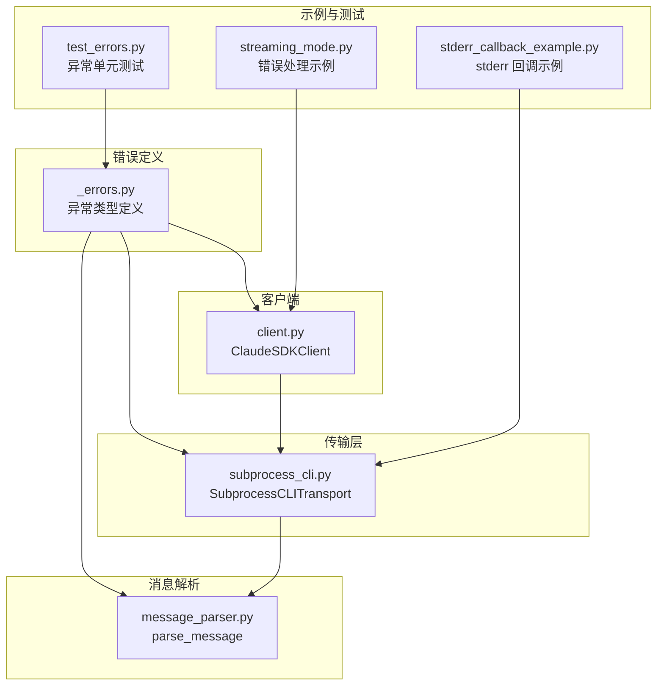
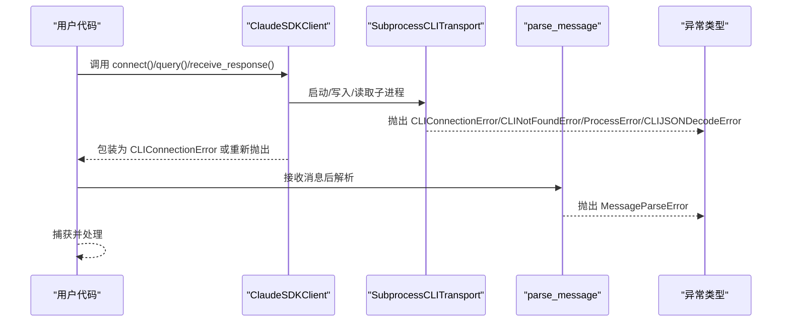
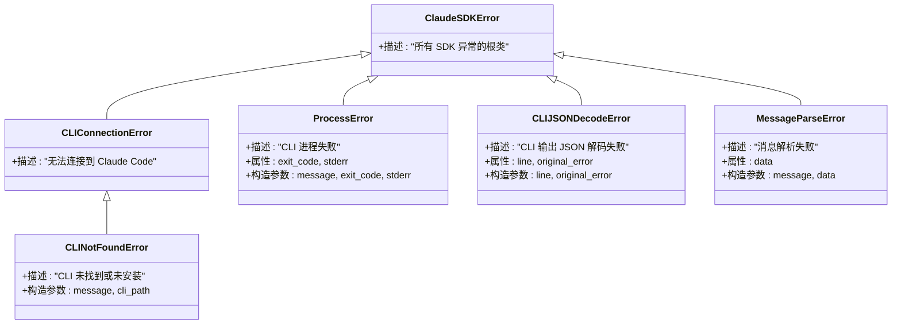
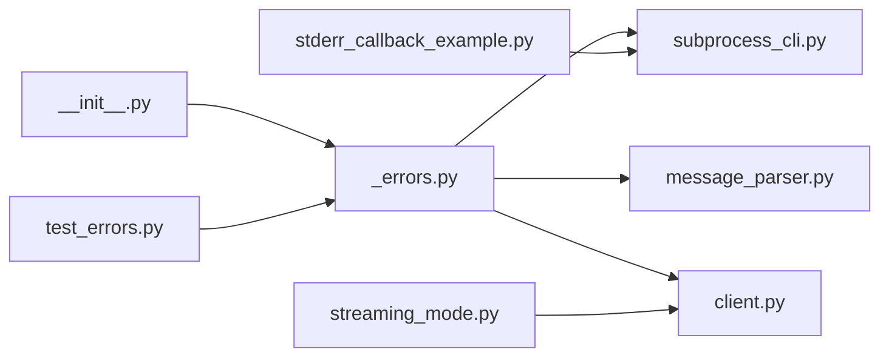

# 错误处理

<cite>
**本文引用的文件**
- [_errors.py](file://src/claude_agent_sdk/_errors.py)
- [__init__.py](file://src/claude_agent_sdk/__init__.py)
- [subprocess_cli.py](file://src/claude_agent_sdk/_internal/transport/subprocess_cli.py)
- [message_parser.py](file://src/claude_agent_sdk/_internal/message_parser.py)
- [client.py](file://src/claude_agent_sdk/client.py)
- [test_errors.py](file://tests/test_errors.py)
- [streaming_mode.py](file://examples/streaming_mode.py)
- [stderr_callback_example.py](file://examples/stderr_callback_example.py)
</cite>

## 目录
1. [简介](#简介)
2. [项目结构](#项目结构)
3. [核心组件](#核心组件)
4. [架构总览](#架构总览)
5. [详细组件分析](#详细组件分析)
6. [依赖分析](#依赖分析)
7. [性能考虑](#性能考虑)
8. [故障排查指南](#故障排查指南)
9. [结论](#结论)
10. [附录](#附录)

## 简介
本文件面向使用 Claude Agent SDK 的开发者，系统化梳理 SDK 的错误处理体系与最佳实践。内容覆盖：
- 异常类型与层次结构：从基础异常到具体异常的继承关系与职责边界
- 触发条件与错误信息：每类异常在何种场景下被抛出、携带哪些上下文信息
- 处理建议：如何捕获、恢复与向用户呈现友好提示
- 异步环境中的异常处理：协程、任务组、超时与中断场景下的异常传播
- 常见错误场景与解决方案：CLI 找不到、进程失败、JSON 解析失败、消息解析失败等
- 调试与诊断：如何利用 stderr 回调、日志与版本检查定位问题

## 项目结构
错误处理相关代码主要分布在以下模块：
- 异常定义：位于错误模块中，统一对外暴露
- 传输层：负责 CLI 进程生命周期、连接与输出读取，并在异常路径上抛出相应异常
- 消息解析：负责将 CLI 输出转换为结构化消息对象，解析失败时抛出解析异常
- 客户端封装：对外提供高层 API，内部在关键路径上进行异常包装与传播
- 示例与测试：展示典型异常场景与处理模式

图表来源
- [_errors.py:1-57](file://src/claude_agent_sdk/_errors.py#L1-L57)
- [subprocess_cli.py:1-630](file://src/claude_agent_sdk/_internal/transport/subprocess_cli.py#L1-L630)
- [message_parser.py:1-251](file://src/claude_agent_sdk/_internal/message_parser.py#L1-L251)
- [client.py:1-500](file://src/claude_agent_sdk/client.py#L1-L500)
- [streaming_mode.py:420-465](file://examples/streaming_mode.py#L420-L465)
- [stderr_callback_example.py:1-44](file://examples/stderr_callback_example.py#L1-L44)
- [test_errors.py:1-53](file://tests/test_errors.py#L1-L53)

章节来源
- [__init__.py:9-15](file://src/claude_agent_sdk/__init__.py#L9-L15)
- [__init__.py:438-444](file://src/claude_agent_sdk/__init__.py#L438-L444)

## 核心组件
本节聚焦异常类型与职责划分，帮助快速定位问题来源与处理策略。

- 基类：ClaudeSDKError
  - 作用：所有 SDK 内部异常的根类，便于统一捕获与分类处理
  - 典型用法：作为 try/except 的通用捕获目标，或用于自定义业务异常的基类

- CLI 连接相关
  - CLIConnectionError：无法连接到 Claude Code 时抛出，通常发生在启动子进程失败、工作目录不存在、CLI 不可用等场景
  - CLINotFoundError：当 CLI 二进制未找到（含多处搜索路径）时抛出，支持携带 CLI 路径以便诊断

- 进程与输出相关
  - ProcessError：CLI 进程退出码非零时抛出，携带 exit_code 与 stderr 提示，便于定位执行失败原因
  - CLIJSONDecodeError：CLI 输出 JSON 超过缓冲区限制或无法解码时抛出，携带原始行与原始异常，便于定位问题行与上下文

- 消息解析相关
  - MessageParseError：CLI 输出的消息格式不符合预期（如缺少字段、类型不匹配）时抛出，携带原始数据以便回溯

章节来源
- [_errors.py:6-56](file://src/claude_agent_sdk/_errors.py#L6-L56)

## 架构总览
SDK 的异常传播遵循“底层抛出、上层包装、统一暴露”的设计。传输层负责与 CLI 进程交互并在异常路径上抛出具体异常；消息解析层在输出格式不符合预期时抛出解析异常；客户端在关键 API 调用前进行前置校验并在异常路径上进行包装；最终通过包导出统一暴露给使用者。

图表来源
- [client.py:94-180](file://src/claude_agent_sdk/client.py#L94-L180)
- [subprocess_cli.py:335-411](file://src/claude_agent_sdk/_internal/transport/subprocess_cli.py#L335-L411)
- [subprocess_cli.py:519-586](file://src/claude_agent_sdk/_internal/transport/subprocess_cli.py#L519-L586)
- [message_parser.py:29-251](file://src/claude_agent_sdk/_internal/message_parser.py#L29-L251)

## 详细组件分析

### 异常层次与继承关系
SDK 的异常体系以 ClaudeSDKError 为根，按功能域细分，形成清晰的继承层次，便于精准捕获与处理。

图表来源
- [_errors.py:6-56](file://src/claude_agent_sdk/_errors.py#L6-L56)

章节来源
- [_errors.py:6-56](file://src/claude_agent_sdk/_errors.py#L6-L56)

### 异常触发条件与处理建议

- CLIConnectionError
  - 触发条件
    - 子进程启动失败（工作目录不存在、CLI 路径不可用）
    - 写入/读取管道时进程已终止或状态异常
    - 客户端在未连接状态下调用查询/中断等方法
  - 错误信息
    - 包含明确的失败原因与上下文（如工作目录、CLI 路径）
  - 处理建议
    - 在调用 connect() 前确保 CLI 可用且工作目录存在
    - 对外捕获该异常，提示用户检查 CLI 安装与权限
    - 在 finally 中确保断开连接，避免资源泄漏

- CLINotFoundError
  - 触发条件
    - CLI 二进制在多处搜索路径均未找到
  - 错误信息
    - 包含默认提示与可选的 CLI 路径
  - 处理建议
    - 引导用户安装 CLI 或通过选项显式指定路径
    - 提供安装指引与环境变量设置建议

- ProcessError
  - 触发条件
    - CLI 进程以非零退出码结束
  - 错误信息
    - 包含 exit_code 与 stderr 提示，便于定位失败原因
  - 处理建议
    - 记录 exit_code 并引导用户查看 stderr 输出
    - 对于可重试场景（如网络波动），建议指数退避重试

- CLIJSONDecodeError
  - 触发条件
    - CLI 输出 JSON 超过最大缓冲区限制或无法解码
  - 错误信息
    - 包含原始行片段与原始异常
  - 处理建议
    - 检查 CLI 版本兼容性与输出格式
    - 调整缓冲区大小或优化输出流

- MessageParseError
  - 触发条件
    - CLI 输出的消息格式缺失关键字段或类型不匹配
  - 错误信息
    - 包含原始数据，便于回溯
  - 处理建议
    - 记录原始数据并上报，同时提示用户升级 SDK 或 CLI

章节来源
- [subprocess_cli.py:396-410](file://src/claude_agent_sdk/_internal/transport/subprocess_cli.py#L396-L410)
- [subprocess_cli.py:572-586](file://src/claude_agent_sdk/_internal/transport/subprocess_cli.py#L572-L586)
- [subprocess_cli.py:549-554](file://src/claude_agent_sdk/_internal/transport/subprocess_cli.py#L549-L554)
- [message_parser.py:42-51](file://src/claude_agent_sdk/_internal/message_parser.py#L42-L51)
- [client.py:186-196](file://src/claude_agent_sdk/client.py#L186-L196)
- [client.py:208-210](file://src/claude_agent_sdk/client.py#L208-L210)

### 异步环境中的异常处理
- 协程与任务组
  - 客户端在连接后维护一个持久的任务组用于读取消息，跨不同异步运行时上下文使用会受限
  - 建议在同一异步上下文中完成所有操作，避免跨上下文共享客户端实例
- 超时与中断
  - 使用 asyncio.timeout 控制接收响应的超时时间，捕获 TimeoutError 并优雅降级
  - 支持中断请求，但仅在流式模式下有效；中断后需重新发送消息
- 资源清理
  - 在 finally 中断开连接，确保进程与流资源释放

章节来源
- [client.py:53-60](file://src/claude_agent_sdk/client.py#L53-L60)
- [client.py:420-442](file://src/claude_agent_sdk/client.py#L420-L442)
- [streaming_mode.py:448-458](file://examples/streaming_mode.py#L448-L458)

### 常见错误场景与解决方案

- CLI 未找到
  - 现象：启动时报 CLINotFoundError
  - 解决：安装 CLI 或通过选项显式指定路径；参考示例中的 stderr 回调定位问题
  - 参考示例
    - [stderr_callback_example.py:1-44](file://examples/stderr_callback_example.py#L1-L44)

- 工作目录不存在
  - 现象：启动时报 CLIConnectionError，提示工作目录不存在
  - 解决：确保工作目录存在或修正选项配置

- 进程执行失败
  - 现象：进程以非零退出码结束，抛出 ProcessError
  - 解决：查看 stderr 输出与 exit_code，定位具体失败原因

- JSON 缓冲区溢出或解码失败
  - 现象：抛出 CLIJSONDecodeError，包含原始行与异常
  - 解决：检查 CLI 版本与输出格式，必要时调整缓冲区或优化输出

- 消息解析失败
  - 现象：抛出 MessageParseError，包含原始数据
  - 解决：记录原始数据并上报，提示升级 SDK 或 CLI

章节来源
- [subprocess_cli.py:88-95](file://src/claude_agent_sdk/_internal/transport/subprocess_cli.py#L88-L95)
- [subprocess_cli.py:396-410](file://src/claude_agent_sdk/_internal/transport/subprocess_cli.py#L396-L410)
- [subprocess_cli.py:572-586](file://src/claude_agent_sdk/_internal/transport/subprocess_cli.py#L572-L586)
- [subprocess_cli.py:549-554](file://src/claude_agent_sdk/_internal/transport/subprocess_cli.py#L549-L554)
- [message_parser.py:42-51](file://src/claude_agent_sdk/_internal/message_parser.py#L42-L51)

### 错误处理最佳实践

- 捕获策略
  - 优先捕获具体异常（如 CLIConnectionError、ProcessError），再捕获通用异常
  - 对外部暴露统一的错误信息，避免泄露内部实现细节
- 错误恢复
  - 对于可重试的网络/IO 类错误，采用指数退避策略
  - 对于 CLI 版本不兼容导致的错误，引导用户升级 CLI
- 用户友好提示
  - 将技术错误映射为用户可理解的语言，提供下一步操作建议
- 日志与诊断
  - 使用 stderr 回调收集 CLI 输出，结合日志记录关键上下文
  - 在异常中保留原始数据与上下文，便于后续排查

章节来源
- [streaming_mode.py:448-458](file://examples/streaming_mode.py#L448-L458)
- [stderr_callback_example.py:14-25](file://examples/stderr_callback_example.py#L14-L25)

## 依赖分析
异常类型在多个模块中被使用，形成“定义—使用—暴露”的闭环。

图表来源
- [_errors.py:1-57](file://src/claude_agent_sdk/_errors.py#L1-L57)
- [subprocess_cli.py:21-25](file://src/claude_agent_sdk/_internal/transport/subprocess_cli.py#L21-L25)
- [message_parser.py:6-24](file://src/claude_agent_sdk/_internal/message_parser.py#L6-L24)
- [client.py:9-18](file://src/claude_agent_sdk/client.py#L9-L18)
- [__init__.py:9-15](file://src/claude_agent_sdk/__init__.py#L9-L15)
- [streaming_mode.py:420-465](file://examples/streaming_mode.py#L420-L465)
- [stderr_callback_example.py:1-44](file://examples/stderr_callback_example.py#L1-L44)
- [test_errors.py:1-53](file://tests/test_errors.py#L1-L53)

章节来源
- [__init__.py:9-15](file://src/claude_agent_sdk/__init__.py#L9-L15)

## 性能考虑
- 缓冲区限制：JSON 解码缓冲区过大可能导致内存压力，应根据实际输出规模合理设置
- 进程管理：避免频繁重启 CLI 进程，尽量复用连接以减少启动开销
- 超时控制：为长时间等待的操作设置合理的超时，防止阻塞线程或协程

## 故障排查指南

- 如何捕获与处理异常
  - 在调用客户端 API 前后设置 try/except，优先捕获具体异常
  - 在 finally 中断开连接，确保资源释放
- 如何查看 CLI 输出
  - 使用 stderr 回调收集 CLI 输出，便于定位问题
- 如何验证 CLI 版本
  - 传输层会在启动时进行版本检查，低于最低要求会发出警告
- 如何复现与验证
  - 使用单元测试与示例脚本验证异常路径是否按预期处理

章节来源
- [streaming_mode.py:448-458](file://examples/streaming_mode.py#L448-L458)
- [stderr_callback_example.py:14-25](file://examples/stderr_callback_example.py#L14-L25)
- [subprocess_cli.py:587-626](file://src/claude_agent_sdk/_internal/transport/subprocess_cli.py#L587-L626)
- [test_errors.py:15-52](file://tests/test_errors.py#L15-L52)

## 结论
SDK 的异常体系以 ClaudeSDKError 为根，围绕 CLI 连接、进程执行、JSON 解码与消息解析四个关键环节构建了完整的异常链路。通过在传输层与解析层抛出具体异常，并在客户端进行必要的包装与传播，最终统一对外暴露。配合示例与测试，开发者可以快速定位问题、采取恰当的恢复策略，并向用户提供友好的错误提示。

## 附录

### 异常类型速查表
- ClaudeSDKError：所有 SDK 异常的根类
- CLIConnectionError：无法连接到 Claude Code
- CLINotFoundError：CLI 未找到或未安装
- ProcessError：CLI 进程失败（携带 exit_code 与 stderr）
- CLIJSONDecodeError：CLI 输出 JSON 解码失败（携带 line 与 original_error）
- MessageParseError：消息解析失败（携带原始数据）

章节来源
- [_errors.py:6-56](file://src/claude_agent_sdk/_errors.py#L6-L56)