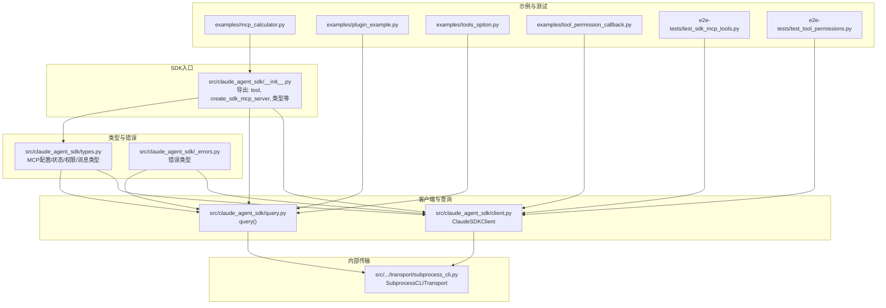
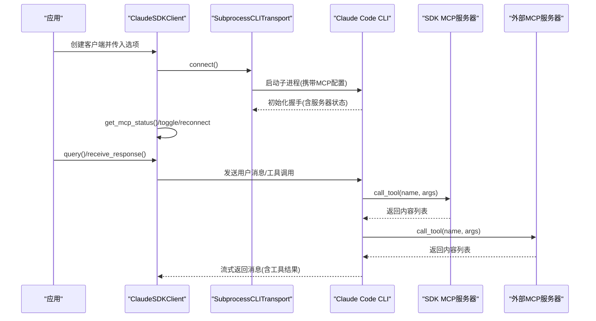
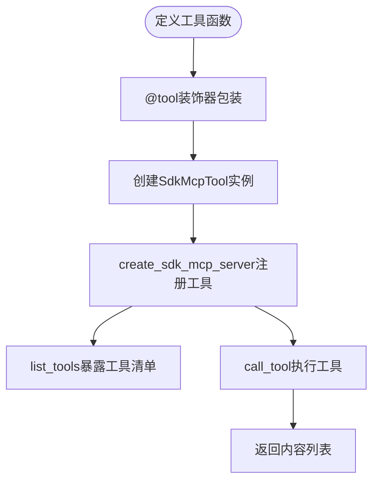
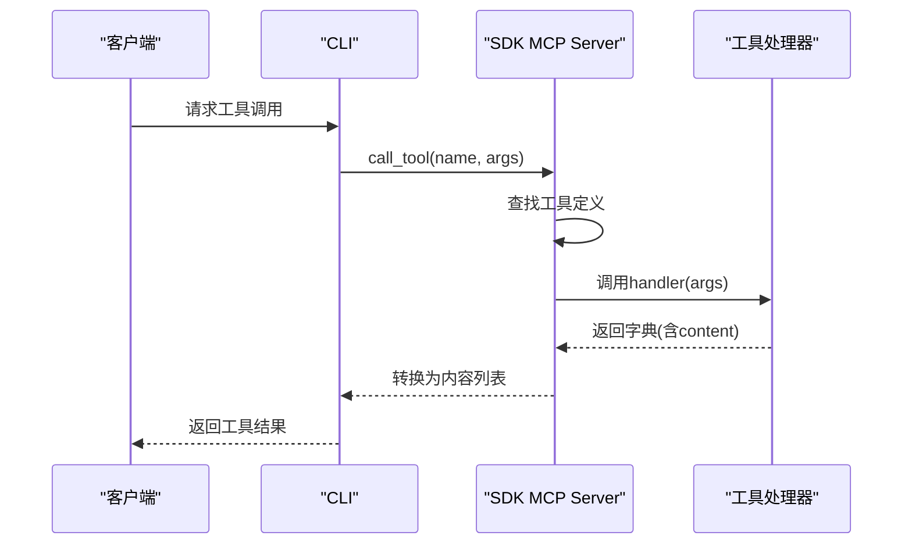
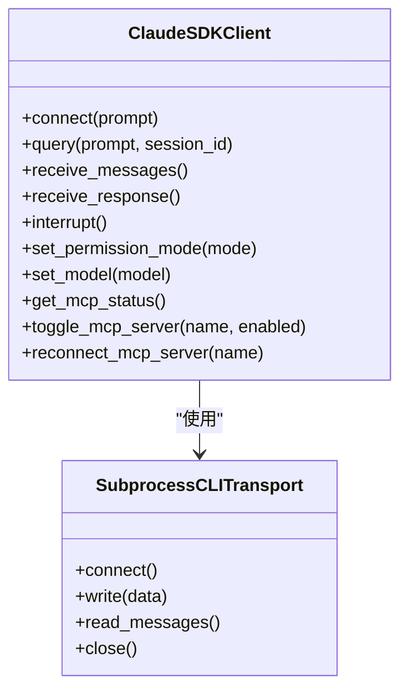
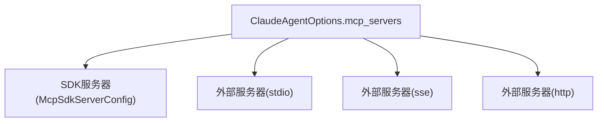
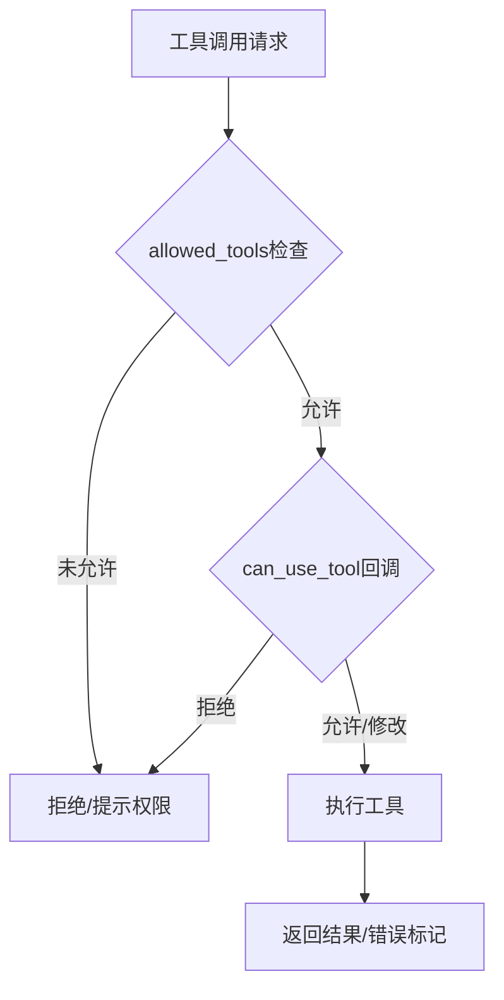
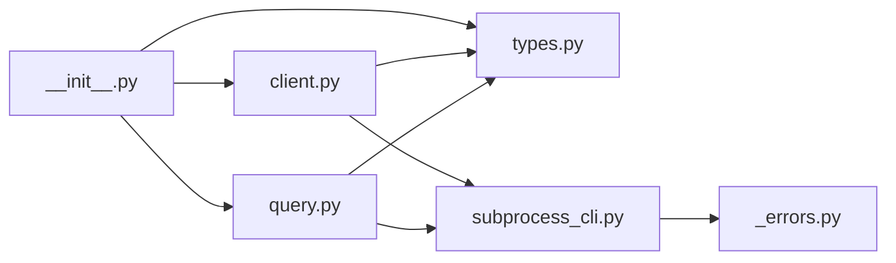

# MCP服务器支持

<cite>
**本文引用的文件**
- [README.md](file://README.md)
- [src/claude_agent_sdk/__init__.py](file://src/claude_agent_sdk/__init__.py)
- [src/claude_agent_sdk/client.py](file://src/claude_agent_sdk/client.py)
- [src/claude_agent_sdk/query.py](file://src/claude_agent_sdk/query.py)
- [src/claude_agent_sdk/types.py](file://src/claude_agent_sdk/types.py)
- [src/claude_agent_sdk/_errors.py](file://src/claude_agent_sdk/_errors.py)
- [src/claude_agent_sdk/_internal/transport/subprocess_cli.py](file://src/claude_agent_sdk/_internal/transport/subprocess_cli.py)
- [examples/mcp_calculator.py](file://examples/mcp_calculator.py)
- [examples/plugin_example.py](file://examples/plugin_example.py)
- [examples/tools_option.py](file://examples/tools_option.py)
- [examples/tool_permission_callback.py](file://examples/tool_permission_callback.py)
- [e2e-tests/test_sdk_mcp_tools.py](file://e2e-tests/test_sdk_mcp_tools.py)
- [e2e-tests/test_tool_permissions.py](file://e2e-tests/test_tool_permissions.py)
</cite>

## 目录
1. [简介](#简介)
2. [项目结构](#项目结构)
3. [核心组件](#核心组件)
4. [架构总览](#架构总览)
5. [详细组件分析](#详细组件分析)
6. [依赖分析](#依赖分析)
7. [性能考虑](#性能考虑)
8. [故障排查指南](#故障排查指南)
9. [结论](#结论)
10. [附录](#附录)

## 简介
本文件面向需要在Python应用中集成MCP（Model Context Protocol）工具系统的开发者，系统性阐述Claude Agent SDK中的MCP服务器支持能力，重点覆盖以下主题：
- 装饰器驱动的工具定义与类型安全
- SDK MCP服务器的注册机制与执行流程
- @tool装饰器的使用方法：工具名称、描述、参数定义与返回值格式
- 完整的MCP服务器创建示例：SDK MCP服务器与外部MCP服务器
- 混合服务器支持：在同一会话中同时使用SDK与外部MCP服务器
- 工具权限控制与运行时权限管理
- 插件开发指南：如何创建Claude插件
- 性能优化建议与调试技巧
- 迁移指南：从外部MCP服务器迁移到SDK MCP服务器

## 项目结构
该仓库围绕“查询接口 + 客户端 + 类型定义 + 内部传输层 + 示例与测试”组织，MCP服务器支持主要集中在SDK入口模块与类型定义中，并通过内部传输层与CLI进行交互。

图表来源
- [src/claude_agent_sdk/__init__.py:1-445](file://src/claude_agent_sdk/__init__.py#L1-L445)
- [src/claude_agent_sdk/client.py:1-500](file://src/claude_agent_sdk/client.py#L1-L500)
- [src/claude_agent_sdk/query.py:1-127](file://src/claude_agent_sdk/query.py#L1-L127)
- [src/claude_agent_sdk/types.py:1-800](file://src/claude_agent_sdk/types.py#L1-L800)
- [src/claude_agent_sdk/_errors.py:1-57](file://src/claude_agent_sdk/_errors.py#L1-L57)
- [src/claude_agent_sdk/_internal/transport/subprocess_cli.py:1-630](file://src/claude_agent_sdk/_internal/transport/subprocess_cli.py#L1-L630)
- [examples/mcp_calculator.py:1-194](file://examples/mcp_calculator.py#L1-L194)
- [examples/plugin_example.py:1-72](file://examples/plugin_example.py#L1-L72)
- [examples/tools_option.py:1-112](file://examples/tools_option.py#L1-L112)
- [examples/tool_permission_callback.py:1-159](file://examples/tool_permission_callback.py#L1-L159)
- [e2e-tests/test_sdk_mcp_tools.py:1-169](file://e2e-tests/test_sdk_mcp_tools.py#L1-L169)
- [e2e-tests/test_tool_permissions.py:1-66](file://e2e-tests/test_tool_permissions.py#L1-L66)

章节来源
- [README.md:1-360](file://README.md#L1-L360)
- [src/claude_agent_sdk/__init__.py:1-445](file://src/claude_agent_sdk/__init__.py#L1-L445)

## 核心组件
- 装饰器与工具定义
  - @tool装饰器：用于声明MCP工具，提供类型安全与元数据（名称、描述、输入模式、注解）
  - SdkMcpTool：封装工具定义，供SDK MCP服务器注册与调用
- SDK MCP服务器
  - create_sdk_mcp_server：创建内联MCP服务器，直接在进程中运行，避免IPC开销
  - 内置list_tools与call_tool处理器，负责工具清单暴露与执行
- 客户端与查询
  - ClaudeSDKClient：交互式双向对话，支持流式输入、中断、权限模式切换、MCP服务器启停与状态查询
  - query：一次性或单向流式查询，适合无状态任务
- 类型与权限
  - McpSdkServerConfig/McpServerConfig：MCP服务器配置类型
  - PermissionMode/PermissionResult：权限模式与结果类型
  - Hook体系：PreToolUse/PostToolUse等事件钩子，支持运行时拦截与决策
- 传输层
  - SubprocessCLITransport：通过CLI子进程与MCP服务器通信，支持SDK与外部服务器混合配置

章节来源
- [src/claude_agent_sdk/__init__.py:111-341](file://src/claude_agent_sdk/__init__.py#L111-L341)
- [src/claude_agent_sdk/client.py:21-500](file://src/claude_agent_sdk/client.py#L21-L500)
- [src/claude_agent_sdk/query.py:12-127](file://src/claude_agent_sdk/query.py#L12-L127)
- [src/claude_agent_sdk/types.py:493-641](file://src/claude_agent_sdk/types.py#L493-L641)
- [src/claude_agent_sdk/_internal/transport/subprocess_cli.py:33-630](file://src/claude_agent_sdk/_internal/transport/subprocess_cli.py#L33-L630)

## 架构总览
SDK MCP服务器与外部MCP服务器在运行时由CLI统一调度。SDK服务器以“内联”方式注入CLI，外部服务器通过stdio/sse/http等连接。客户端通过SubprocessCLITransport启动CLI并建立双向流，动态传递MCP配置与工具调用请求。

图表来源
- [src/claude_agent_sdk/client.py:94-180](file://src/claude_agent_sdk/client.py#L94-L180)
- [src/claude_agent_sdk/_internal/transport/subprocess_cli.py:335-411](file://src/claude_agent_sdk/_internal/transport/subprocess_cli.py#L335-L411)
- [src/claude_agent_sdk/types.py:519-641](file://src/claude_agent_sdk/types.py#L519-L641)

## 详细组件分析

### @tool装饰器与工具定义
- 功能要点
  - 声明式定义：为Python异步函数添加MCP工具元信息
  - 输入模式：支持简单字典映射、TypedDict、JSON Schema三种形式
  - 返回约定：返回包含“content”字段的字典；可选“is_error”标记错误
  - 注解支持：可附加ToolAnnotations（如只读、破坏性、开放世界）
- 典型用法
  - @tool("add", "加法运算", {"a": float, "b": float})
  - 在SDK MCP服务器中自动注册为Tool，参与list_tools与call_tool

图表来源
- [src/claude_agent_sdk/__init__.py:111-341](file://src/claude_agent_sdk/__init__.py#L111-L341)

章节来源
- [src/claude_agent_sdk/__init__.py:111-341](file://src/claude_agent_sdk/__init__.py#L111-L341)

### SDK MCP服务器注册与执行流程
- 注册机制
  - create_sdk_mcp_server创建Server实例并注册list_tools/call_tool处理器
  - 将工具定义映射到Server，生成Tool对象（含名称、描述、inputSchema、annotations）
- 执行流程
  - 客户端发起工具调用
  - CLI路由至SDK服务器的call_tool处理器
  - 处理器根据名称查找工具定义，调用对应handler，转换返回为MCP内容格式
- 优势
  - 无IPC开销、部署简单、调试友好、类型安全

图表来源
- [src/claude_agent_sdk/__init__.py:250-341](file://src/claude_agent_sdk/__init__.py#L250-L341)

章节来源
- [src/claude_agent_sdk/__init__.py:178-341](file://src/claude_agent_sdk/__init__.py#L178-L341)

### 客户端与查询：SDK MCP服务器集成
- ClaudeSDKClient
  - 支持流式输入、中断、权限模式切换、MCP服务器启停与状态查询
  - 自动提取mcp_servers中type为“sdk”的配置，注入到Query层
- query
  - 一次性或单向流式查询，适合无状态任务
  - 通过InternalClient与Transport协作完成

图表来源
- [src/claude_agent_sdk/client.py:21-500](file://src/claude_agent_sdk/client.py#L21-L500)
- [src/claude_agent_sdk/_internal/transport/subprocess_cli.py:33-630](file://src/claude_agent_sdk/_internal/transport/subprocess_cli.py#L33-L630)

章节来源
- [src/claude_agent_sdk/client.py:94-180](file://src/claude_agent_sdk/client.py#L94-L180)
- [src/claude_agent_sdk/query.py:12-127](file://src/claude_agent_sdk/query.py#L12-L127)

### 混合服务器支持：SDK与外部MCP服务器共存
- 配置方式
  - mcp_servers中同时包含“sdk”与外部服务器配置
  - SDK服务器通过McpSdkServerConfig传递，外部服务器通过McpStdioServerConfig/McpSSEServerConfig/McpHttpServerConfig
- 运行时行为
  - CLI统一调度，客户端可通过get_mcp_status查看各服务器状态
  - 可动态启用/禁用或重连失败的服务器

图表来源
- [src/claude_agent_sdk/types.py:493-529](file://src/claude_agent_sdk/types.py#L493-L529)
- [src/claude_agent_sdk/_internal/transport/subprocess_cli.py:240-266](file://src/claude_agent_sdk/_internal/transport/subprocess_cli.py#L240-L266)

章节来源
- [src/claude_agent_sdk/types.py:493-529](file://src/claude_agent_sdk/types.py#L493-L529)
- [src/claude_agent_sdk/_internal/transport/subprocess_cli.py:240-266](file://src/claude_agent_sdk/_internal/transport/subprocess_cli.py#L240-L266)

### 工具权限控制与运行时权限管理
- 权限模型
  - allowed_tools/disallowed_tools：白名单/黑名单控制工具可用性
  - permission_mode：默认/接受编辑/计划/绕过权限
  - can_use_tool回调：运行时对工具调用进行决策，可修改输入或拒绝
- 钩子体系
  - PreToolUse/PostToolUse/PostToolUseFailure等事件钩子，支持拦截与反馈
- 实践建议
  - 对写操作与危险命令使用严格限制
  - 使用回调记录与审计工具使用

图表来源
- [src/claude_agent_sdk/types.py:124-157](file://src/claude_agent_sdk/types.py#L124-L157)
- [examples/tool_permission_callback.py:26-94](file://examples/tool_permission_callback.py#L26-L94)

章节来源
- [src/claude_agent_sdk/types.py:124-157](file://src/claude_agent_sdk/types.py#L124-L157)
- [examples/tool_permission_callback.py:26-94](file://examples/tool_permission_callback.py#L26-L94)

### 插件开发指南：创建Claude插件
- 插件类型
  - 本地插件：通过SdkPluginConfig配置，type为“local”，指定路径
- 加载与验证
  - 通过options.plugins传入插件目录
  - 在初始化系统消息中可查看已加载插件信息
- 示例参考
  - examples/plugin_example.py演示了如何加载本地插件并验证

章节来源
- [src/claude_agent_sdk/types.py:642-651](file://src/claude_agent_sdk/types.py#L642-L651)
- [examples/plugin_example.py:23-62](file://examples/plugin_example.py#L23-L62)

### 完整MCP服务器创建示例
- SDK MCP服务器示例
  - examples/mcp_calculator.py展示了多工具计算器的完整用法：定义工具、创建服务器、配置allowed_tools、通过ClaudeSDKClient调用
- 外部MCP服务器示例
  - README.md提供了外部服务器配置示例（stdio），可与SDK服务器混合使用
- 混合服务器示例
  - README.md展示了同时包含“internal”（SDK）与“external”（stdio）服务器的配置

章节来源
- [examples/mcp_calculator.py:138-194](file://examples/mcp_calculator.py#L138-L194)
- [README.md:146-185](file://README.md#L146-L185)

### 迁移指南：从外部MCP服务器迁移到SDK MCP服务器
- 步骤概览
  - 将外部服务器的工具函数迁移到SDK中，使用@tool装饰器定义
  - 使用create_sdk_mcp_server创建内联服务器
  - 更新ClaudeAgentOptions.mcp_servers，替换为SDK服务器配置
  - 将工具名称前缀从“外部前缀”改为“mcp__<name>__”
- 注意事项
  - SDK服务器无需子进程管理，性能更优
  - 保持工具签名一致，确保返回格式符合MCP要求

章节来源
- [README.md:144-169](file://README.md#L144-L169)
- [src/claude_agent_sdk/__init__.py:178-250](file://src/claude_agent_sdk/__init__.py#L178-L250)

## 依赖分析
- 组件耦合
  - SDK入口模块集中导出工具与服务器创建函数，被客户端与示例广泛依赖
  - 客户端与查询模块依赖类型定义与传输层
  - 传输层依赖CLI可执行文件与操作系统子进程
- 外部依赖
  - mcp.server/mcp.types：SDK MCP服务器的核心协议与类型
  - anyio：异步I/O与子进程管理
- 潜在循环依赖
  - 当前结构清晰，未发现循环导入

图表来源
- [src/claude_agent_sdk/__init__.py:1-445](file://src/claude_agent_sdk/__init__.py#L1-L445)
- [src/claude_agent_sdk/types.py:1-800](file://src/claude_agent_sdk/types.py#L1-L800)
- [src/claude_agent_sdk/client.py:1-500](file://src/claude_agent_sdk/client.py#L1-L500)
- [src/claude_agent_sdk/query.py:1-127](file://src/claude_agent_sdk/query.py#L1-L127)
- [src/claude_agent_sdk/_internal/transport/subprocess_cli.py:1-630](file://src/claude_agent_sdk/_internal/transport/subprocess_cli.py#L1-L630)
- [src/claude_agent_sdk/_errors.py:1-57](file://src/claude_agent_sdk/_errors.py#L1-L57)

章节来源
- [src/claude_agent_sdk/__init__.py:1-445](file://src/claude_agent_sdk/__init__.py#L1-L445)

## 性能考虑
- SDK MCP服务器优势
  - 无IPC开销，直接在进程内执行工具，延迟更低
  - 部署简单，减少进程间通信复杂度
- 传输层优化
  - SubprocessCLITransport内置缓冲区大小限制，避免内存膨胀
  - 流式读取与解析，降低阻塞风险
- 建议
  - 大量工具场景下优先选择SDK服务器
  - 控制工具返回内容大小，避免超大payload
  - 合理设置max_turns与max_budget_usd，控制成本

[本节为通用指导，不直接分析具体文件]

## 故障排查指南
- 常见错误类型
  - CLIConnectionError/CLINotFoundError：CLI未找到或无法连接
  - ProcessError：CLI进程异常退出
  - CLIJSONDecodeError：CLI输出JSON解析失败
- 定位方法
  - 检查CLI版本与最小版本要求
  - 开启stderr回调或调试模式，捕获CLI输出
  - 使用get_mcp_status查看服务器连接状态与错误信息
- 单元与端到端测试
  - e2e-tests/test_sdk_mcp_tools.py验证SDK工具执行与权限控制
  - e2e-tests/test_tool_permissions.py验证can_use_tool回调触发

章节来源
- [src/claude_agent_sdk/_errors.py:6-57](file://src/claude_agent_sdk/_errors.py#L6-L57)
- [src/claude_agent_sdk/_internal/transport/subprocess_cli.py:587-626](file://src/claude_agent_sdk/_internal/transport/subprocess_cli.py#L587-L626)
- [e2e-tests/test_sdk_mcp_tools.py:19-169](file://e2e-tests/test_sdk_mcp_tools.py#L19-L169)
- [e2e-tests/test_tool_permissions.py:17-66](file://e2e-tests/test_tool_permissions.py#L17-L66)

## 结论
通过装饰器驱动的工具定义、内联SDK MCP服务器与完善的权限/钩子体系，Claude Agent SDK为Python应用提供了高性能、易部署、强可控的MCP工具集成方案。结合混合服务器支持与插件生态，开发者可以灵活扩展Claude的能力边界，并在安全性与易用性之间取得平衡。

[本节为总结性内容，不直接分析具体文件]

## 附录
- 快速开始与示例
  - README.md提供了安装、基础使用与MCP工具示例
  - examples/mcp_calculator.py展示了SDK MCP服务器的完整用法
  - examples/tools_option.py展示了工具集配置
  - examples/tool_permission_callback.py展示了权限回调
- 参考路径
  - [README.md:20-185](file://README.md#L20-L185)
  - [examples/mcp_calculator.py:138-194](file://examples/mcp_calculator.py#L138-L194)
  - [examples/tools_option.py:16-101](file://examples/tools_option.py#L16-L101)
  - [examples/tool_permission_callback.py:96-159](file://examples/tool_permission_callback.py#L96-L159)