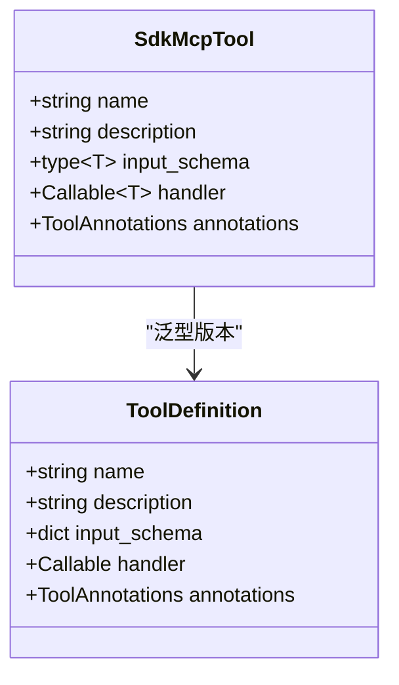
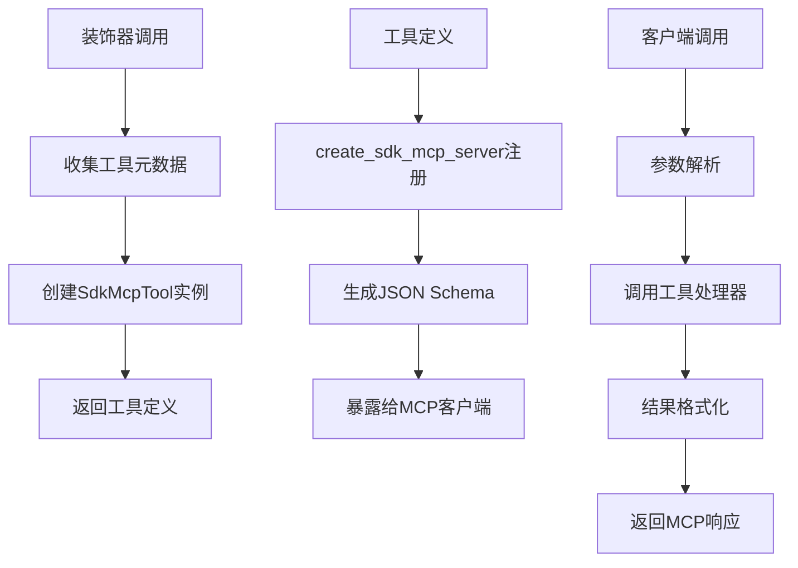
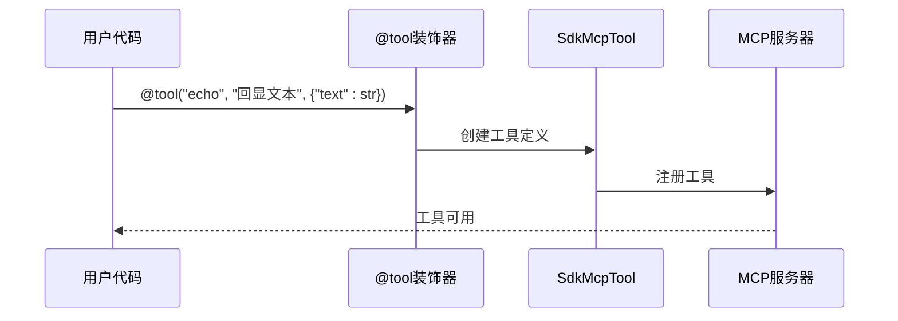
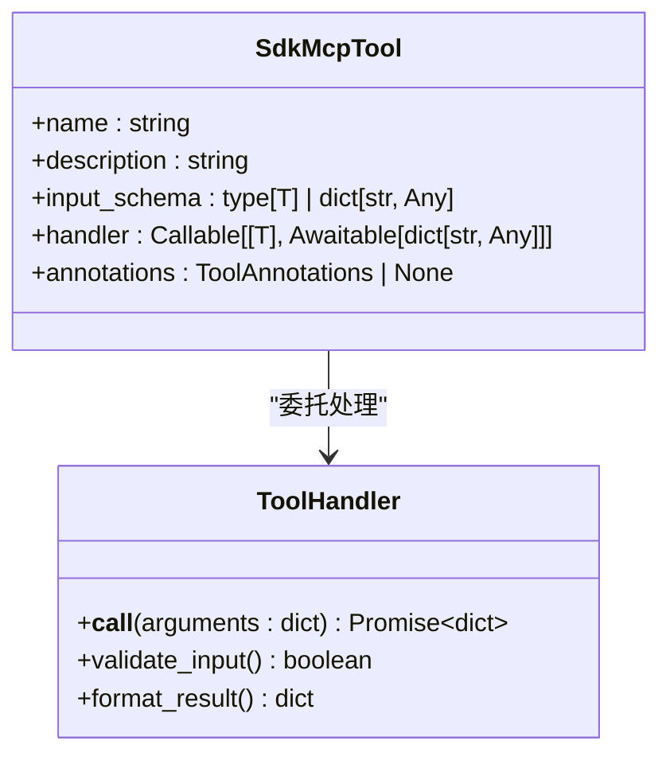
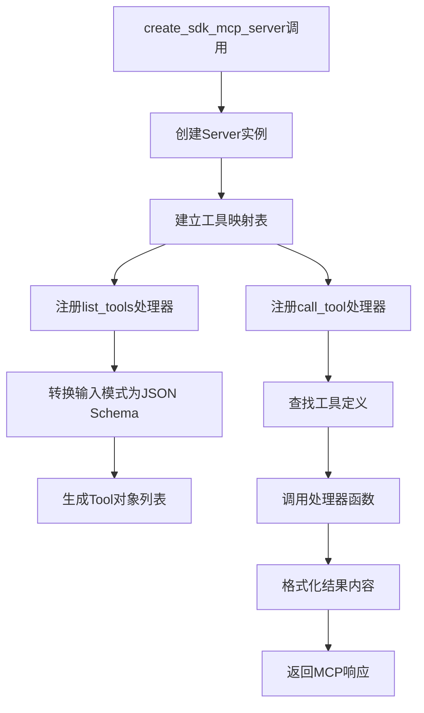
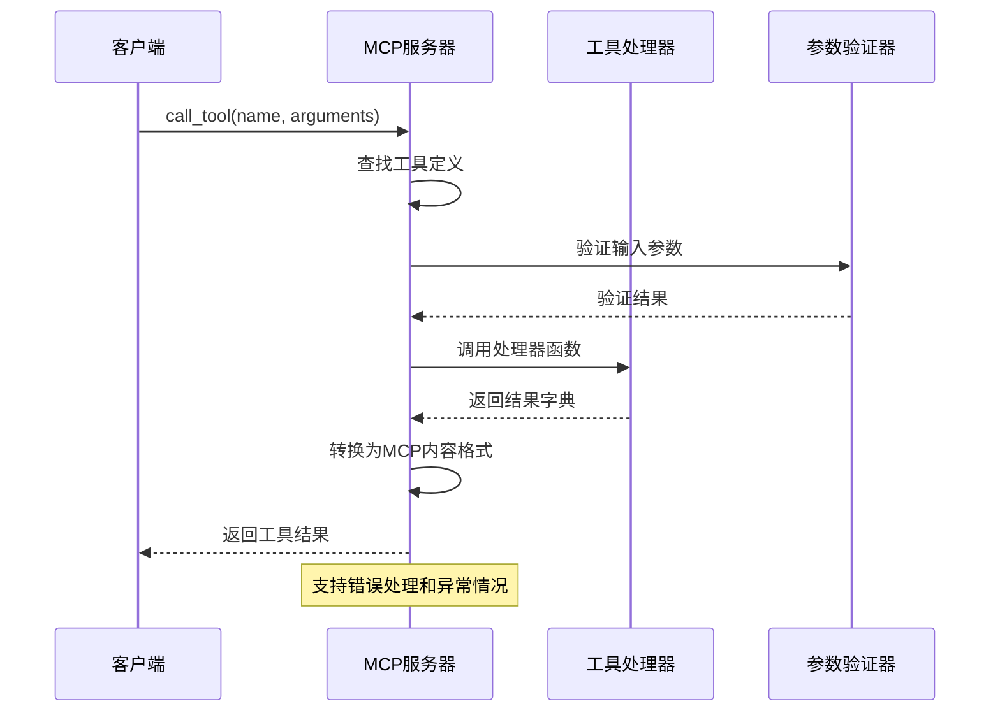
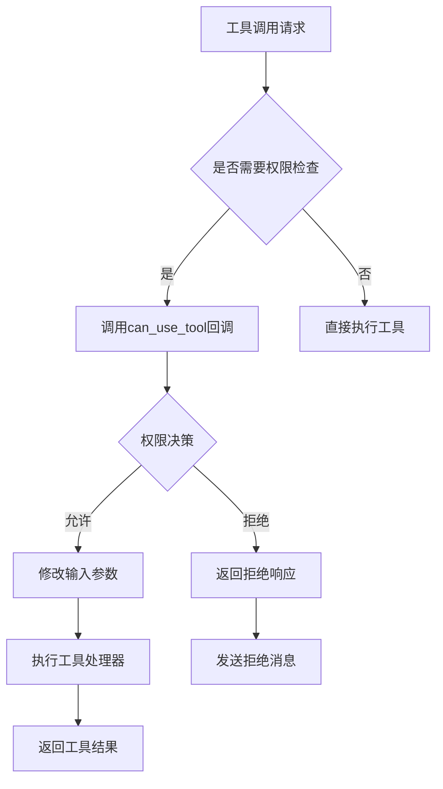
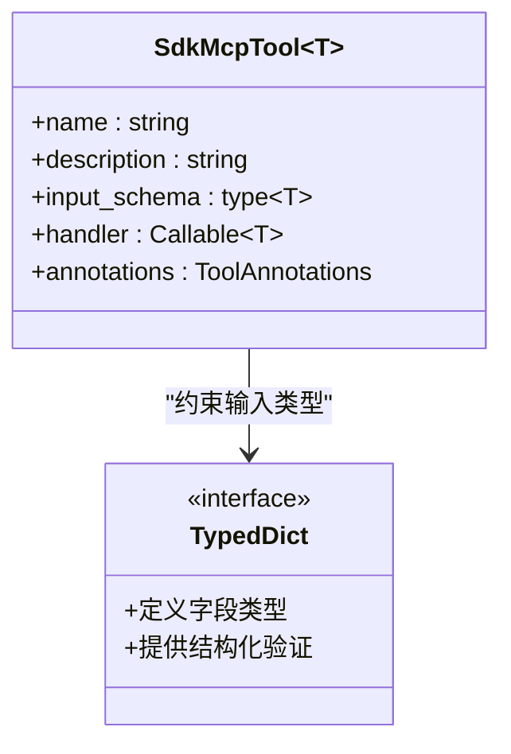
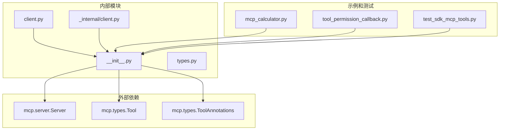

# SDK MCP工具系统

<cite>
**本文档引用的文件**
- [src/claude_agent_sdk/__init__.py](file://src/claude_agent_sdk/__init__.py)
- [src/claude_agent_sdk/types.py](file://src/claude_agent_sdk/types.py)
- [src/claude_agent_sdk/client.py](file://src/claude_agent_sdk/client.py)
- [src/claude_agent_sdk/_internal/client.py](file://src/claude_agent_sdk/_internal/client.py)
- [examples/mcp_calculator.py](file://examples/mcp_calculator.py)
- [examples/tool_permission_callback.py](file://examples/tool_permission_callback.py)
- [examples/tools_option.py](file://examples/tools_option.py)
- [e2e-tests/test_sdk_mcp_tools.py](file://e2e-tests/test_sdk_mcp_mcp_tools.py)
- [e2e-tests/test_tool_permissions.py](file://e2e-tests/test_tool_permissions.py)
- [tests/test_tool_callbacks.py](file://tests/test_tool_callbacks.py)
</cite>

## 目录
1. [简介](#简介)
2. [项目结构](#项目结构)
3. [核心组件](#核心组件)
4. [架构概览](#架构概览)
5. [详细组件分析](#详细组件分析)
6. [依赖关系分析](#依赖关系分析)
7. [性能考虑](#性能考虑)
8. [故障排除指南](#故障排除指南)
9. [结论](#结论)
10. [附录](#附录)

## 简介

SDK MCP工具系统是Claude Code Python SDK中用于创建和管理MCP（Model Context Protocol）工具的核心模块。该系统允许开发者在Python应用内部直接创建工具，无需外部进程通信开销，提供了更好的性能、更简单的部署和更便捷的调试能力。

系统主要包含以下核心功能：
- **@tool装饰器**：用于定义MCP工具，支持类型安全和参数验证
- **SdkMcpTool类**：工具定义的数据结构，包含名称、描述、输入模式和处理器
- **create_sdk_mcp_server函数**：创建内联MCP服务器，支持工具注册和执行
- **权限控制系统**：支持工具权限回调和运行时权限管理
- **类型安全机制**：通过泛型和类型注解确保工具调用的安全性

## 项目结构

SDK MCP工具系统位于`src/claude_agent_sdk/`目录下，主要文件组织如下：

```mermaid
graph TB
subgraph "核心模块"
A[__init__.py] --> B[SdkMcpTool类]
A --> C[@tool装饰器]
A --> D[create_sdk_mcp_server函数]
end
subgraph "类型定义"
E[types.py] --> F[权限类型]
E --> G[MCP服务器配置]
E --> H[工具回调类型]
end
subgraph "客户端集成"
I[client.py] --> J[ClaudeSDKClient]
K[_internal/client.py] --> L[内部查询处理]
end
subgraph "示例和测试"
M[mcp_calculator.py] --> N[计算器示例]
O[tool_permission_callback.py] --> P[权限回调示例]
Q[tools_option.py] --> R[工具选项示例]
S[test_sdk_mcp_tools.py] --> T[端到端测试]
U[test_tool_permissions.py] --> V[权限测试]
end
A --> E
I --> A
K --> A
M --> A
O --> A
Q --> A
```

**图表来源**
- [src/claude_agent_sdk/__init__.py:1-445](file://src/claude_agent_sdk/__init__.py#L1-L445)
- [src/claude_agent_sdk/types.py:1-200](file://src/claude_agent_sdk/types.py#L1-L200)

**章节来源**
- [src/claude_agent_sdk/__init__.py:1-445](file://src/claude_agent_sdk/__init__.py#L1-L445)
- [src/claude_agent_sdk/types.py:1-200](file://src/claude_agent_sdk/types.py#L1-L200)

## 核心组件

### SdkMcpTool类结构

SdkMcpTool是MCP工具的核心数据结构，定义了工具的基本属性和行为：



**图表来源**
- [src/claude_agent_sdk/__init__.py:100-109](file://src/claude_agent_sdk/__init__.py#L100-L109)

### @tool装饰器工作原理

@tool装饰器提供了类型安全的工具定义机制：



**图表来源**
- [src/claude_agent_sdk/__init__.py:111-176](file://src/claude_agent_sdk/__init__.py#L111-L176)

**章节来源**
- [src/claude_agent_sdk/__init__.py:100-176](file://src/claude_agent_sdk/__init__.py#L100-L176)

## 架构概览

SDK MCP工具系统采用分层架构设计，实现了工具定义、注册、执行和权限控制的完整流程：

```mermaid
graph TB
subgraph "应用层"
A[用户工具定义]
B[工具处理器]
end
subgraph "SDK层"
C[create_sdk_mcp_server]
D[@tool装饰器]
E[SdkMcpTool]
end
subgraph "MCP协议层"
F[Server实例]
G[list_tools处理器]
H[call_tool处理器]
I[JSON Schema转换]
end
subgraph "客户端集成"
J[ClaudeSDKClient]
K[权限回调]
L[Hook系统]
end
A --> D
D --> E
E --> C
C --> F
F --> G
F --> H
G --> I
H --> B
J --> C
K --> J
L --> J
```

**图表来源**
- [src/claude_agent_sdk/__init__.py:178-341](file://src/claude_agent_sdk/__init__.py#L178-L341)
- [src/claude_agent_sdk/client.py:21-500](file://src/claude_agent_sdk/client.py#L21-L500)

## 详细组件分析

### 工具定义语法

@tool装饰器支持多种输入模式定义：

#### 简单参数工具


**图表来源**
- [src/claude_agent_sdk/__init__.py:111-176](file://src/claude_agent_sdk/__init__.py#L111-L176)

#### 复杂参数工具
支持TypedDict和JSON Schema定义：
- 字典映射：`{"name": str, "age": int}`
- TypedDict类：用于复杂嵌套结构
- JSON Schema：完整的验证规则

#### 带错误处理的工具
工具处理器可以返回标准格式或错误状态：
- 成功：`{"content": [...]}`  
- 错误：`{"content": [...], "is_error": True}`

**章节来源**
- [src/claude_agent_sdk/__init__.py:111-176](file://src/claude_agent_sdk/__init__.py#L111-L176)
- [examples/mcp_calculator.py:24-97](file://examples/mcp_calculator.py#L24-L97)

### SdkMcpTool类详解

SdkMcpTool类包含以下关键字段：

| 字段名 | 类型 | 描述 | 必需 |
|--------|------|------|------|
| name | str | 工具唯一标识符 | 是 |
| description | str | 工具功能描述 | 是 |
| input_schema | type[T] | 输入参数模式 | 是 |
| handler | Callable | 异步处理器函数 | 是 |
| annotations | ToolAnnotations | 工具注解信息 | 否 |



**图表来源**
- [src/claude_agent_sdk/__init__.py:100-109](file://src/claude_agent_sdk/__init__.py#L100-L109)

**章节来源**
- [src/claude_agent_sdk/__init__.py:100-109](file://src/claude_agent_sdk/__init__.py#L100-L109)

### 工具注册机制

create_sdk_mcp_server函数负责工具的注册和服务器配置：



**图表来源**
- [src/claude_agent_sdk/__init__.py:178-341](file://src/claude_agent_sdk/__init__.py#L178-L341)

工具映射机制确保了高效的工具查找和执行：
- 使用字典存储工具定义，O(1)查找时间
- 支持工具名称到处理器的直接映射
- 自动处理工具不存在的情况

**章节来源**
- [src/claude_agent_sdk/__init__.py:178-341](file://src/claude_agent_sdk/__init__.py#L178-L341)

### 工具执行流程

完整的工具执行流程包括参数解析、验证和结果格式化：



**图表来源**
- [src/claude_agent_sdk/__init__.py:308-338](file://src/claude_agent_sdk/__init__.py#L308-L338)

执行流程的关键步骤：
1. **参数解析**：从JSON RPC请求中提取工具名称和参数
2. **工具查找**：通过工具映射表定位对应的处理器
3. **参数验证**：根据输入模式验证参数的有效性
4. **处理器调用**：异步执行工具逻辑
5. **结果格式化**：转换为MCP标准响应格式

**章节来源**
- [src/claude_agent_sdk/__init__.py:308-338](file://src/claude_agent_sdk/__init__.py#L308-L338)

### 权限控制和运行时管理

SDK MCP工具系统提供了多层次的权限控制机制：

#### 工具权限回调


**图表来源**
- [examples/tool_permission_callback.py:26-94](file://examples/tool_permission_callback.py#L26-L94)

#### 运行时权限管理
- **自动允许**：某些只读操作自动允许执行
- **手动审批**：危险操作需要用户明确授权
- **输入修改**：权限回调可以修改工具输入参数
- **策略更新**：动态调整权限策略和规则

**章节来源**
- [examples/tool_permission_callback.py:26-94](file://examples/tool_permission_callback.py#L26-L94)
- [e2e-tests/test_tool_permissions.py:32-61](file://e2e-tests/test_tool_permissions.py#L32-L61)

### 类型安全机制

SDK MCP工具系统通过多种机制确保类型安全：

#### 泛型支持


**图表来源**
- [src/claude_agent_sdk/__init__.py:97-109](file://src/claude_agent_sdk/__init__.py#L97-L109)

#### 参数验证
- **静态类型检查**：编译时验证工具定义
- **运行时验证**：执行时验证参数有效性
- **JSON Schema转换**：自动转换输入模式为标准格式

**章节来源**
- [src/claude_agent_sdk/__init__.py:97-176](file://src/claude_agent_sdk/__init__.py#L97-L176)

## 依赖关系分析

SDK MCP工具系统的依赖关系相对简洁，主要依赖于mcp库和Python标准库：



**图表来源**
- [src/claude_agent_sdk/__init__.py:1-250](file://src/claude_agent_sdk/__init__.py#L1-L250)

主要依赖特点：
- **最小化依赖**：仅依赖mcp核心库
- **类型安全**：充分利用Python类型系统
- **向后兼容**：保持与mcp协议的兼容性

**章节来源**
- [src/claude_agent_sdk/__init__.py:1-250](file://src/claude_agent_sdk/__init__.py#L1-L250)

## 性能考虑

SDK MCP工具系统在设计时充分考虑了性能优化：

### 内存优化
- **零拷贝设计**：工具处理器直接接收字典参数
- **流式处理**：支持异步流式响应
- **缓存机制**：工具映射表使用字典实现O(1)查找

### 执行效率
- **内联执行**：工具在主进程中直接执行，避免IPC开销
- **异步处理**：所有工具调用都是异步的
- **批量注册**：支持一次性注册多个工具

### 资源管理
- **自动清理**：服务器生命周期由SDK自动管理
- **连接池**：复用MCP连接资源
- **超时控制**：支持工具执行超时设置

## 故障排除指南

### 常见问题和解决方案

#### 工具未找到错误
**症状**：调用工具时抛出"Tool not found"异常
**原因**：
- 工具名称不匹配
- 工具未正确注册
- 服务器配置错误

**解决方法**：
1. 检查工具名称是否与注册时一致
2. 确认工具已添加到工具列表
3. 验证服务器配置中的工具映射

#### 参数验证失败
**症状**：工具调用返回参数验证错误
**原因**：
- 参数类型不匹配
- 缺少必需参数
- 参数值超出范围

**解决方法**：
1. 检查输入模式定义
2. 验证参数类型和值
3. 参考工具描述了解参数要求

#### 权限拒绝
**症状**：工具调用被权限系统拒绝
**原因**：
- 权限回调返回拒绝
- 用户未授权
- 安全策略阻止

**解决方法**：
1. 检查can_use_tool回调逻辑
2. 验证权限配置
3. 查看权限建议和日志

**章节来源**
- [e2e-tests/test_sdk_mcp_tools.py:54-95](file://e2e-tests/test_sdk_mcp_tools.py#L54-L95)
- [tests/test_tool_callbacks.py:100-135](file://tests/test_tool_callbacks.py#L100-L135)

### 调试技巧

#### 开发时调试
1. **启用详细日志**：查看工具调用和响应
2. **使用简单工具**：先测试基本功能
3. **逐步增加复杂度**：从简单参数开始

#### 生产环境监控
1. **性能指标**：监控工具执行时间和成功率
2. **错误统计**：跟踪常见错误类型
3. **权限审计**：记录权限决策历史

## 结论

SDK MCP工具系统为Python开发者提供了一个强大而灵活的工具创建框架。通过@tool装饰器和SdkMcpTool类，开发者可以轻松定义类型安全的MCP工具，享受内联执行带来的性能优势和便捷的调试体验。

系统的主要优势包括：
- **类型安全**：完整的泛型支持和运行时验证
- **高性能**：内联执行避免IPC开销
- **易用性**：简洁的API设计和丰富的示例
- **安全性**：多层次的权限控制和运行时管理
- **可扩展性**：灵活的架构支持各种工具类型

随着Claude Code生态系统的不断发展，SDK MCP工具系统将继续演进，为开发者提供更好的工具开发体验。

## 附录

### 完整工具创建示例

#### 简单工具示例
```python
@tool("echo", "回显输入文本", {"text": str})
async def echo_tool(args: dict[str, Any]) -> dict[str, Any]:
    return {"content": [{"type": "text", "text": f"Echo: {args['text']}"}]}
```

#### 复杂参数工具示例
```python
@tool("calculate", "计算数学表达式", {"expression": str, "precision": int})
async def calculate_tool(args: dict[str, Any]) -> dict[str, Any]:
    # 复杂计算逻辑
    return {
        "content": [
            {"type": "text", "text": f"Result: {result}"},
            {"type": "text", "text": f"Precision: {args['precision']} decimal places"}
        ]
    }
```

#### 带错误处理工具示例
```python
@tool("safe_divide", "安全除法运算", {"dividend": float, "divisor": float})
async def safe_divide(args: dict[str, Any]) -> dict[str, Any]:
    if args["divisor"] == 0:
        return {
            "content": [
                {"type": "text", "text": "Error: Division by zero is not allowed"}
            ],
            "is_error": True
        }
    return {
        "content": [
            {"type": "text", "text": f"Result: {args['dividend'] / args['divisor']}"}
        ]
    }
```

### 工具注册和使用

#### 创建MCP服务器
```python
server = create_sdk_mcp_server(
    name="calculator",
    version="1.0.0",
    tools=[add_tool, subtract_tool, multiply_tool, divide_tool]
)
```

#### 配置工具访问权限
```python
options = ClaudeAgentOptions(
    mcp_servers={"calc": server},
    allowed_tools=["mcp__calc__add", "mcp__calc__subtract"]
)
```

**章节来源**
- [examples/mcp_calculator.py:24-97](file://examples/mcp_calculator.py#L24-L97)
- [examples/mcp_calculator.py:142-154](file://examples/mcp_calculator.py#L142-L154)