# 外部MCP服务器

<cite>
**本文档引用的文件**
- [src/claude_agent_sdk/__init__.py](file://src/claude_agent_sdk/__init__.py)
- [src/claude_agent_sdk/types.py](file://src/claude_agent_sdk/types.py)
- [src/claude_agent_sdk/client.py](file://src/claude_agent_sdk/client.py)
- [src/claude_agent_sdk/_internal/client.py](file://src/claude_agent_sdk/_internal/client.py)
- [src/claude_agent_sdk/_internal/query.py](file://src/claude_agent_sdk/_internal/query.py)
- [src/claude_agent_sdk/_internal/transport/subprocess_cli.py](file://src/claude_agent_sdk/_internal/transport/subprocess_cli.py)
- [examples/mcp_calculator.py](file://examples/mcp_calculator.py)
- [examples/plugin_example.py](file://examples/plugin_example.py)
- [tests/test_sdk_mcp_integration.py](file://tests/test_sdk_mcp_integration.py)
- [README.md](file://README.md)
</cite>

## 目录
1. [简介](#简介)
2. [项目结构](#项目结构)
3. [核心组件](#核心组件)
4. [架构概览](#架构概览)
5. [详细组件分析](#详细组件分析)
6. [依赖关系分析](#依赖关系分析)
7. [性能考虑](#性能考虑)
8. [故障排除指南](#故障排除指南)
9. [结论](#结论)
10. [附录](#附录)

## 简介

本文件为Claude Agent SDK中外部MCP（Model Context Protocol）服务器的综合文档。MCP是Anthropic开发的协议，用于在Claude Code环境中提供工具和服务。本文档详细解释了MCP服务器配置和连接管理，包括McpServerConfig和McpSdkServerConfig的区别，外部MCP服务器的启动、停止和生命周期管理，连接示例，混合服务器支持，状态监控和故障排除方法，以及插件开发指南。

## 项目结构

该项目采用模块化设计，主要组件分布在以下目录结构中：

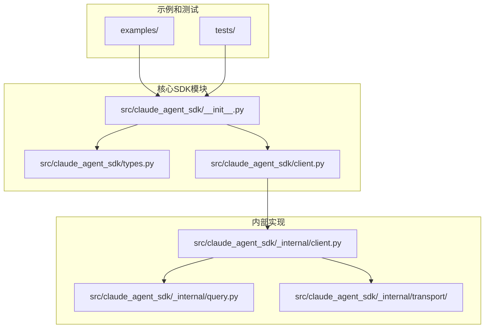

**图表来源**
- [src/claude_agent_sdk/__init__.py:1-445](file://src/claude_agent_sdk/__init__.py#L1-L445)
- [src/claude_agent_sdk/types.py:1-800](file://src/claude_agent_sdk/types.py#L1-L800)

**章节来源**
- [src/claude_agent_sdk/__init__.py:1-445](file://src/claude_agent_sdk/__init__.py#L1-L445)
- [README.md:1-360](file://README.md#L1-L360)

## 核心组件

### MCP服务器类型定义

项目提供了三种主要的MCP服务器配置类型：

1. **McpStdioServerConfig** - 通过标准输入输出通信的外部服务器
2. **McpSSEServerConfig** - 通过Server-Sent Events通信的服务器
3. **McpHttpServerConfig** - 通过HTTP API通信的服务器
4. **McpSdkServerConfig** - 内置的SDK MCP服务器配置

### 服务器配置差异

McpServerConfig和McpSdkServerConfig的主要区别：

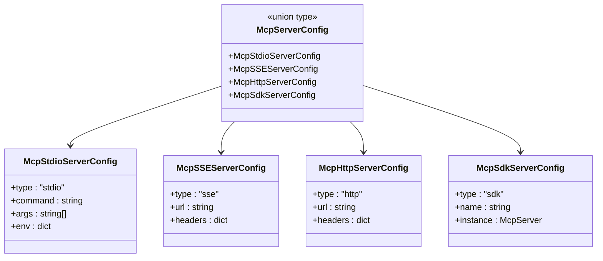

**图表来源**
- [src/claude_agent_sdk/types.py:494-529](file://src/claude_agent_sdk/types.py#L494-L529)

**章节来源**
- [src/claude_agent_sdk/types.py:494-529](file://src/claude_agent_sdk/types.py#L494-L529)

## 架构概览

MCP服务器架构采用分层设计，支持多种通信协议：

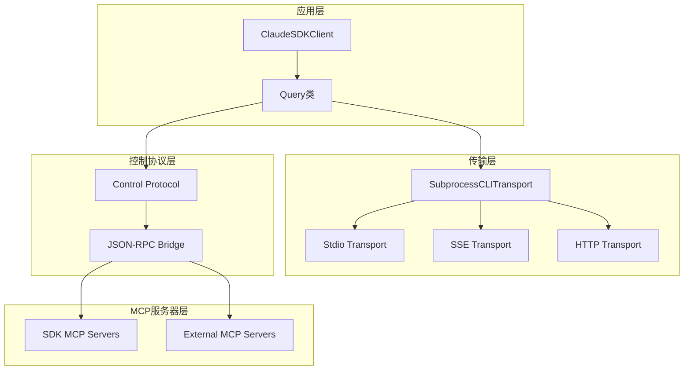

**图表来源**
- [src/claude_agent_sdk/client.py:21-500](file://src/claude_agent_sdk/client.py#L21-L500)
- [src/claude_agent_sdk/_internal/query.py:53-679](file://src/claude_agent_sdk/_internal/query.py#L53-L679)
- [src/claude_agent_sdk/_internal/transport/subprocess_cli.py:33-630](file://src/claude_agent_sdk/_internal/transport/subprocess_cli.py#L33-L630)

## 详细组件分析

### 外部MCP服务器配置

外部MCP服务器通过不同的配置类型支持多种部署方式：

#### STDIO服务器配置
STDIO服务器是最常见的外部MCP服务器类型，适用于本地可执行文件或脚本：

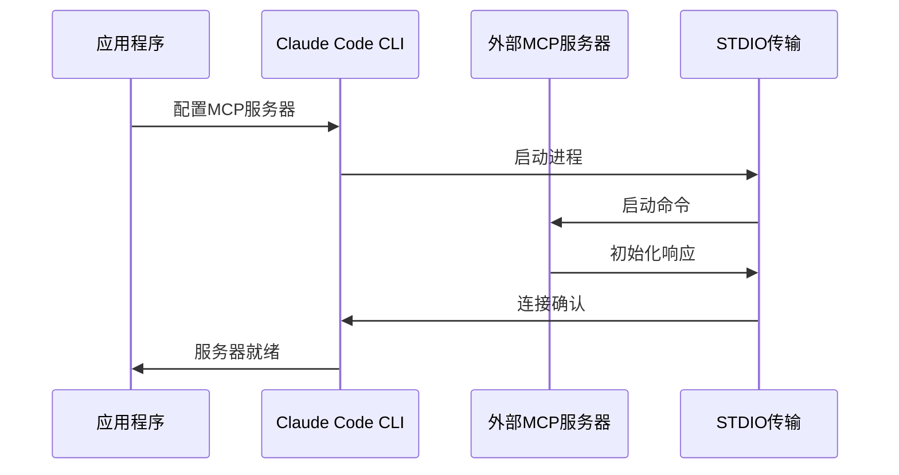

**图表来源**
- [src/claude_agent_sdk/_internal/transport/subprocess_cli.py:166-333](file://src/claude_agent_sdk/_internal/transport/subprocess_cli.py#L166-L333)

#### SSE服务器配置
SSE服务器通过Server-Sent Events协议与客户端通信：

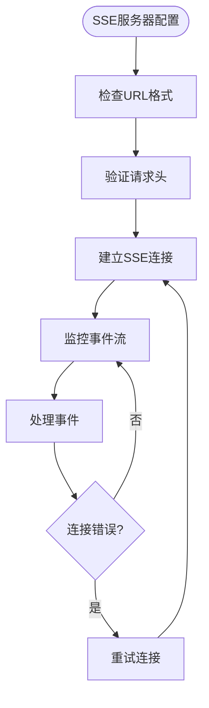

**图表来源**
- [src/claude_agent_sdk/types.py:503-509](file://src/claude_agent_sdk/types.py#L503-L509)

#### HTTP服务器配置
HTTP服务器通过RESTful API与客户端交互：

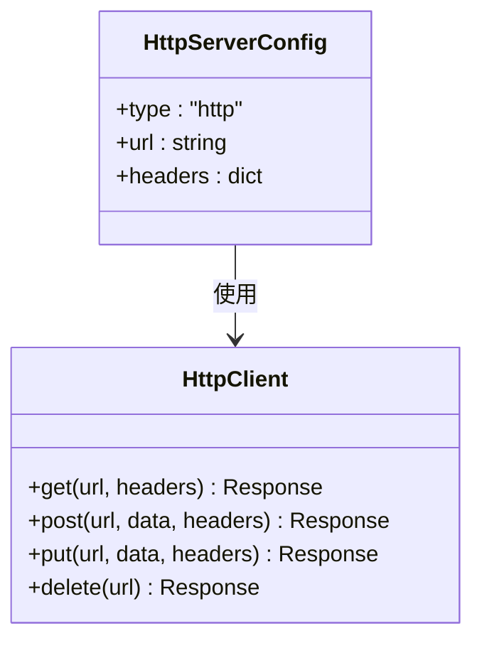

**图表来源**
- [src/claude_agent_sdk/types.py:511-517](file://src/claude_agent_sdk/types.py#L511-L517)

**章节来源**
- [src/claude_agent_sdk/types.py:494-529](file://src/claude_agent_sdk/types.py#L494-L529)

### SDK MCP服务器实现

SDK MCP服务器提供内联运行的优势，避免了进程间通信开销：

#### 工具装饰器系统
工具装饰器提供了类型安全的工具定义机制：

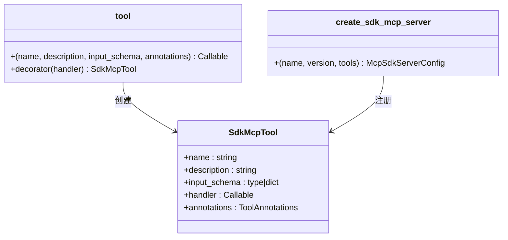

**图表来源**
- [src/claude_agent_sdk/__init__.py:100-340](file://src/claude_agent_sdk/__init__.py#L100-L340)

#### 内部查询处理
Query类负责处理MCP服务器的控制协议：

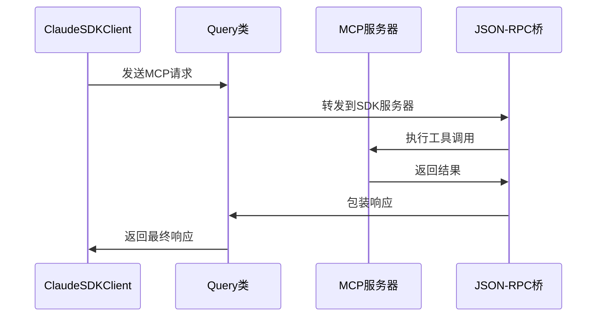

**图表来源**
- [src/claude_agent_sdk/_internal/query.py:394-531](file://src/claude_agent_sdk/_internal/query.py#L394-L531)

**章节来源**
- [src/claude_agent_sdk/__init__.py:100-340](file://src/claude_agent_sdk/__init__.py#L100-L340)
- [src/claude_agent_sdk/_internal/query.py:394-531](file://src/claude_agent_sdk/_internal/query.py#L394-L531)

### 混合服务器支持

项目支持同时使用SDK和外部MCP服务器：

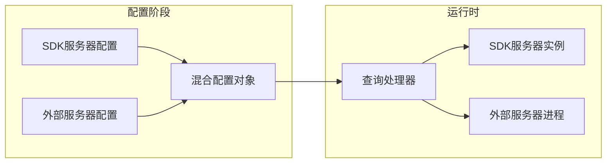

**图表来源**
- [src/claude_agent_sdk/_internal/client.py:84-92](file://src/claude_agent_sdk/_internal/client.py#L84-L92)
- [src/claude_agent_sdk/_internal/transport/subprocess_cli.py:240-262](file://src/claude_agent_sdk/_internal/transport/subprocess_cli.py#L240-L262)

**章节来源**
- [src/claude_agent_sdk/_internal/client.py:84-92](file://src/claude_agent_sdk/_internal/client.py#L84-L92)
- [src/claude_agent_sdk/_internal/transport/subprocess_cli.py:240-262](file://src/claude_agent_sdk/_internal/transport/subprocess_cli.py#L240-L262)

## 依赖关系分析

### 组件耦合度

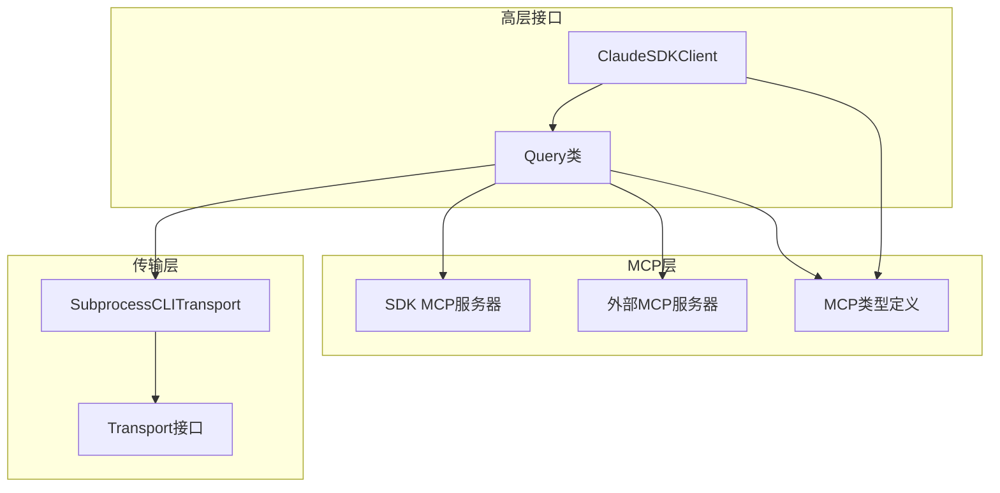

**图表来源**
- [src/claude_agent_sdk/client.py:21-500](file://src/claude_agent_sdk/client.py#L21-L500)
- [src/claude_agent_sdk/_internal/query.py:53-679](file://src/claude_agent_sdk/_internal/query.py#L53-L679)

### 外部依赖

项目依赖的关键外部组件：
- **mcp.server.Server**: MCP服务器框架
- **mcp.types**: MCP协议类型定义
- **anyio**: 异步I/O操作
- **json**: JSON序列化和反序列化

**章节来源**
- [src/claude_agent_sdk/__init__.py:7-18](file://src/claude_agent_sdk/__init__.py#L7-L18)

## 性能考虑

### 内存管理

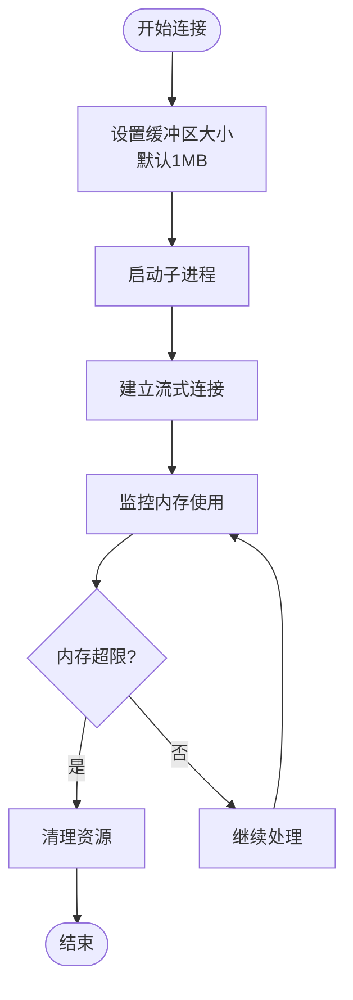

**图表来源**
- [src/claude_agent_sdk/_internal/transport/subprocess_cli.py:29-30](file://src/claude_agent_sdk/_internal/transport/subprocess_cli.py#L29-L30)

### 连接池管理

SDK MCP服务器相比外部服务器具有显著的性能优势：

| 特性 | SDK MCP服务器 | 外部MCP服务器 |
|------|---------------|---------------|
| 进程开销 | 无进程切换 | 子进程启动和通信 |
| IPC延迟 | 直接函数调用 | JSON-RPC消息传递 |
| 内存访问 | 直接共享 | 序列化/反序列化 |
| 部署复杂度 | 单进程 | 多进程管理 |
| 调试便利性 | 同一进程 | 分离调试 |

**章节来源**
- [src/claude_agent_sdk/__init__.py:138-162](file://src/claude_agent_sdk/__init__.py#L138-L162)

## 故障排除指南

### 常见连接问题

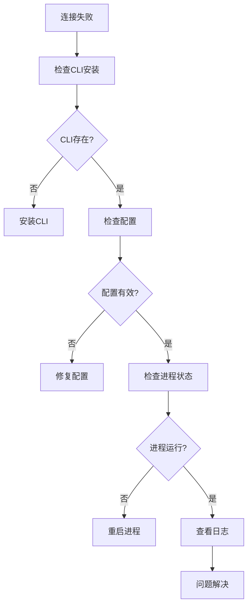

### 错误处理机制

项目提供了完善的错误处理机制：

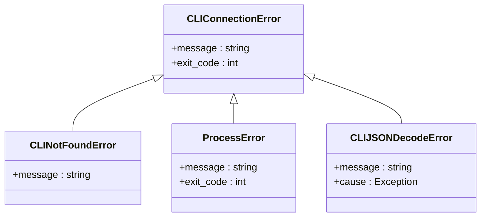

**图表来源**
- [src/claude_agent_sdk/_internal/transport/subprocess_cli.py:481-505](file://src/claude_agent_sdk/_internal/transport/subprocess_cli.py#L481-L505)

**章节来源**
- [src/claude_agent_sdk/_internal/transport/subprocess_cli.py:481-505](file://src/claude_agent_sdk/_internal/transport/subprocess_cli.py#L481-L505)

### 服务器状态监控

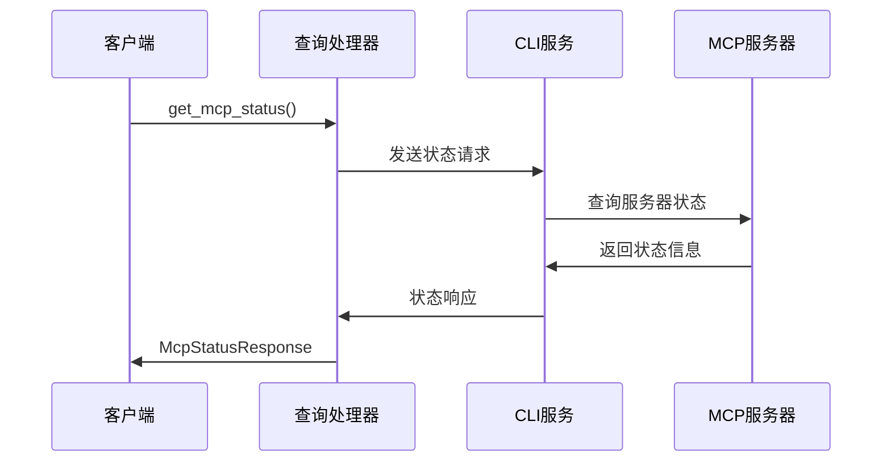

**图表来源**
- [src/claude_agent_sdk/client.py:385-416](file://src/claude_agent_sdk/client.py#L385-L416)
- [src/claude_agent_sdk/_internal/query.py:532-534](file://src/claude_agent_sdk/_internal/query.py#L532-L534)

**章节来源**
- [src/claude_agent_sdk/client.py:385-416](file://src/claude_agent_sdk/client.py#L385-L416)

## 结论

Claude Agent SDK为MCP服务器提供了全面的支持，包括外部服务器和SDK内联服务器两种模式。外部MCP服务器提供了灵活的部署选项，而SDK MCP服务器则提供了更好的性能和简化了部署流程。项目的设计充分考虑了可扩展性和易用性，支持混合服务器配置，为不同场景提供了最佳解决方案。

## 附录

### 插件开发指南

虽然插件系统与MCP服务器不同，但它们都扩展了Claude Code的功能：

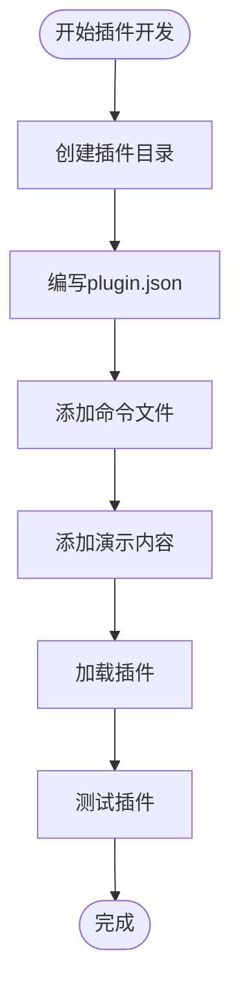

**图表来源**
- [examples/plugin_example.py:23-62](file://examples/plugin_example.py#L23-L62)

### 迁移指南

从外部MCP服务器迁移到SDK MCP服务器的步骤：

1. **提取工具逻辑**：将外部服务器的工具函数提取到Python模块
2. **创建工具装饰器**：使用`@tool`装饰器包装工具函数
3. **创建SDK服务器**：使用`create_sdk_mcp_server`创建内联服务器
4. **更新配置**：替换外部服务器配置为SDK服务器配置
5. **测试迁移**：验证功能完整性和性能提升

**章节来源**
- [examples/plugin_example.py:23-62](file://examples/plugin_example.py#L23-L62)
- [examples/mcp_calculator.py:138-194](file://examples/mcp_calculator.py#L138-L194)