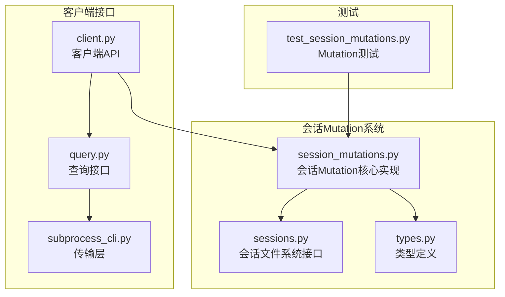
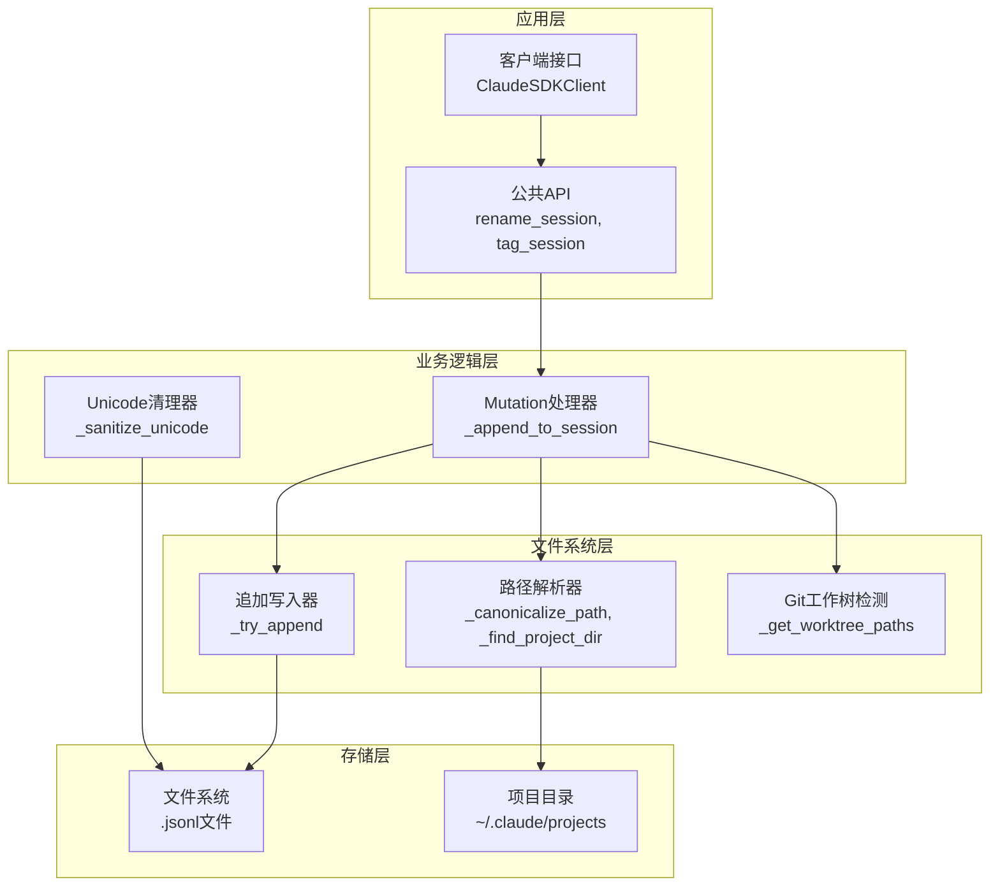
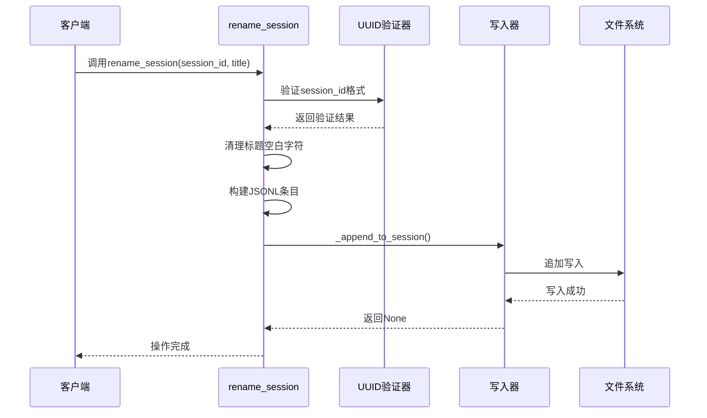
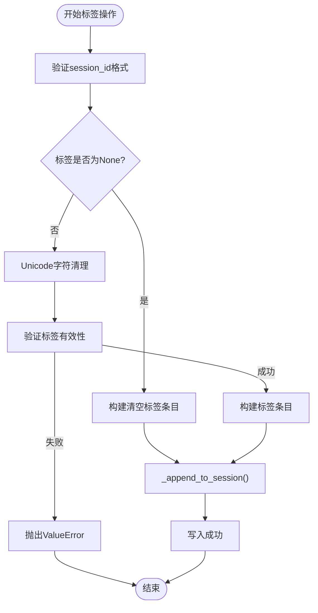
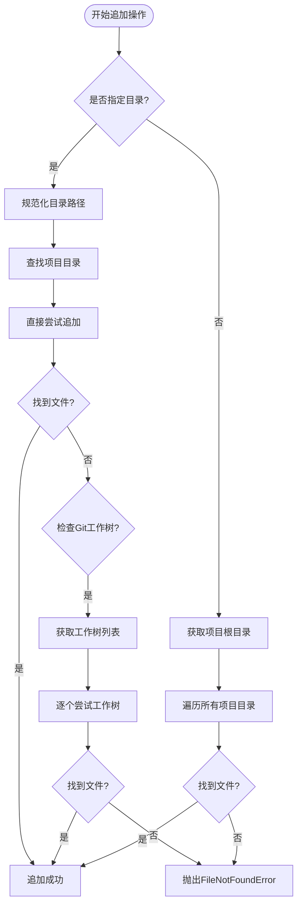
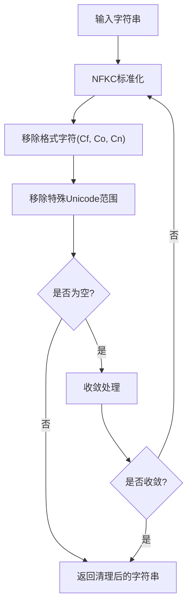
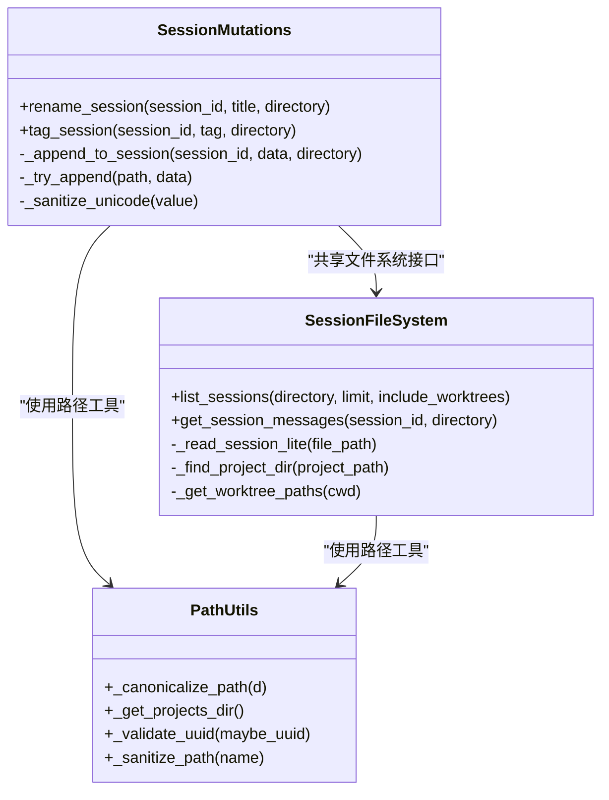
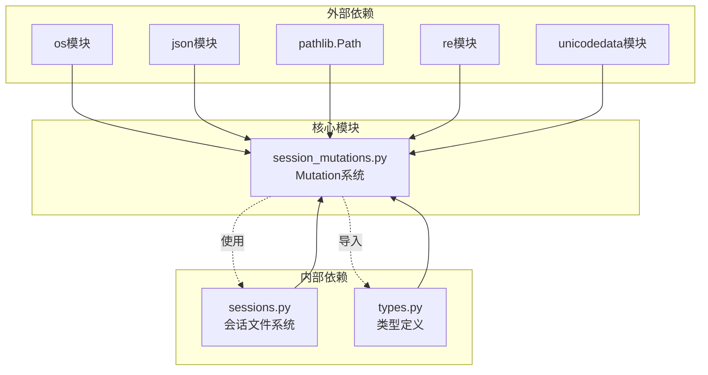

# 会话Mutation系统

<cite>
**本文档引用的文件**
- [session_mutations.py](file://src/claude_agent_sdk/_internal/session_mutations.py)
- [sessions.py](file://src/claude_agent_sdk/_internal/sessions.py)
- [types.py](file://src/claude_agent_sdk/types.py)
- [test_session_mutations.py](file://tests/test_session_mutations.py)
- [client.py](file://src/claude_agent_sdk/client.py)
- [query.py](file://src/claude_agent_sdk/_internal/query.py)
- [subprocess_cli.py](file://src/claude_agent_sdk/_internal/transport/subprocess_cli.py)
</cite>

## 目录
1. [简介](#简介)
2. [项目结构](#项目结构)
3. [核心组件](#核心组件)
4. [架构概览](#架构概览)
5. [详细组件分析](#详细组件分析)
6. [依赖关系分析](#依赖关系分析)
7. [性能考量](#性能考量)
8. [故障排除指南](#故障排除指南)
9. [结论](#结论)
10. [附录](#附录)

## 简介

会话Mutation系统是Claude Agent SDK中用于管理会话状态变更的核心组件。该系统提供了对会话元数据进行安全、原子性更新的能力，包括会话重命名、标签管理和文件变更跟踪等功能。系统采用JSONL格式存储会话数据，通过追加写入的方式实现非阻塞的状态变更，并支持并发写入场景下的数据一致性保证。

该系统的主要特点包括：
- 基于JSONL的轻量级文件存储
- 原子性追加写入机制
- 并发写入的安全保证
- Unicode字符安全处理
- Git工作树支持
- 文件变更检查点功能

## 项目结构

会话Mutation系统主要分布在以下文件中：



**图表来源**
- [session_mutations.py:1-302](file://src/claude_agent_sdk/_internal/session_mutations.py#L1-L302)
- [sessions.py:1-927](file://src/claude_agent_sdk/_internal/sessions.py#L1-L927)

**章节来源**
- [session_mutations.py:1-302](file://src/claude_agent_sdk/_internal/session_mutations.py#L1-L302)
- [sessions.py:1-927](file://src/claude_agent_sdk/_internal/sessions.py#L1-L927)

## 核心组件

会话Mutation系统由以下几个核心组件构成：

### 1. Mutation操作API
- `rename_session()`: 重命名会话标题
- `tag_session()`: 为会话添加标签
- `_append_to_session()`: 底层追加写入函数

### 2. 文件系统接口
- `_try_append()`: 安全的文件追加写入
- 路径解析和验证
- Git工作树检测

### 3. 数据处理工具
- `_sanitize_unicode()`: Unicode字符清理
- JSONL解析和序列化
- 会话元数据提取

**章节来源**
- [session_mutations.py:42-161](file://src/claude_agent_sdk/_internal/session_mutations.py#L42-L161)
- [session_mutations.py:168-302](file://src/claude_agent_sdk/_internal/session_mutations.py#L168-L302)

## 架构概览

会话Mutation系统采用分层架构设计，确保了模块间的清晰分离和高内聚低耦合：



**图表来源**
- [session_mutations.py:42-302](file://src/claude_agent_sdk/_internal/session_mutations.py#L42-L302)
- [sessions.py:114-167](file://src/claude_agent_sdk/_internal/sessions.py#L114-L167)

## 详细组件分析

### 会话Mutation API

#### rename_session() 函数
重命名会话标题是系统中最常用的Mutation操作之一。该函数实现了以下功能：



**图表来源**
- [session_mutations.py:42-95](file://src/claude_agent_sdk/_internal/session_mutations.py#L42-L95)

#### tag_session() 函数
标签功能允许用户为会话添加分类标记，支持清除标签的操作：



**图表来源**
- [session_mutations.py:97-161](file://src/claude_agent_sdk/_internal/session_mutations.py#L97-L161)

**章节来源**
- [session_mutations.py:42-161](file://src/claude_agent_sdk/_internal/session_mutations.py#L42-L161)

### 文件系统接口

#### _append_to_session() 函数
这是Mutation系统的核心文件操作函数，负责在正确的项目目录中找到会话文件并进行追加写入：



**图表来源**
- [session_mutations.py:168-220](file://src/claude_agent_sdk/_internal/session_mutations.py#L168-L220)

#### _try_append() 函数
底层文件追加写入函数，实现了原子性写入和错误处理：

**章节来源**
- [session_mutations.py:168-256](file://src/claude_agent_sdk/_internal/session_mutations.py#L168-L256)

### Unicode字符处理

系统实现了全面的Unicode字符安全处理机制，确保标签和标题的字符安全性：



**图表来源**
- [session_mutations.py:281-302](file://src/claude_agent_sdk/_internal/session_mutations.py#L281-L302)

**章节来源**
- [session_mutations.py:258-302](file://src/claude_agent_sdk/_internal/session_mutations.py#L258-L302)

### 会话文件系统集成

会话Mutation系统与会话文件系统紧密集成，共享相同的文件组织结构和访问模式：



**图表来源**
- [session_mutations.py:29-35](file://src/claude_agent_sdk/_internal/session_mutations.py#L29-L35)
- [sessions.py:114-167](file://src/claude_agent_sdk/_internal/sessions.py#L114-L167)

**章节来源**
- [sessions.py:1-927](file://src/claude_agent_sdk/_internal/sessions.py#L1-L927)

## 依赖关系分析

会话Mutation系统与其他组件的依赖关系如下：



**图表来源**
- [session_mutations.py:20-35](file://src/claude_agent_sdk/_internal/session_mutations.py#L20-L35)

**章节来源**
- [session_mutations.py:20-35](file://src/claude_agent_sdk/_internal/session_mutations.py#L20-L35)

## 性能考量

会话Mutation系统在设计时充分考虑了性能优化：

### 1. 原子性写入优化
- 使用O_APPEND标志确保原子性追加
- 避免TOCTOU竞争条件
- 减少文件系统调用次数

### 2. 文件系统访问优化
- 轻量级head/tail读取
- 缓存项目目录映射
- Git工作树智能检测

### 3. 内存使用优化
- 流式JSONL处理
- 限制缓冲区大小
- 及时释放资源

### 4. 并发处理优化
- 无锁追加写入
- 错误快速传播
- 资源及时清理

**章节来源**
- [session_mutations.py:222-256](file://src/claude_agent_sdk/_internal/session_mutations.py#L222-L256)
- [sessions.py:25-31](file://src/claude_agent_sdk/_internal/sessions.py#L25-L31)

## 故障排除指南

### 常见问题及解决方案

#### 1. 会话未找到错误
**症状**: `FileNotFoundError: Session {session_id} not found`
**原因**: 会话文件不存在或路径不正确
**解决方案**: 
- 验证会话ID格式
- 检查项目目录权限
- 确认Git工作树配置

#### 2. UUID验证失败
**症状**: `ValueError: Invalid session_id`
**原因**: 会话ID不符合UUID格式
**解决方案**:
- 使用标准UUID格式
- 避免包含额外字符

#### 3. Unicode字符问题
**症状**: 标签或标题显示异常
**原因**: 包含不可见Unicode字符
**解决方案**:
- 使用系统提供的清理功能
- 避免复制粘贴特殊字符

#### 4. 并发写入冲突
**症状**: 数据不一致或写入失败
**原因**: 多进程同时写入同一文件
**解决方案**:
- 使用系统提供的并发保护
- 避免手动修改会话文件

**章节来源**
- [test_session_mutations.py:116-157](file://tests/test_session_mutations.py#L116-L157)
- [test_session_mutations.py:269-300](file://tests/test_session_mutations.py#L269-L300)

## 结论

会话Mutation系统通过精心设计的架构和实现，为Claude Agent SDK提供了强大而可靠的会话状态管理能力。系统的核心优势包括：

1. **原子性保证**: 所有Mutation操作都是原子性的，确保数据一致性
2. **并发安全**: 通过文件系统级别的原子性写入避免竞态条件
3. **性能优化**: 采用轻量级的JSONL格式和流式处理减少内存占用
4. **易用性**: 提供简洁的API接口，支持常见的会话管理需求
5. **可靠性**: 全面的错误处理和边界情况处理

该系统为上层应用提供了稳定的基础，支持会话的动态管理和状态维护，是Claude Agent SDK生态系统中的重要组成部分。

## 附录

### 使用示例

#### 基本会话重命名
```python
# 重命名会话
rename_session(
    "550e8400-e29b-41d4-a716-446655440000",
    "重构会话",
    directory="/path/to/project"
)
```

#### 会话标签管理
```python
# 添加标签
tag_session(
    "550e8400-e29b-41d4-a716-446655440000",
    "experiment",
    directory="/path/to/project"
)

# 清除标签
tag_session(
    "550e8400-e29b-41d4-a716-446655440000",
    None
)
```

### 最佳实践

1. **错误处理**: 始终捕获并处理可能的异常
2. **路径验证**: 在调用前验证项目目录存在性
3. **字符清理**: 使用系统提供的Unicode清理功能
4. **并发考虑**: 避免手动修改会话文件
5. **性能优化**: 合理使用缓存和批量操作

### 配置选项

系统支持以下配置选项：
- `CLAUDE_CONFIG_DIR`: 自定义配置目录
- `enable_file_checkpointing`: 启用文件检查点功能
- `extra_args`: 额外的CLI参数