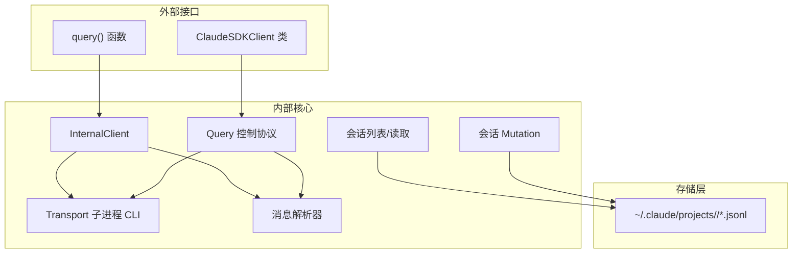
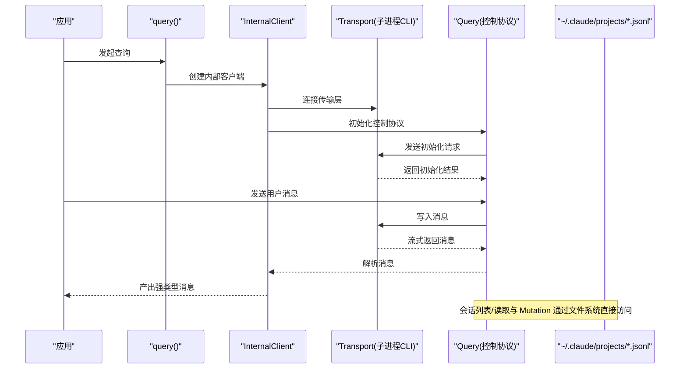
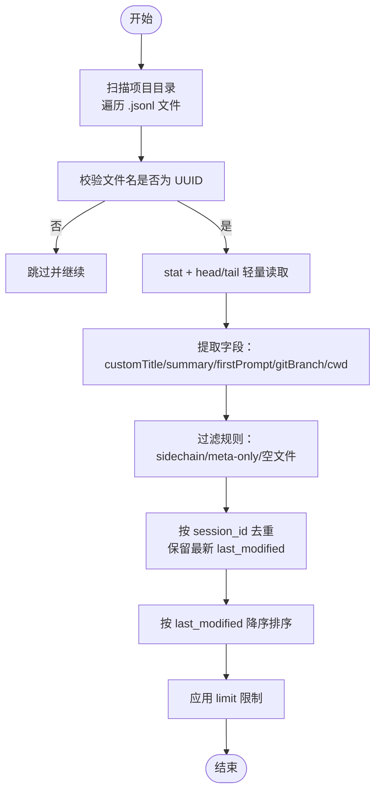
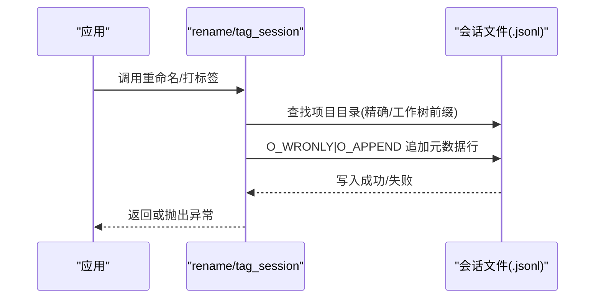
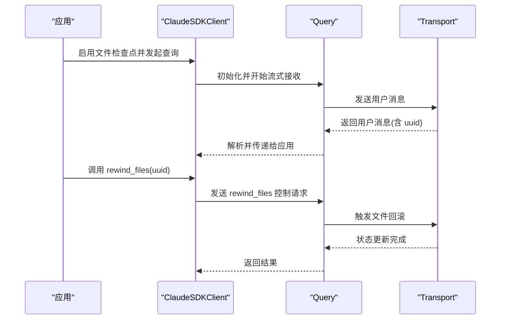
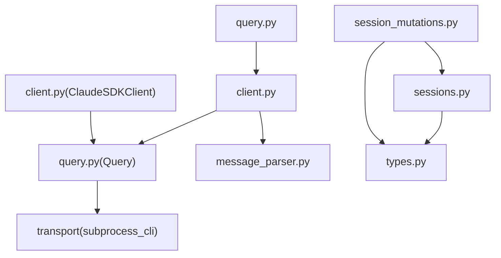

# 会话和文件管理

<cite>
**本文档引用的文件**
- [sessions.py](file://src/claude_agent_sdk/_internal/sessions.py)
- [session_mutations.py](file://src/claude_agent_sdk/_internal/session_mutations.py)
- [client.py](file://src/claude_agent_sdk/client.py)
- [query.py](file://src/claude_agent_sdk/query.py)
- [types.py](file://src/claude_agent_sdk/types.py)
- [message_parser.py](file://src/claude_agent_sdk/_internal/message_parser.py)
- [test_sessions.py](file://tests/test_sessions.py)
- [test_session_mutations.py](file://tests/test_session_mutations.py)
- [quick_start.py](file://examples/quick_start.py)
- [filesystem_agents.py](file://examples/filesystem_agents.py)
</cite>

## 目录
1. [简介](#简介)
2. [项目结构](#项目结构)
3. [核心组件](#核心组件)
4. [架构总览](#架构总览)
5. [详细组件分析](#详细组件分析)
6. [依赖关系分析](#依赖关系分析)
7. [性能考量](#性能考量)
8. [故障排除指南](#故障排除指南)
9. [结论](#结论)
10. [附录](#附录)

## 简介
本文件面向需要在 Python 中进行会话管理和文件操作的开发者，系统性地梳理了 Claude Agent SDK 的会话与文件管理能力。内容涵盖：
- 会话列表与元数据提取：基于文件系统扫描与轻量解析，快速获取会话摘要、标题、分支信息等。
- 会话 Mutation 系统：通过向会话 JSONL 文件追加元数据条目实现重命名、打标签等非破坏性操作。
- 文件检查点与回溯：通过控制协议支持文件状态回溯，结合用户消息 UUID 实现精确的时间点恢复。
- 并发与一致性：基于 O_APPEND 原子写入与轻量读取策略，确保多进程/多实例安全。
- 配置与使用：如何启用文件检查点、如何使用客户端 API 进行交互式会话管理。
- 最佳实践与性能优化：路径规范化、工作树感知、批量处理与缓存策略。
- 监控与调试：消息解析、错误类型、日志与流关闭策略。

## 项目结构
该 SDK 将会话与文件管理相关逻辑集中在内部模块中，对外提供简洁的高层 API（如 query、ClaudeSDKClient），同时保留细粒度的内部实现以满足高级用例。

图表来源
- [query.py:12-127](file://src/claude_agent_sdk/query.py#L12-L127)
- [client.py:21-500](file://src/claude_agent_sdk/client.py#L21-L500)
- [sessions.py:593-635](file://src/claude_agent_sdk/_internal/sessions.py#L593-L635)
- [session_mutations.py:42-95](file://src/claude_agent_sdk/_internal/session_mutations.py#L42-L95)

章节来源
- [query.py:12-127](file://src/claude_agent_sdk/query.py#L12-L127)
- [client.py:21-500](file://src/claude_agent_sdk/client.py#L21-L500)

## 核心组件
- 会话列表与元数据提取：通过扫描项目目录下的 .jsonl 文件，仅进行 stat/head/tail 轻量读取，避免全量 JSON 解析，从而高效列出会话并提取摘要、自定义标题、首次用户提示、Git 分支、工作目录等信息。
- 会话 Mutation：通过向会话文件追加 JSONL 元数据条目（如 custom-title、tag）实现非破坏性更新；支持 Unicode 清洗与紧凑 JSON 格式，保证与 CLI 行为一致。
- 文件检查点与回溯：通过控制协议发送 rewind_files 请求，将受跟踪的文件回滚到指定用户消息时刻的状态；需在查询选项中启用文件检查点并接收用户消息对象以获取 UUID。
- 客户端与消息流：ClaudeSDKClient 提供双向流式交互，支持中断、模型切换、MCP 服务器连接状态查询与重连、任务停止等控制命令；query() 提供一次性、无状态的查询接口。
- 消息解析：将 CLI 输出的 JSON 数据转换为强类型的 SDK 消息对象，便于上层应用消费。

章节来源
- [sessions.py:593-635](file://src/claude_agent_sdk/_internal/sessions.py#L593-L635)
- [session_mutations.py:42-161](file://src/claude_agent_sdk/_internal/session_mutations.py#L42-L161)
- [client.py:282-313](file://src/claude_agent_sdk/client.py#L282-L313)
- [query.py:558-571](file://src/claude_agent_sdk/query.py#L558-L571)
- [message_parser.py:29-251](file://src/claude_agent_sdk/_internal/message_parser.py#L29-L251)

## 架构总览
下图展示了从高层 API 到内部实现再到文件系统的整体调用链路与职责划分。

图表来源
- [query.py:119-163](file://src/claude_agent_sdk/query.py#L119-L163)
- [client.py:94-180](file://src/claude_agent_sdk/client.py#L94-L180)
- [sessions.py:593-635](file://src/claude_agent_sdk/_internal/sessions.py#L593-L635)
- [session_mutations.py:168-220](file://src/claude_agent_sdk/_internal/session_mutations.py#L168-L220)

## 详细组件分析

### 会话列表与元数据提取
- 轻量读取策略：仅读取文件头尾固定大小缓冲区，结合正则与字符串解析提取所需字段，避免全量 JSON 解析带来的开销。
- 路径与工作树：支持根据当前工作目录推断项目目录，必要时通过 git worktree 列表匹配多个工作树根路径，提升跨工作树场景的兼容性。
- 去重与排序：按会话 ID 去重并按最后修改时间降序排列，支持限制返回数量。
- 过滤规则：过滤 sidechain 会话、仅含元数据的会话、非 UUID 文件名、非 .jsonl 文件等。

图表来源
- [sessions.py:403-591](file://src/claude_agent_sdk/_internal/sessions.py#L403-L591)

章节来源
- [sessions.py:593-635](file://src/claude_agent_sdk/_internal/sessions.py#L593-L635)
- [test_sessions.py:242-554](file://tests/test_sessions.py#L242-L554)

### 会话 Mutation 系统（重命名/打标签）
- 追加写入：通过 O_WRONLY | O_APPEND 打开文件，避免存在性检查（TOCTOU），仅当文件非空时写入，0 字节文件视为“占位符”继续搜索。
- 元数据条目：重命名生成 custom-title 条目，打标签生成 tag 条目；两者均采用紧凑 JSON 格式，与 CLI 保持一致。
- Unicode 清洗：对标签进行 Unicode 清洗，移除零宽字符、方向标记、私有使用区字符等，确保 CLI 过滤兼容。
- 多目录搜索：支持在指定项目目录或所有项目目录中查找目标会话文件，优先匹配精确路径，其次尝试工作树前缀匹配。

图表来源
- [session_mutations.py:42-161](file://src/claude_agent_sdk/_internal/session_mutations.py#L42-L161)
- [session_mutations.py:168-256](file://src/claude_agent_sdk/_internal/session_mutations.py#L168-L256)

章节来源
- [session_mutations.py:42-161](file://src/claude_agent_sdk/_internal/session_mutations.py#L42-L161)
- [test_session_mutations.py:113-260](file://tests/test_session_mutations.py#L113-L260)

### 文件检查点与回溯（撤销与重放）
- 启用条件：需要在查询选项中启用文件检查点，并接收用户消息对象以获取 UUID。
- 回溯机制：通过控制协议发送 rewind_files 请求，将受跟踪的文件回滚到指定用户消息时刻的状态。
- 使用流程：先进行一次带检查点的会话，记录用户消息的 UUID，后续可随时回溯到该时刻。

图表来源
- [client.py:282-313](file://src/claude_agent_sdk/client.py#L282-L313)
- [query.py:558-571](file://src/claude_agent_sdk/query.py#L558-L571)

章节来源
- [client.py:282-313](file://src/claude_agent_sdk/client.py#L282-L313)
- [query.py:558-571](file://src/claude_agent_sdk/query.py#L558-L571)

### 客户端与消息流
- ClaudeSDKClient：支持双向流式交互，提供中断、模型切换、权限模式切换、MCP 服务器状态查询与重连、任务停止等控制命令。
- query()：一次性查询接口，适合无状态、单轮对话场景。
- 消息解析：将 CLI 输出转换为强类型消息对象，屏蔽底层格式差异，便于上层处理。

章节来源
- [client.py:21-500](file://src/claude_agent_sdk/client.py#L21-L500)
- [query.py:12-127](file://src/claude_agent_sdk/query.py#L12-L127)
- [message_parser.py:29-251](file://src/claude_agent_sdk/_internal/message_parser.py#L29-L251)

### 类型与配置
- ClaudeAgentOptions：包含工作目录、工具许可、权限模式、MCP 服务器、代理定义、设置来源等配置项。
- Hook 事件与匹配器：支持 PreToolUse、PostToolUse、UserPromptSubmit 等事件，配合 HookMatcher 与超时控制。
- MCP 服务器：支持 SDK 内嵌服务器与外部服务器混合使用。

章节来源
- [types.py:42-800](file://src/claude_agent_sdk/types.py#L42-L800)

## 依赖关系分析

图表来源
- [query.py:12-127](file://src/claude_agent_sdk/query.py#L12-L127)
- [client.py:21-500](file://src/claude_agent_sdk/client.py#L21-L500)
- [sessions.py:19-20](file://src/claude_agent_sdk/_internal/sessions.py#L19-L20)
- [session_mutations.py:29-35](file://src/claude_agent_sdk/_internal/session_mutations.py#L29-L35)

章节来源
- [query.py:12-127](file://src/claude_agent_sdk/query.py#L12-L127)
- [client.py:21-500](file://src/claude_agent_sdk/client.py#L21-L500)
- [sessions.py:19-20](file://src/claude_agent_sdk/_internal/sessions.py#L19-L20)
- [session_mutations.py:29-35](file://src/claude_agent_sdk/_internal/session_mutations.py#L29-L35)

## 性能考量
- 轻量读取：会话列表仅读取文件头尾固定大小缓冲区，避免全量解析，显著降低 I/O 和 CPU 开销。
- 路径与工作树：通过预计算与前缀匹配减少不必要的目录扫描，提高跨工作树场景的效率。
- 原子写入：Mutation 使用 O_APPEND，确保多进程并发写入的安全性，避免竞态条件。
- 流式处理：消息解析与传输采用异步流式处理，降低内存占用并提升响应速度。
- 缓存与去重：会话列表按 ID 去重并按时间排序，避免重复渲染与比较。

## 故障排除指南
- 会话未找到：确认 session_id 是否为有效 UUID，以及项目目录是否存在；若使用工作树，确保 include_worktrees 设置正确。
- Mutation 失败：检查文件是否为 0 字节（占位符），确认目标会话文件存在且非空；查看权限与磁盘空间。
- 控制协议超时：初始化与控制请求默认超时，可通过环境变量调整；检查 MCP 服务器状态与网络连接。
- 消息解析错误：确认 CLI 输出格式与 SDK 版本兼容；关注未知消息类型的日志输出。
- 并发写入冲突：Mutation 已通过原子写入规避大多数竞态；如遇极端情况，建议在应用层做互斥或重试策略。

章节来源
- [test_sessions.py:454-554](file://tests/test_sessions.py#L454-L554)
- [test_session_mutations.py:139-157](file://tests/test_session_mutations.py#L139-L157)
- [query.py:378-393](file://src/claude_agent_sdk/query.py#L378-L393)
- [message_parser.py:42-51](file://src/claude_agent_sdk/_internal/message_parser.py#L42-L51)

## 结论
本 SDK 在会话与文件管理方面提供了高性能、低耦合的实现方案：通过轻量读取与原子写入保障了大规模会话场景的稳定性；通过控制协议扩展了文件回溯能力；通过清晰的高层 API 降低了使用门槛。建议在生产环境中结合工作树感知、批量处理与缓存策略，进一步提升性能与可靠性。

## 附录

### 会话创建与配置最佳实践
- 使用 ClaudeSDKClient 进行交互式会话，利用其丰富的控制命令与钩子机制。
- 对于一次性查询，使用 query() 以获得更简单的接口。
- 启用文件检查点后，务必在会话过程中记录用户消息 UUID，以便后续回溯。

章节来源
- [client.py:94-180](file://src/claude_agent_sdk/client.py#L94-L180)
- [query.py:12-127](file://src/claude_agent_sdk/query.py#L12-L127)

### 会话 Mutation 使用指南
- 重命名：传入有效的 session_id 与非空标题，标题会自动去除首尾空白。
- 打标签：传入非空标签或 None（清空标签），标签会经过 Unicode 清洗。
- 目录选择：可指定项目目录或留空以搜索全部项目目录。

章节来源
- [session_mutations.py:42-161](file://src/claude_agent_sdk/_internal/session_mutations.py#L42-L161)
- [test_session_mutations.py:158-260](file://tests/test_session_mutations.py#L158-L260)

### 文件检查点与回溯使用指南
- 启用：在查询选项中启用文件检查点，并接收用户消息对象以获取 UUID。
- 回溯：调用 rewind_files(user_message_id) 将文件回滚到指定时刻。
- 注意：回溯仅影响受跟踪的文件，不会改变会话历史本身。

章节来源
- [client.py:282-313](file://src/claude_agent_sdk/client.py#L282-L313)
- [query.py:558-571](file://src/claude_agent_sdk/query.py#L558-L571)

### 并发会话管理挑战与解决方案
- 挑战：多进程/多实例同时写入同一会话文件可能导致竞态。
- 解决：Mutation 使用 O_APPEND 原子写入；应用层可在关键路径增加互斥锁或重试策略。
- 读取：会话列表采用轻量读取策略，避免长时间持有文件句柄。

章节来源
- [session_mutations.py:222-256](file://src/claude_agent_sdk/_internal/session_mutations.py#L222-L256)
- [sessions.py:335-363](file://src/claude_agent_sdk/_internal/sessions.py#L335-L363)

### 会话监控与调试工具
- 日志：消息解析器对未知消息类型进行日志记录，便于追踪新版本 CLI 的兼容性问题。
- 错误类型：提供多种错误类型（如 CLI 连接错误、JSON 解析错误等），便于定位问题。
- 控制协议：通过 get_mcp_status 查询 MCP 服务器连接状态，辅助诊断工具链问题。

章节来源
- [message_parser.py:246-251](file://src/claude_agent_sdk/_internal/message_parser.py#L246-L251)
- [client.py:385-417](file://src/claude_agent_sdk/client.py#L385-L417)

### 数据备份与恢复策略
- 备份：定期复制 ~/.claude/projects 下的项目目录，确保会话与文件变更历史完整保存。
- 恢复：在新环境中还原对应项目目录，即可恢复会话列表与 Mutation 记录。
- 回溯：利用文件检查点与 rewind_files 可在不破坏历史的前提下进行局部恢复。

章节来源
- [sessions.py:593-635](file://src/claude_agent_sdk/_internal/sessions.py#L593-L635)
- [session_mutations.py:168-220](file://src/claude_agent_sdk/_internal/session_mutations.py#L168-L220)