# 会话管理

<cite>
**本文档引用的文件**
- [sessions.py](file://src/claude_agent_sdk/_internal/sessions.py)
- [session_mutations.py](file://src/claude_agent_sdk/_internal/session_mutations.py)
- [types.py](file://src/claude_agent_sdk/types.py)
- [test_sessions.py](file://tests/test_sessions.py)
- [client.py](file://src/claude_agent_sdk/client.py)
- [_errors.py](file://src/claude_agent_sdk/_errors.py)
</cite>

## 目录
1. [简介](#简介)
2. [项目结构](#项目结构)
3. [核心组件](#核心组件)
4. [架构概览](#架构概览)
5. [详细组件分析](#详细组件分析)
6. [依赖关系分析](#依赖关系分析)
7. [性能考虑](#性能考虑)
8. [故障排除指南](#故障排除指南)
9. [结论](#结论)
10. [附录](#附录)

## 简介

本文件详细介绍了 Claude Agent SDK 中的会话管理系统，重点分析了会话列表功能的实现原理。该系统通过轻量级的文件扫描技术，在不完全解析 JSONL 文件的情况下提取会话元数据，实现了高效的会话管理和检索功能。

会话管理系统的核心特性包括：
- 基于文件系统的会话存储和检索
- 轻量级元数据提取机制
- Git 工作树支持
- 会话去重和排序算法
- 完整的会话历史重建功能

## 项目结构

会话管理功能主要分布在以下文件中：

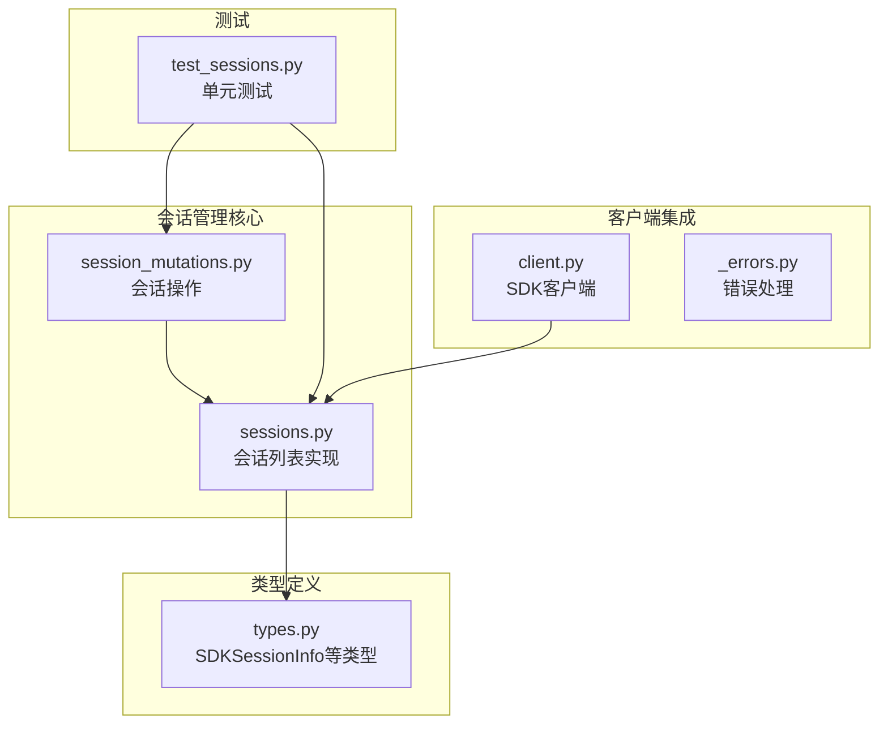

**图表来源**
- [sessions.py:1-927](file://src/claude_agent_sdk/_internal/sessions.py#L1-L927)
- [session_mutations.py:1-302](file://src/claude_agent_sdk/_internal/session_mutations.py#L1-L302)
- [types.py:960-1011](file://src/claude_agent_sdk/types.py#L960-L1011)

**章节来源**
- [sessions.py:1-927](file://src/claude_agent_sdk/_internal/sessions.py#L1-L927)
- [types.py:960-1011](file://src/claude_agent_sdk/types.py#L960-L1011)

## 核心组件

### SDKSessionInfo 数据结构

SDKSessionInfo 是会话列表功能返回的核心数据结构，设计用于在不完全解析 JSONL 文件的情况下提供会话元数据。

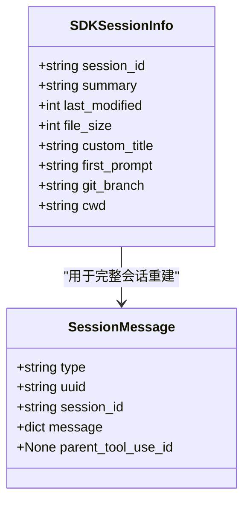

**图表来源**
- [types.py:960-1011](file://src/claude_agent_sdk/types.py#L960-L1011)

SDKSessionInfo 的字段含义：
- `session_id`: 唯一会话标识符（UUID格式）
- `summary`: 会话显示标题，优先级为：自定义标题 > 自动生成摘要 > 首个提示词
- `last_modified`: 最后修改时间（毫秒精度）
- `file_size`: 会话文件大小（字节）
- `custom_title`: 用户设置的会话标题
- `first_prompt`: 会话中的首个有意义用户提示词
- `git_branch`: 会话结束时的 Git 分支信息
- `cwd`: 会话的工作目录

**章节来源**
- [types.py:960-1011](file://src/claude_agent_sdk/types.py#L960-L1011)

### 会话文件存储格式

会话文件采用 JSONL（JSON Lines）格式存储，每行包含一个完整的 JSON 对象：

```mermaid
flowchart TD
A[会话文件(.jsonl)] --> B[第一行: 用户消息]
B --> C[可能包含: cwd, gitBranch, isSidechain, isMeta]
C --> D[后续行: 各种消息类型]
D --> E[最后几行: 摘要信息]
E --> F[summary, customTitle, gitBranch等]
G[示例结构] --> H{"type": "user"}
G --> I{"type": "assistant"}
G --> J{"type": "progress"}
G --> K{"type": "system"}
G --> L{"type": "summary"}
```

**图表来源**
- [sessions.py:403-470](file://src/claude_agent_sdk/_internal/sessions.py#L403-L470)

**章节来源**
- [sessions.py:403-470](file://src/claude_agent_sdk/_internal/sessions.py#L403-L470)

## 架构概览

会话管理系统采用分层架构设计，实现了高效的数据提取和处理：

```mermaid
graph TB
subgraph "应用层"
A[ClaudeSDKClient]
B[外部调用者]
end
subgraph "会话管理核心"
C[list_sessions]
D[get_session_messages]
E[_read_sessions_from_dir]
F[_read_session_file]
end
subgraph "数据提取层"
G[_read_session_lite]
H[_extract_json_string_field]
I[_extract_first_prompt_from_head]
J[_parse_transcript_entries]
end
subgraph "Git支持"
K[_get_worktree_paths]
L[_find_project_dir]
end
subgraph "存储层"
M[~/.claude/projects/]
N[项目目录]
O[会话文件(.jsonl)]
end
B --> A
A --> C
C --> E
E --> G
G --> H
G --> I
C --> K
K --> L
L --> N
N --> O
A --> D
D --> F
F --> J
```

**图表来源**
- [sessions.py:593-634](file://src/claude_agent_sdk/_internal/sessions.py#L593-L634)
- [sessions.py:660-710](file://src/claude_agent_sdk/_internal/sessions.py#L660-L710)

## 详细组件分析

### 会话列表功能实现

会话列表功能通过多阶段的数据提取和过滤机制实现：

#### 1. 文件扫描和验证

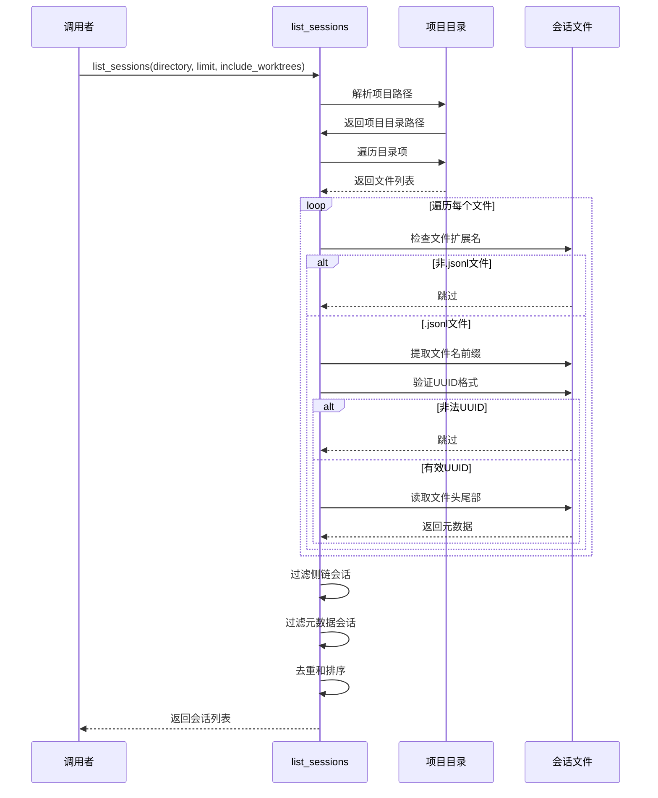

**图表来源**
- [sessions.py:403-470](file://src/claude_agent_sdk/_internal/sessions.py#L403-L470)
- [sessions.py:495-573](file://src/claude_agent_sdk/_internal/sessions.py#L495-L573)

#### 2. 元数据提取机制

系统采用轻量级的元数据提取策略，避免全文件解析：

```mermaid
flowchart TD
A[开始] --> B[统计文件信息]
B --> C[读取文件头部(64KB)]
C --> D[读取文件尾部(64KB)]
D --> E[提取字符串字段]
E --> F[提取第一个用户提示]
F --> G[检查侧链标记]
G --> H{是否为侧链?}
H --> |是| I[跳过此会话]
H --> |否| J[提取摘要信息]
J --> K[确定显示标题]
K --> L[提取Git分支信息]
L --> M[提取工作目录]
M --> N[创建SDKSessionInfo]
N --> O[添加到结果列表]
I --> P[继续下一个文件]
O --> P
```

**图表来源**
- [sessions.py:335-362](file://src/claude_agent_sdk/_internal/sessions.py#L335-L362)
- [sessions.py:438-468](file://src/claude_agent_sdk/_internal/sessions.py#L438-L468)

**章节来源**
- [sessions.py:403-470](file://src/claude_agent_sdk/_internal/sessions.py#L403-L470)
- [sessions.py:335-362](file://src/claude_agent_sdk/_internal/sessions.py#L335-L362)

### SDKSessionInfo 数据结构详解

SDKSessionInfo 设计遵循"最小必要信息"原则，仅包含从文件统计和头部/尾部读取中可直接获得的信息：

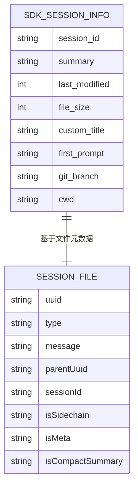

**图表来源**
- [types.py:960-986](file://src/claude_agent_sdk/types.py#L960-L986)

字段设计考虑：
- **性能优化**: 所有字段都可通过轻量级操作获取
- **兼容性**: 字段名称与 CLI 输出保持一致
- **完整性**: 包含足够的信息用于会话选择和显示

**章节来源**
- [types.py:960-986](file://src/claude_agent_sdk/types.py#L960-L986)

### 会话ID验证机制

会话ID验证采用严格的 UUID 格式检查：

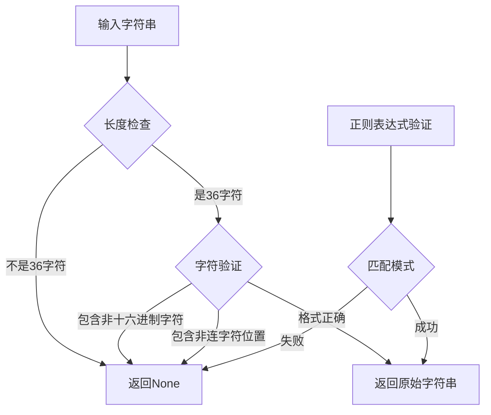

**图表来源**
- [sessions.py:57-61](file://src/claude_agent_sdk/_internal/sessions.py#L57-L61)

**章节来源**
- [sessions.py:57-61](file://src/claude_agent_sdk/_internal/sessions.py#L57-L61)

### 路径清理和工作树检测

系统支持复杂的路径处理和 Git 工作树检测：

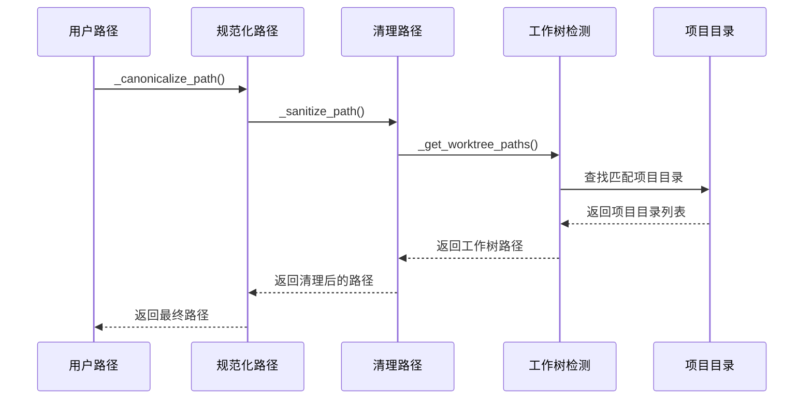

**图表来源**
- [sessions.py:130-166](file://src/claude_agent_sdk/_internal/sessions.py#L130-L166)
- [sessions.py:370-395](file://src/claude_agent_sdk/_internal/sessions.py#L370-L395)

**章节来源**
- [sessions.py:130-166](file://src/claude_agent_sdk/_internal/sessions.py#L130-L166)
- [sessions.py:370-395](file://src/claude_agent_sdk/_internal/sessions.py#L370-L395)

### 会话去重算法

去重算法确保同一会话ID在不同项目或工作树中的最新版本被保留：

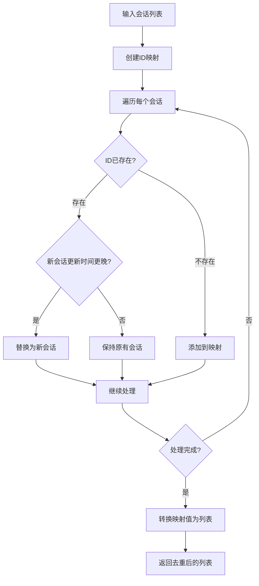

**图表来源**
- [sessions.py:473-482](file://src/claude_agent_sdk/_internal/sessions.py#L473-L482)

**章节来源**
- [sessions.py:473-482](file://src/claude_agent_sdk/_internal/sessions.py#L473-L482)

### 排序规则

会话按最后修改时间降序排列，确保最新的会话显示在最前面：

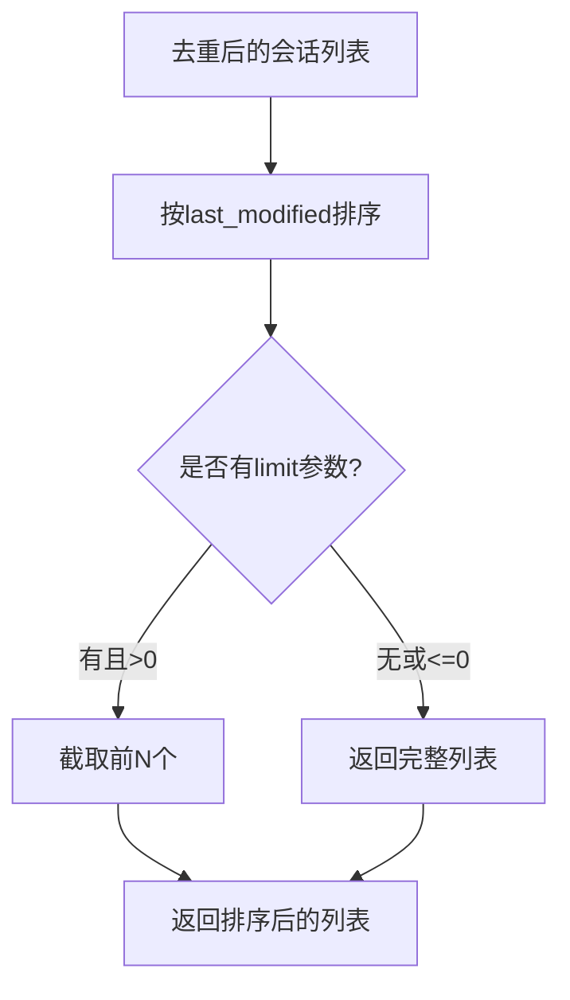

**图表来源**
- [sessions.py:485-492](file://src/claude_agent_sdk/_internal/sessions.py#L485-L492)

**章节来源**
- [sessions.py:485-492](file://src/claude_agent_sdk/_internal/sessions.py#L485-L492)

### 会话搜索和过滤高级功能

系统提供了多层次的搜索和过滤功能：

#### 1. 内容过滤机制

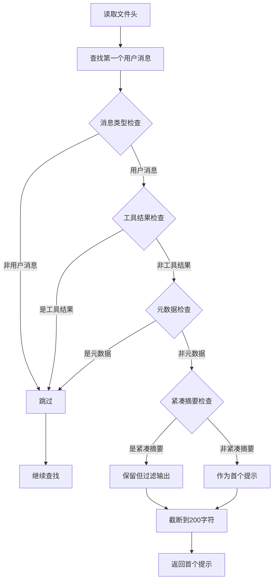

**图表来源**
- [sessions.py:241-315](file://src/claude_agent_sdk/_internal/sessions.py#L241-L315)

#### 2. Git 工作树支持

系统能够自动检测和处理 Git 工作树环境：

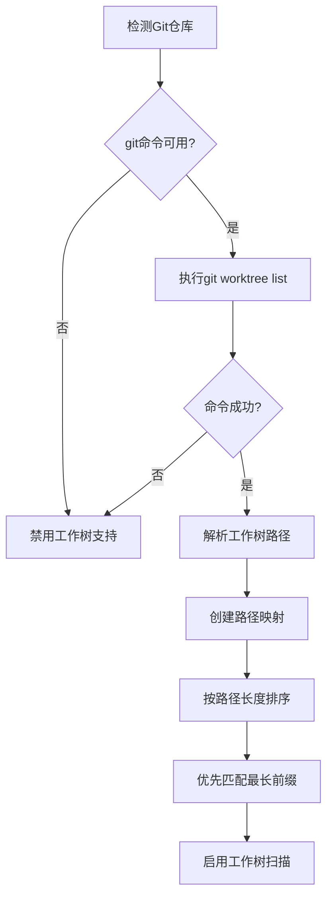

**图表来源**
- [sessions.py:370-395](file://src/claude_agent_sdk/_internal/sessions.py#L370-L395)

**章节来源**
- [sessions.py:241-315](file://src/claude_agent_sdk/_internal/sessions.py#L241-L315)
- [sessions.py:370-395](file://src/claude_agent_sdk/_internal/sessions.py#L370-L395)

## 依赖关系分析

会话管理系统与其他组件的依赖关系如下：

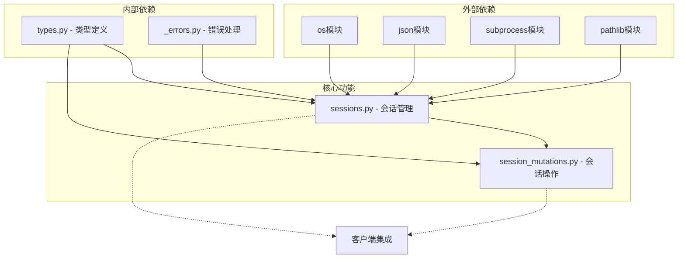

**图表来源**
- [sessions.py:8-19](file://src/claude_agent_sdk/_internal/sessions.py#L8-L19)
- [session_mutations.py:20-35](file://src/claude_agent_sdk/_internal/session_mutations.py#L20-L35)

**章节来源**
- [sessions.py:8-19](file://src/claude_agent_sdk/_internal/sessions.py#L8-L19)
- [session_mutations.py:20-35](file://src/claude_agent_sdk/_internal/session_mutations.py#L20-L35)

## 性能考虑

### 1. 轻量级文件读取策略

系统采用"统计 + 头尾部读取"的策略，避免全文件解析：

- **缓冲区大小**: 64KB 头部 + 64KB 尾部
- **内存占用**: 固定大小缓冲区，不受文件大小影响
- **I/O 次数**: 每个文件最多 3 次系统调用

### 2. 字符串提取优化

JSON 字段提取采用单次扫描策略：

- **避免全解析**: 使用字符串匹配而非完整 JSON 解析
- **转义处理**: 正确处理 JSON 字符串转义序列
- **缓存机制**: 避免重复计算相同字段

### 3. 并发处理

系统支持多项目并发扫描：

- **异步I/O**: 利用 Python 异步特性提高吞吐量
- **错误隔离**: 单个项目失败不影响其他项目
- **资源限制**: 控制最大并发数量避免系统过载

### 4. 缓存策略

- **路径缓存**: 避免重复的路径规范化操作
- **Git 信息缓存**: 减少 Git 命令调用频率
- **结果缓存**: 在同一进程内缓存最近的查询结果

## 故障排除指南

### 常见问题及解决方案

#### 1. 会话列表为空

**可能原因**:
- 配置目录不存在
- 项目目录为空
- 权限不足访问文件

**诊断步骤**:
1. 检查 `CLAUDE_CONFIG_DIR` 环境变量
2. 验证 `~/.claude/projects/` 目录结构
3. 检查文件权限

**解决方法**:
```python
import os
from pathlib import Path

# 检查配置目录
config_dir = os.environ.get("CLAUDE_CONFIG_DIR", "~/.claude")
print(f"配置目录: {Path(config_dir).expanduser()}")

# 检查项目目录
projects_dir = Path(config_dir) / "projects"
print(f"项目目录存在: {projects_dir.exists()}")
```

#### 2. Git 工作树检测失败

**症状**: 工作树扫描不生效

**原因分析**:
- Git 命令不可用
- 当前目录不在 Git 仓库中
- 权限不足执行 Git 命令

**调试方法**:
```python
import subprocess
import os

try:
    result = subprocess.run(
        ["git", "worktree", "list", "--porcelain"],
        cwd="/path/to/project",
        capture_output=True,
        text=True,
        timeout=5
    )
    print(f"Git命令状态: {result.returncode}")
    print(f"输出: {result.stdout}")
    print(f"错误: {result.stderr}")
except Exception as e:
    print(f"Git命令执行失败: {e}")
```

#### 3. 会话ID验证失败

**症状**: 会话ID被拒绝

**可能原因**:
- UUID 格式不正确
- 字符串包含非法字符
- 长度不符合要求

**验证方法**:
```python
import re

def validate_uuid(maybe_uuid):
    """验证UUID格式"""
    UUID_PATTERN = re.compile(
        r"^[0-9a-f]{8}-[0-9a-f]{4}-[0-9a-f]{4}-[0-9a-f]{4}-[0-9a-f]{12}$",
        re.IGNORECASE
    )
    return UUID_PATTERN.match(maybe_uuid) is not None

# 测试
test_ids = [
    "550e8400-e29b-41d4-a716-446655440000",  # 有效
    "invalid-uuid",                         # 无效
    "550e8400-e29b-41d4-a716-44665544000"   # 长度错误
]

for uid in test_ids:
    print(f"{uid}: {validate_uuid(uid)}")
```

#### 4. 性能问题

**症状**: 会话列表加载缓慢

**优化建议**:
1. **限制扫描范围**: 使用 `directory` 参数指定具体项目
2. **调整缓冲区**: 根据需要调整 `LITE_READ_BUF_SIZE`
3. **禁用工作树扫描**: 设置 `include_worktrees=False`
4. **使用限制**: 设置 `limit` 参数限制返回数量

**监控方法**:
```python
import time

start_time = time.time()
sessions = list_sessions(directory="/path/to/project", limit=50)
end_time = time.time()

print(f"查询耗时: {end_time - start_time:.2f}秒")
print(f"找到会话数: {len(sessions)}")
```

**章节来源**
- [_errors.py:1-57](file://src/claude_agent_sdk/_errors.py#L1-L57)

## 结论

Claude Agent SDK 的会话管理系统通过精心设计的轻量级数据提取策略，实现了高效的会话管理和检索功能。系统的主要优势包括：

1. **高性能**: 通过统计和头尾部读取避免全文件解析
2. **可靠性**: 完善的错误处理和边界情况处理
3. **可扩展性**: 支持 Git 工作树和多项目环境
4. **易用性**: 简洁的 API 设计和丰富的配置选项

该系统为开发者提供了强大的会话管理能力，同时保持了良好的性能表现和用户体验。

## 附录

### 配置选项参考

| 选项 | 类型 | 默认值 | 描述 |
|------|------|--------|------|
| directory | str \| None | None | 项目目录路径，None表示扫描所有项目 |
| limit | int \| None | None | 返回会话的最大数量 |
| include_worktrees | bool | True | 是否包含 Git 工作树中的会话 |

### 最佳实践建议

1. **性能优化**
   - 优先使用具体目录参数缩小扫描范围
   - 合理设置 limit 参数控制返回数量
   - 在生产环境中考虑缓存最近的查询结果

2. **错误处理**
   - 始终检查返回的会话列表长度
   - 处理可能的文件权限错误
   - 实现适当的超时机制

3. **Git 工作树支持**
   - 在多工作树环境中启用 include_worktrees
   - 定期检查 Git 命令的可用性
   - 处理工作树路径的大小写敏感性

4. **安全考虑**
   - 验证所有会话ID的格式
   - 处理潜在的恶意文件名
   - 实施适当的文件系统访问控制