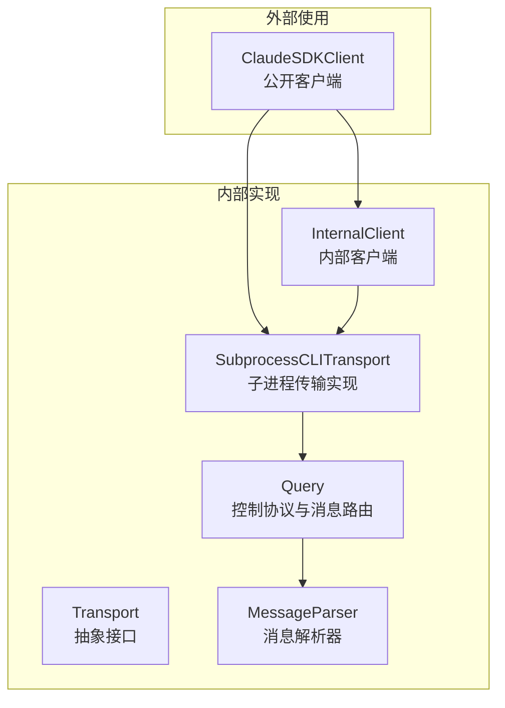
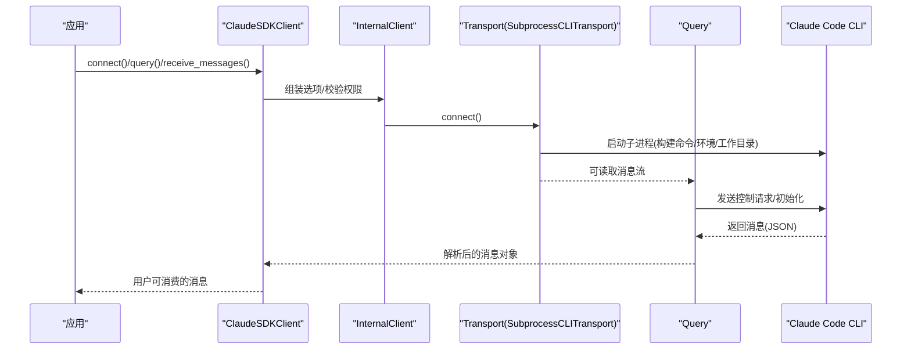
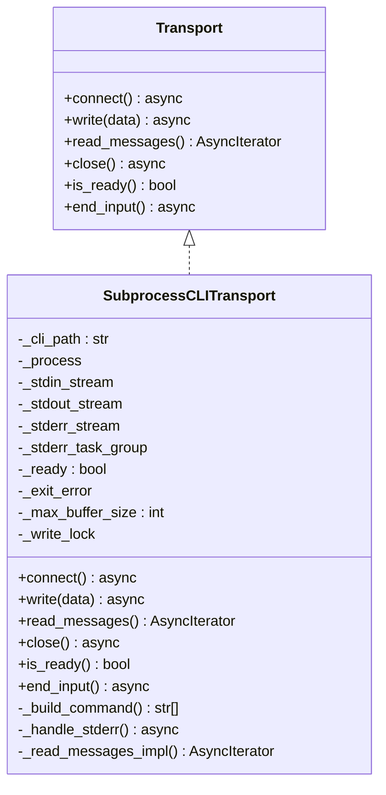
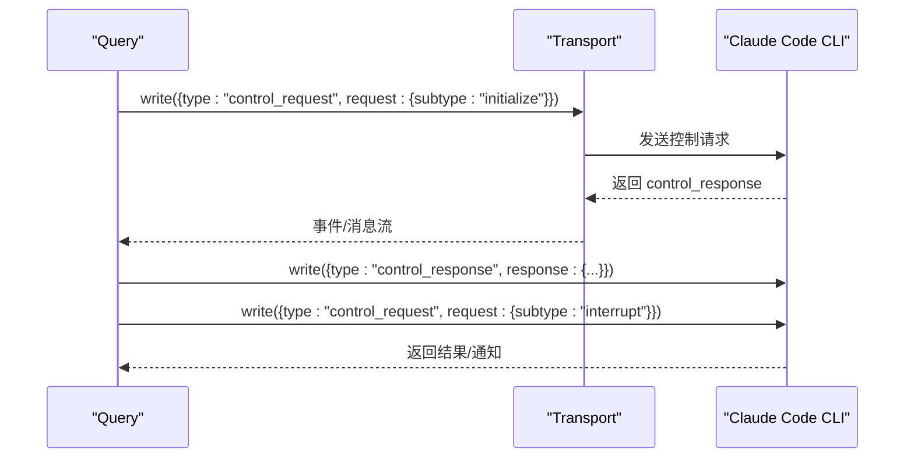
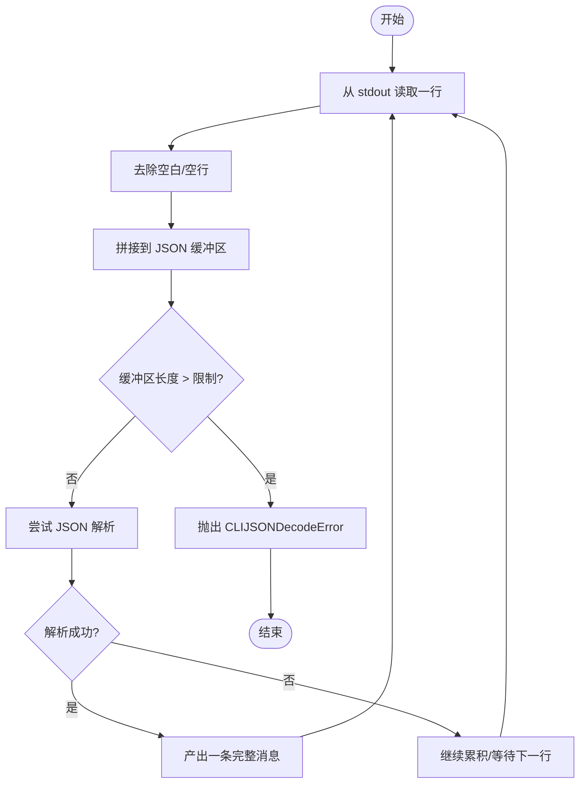
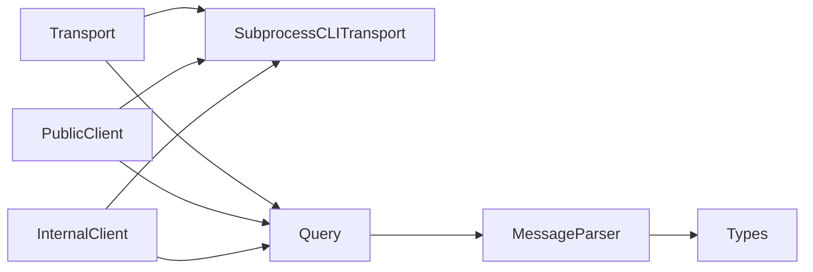

# 传输层架构

<cite>
**本文引用的文件**
- [transport/__init__.py](file://src/claude_agent_sdk/_internal/transport/__init__.py)
- [subprocess_cli.py](file://src/claude_agent_sdk/_internal/transport/subprocess_cli.py)
- [client.py（公开客户端）](file://src/claude_agent_sdk/client.py)
- [client.py（内部客户端）](file://src/claude_agent_sdk/_internal/client.py)
- [query.py](file://src/claude_agent_sdk/_internal/query.py)
- [message_parser.py](file://src/claude_agent_sdk/_internal/message_parser.py)
- [types.py](file://src/claude_agent_sdk/types.py)
- [_errors.py](file://src/claude_agent_sdk/_errors.py)
- [test_transport.py](file://tests/test_transport.py)
- [test_subprocess_buffering.py](file://tests/test_subprocess_buffering.py)
- [streaming_mode.py](file://examples/streaming_mode.py)
</cite>

## 目录
1. [简介](#简介)
2. [项目结构](#项目结构)
3. [核心组件](#核心组件)
4. [架构总览](#架构总览)
5. [详细组件分析](#详细组件分析)
6. [依赖关系分析](#依赖关系分析)
7. [性能考量](#性能考量)
8. [故障排除指南](#故障排除指南)
9. [结论](#结论)
10. [附录：自定义传输实现指南](#附录自定义传输实现指南)

## 简介
本文件系统性阐述 Claude Agent SDK 的传输层架构，重点围绕以下目标：
- 解释 Transport 抽象接口的设计理念与作用边界
- 深入分析 SubprocessCLITransport 的实现细节，包括与 Claude Code CLI 的集成、命令行参数构建与进程管理
- 说明传输层生命周期管理：连接建立、维护与清理
- 解释消息序列化与反序列化流程：JSON 编码与流式解析
- 提供自定义传输实现指南：接口实现要求与最佳实践
- 错误处理与重连机制说明
- 性能优化建议与缓冲区配置
- 故障排除与调试技巧
- 如何扩展传输层以支持新通信协议

## 项目结构
传输层位于内部模块中，对外通过公开客户端暴露能力；内部客户端与查询层负责控制协议与消息路由；消息解析器负责将 CLI 输出转换为强类型消息对象。

图表来源
- [client.py（公开客户端）:21-500](file://src/claude_agent_sdk/client.py#L21-L500)
- [client.py（内部客户端）:20-146](file://src/claude_agent_sdk/_internal/client.py#L20-L146)
- [query.py:53-679](file://src/claude_agent_sdk/_internal/query.py#L53-L679)
- [transport/__init__.py:8-68](file://src/claude_agent_sdk/_internal/transport/__init__.py#L8-L68)
- [subprocess_cli.py:33-630](file://src/claude_agent_sdk/_internal/transport/subprocess_cli.py#L33-L630)
- [message_parser.py:29-251](file://src/claude_agent_sdk/_internal/message_parser.py#L29-L251)

章节来源
- [client.py（公开客户端）:21-500](file://src/claude_agent_sdk/client.py#L21-L500)
- [client.py（内部客户端）:20-146](file://src/claude_agent_sdk/_internal/client.py#L20-L146)
- [query.py:53-679](file://src/claude_agent_sdk/_internal/query.py#L53-L679)
- [transport/__init__.py:8-68](file://src/claude_agent_sdk/_internal/transport/__init__.py#L8-L68)
- [subprocess_cli.py:33-630](file://src/claude_agent_sdk/_internal/transport/subprocess_cli.py#L33-L630)
- [message_parser.py:29-251](file://src/claude_agent_sdk/_internal/message_parser.py#L29-L251)

## 核心组件
- Transport 抽象接口：定义统一的低层 I/O 能力，屏蔽具体传输细节（子进程、网络等）
- SubprocessCLITransport：基于 anyio 的子进程传输实现，封装 Claude Code CLI 的启动、参数构建、stdin/stdout/stderr 流管理
- Query 控制协议层：在 Transport 基础上实现双向控制协议、钩子回调、工具权限请求、MCP 服务器桥接
- MessageParser：将 CLI 输出的 JSON 对象解析为强类型消息对象
- ClaudeSDKClient/InternalClient：高层客户端，负责生命周期管理、选项配置、消息收发与控制命令

章节来源
- [transport/__init__.py:8-68](file://src/claude_agent_sdk/_internal/transport/__init__.py#L8-L68)
- [subprocess_cli.py:33-630](file://src/claude_agent_sdk/_internal/transport/subprocess_cli.py#L33-L630)
- [query.py:53-679](file://src/claude_agent_sdk/_internal/query.py#L53-L679)
- [message_parser.py:29-251](file://src/claude_agent_sdk/_internal/message_parser.py#L29-L251)
- [client.py（公开客户端）:21-500](file://src/claude_agent_sdk/client.py#L21-L500)
- [client.py（内部客户端）:20-146](file://src/claude_agent_sdk/_internal/client.py#L20-L146)

## 架构总览
传输层采用“抽象接口 + 具体实现”的分层设计。Transport 定义最小可用能力集，SubprocessCLITransport 实现子进程 I/O，并通过 Query 层完成控制协议与消息路由，最终由 MessageParser 将 CLI 输出映射为业务消息对象。

图表来源
- [client.py（公开客户端）:94-185](file://src/claude_agent_sdk/client.py#L94-L185)
- [client.py（内部客户端）:44-146](file://src/claude_agent_sdk/_internal/client.py#L44-L146)
- [subprocess_cli.py:335-411](file://src/claude_agent_sdk/_internal/transport/subprocess_cli.py#L335-L411)
- [query.py:165-235](file://src/claude_agent_sdk/_internal/query.py#L165-L235)

## 详细组件分析

### Transport 接口设计与抽象层
- 设计理念
  - 低层抽象：仅关注原始 I/O 与连接状态，不关心上层控制协议或消息语义
  - 明确职责：connect/write/read_messages/close/is_ready/end_input
  - 可扩展性：允许替换为网络传输、WebSocket、远程服务等实现
- 关键方法
  - connect：准备底层连接（子进程启动/网络握手）
  - write：写入原始字符串数据（通常为 JSON + 换行）
  - read_messages：异步迭代解析后的消息字典
  - close：关闭连接并释放资源
  - is_ready：检查是否可读写
  - end_input：结束输入流（如关闭 stdin）

章节来源
- [transport/__init__.py:8-68](file://src/claude_agent_sdk/_internal/transport/__init__.py#L8-L68)

### SubprocessCLITransport 实现详解
- 进程与流管理
  - 使用 anyio.open_process 启动 CLI 子进程，配置 stdin/stdout/stderr 管道
  - 包装 TextReceiveStream/TextSendStream 用于文本流读写
  - 异步任务组处理 stderr 流，避免阻塞主消息循环
- 命令行参数构建
  - 固定输出格式为 stream-json，输入格式为 stream-json，确保双向流式交互
  - 支持系统提示、工具列表、模型选择、预算限制、思维令牌上限、MCP 配置、插件目录、附加目录、会话续传等丰富选项
  - 版本检查：在非跳过模式下检测 CLI 版本并给出警告
- 生命周期管理
  - connect：合并环境变量、设置入口点与 SDK 版本、按需管道 stderr、创建 stdin/stdout 流、标记就绪
  - write：带锁并发安全，检查就绪态、进程退出码、已记录的退出错误
  - end_input：关闭 stdin 流
  - close：取消 stderr 任务组、关闭 stdin/stdout/stderr、终止并等待进程退出
  - read_messages：逐行读取 stdout，拼接 JSON 行，容错长行截断，超时抛出异常
- 错误处理
  - FileNotFoundError：区分工作目录不存在与 CLI 未找到
  - JSON 解码：缓冲区大小限制，超过阈值抛出 CLIJSONDecodeError
  - 进程退出：等待返回码，非零时包装为 ProcessError 并抛出
- 缓冲区与性能
  - 默认最大缓冲区 1MB，可通过选项覆盖
  - 写入加锁，避免并发写导致的资源忙错误
  - stderr 异步读取，不影响主消息流

图表来源
- [transport/__init__.py:8-68](file://src/claude_agent_sdk/_internal/transport/__init__.py#L8-L68)
- [subprocess_cli.py:33-630](file://src/claude_agent_sdk/_internal/transport/subprocess_cli.py#L33-L630)

章节来源
- [subprocess_cli.py:335-411](file://src/claude_agent_sdk/_internal/transport/subprocess_cli.py#L335-L411)
- [subprocess_cli.py:481-514](file://src/claude_agent_sdk/_internal/transport/subprocess_cli.py#L481-L514)
- [subprocess_cli.py:519-586](file://src/claude_agent_sdk/_internal/transport/subprocess_cli.py#L519-L586)
- [subprocess_cli.py:627-630](file://src/claude_agent_sdk/_internal/transport/subprocess_cli.py#L627-L630)

### 查询与控制协议层（Query）
- 角色定位：在 Transport 之上实现双向控制协议，处理权限请求、钩子回调、MCP 服务器桥接、消息路由与初始化握手
- 初始化与握手
  - initialize：发送控制请求 subtype=initialize，携带钩子配置与可选代理定义
  - start：启动后台任务组读取 Transport 的消息流
- 消息路由
  - control_response：响应 pending 请求
  - control_request：分派 can_use_tool、hook_callback、mcp_message 等
  - 普通 SDK 消息：写入内存通道供上层消费
- 控制命令
  - 中断、切换权限模式、切换模型、重播文件、重连 MCP、启停任务等
- 流关闭策略
  - 等待首个 result 到达后再关闭 stdin，保证双向控制协议的完整性

图表来源
- [query.py:119-163](file://src/claude_agent_sdk/_internal/query.py#L119-L163)
- [query.py:165-235](file://src/claude_agent_sdk/_internal/query.py#L165-L235)
- [query.py:347-393](file://src/claude_agent_sdk/_internal/query.py#L347-L393)

章节来源
- [query.py:119-163](file://src/claude_agent_sdk/_internal/query.py#L119-L163)
- [query.py:165-235](file://src/claude_agent_sdk/_internal/query.py#L165-L235)
- [query.py:347-393](file://src/claude_agent_sdk/_internal/query.py#L347-L393)
- [query.py:614-631](file://src/claude_agent_sdk/_internal/query.py#L614-L631)

### 消息序列化与反序列化
- 序列化
  - 上层调用 write 时，将消息字典转为 JSON 字符串并追加换行，写入 stdin
- 反序列化
  - SubprocessCLITransport.read_messages 逐行读取 stdout，拼接 JSON 行，尝试解析完整对象
  - 容错长行截断：TextReceiveStream 可能截断长行，通过缓冲与拆分行的方式恢复
  - 超大消息保护：超过最大缓冲区阈值时抛出 CLIJSONDecodeError
- 类型映射
  - MessageParser 将 JSON 字典映射为强类型消息对象（用户消息、助手消息、系统消息、结果消息、流事件、速率限制事件等）

图表来源
- [subprocess_cli.py:519-586](file://src/claude_agent_sdk/_internal/transport/subprocess_cli.py#L519-L586)
- [message_parser.py:29-251](file://src/claude_agent_sdk/_internal/message_parser.py#L29-L251)

章节来源
- [subprocess_cli.py:519-586](file://src/claude_agent_sdk/_internal/transport/subprocess_cli.py#L519-L586)
- [message_parser.py:29-251](file://src/claude_agent_sdk/_internal/message_parser.py#L29-L251)

### 生命周期管理
- 连接建立
  - SubprocessCLITransport.connect：启动 CLI 子进程，创建流，标记就绪
  - Query.start：启动后台任务组读取消息
- 维护
  - SubprocessCLITransport.read_messages：持续读取 stdout，处理 stderr 异步流
  - Query._read_messages：路由控制消息与普通消息，维护 pending 控制响应
- 清理
  - SubprocessCLITransport.close：关闭 stderr 任务组、stdin、等待进程退出
  - Query.close：取消任务组，关闭 Transport

章节来源
- [subprocess_cli.py:335-411](file://src/claude_agent_sdk/_internal/transport/subprocess_cli.py#L335-L411)
- [subprocess_cli.py:440-480](file://src/claude_agent_sdk/_internal/transport/subprocess_cli.py#L440-L480)
- [query.py:659-668](file://src/claude_agent_sdk/_internal/query.py#L659-L668)

### 错误处理与重连机制
- 连接错误
  - CLI 未找到：CLINotFoundError
  - 工作目录不存在：CLIConnectionError
- 运行时错误
  - JSON 解码失败/缓冲区超限：CLIJSONDecodeError
  - 进程退出：ProcessError（携带 exit_code/stderr）
- 控制协议错误
  - 超时：控制请求超时抛出异常
  - 失败：向 CLI 返回 error 响应
- 重连与恢复
  - Query 提供 reconnect_mcp_server/toggle_mcp_server 等控制命令
  - 传输层未内置自动重连逻辑，需上层在捕获异常后重建连接

章节来源
- [_errors.py:6-57](file://src/claude_agent_sdk/_errors.py#L6-L57)
- [subprocess_cli.py:396-410](file://src/claude_agent_sdk/_internal/transport/subprocess_cli.py#L396-L410)
- [subprocess_cli.py:572-586](file://src/claude_agent_sdk/_internal/transport/subprocess_cli.py#L572-L586)
- [query.py:573-584](file://src/claude_agent_sdk/_internal/query.py#L573-L584)

## 依赖关系分析
- Transport 与 SubprocessCLITransport：继承关系
- Query 依赖 Transport 进行 I/O，依赖 MessageParser 进行消息解析
- ClaudeSDKClient/InternalClient 依赖 Query 与 Transport
- MessageParser 依赖类型定义（types.py）

图表来源
- [transport/__init__.py:8-68](file://src/claude_agent_sdk/_internal/transport/__init__.py#L8-L68)
- [subprocess_cli.py:33-630](file://src/claude_agent_sdk/_internal/transport/subprocess_cli.py#L33-L630)
- [query.py:53-679](file://src/claude_agent_sdk/_internal/query.py#L53-L679)
- [message_parser.py:29-251](file://src/claude_agent_sdk/_internal/message_parser.py#L29-L251)
- [types.py:766-800](file://src/claude_agent_sdk/types.py#L766-L800)

章节来源
- [transport/__init__.py:8-68](file://src/claude_agent_sdk/_internal/transport/__init__.py#L8-L68)
- [subprocess_cli.py:33-630](file://src/claude_agent_sdk/_internal/transport/subprocess_cli.py#L33-L630)
- [query.py:53-679](file://src/claude_agent_sdk/_internal/query.py#L53-L679)
- [message_parser.py:29-251](file://src/claude_agent_sdk/_internal/message_parser.py#L29-L251)
- [types.py:766-800](file://src/claude_agent_sdk/types.py#L766-L800)

## 性能考量
- 缓冲区配置
  - 默认最大缓冲区 1MB，可通过 ClaudeAgentOptions.max_buffer_size 自定义
  - 超限即刻抛错，避免内存膨胀
- 并发写入
  - 写入操作加锁，避免并发写导致的资源忙错误
- 流式处理
  - stdout/stderr 均为异步流，减少阻塞
- 版本检查
  - 启动时进行快速版本检查，避免不兼容 CLI 导致的运行时问题
- MCP 服务器
  - SDK MCP 服务器通过手动桥接 JSON-RPC 方法，未来可借助 Transport 抽象进一步解耦

章节来源
- [subprocess_cli.py:29-62](file://src/claude_agent_sdk/_internal/transport/subprocess_cli.py#L29-L62)
- [subprocess_cli.py:481-506](file://src/claude_agent_sdk/_internal/transport/subprocess_cli.py#L481-L506)
- [query.py:394-531](file://src/claude_agent_sdk/_internal/query.py#L394-L531)

## 故障排除指南
- CLI 未找到
  - 症状：CLINotFoundError
  - 排查：确认 CLI 路径、系统 PATH、捆绑 CLI 是否存在
- 工作目录不存在
  - 症状：CLIConnectionError
  - 排查：检查 ClaudeAgentOptions.cwd
- JSON 解码失败/缓冲区超限
  - 症状：CLIJSONDecodeError
  - 排查：增大 max_buffer_size，检查 CLI 输出格式一致性
- 进程提前退出
  - 症状：ProcessError（含 exit_code/stderr）
  - 排查：查看 stderr 输出，检查 CLI 参数与环境
- 并发写入冲突
  - 症状：BusyResourceError 或竞态条件
  - 排查：确认写入路径使用锁；参考测试用例验证并发安全
- 流关闭时机
  - 症状：MCP/钩子无法收到响应
  - 排查：确保在收到首个 result 前保持 stdin 打开；必要时调整 CLAUDE_CODE_STREAM_CLOSE_TIMEOUT

章节来源
- [_errors.py:6-57](file://src/claude_agent_sdk/_errors.py#L6-L57)
- [subprocess_cli.py:396-410](file://src/claude_agent_sdk/_internal/transport/subprocess_cli.py#L396-L410)
- [subprocess_cli.py:546-554](file://src/claude_agent_sdk/_internal/transport/subprocess_cli.py#L546-L554)
- [test_transport.py:729-765](file://tests/test_transport.py#L729-L765)
- [test_subprocess_buffering.py:250-285](file://tests/test_subprocess_buffering.py#L250-L285)

## 结论
传输层通过 Transport 抽象实现了与 Claude Code CLI 的稳定交互，结合 Query 的控制协议与 MessageParser 的强类型映射，形成了清晰的分层架构。SubprocessCLITransport 在进程管理、流式处理与错误处理方面具备良好的健壮性；通过可配置的缓冲区与并发写入锁，兼顾了性能与可靠性。对于扩展新协议，只需实现 Transport 接口并在上层客户端中注入即可。

## 附录：自定义传输实现指南
- 必须实现的方法
  - connect：准备底层连接（如建立网络连接/启动子进程）
  - write：写入原始字符串数据（通常为 JSON + 换行）
  - read_messages：异步迭代解析后的消息字典
  - close：关闭连接并释放资源
  - is_ready：返回是否可读写
  - end_input：结束输入流（如关闭 stdin）
- 最佳实践
  - 明确职责边界：仅处理 I/O，不参与控制协议与消息解析
  - 并发安全：写入操作加锁，避免竞态
  - 资源管理：在 close 中统一释放所有句柄与任务
  - 错误处理：区分连接错误、运行时错误与进程退出，提供可诊断信息
  - 流式处理：支持长行截断与多对象拼接场景
  - 可配置性：支持缓冲区大小、超时、日志级别等参数
- 示例参考
  - 参考 SubprocessCLITransport 的命令构建、环境变量合并、stderr 异步读取与进程等待逻辑

章节来源
- [transport/__init__.py:8-68](file://src/claude_agent_sdk/_internal/transport/__init__.py#L8-L68)
- [subprocess_cli.py:335-411](file://src/claude_agent_sdk/_internal/transport/subprocess_cli.py#L335-L411)
- [subprocess_cli.py:481-514](file://src/claude_agent_sdk/_internal/transport/subprocess_cli.py#L481-L514)
- [subprocess_cli.py:519-586](file://src/claude_agent_sdk/_internal/transport/subprocess_cli.py#L519-L586)