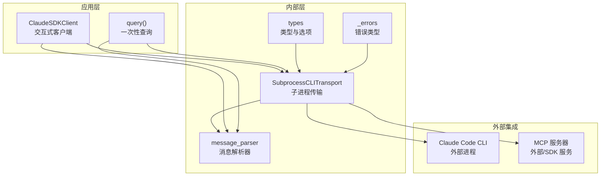
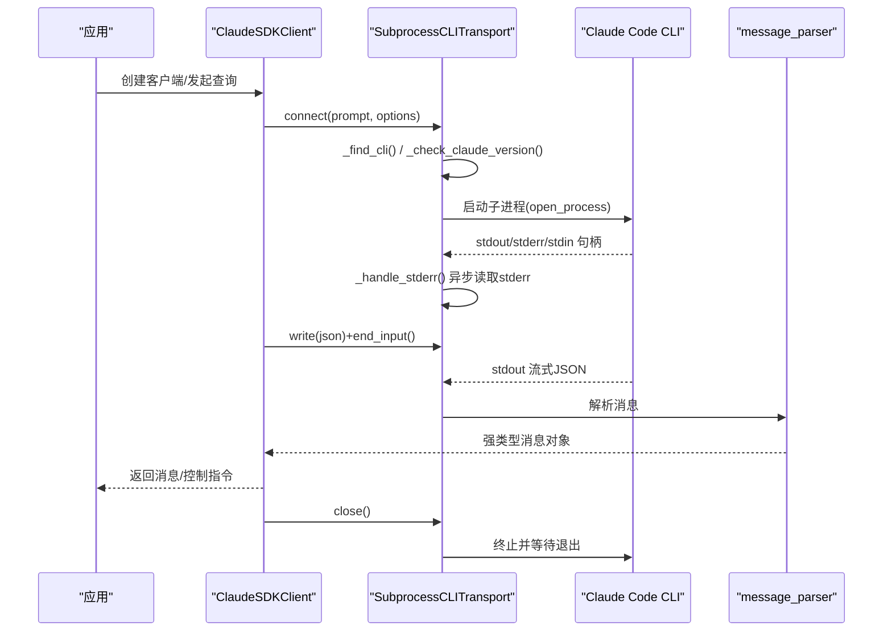
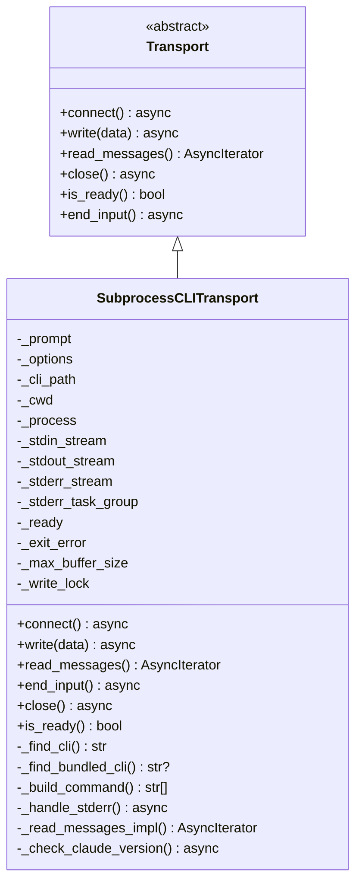
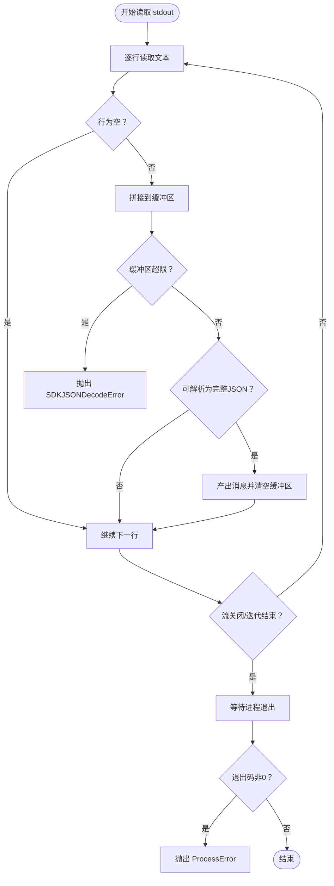
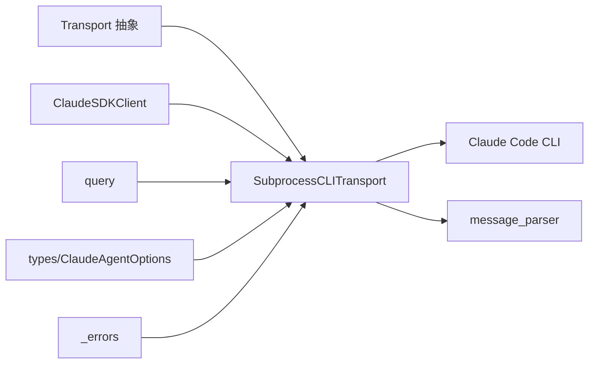

# 子进程传输实现

<cite>
**本文引用的文件列表**
- [subprocess_cli.py](file://src/claude_agent_sdk/_internal/transport/subprocess_cli.py)
- [client.py](file://src/claude_agent_sdk/client.py)
- [query.py](file://src/claude_agent_sdk/query.py)
- [message_parser.py](file://src/claude_agent_sdk/_internal/message_parser.py)
- [types.py](file://src/claude_agent_sdk/types.py)
- [_errors.py](file://src/claude_agent_sdk/_errors.py)
- [download_cli.py](file://scripts/download_cli.py)
- [__init__.py](file://src/claude_agent_sdk/_internal/transport/__init__.py)
</cite>

## 目录
1. [简介](#简介)
2. [项目结构](#项目结构)
3. [核心组件](#核心组件)
4. [架构总览](#架构总览)
5. [详细组件分析](#详细组件分析)
6. [依赖关系分析](#依赖关系分析)
7. [性能考虑](#性能考虑)
8. [故障排除指南](#故障排除指南)
9. [结论](#结论)

## 简介
本文件面向开发者，系统化阐述 Claude Agent SDK 中基于子进程的传输实现（SubprocessCLITransport）。内容涵盖：
- 设计架构与实现细节
- 与 Claude Code CLI 的集成机制（二进制查找、版本检查、兼容性验证）
- 命令行参数构建流程（系统提示、工具配置、MCP 服务器、权限模式等）
- 进程生命周期管理（启动、监控、优雅关闭、资源清理）
- 消息流处理机制（JSON 流式解析、缓冲区管理、错误处理）
- 异步 I/O 实现（stdin/stdout/stderr 并发安全）
- 性能优化建议（缓冲区大小、内存管理）
- 故障排除与常见问题

## 项目结构
围绕子进程传输的关键模块如下：
- 传输层：SubprocessCLITransport（子进程 CLI 传输）
- 客户端封装：ClaudeSDKClient（交互式客户端）、query（一次性查询）
- 类型与错误：ClaudeAgentOptions、各类消息类型、错误类型
- 消息解析：message_parser（将 CLI 输出解析为强类型消息对象）
- CLI 打包：download_cli（构建时下载并打包 CLI 二进制）

图表来源
- [client.py:94-180](file://src/claude_agent_sdk/client.py#L94-L180)
- [query.py:12-127](file://src/claude_agent_sdk/query.py#L12-L127)
- [subprocess_cli.py:33-630](file://src/claude_agent_sdk/_internal/transport/subprocess_cli.py#L33-L630)
- [message_parser.py:29-251](file://src/claude_agent_sdk/_internal/message_parser.py#L29-L251)
- [types.py:1030-1099](file://src/claude_agent_sdk/types.py#L1030-L1099)
- [_errors.py:6-57](file://src/claude_agent_sdk/_errors.py#L6-L57)

章节来源
- [client.py:94-180](file://src/claude_agent_sdk/client.py#L94-L180)
- [query.py:12-127](file://src/claude_agent_sdk/query.py#L12-L127)
- [subprocess_cli.py:33-630](file://src/claude_agent_sdk/_internal/transport/subprocess_cli.py#L33-L630)
- [message_parser.py:29-251](file://src/claude_agent_sdk/_internal/message_parser.py#L29-L251)
- [types.py:1030-1099](file://src/claude_agent_sdk/types.py#L1030-L1099)
- [_errors.py:6-57](file://src/claude_agent_sdk/_errors.py#L6-L57)

## 核心组件
- SubprocessCLITransport：实现 Transport 抽象接口，负责启动/连接 Claude Code CLI 子进程，管理 stdin/stdout/stderr 流，读取并解析 JSON 消息，处理进程退出与错误。
- ClaudeSDKClient：提供交互式会话能力，内部使用 SubprocessCLITransport，并通过 Query 控制协议进行初始化、权限模式切换、MCP 服务器管理等。
- query：一次性查询入口，内部使用 SubprocessCLITransport，适合无状态、单次交互场景。
- message_parser：将 CLI 输出的原始 JSON 字典解析为强类型消息对象（用户消息、助手消息、系统消息、结果消息、流事件、速率限制事件等）。
- ClaudeAgentOptions：承载所有与 CLI 交互相关的配置项，如系统提示、工具集、MCP 服务器、工作目录、环境变量、输出格式、思维配置、插件、权限模式等。

章节来源
- [subprocess_cli.py:33-630](file://src/claude_agent_sdk/_internal/transport/subprocess_cli.py#L33-L630)
- [client.py:21-500](file://src/claude_agent_sdk/client.py#L21-L500)
- [query.py:12-127](file://src/claude_agent_sdk/query.py#L12-L127)
- [message_parser.py:29-251](file://src/claude_agent_sdk/_internal/message_parser.py#L29-L251)
- [types.py:1030-1099](file://src/claude_agent_sdk/types.py#L1030-L1099)

## 架构总览
下图展示从应用到 CLI 的端到端调用链路与数据流。

图表来源
- [client.py:94-180](file://src/claude_agent_sdk/client.py#L94-L180)
- [subprocess_cli.py:335-480](file://src/claude_agent_sdk/_internal/transport/subprocess_cli.py#L335-L480)
- [message_parser.py:29-251](file://src/claude_agent_sdk/_internal/message_parser.py#L29-L251)

## 详细组件分析

### SubprocessCLITransport 类设计与实现
- 角色定位：实现 Transport 抽象接口，作为 SDK 与 Claude Code CLI 的桥梁，负责进程生命周期、流式 I/O、消息解析与错误传播。
- 关键字段与状态
  - 进程句柄、stdin/stdout/stderr 文本流、stderr 异步任务组、就绪标志、退出错误记录、最大缓冲区大小、写入锁。
- 初始化与连接
  - 优先使用内置打包的 CLI（按平台命名），否则在 PATH 与常见安装路径中查找；支持自定义 cli_path。
  - 可选执行版本检查（受环境变量控制），确保最小版本要求。
  - 构建命令行参数，合并用户环境变量，注入 SDK 版本信息与可选的文件检查点开关。
  - 根据是否提供 stderr 回调或调试标志决定是否管道 stderr，并启动异步任务读取。
  - 建立 stdin 文本发送流与 stdout 文本接收流，标记就绪。
- 写入与输入结束
  - 使用写入锁保证并发安全；在写入前检查就绪状态、进程返回码与退出错误，避免向已终止进程写入。
  - end_input 关闭 stdin 流，触发 CLI 输入结束。
- 读取消息与 JSON 流解析
  - 基于 TextReceiveStream 逐行读取 stdout；由于底层流可能截断长行，采用“拼接 + 试探解析”的策略，累积到完整 JSON 对象后产出消息。
  - 支持多对象拼接在同一行、嵌入换行符的字符串值等边界情况。
  - 超过最大缓冲区大小时抛出 SDKJSONDecodeError，防止内存膨胀。
  - 在迭代结束时检查进程退出码，非零则抛出 ProcessError。
- 错误处理与关闭
  - 连接阶段捕获工作目录不存在、CLI 未找到等错误并转换为 CLIConnectionError。
  - stderr 读取异常被静默处理，避免干扰主消息流。
  - 关闭时先取消 stderr 任务组，再关闭 stdin/stdout/stderr，最后终止并等待进程退出，清理内部状态。

图表来源
- [__init__.py:8-69](file://src/claude_agent_sdk/_internal/transport/__init__.py#L8-L69)
- [subprocess_cli.py:33-630](file://src/claude_agent_sdk/_internal/transport/subprocess_cli.py#L33-L630)

章节来源
- [subprocess_cli.py:33-630](file://src/claude_agent_sdk/_internal/transport/subprocess_cli.py#L33-L630)
- [__init__.py:8-69](file://src/claude_agent_sdk/_internal/transport/__init__.py#L8-L69)

### CLI 集成机制：二进制查找、版本检查与兼容性
- CLI 二进制查找策略
  - 先尝试内置打包的 CLI（按平台选择名称），若存在则直接使用。
  - 否则在 PATH 中搜索 claude；若失败，遍历常见安装位置（用户目录、全局安装、本地安装、Yarn、NPM 等）。
  - 若仍找不到，抛出 CLINotFoundError 并给出安装与路径配置建议。
- 版本检查与兼容性验证
  - 默认在 connect 前执行版本检查，解析 -v 输出提取主版本号，与最小版本比较，低于阈值时打印警告。
  - 受环境变量控制可跳过版本检查。
- 工作目录与环境变量
  - 支持指定 cwd；若 cwd 不存在，连接阶段抛出 CLIConnectionError。
  - 合并用户 env 与 SDK 必需环境变量（如 SDK 版本、入口标识、可选的文件检查点开关），并支持以 user 参数指定运行用户。

章节来源
- [subprocess_cli.py:64-110](file://src/claude_agent_sdk/_internal/transport/subprocess_cli.py#L64-L110)
- [subprocess_cli.py:340-410](file://src/claude_agent_sdk/_internal/transport/subprocess_cli.py#L340-L410)
- [subprocess_cli.py:587-626](file://src/claude_agent_sdk/_internal/transport/subprocess_cli.py#L587-L626)

### 命令行参数构建：系统提示、工具配置、MCP 服务器、权限模式等
- 基础参数
  - 输出格式：--output-format stream-json
  - 输入格式：--input-format stream-json（始终启用流式）
  - 详细级别：--verbose
- 系统提示与工具
  - system_prompt：支持字符串或预设对象（含 append），预设为 claude_code 时映射为默认工具集。
  - tools：支持工具名列表或预设对象（预设映射为 default）。
  - allowed_tools/disallowed_tools/max_turns/max_budget_usd/model/fallback_model/betas/permission_prompt_tool_name/permission_mode/continue_conversation/resume/include_partial_messages/fork_session 等一一对应为 CLI 标志。
- 设置与沙箱
  - settings：支持 JSON 字符串或文件路径；当同时提供 sandbox 时，将 sandbox 合并到 settings 对象中，最终以 JSON 字符串传给 CLI。
  - add_dirs：逐个追加 --add-dir。
- MCP 服务器
  - mcp_servers：支持字典（SDK 服务器去除 instance 字段后传递，外部服务器原样传递）、字符串路径或 JSON 字符串；最终以 --mcp-config JSON 结构传入。
- 插件与额外参数
  - plugins：仅支持本地插件，追加 --plugin-dir。
  - extra_args：任意 CLI 标志，None 表示布尔标志，否则为带值标志。
- 思维与输出格式
  - thinking 优先级高于已弃用的 max_thinking_tokens；根据配置计算 --max-thinking-tokens。
  - output_format 为 json_schema 时，将 schema 以 --json-schema 传入。
- 设置源
  - setting_sources：逗号分隔传入 --setting-sources。

章节来源
- [subprocess_cli.py:166-333](file://src/claude_agent_sdk/_internal/transport/subprocess_cli.py#L166-L333)
- [subprocess_cli.py:112-164](file://src/claude_agent_sdk/_internal/transport/subprocess_cli.py#L112-L164)

### 进程生命周期管理：启动、监控、优雅关闭与资源清理
- 启动
  - open_process 启动 CLI，建立 stdin/stdout/stderr 文本流；stderr 可选管道化。
  - 就绪后进入可读写状态。
- 监控
  - 读取消息时持续监听 stdout；stderr 通过独立任务异步读取并回调。
  - 读取完成后等待进程退出，非零退出码转化为 ProcessError。
- 优雅关闭
  - 关闭时先取消 stderr 任务组，再关闭 stdin（写入锁内），随后关闭 stderr 与 stdout。
  - 若进程仍在运行，尝试 terminate 并等待退出，避免僵尸进程。
- 资源清理
  - 清空内部状态（进程句柄、流、任务组、错误记录）。

章节来源
- [subprocess_cli.py:335-480](file://src/claude_agent_sdk/_internal/transport/subprocess_cli.py#L335-L480)
- [subprocess_cli.py:440-480](file://src/claude_agent_sdk/_internal/transport/subprocess_cli.py#L440-L480)

### 消息流处理：JSON 流式解析、缓冲区管理与错误处理
- 流式解析策略
  - 基于 TextReceiveStream 逐行读取；由于底层可能截断长行，采用“拼接 + 试探解析”：将每行片段拼接到缓冲区，超过最大缓冲区大小即报错，否则尝试解析完整 JSON 对象。
  - 支持同一行多个 JSON 对象、嵌入换行符的字符串值等边界情况。
- 缓冲区管理
  - 默认最大缓冲区大小为 1MB；可通过 options.max_buffer_size 自定义。
  - 超限抛出 SDKJSONDecodeError，避免内存无限增长。
- 错误处理
  - 连接期：CLI 未找到、工作目录不存在、其他启动异常分别转为 CLIConnectionError。
  - 运行期：stderr 读取异常被忽略；进程非零退出码转为 ProcessError；JSON 解析异常转为 SDKJSONDecodeError。
  - 读取完成时检查进程退出码，确保上层感知失败。

图表来源
- [subprocess_cli.py:519-586](file://src/claude_agent_sdk/_internal/transport/subprocess_cli.py#L519-L586)

章节来源
- [subprocess_cli.py:519-586](file://src/claude_agent_sdk/_internal/transport/subprocess_cli.py#L519-L586)
- [_errors.py:42-57](file://src/claude_agent_sdk/_errors.py#L42-L57)

### 异步 I/O 实现：stdin/stdout/stderr 处理与并发安全
- stdin
  - TextSendStream，写入前持有写入锁，确保并发写入安全；写入失败或进程已退出时更新就绪状态并抛出 CLIConnectionError。
- stdout
  - TextReceiveStream，逐行读取并进行 JSON 流式解析。
- stderr
  - 可选管道化；若提供 stderr 回调或调试标志，则启动异步任务读取，逐行回调或写入 debug_stderr（已废弃）。
- 并发安全
  - 写入锁保护写入与关闭操作，避免竞态条件。
  - stderr 任务组统一管理，关闭时先取消任务组再关闭流。

章节来源
- [subprocess_cli.py:412-439](file://src/claude_agent_sdk/_internal/transport/subprocess_cli.py#L412-L439)
- [subprocess_cli.py:481-514](file://src/claude_agent_sdk/_internal/transport/subprocess_cli.py#L481-L514)

### 与 Claude Code CLI 的集成与控制协议
- 客户端封装
  - ClaudeSDKClient：在 connect 时自动创建 SubprocessCLITransport，启动 Query 控制协议，支持权限模式切换、模型切换、MCP 服务器管理、任务停止、文件回溯等高级功能。
  - query：一次性查询入口，内部同样使用 SubprocessCLITransport，适合无状态、单次交互。
- 控制协议
  - Query 负责初始化、中断、权限模式设置、MCP 消息转发、任务控制、文件回溯等，通过控制请求与响应与 CLI 协作。
- 消息解析
  - message_parser 将 CLI 输出的原始 JSON 映射为强类型消息对象，便于上层处理。

章节来源
- [client.py:94-180](file://src/claude_agent_sdk/client.py#L94-L180)
- [query.py:12-127](file://src/claude_agent_sdk/query.py#L12-L127)
- [message_parser.py:29-251](file://src/claude_agent_sdk/_internal/message_parser.py#L29-L251)

### CLI 打包与分发
- 构建时下载与打包
  - download_cli 脚本根据平台选择安装脚本，下载并复制 CLI 到包内 _bundled 目录，便于分发时携带二进制。
- 运行时查找
  - SubprocessCLITransport 优先使用 _bundled 目录中的 CLI，提升跨平台可用性。

章节来源
- [download_cli.py:51-137](file://scripts/download_cli.py#L51-L137)
- [subprocess_cli.py:97-110](file://src/claude_agent_sdk/_internal/transport/subprocess_cli.py#L97-L110)

## 依赖关系分析
- 组件耦合
  - SubprocessCLITransport 依赖 anyio 的进程与流抽象、错误类型、以及 SDK 的类型与选项。
  - ClaudeSDKClient 与 query 依赖 SubprocessCLITransport 与 message_parser。
- 外部依赖
  - Claude Code CLI：作为子进程运行，遵循其命令行语义。
  - MCP 服务器：通过 --mcp-config 与 CLI 通信，支持 stdio/http/sse/sdk 等多种配置。
- 接口契约
  - Transport 抽象定义了 connect/write/read_messages/close/is_ready/end_input 的契约，SubprocessCLITransport 提供具体实现。

图表来源
- [__init__.py:8-69](file://src/claude_agent_sdk/_internal/transport/__init__.py#L8-L69)
- [subprocess_cli.py:33-630](file://src/claude_agent_sdk/_internal/transport/subprocess_cli.py#L33-L630)
- [client.py:94-180](file://src/claude_agent_sdk/client.py#L94-L180)
- [query.py:12-127](file://src/claude_agent_sdk/query.py#L12-L127)
- [types.py:1030-1099](file://src/claude_agent_sdk/types.py#L1030-L1099)
- [_errors.py:6-57](file://src/claude_agent_sdk/_errors.py#L6-L57)

章节来源
- [__init__.py:8-69](file://src/claude_agent_sdk/_internal/transport/__init__.py#L8-L69)
- [subprocess_cli.py:33-630](file://src/claude_agent_sdk/_internal/transport/subprocess_cli.py#L33-L630)
- [client.py:94-180](file://src/claude_agent_sdk/client.py#L94-L180)
- [query.py:12-127](file://src/claude_agent_sdk/query.py#L12-L127)
- [types.py:1030-1099](file://src/claude_agent_sdk/types.py#L1030-L1099)
- [_errors.py:6-57](file://src/claude_agent_sdk/_errors.py#L6-L57)

## 性能考虑
- 缓冲区大小配置
  - 默认 1MB，可通过 options.max_buffer_size 调整；过大可能导致内存占用上升，过小可能引发频繁解析失败。
  - 建议根据消息体量与内存预算权衡，默认值通常足够应对大多数场景。
- 流式 I/O
  - stdout/stdin/stderr 均采用异步流，避免阻塞；stderr 通过独立任务读取，降低对主消息流的影响。
- 进程与资源
  - 关闭时主动终止并等待，避免资源泄漏；stderr 任务组统一管理，确保及时释放。
- JSON 解析策略
  - 试探解析减少因行截断导致的解析失败；超限快速失败，避免内存膨胀。

[本节为通用性能建议，不直接分析特定文件]

## 故障排除指南
- CLI 未找到
  - 现象：启动时报 CLINotFoundError 或 CLIConnectionError。
  - 排查：确认 CLI 是否安装、是否在 PATH 中、是否使用了正确的 cli_path；参考内置查找策略与错误提示。
- 工作目录不存在
  - 现象：CLIConnectionError 指示工作目录不存在。
  - 排查：检查 options.cwd 是否正确，必要时修正或创建目录。
- 版本不兼容
  - 现象：版本检查警告或功能异常。
  - 排查：升级 Claude Code CLI 至最低版本以上；可通过环境变量跳过版本检查（谨慎使用）。
- JSON 解析失败或缓冲区超限
  - 现象：SDKJSONDecodeError，提示缓冲区超限或无法解码。
  - 排查：增大 max_buffer_size；检查 CLI 输出格式是否符合 stream-json；排查是否存在异常长行或特殊字符。
- 进程非零退出
  - 现象：ProcessError，附带退出码与 stderr 提示。
  - 排查：查看 stderr 输出定位问题；检查 CLI 标志与配置是否正确。
- 权限与 MCP 问题
  - 现象：工具调用被拒绝或 MCP 服务器连接失败。
  - 排查：调整 permission_mode；检查 MCP 配置与网络；使用客户端提供的状态查询与重连接口。

章节来源
- [subprocess_cli.py:396-410](file://src/claude_agent_sdk/_internal/transport/subprocess_cli.py#L396-L410)
- [subprocess_cli.py:546-554](file://src/claude_agent_sdk/_internal/transport/subprocess_cli.py#L546-L554)
- [subprocess_cli.py:572-585](file://src/claude_agent_sdk/_internal/transport/subprocess_cli.py#L572-L585)
- [_errors.py:14-57](file://src/claude_agent_sdk/_errors.py#L14-L57)

## 结论
SubprocessCLITransport 通过清晰的抽象与严谨的实现，将 Claude Code CLI 无缝集成到 SDK 生态中。它在以下方面表现突出：
- 稳健的 CLI 查找与版本检查机制
- 完整的命令行参数构建与配置融合（系统提示、工具、MCP、权限、思维、输出格式、插件等）
- 高效的异步 I/O 与流式 JSON 解析
- 完善的生命周期管理与错误处理
- 良好的可扩展性（Transport 抽象）

对于生产使用，建议：
- 明确 CLI 安装与路径配置，确保跨平台一致性
- 合理设置缓冲区大小与工作目录
- 使用客户端提供的高级功能（权限模式、MCP 管理、文件回溯等）
- 关注 stderr 输出与日志，以便快速定位问题