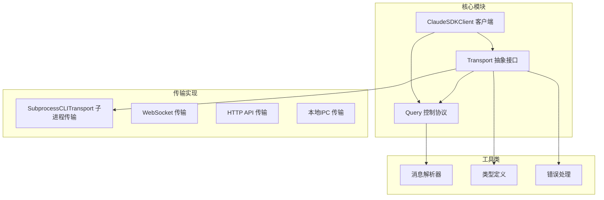
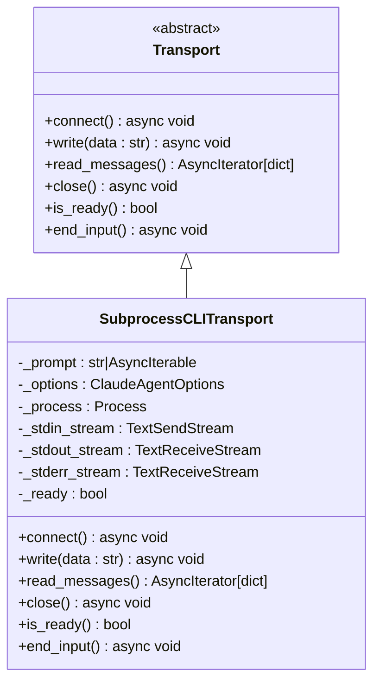
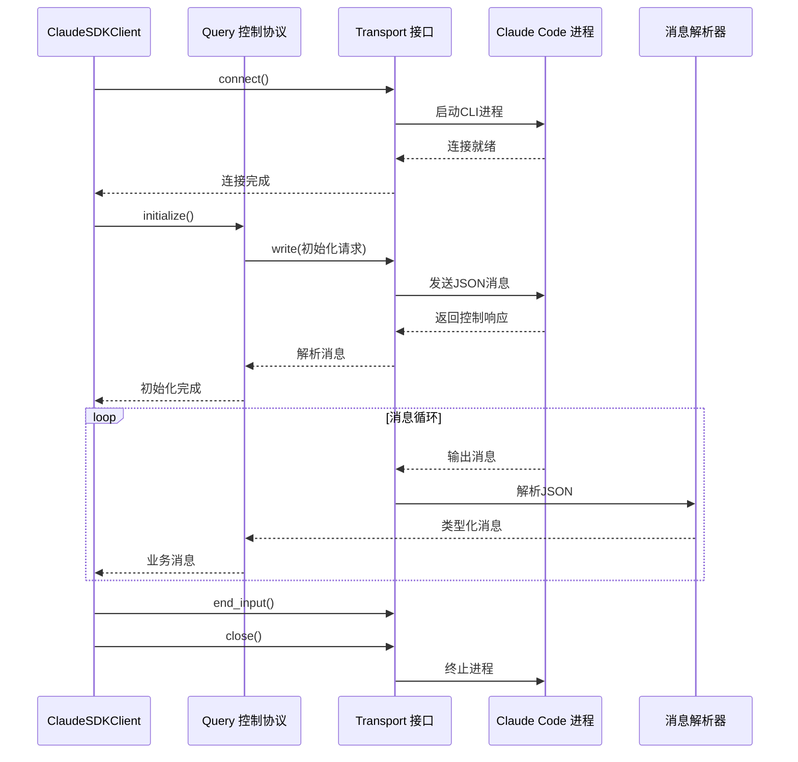
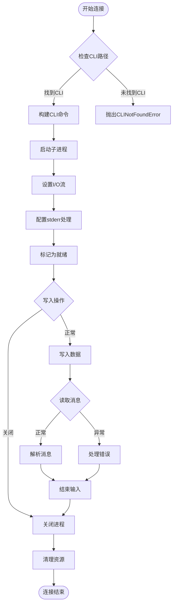
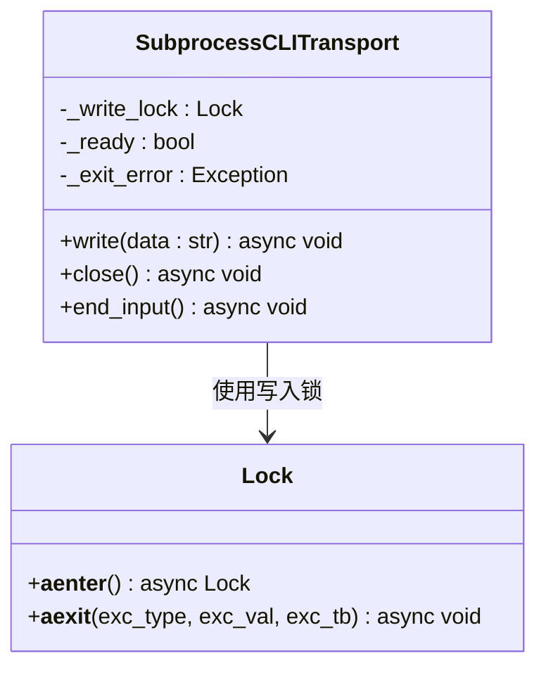
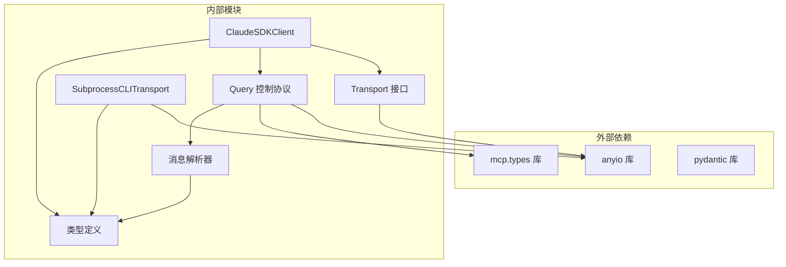

# 自定义传输实现

<cite>
**本文档引用的文件**
- [transport/__init__.py](file://src/claude_agent_sdk/_internal/transport/__init__.py)
- [subprocess_cli.py](file://src/claude_agent_sdk/_internal/transport/subprocess_cli.py)
- [client.py](file://src/claude_agent_sdk/client.py)
- [query.py](file://src/claude_agent_sdk/query.py)
- [_internal/client.py](file://src/claude_agent_sdk/_internal/client.py)
- [_internal/query.py](file://src/claude_agent_sdk/_internal/query.py)
- [types.py](file://src/claude_agent_sdk/types.py)
- [_errors.py](file://src/claude_agent_sdk/_errors.py)
- [_internal/message_parser.py](file://src/claude_agent_sdk/_internal/message_parser.py)
- [test_transport.py](file://tests/test_transport.py)
- [test_integration.py](file://tests/test_integration.py)
- [quick_start.py](file://examples/quick_start.py)
- [streaming_mode.py](file://examples/streaming_mode.py)
- [README.md](file://README.md)
</cite>

## 目录
1. [简介](#简介)
2. [项目结构](#项目结构)
3. [核心组件](#核心组件)
4. [架构概览](#架构概览)
5. [详细组件分析](#详细组件分析)
6. [依赖分析](#依赖分析)
7. [性能考虑](#性能考虑)
8. [故障排除指南](#故障排除指南)
9. [结论](#结论)
10. [附录](#附录)

## 简介

本文档为Claude Agent SDK的自定义传输实现提供全面的开发指南。传输层是SDK的核心抽象，负责与Claude Code进程或服务进行低级别的双向通信。该指南详细解释了Transport抽象接口的设计理念、核心方法定义、生命周期管理、消息序列化规范，以及多种传输协议的实现示例。

## 项目结构

该项目采用模块化设计，主要组件分布如下：



**图表来源**
- [transport/__init__.py:1-69](file://src/claude_agent_sdk/_internal/transport/__init__.py#L1-L69)
- [subprocess_cli.py:33-630](file://src/claude_agent_sdk/_internal/transport/subprocess_cli.py#L33-L630)
- [client.py:21-500](file://src/claude_agent_sdk/client.py#L21-L500)

**章节来源**
- [README.md:1-360](file://README.md#L1-L360)
- [transport/__init__.py:1-69](file://src/claude_agent_sdk/_internal/transport/__init__.py#L1-L69)

## 核心组件

### Transport抽象接口

Transport接口定义了传输层的核心契约，提供了统一的异步I/O抽象：



**图表来源**
- [transport/__init__.py:8-65](file://src/claude_agent_sdk/_internal/transport/__init__.py#L8-L65)
- [subprocess_cli.py:33-630](file://src/claude_agent_sdk/_internal/transport/subprocess_cli.py#L33-L630)

### 关键方法定义

#### connect()方法
- **功能**: 建立传输连接并准备通信
- **子进程传输**: 启动Claude Code CLI进程
- **网络传输**: 建立网络连接
- **返回值**: None（异步方法）

#### write()方法
- **功能**: 将原始数据写入传输层
- **参数**: data: str（通常为JSON + 换行符）
- **实现要求**: 必须处理并发写入的线程安全

#### read_messages()方法
- **功能**: 从传输层读取并解析消息
- **返回值**: AsyncIterator[dict[str, Any]]（解析后的JSON消息）
- **实现要求**: 支持流式处理和部分JSON解析

#### close()方法
- **功能**: 关闭传输连接并清理资源
- **实现要求**: 确保资源正确释放和异常处理

#### is_ready()方法
- **功能**: 检查传输是否准备好进行通信
- **返回值**: bool（True表示已就绪）

#### end_input()方法
- **功能**: 结束输入流（关闭子进程的stdin）
- **实现要求**: 优雅地关闭输入通道

**章节来源**
- [transport/__init__.py:21-65](file://src/claude_agent_sdk/_internal/transport/__init__.py#L21-L65)

## 架构概览

传输层架构展示了SDK中各组件之间的交互关系：



**图表来源**
- [client.py:94-185](file://src/claude_agent_sdk/client.py#L94-L185)
- [_internal/query.py:165-235](file://src/claude_agent_sdk/_internal/query.py#L165-L235)
- [_internal/message_parser.py:29-251](file://src/claude_agent_sdk/_internal/message_parser.py#L29-L251)

## 详细组件分析

### SubprocessCLITransport实现详解

SubprocessCLITransport是默认的传输实现，展示了完整的传输层设计模式：

#### 生命周期管理



**图表来源**
- [subprocess_cli.py:335-480](file://src/claude_agent_sdk/_internal/transport/subprocess_cli.py#L335-L480)

#### 并发控制和线程安全

实现使用锁机制确保并发写入的安全性：



**图表来源**
- [subprocess_cli.py:62-63](file://src/claude_agent_sdk/_internal/transport/subprocess_cli.py#L62-L63)

#### 消息序列化和反序列化

传输层支持灵活的消息格式：

| 消息类型 | 数据格式 | 示例 |
|---------|---------|------|
| 用户消息 | `{"type": "user", "message": {"role": "user", "content": "..."}, "session_id": "..."}` | JSON对象 |
| 控制请求 | `{"type": "control_request", "request_id": "...", "request": {...}}` | 结构化控制协议 |
| 控制响应 | `{"type": "control_response", "response": {"subtype": "success", "request_id": "..."}}` | 异步响应 |

**章节来源**
- [subprocess_cli.py:481-586](file://src/claude_agent_sdk/_internal/transport/subprocess_cli.py#L481-L586)
- [_internal/message_parser.py:29-251](file://src/claude_agent_sdk/_internal/message_parser.py#L29-L251)

### 异步编程模式应用

SDK广泛使用asyncio和anyio库实现高性能异步编程：

#### 任务组管理
- 使用anyio.create_task_group()管理并发任务
- 支持优雅的任务取消和清理
- 实现任务间的协调和同步

#### 流式处理
- AsyncIterator模式支持无限消息流
- 内存流用于消息队列管理
- 背压机制防止内存溢出

#### 错误传播
- 异常在任务间透明传播
- 资源清理通过上下文管理器保证
- 取消信号支持中断操作

**章节来源**
- [_internal/query.py:165-235](file://src/claude_agent_sdk/_internal/query.py#L165-L235)
- [subprocess_cli.py:412-439](file://src/claude_agent_sdk/_internal/transport/subprocess_cli.py#L412-L439)

### 错误处理和重连机制

#### 错误分类
- **CLIConnectionError**: 连接失败或CLI不可用
- **CLINotFoundError**: Claude Code未找到
- **ProcessError**: 进程执行错误
- **CLIJSONDecodeError**: JSON解析失败

#### 重连策略
- 检测到进程退出时触发重连
- 自动恢复连接状态
- 失败时提供详细的错误信息

**章节来源**
- [_errors.py:6-57](file://src/claude_agent_sdk/_errors.py#L6-L57)
- [subprocess_cli.py:572-586](file://src/claude_agent_sdk/_internal/transport/subprocess_cli.py#L572-L586)

## 依赖分析

### 组件耦合关系



**图表来源**
- [_internal/query.py:11-26](file://src/claude_agent_sdk/_internal/query.py#L11-L26)
- [client.py:9-18](file://src/claude_agent_sdk/client.py#L9-L18)

### 关键依赖特性

| 依赖库 | 版本要求 | 用途 | 重要性 |
|-------|---------|------|--------|
| anyio | >= 4.0.0 | 异步I/O和任务管理 | 核心 |
| mcp.types | >= 2024.11.05 | MCP协议支持 | 高 |
| pydantic | >= 2.0.0 | 数据验证和序列化 | 中 |

**章节来源**
- [_internal/query.py:11-26](file://src/claude_agent_sdk/_internal/query.py#L11-L26)
- [types.py:1-16](file://src/claude_agent_sdk/types.py#L1-L16)

## 性能考虑

### 内存管理
- 使用内存对象流限制缓冲区大小（默认100条消息）
- 实现背压机制防止内存泄漏
- 及时清理不再使用的资源

### I/O优化
- 文本流包装减少字符串处理开销
- 批量写入减少系统调用次数
- 流式解析避免大对象内存占用

### 并发控制
- 写入锁确保线程安全但可能成为瓶颈
- 任务组管理避免过多并发任务
- 超时机制防止长时间阻塞

## 故障排除指南

### 常见问题诊断

#### CLI连接问题
```python
# 检查CLI路径
try:
    transport = SubprocessCLITransport(prompt, options)
    await transport.connect()
except CLINotFoundError as e:
    print(f"Claude Code未找到: {e}")
except CLIConnectionError as e:
    print(f"连接失败: {e}")
```

#### JSON解析错误
```python
# 处理部分JSON消息
try:
    async for message in transport.read_messages():
        # 处理消息
except CLIJSONDecodeError as e:
    print(f"JSON解析失败: {e}")
    # 检查缓冲区大小限制
```

#### 超时和取消
```python
# 设置合理的超时时间
try:
    await anyio.fail_after(60)  # 60秒超时
    await event.wait()          # 等待事件
except TimeoutError:
    print("操作超时")
```

**章节来源**
- [test_transport.py:26-38](file://tests/test_transport.py#L26-L38)
- [_errors.py:42-57](file://src/claude_agent_sdk/_errors.py#L42-L57)

## 结论

自定义传输实现需要深入理解以下关键概念：

1. **接口一致性**: 严格遵循Transport抽象接口的所有方法签名
2. **异步设计**: 全面采用async/await模式确保非阻塞I/O
3. **错误处理**: 提供清晰的错误分类和恢复策略
4. **资源管理**: 实现正确的生命周期管理和资源清理
5. **性能优化**: 平衡并发性和内存使用效率

通过参考SubprocessCLITransport的实现模式，开发者可以快速构建符合SDK标准的自定义传输层。

## 附录

### 传输协议实现示例

#### WebSocket传输实现要点
- 建立WebSocket连接并保持心跳
- 实现帧级别的消息解析
- 支持二进制和文本消息格式
- 处理连接断开和自动重连

#### HTTP API传输实现要点
- 使用RESTful API进行请求/响应通信
- 实现长轮询或Server-Sent Events
- 处理HTTP状态码和错误响应
- 支持认证和会话管理

#### 本地IPC传输实现要点
- 使用Unix域套接字或Windows命名管道
- 实现进程间消息传递协议
- 处理权限和访问控制
- 支持多进程并发访问

### 测试策略

#### 单元测试
- 使用pytest框架编写异步测试
- Mock外部依赖确保测试稳定性
- 测试边界条件和异常情况

#### 集成测试
- 验证端到端通信流程
- 测试不同配置组合
- 性能基准测试

#### 示例代码位置
- [quick_start.py](file://examples/quick_start.py): 基础使用示例
- [streaming_mode.py](file://examples/streaming_mode.py): 流式通信示例
- [test_transport.py](file://tests/test_transport.py): 传输层测试
- [test_integration.py](file://tests/test_integration.py): 集成测试