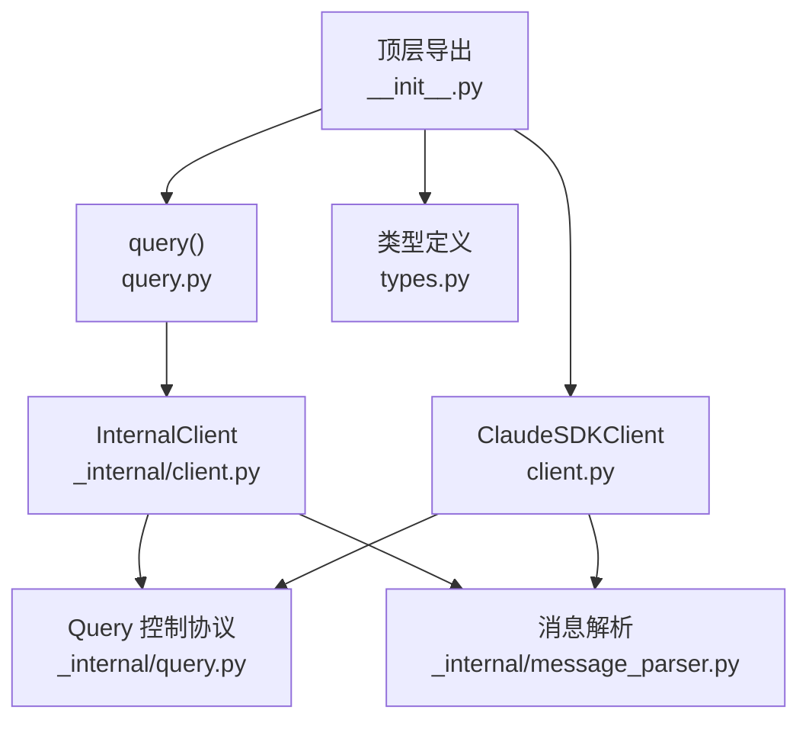
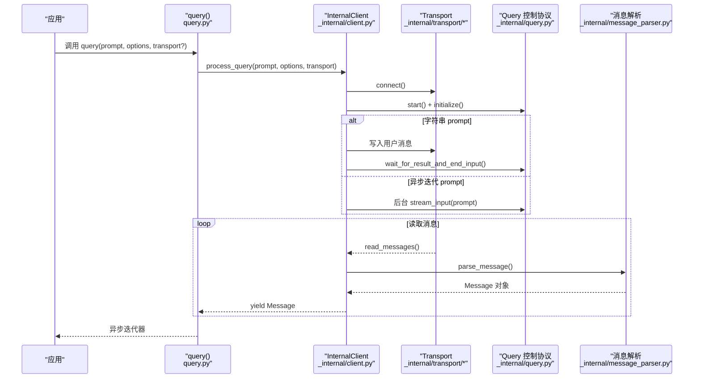
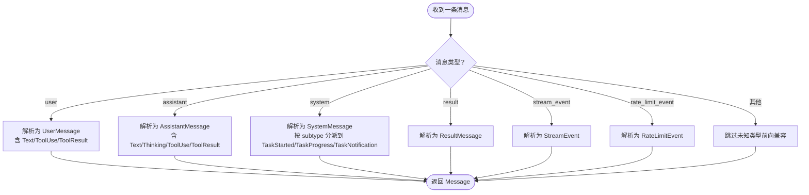
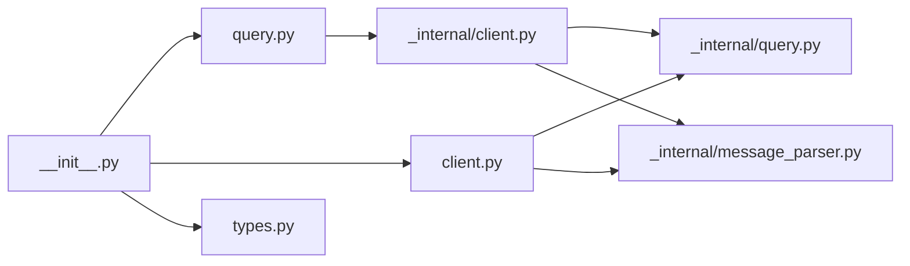

# 基础功能

<cite>
**本文引用的文件列表**
- [src/claude_agent_sdk/__init__.py](file://src/claude_agent_sdk/__init__.py)
- [src/claude_agent_sdk/client.py](file://src/claude_agent_sdk/client.py)
- [src/claude_agent_sdk/query.py](file://src/claude_agent_sdk/query.py)
- [src/claude_agent_sdk/types.py](file://src/claude_agent_sdk/types.py)
- [src/claude_agent_sdk/_internal/client.py](file://src/claude_agent_sdk/_internal/client.py)
- [src/claude_agent_sdk/_internal/query.py](file://src/claude_agent_sdk/_internal/query.py)
- [src/claude_agent_sdk/_internal/message_parser.py](file://src/claude_agent_sdk/_internal/message_parser.py)
- [examples/quick_start.py](file://examples/quick_start.py)
- [examples/streaming_mode.py](file://examples/streaming_mode.py)
- [examples/include_partial_messages.py](file://examples/include_partial_messages.py)
- [tests/test_query.py](file://tests/test_query.py)
- [tests/test_client.py](file://tests/test_client.py)
</cite>

## 目录
1. [简介](#简介)
2. [项目结构](#项目结构)
3. [核心组件](#核心组件)
4. [架构总览](#架构总览)
5. [详细组件分析](#详细组件分析)
6. [依赖关系分析](#依赖关系分析)
7. [性能考量](#性能考量)
8. [故障排查指南](#故障排查指南)
9. [结论](#结论)
10. [附录：API 参考与示例](#附录api-参考与示例)

## 简介
本文件面向 Claude Agent SDK 的“基础功能”，系统性阐述以下主题：
- query() 函数的完整能力：参数配置、返回值（异步迭代器）处理、与流式交互的关系
- ClaudeSDKClient 的双向交互能力：会话管理、实时消息处理、中断支持
- 消息类型体系：UserMessage、AssistantMessage、SystemMessage、ResultMessage 等
- 内容块概念：TextBlock、ThinkingBlock、ToolUseBlock、ToolResultBlock
- 完整 API 参考：公共接口、参数说明、返回值格式
- 实际使用示例与最佳实践
- 错误处理机制与调试技巧

## 项目结构
该 SDK 将公共 API 暴露在顶层模块中，并通过内部模块实现具体逻辑。核心入口为：
- 公共 API 导出：__init__.py
- 一次性查询接口：query.py
- 客户端接口：client.py
- 类型定义：types.py
- 内部实现：_internal/client.py、_internal/query.py、_internal/message_parser.py

图表来源
- [src/claude_agent_sdk/__init__.py:1-445](file://src/claude_agent_sdk/__init__.py#L1-L445)
- [src/claude_agent_sdk/query.py:12-127](file://src/claude_agent_sdk/query.py#L12-L127)
- [src/claude_agent_sdk/client.py:21-500](file://src/claude_agent_sdk/client.py#L21-L500)
- [src/claude_agent_sdk/_internal/client.py:20-146](file://src/claude_agent_sdk/_internal/client.py#L20-L146)
- [src/claude_agent_sdk/_internal/query.py:53-679](file://src/claude_agent_sdk/_internal/query.py#L53-L679)
- [src/claude_agent_sdk/_internal/message_parser.py:29-251](file://src/claude_agent_sdk/_internal/message_parser.py#L29-L251)

章节来源
- [src/claude_agent_sdk/__init__.py:1-445](file://src/claude_agent_sdk/__init__.py#L1-L445)

## 核心组件
- query()：面向一次性或单向流式交互的便捷函数，返回异步迭代器，逐条产出消息对象
- ClaudeSDKClient：面向双向、可中断、可控制的交互客户端，适合多轮对话与实时应用
- 类型系统：Message 联合类型及 ContentBlock 子类型，统一消息与内容块的结构化表示
- 控制协议：Query 类负责与 CLI 的控制通道通信，支持工具权限、钩子回调、MCP 服务器桥接等

章节来源
- [src/claude_agent_sdk/query.py:12-127](file://src/claude_agent_sdk/query.py#L12-L127)
- [src/claude_agent_sdk/client.py:21-500](file://src/claude_agent_sdk/client.py#L21-L500)
- [src/claude_agent_sdk/types.py:945-952](file://src/claude_agent_sdk/types.py#L945-L952)
- [src/claude_agent_sdk/_internal/query.py:53-679](file://src/claude_agent_sdk/_internal/query.py#L53-L679)

## 架构总览
下图展示了 query() 与 ClaudeSDKClient 的共同底层实现路径：通过 InternalClient/Query 与 Transport 进行双向控制与消息流处理；消息经由 message_parser 解析为强类型对象。

图表来源
- [src/claude_agent_sdk/query.py:12-127](file://src/claude_agent_sdk/query.py#L12-L127)
- [src/claude_agent_sdk/_internal/client.py:44-146](file://src/claude_agent_sdk/_internal/client.py#L44-L146)
- [src/claude_agent_sdk/_internal/query.py:165-235](file://src/claude_agent_sdk/_internal/query.py#L165-L235)
- [src/claude_agent_sdk/_internal/message_parser.py:29-251](file://src/claude_agent_sdk/_internal/message_parser.py#L29-L251)

## 详细组件分析

### query() 函数详解
- 功能定位
  - 单次或单向流式交互：适合一次性问答、批处理、自动化脚本
  - 不具备中断、会话管理等双向能力
- 参数
  - prompt：字符串或 AsyncIterable[dict]。后者用于持续输入，每项需包含 type、message、parent_tool_use_id、session_id 等字段
  - options：ClaudeAgentOptions 配置（系统提示、工具、权限模式、工作目录、MCP 服务器、钩子、输出格式等）
  - transport：可选自定义传输层，默认使用子进程 CLI 传输
- 返回值
  - 异步迭代器，逐条产出 Message 对象（AssistantMessage、UserMessage、SystemMessage、ResultMessage、StreamEvent、RateLimitEvent 等）
- 流程要点
  - 设置环境变量以标识 SDK 来源
  - 创建 InternalClient 并调用 process_query
  - 内部根据 prompt 类型选择写入策略：字符串直接写入，异步迭代在后台流式写入
  - 通过 Query.start()/initialize() 建立控制通道，解析消息并逐条产出
- 使用建议
  - 仅需要简单问答时优先使用 query()
  - 需要多轮对话、中断、动态控制时使用 ClaudeSDKClient

章节来源
- [src/claude_agent_sdk/query.py:12-127](file://src/claude_agent_sdk/query.py#L12-L127)
- [src/claude_agent_sdk/_internal/client.py:44-146](file://src/claude_agent_sdk/_internal/client.py#L44-L146)

### ClaudeSDKClient 双向交互能力
- 会话管理
  - connect() 支持传入初始 prompt 或空流，维持连接状态
  - receive_messages() 提供原始消息流；receive_response() 提供单轮响应的便捷迭代器（遇到 ResultMessage 自动终止）
- 实时消息处理
  - 在后台任务中消费 receive_messages()，可并发发送新消息并接收响应
- 中断支持
  - interrupt() 发送控制请求，要求持续消费消息以启用处理
- 其他控制
  - set_permission_mode()、set_model()、rewind_files()、reconnect_mcp_server()、toggle_mcp_server()、stop_task()、get_mcp_status()、get_server_info() 等
- 注意事项
  - 当前版本限制：实例不可跨不同异步运行时上下文使用（例如不同的 trio nursery 或 asyncio 任务组）

章节来源
- [src/claude_agent_sdk/client.py:94-499](file://src/claude_agent_sdk/client.py#L94-L499)
- [src/claude_agent_sdk/_internal/query.py:532-612](file://src/claude_agent_sdk/_internal/query.py#L532-L612)

### 消息类型与内容块
- 消息类型
  - UserMessage：用户输入，可含文本、工具调用、工具结果等内容块
  - AssistantMessage：助手回复，可含文本、思考、工具调用、工具结果等
  - SystemMessage：系统消息，包含多种子类型（如任务开始、进度、通知）
  - ResultMessage：一次交互的结果汇总（耗时、用量、费用、停止原因等）
  - StreamEvent：部分消息更新事件（当开启 include_partial_messages 时）
  - RateLimitEvent：速率限制状态变更事件
- 内容块
  - TextBlock：纯文本
  - ThinkingBlock：思考内容与签名
  - ToolUseBlock：工具调用描述（id、name、input）
  - ToolResultBlock：工具执行结果（tool_use_id、content、is_error）

章节来源
- [src/claude_agent_sdk/types.py:766-952](file://src/claude_agent_sdk/types.py#L766-L952)
- [src/claude_agent_sdk/_internal/message_parser.py:29-251](file://src/claude_agent_sdk/_internal/message_parser.py#L29-L251)

### 控制协议与消息解析
- 控制协议
  - Query 负责建立 initialize 请求、处理 can_use_tool 权限请求、hook 回调、MCP 桥接等
  - 支持中断、模型切换、文件回溯、MCP 重连/开关、任务停止等控制请求
- 消息解析
  - parse_message 将 CLI 输出映射为强类型 Message 对象，对未知类型进行前向兼容跳过

图表来源
- [src/claude_agent_sdk/_internal/message_parser.py:29-251](file://src/claude_agent_sdk/_internal/message_parser.py#L29-L251)

章节来源
- [src/claude_agent_sdk/_internal/query.py:119-163](file://src/claude_agent_sdk/_internal/query.py#L119-L163)
- [src/claude_agent_sdk/_internal/message_parser.py:29-251](file://src/claude_agent_sdk/_internal/message_parser.py#L29-L251)

### 异步迭代器与流式处理
- query() 返回异步迭代器，逐条产出消息对象，适合边生成边消费的场景
- ClaudeSDKClient 提供 receive_messages() 与 receive_response() 两种迭代器：
  - receive_messages()：原始消息流，包含所有消息类型
  - receive_response()：单轮响应迭代器，遇到 ResultMessage 自动终止
- 流式输入
  - ClaudeSDKClient.query() 支持 AsyncIterable，可在消费响应的同时继续发送后续消息

章节来源
- [src/claude_agent_sdk/query.py:17-127](file://src/claude_agent_sdk/query.py#L17-L127)
- [src/claude_agent_sdk/client.py:186-482](file://src/claude_agent_sdk/client.py#L186-L482)

## 依赖关系分析
- 导出与聚合
  - __init__.py 统一导出 query、ClaudeSDKClient、各类类型、工具与错误类型
- 内部协作
  - query() 通过 InternalClient 调度 Transport 与 Query
  - ClaudeSDKClient 内部持有 Query 实例，封装控制协议与消息消费
- 类型与解析
  - types.py 定义 Message 联合类型与 ContentBlock 子类型
  - message_parser.py 将原始消息映射为强类型对象

图表来源
- [src/claude_agent_sdk/__init__.py:20-93](file://src/claude_agent_sdk/__init__.py#L20-L93)
- [src/claude_agent_sdk/query.py:12-17](file://src/claude_agent_sdk/query.py#L12-L17)
- [src/claude_agent_sdk/client.py:21-18](file://src/claude_agent_sdk/client.py#L21-L18)
- [src/claude_agent_sdk/_internal/client.py:8-16](file://src/claude_agent_sdk/_internal/client.py#L8-L16)
- [src/claude_agent_sdk/_internal/message_parser.py:7-24](file://src/claude_agent_sdk/_internal/message_parser.py#L7-L24)

章节来源
- [src/claude_agent_sdk/__init__.py:20-93](file://src/claude_agent_sdk/__init__.py#L20-L93)

## 性能考量
- 流式输入与输出
  - 使用 AsyncIterable prompt 可降低内存占用，适合长对话或批量任务
- 控制通道开销
  - 启用 SDK MCP 服务器或钩子时，stdin 会在首个结果到达前保持打开，避免早期关闭导致控制请求丢失
- 超时与资源释放
  - Query 内部使用 anyio 任务组与事件同步，确保异常时正确清理
  - 可通过环境变量设置流关闭超时，平衡响应及时性与控制协议完成度

章节来源
- [src/claude_agent_sdk/_internal/query.py:614-631](file://src/claude_agent_sdk/_internal/query.py#L614-L631)
- [src/claude_agent_sdk/_internal/query.py:115-117](file://src/claude_agent_sdk/_internal/query.py#L115-L117)

## 故障排查指南
- 常见问题
  - 未连接即调用：ClaudeSDKClient 抛出连接错误，需先 connect()
  - 无法中断：需要持续消费消息以启用中断处理
  - MCP 服务器未响应：检查 get_mcp_status() 获取状态，必要时使用 reconnect_mcp_server()/toggle_mcp_server()
  - 权限冲突：使用 set_permission_mode() 切换模式，或配置 can_use_tool 回调
- 调试技巧
  - 使用 stderr 回调捕获 CLI 输出
  - 开启 include_partial_messages 观察中间流事件
  - 使用 receive_messages() 手动处理消息，便于定位问题

章节来源
- [src/claude_agent_sdk/client.py:228-416](file://src/claude_agent_sdk/client.py#L228-L416)
- [examples/include_partial_messages.py:28-56](file://examples/include_partial_messages.py#L28-L56)

## 结论
- query() 适合一次性、无状态的查询场景；ClaudeSDKClient 适合需要双向交互、实时控制与多轮对话的应用
- 类型系统与消息解析保证了消息结构的一致性与可扩展性
- 控制协议覆盖权限、钩子、MCP 服务器、任务与文件回溯等高级能力
- 建议结合示例与测试用例，按需选择合适的交互模式与配置

[无需章节来源：总结性内容]

## 附录：API 参考与示例

### query() API 参考
- 函数签名与行为
  - 输入：prompt（字符串或 AsyncIterable[dict]）、options（ClaudeAgentOptions）、transport（可选）
  - 返回：异步迭代器，逐条产出 Message
- 关键点
  - 字符串 prompt：写入后等待首个结果再关闭 stdin
  - 异步迭代 prompt：后台流式写入，配合控制协议处理
- 示例路径
  - [examples/quick_start.py:15-76](file://examples/quick_start.py#L15-L76)
  - [tests/test_query.py:114-196](file://tests/test_query.py#L114-L196)
  - [tests/test_client.py:14-72](file://tests/test_client.py#L14-L72)

章节来源
- [src/claude_agent_sdk/query.py:12-127](file://src/claude_agent_sdk/query.py#L12-L127)
- [examples/quick_start.py:15-76](file://examples/quick_start.py#L15-L76)
- [tests/test_query.py:114-196](file://tests/test_query.py#L114-L196)
- [tests/test_client.py:14-72](file://tests/test_client.py#L14-L72)

### ClaudeSDKClient API 参考
- 连接与生命周期
  - connect(prompt?)：建立连接，支持空流或初始 prompt
  - disconnect()：断开连接
  - 上下文管理：with ClaudeSDKClient() as client
- 消息收发
  - query(prompt, session_id?)：发送消息（字符串或异步迭代）
  - receive_messages()：原始消息流
  - receive_response()：单轮响应迭代器
- 控制与管理
  - interrupt()、set_permission_mode()、set_model()、rewind_files()、reconnect_mcp_server()、toggle_mcp_server()、stop_task()、get_mcp_status()、get_server_info()
- 示例路径
  - [examples/streaming_mode.py:59-418](file://examples/streaming_mode.py#L59-L418)

章节来源
- [src/claude_agent_sdk/client.py:94-499](file://src/claude_agent_sdk/client.py#L94-L499)
- [examples/streaming_mode.py:59-418](file://examples/streaming_mode.py#L59-L418)

### 消息与内容块 API 参考
- 消息类型
  - UserMessage、AssistantMessage、SystemMessage、ResultMessage、StreamEvent、RateLimitEvent
- 内容块
  - TextBlock、ThinkingBlock、ToolUseBlock、ToolResultBlock
- 类型定义与解析
  - [src/claude_agent_sdk/types.py:766-952](file://src/claude_agent_sdk/types.py#L766-L952)
  - [src/claude_agent_sdk/_internal/message_parser.py:29-251](file://src/claude_agent_sdk/_internal/message_parser.py#L29-L251)

章节来源
- [src/claude_agent_sdk/types.py:766-952](file://src/claude_agent_sdk/types.py#L766-L952)
- [src/claude_agent_sdk/_internal/message_parser.py:29-251](file://src/claude_agent_sdk/_internal/message_parser.py#L29-L251)

### 实际使用示例与最佳实践
- 快速开始
  - [examples/quick_start.py:15-76](file://examples/quick_start.py#L15-L76)
- 流式交互与中断
  - [examples/streaming_mode.py:133-173](file://examples/streaming_mode.py#L133-L173)
- 部分消息流
  - [examples/include_partial_messages.py:28-56](file://examples/include_partial_messages.py#L28-L56)
- 测试验证
  - [tests/test_query.py:114-438](file://tests/test_query.py#L114-L438)
  - [tests/test_client.py:11-129](file://tests/test_client.py#L11-L129)

章节来源
- [examples/quick_start.py:15-76](file://examples/quick_start.py#L15-L76)
- [examples/streaming_mode.py:133-173](file://examples/streaming_mode.py#L133-L173)
- [examples/include_partial_messages.py:28-56](file://examples/include_partial_messages.py#L28-L56)
- [tests/test_query.py:114-438](file://tests/test_query.py#L114-L438)
- [tests/test_client.py:11-129](file://tests/test_client.py#L11-L129)