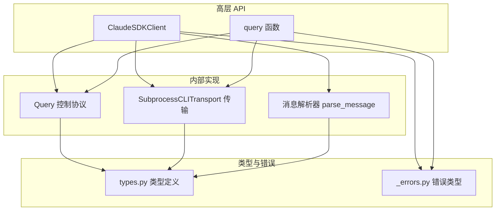
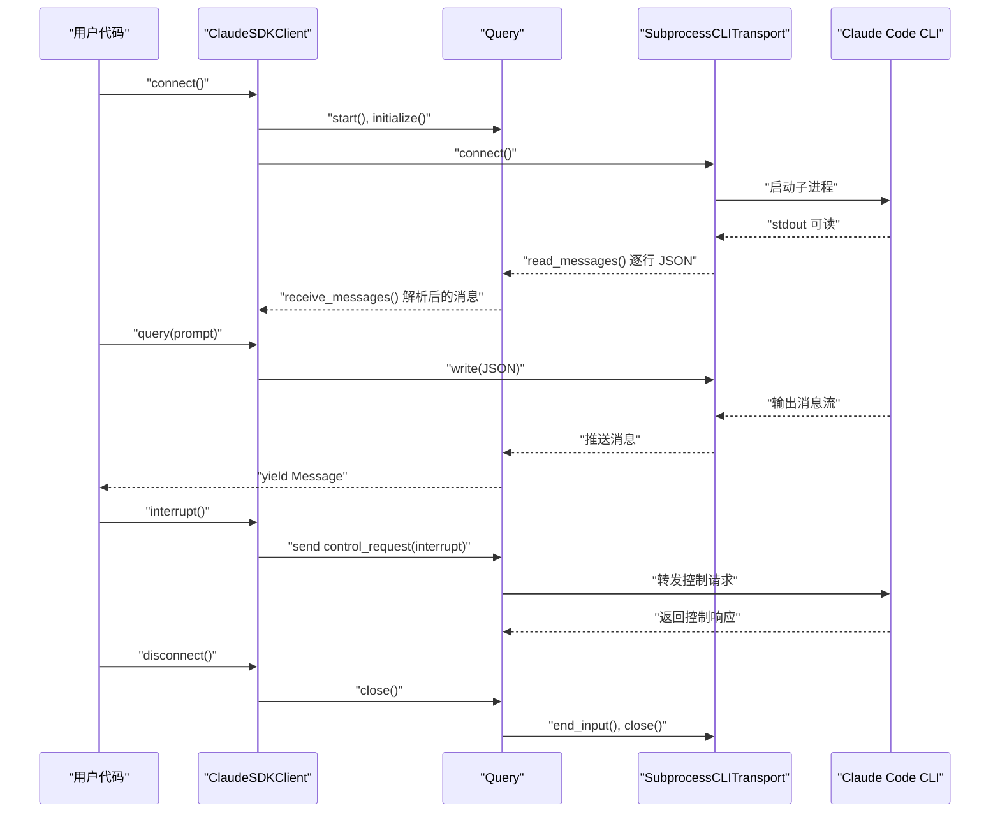
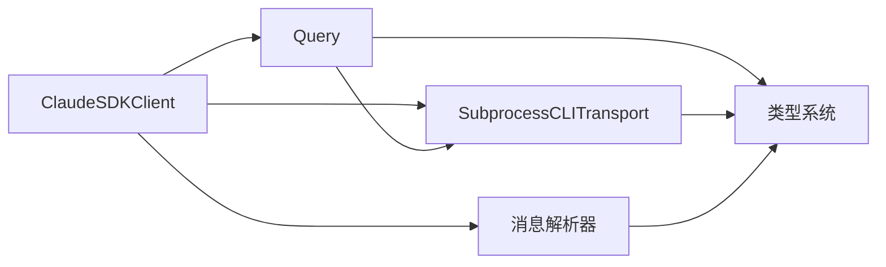
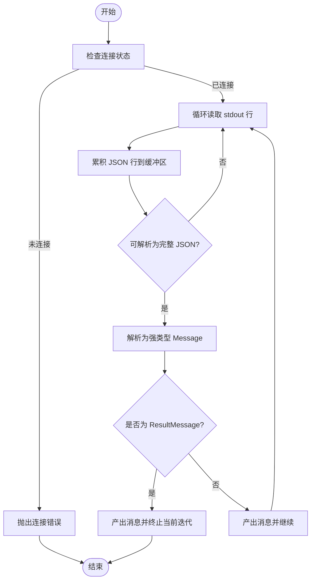
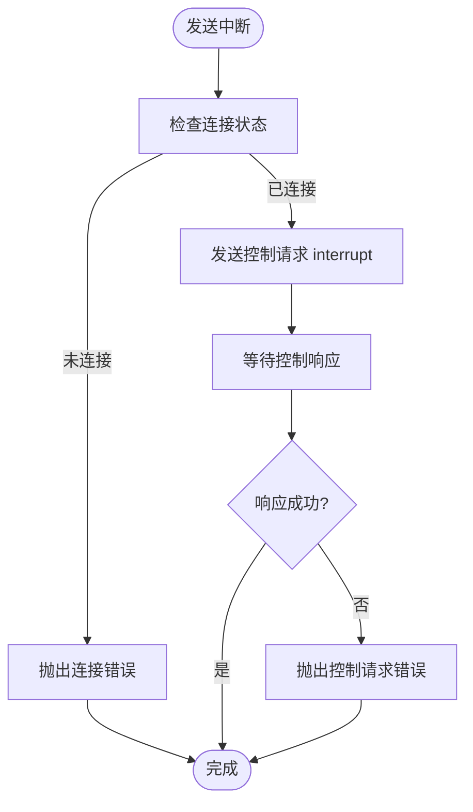
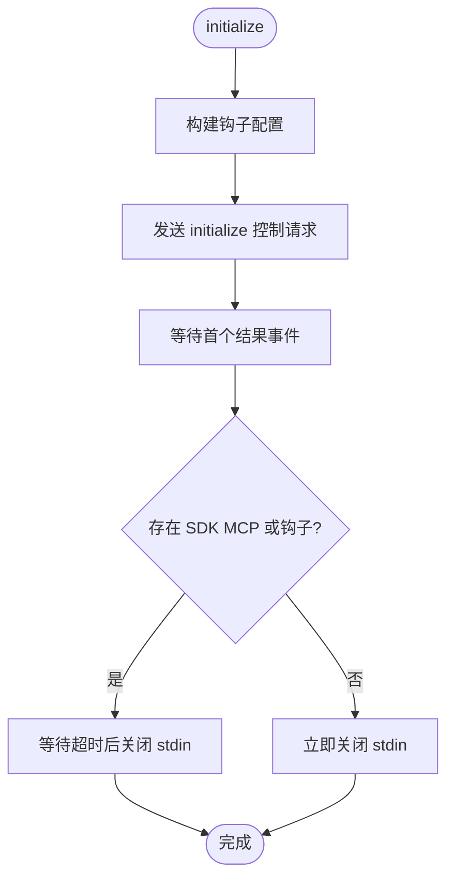
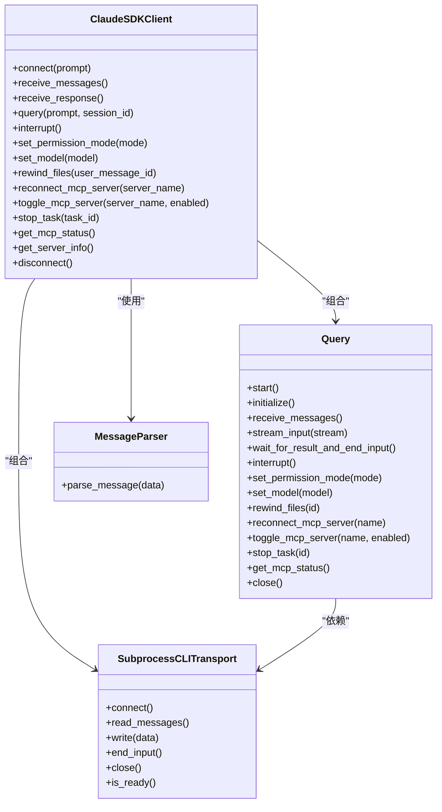

# 客户端功能

<cite>
**本文引用的文件**
- [client.py](file://src/claude_agent_sdk/client.py)
- [query.py](file://src/claude_agent_sdk/query.py)
- [_internal/client.py](file://src/claude_agent_sdk/_internal/client.py)
- [_internal/query.py](file://src/claude_agent_sdk/_internal/query.py)
- [_internal/message_parser.py](file://src/claude_agent_sdk/_internal/message_parser.py)
- [_internal/transport/subprocess_cli.py](file://src/claude_agent_sdk/_internal/transport/subprocess_cli.py)
- [types.py](file://src/claude_agent_sdk/types.py)
- [_errors.py](file://src/claude_agent_sdk/_errors.py)
- [streaming_mode.py](file://examples/streaming_mode.py)
- [include_partial_messages.py](file://examples/include_partial_messages.py)
- [quick_start.py](file://examples/quick_start.py)
- [test_client.py](file://tests/test_client.py)
</cite>

## 目录
1. [简介](#简介)
2. [项目结构](#项目结构)
3. [核心组件](#核心组件)
4. [架构总览](#架构总览)
5. [详细组件分析](#详细组件分析)
6. [依赖分析](#依赖分析)
7. [性能考虑](#性能考虑)
8. [故障排查指南](#故障排查指南)
9. [结论](#结论)
10. [附录](#附录)

## 简介
本文件系统性阐述 Claude Agent SDK 的客户端功能，重点围绕 ClaudeSDKClient 类的设计与实现，覆盖以下主题：
- 双向交互能力与会话管理机制
- 客户端初始化、连接建立与生命周期管理
- 实时消息处理（接收、解析、响应）
- 中断支持（发送中断信号与处理中断状态）
- 使用示例（创建、发送消息、接收响应、关闭连接）
- 异步编程模式与并发处理最佳实践
- 错误处理、重连机制与性能优化建议

## 项目结构
该 SDK 将“高层 API”与“内部实现”分层组织：
- 高层 API：对外暴露 ClaudeSDKClient、query 等入口
- 内部实现：Query 控制协议、SubprocessCLITransport 传输层、消息解析器等
- 类型定义：Message、ContentBlock、MCP 状态等类型
- 示例与测试：演示不同使用场景与验证行为

图表来源
- [client.py:1-500](file://src/claude_agent_sdk/client.py#L1-L500)
- [query.py:1-127](file://src/claude_agent_sdk/query.py#L1-L127)
- [_internal/query.py:1-679](file://src/claude_agent_sdk/_internal/query.py#L1-L679)
- [_internal/transport/subprocess_cli.py:1-630](file://src/claude_agent_sdk/_internal/transport/subprocess_cli.py#L1-L630)
- [_internal/message_parser.py:1-251](file://src/claude_agent_sdk/_internal/message_parser.py#L1-L251)
- [types.py:1-800](file://src/claude_agent_sdk/types.py#L1-L800)
- [_errors.py:1-57](file://src/claude_agent_sdk/_errors.py#L1-L57)

章节来源
- [client.py:1-500](file://src/claude_agent_sdk/client.py#L1-L500)
- [query.py:1-127](file://src/claude_agent_sdk/query.py#L1-L127)

## 核心组件
- ClaudeSDKClient：面向用户的主类，提供双向交互、会话管理、中断控制、模型切换、MCP 管理等能力
- Query：在传输之上实现控制协议（工具权限、钩子回调、MCP 消息桥接、控制请求/响应）
- SubprocessCLITransport：基于 anyio 的子进程传输，负责 CLI 启动、stdin/stdout/stderr 流读写与版本检查
- 消息解析器：将 CLI 输出的原始 JSON 对象解析为强类型 Message 对象
- 类型系统：Message、ContentBlock、McpStatusResponse 等类型定义
- 错误体系：CLIConnectionError、ProcessError、CLIJSONDecodeError、MessageParseError 等

章节来源
- [client.py:21-500](file://src/claude_agent_sdk/client.py#L21-L500)
- [_internal/query.py:53-679](file://src/claude_agent_sdk/_internal/query.py#L53-L679)
- [_internal/transport/subprocess_cli.py:33-630](file://src/claude_agent_sdk/_internal/transport/subprocess_cli.py#L33-L630)
- [_internal/message_parser.py:29-251](file://src/claude_agent_sdk/_internal/message_parser.py#L29-L251)
- [types.py:766-800](file://src/claude_agent_sdk/types.py#L766-L800)
- [_errors.py:6-57](file://src/claude_agent_sdk/_errors.py#L6-L57)

## 架构总览
ClaudeSDKClient 通过内部 Query 与 SubprocessCLITransport 建立双向通信：
- 连接阶段：创建/选择传输，启动 CLI 子进程，初始化控制协议
- 交互阶段：发送用户消息或流式输入；后台任务持续读取 stdout 并解析消息；处理控制请求（工具权限、钩子、MCP）
- 生命周期：上下文管理器自动 connect/disconnect；Query 维护任务组与内存通道

图表来源
- [client.py:94-185](file://src/claude_agent_sdk/client.py#L94-L185)
- [_internal/query.py:165-235](file://src/claude_agent_sdk/_internal/query.py#L165-L235)
- [_internal/transport/subprocess_cli.py:335-411](file://src/claude_agent_sdk/_internal/transport/subprocess_cli.py#L335-L411)

## 详细组件分析

### ClaudeSDKClient 设计与实现
- 初始化与连接
  - 支持自定义 Transport 或默认使用 SubprocessCLITransport
  - 自动设置环境变量以标识 SDK 入口
  - 权限模式校验：当启用 can_use_tool 回调时，要求 prompt 为 AsyncIterable，并互斥 permission_prompt_tool_name
  - 提取 SDK MCP 服务器配置，用于初始化时注入
  - 计算初始化超时时间（从环境变量读取），确保 MCP 服务器有足够时间就绪
- 会话与消息
  - receive_messages：消费 Query 的消息流，解析为强类型 Message
  - receive_response：便捷迭代器，遇到 ResultMessage 即终止
  - query：支持字符串与 AsyncIterable 两种输入；字符串转为用户消息；流式输入按条写入
- 控制与管理
  - interrupt：发送中断控制请求
  - set_permission_mode / set_model：动态调整权限模式与模型
  - rewind_files / reconnect_mcp_server / toggle_mcp_server / stop_task：文件回溯、MCP 重连/启停、任务停止
  - get_mcp_status / get_server_info：查询 MCP 状态与服务端初始化信息
- 生命周期
  - 上下文管理器自动 connect/disconnect
  - 内部维护持久 anyio 任务组，保证消息读取与控制请求处理的并发性

章节来源
- [client.py:62-185](file://src/claude_agent_sdk/client.py#L62-L185)
- [client.py:186-499](file://src/claude_agent_sdk/client.py#L186-L499)

### Query 控制协议
- 职责
  - 启动后台任务读取传输消息，路由到控制请求/响应或 SDK 消息流
  - 处理 can_use_tool 工具权限请求、钩子回调、SDK MCP 消息桥接
  - 发送控制请求（interrupt、set_permission_mode、set_model、rewind_files、mcp_reconnect/toggle、stop_task）并等待响应
  - 管理内存通道与任务组，确保流式输入完成后正确关闭 stdin
- 关键点
  - 控制请求/响应采用 request_id 映射，支持超时与错误传播
  - SDK MCP 服务器方法映射（initialize、tools/list、tools/call、notifications/initialized）
  - 流关闭策略：若存在 SDK MCP 或钩子，等待首个结果后关闭 stdin，否则立即关闭

章节来源
- [_internal/query.py:53-679](file://src/claude_agent_sdk/_internal/query.py#L53-L679)

### SubprocessCLITransport 传输层
- 职责
  - 启动 Claude Code CLI 子进程，合并环境变量，设置工作目录与调试输出
  - 读取 stdout 行式 JSON，累积缓冲区并解析消息；限制最大缓冲大小
  - 写入 stdin（带锁避免竞态）；stderr 可选管道化并回调
  - 版本检查（可禁用），进程退出码处理
- 关键点
  - 通过 anyio 的 TextReceiveStream/TextSendStream 抽象流式读写
  - 写入前进行就绪状态与进程存活检查，失败时抛出 CLIConnectionError
  - 支持 end_input 优雅关闭输入流

章节来源
- [_internal/transport/subprocess_cli.py:33-630](file://src/claude_agent_sdk/_internal/transport/subprocess_cli.py#L33-L630)

### 消息解析器
- 职责
  - 将 CLI 输出的原始字典解析为强类型 Message（UserMessage、AssistantMessage、SystemMessage、ResultMessage、StreamEvent、Task* 等）
  - 对未知类型消息进行兼容性跳过，避免因 CLI 新字段导致 SDK 崩溃
- 关键点
  - 对 content blocks 进行细分（文本、思考、工具调用、工具结果）
  - 对系统消息按 subtype 分派到具体类型（task_started/progress/notification 等）

章节来源
- [_internal/message_parser.py:29-251](file://src/claude_agent_sdk/_internal/message_parser.py#L29-L251)

### 类型系统与错误处理
- 类型系统
  - Message 与 ContentBlock：统一的消息内容结构
  - McpStatusResponse/McpServerStatus：MCP 服务器状态
  - Hook 输入/输出类型：PreToolUse、PostToolUse、PostToolUseFailure、UserPromptSubmit、Stop、Subagent*、PermissionRequest 等
- 错误处理
  - CLIConnectionError：无法连接 CLI 或进程未就绪
  - CLINotFoundError：CLI 二进制缺失
  - ProcessError：CLI 进程异常退出
  - CLIJSONDecodeError：JSON 解码失败或缓冲区溢出
  - MessageParseError：消息结构不合法

章节来源
- [types.py:766-800](file://src/claude_agent_sdk/types.py#L766-L800)
- [_errors.py:6-57](file://src/claude_agent_sdk/_errors.py#L6-L57)

## 依赖分析
- ClaudeSDKClient 依赖
  - Query：控制协议与消息流管理
  - SubprocessCLITransport：底层 I/O 与 CLI 交互
  - 消息解析器：将原始 JSON 转换为强类型对象
  - 类型系统：Message、ContentBlock、McpStatusResponse 等
- Query 依赖
  - Transport 接口：抽象传输层
  - mcp.types：SDK MCP 请求/响应类型
  - anyio：任务组、内存通道、锁
- 传输层依赖
  - anyio：进程、流、锁
  - subprocess：启动 CLI 子进程

图表来源
- [client.py:94-185](file://src/claude_agent_sdk/client.py#L94-L185)
- [_internal/query.py:53-120](file://src/claude_agent_sdk/_internal/query.py#L53-L120)
- [_internal/transport/subprocess_cli.py:33-63](file://src/claude_agent_sdk/_internal/transport/subprocess_cli.py#L33-L63)

章节来源
- [client.py:94-185](file://src/claude_agent_sdk/client.py#L94-L185)
- [_internal/query.py:53-120](file://src/claude_agent_sdk/_internal/query.py#L53-L120)
- [_internal/transport/subprocess_cli.py:33-63](file://src/claude_agent_sdk/_internal/transport/subprocess_cli.py#L33-L63)

## 性能考虑
- 流式输入与并发
  - 使用 anyio 任务组并行读取消息与流式写入，避免阻塞
  - 流关闭策略：在存在 SDK MCP 或钩子时等待首个结果后再关闭 stdin，减少不必要的等待
- 缓冲与超时
  - stdout JSON 解析采用缓冲累积与最大缓冲限制，防止内存膨胀
  - 控制请求默认超时可配置，初始化请求使用更长超时以适配 MCP 服务器启动
- I/O 优化
  - 写入操作加锁，避免与关闭竞态
  - stderr 可选管道化，降低主线程阻塞
- 会话与 MCP
  - 仅在需要时启用 MCP 服务器，减少额外开销
  - 使用 get_mcp_status 动态监控状态，必要时重连或禁用

[本节为通用指导，无需特定文件引用]

## 故障排查指南
- 连接失败
  - CLI 未安装或路径不正确：检查 CLAUDE_CODE_ENTRYPOINT 与 CLI 可执行路径
  - 工作目录不存在：确认 cwd 设置正确
  - 版本过低：查看版本检查警告
- 进程异常退出
  - 检查 stderr 输出与 ProcessError 的 exit_code
- JSON 解码错误
  - CLIJSONDecodeError：增大 max_buffer_size 或检查 CLI 输出格式
- 消息解析失败
  - MessageParseError：确认消息结构是否符合预期
- 中断无效
  - 必须在消费消息的同时发送中断；确保 receive_messages/receive_response 正在运行
- MCP 服务器问题
  - 使用 get_mcp_status 查看状态，必要时 reconnect_mcp_server 或 toggle_mcp_server

章节来源
- [_errors.py:6-57](file://src/claude_agent_sdk/_errors.py#L6-L57)
- [_internal/transport/subprocess_cli.py:587-626](file://src/claude_agent_sdk/_internal/transport/subprocess_cli.py#L587-L626)
- [_internal/query.py:532-534](file://src/claude_agent_sdk/_internal/query.py#L532-L534)

## 结论
ClaudeSDKClient 通过 Query 与 SubprocessCLITransport 构建了稳定的双向交互框架，具备：
- 实时消息处理与强类型解析
- 完整的控制协议支持（工具权限、钩子、MCP）
- 会话管理与生命周期控制
- 中断与动态配置能力
配合合理的异步并发与错误处理策略，可在复杂交互场景中稳定运行。

[本节为总结性内容，无需特定文件引用]

## 附录

### 使用示例与最佳实践

- 基础用法（上下文管理器）
  - 创建客户端并自动连接，发送消息，接收响应，自动断开
  - 参考：[streaming_mode.py:63-71](file://examples/streaming_mode.py#L63-L71)

- 多轮对话
  - 使用 receive_response 辅助方法，每轮结束后自动终止
  - 参考：[streaming_mode.py:78-93](file://examples/streaming_mode.py#L78-L93)

- 并发收发
  - 后台任务持续消费消息，同时发送新消息，适合实时 UI
  - 参考：[streaming_mode.py:102-129](file://examples/streaming_mode.py#L102-L129)

- 中断支持
  - 在消费消息的同时发送 interrupt，需保持消息消费任务活跃
  - 参考：[streaming_mode.py:138-173](file://examples/streaming_mode.py#L138-L173)

- 部分消息流（增量更新）
  - 开启 include_partial_messages，接收 StreamEvent 与常规消息混合
  - 参考：[include_partial_messages.py:28-56](file://examples/include_partial_messages.py#L28-L56)

- 异步迭代提示流
  - 使用 AsyncIterable 作为 prompt，逐条发送并接收多轮响应
  - 参考：[streaming_mode.py:281-293](file://examples/streaming_mode.py#L281-L293)

- 错误处理
  - 使用 CLIConnectionError、ProcessError 等进行分类处理
  - 参考：[streaming_mode.py:425-464](file://examples/streaming_mode.py#L425-L464)

- 与 query 函数对比
  - query 适用于一次性、无状态查询；ClaudeSDKClient 适用于交互式、有状态会话
  - 参考：[query.py:12-127](file://src/claude_agent_sdk/query.py#L12-L127)

### 关键流程图：消息接收与解析

图表来源
- [_internal/transport/subprocess_cli.py:519-571](file://src/claude_agent_sdk/_internal/transport/subprocess_cli.py#L519-L571)
- [_internal/message_parser.py:29-251](file://src/claude_agent_sdk/_internal/message_parser.py#L29-L251)
- [_internal/query.py:648-657](file://src/claude_agent_sdk/_internal/query.py#L648-L657)

### 关键流程图：中断发送与处理

图表来源
- [client.py:228-233](file://src/claude_agent_sdk/client.py#L228-L233)
- [_internal/query.py:536-538](file://src/claude_agent_sdk/_internal/query.py#L536-L538)

### 关键流程图：初始化与流关闭策略

图表来源
- [_internal/query.py:119-163](file://src/claude_agent_sdk/_internal/query.py#L119-L163)
- [_internal/query.py:614-631](file://src/claude_agent_sdk/_internal/query.py#L614-L631)

### 类图：核心类型与关系

图表来源
- [client.py:21-499](file://src/claude_agent_sdk/client.py#L21-L499)
- [_internal/query.py:53-679](file://src/claude_agent_sdk/_internal/query.py#L53-L679)
- [_internal/transport/subprocess_cli.py:33-630](file://src/claude_agent_sdk/_internal/transport/subprocess_cli.py#L33-L630)
- [_internal/message_parser.py:29-251](file://src/claude_agent_sdk/_internal/message_parser.py#L29-L251)