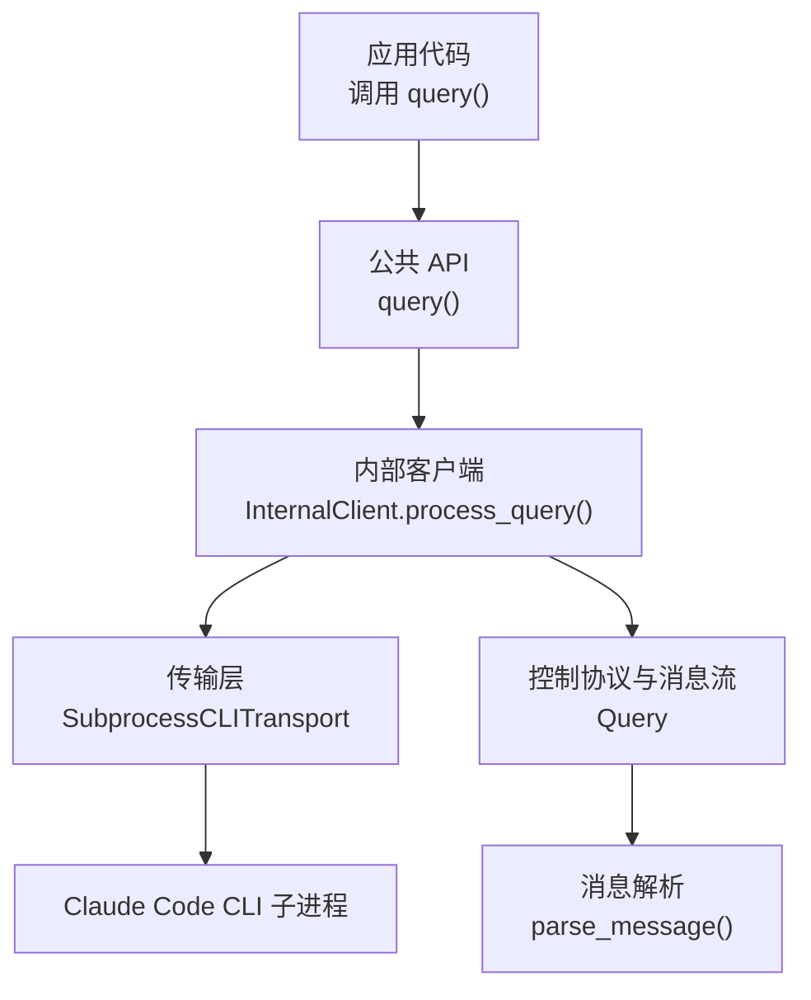
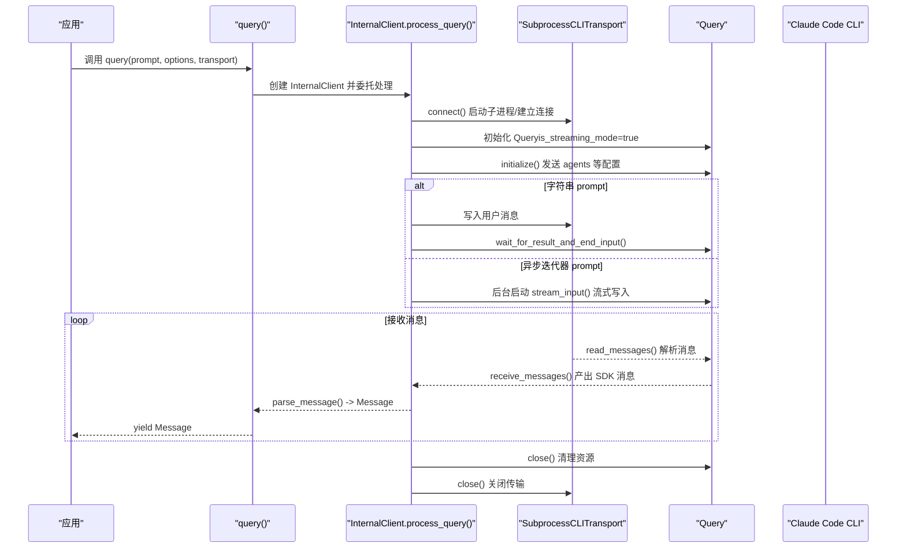
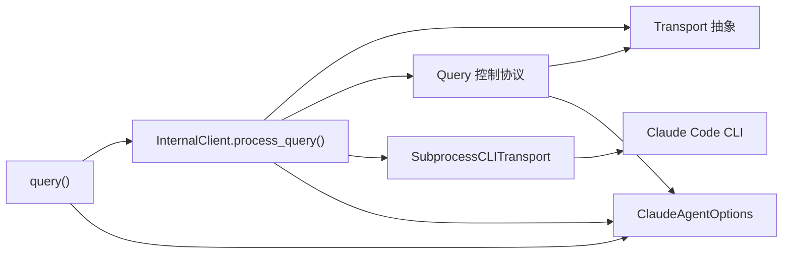
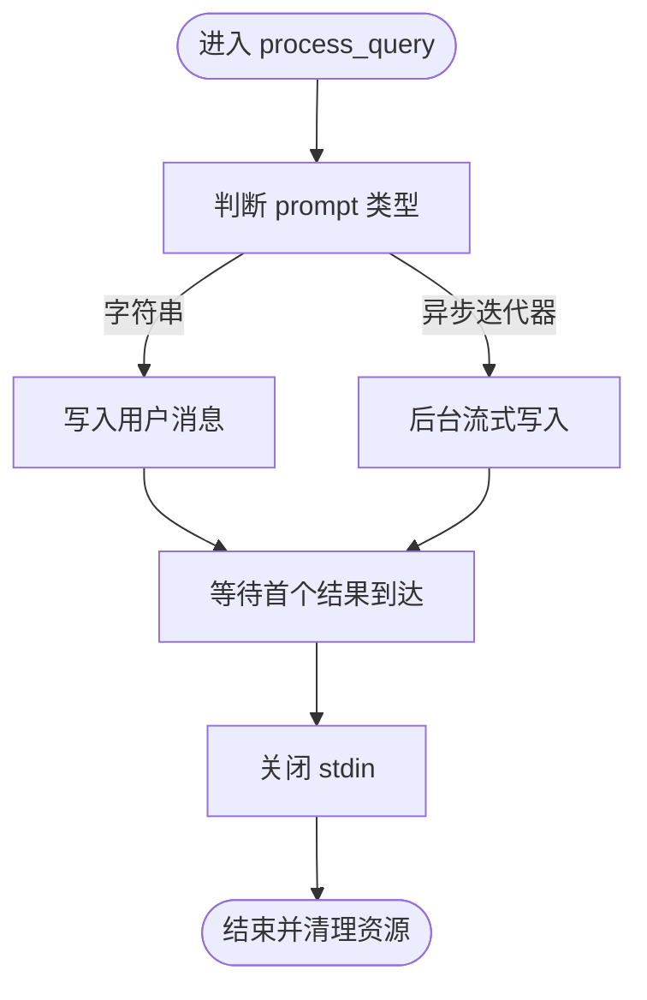

# 查询功能

<cite>
**本文引用的文件**
- [query.py](file://src/claude_agent_sdk/query.py)
- [_internal/query.py](file://src/claude_agent_sdk/_internal/query.py)
- [_internal/client.py](file://src/claude_agent_sdk/_internal/client.py)
- [client.py](file://src/claude_agent_sdk/client.py)
- [types.py](file://src/claude_agent_sdk/types.py)
- [_internal/transport/__init__.py](file://src/claude_agent_sdk/_internal/transport/__init__.py)
- [_internal/transport/subprocess_cli.py](file://src/claude_agent_sdk/_internal/transport/subprocess_cli.py)
- [quick_start.py](file://examples/quick_start.py)
- [streaming_mode.py](file://examples/streaming_mode.py)
- [include_partial_messages.py](file://examples/include_partial_messages.py)
- [tools_option.py](file://examples/tools_option.py)
- [test_query.py](file://tests/test_query.py)
</cite>

## 目录
1. [简介](#简介)
2. [项目结构](#项目结构)
3. [核心组件](#核心组件)
4. [架构总览](#架构总览)
5. [详细组件分析](#详细组件分析)
6. [依赖分析](#依赖分析)
7. [性能考量](#性能考量)
8. [故障排查指南](#故障排查指南)
9. [结论](#结论)
10. [附录：完整用法示例与最佳实践](#附录完整用法示例与最佳实践)

## 简介
本章节面向希望使用 Claude Agent SDK 进行“一次性查询”或“单向流式交互”的开发者，系统讲解 query() 函数的设计理念、参数模型、返回值处理、与 ClaudeSDKClient 的差异与选型建议，并提供错误处理、性能优化与最佳实践指导。query() 适合无需会话状态、不需要中断与后续追问的场景；若需要双向对话、实时中断、动态消息发送与会话管理，请改用 ClaudeSDKClient。

## 项目结构
围绕查询功能的关键模块如下：
- 公共 API 层：对外导出的 query() 位于 src/claude_agent_sdk/query.py，负责参数校验、默认值设置、入口调度。
- 内部实现层：内部客户端 InternalClient 在 src/claude_agent_sdk/_internal/client.py 中，封装 Transport、Query 控制协议与消息解析。
- 控制协议与消息流：Query 类在 src/claude_agent_sdk/_internal/query.py 中，负责控制请求/响应路由、工具权限回调、Hook 回调、MCP 桥接、消息流接收与关闭策略。
- 传输抽象与实现：Transport 抽象接口在 src/claude_agent_sdk/_internal/transport/__init__.py，SubprocessCLITransport 实现在 src/claude_agent_sdk/_internal/transport/subprocess_cli.py，负责与 Claude Code CLI 的进程通信。
- 类型与选项：types.py 定义了 ClaudeAgentOptions、Message 等类型，支撑 query() 的参数与返回值。
- 示例与测试：examples 下提供快速开始、流式模式、部分消息流等示例；tests 下有针对 stdin 生命周期与 SDK MCP/Hook 场景的测试。

图表来源
- [query.py:12-127](file://src/claude_agent_sdk/query.py#L12-L127)
- [_internal/client.py:44-146](file://src/claude_agent_sdk/_internal/client.py#L44-L146)
- [_internal/query.py:53-679](file://src/claude_agent_sdk/_internal/query.py#L53-L679)
- [_internal/transport/subprocess_cli.py:33-630](file://src/claude_agent_sdk/_internal/transport/subprocess_cli.py#L33-L630)

章节来源
- [query.py:12-127](file://src/claude_agent_sdk/query.py#L12-L127)
- [_internal/client.py:44-146](file://src/claude_agent_sdk/_internal/client.py#L44-L146)
- [_internal/query.py:53-679](file://src/claude_agent_sdk/_internal/query.py#L53-L679)
- [_internal/transport/subprocess_cli.py:33-630](file://src/claude_agent_sdk/_internal/transport/subprocess_cli.py#L33-L630)

## 核心组件
- query()：对外暴露的一次性查询入口，支持字符串 prompt 与异步迭代器 prompt（流式模式），返回 AsyncIterator[Message]。
- InternalClient.process_query()：内部实现，负责构建 Transport、初始化 Query、处理输入 prompt、解析并产出 Message。
- Query：控制协议与消息流核心，负责：
  - 初始化握手（initialize）以发送 agents 等配置；
  - 处理控制请求（如 can_use_tool、hook_callback、mcp_message 等）；
  - 接收并分发 SDK 消息（非控制消息）；
  - 维护 stdin 关闭时机（等待首个结果后再关闭，确保与 SDK MCP/Hook 的双向通信）。
- Transport 抽象与 SubprocessCLITransport：抽象传输接口，具体实现通过子进程与 Claude Code CLI 通信，负责连接、读写、stderr 转发、版本检查、缓冲区限制与进程生命周期管理。
- ClaudeAgentOptions：查询配置项集合，涵盖系统提示、工具集、权限模式、MCP 服务器、Hook、工作目录、CLI 路径、输出格式、思维深度、努力等级、插件、沙箱、文件检查点等。

章节来源
- [query.py:12-127](file://src/claude_agent_sdk/query.py#L12-L127)
- [_internal/client.py:44-146](file://src/claude_agent_sdk/_internal/client.py#L44-L146)
- [_internal/query.py:53-679](file://src/claude_agent_sdk/_internal/query.py#L53-L679)
- [_internal/transport/__init__.py:8-69](file://src/claude_agent_sdk/_internal/transport/__init__.py#L8-L69)
- [_internal/transport/subprocess_cli.py:33-630](file://src/claude_agent_sdk/_internal/transport/subprocess_cli.py#L33-L630)
- [types.py:1030-1099](file://src/claude_agent_sdk/types.py#L1030-L1099)

## 架构总览
下图展示了 query() 的端到端调用链路，从应用到 CLI 的数据流与控制协议交互。

图表来源
- [query.py:12-127](file://src/claude_agent_sdk/query.py#L12-L127)
- [_internal/client.py:44-146](file://src/claude_agent_sdk/_internal/client.py#L44-L146)
- [_internal/query.py:119-679](file://src/claude_agent_sdk/_internal/query.py#L119-L679)
- [_internal/transport/subprocess_cli.py:335-518](file://src/claude_agent_sdk/_internal/transport/subprocess_cli.py#L335-L518)

## 详细组件分析

### query() 函数设计与参数模型
- prompt 参数
  - 字符串：一次性发送用户消息，等待完整响应后结束输入。
  - 异步迭代器：持续向 CLI 写入消息，适用于“先发后收”的单向流式交互（注意：仍为单向，不支持后续追问）。
- options 参数（ClaudeAgentOptions）
  - 权限控制：permission_mode、permission_prompt_tool_name、allowed_tools、disallowed_tools、can_use_tool。
  - 工具与系统提示：tools、system_prompt、mcp_servers、hooks、agents、setting_sources。
  - 运行环境：cwd、cli_path、env、extra_args、max_buffer_size、stderr、debug_stderr、user。
  - 输出与行为：include_partial_messages、fork_session、output_format、thinking、effort、max_turns、max_budget_usd、model、fallback_model、plugins、sandbox、enable_file_checkpointing。
- transport 参数
  - 可选自定义传输实现，默认使用 SubprocessCLITransport。当提供自定义 Transport 时，query() 将直接使用该实现，不再自动选择默认传输。
- 返回值
  - AsyncIterator[Message]：逐条产出 SDK 消息，包括 AssistantMessage、UserMessage、SystemMessage、ResultMessage、StreamEvent、RateLimitEvent 等。应用侧应按需判断消息类型并消费。

章节来源
- [query.py:12-127](file://src/claude_agent_sdk/query.py#L12-L127)
- [types.py:1030-1099](file://src/claude_agent_sdk/types.py#L1030-L1099)

### InternalClient.process_query() 执行流程
- 参数校验与配置
  - 若设置了 can_use_tool，则要求 prompt 必须为异步迭代器，且不能同时设置 permission_prompt_tool_name，否则抛出异常。
  - 自动将 permission_prompt_tool_name 设为 "stdio" 以启用控制协议。
- 传输与 Query 初始化
  - 使用提供的 transport 或默认 SubprocessCLITransport 连接 CLI。
  - 提取 SDK MCP 服务器与 agents 配置，构造 Query（始终使用 is_streaming_mode=true）。
- 输入处理
  - 字符串 prompt：写入用户消息后，等待首个结果到达再关闭 stdin。
  - 异步迭代器 prompt：后台任务流式写入，同样等待首个结果后关闭 stdin。
- 消息产出
  - 通过 Query.receive_messages() 接收 SDK 消息，parse_message() 解析为强类型 Message，逐条 yield 给调用方。
- 资源清理
  - finally 块中关闭 Query 与 Transport，确保资源释放。

章节来源
- [_internal/client.py:44-146](file://src/claude_agent_sdk/_internal/client.py#L44-L146)

### Query 控制协议与消息流
- 初始化与握手
  - initialize() 发送包含 hooks 与 agents 的初始化请求，等待 CLI 响应。
- 控制请求处理
  - can_use_tool：工具使用前的权限决策回调，返回允许/拒绝及可选更新。
  - hook_callback：Hook 触发回调，支持同步/异步输出控制。
  - mcp_message：SDK MCP 服务桥接，转发 JSON-RPC 请求并返回结果。
  - 其他控制命令：interrupt、set_permission_mode、set_model、rewind_files、mcp_reconnect、mcp_toggle、stop_task。
- 消息接收与关闭策略
  - receive_messages() 逐条产出 SDK 消息，遇到 "end" 或 "error" 特殊消息时终止或抛错。
  - wait_for_result_and_end_input()：若存在 SDK MCP 服务器或 Hook，等待首个结果到达后再关闭 stdin，保证控制请求能被正确处理。
  - stream_input()：异步迭代器模式下，持续写入消息，结束后触发等待与关闭。
- 错误处理
  - 控制请求超时、致命错误、CLI 进程退出码异常等均通过异常或 "error" 消息上抛。

章节来源
- [_internal/query.py:119-679](file://src/claude_agent_sdk/_internal/query.py#L119-L679)

### 传输层：Transport 抽象与 SubprocessCLITransport
- Transport 抽象
  - connect()/write()/read_messages()/close()/is_ready()/end_input()，屏蔽底层实现细节。
- SubprocessCLITransport
  - 启动 Claude Code CLI 子进程，合并环境变量，设置工作目录与用户身份。
  - 构建 CLI 命令参数，覆盖系统提示、工具集、权限模式、MCP 配置、思维深度、输出格式、插件、沙箱、预算、模型等。
  - 读取 stdout 流并解析 JSON 行，stderr 可选管道至回调或调试输出。
  - 写入线程安全，避免竞态；进程退出码检测与错误包装。
  - 版本检查与最小版本警告；最大缓冲区限制防止内存膨胀。

章节来源
- [_internal/transport/__init__.py:8-69](file://src/claude_agent_sdk/_internal/transport/__init__.py#L8-L69)
- [_internal/transport/subprocess_cli.py:33-630](file://src/claude_agent_sdk/_internal/transport/subprocess_cli.py#L33-L630)

### 与 ClaudeSDKClient 的区别与选型
- query()：一次性/单向流式交互，无会话状态，不可中断，适合简单问题、批量处理、自动化脚本。
- ClaudeSDKClient：双向交互，维护会话上下文，支持中断、动态消息发送、MCP 状态查询、任务控制、文件回溯等高级能力，适合聊天界面、探索式调试、实时应用。
- 选择建议
  - 若只需“问-答”且无需后续追问或中断，优先 query()。
  - 若需要实时交互、工具权限动态调整、MCP 服务器管理、任务控制或文件回溯，请使用 ClaudeSDKClient。

章节来源
- [query.py:18-44](file://src/claude_agent_sdk/query.py#L18-L44)
- [client.py:21-60](file://src/claude_agent_sdk/client.py#L21-L60)

## 依赖分析
- query() 依赖 InternalClient.process_query()，后者依赖 Transport、Query、消息解析器。
- Query 依赖 Transport 读写、控制协议类型、Hook 与 MCP 服务。
- SubprocessCLITransport 依赖 anyio、CLI 路径查找、版本检查、stderr 回调、进程生命周期管理。
- ClaudeAgentOptions 作为统一配置载体，贯穿 query()、InternalClient、Query、Transport 的构建与使用。

图表来源
- [query.py:12-127](file://src/claude_agent_sdk/query.py#L12-L127)
- [_internal/client.py:44-146](file://src/claude_agent_sdk/_internal/client.py#L44-L146)
- [_internal/query.py:53-679](file://src/claude_agent_sdk/_internal/query.py#L53-L679)
- [_internal/transport/subprocess_cli.py:33-630](file://src/claude_agent_sdk/_internal/transport/subprocess_cli.py#L33-L630)
- [types.py:1030-1099](file://src/claude_agent_sdk/types.py#L1030-L1099)

## 性能考量
- 流式输入与输出
  - 异步迭代器 prompt 支持边写边读，减少整体延迟；但需确保消息消费及时，以便 Query 正确处理控制请求并适时关闭 stdin。
- 缓冲区与内存
  - SubprocessCLITransport 对 stdout JSON 行进行缓冲解析，提供 max_buffer_size 限制，避免超大消息导致内存占用过高。
- 进程与 I/O
  - 写入操作加锁，避免与关闭竞态；stderr 管道仅在需要时开启，降低额外 I/O 开销。
- CLI 版本与特性
  - SubprocessCLITransport 在连接时进行版本检查，过低版本可能影响某些新特性可用性。

章节来源
- [_internal/transport/subprocess_cli.py:515-586](file://src/claude_agent_sdk/_internal/transport/subprocess_cli.py#L515-L586)
- [_internal/transport/subprocess_cli.py:335-411](file://src/claude_agent_sdk/_internal/transport/subprocess_cli.py#L335-L411)

## 故障排查指南
- CLI 未找到或路径错误
  - 现象：抛出 CLINotFoundError。
  - 处理：确认 CLI 安装路径，或通过 ClaudeAgentOptions.cli_path 指定；也可使用内置打包 CLI。
- 工作目录不存在
  - 现象：抛出 CLIConnectionError，提示工作目录不存在。
  - 处理：修正 cwd 或创建对应目录。
- 进程已退出或返回码非零
  - 现象：抛出 ProcessError，包含退出码与 stderr 提示。
  - 处理：查看 stderr 输出定位问题；检查 CLI 参数与环境变量。
- 控制请求超时
  - 现象：Query._send_control_request 抛出超时异常。
  - 处理：检查 can_use_tool/hook/MCP 服务是否正常响应；适当增加等待时间或优化回调逻辑。
- JSON 解析失败或缓冲溢出
  - 现象：SDKJSONDecodeError，提示超出最大缓冲区大小。
  - 处理：减小单条消息体积或提高 max_buffer_size；检查 CLI 输出格式一致性。
- stdin 过早关闭导致控制请求丢失
  - 现象：SDK MCP/Hook 控制请求无法送达，或响应缺失。
  - 处理：确保使用异步迭代器 prompt 或在字符串 prompt 模式下及时消费消息，使 Query 能够等待首个结果后再关闭 stdin。

章节来源
- [_internal/transport/subprocess_cli.py:396-410](file://src/claude_agent_sdk/_internal/transport/subprocess_cli.py#L396-L410)
- [_internal/transport/subprocess_cli.py:572-586](file://src/claude_agent_sdk/_internal/transport/subprocess_cli.py#L572-L586)
- [_internal/query.py:347-393](file://src/claude_agent_sdk/_internal/query.py#L347-L393)
- [_internal/query.py:519-565](file://src/claude_agent_sdk/_internal/query.py#L519-L565)
- [test_query.py:114-197](file://tests/test_query.py#L114-L197)

## 结论
query() 为“一次性/单向流式”查询提供了简洁、可靠的 API，适合无需会话状态与中断能力的场景。其内部通过 InternalClient 与 Query 协同，借助 Transport 与 SubprocessCLITransport 与 CLI 交互，严格遵循控制协议与消息流规范。对于需要实时交互、工具权限动态调整、MCP 管理与任务控制的应用，请选择 ClaudeSDKClient。合理配置 ClaudeAgentOptions、关注 stdin 关闭时机与缓冲区限制，是获得稳定性能与良好体验的关键。

## 附录：完整用法示例与最佳实践

### 一、基础用法与示例路径
- 简单查询（字符串 prompt）
  - 示例路径：[quick_start.py:19](file://examples/quick_start.py#L19)
- 带选项查询（系统提示、工具、预算等）
  - 示例路径：[quick_start.py:36](file://examples/quick_start.py#L36)
- 流式模式（异步迭代器 prompt）
  - 示例路径：[streaming_mode.py:252-292](file://examples/streaming_mode.py#L252-L292)
- 自定义传输（实现 Transport 接口）
  - 示例路径：[query.py:99-113](file://src/claude_agent_sdk/query.py#L99-L113)
- 部分消息流（partial messages）
  - 示例路径：[include_partial_messages.py:30](file://examples/include_partial_messages.py#L30)
- 工具集配置
  - 示例路径：[tools_option.py:22](file://examples/tools_option.py#L22)

章节来源
- [quick_start.py:15-77](file://examples/quick_start.py#L15-L77)
- [streaming_mode.py:248-292](file://examples/streaming_mode.py#L248-L292)
- [query.py:99-113](file://src/claude_agent_sdk/query.py#L99-L113)
- [include_partial_messages.py:28-63](file://examples/include_partial_messages.py#L28-L63)
- [tools_option.py:16-112](file://examples/tools_option.py#L16-L112)

### 二、参数详解与最佳实践
- prompt
  - 字符串：适合一次性问答；注意及时消费消息，避免阻塞 CLI 控制请求。
  - 异步迭代器：适合“先发后收”的单向流式交互；确保消息消费及时，以便 Query 正确等待首个结果并关闭 stdin。
- options（ClaudeAgentOptions）
  - 权限与工具：优先使用 allowed_tools/disallowed_tools 与 tools/preset 精准控制；必要时配合 can_use_tool 实现细粒度权限决策。
  - 系统提示与模型：通过 system_prompt 与 model/fallback_model 调整输出风格与稳定性。
  - MCP 与 Hook：配置 mcp_servers 与 hooks 时，务必确保回调逻辑高效、可重入，避免阻塞控制通道。
  - 输出与行为：include_partial_messages 用于实时 UI；max_turns/max_budget_usd 用于成本与回合数控制；thinking/effort 控制生成深度。
  - 环境与路径：cwd/cli_path/env/extra_args 等根据运行环境定制；stderr 回调用于日志收集。
- transport
  - 默认 SubprocessCLITransport 已覆盖大多数场景；自定义传输需实现所有抽象方法，确保线程安全与资源清理。
- 返回值消费
  - 使用 AsyncIterator[Message] 逐条消费；根据消息类型分支处理（AssistantMessage、ResultMessage 等）；遇到 "end"/"error" 特殊消息时及时停止或抛错。

章节来源
- [types.py:1030-1099](file://src/claude_agent_sdk/types.py#L1030-L1099)
- [_internal/transport/__init__.py:8-69](file://src/claude_agent_sdk/_internal/transport/__init__.py#L8-L69)
- [_internal/query.py:648-679](file://src/claude_agent_sdk/_internal/query.py#L648-L679)

### 三、关键流程图：stdin 关闭时机
以下流程图展示 query() 在不同场景下的 stdin 关闭策略，确保 SDK MCP/Hook 控制请求得到正确处理。

图表来源
- [_internal/client.py:122-137](file://src/claude_agent_sdk/_internal/client.py#L122-L137)
- [_internal/query.py:614-631](file://src/claude_agent_sdk/_internal/query.py#L614-L631)
- [test_query.py:114-197](file://tests/test_query.py#L114-L197)