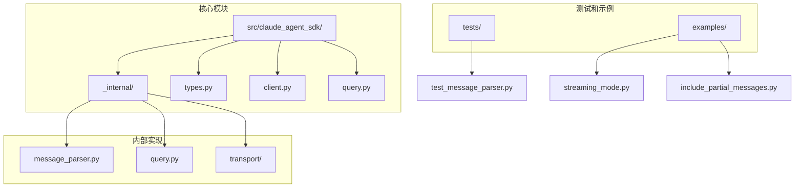
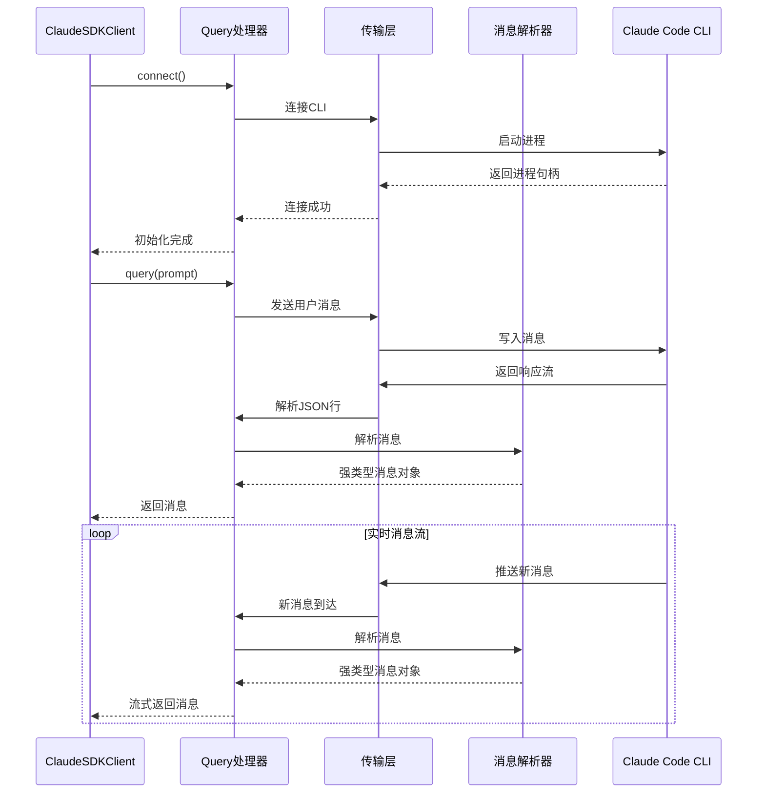
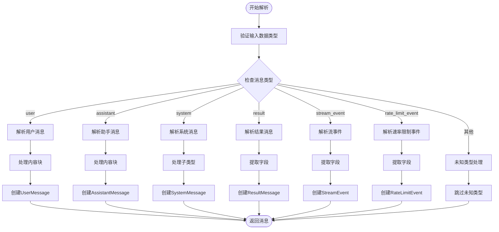
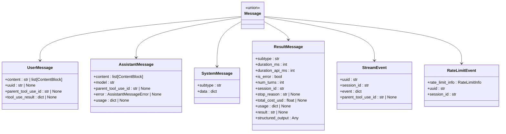
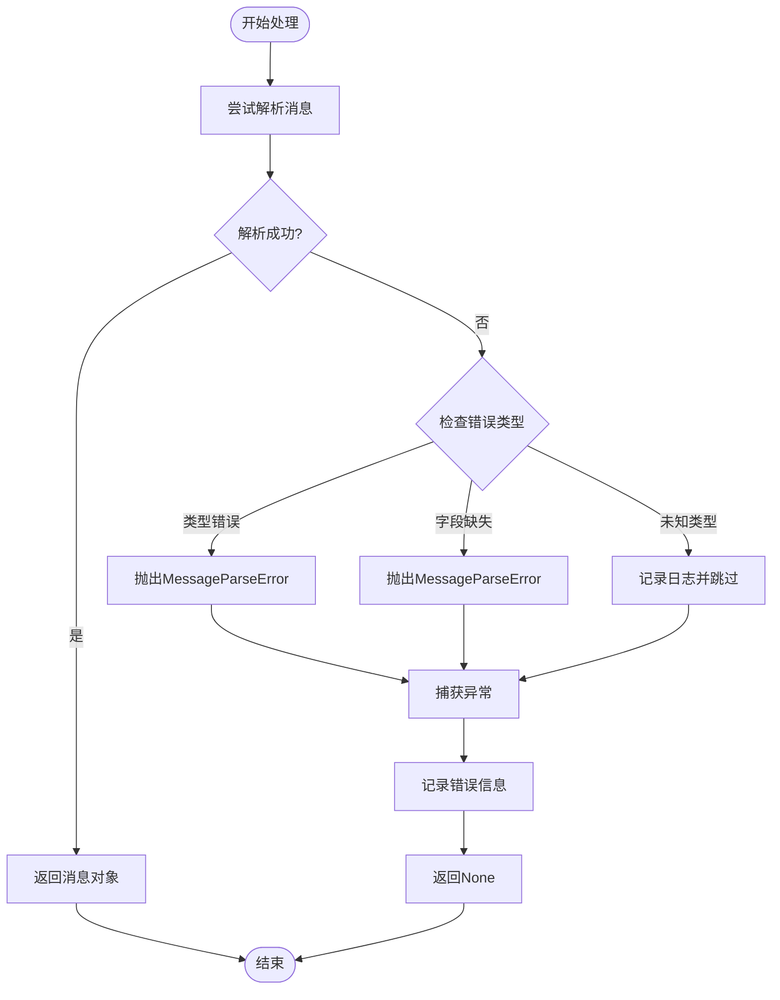
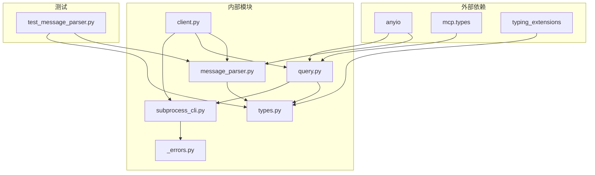
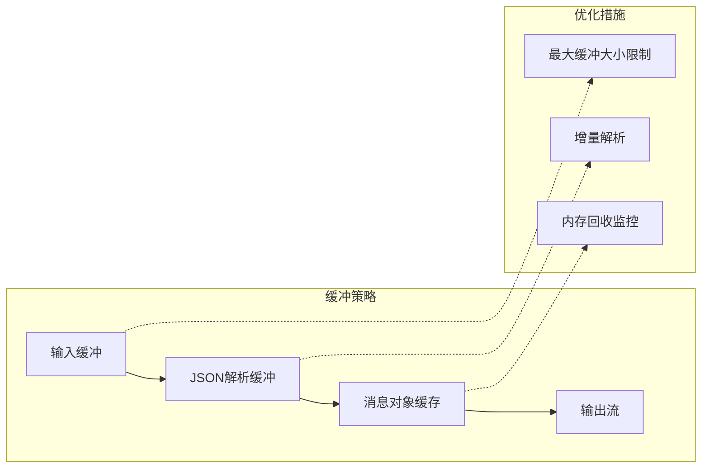

# 消息解析能力增强

<cite>
**本文档引用的文件**
- [message_parser.py](file://src/claude_agent_sdk/_internal/message_parser.py)
- [client.py](file://src/claude_agent_sdk/client.py)
- [types.py](file://src/claude_agent_sdk/types.py)
- [query.py](file://src/claude_agent_sdk/_internal/query.py)
- [_errors.py](file://src/claude_agent_sdk/_errors.py)
- [subprocess_cli.py](file://src/claude_agent_sdk/_internal/transport/subprocess_cli.py)
- [test_message_parser.py](file://tests/test_message_parser.py)
- [streaming_mode.py](file://examples/streaming_mode.py)
- [include_partial_messages.py](file://examples/include_partial_messages.py)
</cite>

## 目录
1. [简介](#简介)
2. [项目结构](#项目结构)
3. [核心组件](#核心组件)
4. [架构概览](#架构概览)
5. [详细组件分析](#详细组件分析)
6. [依赖关系分析](#依赖关系分析)
7. [性能考虑](#性能考虑)
8. [故障排除指南](#故障排除指南)
9. [结论](#结论)

## 简介

本文档深入分析了Claude Agent SDK Python项目中消息解析能力的增强实现。该项目提供了一个完整的Python SDK，用于与Claude Code CLI进行交互，支持双向、实时的对话流，并具备强大的消息解析和类型化处理能力。

消息解析能力的增强主要体现在以下几个方面：
- 支持多种消息类型的强类型解析
- 前向兼容性设计，能够处理未知消息类型
- 完善的错误处理和异常管理
- 流式消息处理和部分消息支持
- 丰富的消息内容块类型支持

## 项目结构

该项目采用模块化的架构设计，主要包含以下核心目录和文件：

**图表来源**
- [client.py:1-499](file://src/claude_agent_sdk/client.py#L1-499)
- [types.py:1-1204](file://src/claude_agent_sdk/types.py#L1-1204)

**章节来源**
- [client.py:1-499](file://src/claude_agent_sdk/client.py#L1-499)
- [types.py:1-1204](file://src/claude_agent_sdk/types.py#L1-1204)

## 核心组件

### 消息解析器 (Message Parser)

消息解析器是整个系统的核心组件，负责将CLI输出的原始数据转换为强类型的消息对象。它支持以下消息类型：

- **用户消息 (UserMessage)**: 包含文本内容和工具使用信息
- **助手消息 (AssistantMessage)**: 包含文本、思考过程和工具使用结果
- **系统消息 (SystemMessage)**: 包含任务状态信息
- **结果消息 (ResultMessage)**: 包含会话统计和成本信息
- **流事件 (StreamEvent)**: 支持部分消息流式更新
- **速率限制事件 (RateLimitEvent)**: 处理API速率限制状态

### 类型系统 (Type System)

项目提供了完整的类型定义系统，包括：

- **内容块类型**: 文本块、思考块、工具使用块、工具结果块
- **消息类型**: 强类型的消息类定义
- **配置选项**: ClaudeAgentOptions提供丰富的配置选项
- **错误类型**: 完整的错误处理体系

### 传输层 (Transport Layer)

支持多种传输方式，主要通过子进程CLI传输实现：

- **子进程CLI传输**: 使用Claude Code CLI作为后端
- **流式消息处理**: 支持实时消息流
- **缓冲区管理**: 智能的内存缓冲区管理

**章节来源**
- [message_parser.py:1-252](file://src/claude_agent_sdk/_internal/message_parser.py#L1-252)
- [types.py:734-958](file://src/claude_agent_sdk/types.py#L734-958)
- [subprocess_cli.py:1-632](file://src/claude_agent_sdk/_internal/transport/subprocess_cli.py#L1-632)

## 架构概览

**图表来源**
- [client.py:93-196](file://src/claude_agent_sdk/client.py#L93-196)
- [query.py:165-235](file://src/claude_agent_sdk/_internal/query.py#L165-235)
- [subprocess_cli.py:517-588](file://src/claude_agent_sdk/_internal/transport/subprocess_cli.py#L517-588)

## 详细组件分析

### 消息解析器深度分析

消息解析器实现了复杂的模式匹配和类型转换逻辑：

**图表来源**
- [message_parser.py:29-252](file://src/claude_agent_sdk/_internal/message_parser.py#L29-252)

#### 用户消息解析

用户消息解析支持多种内容块类型：
- **文本内容**: 简单的字符串内容
- **工具使用**: 工具调用请求
- **工具结果**: 工具执行结果
- **混合内容**: 多种内容块的组合

#### 助手消息解析

助手消息解析支持更复杂的内容结构：
- **文本块**: 标准回复内容
- **思考块**: Claude的内部思考过程
- **工具使用**: 分析过程中使用的工具
- **工具结果**: 工具执行的具体结果

#### 系统消息解析

系统消息解析支持任务生命周期管理：
- **任务开始**: 任务启动通知
- **任务进度**: 进度更新
- **任务通知**: 任务完成/失败/停止状态

**章节来源**
- [message_parser.py:29-252](file://src/claude_agent_sdk/_internal/message_parser.py#L29-252)
- [test_message_parser.py:23-739](file://tests/test_message_parser.py#L23-739)

### 类型系统设计

类型系统采用了现代Python的数据类和类型注解技术：

**图表来源**
- [types.py:770-958](file://src/claude_agent_sdk/types.py#L770-958)

### 错误处理机制

系统实现了完善的错误处理机制：

**图表来源**
- [message_parser.py:42-50](file://src/claude_agent_sdk/_internal/message_parser.py#L42-50)
- [message_parser.py:247-251](file://src/claude_agent_sdk/_internal/message_parser.py#L247-251)

**章节来源**
- [_errors.py:51-57](file://src/claude_agent_sdk/_errors.py#L51-57)
- [message_parser.py:42-50](file://src/claude_agent_sdk/_internal/message_parser.py#L42-50)

## 依赖关系分析

**图表来源**
- [client.py:1-18](file://src/claude_agent_sdk/client.py#L1-18)
- [query.py:1-26](file://src/claude_agent_sdk/_internal/query.py#L1-26)
- [subprocess_cli.py:1-25](file://src/claude_agent_sdk/_internal/transport/subprocess_cli.py#L1-25)

### 关键依赖关系

1. **anyio**: 提供异步I/O操作和任务管理
2. **mcp.types**: 提供MCP协议类型定义
3. **typing_extensions**: 提供增强的类型注解支持
4. **dataclasses**: 提供类型安全的数据类定义

**章节来源**
- [client.py:1-18](file://src/claude_agent_sdk/client.py#L1-18)
- [query.py:1-26](file://src/claude_agent_sdk/_internal/query.py#L1-26)
- [subprocess_cli.py:1-25](file://src/claude_agent_sdk/_internal/transport/subprocess_cli.py#L1-25)

## 性能考虑

### 内存管理

消息解析器采用了高效的内存管理模式：

- **流式处理**: 支持实时消息流处理，避免大消息占用过多内存
- **智能缓冲**: 实现了可配置的最大缓冲区大小，防止内存溢出
- **垃圾回收**: 及时释放不再使用的对象引用

### 并发处理

系统支持高并发的消息处理：

- **异步I/O**: 使用anyio库实现非阻塞I/O操作
- **任务隔离**: 每个消息处理都在独立的任务中执行
- **资源池**: 复用连接和资源，减少创建销毁开销

### 缓冲策略

## 故障排除指南

### 常见问题及解决方案

#### 消息解析错误

当遇到消息解析错误时，可以采取以下步骤：

1. **检查输入数据格式**: 确保传入的数据符合预期格式
2. **查看错误详情**: MessageParseError异常包含原始数据，便于调试
3. **验证字段完整性**: 确保所有必需字段都存在

#### 连接问题

如果遇到连接问题：

1. **检查CLI安装**: 确认Claude Code CLI已正确安装
2. **验证权限**: 确保有足够的权限运行CLI
3. **检查网络**: 如果使用远程服务器，确保网络连接正常

#### 性能问题

如果遇到性能问题：

1. **调整缓冲大小**: 根据需要调整最大缓冲区大小
2. **优化消息处理**: 减少不必要的消息解析
3. **监控内存使用**: 定期检查内存使用情况

**章节来源**
- [test_message_parser.py:616-664](file://tests/test_message_parser.py#L616-664)
- [_errors.py:51-57](file://src/claude_agent_sdk/_errors.py#L51-57)

## 结论

Claude Agent SDK的Python项目在消息解析能力方面展现了卓越的设计和实现：

### 主要成就

1. **强类型系统**: 完整的消息类型定义和解析机制
2. **前向兼容**: 能够处理未来新增的消息类型
3. **错误处理**: 健壮的异常处理和恢复机制
4. **性能优化**: 高效的内存管理和并发处理
5. **扩展性**: 模块化设计支持功能扩展

### 技术亮点

- **流式消息处理**: 支持实时消息流和部分消息更新
- **智能缓冲管理**: 防止内存溢出的保护机制
- **完整的测试覆盖**: 全面的单元测试确保代码质量
- **详细的文档**: 清晰的API文档和使用示例

### 应用场景

该SDK适用于以下应用场景：

- **实时聊天应用**: 支持双向、实时的对话交互
- **代码生成工具**: 提供智能的代码生成和编辑能力
- **开发辅助工具**: 帮助开发者进行代码分析和重构
- **自动化脚本**: 执行复杂的多步骤任务

通过其强大的消息解析能力和优雅的架构设计，该项目为Python开发者提供了一个功能强大、易于使用的Claude Code集成解决方案。