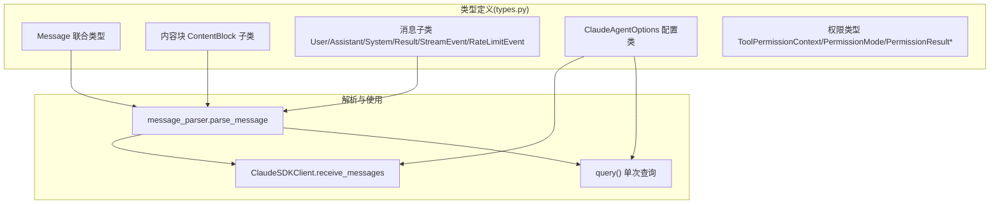
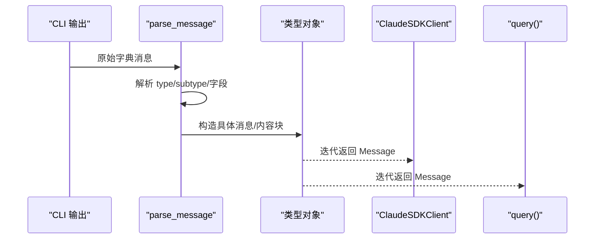
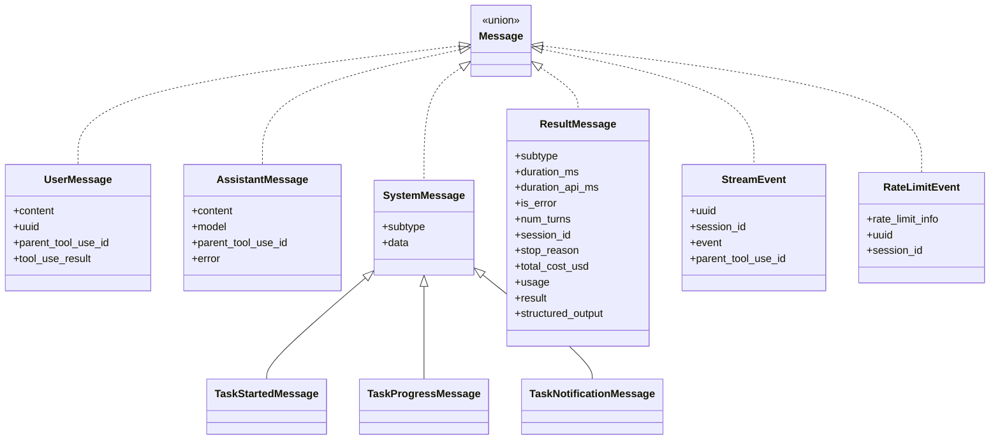
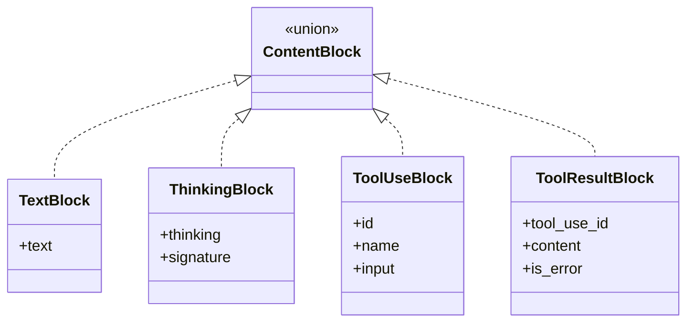
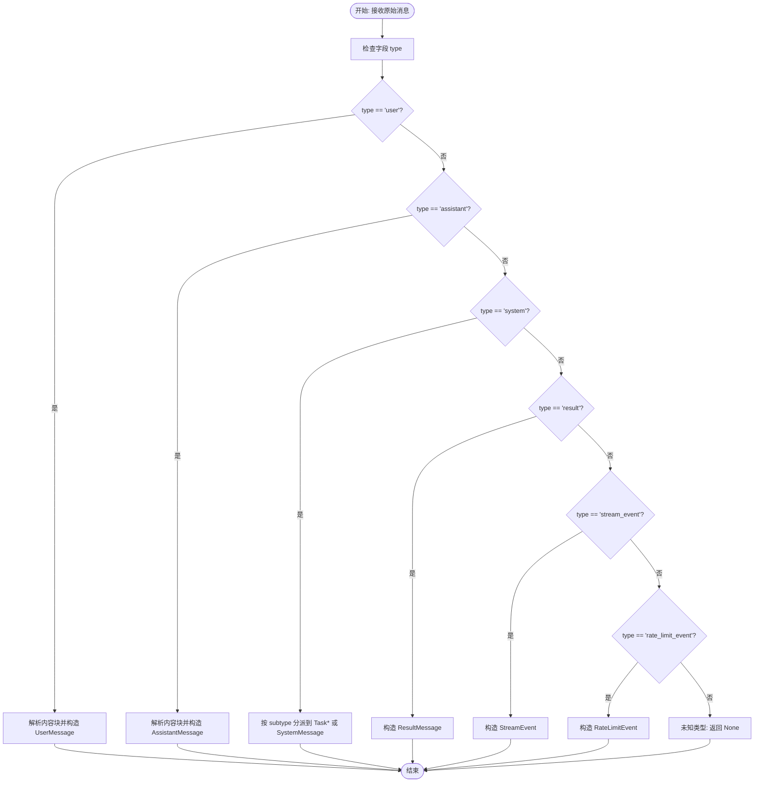
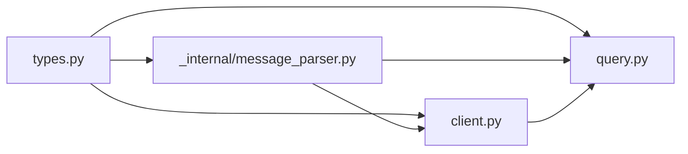

# 类型系统

<cite>
**本文引用的文件**
- [types.py](file://src/claude_agent_sdk/types.py)
- [message_parser.py](file://src/claude_agent_sdk/_internal/message_parser.py)
- [client.py](file://src/claude_agent_sdk/client.py)
- [query.py](file://src/claude_agent_sdk/query.py)
- [test_types.py](file://tests/test_types.py)
- [test_message_parser.py](file://tests/test_message_parser.py)
- [system_prompt.py](file://examples/system_prompt.py)
- [tool_permission_callback.py](file://examples/tool_permission_callback.py)
- [include_partial_messages.py](file://examples/include_partial_messages.py)
</cite>

## 目录
1. [简介](#简介)
2. [项目结构](#项目结构)
3. [核心组件](#核心组件)
4. [架构总览](#架构总览)
5. [详细组件分析](#详细组件分析)
6. [依赖分析](#依赖分析)
7. [性能考虑](#性能考虑)
8. [故障排查指南](#故障排查指南)
9. [结论](#结论)
10. [附录](#附录)

## 简介
本文件系统性梳理 Claude Agent SDK 的类型系统，覆盖消息类型（Message 及其子类）、内容块类型（ContentBlock 及其子类）、配置类（ClaudeAgentOptions）以及权限相关类型（ToolPermissionContext、权限模式与结果）。同时解释消息解析器的工作原理与消息转换流程，并提供类型使用示例、类型安全最佳实践与常见错误的解决方案。

## 项目结构
类型系统主要集中在 types.py 中定义，消息解析在 _internal/message_parser.py 中实现，客户端与查询接口在 client.py 与 query.py 中使用这些类型进行交互。

图表来源
- [types.py:945-952](file://src/claude_agent_sdk/types.py#L945-L952)
- [types.py:1030-1099](file://src/claude_agent_sdk/types.py#L1030-L1099)
- [types.py:123-157](file://src/claude_agent_sdk/types.py#L123-L157)
- [message_parser.py:29-251](file://src/claude_agent_sdk/_internal/message_parser.py#L29-L251)
- [client.py:186-197](file://src/claude_agent_sdk/client.py#L186-L197)
- [query.py:12-127](file://src/claude_agent_sdk/query.py#L12-L127)

章节来源
- [types.py:1-1199](file://src/claude_agent_sdk/types.py#L1-L1199)
- [message_parser.py:1-251](file://src/claude_agent_sdk/_internal/message_parser.py#L1-L251)
- [client.py:1-500](file://src/claude_agent_sdk/client.py#L1-L500)
- [query.py:1-127](file://src/claude_agent_sdk/query.py#L1-L127)

## 核心组件
- 消息类型（Message 联合）
  - 包含：UserMessage、AssistantMessage、SystemMessage、ResultMessage、StreamEvent、RateLimitEvent
  - 通过 Message = ... 定义为联合类型，便于统一处理
- 内容块类型（ContentBlock 联合）
  - 包含：TextBlock、ThinkingBlock、ToolUseBlock、ToolResultBlock
  - Assistant/User 消息的内容由这些块组成
- 配置类（ClaudeAgentOptions）
  - 工具控制、系统提示、MCP 服务器、权限模式、会话控制、模型选择、钩子、调试输出等
- 权限相关
  - ToolPermissionContext：工具权限回调上下文
  - 权限模式（PermissionMode）：default、acceptEdits、plan、bypassPermissions
  - 权限结果（PermissionResultAllow/Deny）：允许或拒绝工具调用，可携带更新后的输入与建议

章节来源
- [types.py:763-764](file://src/claude_agent_sdk/types.py#L763-L764)
- [types.py:945-952](file://src/claude_agent_sdk/types.py#L945-L952)
- [types.py:1030-1099](file://src/claude_agent_sdk/types.py#L1030-L1099)
- [types.py:123-157](file://src/claude_agent_sdk/types.py#L123-L157)

## 架构总览
消息从 CLI 输出经解析器转换为强类型对象，再由客户端或查询函数消费。解析器根据消息类型分派到对应的子类构造器，同时对内容块进行类型化处理。

图表来源
- [message_parser.py:29-251](file://src/claude_agent_sdk/_internal/message_parser.py#L29-L251)
- [types.py:945-952](file://src/claude_agent_sdk/types.py#L945-L952)

## 详细组件分析

### 消息类型体系
- Message 联合类型
  - 统一承载用户、助手、系统、结果、流事件、速率限制事件等
- 子类职责
  - UserMessage：用户输入，支持字符串或内容块列表；可携带工具使用元数据
  - AssistantMessage：助手回复，内容块列表，包含模型信息与错误标记
  - SystemMessage：系统消息基类，细分为任务开始、进度、通知等专用子类
  - ResultMessage：一次交互的结果汇总，包含耗时、错误、用量、费用等
  - StreamEvent：部分消息更新事件
  - RateLimitEvent：速率限制状态变更事件

图表来源
- [types.py:945-952](file://src/claude_agent_sdk/types.py#L945-L952)
- [types.py:777-795](file://src/claude_agent_sdk/types.py#L777-L795)
- [types.py:797-803](file://src/claude_agent_sdk/types.py#L797-L803)
- [types.py:817-869](file://src/claude_agent_sdk/types.py#L817-L869)
- [types.py:871-896](file://src/claude_agent_sdk/types.py#L871-L896)
- [types.py:888-896](file://src/claude_agent_sdk/types.py#L888-L896)
- [types.py:931-943](file://src/claude_agent_sdk/types.py#L931-L943)

章节来源
- [types.py:763-896](file://src/claude_agent_sdk/types.py#L763-L896)
- [types.py:817-869](file://src/claude_agent_sdk/types.py#L817-L869)

### 内容块类型体系
- TextBlock：纯文本内容
- ThinkingBlock：思考内容与签名
- ToolUseBlock：工具调用标识、名称与输入
- ToolResultBlock：工具执行结果，支持内容与错误标记

图表来源
- [types.py:729-764](file://src/claude_agent_sdk/types.py#L729-L764)
- [types.py:731-743](file://src/claude_agent_sdk/types.py#L731-L743)
- [types.py:745-761](file://src/claude_agent_sdk/types.py#L745-L761)

章节来源
- [types.py:729-764](file://src/claude_agent_sdk/types.py#L729-L764)

### ClaudeAgentOptions 配置类
- 主要属性与默认值（节选）
  - tools: None
  - allowed_tools: []
  - system_prompt: None
  - mcp_servers: {}
  - permission_mode: None
  - continue_conversation: False
  - resume: None
  - max_turns: None
  - max_budget_usd: None
  - disallowed_tools: []
  - model: None
  - fallback_model: None
  - betas: []
  - permission_prompt_tool_name: None
  - cwd: None
  - cli_path: None
  - settings: None
  - add_dirs: []
  - env: {}
  - extra_args: {}
  - max_buffer_size: None
  - debug_stderr: sys.stderr（已弃用）
  - stderr: None
  - can_use_tool: None
  - hooks: None
  - user: None
  - include_partial_messages: False
  - fork_session: False
  - agents: None
  - setting_sources: None
  - sandbox: None
  - plugins: []
  - max_thinking_tokens: None（已弃用）
  - thinking: None
  - effort: None
  - output_format: None
  - enable_file_checkpointing: False

章节来源
- [types.py:1030-1099](file://src/claude_agent_sdk/types.py#L1030-L1099)

### 权限相关类型
- ToolPermissionContext：工具权限回调上下文，包含信号与建议
- 权限模式（PermissionMode）：default、acceptEdits、plan、bypassPermissions
- 权限结果（PermissionResultAllow/PermissionResultDeny）：允许/拒绝，可携带更新后的输入与建议

章节来源
- [types.py:17-18](file://src/claude_agent_sdk/types.py#L17-L18)
- [types.py:123-157](file://src/claude_agent_sdk/types.py#L123-L157)

### 消息解析器工作原理
- 输入：CLI 输出的原始字典
- 流程：
  - 校验输入类型与必需字段
  - 根据 type 分派：
    - user：解析内容块（text/tool_use/tool_result），构造 UserMessage
    - assistant：解析内容块（text/thinking/tool_use/tool_result），构造 AssistantMessage
    - system：按 subtype 分派到 TaskStarted/TaskProgress/TaskNotification 或通用 SystemMessage
    - result：构造 ResultMessage
    - stream_event：构造 StreamEvent
    - rate_limit_event：构造 RateLimitEvent
  - 对未知类型返回 None（前向兼容）

图表来源
- [message_parser.py:29-251](file://src/claude_agent_sdk/_internal/message_parser.py#L29-L251)

章节来源
- [message_parser.py:29-251](file://src/claude_agent_sdk/_internal/message_parser.py#L29-L251)

### 类型使用示例
- 创建与传递消息
  - 使用 TextBlock/ThinkingBlock/ToolUseBlock/ToolResultBlock 组装 Assistant/User 消息内容
  - 使用 ClaudeAgentOptions 配置系统提示、工具、权限模式、MCP 服务器等
- 处理消息
  - 在 ClaudeSDKClient.receive_messages()/receive_response() 中迭代接收 Message
  - 使用 isinstance 或 match-case 区分不同消息类型与内容块类型
- 示例参考
  - 系统提示配置示例：[system_prompt.py:1-87](file://examples/system_prompt.py#L1-L87)
  - 工具权限回调示例：[tool_permission_callback.py:1-159](file://examples/tool_permission_callback.py#L1-L159)
  - 部分消息流式示例：[include_partial_messages.py:1-63](file://examples/include_partial_messages.py#L1-L63)

章节来源
- [system_prompt.py:1-87](file://examples/system_prompt.py#L1-L87)
- [tool_permission_callback.py:1-159](file://examples/tool_permission_callback.py#L1-L159)
- [include_partial_messages.py:1-63](file://examples/include_partial_messages.py#L1-L63)

## 依赖分析
- 类型依赖
  - Message 联合类型依赖各消息子类
  - Assistant/User 消息依赖 ContentBlock 联合类型
  - ClaudeAgentOptions 作为客户端与查询函数的输入参数
- 解析器依赖
  - 解析器直接依赖 types 中的消息与内容块类型
- 客户端与查询函数
  - ClaudeSDKClient.receive_messages() 通过解析器产出 Message
  - query() 通过内部客户端产出 Message

图表来源
- [types.py:945-952](file://src/claude_agent_sdk/types.py#L945-L952)
- [message_parser.py:29-251](file://src/claude_agent_sdk/_internal/message_parser.py#L29-L251)
- [client.py:186-197](file://src/claude_agent_sdk/client.py#L186-L197)
- [query.py:12-127](file://src/claude_agent_sdk/query.py#L12-L127)

章节来源
- [types.py:1-1199](file://src/claude_agent_sdk/types.py#L1-L1199)
- [message_parser.py:1-251](file://src/claude_agent_sdk/_internal/message_parser.py#L1-L251)
- [client.py:1-500](file://src/claude_agent_sdk/client.py#L1-L500)
- [query.py:1-127](file://src/claude_agent_sdk/query.py#L1-L127)

## 性能考虑
- 解析器采用逐分支匹配，时间复杂度 O(n)（n 为消息数量），空间复杂度 O(k)（k 为内容块数量）
- ClaudeSDKClient.receive_messages() 为异步迭代，避免阻塞
- ClaudeAgentOptions 中的 include_partial_messages 与 hooks 可能增加开销，应按需启用

## 故障排查指南
- 常见错误与定位
  - MessageParseError：输入非字典、缺少 type 字段、子消息缺少必要字段
  - 建议：检查 CLI 输出格式一致性，确保字段完整
- 单测参考
  - 类型创建与字段校验：[test_types.py:25-82](file://tests/test_types.py#L25-L82)
  - 消息解析错误行为与边界：[test_message_parser.py:23-696](file://tests/test_message_parser.py#L23-L696)

章节来源
- [test_types.py:25-82](file://tests/test_types.py#L25-L82)
- [test_message_parser.py:23-696](file://tests/test_message_parser.py#L23-L696)

## 结论
本类型系统以强类型消息与内容块为核心，配合 ClaudeAgentOptions 提供灵活的运行时配置，结合权限回调与钩子机制实现可控的工具调用与扩展能力。解析器负责将 CLI 输出稳定地映射到类型对象，保障上层逻辑的一致性与安全性。

## 附录
- 类型安全最佳实践
  - 使用 isinstance/match-case 明确区分消息与内容块类型
  - 对可选字段进行显式判空与默认值处理
  - 在工具权限回调中返回 PermissionResultAllow/Deny，必要时提供 updated_input 与 suggestions
  - 合理设置 ClaudeAgentOptions，避免不必要的权限与钩子开销
- 常见类型错误与修复
  - 缺少 type 字段：确保 CLI 输出符合协议
  - 内容块类型不匹配：严格遵循 content 数组元素的 type 字段
  - 权限模式与回调冲突：不可同时使用 can_use_tool 与 permission_prompt_tool_name