# 类型系统增强

<cite>
**本文档引用的文件**
- [types.py](file://src/claude_agent_sdk/types.py)
- [client.py](file://src/claude_agent_sdk/client.py)
- [query.py](file://src/claude_agent_sdk/query.py)
- [_internal/client.py](file://src/claude_agent_sdk/_internal/client.py)
- [_internal/query.py](file://src/claude_agent_sdk/_internal/query.py)
- [_internal/message_parser.py](file://src/claude_agent_sdk/_internal/message_parser.py)
- [_internal/sessions.py](file://src/claude_agent_sdk/_internal/sessions.py)
- [_internal/session_mutations.py](file://src/claude_agent_sdk/_internal/session_mutations.py)
- [_errors.py](file://src/claude_agent_sdk/_errors.py)
- [__init__.py](file://src/claude_agent_sdk/__init__.py)
- [test_types.py](file://tests/test_types.py)
- [quick_start.py](file://examples/quick_start.py)
- [hooks.py](file://examples/hooks.py)
- [agents.py](file://examples/agents.py)
- [tools_option.py](file://examples/tools_option.py)
</cite>

## 目录
1. [简介](#简介)
2. [项目结构](#项目结构)
3. [核心组件](#核心组件)
4. [架构概览](#架构概览)
5. [详细组件分析](#详细组件分析)
6. [依赖分析](#依赖分析)
7. [性能考虑](#性能考虑)
8. [故障排除指南](#故障排除指南)
9. [结论](#结论)

## 简介

Claude Agent SDK Python 是一个功能强大的工具，为与 Claude Code 进行交互提供了完整的类型安全接口。该项目的核心特色是其精心设计的类型系统，该系统确保了在开发过程中的类型安全性和编译时错误检测。

本文档深入分析了该 SDK 的类型系统增强功能，包括强类型消息定义、钩子回调系统、权限管理、MCP 服务器集成以及会话管理等核心组件。通过使用 Python 的类型注解、数据类和 TypedDict，该 SDK 提供了完整的类型安全保障，使开发者能够构建更可靠的应用程序。

## 项目结构

项目采用模块化设计，主要包含以下核心目录：

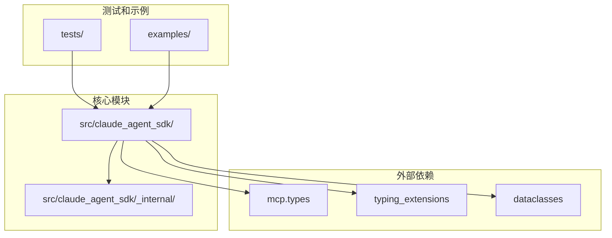

**图表来源**
- [types.py:1-1204](file://src/claude_agent_sdk/types.py#L1-L1204)
- [client.py:1-499](file://src/claude_agent_sdk/client.py#L1-L499)

**章节来源**
- [types.py:1-1204](file://src/claude_agent_sdk/types.py#L1-L1204)
- [client.py:1-499](file://src/claude_agent_sdk/client.py#L1-L499)

## 核心组件

### 类型系统架构

该 SDK 的类型系统基于以下核心概念构建：

1. **强类型消息定义**：使用 dataclass 和 TypedDict 定义所有消息类型
2. **钩子回调系统**：提供类型安全的钩子事件处理机制
3. **权限管理**：通过枚举和数据类实现细粒度的权限控制
4. **MCP 服务器集成**：支持本地和远程 MCP 服务器的类型安全连接
5. **会话管理**：提供完整的会话生命周期管理类型定义

### 主要类型分类

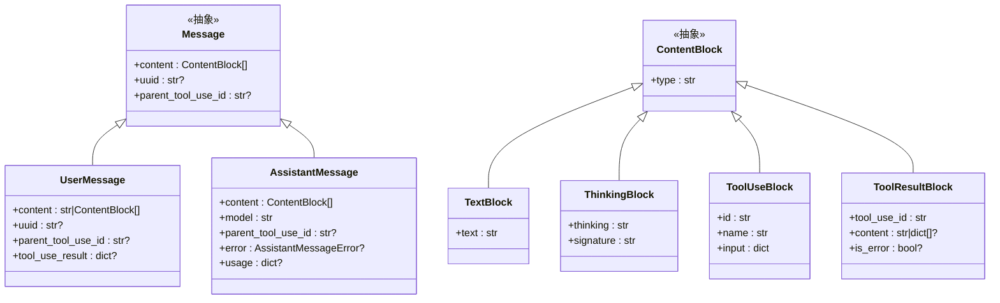

**图表来源**
- [types.py:770-800](file://src/claude_agent_sdk/types.py#L770-L800)
- [types.py:734-767](file://src/claude_agent_sdk/types.py#L734-L767)

**章节来源**
- [types.py:734-800](file://src/claude_agent_sdk/types.py#L734-L800)

## 架构概览

SDK 采用分层架构设计，确保类型安全贯穿整个系统：

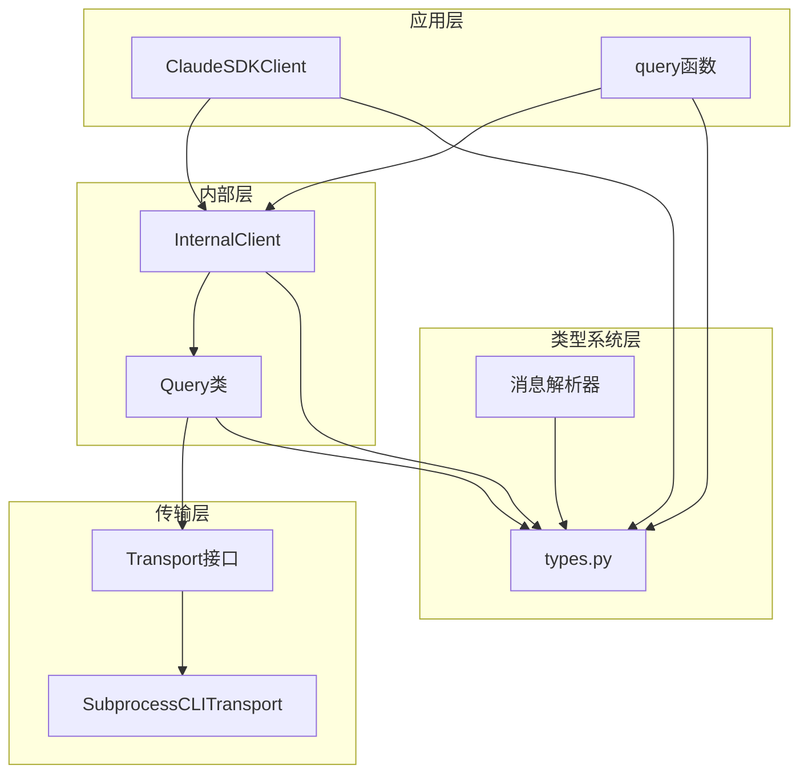

**图表来源**
- [client.py:21-60](file://src/claude_agent_sdk/client.py#L21-L60)
- [_internal/client.py:20-25](file://src/claude_agent_sdk/_internal/client.py#L20-L25)
- [_internal/query.py:53-62](file://src/claude_agent_sdk/_internal/query.py#L53-L62)

## 详细组件分析

### 消息类型系统

消息类型系统是 SDK 类型安全的核心，提供了完整的消息生命周期管理：

#### 消息类型层次结构

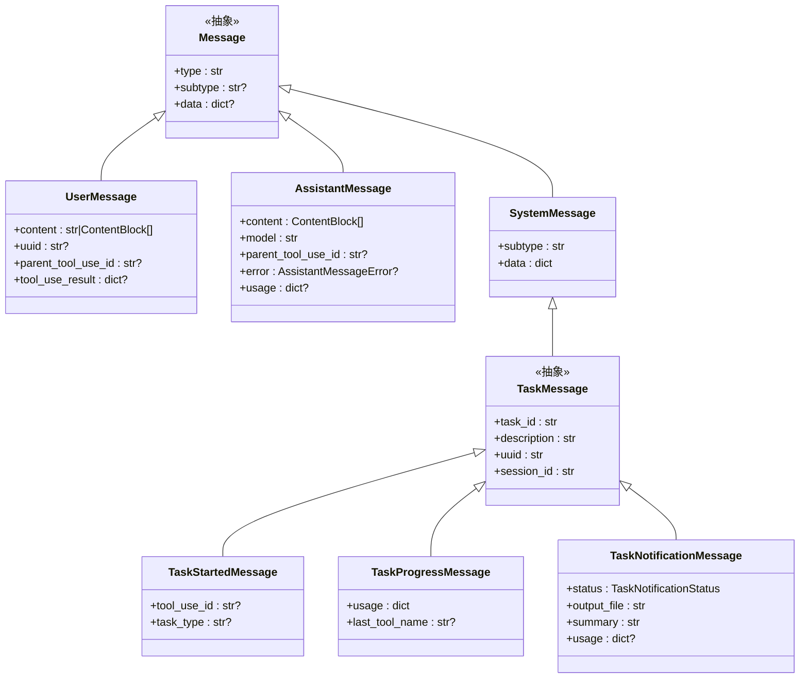

**图表来源**
- [types.py:781-800](file://src/claude_agent_sdk/types.py#L781-L800)
- [types.py:142-190](file://src/claude_agent_sdk/types.py#L142-L190)

#### 内容块系统

内容块系统提供了灵活的消息内容表示方式：

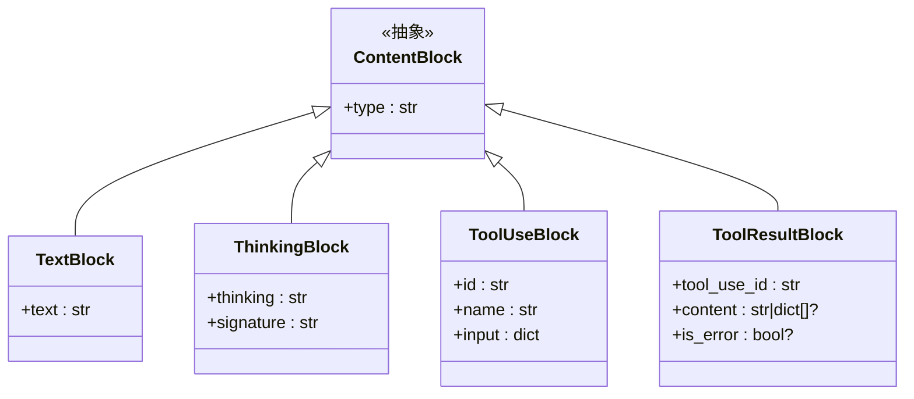

**图表来源**
- [types.py:734-767](file://src/claude_agent_sdk/types.py#L734-L767)

**章节来源**
- [types.py:734-800](file://src/claude_agent_sdk/types.py#L734-L800)

### 钩子系统类型定义

钩子系统提供了强大的事件驱动编程能力，支持多种类型的钩子事件：

#### 钩子事件类型

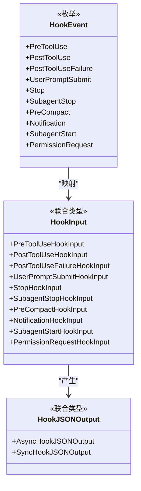

**图表来源**
- [types.py:164-176](file://src/claude_agent_sdk/types.py#L164-L176)
- [types.py:302-314](file://src/claude_agent_sdk/types.py#L302-L314)
- [types.py:456](file://src/claude_agent_sdk/types.py#L456)

#### 钩子输入类型

每个钩子事件都有专门的输入类型定义：

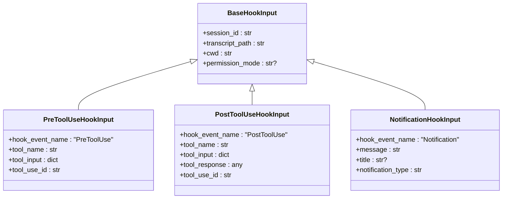

**图表来源**
- [types.py:180-301](file://src/claude_agent_sdk/types.py#L180-L301)

**章节来源**
- [types.py:164-314](file://src/claude_agent_sdk/types.py#L164-L314)

### 权限管理系统

权限管理系统提供了细粒度的工具访问控制：

#### 权限决策类型

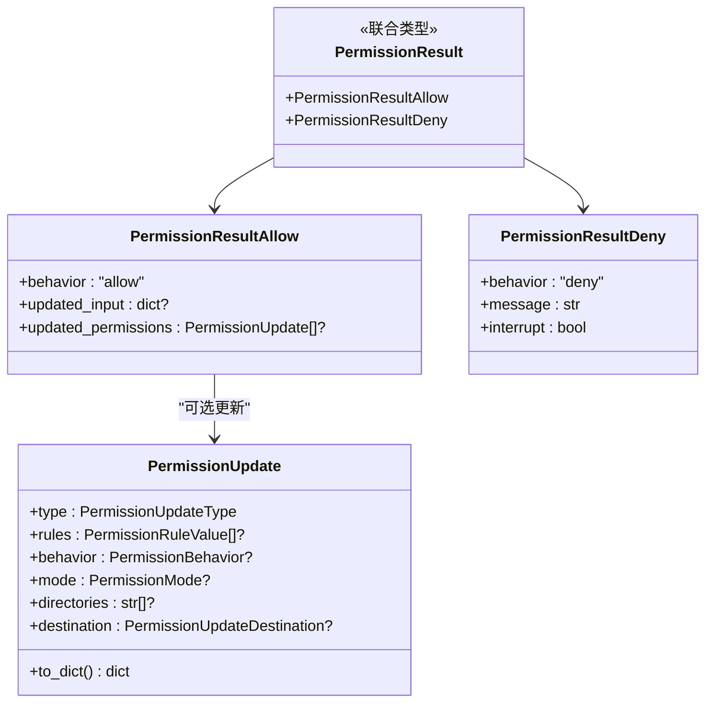

**图表来源**
- [types.py:139-157](file://src/claude_agent_sdk/types.py#L139-L157)
- [types.py:72-125](file://src/claude_agent_sdk/types.py#L72-L125)

**章节来源**
- [types.py:56-157](file://src/claude_agent_sdk/types.py#L56-L157)

### MCP 服务器集成

MCP（Model Context Protocol）服务器集成为 SDK 提供了强大的扩展能力：

#### MCP 配置类型

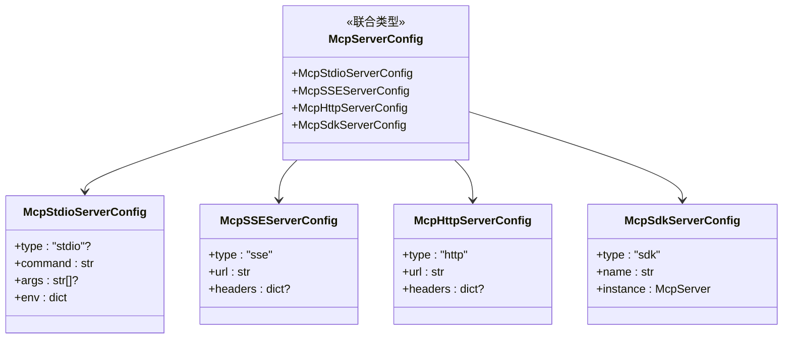

**图表来源**
- [types.py:531-533](file://src/claude_agent_sdk/types.py#L531-L533)
- [types.py:498-533](file://src/claude_agent_sdk/types.py#L498-L533)

**章节来源**
- [types.py:497-644](file://src/claude_agent_sdk/types.py#L497-L644)

### 会话管理系统

会话管理系统提供了完整的对话历史管理和元数据操作：

#### 会话信息类型

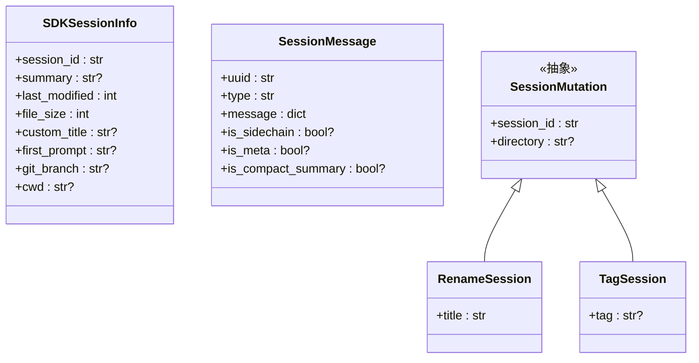

**图表来源**
- [types.py:656-731](file://src/claude_agent_sdk/types.py#L656-L731)
- [_internal/sessions.py:403-471](file://src/claude_agent_sdk/_internal/sessions.py#L403-L471)

**章节来源**
- [types.py:656-731](file://src/claude_agent_sdk/types.py#L656-L731)
- [_internal/sessions.py:403-471](file://src/claude_agent_sdk/_internal/sessions.py#L403-L471)

## 依赖分析

SDK 的类型系统依赖关系清晰且模块化：

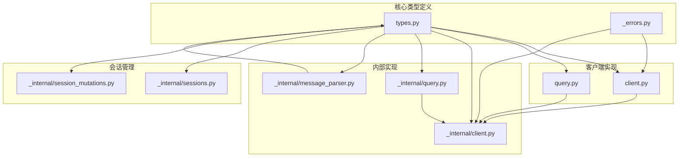

**图表来源**
- [types.py:1-1204](file://src/claude_agent_sdk/types.py#L1-L1204)
- [client.py:11-18](file://src/claude_agent_sdk/client.py#L11-L18)

**章节来源**
- [types.py:1-1204](file://src/claude_agent_sdk/types.py#L1-L1204)
- [client.py:11-18](file://src/claude_agent_sdk/client.py#L11-L18)

## 性能考虑

类型系统的性能优化策略：

1. **延迟导入**：使用 TYPE_CHECKING 条件导入避免运行时开销
2. **数据类优化**：使用 dataclass 减少样板代码和提升性能
3. **类型检查缓存**：利用 Python 类型检查器的缓存机制
4. **内存优化**：合理使用 TypedDict 和数据类减少内存占用

## 故障排除指南

### 常见类型错误

1. **消息解析错误**：检查消息字段完整性
2. **钩子回调签名不匹配**：验证回调函数参数类型
3. **权限决策类型错误**：确保返回正确的 PermissionResult 类型
4. **MCP 服务器配置错误**：验证服务器配置格式

### 调试技巧

```python
# 启用详细日志
import logging
logging.basicConfig(level=logging.DEBUG)

# 使用类型检查器
# mypy src/claude_agent_sdk/

# 验证消息结构
def validate_message(message: Message) -> bool:
    try:
        # 验证必需字段
        return True
    except AttributeError:
        return False
```

**章节来源**
- [_errors.py:6-57](file://src/claude_agent_sdk/_errors.py#L6-L57)

## 结论

Claude Agent SDK Python 的类型系统增强代表了现代 Python SDK 设计的最佳实践。通过精心设计的类型层次结构、强类型的消息系统、灵活的钩子机制和完整的权限管理，该 SDK 为开发者提供了强大而安全的工具。

主要优势包括：

1. **类型安全性**：编译时错误检测，减少运行时错误
2. **开发效率**：IDE 智能提示和自动补全
3. **可维护性**：清晰的类型定义便于代码维护
4. **扩展性**：模块化的类型设计支持功能扩展
5. **可靠性**：完整的错误处理和类型验证机制

该类型系统的设计为类似项目的类型安全实现提供了优秀的参考模板，展示了如何在 Python 中实现接近静态类型语言的类型安全保障。