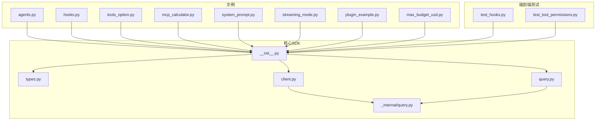
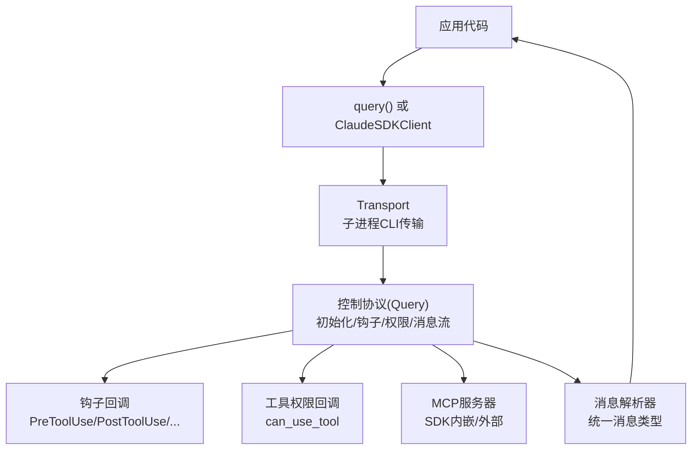
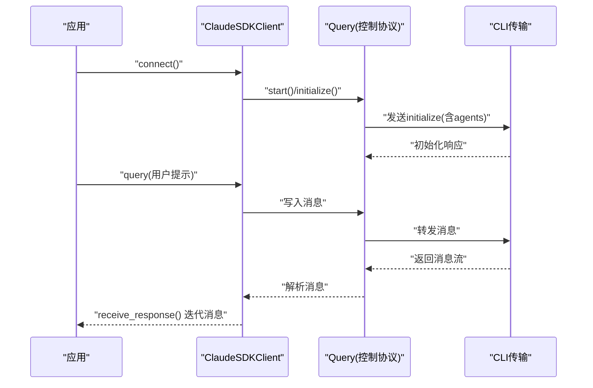
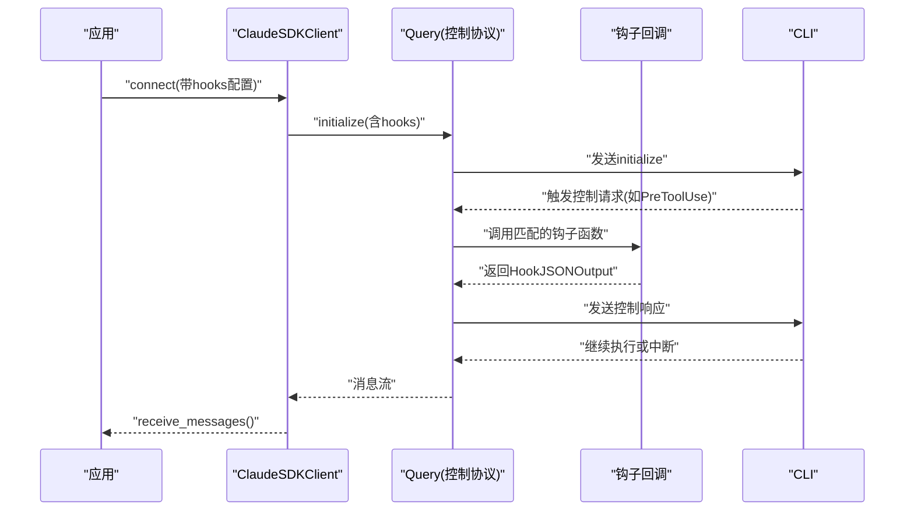
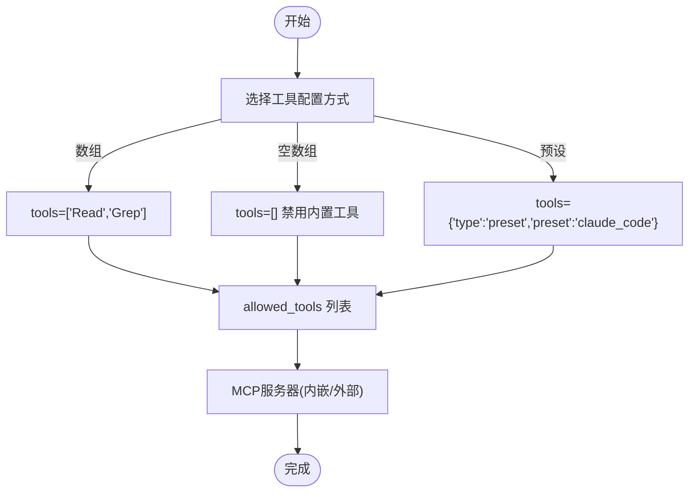
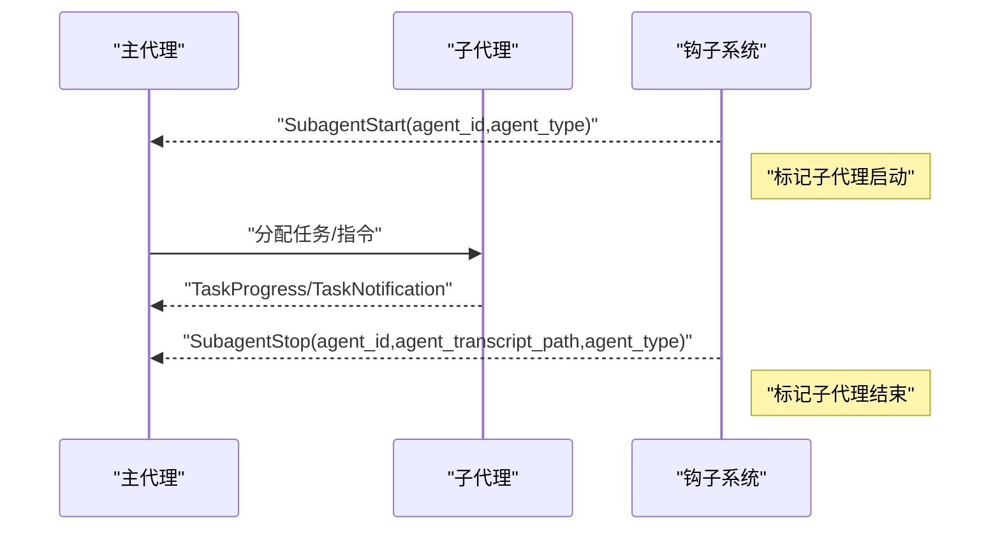
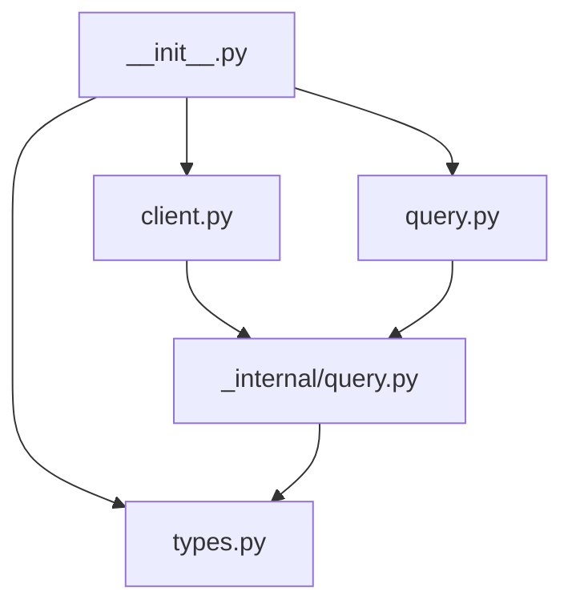
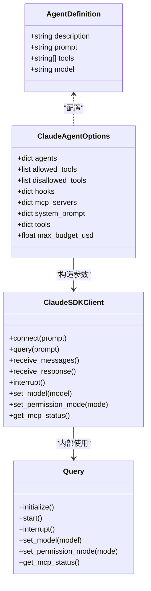

# 代理开发示例

<cite>
**本文档引用的文件**
- [README.md](file://README.md)
- [src/claude_agent_sdk/__init__.py](file://src/claude_agent_sdk/__init__.py)
- [src/claude_agent_sdk/types.py](file://src/claude_agent_sdk/types.py)
- [src/claude_agent_sdk/client.py](file://src/claude_agent_sdk/client.py)
- [src/claude_agent_sdk/query.py](file://src/claude_agent_sdk/query.py)
- [src/claude_agent_sdk/_internal/query.py](file://src/claude_agent_sdk/_internal/query.py)
- [examples/agents.py](file://examples/agents.py)
- [examples/hooks.py](file://examples/hooks.py)
- [examples/tools_option.py](file://examples/tools_option.py)
- [examples/mcp_calculator.py](file://examples/mcp_calculator.py)
- [examples/system_prompt.py](file://examples/system_prompt.py)
- [examples/streaming_mode.py](file://examples/streaming_mode.py)
- [examples/plugin_example.py](file://examples/plugin_example.py)
- [examples/max_budget_usd.py](file://examples/max_budget_usd.py)
- [e2e-tests/test_hooks.py](file://e2e-tests/test_hooks.py)
- [e2e-tests/test_tool_permissions.py](file://e2e-tests/test_tool_permissions.py)
</cite>

## 目录
1. [简介](#简介)
2. [项目结构](#项目结构)
3. [核心组件](#核心组件)
4. [架构总览](#架构总览)
5. [详细组件分析](#详细组件分析)
6. [依赖关系分析](#依赖关系分析)
7. [性能考虑](#性能考虑)
8. [故障排除指南](#故障排除指南)
9. [结论](#结论)
10. [附录](#附录)

## 简介
本示例文档面向希望使用 Claude Agent SDK 构建复杂 AI 代理系统的开发者，涵盖代理定义、钩子事件处理、工具选项配置与管理、代理生命周期与状态维护、代理间通信与协作、性能优化与扩展性设计，以及完整的开发工作流程与测试方法。通过仓库中的示例与类型定义，读者可以快速上手并构建可维护、可观测、可扩展的智能体系统。

## 项目结构
该仓库采用模块化组织方式，核心 SDK 模块位于 src/claude_agent_sdk 下，示例与端到端测试分别位于 examples 与 e2e-tests 目录中。README 提供了安装、基础用法与高级特性概览；核心模块包括查询接口、客户端、类型定义与内部控制协议实现。

**图表来源**
- [src/claude_agent_sdk/__init__.py:1-445](file://src/claude_agent_sdk/__init__.py#L1-L445)
- [src/claude_agent_sdk/types.py:1-800](file://src/claude_agent_sdk/types.py#L1-L800)
- [src/claude_agent_sdk/client.py:1-500](file://src/claude_agent_sdk/client.py#L1-L500)
- [src/claude_agent_sdk/query.py:1-127](file://src/claude_agent_sdk/query.py#L1-L127)
- [src/claude_agent_sdk/_internal/query.py:1-200](file://src/claude_agent_sdk/_internal/query.py#L1-L200)
- [examples/agents.py:1-125](file://examples/agents.py#L1-L125)
- [examples/hooks.py:1-351](file://examples/hooks.py#L1-L351)
- [examples/tools_option.py:1-112](file://examples/tools_option.py#L1-L112)
- [examples/mcp_calculator.py:1-194](file://examples/mcp_calculator.py#L1-L194)
- [examples/system_prompt.py:1-87](file://examples/system_prompt.py#L1-L87)
- [examples/streaming_mode.py:1-512](file://examples/streaming_mode.py#L1-L512)
- [examples/plugin_example.py:1-72](file://examples/plugin_example.py#L1-L72)
- [examples/max_budget_usd.py:1-96](file://examples/max_budget_usd.py#L1-L96)
- [e2e-tests/test_hooks.py:1-157](file://e2e-tests/test_hooks.py#L1-L157)
- [e2e-tests/test_tool_permissions.py:1-66](file://e2e-tests/test_tool_permissions.py#L1-L66)

**章节来源**
- [README.md:1-360](file://README.md#L1-L360)
- [src/claude_agent_sdk/__init__.py:1-445](file://src/claude_agent_sdk/__init__.py#L1-L445)

## 核心组件
- 查询接口：提供一次性或单向流式交互的 query 函数，适合批处理与自动化脚本。
- 客户端：支持双向、交互式对话的 ClaudeSDKClient，适用于聊天界面、调试探索与多轮会话。
- 类型系统：统一的消息类型、内容块、权限模型、钩子输入输出、MCP 服务器配置等强类型定义。
- 钩子系统：在代理循环的关键节点（如工具使用前后、会话开始/结束、通知等）注入自定义逻辑。
- 工具系统：内置工具集与 MCP 服务器（含 SDK 内嵌服务器），支持自定义工具注册与调用。
- 代理定义：通过 AgentDefinition 与 ClaudeAgentOptions 定义专用代理角色、提示词、工具与模型。

**章节来源**
- [src/claude_agent_sdk/query.py:1-127](file://src/claude_agent_sdk/query.py#L1-L127)
- [src/claude_agent_sdk/client.py:21-60](file://src/claude_agent_sdk/client.py#L21-L60)
- [src/claude_agent_sdk/types.py:42-50](file://src/claude_agent_sdk/types.py#L42-L50)
- [src/claude_agent_sdk/types.py:160-172](file://src/claude_agent_sdk/types.py#L160-L172)
- [src/claude_agent_sdk/types.py:475-491](file://src/claude_agent_sdk/types.py#L475-L491)
- [src/claude_agent_sdk/__init__.py:111-176](file://src/claude_agent_sdk/__init__.py#L111-L176)
- [src/claude_agent_sdk/__init__.py:178-341](file://src/claude_agent_sdk/__init__.py#L178-L341)

## 架构总览
下图展示了 SDK 的高层架构：应用通过 query 或 ClaudeSDKClient 发起请求，内部通过 Transport 连接 CLI，控制协议负责路由控制请求/响应、钩子回调与工具权限决策，消息流经解析器转换为统一的消息类型返回给应用。

**图表来源**
- [src/claude_agent_sdk/query.py:12-127](file://src/claude_agent_sdk/query.py#L12-L127)
- [src/claude_agent_sdk/client.py:94-181](file://src/claude_agent_sdk/client.py#L94-L181)
- [src/claude_agent_sdk/_internal/query.py:53-120](file://src/claude_agent_sdk/_internal/query.py#L53-L120)
- [src/claude_agent_sdk/types.py:160-172](file://src/claude_agent_sdk/types.py#L160-L172)
- [src/claude_agent_sdk/types.py:475-491](file://src/claude_agent_sdk/types.py#L475-L491)

**章节来源**
- [src/claude_agent_sdk/_internal/query.py:1-200](file://src/claude_agent_sdk/_internal/query.py#L1-L200)
- [src/claude_agent_sdk/client.py:94-181](file://src/claude_agent_sdk/client.py#L94-L181)

## 详细组件分析

### 代理定义与生命周期管理
- 使用 AgentDefinition 定义代理的角色、提示词、工具集合与模型选择，并通过 ClaudeAgentOptions 注入。
- 生命周期：代理在 initialize 请求中注册，随后在会话中按需切换模型、工具与权限模式；通过 receive_response 或 receive_messages 获取结果与中间消息。
- 状态维护：会话状态由 CLI 维护，应用通过客户端方法（如 set_model、set_permission_mode、interrupt）进行动态调整。

**图表来源**
- [src/claude_agent_sdk/client.py:94-181](file://src/claude_agent_sdk/client.py#L94-L181)
- [src/claude_agent_sdk/_internal/query.py:119-164](file://src/claude_agent_sdk/_internal/query.py#L119-L164)
- [examples/agents.py:23-50](file://examples/agents.py#L23-L50)

**章节来源**
- [examples/agents.py:23-120](file://examples/agents.py#L23-L120)
- [src/claude_agent_sdk/types.py:42-50](file://src/claude_agent_sdk/types.py#L42-L50)
- [src/claude_agent_sdk/client.py:198-281](file://src/claude_agent_sdk/client.py#L198-L281)

### 钩子系统：事件监听、处理与响应
- 事件类型：PreToolUse、PostToolUse、PostToolUseFailure、UserPromptSubmit、Stop、SubagentStop、PreCompact、Notification、SubagentStart、PermissionRequest。
- 匹配器：HookMatcher 支持基于工具名或组合规则的匹配，并可设置超时。
- 响应机制：钩子回调返回 HookJSONOutput，支持 permissionDecision、reason、systemMessage、additionalContext、continue_、stopReason 等字段，用于控制执行流与反馈。

**图表来源**
- [src/claude_agent_sdk/types.py:160-172](file://src/claude_agent_sdk/types.py#L160-L172)
- [src/claude_agent_sdk/types.py:475-491](file://src/claude_agent_sdk/types.py#L475-L491)
- [src/claude_agent_sdk/_internal/query.py:119-164](file://src/claude_agent_sdk/_internal/query.py#L119-L164)

**章节来源**
- [examples/hooks.py:46-136](file://examples/hooks.py#L46-L136)
- [examples/hooks.py:156-193](file://examples/hooks.py#L156-L193)
- [examples/hooks.py:218-240](file://examples/hooks.py#L218-L240)
- [examples/hooks.py:242-277](file://examples/hooks.py#L242-L277)
- [examples/hooks.py:279-300](file://examples/hooks.py#L279-L300)
- [e2e-tests/test_hooks.py:17-70](file://e2e-tests/test_hooks.py#L17-L70)

### 工具选项配置与管理
- 工具数组：tools=["Read","Grep","Grep"] 明确可用工具列表。
- 空数组：tools=[] 禁用所有内置工具。
- 预设：tools={"type":"preset","preset":"claude_code"} 使用默认工具集。
- 允许/拒绝策略：allowed_tools/disallowed_tools 与 permission_mode 控制工具使用权限。
- 自定义工具：通过 @tool 装饰器定义工具，create_sdk_mcp_server 创建内嵌 MCP 服务器，再在 options 中注册。

**图表来源**
- [examples/tools_option.py:16-42](file://examples/tools_option.py#L16-L42)
- [examples/tools_option.py:45-71](file://examples/tools_option.py#L45-L71)
- [examples/tools_option.py:74-100](file://examples/tools_option.py#L74-L100)
- [src/claude_agent_sdk/__init__.py:111-176](file://src/claude_agent_sdk/__init__.py#L111-L176)
- [src/claude_agent_sdk/__init__.py:178-341](file://src/claude_agent_sdk/__init__.py#L178-L341)

**章节来源**
- [examples/tools_option.py:16-100](file://examples/tools_option.py#L16-L100)
- [src/claude_agent_sdk/__init__.py:111-176](file://src/claude_agent_sdk/__init__.py#L111-L176)
- [src/claude_agent_sdk/__init__.py:178-341](file://src/claude_agent_sdk/__init__.py#L178-L341)

### 代理间通信与协作
- 子代理：通过 SubagentStart/SubagentStop 钩子识别并追踪子代理的生命周期，结合 agent_id/agent_type 属性进行区分。
- 任务协作：通过任务通知与进度消息（TaskNotificationMessage/TaskProgressMessage）实现跨代理的状态同步与协调。
- 会话隔离：每个代理可在独立 session_id 下运行，避免状态污染。

**图表来源**
- [src/claude_agent_sdk/types.py:281-287](file://src/claude_agent_sdk/types.py#L281-L287)
- [src/claude_agent_sdk/types.py:254-262](file://src/claude_agent_sdk/types.py#L254-L262)

**章节来源**
- [src/claude_agent_sdk/types.py:185-208](file://src/claude_agent_sdk/types.py#L185-L208)
- [src/claude_agent_sdk/types.py:281-287](file://src/claude_agent_sdk/types.py#L281-L287)
- [src/claude_agent_sdk/types.py:254-262](file://src/claude_agent_sdk/types.py#L254-L262)

### 性能优化与扩展性设计
- 内嵌 MCP 服务器：减少 IPC 开销，提升工具调用性能，简化部署与调试。
- 流式模式：使用 ClaudeSDKClient 的流式接口，降低延迟并支持中断。
- 权限与预算：通过 permission_mode 与 max_budget_usd 控制风险与成本。
- 插件与代理：通过插件扩展命令与技能，通过代理定义实现职责分离与复用。

**章节来源**
- [README.md:92-143](file://README.md#L92-L143)
- [examples/max_budget_usd.py:15-77](file://examples/max_budget_usd.py#L15-L77)
- [examples/plugin_example.py:23-62](file://examples/plugin_example.py#L23-L62)

## 依赖关系分析
- 模块耦合：__init__.py 汇聚导出，client 与 query 依赖内部 _internal/query 实现控制协议；types 提供统一类型定义。
- 外部依赖：mcp.server 与 mcp.types 用于 MCP 服务器与工具类型；anyio 用于异步任务组与内存对象流。

**图表来源**
- [src/claude_agent_sdk/__init__.py:1-445](file://src/claude_agent_sdk/__init__.py#L1-L445)
- [src/claude_agent_sdk/client.py:1-500](file://src/claude_agent_sdk/client.py#L1-L500)
- [src/claude_agent_sdk/query.py:1-127](file://src/claude_agent_sdk/query.py#L1-L127)
- [src/claude_agent_sdk/_internal/query.py:1-200](file://src/claude_agent_sdk/_internal/query.py#L1-L200)
- [src/claude_agent_sdk/types.py:1-800](file://src/claude_agent_sdk/types.py#L1-L800)

**章节来源**
- [src/claude_agent_sdk/__init__.py:1-445](file://src/claude_agent_sdk/__init__.py#L1-L445)
- [src/claude_agent_sdk/client.py:1-500](file://src/claude_agent_sdk/client.py#L1-L500)
- [src/claude_agent_sdk/query.py:1-127](file://src/claude_agent_sdk/query.py#L1-L127)
- [src/claude_agent_sdk/_internal/query.py:1-200](file://src/claude_agent_sdk/_internal/query.py#L1-L200)

## 性能考虑
- 工具调用：优先使用内嵌 MCP 服务器以消除进程间通信开销。
- 会话管理：合理设置 initialize 超时与消息流关闭超时，避免长时间阻塞。
- 权限检查：在 can_use_tool 回调中尽量快速决策，必要时使用异步钩子与超时控制。
- 成本控制：通过 max_budget_usd 限制总费用，结合 allowed_tools 与 permission_mode 降低高成本操作概率。

[本节为通用指导，无需特定文件来源]

## 故障排除指南
- 连接错误：CLIConnectionError 表示未连接或连接失败，确保先调用 connect 并正确配置 Transport。
- 工具权限：当使用 can_use_tool 时，提示必须为流式模式；禁止与 permission_prompt_tool_name 同时使用。
- 钩子字段：Python SDK 使用 async_ 与 continue_ 避免关键字冲突，CLI 侧会自动转换为 async 与 continue。
- 端到端验证：参考 e2e-tests 中的钩子与工具权限测试，确认字段生效路径。

**章节来源**
- [src/claude_agent_sdk/client.py:113-131](file://src/claude_agent_sdk/client.py#L113-L131)
- [src/claude_agent_sdk/_internal/query.py:34-50](file://src/claude_agent_sdk/_internal/query.py#L34-L50)
- [e2e-tests/test_hooks.py:17-70](file://e2e-tests/test_hooks.py#L17-L70)
- [e2e-tests/test_tool_permissions.py:19-61](file://e2e-tests/test_tool_permissions.py#L19-L61)

## 结论
通过 Claude Agent SDK，开发者可以构建具备复杂行为与协作能力的 AI 代理系统。借助代理定义、钩子事件处理、工具选项配置与内嵌 MCP 服务器，可以在保证安全性与可控性的前提下，实现高性能、可观测与可扩展的智能体应用。配合流式接口与端到端测试，能够有效支撑从原型到生产的完整开发流程。

[本节为总结性内容，无需特定文件来源]

## 附录

### 代理开发工作流程
- 定义代理：AgentDefinition + ClaudeAgentOptions
- 配置工具：tools/allowed_tools/disallowed_tools/permission_mode
- 注册钩子：HookMatcher + 钩子回调
- 实现自定义工具：@tool + create_sdk_mcp_server
- 交互与控制：ClaudeSDKClient 流式接口 + interrupt/set_model/set_permission_mode
- 验证与测试：端到端测试 + 示例脚本

**章节来源**
- [examples/agents.py:23-120](file://examples/agents.py#L23-L120)
- [examples/tools_option.py:16-100](file://examples/tools_option.py#L16-L100)
- [examples/hooks.py:156-300](file://examples/hooks.py#L156-L300)
- [examples/mcp_calculator.py:138-194](file://examples/mcp_calculator.py#L138-L194)
- [examples/streaming_mode.py:467-512](file://examples/streaming_mode.py#L467-L512)

### 关键类型与类概览

**图表来源**
- [src/claude_agent_sdk/types.py:42-50](file://src/claude_agent_sdk/types.py#L42-L50)
- [src/claude_agent_sdk/types.py:24-41](file://src/claude_agent_sdk/types.py#L24-L41)
- [src/claude_agent_sdk/client.py:62-181](file://src/claude_agent_sdk/client.py#L62-L181)
- [src/claude_agent_sdk/_internal/query.py:64-120](file://src/claude_agent_sdk/_internal/query.py#L64-L120)