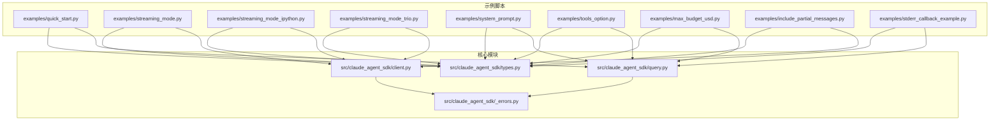
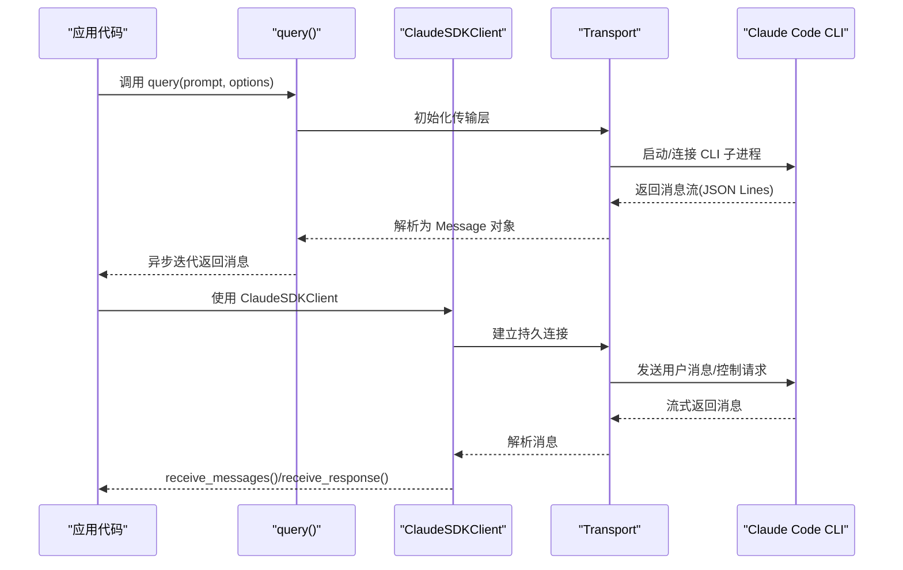
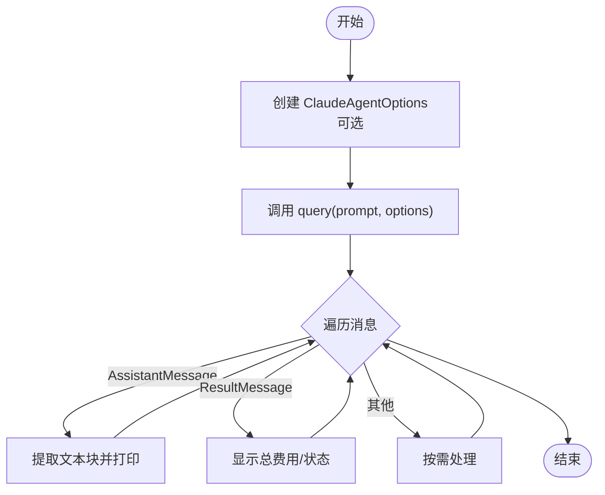
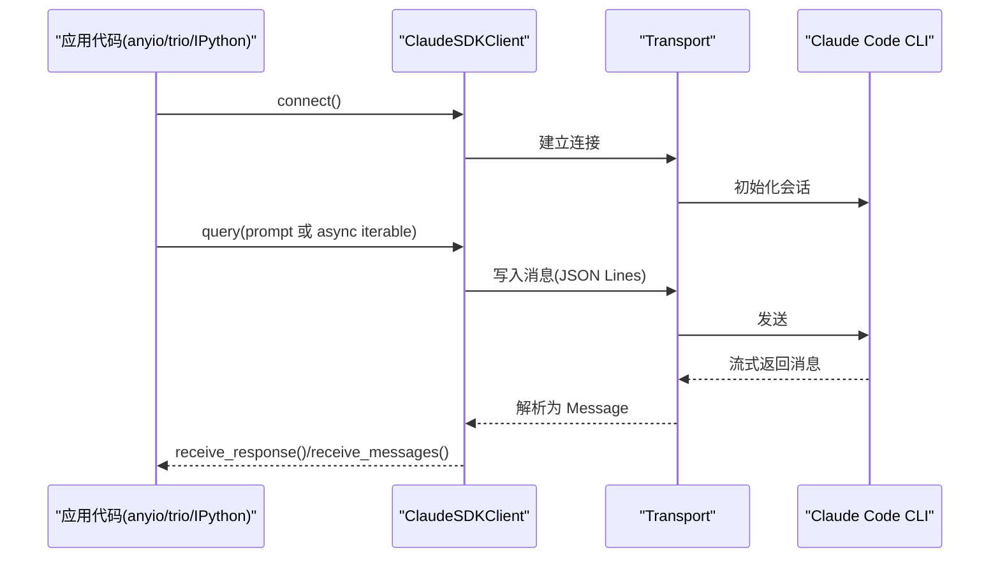
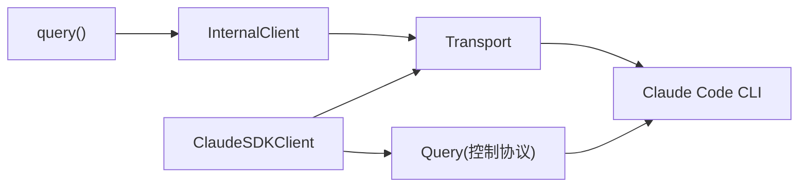

# 基础示例

<cite>
**本文引用的文件**
- [README.md](file://README.md)
- [quick_start.py](file://examples/quick_start.py)
- [streaming_mode.py](file://examples/streaming_mode.py)
- [streaming_mode_ipython.py](file://examples/streaming_mode_ipython.py)
- [streaming_mode_trio.py](file://examples/streaming_mode_trio.py)
- [system_prompt.py](file://examples/system_prompt.py)
- [tools_option.py](file://examples/tools_option.py)
- [max_budget_usd.py](file://examples/max_budget_usd.py)
- [include_partial_messages.py](file://examples/include_partial_messages.py)
- [stderr_callback_example.py](file://examples/stderr_callback_example.py)
- [query.py](file://src/claude_agent_sdk/query.py)
- [client.py](file://src/claude_agent_sdk/client.py)
- [types.py](file://src/claude_agent_sdk/types.py)
- [_errors.py](file://src/claude_agent_sdk/_errors.py)
</cite>

## 目录
1. [简介](#简介)
2. [项目结构](#项目结构)
3. [核心组件](#核心组件)
4. [架构总览](#架构总览)
5. [详细组件分析](#详细组件分析)
6. [依赖关系分析](#依赖关系分析)
7. [性能与资源控制](#性能与资源控制)
8. [故障排查指南](#故障排查指南)
9. [结论](#结论)
10. [附录：完整示例清单与运行结果](#附录完整示例清单与运行结果)

## 简介
本文件面向初学者，提供 Claude Agent SDK 的“最简单使用方式”入门指南，覆盖以下主题：
- 使用 query() 进行一次性问答交互
- 流式输出的多种实现方式（anyio、ipython、trio）
- 不同异步运行时的集成要点
- 消息类型处理与基本错误处理策略
- 完整示例清单与预期运行结果说明

目标是帮助你在最短时间内完成首次运行，并理解 SDK 的两种主要交互路径：轻量的一次性查询（query）与可交互的流式客户端（ClaudeSDKClient）。

## 项目结构
本仓库提供了丰富的示例脚本与核心模块，便于对照学习。下图给出与“基础示例”相关的核心文件与示例之间的关系概览。

图表来源
- [quick_start.py:1-77](file://examples/quick_start.py#L1-L77)
- [streaming_mode.py:1-512](file://examples/streaming_mode.py#L1-L512)
- [streaming_mode_ipython.py:1-230](file://examples/streaming_mode_ipython.py#L1-L230)
- [streaming_mode_trio.py:1-81](file://examples/streaming_mode_trio.py#L1-L81)
- [system_prompt.py:1-87](file://examples/system_prompt.py#L1-L87)
- [tools_option.py:1-112](file://examples/tools_option.py#L1-L112)
- [max_budget_usd.py:1-96](file://examples/max_budget_usd.py#L1-L96)
- [include_partial_messages.py:1-63](file://examples/include_partial_messages.py#L1-L63)
- [stderr_callback_example.py:1-44](file://examples/stderr_callback_example.py#L1-L44)
- [query.py:1-127](file://src/claude_agent_sdk/query.py#L1-L127)
- [client.py:1-500](file://src/claude_agent_sdk/client.py#L1-L500)
- [types.py:1-1199](file://src/claude_agent_sdk/types.py#L1-L1199)
- [_errors.py:1-57](file://src/claude_agent_sdk/_errors.py#L1-L57)

章节来源
- [README.md:1-360](file://README.md#L1-L360)

## 核心组件
- query()：一次性查询接口，返回异步迭代器，适合简单问答、批处理或自动化脚本。
- ClaudeSDKClient：双向交互客户端，支持多轮对话、中断、动态工具与钩子等高级能力。
- 类型系统：Message、ContentBlock、ClaudeAgentOptions 等，用于描述消息与配置。
- 错误体系：CLIConnectionError、CLINotFoundError、ProcessError、CLIJSONDecodeError 等。

章节来源
- [query.py:12-127](file://src/claude_agent_sdk/query.py#L12-L127)
- [client.py:21-60](file://src/claude_agent_sdk/client.py#L21-L60)
- [types.py:766-953](file://src/claude_agent_sdk/types.py#L766-L953)
- [_errors.py:6-57](file://src/claude_agent_sdk/_errors.py#L6-L57)

## 架构总览
下图展示了“基础示例”中涉及的关键调用链：从应用入口到 SDK 内部处理再到 CLI 的交互流程。

图表来源
- [query.py:121-127](file://src/claude_agent_sdk/query.py#L121-L127)
- [client.py:94-181](file://src/claude_agent_sdk/client.py#L94-L181)
- [types.py:766-953](file://src/claude_agent_sdk/types.py#L766-L953)

## 详细组件分析

### 一、query() 基础用法与简单问答
- 适用场景：一次性问题、批量处理、CI/CD 自动化、无需后续追问。
- 关键点：
  - 返回 AsyncIterator[Message]，逐条消费响应。
  - 支持 ClaudeAgentOptions 配置系统提示词、工作目录、预算上限等。
  - 可通过 stderr 回调捕获 CLI 调试输出。
- 示例参考：
  - [examples/quick_start.py:15-73](file://examples/quick_start.py#L15-L73)
  - [examples/system_prompt.py:14-84](file://examples/system_prompt.py#L14-L84)
  - [examples/tools_option.py:16-111](file://examples/tools_option.py#L16-L111)
  - [examples/max_budget_usd.py:15-96](file://examples/max_budget_usd.py#L15-L96)
  - [examples/stderr_callback_example.py:8-44](file://examples/stderr_callback_example.py#L8-L44)

图表来源
- [quick_start.py:15-73](file://examples/quick_start.py#L15-L73)
- [system_prompt.py:14-84](file://examples/system_prompt.py#L14-L84)
- [tools_option.py:16-111](file://examples/tools_option.py#L16-L111)
- [max_budget_usd.py:15-96](file://examples/max_budget_usd.py#L15-L96)
- [stderr_callback_example.py:8-44](file://examples/stderr_callback_example.py#L8-L44)

章节来源
- [query.py:12-127](file://src/claude_agent_sdk/query.py#L12-L127)
- [types.py:766-953](file://src/claude_agent_sdk/types.py#L766-L953)
- [README.md:20-56](file://README.md#L20-L56)

### 二、流式输出与多运行时集成
SDK 提供三种常见运行时的流式示例：
- anyio（默认推荐）：参见 [examples/quick_start.py:1-77](file://examples/quick_start.py#L1-L77)。
- IPython：参见 [examples/streaming_mode_ipython.py:1-230](file://examples/streaming_mode_ipython.py#L1-L230)，适合交互式粘贴执行。
- trio：参见 [examples/streaming_mode_trio.py:1-81](file://examples/streaming_mode_trio.py#L1-L81)，演示多轮对话。

图表来源
- [streaming_mode.py:59-174](file://examples/streaming_mode.py#L59-L174)
- [streaming_mode_ipython.py:19-138](file://examples/streaming_mode_ipython.py#L19-L138)
- [streaming_mode_trio.py:46-77](file://examples/streaming_mode_trio.py#L46-L77)
- [client.py:94-181](file://src/claude_agent_sdk/client.py#L94-L181)

章节来源
- [streaming_mode.py:1-512](file://examples/streaming_mode.py#L1-L512)
- [streaming_mode_ipython.py:1-230](file://examples/streaming_mode_ipython.py#L1-L230)
- [streaming_mode_trio.py:1-81](file://examples/streaming_mode_trio.py#L1-L81)
- [client.py:21-60](file://src/claude_agent_sdk/client.py#L21-L60)

### 三、消息类型处理与内容块
- Message 类型族：UserMessage、AssistantMessage、SystemMessage、ResultMessage、StreamEvent、RateLimitEvent。
- 内容块：TextBlock、ThinkingBlock、ToolUseBlock、ToolResultBlock。
- 处理策略：
  - AssistantMessage：遍历 content，仅处理 TextBlock 获取文本。
  - SystemMessage：根据 subtype 判断用途（如初始化信息）。
  - ResultMessage：包含计费、耗时、回合数等统计。
  - StreamEvent：部分消息流开启时出现，表示增量更新。

章节来源
- [types.py:766-953](file://src/claude_agent_sdk/types.py#L766-L953)
- [types.py:729-764](file://src/claude_agent_sdk/types.py#L729-L764)

### 四、工具与权限控制
- allowed_tools/disallowed_tools：白名单/黑名单控制可用工具。
- permission_mode：default、acceptEdits、bypassPermissions。
- can_use_tool：在流式模式下动态决策工具使用。
- 示例参考：
  - [examples/tools_option.py:16-111](file://examples/tools_option.py#L16-L111)
  - [examples/streaming_mode.py:296-340](file://examples/streaming_mode.py#L296-L340)

章节来源
- [types.py:1030-1100](file://src/claude_agent_sdk/types.py#L1030-L1100)
- [streaming_mode.py:296-340](file://examples/streaming_mode.py#L296-L340)

### 五、成本控制与预算
- max_budget_usd：限制单次查询累计花费，超过后可能返回 error_max_budget_usd 状态。
- 示例参考：
  - [examples/max_budget_usd.py:15-96](file://examples/max_budget_usd.py#L15-L96)

章节来源
- [types.py:1030-1100](file://src/claude_agent_sdk/types.py#L1030-L1100)
- [max_budget_usd.py:15-96](file://examples/max_budget_usd.py#L15-L96)

### 六、部分消息流与实时 UI
- include_partial_messages：启用增量消息事件，适合实时 UI。
- 示例参考：
  - [examples/include_partial_messages.py:28-63](file://examples/include_partial_messages.py#L28-L63)

章节来源
- [types.py:1030-1100](file://src/claude_agent_sdk/types.py#L1030-L1100)
- [include_partial_messages.py:28-63](file://examples/include_partial_messages.py#L28-L63)

### 七、系统提示词与预设
- system_prompt 支持字符串、预设与追加扩展。
- 示例参考：
  - [examples/system_prompt.py:14-84](file://examples/system_prompt.py#L14-L84)

章节来源
- [types.py:27-41](file://src/claude_agent_sdk/types.py#L27-L41)
- [system_prompt.py:14-84](file://examples/system_prompt.py#L14-L84)

### 八、调试与 stderr 回调
- 通过 ClaudeAgentOptions.stderr 设置回调，捕获 CLI 输出。
- 示例参考：
  - [examples/stderr_callback_example.py:8-44](file://examples/stderr_callback_example.py#L8-L44)

章节来源
- [types.py:1057-1060](file://src/claude_agent_sdk/types.py#L1057-L1060)
- [stderr_callback_example.py:8-44](file://examples/stderr_callback_example.py#L8-L44)

## 依赖关系分析
- query() 依赖 InternalClient 与 Transport，最终与 Claude Code CLI 通信。
- ClaudeSDKClient 在 connect() 中创建 Transport 并启动 Query 控制协议，支持中断、模型切换、MCP 管理等。
- 类型系统贯穿于消息解析与配置传递。

图表来源
- [query.py:121-127](file://src/claude_agent_sdk/query.py#L121-L127)
- [client.py:94-181](file://src/claude_agent_sdk/client.py#L94-L181)

章节来源
- [query.py:12-127](file://src/claude_agent_sdk/query.py#L12-L127)
- [client.py:94-181](file://src/claude_agent_sdk/client.py#L94-L181)

## 性能与资源控制
- 运行时选择：anyio 默认推荐；trio 适合需要严格 nursery/任务组语义的场景；IPython 适合快速试验。
- 工作目录与环境变量：通过 ClaudeAgentOptions.cwd 与 env 控制。
- 超时与中断：ClaudeSDKClient 支持 interrupt 与 receive_response 的自动终止。
- 预算与限流：max_budget_usd 与 RateLimitEvent 提供成本与速率控制。

章节来源
- [client.py:228-233](file://src/claude_agent_sdk/client.py#L228-L233)
- [client.py:443-483](file://src/claude_agent_sdk/client.py#L443-L483)
- [types.py:898-944](file://src/claude_agent_sdk/types.py#L898-L944)

## 故障排查指南
- 常见错误类型：
  - CLINotFoundError：未找到 Claude Code CLI。
  - CLIConnectionError：无法连接 CLI。
  - ProcessError：CLI 进程失败，携带 exit_code 与 stderr。
  - CLIJSONDecodeError：解析 CLI 输出失败。
- 推荐处理策略：
  - 捕获对应异常并记录上下文。
  - 对超时场景使用 asyncio.timeout 包裹 receive_response。
  - 使用 stderr 回调收集调试信息。

章节来源
- [_errors.py:6-57](file://src/claude_agent_sdk/_errors.py#L6-L57)
- [streaming_mode.py:421-465](file://examples/streaming_mode.py#L421-L465)
- [stderr_callback_example.py:8-44](file://examples/stderr_callback_example.py#L8-L44)

## 结论
- 若你只需要“问一个问题就走”的简单场景，优先使用 query()。
- 若你需要多轮对话、实时中断、动态工具或钩子，使用 ClaudeSDKClient。
- 通过 ClaudeAgentOptions 可灵活控制系统提示词、工具集、预算、工作目录与运行时行为。
- 借助消息类型与内容块，你可以精确地提取所需信息并构建 UI 或自动化流程。

## 附录：完整示例清单与运行结果
- 快速开始（anyio）：一次性问答与工具使用
  - 参考：[examples/quick_start.py:15-73](file://examples/quick_start.py#L15-L73)
  - 运行结果：控制台输出 Claude 的回答；若使用工具，末尾显示本次消耗金额。
- 流式模式（anyio）
  - 参考：[examples/streaming_mode.py:59-174](file://examples/streaming_mode.py#L59-L174)
  - 运行结果：逐步打印 Claude 的回答；支持多轮对话、并发发送/接收、中断。
- 流式模式（IPython）
  - 参考：[examples/streaming_mode_ipython.py:19-138](file://examples/streaming_mode_ipython.py#L19-L138)
  - 运行结果：交互式粘贴执行，支持实时显示与中断。
- 流式模式（trio）
  - 参考：[examples/streaming_mode_trio.py:46-77](file://examples/streaming_mode_trio.py#L46-L77)
  - 运行结果：多轮对话，展示与 anyio 相同的能力。
- 系统提示词
  - 参考：[examples/system_prompt.py:14-84](file://examples/system_prompt.py#L14-L84)
  - 运行结果：根据 system_prompt 的不同，Claude 的回答风格发生变化。
- 工具选项
  - 参考：[examples/tools_option.py:16-111](file://examples/tools_option.py#L16-L111)
  - 运行结果：展示 tools 数组、空数组禁用工具、预设工具的效果。
- 预算控制
  - 参考：[examples/max_budget_usd.py:15-96](file://examples/max_budget_usd.py#L15-L96)
  - 运行结果：无预算、合理预算、紧预算三种情况下的状态与费用。
- 部分消息流
  - 参考：[examples/include_partial_messages.py:28-63](file://examples/include_partial_messages.py#L28-L63)
  - 运行结果：接收包含增量更新的 StreamEvent 与常规消息。
- stderr 回调
  - 参考：[examples/stderr_callback_example.py:8-44](file://examples/stderr_callback_example.py#L8-L44)
  - 运行结果：捕获 CLI 调试输出，便于定位问题。

章节来源
- [quick_start.py:1-77](file://examples/quick_start.py#L1-L77)
- [streaming_mode.py:1-512](file://examples/streaming_mode.py#L1-L512)
- [streaming_mode_ipython.py:1-230](file://examples/streaming_mode_ipython.py#L1-L230)
- [streaming_mode_trio.py:1-81](file://examples/streaming_mode_trio.py#L1-L81)
- [system_prompt.py:1-87](file://examples/system_prompt.py#L1-L87)
- [tools_option.py:1-112](file://examples/tools_option.py#L1-L112)
- [max_budget_usd.py:1-96](file://examples/max_budget_usd.py#L1-L96)
- [include_partial_messages.py:1-63](file://examples/include_partial_messages.py#L1-L63)
- [stderr_callback_example.py:1-44](file://examples/stderr_callback_example.py#L1-L44)