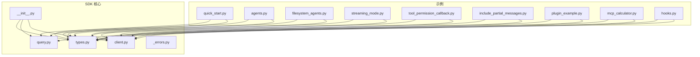
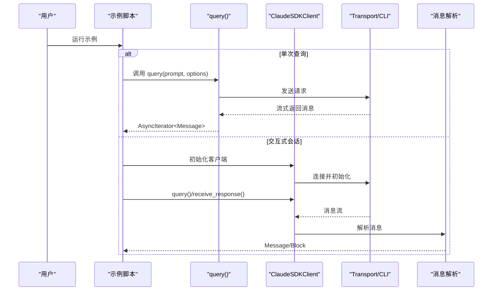
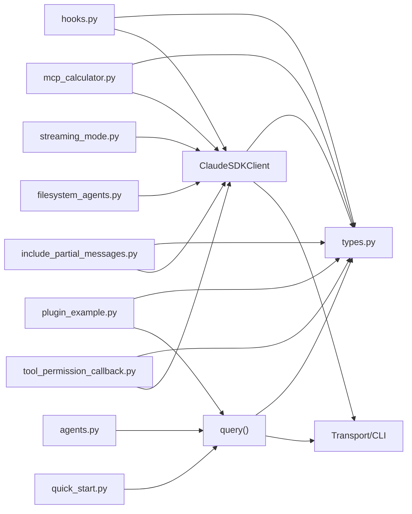

# 实际应用示例

<cite>
**本文引用的文件**
- [README.md](file://README.md)
- [quick_start.py](file://examples/quick_start.py)
- [agents.py](file://examples/agents.py)
- [filesystem_agents.py](file://examples/filesystem_agents.py)
- [streaming_mode.py](file://examples/streaming_mode.py)
- [tool_permission_callback.py](file://examples/tool_permission_callback.py)
- [include_partial_messages.py](file://examples/include_partial_messages.py)
- [plugin_example.py](file://examples/plugin_example.py)
- [mcp_calculator.py](file://examples/mcp_calculator.py)
- [hooks.py](file://examples/hooks.py)
- [__init__.py](file://src/claude_agent_sdk/__init__.py)
- [client.py](file://src/claude_agent_sdk/client.py)
- [query.py](file://src/claude_agent_sdk/query.py)
- [types.py](file://src/claude_agent_sdk/types.py)
- [_errors.py](file://src/claude_agent_sdk/_errors.py)
</cite>

## 目录
1. [简介](#简介)
2. [项目结构](#项目结构)
3. [核心组件](#核心组件)
4. [架构总览](#架构总览)
5. [详细组件分析](#详细组件分析)
6. [依赖分析](#依赖分析)
7. [性能考虑](#性能考虑)
8. [故障排查指南](#故障排查指南)
9. [结论](#结论)
10. [附录](#附录)

## 简介
本文件面向希望使用 Claude Agent SDK 构建实际 AI 应用的开发者，提供从简单到复杂的渐进式示例与最佳实践。内容覆盖：
- 基础查询示例：单次问答与带选项的查询
- 文件系统代理示例：基于设置源加载本地代理
- 交互式聊天示例：多轮对话、并发收发、中断控制、流式输出
- 插件开发示例：本地插件加载与系统消息验证
- 工具权限回调：细粒度控制工具调用与输入修改
- 部分消息包含：实时增量输出与流事件
- MCP 计算器：内嵌 SDK MCP 服务器与自定义工具
- 钩子（Hooks）：预/后置工具使用钩子、会话控制等

示例均来自仓库现有脚本，确保可直接运行；文档同时给出可复用的代码模式、性能优化建议与扩展指导。

## 项目结构
仓库采用“示例 + SDK 核心”的组织方式：
- examples：各类端到端示例，涵盖基础查询、交互式聊天、工具权限、插件、MCP、钩子等
- src/claude_agent_sdk：SDK 核心实现，包含客户端、查询函数、类型定义与错误处理
- README.md：安装、快速开始、使用说明与示例入口

图表来源
- [quick_start.py:1-77](file://examples/quick_start.py#L1-L77)
- [agents.py:1-125](file://examples/agents.py#L1-L125)
- [filesystem_agents.py:1-108](file://examples/filesystem_agents.py#L1-L108)
- [streaming_mode.py:1-512](file://examples/streaming_mode.py#L1-L512)
- [tool_permission_callback.py:1-159](file://examples/tool_permission_callback.py#L1-L159)
- [include_partial_messages.py:1-63](file://examples/include_partial_messages.py#L1-L63)
- [plugin_example.py:1-72](file://examples/plugin_example.py#L1-L72)
- [mcp_calculator.py:1-194](file://examples/mcp_calculator.py#L1-L194)
- [hooks.py:1-351](file://examples/hooks.py#L1-L351)
- [__init__.py:1-445](file://src/claude_agent_sdk/__init__.py#L1-L445)
- [client.py:1-500](file://src/claude_agent_sdk/client.py#L1-L500)
- [query.py:1-127](file://src/claude_agent_sdk/query.py#L1-L127)
- [types.py:1-800](file://src/claude_agent_sdk/types.py#L1-L800)
- [_errors.py:1-57](file://src/claude_agent_sdk/_errors.py#L1-L57)

章节来源
- [README.md:1-360](file://README.md#L1-L360)

## 核心组件
- 查询接口：query() 提供一次性或单向流式查询，适合无状态任务与批处理
- 客户端：ClaudeSDKClient 支持双向、有状态、可中断的交互式会话，适合聊天与长流程
- 类型系统：Message、ContentBlock、ToolUseBlock、ToolResultBlock、SystemMessage、AssistantMessage、ResultMessage 等
- 错误体系：CLIConnectionError、CLINotFoundError、ProcessError、CLIJSONDecodeError 等
- 工具与钩子：工具权限回调、HookMatcher 与多种 Hook 事件
- MCP 服务器：SDK 内嵌 MCP 服务器与工具装饰器

章节来源
- [query.py:1-127](file://src/claude_agent_sdk/query.py#L1-L127)
- [client.py:1-500](file://src/claude_agent_sdk/client.py#L1-L500)
- [types.py:766-800](file://src/claude_agent_sdk/types.py#L766-L800)
- [_errors.py:1-57](file://src/claude_agent_sdk/_errors.py#L1-L57)
- [__init__.py:1-445](file://src/claude_agent_sdk/__init__.py#L1-L445)

## 架构总览
下图展示了 SDK 在不同示例中的使用路径与数据流：

图表来源
- [query.py:12-127](file://src/claude_agent_sdk/query.py#L12-L127)
- [client.py:94-197](file://src/claude_agent_sdk/client.py#L94-L197)
- [types.py:766-800](file://src/claude_agent_sdk/types.py#L766-L800)

## 详细组件分析

### 基础查询示例（quick_start.py）
- 功能要点
  - 使用 query() 执行一次问答
  - 通过 ClaudeAgentOptions 设置 system_prompt、max_turns、allowed_tools 等
  - 处理 AssistantMessage 中的 TextBlock，打印文本内容
  - 对 ResultMessage 中的 cost 进行统计与打印
- 关键点
  - 适合一次性任务与自动化脚本
  - 不支持中断与后续追问
- 参考路径
  - [basic_example:15-24](file://examples/quick_start.py#L15-L24)
  - [with_options_example:27-43](file://examples/quick_start.py#L27-L43)
  - [with_tools_example:46-65](file://examples/quick_start.py#L46-L65)

章节来源
- [quick_start.py:1-77](file://examples/quick_start.py#L1-L77)
- [query.py:12-127](file://src/claude_agent_sdk/query.py#L12-L127)
- [types.py:766-800](file://src/claude_agent_sdk/types.py#L766-L800)

### 文件系统代理示例（filesystem_agents.py）
- 功能要点
  - 通过 setting_sources=["project"] 加载 .claude/agents/ 下的代理定义
  - 使用 ClaudeSDKClient 启动会话，接收 SystemMessage.init 中的 agents 列表
  - 校验是否成功加载指定代理与完整响应链路
- 关键点
  - 适用于在项目中以 Markdown 文件形式维护代理配置
  - 通过 cwd 指定工作目录，确保 .claude/agents/ 路径正确
- 参考路径
  - [extract_agents:28-40](file://examples/filesystem_agents.py#L28-L40)
  - [main:43-104](file://examples/filesystem_agents.py#L43-L104)

章节来源
- [filesystem_agents.py:1-108](file://examples/filesystem_agents.py#L1-L108)
- [client.py:94-197](file://src/claude_agent_sdk/client.py#L94-L197)
- [types.py:797-800](file://src/claude_agent_sdk/types.py#L797-L800)

### 交互式聊天示例（streaming_mode.py）
- 功能要点
  - 基础流式会话、多轮对话、并发收发、中断、手动消息处理、异步迭代提示、Bash 工具使用、控制协议与服务器信息、错误处理
- 关键点
  - receive_response() 自动终止于 ResultMessage
  - receive_messages() 允许自定义消费逻辑
  - interrupt() 需要持续消费消息以生效
  - get_server_info() 获取可用命令与输出样式
- 参考路径
  - [example_basic_streaming:59-71](file://examples/streaming_mode.py#L59-L71)
  - [example_multi_turn_conversation:74-94](file://examples/streaming_mode.py#L74-L94)
  - [example_concurrent_responses:97-130](file://examples/streaming_mode.py#L97-L130)
  - [example_with_interrupt:133-173](file://examples/streaming_mode.py#L133-L173)
  - [example_manual_message_handling:176-210](file://examples/streaming_mode.py#L176-L210)
  - [example_with_options:213-245](file://examples/streaming_mode.py#L213-L245)
  - [example_async_iterable_prompt:248-293](file://examples/streaming_mode.py#L248-L293)
  - [example_bash_command:296-339](file://examples/streaming_mode.py#L296-L339)
  - [example_control_protocol:342-418](file://examples/streaming_mode.py#L342-L418)
  - [example_error_handling:421-464](file://examples/streaming_mode.py#L421-L464)

章节来源
- [streaming_mode.py:1-512](file://examples/streaming_mode.py#L1-L512)
- [client.py:186-499](file://src/claude_agent_sdk/client.py#L186-L499)
- [types.py:766-800](file://src/claude_agent_sdk/types.py#L766-L800)

### 工具权限回调（tool_permission_callback.py）
- 功能要点
  - 使用 can_use_tool 回调控制工具执行，支持自动放行、拒绝、修改输入路径、危险命令检测与日志记录
  - 结合 PermissionResultAllow/PermissionResultDeny 返回决策与更新后的输入
- 关键点
  - 回调需要在流式模式下使用 AsyncIterable 提示
  - 与 permission_mode="default" 配合确保回调被触发
- 参考路径
  - [my_permission_callback:26-94](file://examples/tool_permission_callback.py#L26-L94)
  - [main:96-158](file://examples/tool_permission_callback.py#L96-L158)

章节来源
- [tool_permission_callback.py:1-159](file://examples/tool_permission_callback.py#L1-L159)
- [types.py:124-157](file://src/claude_agent_sdk/types.py#L124-L157)

### 部分消息包含（include_partial_messages.py）
- 功能要点
  - 开启 include_partial_messages 以接收包含增量更新的流事件
  - 适用于实时 UI、监控工具进度、提前获取结果
- 关键点
  - 需 CLI 支持该特性
  - 消息流中会混入 StreamEvent
- 参考路径
  - [main:28-57](file://examples/include_partial_messages.py#L28-L57)

章节来源
- [include_partial_messages.py:1-63](file://examples/include_partial_messages.py#L1-L63)
- [types.py:73-74](file://src/claude_agent_sdk/types.py#L73-L74)

### 插件开发示例（plugin_example.py）
- 功能要点
  - 通过 options.plugins 加载本地插件，检查 SystemMessage.init 中的 plugins 字段
  - 验证插件是否被正确配置
- 关键点
  - 插件路径需指向包含 .claude-plugin/plugin.json 的目录
  - 适合扩展命令、代理、技能与钩子
- 参考路径
  - [plugin_example:23-62](file://examples/plugin_example.py#L23-L62)

章节来源
- [plugin_example.py:1-72](file://examples/plugin_example.py#L1-L72)
- [types.py:642-650](file://src/claude_agent_sdk/types.py#L642-L650)

### MCP 计算器（mcp_calculator.py）
- 功能要点
  - 使用 @tool 装饰器定义计算器工具，create_sdk_mcp_server 创建内嵌 MCP 服务器
  - 通过 allowed_tools 预授权工具，避免权限弹窗
  - 展示 ToolUseBlock 与 ToolResultBlock 的内容提取
- 关键点
  - 内嵌服务器性能更优、部署更简单、调试更便利
  - 支持错误标记与内容返回
- 参考路径
  - [mcp_calculator:138-193](file://examples/mcp_calculator.py#L138-L193)
  - [tool 装饰器与 create_sdk_mcp_server:111-250](file://src/claude_agent_sdk/__init__.py#L111-L250)

章节来源
- [mcp_calculator.py:1-194](file://examples/mcp_calculator.py#L1-L194)
- [__init__.py:111-250](file://src/claude_agent_sdk/__init__.py#L111-L250)
- [types.py:746-763](file://src/claude_agent_sdk/types.py#L746-L763)

### 钩子（Hooks）示例（hooks.py）
- 功能要点
  - 使用 HookMatcher 与 ClaudeAgentOptions.hooks 注册 PreToolUse、PostToolUse、UserPromptSubmit、PermissionRequest 等事件
  - 控制工具执行（allow/deny）、追加上下文、审查输出、停止执行
- 关键点
  - HookJSONOutput 支持 continue_、stopReason、permissionDecision、systemMessage、reason 等字段
  - 与 allowed_tools 配合，实现细粒度安全策略
- 参考路径
  - [check_bash_command:46-70](file://examples/hooks.py#L46-L70)
  - [review_tool_output:85-102](file://examples/hooks.py#L85-L102)
  - [strict_approval_hook:105-135](file://examples/hooks.py#L105-L135)
  - [stop_on_error_hook:138-153](file://examples/hooks.py#L138-L153)
  - [main 示例调度:303-344](file://examples/hooks.py#L303-L344)

章节来源
- [hooks.py:1-351](file://examples/hooks.py#L1-L351)
- [types.py:160-452](file://src/claude_agent_sdk/types.py#L160-L452)

### 代理定义示例（agents.py）
- 功能要点
  - 使用 AgentDefinition 定义代码评审、文档撰写等专用代理
  - 通过 agents 参数注入到查询中，按名称调用
- 关键点
  - 支持 tools、model、description、prompt 等配置
  - 与 setting_sources 结合可实现文件化代理管理
- 参考路径
  - [code_reviewer_example:23-49](file://examples/agents.py#L23-L49)
  - [documentation_writer_example:53-78](file://examples/agents.py#L53-L78)
  - [multiple_agents_example:82-113](file://examples/agents.py#L82-L113)

章节来源
- [agents.py:1-125](file://examples/agents.py#L1-L125)
- [types.py:42-50](file://src/claude_agent_sdk/types.py#L42-L50)

## 依赖分析
- 组件耦合
  - 示例脚本主要依赖 SDK 的 query() 或 ClaudeSDKClient，二者分别面向“一次性”和“交互式”
  - 类型系统贯穿所有示例，用于消息解析与强类型参数传递
  - 工具权限回调与钩子通过 ClaudeAgentOptions 注入，影响工具与会话行为
- 外部依赖
  - Claude Code CLI 作为传输层，默认随包捆绑，可通过环境变量或选项指定路径
- 循环依赖
  - 未发现循环导入；类型系统通过正向引用与运行时占位避免循环

图表来源
- [quick_start.py:1-77](file://examples/quick_start.py#L1-L77)
- [agents.py:1-125](file://examples/agents.py#L1-L125)
- [filesystem_agents.py:1-108](file://examples/filesystem_agents.py#L1-L108)
- [streaming_mode.py:1-512](file://examples/streaming_mode.py#L1-L512)
- [tool_permission_callback.py:1-159](file://examples/tool_permission_callback.py#L1-L159)
- [include_partial_messages.py:1-63](file://examples/include_partial_messages.py#L1-L63)
- [plugin_example.py:1-72](file://examples/plugin_example.py#L1-L72)
- [mcp_calculator.py:1-194](file://examples/mcp_calculator.py#L1-L194)
- [hooks.py:1-351](file://examples/hooks.py#L1-L351)
- [query.py:1-127](file://src/claude_agent_sdk/query.py#L1-L127)
- [client.py:1-500](file://src/claude_agent_sdk/client.py#L1-L500)
- [types.py:1-800](file://src/claude_agent_sdk/types.py#L1-L800)

章节来源
- [__init__.py:1-445](file://src/claude_agent_sdk/__init__.py#L1-L445)

## 性能考虑
- 选择合适的接口
  - 一次性任务优先使用 query()，减少连接与状态管理开销
  - 需要后续追问、中断与动态控制时使用 ClaudeSDKClient
- MCP 服务器
  - 内嵌 SDK MCP 服务器避免进程间通信开销，提升工具调用性能
  - 合理设计工具输入与输出，减少不必要的序列化
- 流式输出
  - 使用 receive_response() 自动终止于 ResultMessage，避免无界等待
  - 在需要实时 UI 的场景启用 include_partial_messages，但注意处理 StreamEvent
- 并发与中断
  - 并发收发时保持后台任务持续消费消息，以便 interrupt 生效
  - 合理设置超时，避免长时间阻塞

## 故障排查指南
- 常见错误与处理
  - CLIConnectionError：检查 CLI 是否已安装与可访问
  - CLINotFoundError：确认 CLI 路径或使用默认捆绑版本
  - ProcessError：查看 exit_code 与 stderr，定位具体失败原因
  - CLIJSONDecodeError：检查 CLI 输出格式，必要时升级 CLI 版本
- 交互式会话问题
  - 中断无效：确保在 receive_response() 或 receive_messages() 的消费循环中
  - 服务器信息为空：确认处于流式模式且已完成初始化
- 权限与工具
  - can_use_tool 回调未触发：确认使用流式提示（AsyncIterable），且未与 permission_prompt_tool_name 同时使用
  - 工具未显示：检查 allowed_tools 与 MCP 服务器状态

章节来源
- [_errors.py:1-57](file://src/claude_agent_sdk/_errors.py#L1-L57)
- [client.py:228-232](file://src/claude_agent_sdk/client.py#L228-L232)
- [streaming_mode.py:421-464](file://examples/streaming_mode.py#L421-L464)

## 结论
通过本指南，您可以基于 Claude Agent SDK 快速构建从简单问答到复杂交互式应用的多种场景。示例覆盖了权限控制、钩子、MCP 工具、插件与流式输出等关键能力。建议在生产环境中结合错误处理、超时控制与资源清理，确保稳定性与可维护性。

## 附录
- 快速开始
  - 安装与基本使用参见 README 的“Installation”与“Quick Start”
- 示例运行
  - 各示例脚本均可直接运行，部分示例支持命令行参数选择具体场景
- 扩展与定制
  - 自定义工具：使用 @tool 与 create_sdk_mcp_server
  - 钩子：通过 HookMatcher 与 ClaudeAgentOptions.hooks 注册
  - 代理：使用 AgentDefinition 与 setting_sources
  - 插件：通过 options.plugins 指定本地插件路径

章节来源
- [README.md:1-360](file://README.md#L1-L360)
- [__init__.py:111-250](file://src/claude_agent_sdk/__init__.py#L111-L250)
- [types.py:42-50](file://src/claude_agent_sdk/types.py#L42-L50)