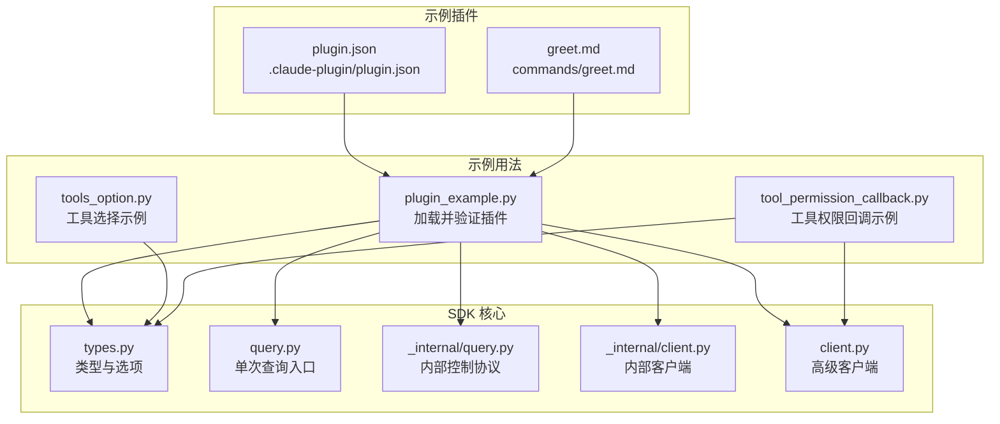
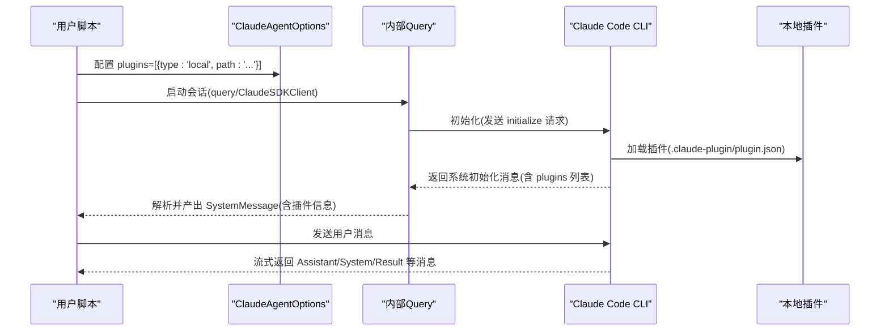
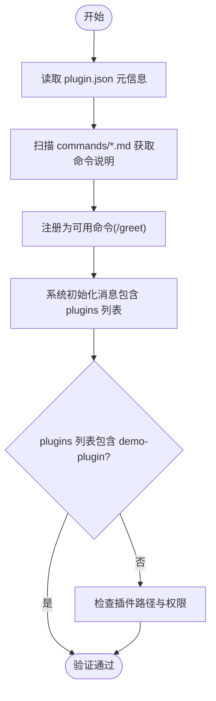
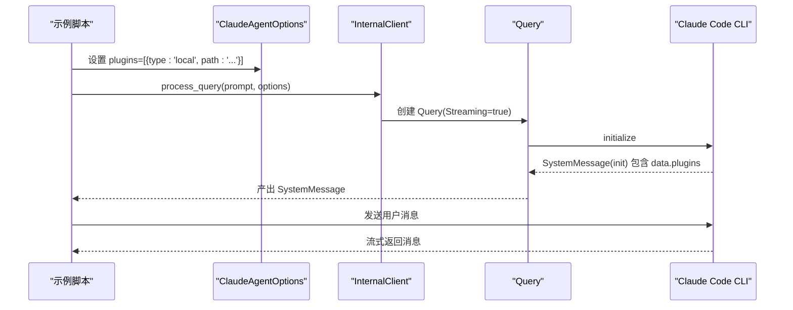
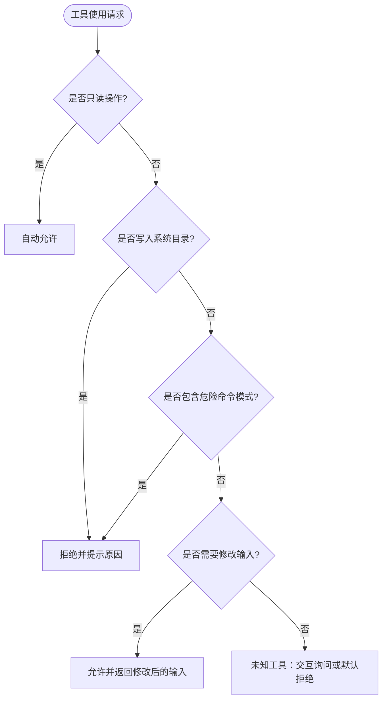
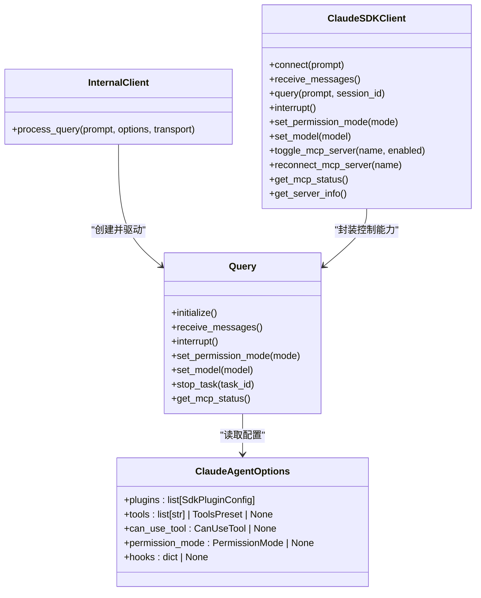
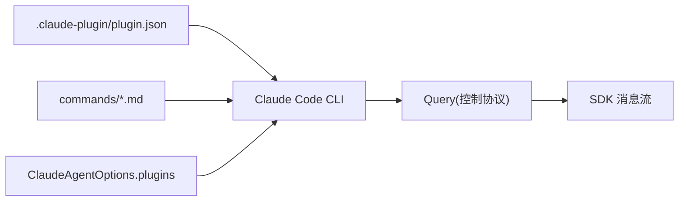

# 插件开发示例

<cite>
**本文档引用的文件**
- [examples/plugins/demo-plugin/.claude-plugin/plugin.json](file://examples/plugins/demo-plugin/.claude-plugin/plugin.json)
- [examples/plugins/demo-plugin/commands/greet.md](file://examples/plugins/demo-plugin/commands/greet.md)
- [examples/plugin_example.py](file://examples/plugin_example.py)
- [src/claude_agent_sdk/types.py](file://src/claude_agent_sdk/types.py)
- [src/claude_agent_sdk/query.py](file://src/claude_agent_sdk/query.py)
- [src/claude_agent_sdk/_internal/query.py](file://src/claude_agent_sdk/_internal/query.py)
- [src/claude_agent_sdk/_internal/client.py](file://src/claude_agent_sdk/_internal/client.py)
- [src/claude_agent_sdk/client.py](file://src/claude_agent_sdk/client.py)
- [examples/tools_option.py](file://examples/tools_option.py)
- [examples/tool_permission_callback.py](file://examples/tool_permission_callback.py)
</cite>

## 目录
1. [简介](#简介)
2. [项目结构](#项目结构)
3. [核心组件](#核心组件)
4. [架构总览](#架构总览)
5. [详细组件分析](#详细组件分析)
6. [依赖关系分析](#依赖关系分析)
7. [性能考虑](#性能考虑)
8. [故障排除指南](#故障排除指南)
9. [结论](#结论)
10. [附录](#附录)

## 简介
本示例文档面向希望使用 Claude Agent SDK 开发 Claude Code 插件的开发者，围绕仓库中的 demo-plugin 展开，系统讲解插件结构、配置文件与命令定义，演示如何通过 SDK 加载本地插件并在系统消息中验证其生效；同时给出插件开发最佳实践（配置、权限管理、错误处理）、插件与主应用的交互方式与数据传递机制，并提供从安装、测试到发布的完整流程以及扩展与定制指导。

## 项目结构
仓库中与插件开发直接相关的目录与文件如下：
- 示例插件：examples/plugins/demo-plugin
  - 配置文件：examples/plugins/demo-plugin/.claude-plugin/plugin.json
  - 自定义命令文档：examples/plugins/demo-plugin/commands/greet.md
- 插件加载示例：examples/plugin_example.py
- SDK 类型与选项：src/claude_agent_sdk/types.py
- 查询与客户端封装：src/claude_agent_sdk/query.py、src/claude_agent_sdk/_internal/query.py、src/claude_agent_sdk/_internal/client.py、src/claude_agent_sdk/client.py
- 工具与权限示例：examples/tools_option.py、examples/tool_permission_callback.py

**图表来源**
- [examples/plugins/demo-plugin/.claude-plugin/plugin.json:1-9](file://examples/plugins/demo-plugin/.claude-plugin/plugin.json#L1-L9)
- [examples/plugins/demo-plugin/commands/greet.md:1-6](file://examples/plugins/demo-plugin/commands/greet.md#L1-L6)
- [examples/plugin_example.py:1-72](file://examples/plugin_example.py#L1-L72)
- [src/claude_agent_sdk/types.py:1030-1099](file://src/claude_agent_sdk/types.py#L1030-L1099)
- [src/claude_agent_sdk/query.py:1-127](file://src/claude_agent_sdk/query.py#L1-L127)
- [src/claude_agent_sdk/_internal/query.py:1-679](file://src/claude_agent_sdk/_internal/query.py#L1-L679)
- [src/claude_agent_sdk/_internal/client.py:1-146](file://src/claude_agent_sdk/_internal/client.py#L1-L146)
- [src/claude_agent_sdk/client.py:1-500](file://src/claude_agent_sdk/client.py#L1-L500)

**章节来源**
- [examples/plugins/demo-plugin/.claude-plugin/plugin.json:1-9](file://examples/plugins/demo-plugin/.claude-plugin/plugin.json#L1-L9)
- [examples/plugins/demo-plugin/commands/greet.md:1-6](file://examples/plugins/demo-plugin/commands/greet.md#L1-L6)
- [examples/plugin_example.py:1-72](file://examples/plugin_example.py#L1-L72)

## 核心组件
- 插件配置与命令
  - 插件配置文件 plugin.json 定义插件名称、描述、版本与作者等元信息。
  - 命令文档 greet.md 提供自定义命令的说明内容，用于在 Claude Code 中呈现。
- SDK 插件加载
  - ClaudeAgentOptions 支持 plugins 字段，传入本地插件路径即可启用。
  - 通过 query 或 ClaudeSDKClient 发起会话时，系统初始化消息中会包含已加载插件信息，便于验证。
- 权限与工具控制
  - 可通过 can_use_tool 回调对工具使用进行细粒度控制，支持修改输入或拒绝危险操作。
  - tools 选项可限制可用工具集，或使用预设工具集。
- 控制协议与消息流
  - 内部 Query 负责与 Claude Code CLI 的双向控制协议通信，处理初始化、工具权限请求、钩子回调与 MCP 消息桥接。

**章节来源**
- [src/claude_agent_sdk/types.py:1083-1084](file://src/claude_agent_sdk/types.py#L1083-L1084)
- [examples/plugin_example.py:31-59](file://examples/plugin_example.py#L31-L59)
- [src/claude_agent_sdk/_internal/query.py:119-163](file://src/claude_agent_sdk/_internal/query.py#L119-L163)
- [examples/tool_permission_callback.py:26-94](file://examples/tool_permission_callback.py#L26-L94)
- [examples/tools_option.py:16-42](file://examples/tools_option.py#L16-L42)

## 架构总览
下图展示了插件从加载到消息流的端到端交互：

**图表来源**
- [examples/plugin_example.py:31-62](file://examples/plugin_example.py#L31-L62)
- [src/claude_agent_sdk/_internal/query.py:119-163](file://src/claude_agent_sdk/_internal/query.py#L119-L163)
- [src/claude_agent_sdk/_internal/client.py:44-145](file://src/claude_agent_sdk/_internal/client.py#L44-L145)

## 详细组件分析

### 组件 A：demo-plugin 结构与配置
- 目录结构
  - .claude-plugin/plugin.json：插件元信息，包含 name、description、version、author。
  - commands/greet.md：自定义命令文档，作为 /greet 命令的说明内容。
- 加载与验证
  - 在 ClaudeAgentOptions.plugins 中声明本地插件路径后，首次收到 SystemMessage(subtype="init") 时，其 data.plugins 即包含该插件信息，可用于确认加载成功。

**图表来源**
- [examples/plugins/demo-plugin/.claude-plugin/plugin.json:1-9](file://examples/plugins/demo-plugin/.claude-plugin/plugin.json#L1-L9)
- [examples/plugins/demo-plugin/commands/greet.md:1-6](file://examples/plugins/demo-plugin/commands/greet.md#L1-L6)
- [examples/plugin_example.py:44-62](file://examples/plugin_example.py#L44-L62)

**章节来源**
- [examples/plugins/demo-plugin/.claude-plugin/plugin.json:1-9](file://examples/plugins/demo-plugin/.claude-plugin/plugin.json#L1-L9)
- [examples/plugins/demo-plugin/commands/greet.md:1-6](file://examples/plugins/demo-plugin/commands/greet.md#L1-L6)
- [examples/plugin_example.py:44-62](file://examples/plugin_example.py#L44-L62)

### 组件 B：插件加载与消息交互
- 加载流程
  - 通过 ClaudeAgentOptions.plugins 指定本地插件路径。
  - 使用 query 或 ClaudeSDKClient 进行会话，内部以 Streaming 模式初始化，发送 initialize 请求。
  - CLI 返回的 SystemMessage(subtype="init") 中 data.plugins 即为已加载插件列表。
- 数据传递
  - 插件元信息与命令说明由 CLI 注入到系统消息中，供上层脚本验证与展示。

**图表来源**
- [examples/plugin_example.py:31-62](file://examples/plugin_example.py#L31-L62)
- [src/claude_agent_sdk/_internal/client.py:44-145](file://src/claude_agent_sdk/_internal/client.py#L44-L145)
- [src/claude_agent_sdk/_internal/query.py:119-163](file://src/claude_agent_sdk/_internal/query.py#L119-L163)

**章节来源**
- [examples/plugin_example.py:31-62](file://examples/plugin_example.py#L31-L62)
- [src/claude_agent_sdk/_internal/client.py:44-145](file://src/claude_agent_sdk/_internal/client.py#L44-L145)
- [src/claude_agent_sdk/_internal/query.py:119-163](file://src/claude_agent_sdk/_internal/query.py#L119-L163)

### 组件 C：工具权限与安全控制
- 工具权限回调
  - 通过 can_use_tool 回调，对每次工具使用请求进行决策，支持允许、拒绝或修改输入。
  - 回调上下文 ToolPermissionContext 提供建议规则等信息，便于策略化处理。
- 工具集合控制
  - tools 可设置为工具名数组、空数组（禁用内置工具）或预设（claude_code）。
- 实践要点
  - 对写入类工具进行路径白/黑名单校验，必要时重定向到安全目录。
  - 对 Bash 等高危命令进行模式匹配与拦截。

**图表来源**
- [examples/tool_permission_callback.py:26-94](file://examples/tool_permission_callback.py#L26-L94)
- [examples/tools_option.py:16-42](file://examples/tools_option.py#L16-L42)
- [src/claude_agent_sdk/types.py:1062-1063](file://src/claude_agent_sdk/types.py#L1062-L1063)

**章节来源**
- [examples/tool_permission_callback.py:26-94](file://examples/tool_permission_callback.py#L26-L94)
- [examples/tools_option.py:16-42](file://examples/tools_option.py#L16-L42)
- [src/claude_agent_sdk/types.py:1062-1063](file://src/claude_agent_sdk/types.py#L1062-L1063)

### 组件 D：SDK 控制协议与消息解析
- 控制协议
  - Query 负责与 CLI 的控制通道通信，处理 can_use_tool、hook_callback、mcp_message 等请求。
  - 支持设置权限模式、模型、任务停止、MCP 服务器启停与重连等。
- 消息解析
  - InternalClient 将底层消息转换为 SDK 的统一 Message 类型（如 UserMessage、AssistantMessage、SystemMessage、ResultMessage 等），供上层消费。

**图表来源**
- [src/claude_agent_sdk/types.py:1030-1099](file://src/claude_agent_sdk/types.py#L1030-L1099)
- [src/claude_agent_sdk/_internal/query.py:53-679](file://src/claude_agent_sdk/_internal/query.py#L53-L679)
- [src/claude_agent_sdk/_internal/client.py:20-146](file://src/claude_agent_sdk/_internal/client.py#L20-L146)
- [src/claude_agent_sdk/client.py:21-500](file://src/claude_agent_sdk/client.py#L21-L500)

**章节来源**
- [src/claude_agent_sdk/types.py:1030-1099](file://src/claude_agent_sdk/types.py#L1030-L1099)
- [src/claude_agent_sdk/_internal/query.py:53-679](file://src/claude_agent_sdk/_internal/query.py#L53-L679)
- [src/claude_agent_sdk/_internal/client.py:20-146](file://src/claude_agent_sdk/_internal/client.py#L20-L146)
- [src/claude_agent_sdk/client.py:21-500](file://src/claude_agent_sdk/client.py#L21-L500)

## 依赖关系分析
- 插件与 SDK 的耦合点
  - 插件通过 .claude-plugin/plugin.json 与 commands/* 文档被 CLI 识别与注入到系统消息。
  - SDK 通过 ClaudeAgentOptions.plugins 将插件路径传递给 CLI，Query 在初始化阶段完成握手。
- 工具与权限的耦合点
  - can_use_tool 与 tools 选项共同决定工具可用性与安全性，二者互斥且需配合 Streaming 模式使用。
- 外部依赖
  - CLI 作为宿主进程，SDK 通过子进程传输层与其通信；MCP 服务器可通过 SDK 桥接。

**图表来源**
- [examples/plugins/demo-plugin/.claude-plugin/plugin.json:1-9](file://examples/plugins/demo-plugin/.claude-plugin/plugin.json#L1-L9)
- [examples/plugins/demo-plugin/commands/greet.md:1-6](file://examples/plugins/demo-plugin/commands/greet.md#L1-L6)
- [examples/plugin_example.py:31-39](file://examples/plugin_example.py#L31-L39)
- [src/claude_agent_sdk/_internal/query.py:119-163](file://src/claude_agent_sdk/_internal/query.py#L119-L163)

**章节来源**
- [examples/plugin_example.py:31-39](file://examples/plugin_example.py#L31-L39)
- [src/claude_agent_sdk/_internal/query.py:119-163](file://src/claude_agent_sdk/_internal/query.py#L119-L163)

## 性能考虑
- 插件加载
  - 本地插件加载发生在初始化阶段，建议将插件目录放置在本地磁盘较近位置，避免网络挂载导致延迟。
- 流式消息
  - 使用 Streaming 模式可降低首包延迟，但需注意内存缓冲与背压控制。
- 工具权限回调
  - 回调逻辑应尽量轻量，避免阻塞控制协议；复杂判断可异步执行并及时返回结果。
- MCP 服务器
  - SDK 桥接的 MCP 服务器方法有限，若频繁交互建议优化工具调用频率与批量处理。

## 故障排除指南
- 插件未出现在系统消息中
  - 确认插件路径正确且可访问；检查 .claude-plugin/plugin.json 是否存在且格式正确。
  - 若插件通过 CLI 参数传入但未显示，可能是 CLI 版本差异导致，可在 SystemMessage 的 data 中查找插件信息。
- 工具权限回调未触发
  - 确保使用了 Streaming 模式（AsyncIterable prompt），且未同时设置 permission_prompt_tool_name。
  - 检查 can_use_tool 回调签名与返回值类型是否符合要求。
- 权限模式与工具行为异常
  - 不同权限模式（default/acceptEdits/bypassPermissions/plan）会影响工具提示与自动批准行为，按需调整。
- MCP 服务器连接问题
  - 使用 get_mcp_status() 查看服务器状态，必要时调用 toggle_mcp_server 或 reconnect_mcp_server。

**章节来源**
- [examples/plugin_example.py:44-62](file://examples/plugin_example.py#L44-L62)
- [src/claude_agent_sdk/_internal/client.py:52-71](file://src/claude_agent_sdk/_internal/client.py#L52-L71)
- [src/claude_agent_sdk/client.py:234-360](file://src/claude_agent_sdk/client.py#L234-L360)

## 结论
通过 demo-plugin 与 SDK 的结合，开发者可以快速扩展 Claude Code 的功能边界：以最小成本添加自定义命令与说明文档，并借助 SDK 的插件加载、工具权限控制与消息流机制，构建安全、可控且可维护的自动化工作流。遵循本文的最佳实践与流程，可显著提升插件开发效率与稳定性。

## 附录

### 插件开发最佳实践
- 配置
  - 使用 .claude-plugin/plugin.json 提供清晰的元信息；commands 下的文档应简洁明确，便于用户理解命令用途。
- 权限管理
  - 默认采用“需要确认”的权限模式，对高危工具与系统目录进行严格限制；必要时通过 can_use_tool 动态调整输入。
- 错误处理
  - 在回调中捕获异常并返回明确的拒绝信息；对不可恢复错误及时中断会话并记录日志。
- 性能与可靠性
  - 减少插件启动时的 IO 操作；对工具调用进行批量化与去重；合理设置超时与重试策略。

### 插件安装、测试与发布流程
- 安装
  - 将插件目录放置于本地任意路径，确保 CLI 可访问；在 ClaudeAgentOptions.plugins 中指定 type='local' 与 path。
- 测试
  - 使用 examples/plugin_example.py 验证插件是否被加载；通过 SystemMessage 的 data.plugins 确认插件信息。
  - 使用 examples/tools_option.py 与 examples/tool_permission_callback.py 验证工具集合与权限控制。
- 发布
  - 将 .claude-plugin/plugin.json 与 commands 文档整理为可分发包；在 CI 中加入单元测试与集成测试，确保跨平台兼容性。