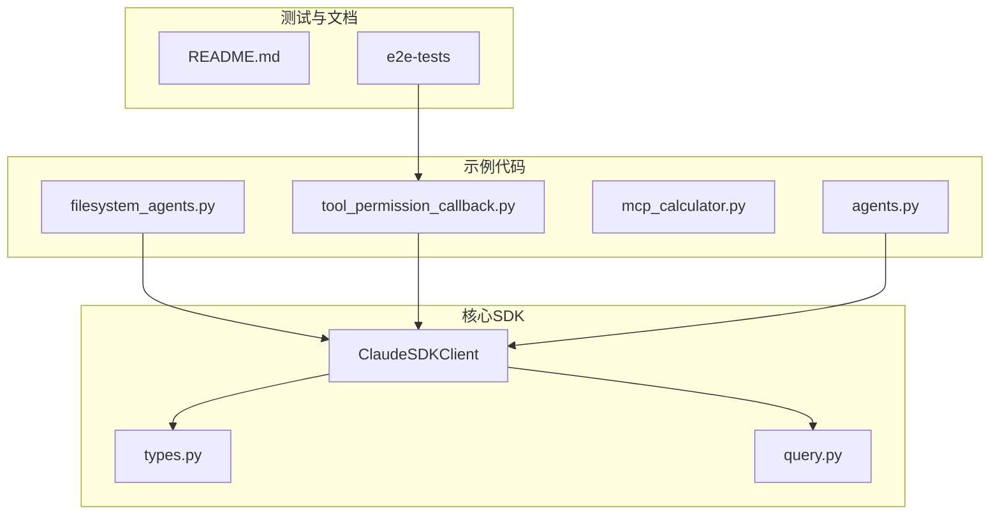
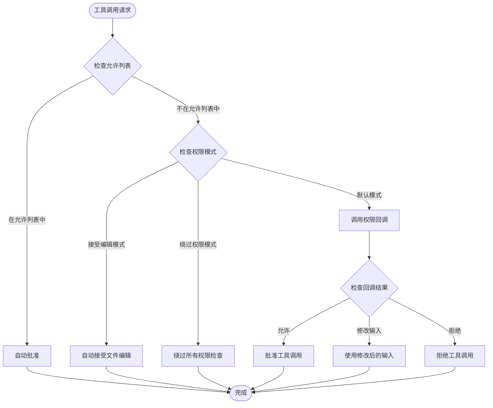
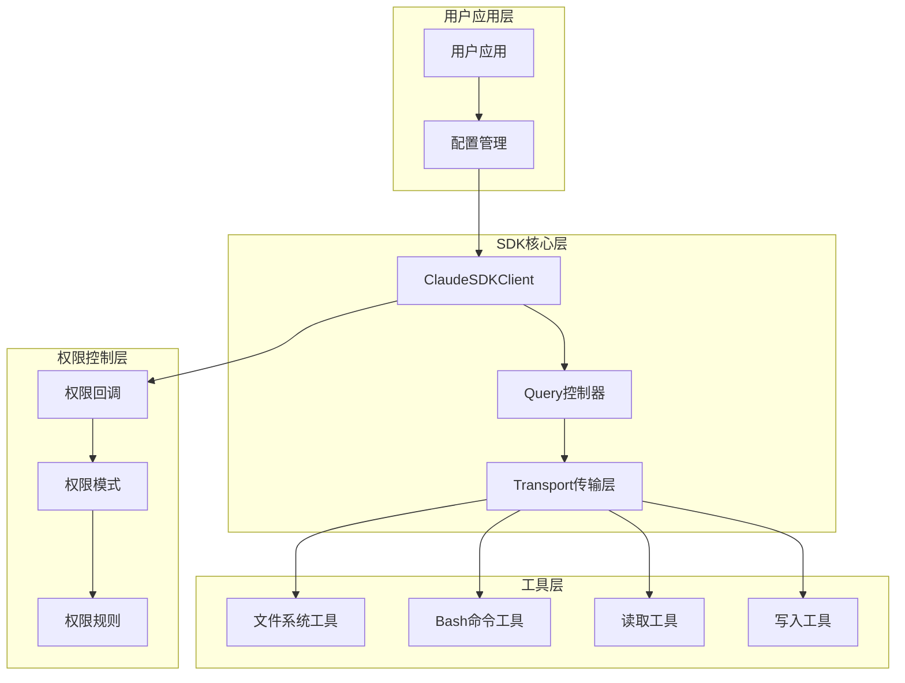
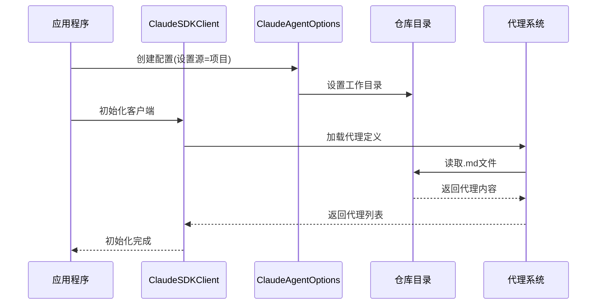
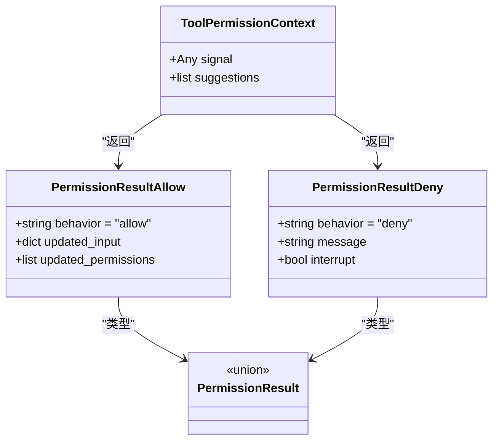
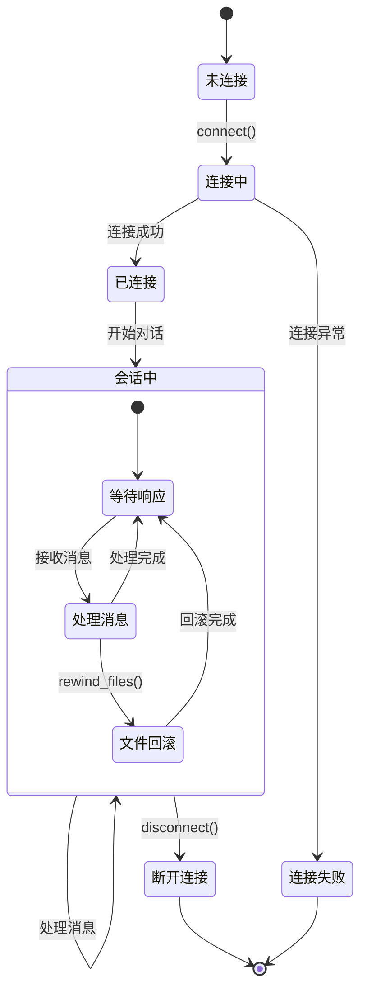
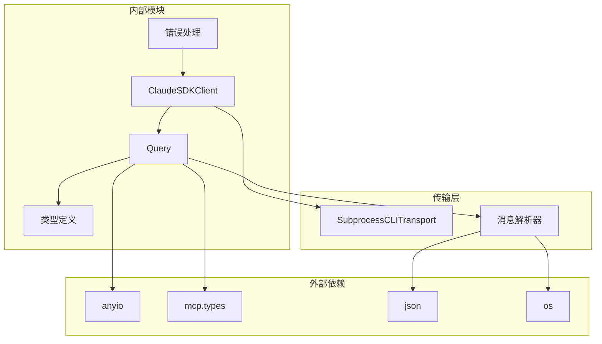
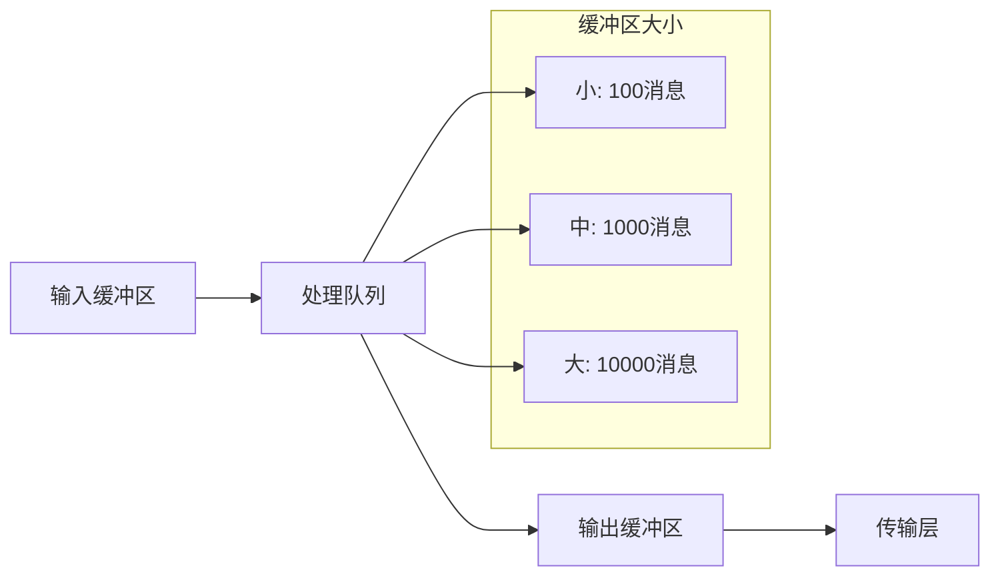

# 文件系统代理示例

<cite>
**本文档引用的文件**
- [filesystem_agents.py](file://examples/filesystem_agents.py)
- [client.py](file://src/claude_agent_sdk/client.py)
- [types.py](file://src/claude_agent_sdk/types.py)
- [query.py](file://src/claude_agent_sdk/_internal/query.py)
- [tool_permission_callback.py](file://examples/tool_permission_callback.py)
- [README.md](file://README.md)
- [test_tool_permissions.py](file://e2e-tests/test_tool_permissions.py)
</cite>

## 目录
1. [简介](#简介)
2. [项目结构](#项目结构)
3. [核心组件](#核心组件)
4. [架构概览](#架构概览)
5. [详细组件分析](#详细组件分析)
6. [依赖分析](#依赖分析)
7. [性能考虑](#性能考虑)
8. [故障排除指南](#故障排除指南)
9. [结论](#结论)
10. [附录](#附录)

## 简介

本文件系统代理示例文档展示了如何使用 Claude Agent SDK 构建能够操作文件系统的 AI 代理。该示例重点演示了以下核心功能：

- 文件系统代理的加载与配置
- 工具权限控制机制
- 文件读取、写入、搜索等操作的实现
- 会话管理和状态跟踪
- 安全考虑与最佳实践
- 错误处理与异常情况处理

通过本示例，开发者可以理解如何在受控环境中安全地让 AI 代理执行文件系统操作，并建立一套完整的文件系统代理开发工作流程。

## 项目结构

该项目采用模块化设计，主要包含以下关键目录和文件：



**图表来源**
- [filesystem_agents.py:1-108](file://examples/filesystem_agents.py#L1-L108)
- [client.py:1-500](file://src/claude_agent_sdk/client.py#L1-L500)
- [types.py:1-800](file://src/claude_agent_sdk/types.py#L1-L800)

**章节来源**
- [filesystem_agents.py:1-108](file://examples/filesystem_agents.py#L1-L108)
- [README.md:1-360](file://README.md#L1-L360)

## 核心组件

### ClaudeSDKClient 类

ClaudeSDKClient 是 SDK 的核心客户端类，提供了与 Claude Code 的双向交互能力：

- **双向通信**：支持实时消息发送和接收
- **状态保持**：维护对话上下文跨消息传递
- **交互式会话**：支持基于 Claude 响应的后续提问
- **权限控制**：集成工具权限回调机制

### ClaudeAgentOptions 配置类

ClaudeAgentOptions 提供了丰富的配置选项：

- **工具权限**：`allowed_tools`、`disallowed_tools`、`can_use_tool`
- **代理定义**：`agents` 字典配置自定义代理
- **设置源**：`setting_sources` 支持用户、项目、本地设置
- **工作目录**：`cwd` 指定工作环境路径
- **沙箱配置**：`sandbox` 控制 bash 命令隔离

### 权限控制系统

SDK 实现了多层次的权限控制机制：



**图表来源**
- [types.py:1030-1199](file://src/claude_agent_sdk/types.py#L1030-L1199)
- [query.py:245-286](file://src/claude_agent_sdk/_internal/query.py#L245-L286)

**章节来源**
- [client.py:21-500](file://src/claude_agent_sdk/client.py#L21-L500)
- [types.py:1030-1199](file://src/claude_agent_sdk/types.py#L1030-L1199)

## 架构概览

文件系统代理的整体架构如下：



**图表来源**
- [client.py:94-185](file://src/claude_agent_sdk/client.py#L94-L185)
- [query.py:53-112](file://src/claude_agent_sdk/_internal/query.py#L53-L112)

## 详细组件分析

### 文件系统代理示例分析

filesystem_agents.py 展示了如何加载基于文件系统的代理：



**图表来源**
- [filesystem_agents.py:42-108](file://examples/filesystem_agents.py#L42-L108)

该示例的关键特性包括：

- **设置源配置**：使用 `setting_sources=["project"]` 从项目目录加载代理
- **工作目录设置**：通过 `cwd` 参数指定 SDK 仓库目录
- **代理发现机制**：自动扫描 `.claude/agents/` 目录下的代理文件
- **消息流处理**：正确处理系统初始化消息、助手响应和结果消息

**章节来源**
- [filesystem_agents.py:28-108](file://examples/filesystem_agents.py#L28-L108)

### 工具权限回调机制

tool_permission_callback.py 展示了完整的工具权限控制实现：



**图表来源**
- [types.py:124-157](file://src/claude_agent_sdk/types.py#L124-L157)
- [types.py:135-153](file://src/claude_agent_sdk/types.py#L135-L153)

权限控制的具体实现包括：

- **只读操作自动允许**：对 Read、Glob、Grep 等只读工具直接放行
- **写入操作安全检查**：阻止对系统目录的写入操作
- **输入数据修改**：对非安全路径进行重定向处理
- **危险命令检测**：识别并阻止潜在破坏性命令
- **未知工具询问**：对未预定义的工具请求人工确认

**章节来源**
- [tool_permission_callback.py:26-94](file://examples/tool_permission_callback.py#L26-L94)
- [types.py:124-157](file://src/claude_agent_sdk/types.py#L124-L157)

### 会话管理与状态跟踪

SDK 提供了完整的会话管理功能：



**图表来源**
- [client.py:484-500](file://src/claude_agent_sdk/client.py#L484-L500)
- [query.py:614-631](file://src/claude_agent_sdk/_internal/query.py#L614-L631)

## 依赖分析

SDK 的依赖关系图：



**图表来源**
- [client.py:1-500](file://src/claude_agent_sdk/client.py#L1-L500)
- [query.py:1-679](file://src/claude_agent_sdk/_internal/query.py#L1-L679)

**章节来源**
- [client.py:1-500](file://src/claude_agent_sdk/client.py#L1-L500)
- [query.py:1-679](file://src/claude_agent_sdk/_internal/query.py#L1-L679)

## 性能考虑

### 异步I/O优化

SDK 采用异步编程模型以提高性能：

- **内存对象流**：使用 `anyio.create_memory_object_stream` 实现高效的内存消息传递
- **任务组管理**：通过 `anyio.create_task_group` 管理并发任务
- **流式处理**：支持流式消息处理，避免大消息的内存峰值

### 缓冲区管理



**图表来源**
- [query.py:105-108](file://src/claude_agent_sdk/_internal/query.py#L105-L108)

### 超时管理

SDK 实现了多级超时控制：

- **初始化超时**：通过 `CLAUDE_CODE_STREAM_CLOSE_TIMEOUT` 环境变量配置
- **控制请求超时**：默认60秒，可自定义
- **流关闭超时**：等待第一个结果后关闭stdin的时间

## 故障排除指南

### 常见问题与解决方案

#### 权限回调未触发

**问题描述**：工具权限回调没有被调用

**可能原因**：
- 使用了自动允许的只读工具（如 `echo`）
- 配置了绕过权限模式
- 工具名称不匹配

**解决方案**：
- 使用需要权限的工具（如 `touch`）进行测试
- 确保设置了合适的权限模式
- 验证工具名称的准确性

#### 文件系统操作失败

**问题描述**：文件读写操作失败

**可能原因**：
- 路径权限不足
- 目标目录不存在
- 文件被其他进程占用

**解决方案**：
- 检查目标路径的读写权限
- 确认目录存在且可访问
- 关闭可能占用文件的其他进程

#### 会话状态异常

**问题描述**：会话状态不一致或消息丢失

**可能原因**：
- 异步任务取消
- 传输层中断
- 缓冲区溢出

**解决方案**：
- 检查异步运行时上下文的一致性
- 验证传输连接的稳定性
- 调整缓冲区大小参数

**章节来源**
- [test_tool_permissions.py:17-66](file://e2e-tests/test_tool_permissions.py#L17-L66)

## 结论

本文件系统代理示例展示了如何使用 Claude Agent SDK 构建安全、可控的文件系统操作代理。通过实现多层次的权限控制、完善的错误处理机制和高效的异步处理架构，该示例为实际生产环境中的文件系统代理开发提供了完整的参考框架。

关键要点包括：
- 建立清晰的权限边界和安全策略
- 实现灵活的工具权限回调机制
- 设计健壮的会话管理和状态跟踪
- 采用异步编程模型提升性能
- 提供完善的错误处理和故障恢复机制

这些实践为构建企业级的 AI 文件系统代理奠定了坚实基础。

## 附录

### 快速开始模板

以下是一个最小化的文件系统代理配置模板：

```python
from claude_agent_sdk import (
    ClaudeAgentOptions,
    ClaudeSDKClient,
    AssistantMessage,
    TextBlock
)

# 基础配置
options = ClaudeAgentOptions(
    allowed_tools=["Read", "Write", "Grep", "Bash"],
    permission_mode="default",
    cwd="./project"
)

# 创建客户端
async with ClaudeSDKClient(options) as client:
    # 发送文件系统操作请求
    await client.query("请列出当前目录的所有Python文件")
    
    # 处理响应
    async for message in client.receive_response():
        if isinstance(message, AssistantMessage):
            for block in message.content:
                if isinstance(block, TextBlock):
                    print(f"Claude: {block.text}")
```

### 扩展指导

#### 添加自定义工具

要添加新的文件系统工具，可以使用 SDK MCP 服务器：

```python
from claude_agent_sdk import tool, create_sdk_mcp_server

@tool("custom_file_operation", "自定义文件操作", {
    "file_path": str,
    "operation": str
})
async def custom_operation(args):
    # 实现自定义文件操作逻辑
    return {"content": [{"type": "text", "text": "操作完成"}]}

# 创建MCP服务器
server = create_sdk_mcp_server(
    name="custom-tools",
    version="1.0.0",
    tools=[custom_operation]
)
```

#### 高级权限控制

实现更精细的权限控制：

```python
async def advanced_permission_callback(
    tool_name: str,
    input_data: dict,
    context: ToolPermissionContext
) -> PermissionResult:
    
    # 基于用户角色的权限控制
    user_role = get_current_user_role()
    
    # 基于时间的访问控制
    current_time = datetime.now()
    if tool_name in ["Write", "Edit"] and current_time.hour < 9:
        return PermissionResultDeny("非工作时间禁止文件修改")
    
    # 动态权限调整
    if tool_name == "Bash":
        modified_input = input_data.copy()
        modified_input["timeout"] = min(input_data.get("timeout", 30), 60)
        return PermissionResultAllow(updated_input=modified_input)
    
    return PermissionResultAllow()
```