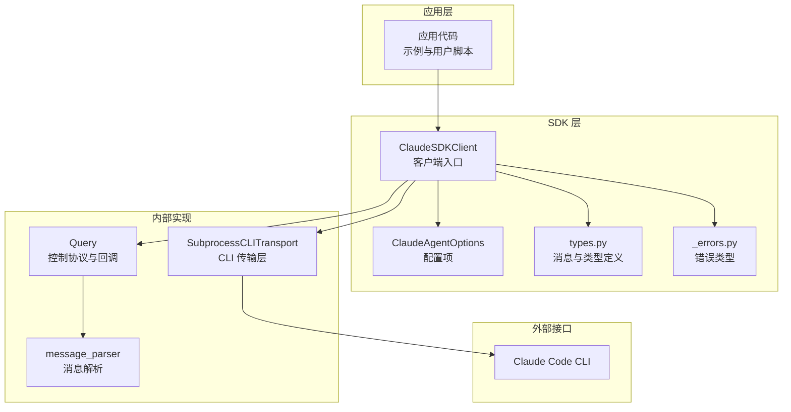
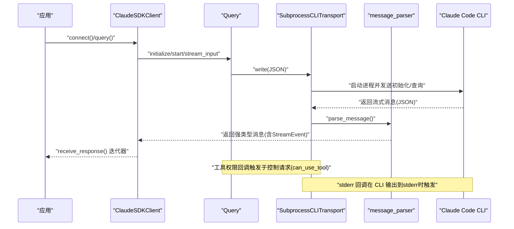
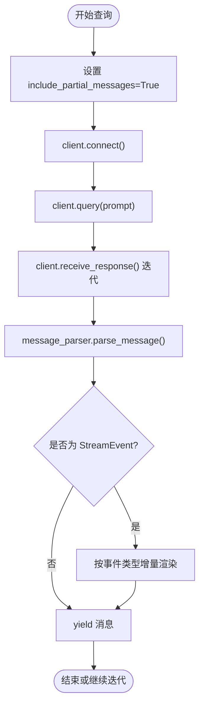
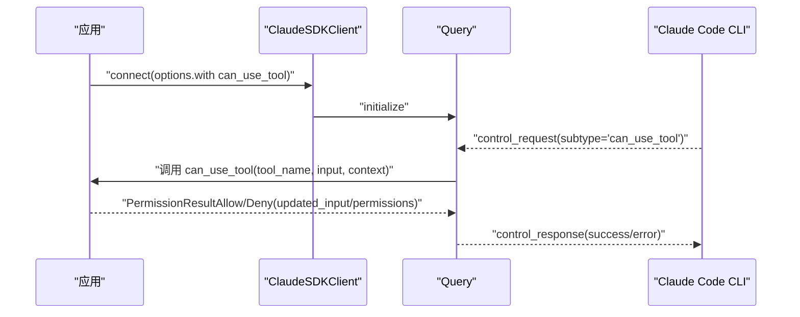
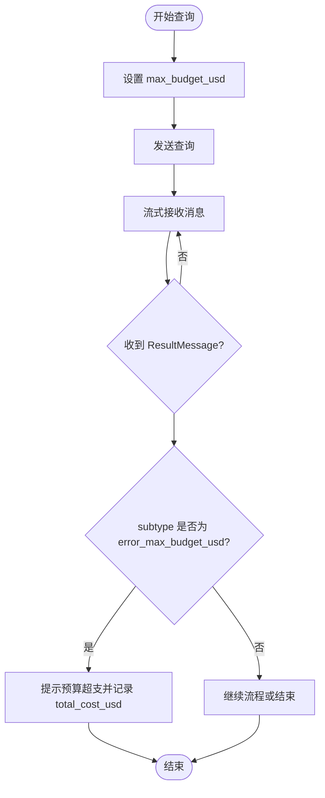
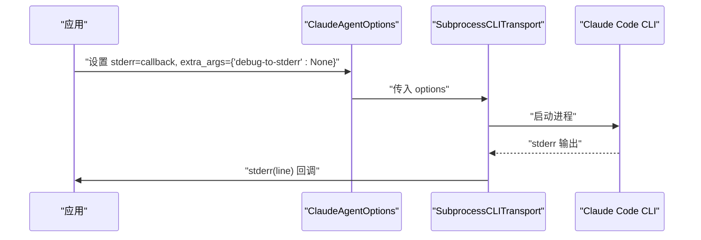
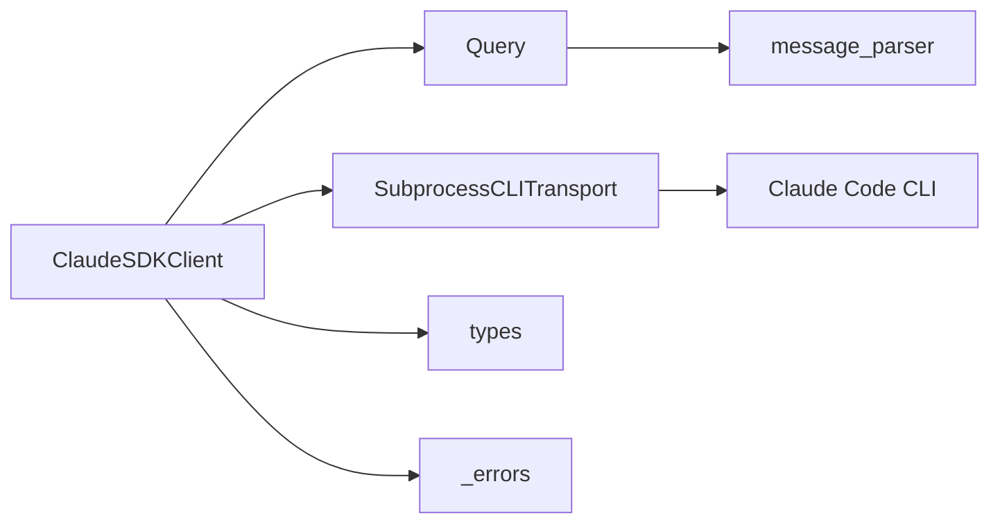

# 高级特性示例

<cite>
**本文引用的文件**
- [examples/include_partial_messages.py](file://examples/include_partial_messages.py)
- [examples/tool_permission_callback.py](file://examples/tool_permission_callback.py)
- [examples/max_budget_usd.py](file://examples/max_budget_usd.py)
- [examples/stderr_callback_example.py](file://examples/stderr_callback_example.py)
- [src/claude_agent_sdk/client.py](file://src/claude_agent_sdk/client.py)
- [src/claude_agent_sdk/types.py](file://src/claude_agent_sdk/types.py)
- [src/claude_agent_sdk/_internal/query.py](file://src/claude_agent_sdk/_internal/query.py)
- [src/claude_agent_sdk/_internal/message_parser.py](file://src/claude_agent_sdk/_internal/message_parser.py)
- [src/claude_agent_sdk/_internal/transport/subprocess_cli.py](file://src/claude_agent_sdk/_internal/transport/subprocess_cli.py)
- [src/claude_agent_sdk/_errors.py](file://src/claude_agent_sdk/_errors.py)
- [e2e-tests/test_include_partial_messages.py](file://e2e-tests/test_include_partial_messages.py)
- [e2e-tests/test_tool_permissions.py](file://e2e-tests/test_tool_permissions.py)
- [e2e-tests/test_stderr_callback.py](file://e2e-tests/test_stderr_callback.py)
</cite>

## 目录
1. [简介](#简介)
2. [项目结构](#项目结构)
3. [核心组件](#核心组件)
4. [架构总览](#架构总览)
5. [详细组件分析](#详细组件分析)
6. [依赖分析](#依赖分析)
7. [性能考虑](#性能考虑)
8. [故障排查指南](#故障排查指南)
9. [结论](#结论)
10. [附录](#附录)

## 简介
本文件面向希望在 Claude Agent SDK 中使用高级特性的开发者，系统性讲解以下能力与实践：
- 流式响应中的部分消息（partial messages）：如何接收增量内容、解析流事件、提升交互体验
- 工具权限回调：动态权限检查、输入修改、权限建议与更新机制
- 预算限制（max_budget_usd）：如何设置成本上限、识别超支状态、进行成本控制
- 标准错误回调（stderr 回调）：捕获 CLI 调试输出，辅助诊断与日志记录
- 性能优化与资源管理：缓冲区大小、流关闭策略、任务组生命周期等最佳实践

## 项目结构
围绕高级特性，SDK 的关键模块与文件如下：
- 客户端与选项：ClaudeSDKClient、ClaudeAgentOptions
- 控制协议与消息解析：Query、message_parser
- 传输层：SubprocessCLITransport（stderr 回调、进程与流管理）
- 类型与错误：types、_errors
- 示例与端到端测试：examples/*、e2e-tests/*

图表来源
- [src/claude_agent_sdk/client.py](file://src/claude_agent_sdk/client.py)
- [src/claude_agent_sdk/_internal/query.py](file://src/claude_agent_sdk/_internal/query.py)
- [src/claude_agent_sdk/_internal/message_parser.py](file://src/claude_agent_sdk/_internal/message_parser.py)
- [src/claude_agent_sdk/_internal/transport/subprocess_cli.py](file://src/claude_agent_sdk/_internal/transport/subprocess_cli.py)
- [src/claude_agent_sdk/types.py](file://src/claude_agent_sdk/types.py)
- [src/claude_agent_sdk/_errors.py](file://src/claude_agent_sdk/_errors.py)

章节来源
- [src/claude_agent_sdk/client.py](file://src/claude_agent_sdk/client.py)
- [src/claude_agent_sdk/types.py](file://src/claude_agent_sdk/types.py)

## 核心组件
- ClaudeSDKClient：提供连接、查询、中断、权限模式切换、模型切换、MCP 管理、任务控制等能力；支持流式响应迭代器 receive_response
- ClaudeAgentOptions：承载所有高级特性开关与参数，如 include_partial_messages、max_budget_usd、stderr 回调、工具权限回调、钩子等
- Query：封装控制协议请求/响应、工具权限回调、钩子回调、SDK MCP 桥接、流关闭策略
- message_parser：将 CLI 输出的原始消息解析为强类型对象（含 StreamEvent）
- SubprocessCLITransport：负责 CLI 进程启动、stdin/stdout/stderr 读写、stderr 回调分发、缓冲区与退出码处理

章节来源
- [src/claude_agent_sdk/client.py](file://src/claude_agent_sdk/client.py)
- [src/claude_agent_sdk/types.py](file://src/claude_agent_sdk/types.py)
- [src/claude_agent_sdk/_internal/query.py](file://src/claude_agent_sdk/_internal/query.py)
- [src/claude_agent_sdk/_internal/message_parser.py](file://src/claude_agent_sdk/_internal/message_parser.py)
- [src/claude_agent_sdk/_internal/transport/subprocess_cli.py](file://src/claude_agent_sdk/_internal/transport/subprocess_cli.py)

## 架构总览
下图展示了从应用发起查询到最终消费消息的完整链路，重点标注了部分消息、权限回调、预算检查与 stderr 回调的关键节点。

图表来源
- [src/claude_agent_sdk/client.py](file://src/claude_agent_sdk/client.py)
- [src/claude_agent_sdk/_internal/query.py](file://src/claude_agent_sdk/_internal/query.py)
- [src/claude_agent_sdk/_internal/message_parser.py](file://src/claude_agent_sdk/_internal/message_parser.py)
- [src/claude_agent_sdk/_internal/transport/subprocess_cli.py](file://src/claude_agent_sdk/_internal/transport/subprocess_cli.py)

## 详细组件分析

### 部分消息（流式增量）示例与实现
- 功能说明
  - 通过 ClaudeAgentOptions.include_partial_messages 启用后，CLI 将返回包含 StreamEvent 的增量事件，用于实时展示思考过程、文本增量等
  - 应用侧通过 receive_response 或 receive_messages 获取消息，其中包含 StreamEvent 以及常规消息（Assistant/System/Result）
- 关键实现点
  - 客户端 connect 时自动启用流式模式，Query.initialize 发送钩子与代理配置
  - message_parser 解析出 StreamEvent，并携带原始事件内容，便于上层按需渲染
  - e2e 测试验证了包含 partial messages 时出现多种 StreamEvent 类型（如 message_start/content_block_start/delta/stop），以及 ThinkingBlock 的增量拼接
- 使用建议
  - 在需要“打字机”效果或进度反馈的场景启用
  - 注意处理多类消息混合，区分增量事件与最终结果

图表来源
- [examples/include_partial_messages.py](file://examples/include_partial_messages.py)
- [src/claude_agent_sdk/_internal/message_parser.py](file://src/claude_agent_sdk/_internal/message_parser.py)
- [e2e-tests/test_include_partial_messages.py](file://e2e-tests/test_include_partial_messages.py)

章节来源
- [examples/include_partial_messages.py](file://examples/include_partial_messages.py)
- [src/claude_agent_sdk/_internal/message_parser.py](file://src/claude_agent_sdk/_internal/message_parser.py)
- [e2e-tests/test_include_partial_messages.py](file://e2e-tests/test_include_partial_messages.py)

### 工具权限回调（动态权限检查与更新）
- 功能说明
  - 通过 ClaudeAgentOptions.can_use_tool 提供异步回调，在每次工具调用前决定允许/拒绝，并可修改输入或更新权限规则
  - 支持 ToolPermissionContext，其中包含 CLI 建议的权限更新列表
- 关键实现点
  - ClaudeSDKClient.connect 会校验 can_use_tool 与 permission_prompt_tool_name 的互斥关系，并在需要时设置 permission_prompt_tool_name="stdio"
  - Query._handle_control_request 接收 CLI 的 can_use_tool 控制请求，调用回调并转换为控制响应
  - types 中定义了 PermissionResultAllow/PermissionResultDeny、ToolPermissionContext、PermissionUpdate 等类型
- 使用建议
  - 对写操作、危险命令进行白/黑名单过滤
  - 对路径进行安全重定向，避免写入系统目录
  - 结合 CLI 权限建议（suggestions）动态调整权限策略

图表来源
- [src/claude_agent_sdk/client.py](file://src/claude_agent_sdk/client.py)
- [src/claude_agent_sdk/_internal/query.py](file://src/claude_agent_sdk/_internal/query.py)
- [src/claude_agent_sdk/types.py](file://src/claude_agent_sdk/types.py)
- [examples/tool_permission_callback.py](file://examples/tool_permission_callback.py)
- [e2e-tests/test_tool_permissions.py](file://e2e-tests/test_tool_permissions.py)

章节来源
- [src/claude_agent_sdk/client.py](file://src/claude_agent_sdk/client.py)
- [src/claude_agent_sdk/_internal/query.py](file://src/claude_agent_sdk/_internal/query.py)
- [src/claude_agent_sdk/types.py](file://src/claude_agent_sdk/types.py)
- [examples/tool_permission_callback.py](file://examples/tool_permission_callback.py)
- [e2e-tests/test_tool_permissions.py](file://e2e-tests/test_tool_permissions.py)

### 预算限制（max_budget_usd）与成本控制
- 功能说明
  - 通过 ClaudeAgentOptions.max_budget_usd 设置单次查询/会话的预算上限
  - 当累计成本超过预算时，ResultMessage.subtype 可能为 error_max_budget_usd，表示预算超支
  - 预算检查发生在每次 API 调用完成后，最终可能略高于设定值（最多一个调用的成本）
- 关键实现点
  - SubprocessCLITransport 在构建 CLI 命令时传递 max_budget_usd 参数
  - 测试覆盖了预算未超、合理预算与紧预算三种情形，验证 ResultMessage.subtype 与 total_cost_usd
- 使用建议
  - 为复杂任务设置合理预算，结合流式响应逐步评估成本
  - 在 UI 中显示当前消耗与剩余预算，提示用户及时中止

图表来源
- [examples/max_budget_usd.py](file://examples/max_budget_usd.py)
- [src/claude_agent_sdk/_internal/transport/subprocess_cli.py](file://src/claude_agent_sdk/_internal/transport/subprocess_cli.py)
- [tests/test_integration.py](file://tests/test_integration.py)

章节来源
- [examples/max_budget_usd.py](file://examples/max_budget_usd.py)
- [src/claude_agent_sdk/_internal/transport/subprocess_cli.py](file://src/claude_agent_sdk/_internal/transport/subprocess_cli.py)
- [tests/test_integration.py](file://tests/test_integration.py)

### 标准错误回调（stderr 回调）与调试输出
- 功能说明
  - 通过 ClaudeAgentOptions.stderr 提供回调函数，捕获 CLI 输出到 stderr 的每一行
  - 可配合 extra_args={"debug-to-stderr": None} 启用 CLI 调试输出
- 关键实现点
  - SubprocessCLITransport._handle_stderr 逐行读取 stderr 并调用回调
  - e2e 测试验证开启 debug 模式后能捕获到 DEBUG 行，关闭时则不会
- 使用建议
  - 在开发与排障阶段启用 debug-to-stderr 并记录 stderr 回调
  - 对 ERROR 等关键字进行过滤与告警

图表来源
- [examples/stderr_callback_example.py](file://examples/stderr_callback_example.py)
- [src/claude_agent_sdk/_internal/transport/subprocess_cli.py](file://src/claude_agent_sdk/_internal/transport/subprocess_cli.py)
- [e2e-tests/test_stderr_callback.py](file://e2e-tests/test_stderr_callback.py)

章节来源
- [examples/stderr_callback_example.py](file://examples/stderr_callback_example.py)
- [src/claude_agent_sdk/_internal/transport/subprocess_cli.py](file://src/claude_agent_sdk/_internal/transport/subprocess_cli.py)
- [e2e-tests/test_stderr_callback.py](file://e2e-tests/test_stderr_callback.py)

## 依赖分析
- 组件耦合
  - ClaudeSDKClient 依赖 Query 与 Transport，负责高层控制与消息迭代
  - Query 依赖 Transport 进行双向通信，依赖 message_parser 进行消息解析
  - SubprocessCLITransport 依赖 CLI 可执行文件，负责进程生命周期与流管理
- 外部依赖
  - CLI 版本要求与路径查找、环境变量（如 CLAUDE_CODE_STREAM_CLOSE_TIMEOUT）、最大缓冲区大小
- 循环依赖
  - 未发现直接循环依赖；Query 与 Transport 通过接口解耦

图表来源
- [src/claude_agent_sdk/client.py](file://src/claude_agent_sdk/client.py)
- [src/claude_agent_sdk/_internal/query.py](file://src/claude_agent_sdk/_internal/query.py)
- [src/claude_agent_sdk/_internal/message_parser.py](file://src/claude_agent_sdk/_internal/message_parser.py)
- [src/claude_agent_sdk/_internal/transport/subprocess_cli.py](file://src/claude_agent_sdk/_internal/transport/subprocess_cli.py)
- [src/claude_agent_sdk/types.py](file://src/claude_agent_sdk/types.py)
- [src/claude_agent_sdk/_errors.py](file://src/claude_agent_sdk/_errors.py)

章节来源
- [src/claude_agent_sdk/client.py](file://src/claude_agent_sdk/client.py)
- [src/claude_agent_sdk/_internal/query.py](file://src/claude_agent_sdk/_internal/query.py)
- [src/claude_agent_sdk/_internal/transport/subprocess_cli.py](file://src/claude_agent_sdk/_internal/transport/subprocess_cli.py)

## 性能考虑
- 流关闭策略
  - Query.wait_for_result_and_end_input 会在存在 SDK MCP 或钩子时等待首个结果后再关闭 stdin，避免控制通道未就绪导致的阻塞
  - 通过 CLAUDE_CODE_STREAM_CLOSE_TIMEOUT 控制等待时间，默认毫秒转秒，最小 60 秒
- 缓冲区与内存
  - SubprocessCLITransport 支持 max_buffer_size 自定义 stdout 缓冲上限，默认 1MB，避免大流量输出造成内存压力
- 任务组生命周期
  - ClaudeSDKClient 限制实例不可跨异步运行时上下文使用，避免任务组状态不一致
- 建议
  - 在高并发或多会话场景中，合理设置 max_buffer_size 与超时时间
  - 对长耗时任务使用 receive_response 的迭代方式，尽早释放中间消息占用

章节来源
- [src/claude_agent_sdk/_internal/query.py](file://src/claude_agent_sdk/_internal/query.py)
- [src/claude_agent_sdk/_internal/transport/subprocess_cli.py](file://src/claude_agent_sdk/_internal/transport/subprocess_cli.py)
- [src/claude_agent_sdk/client.py](file://src/claude_agent_sdk/client.py)

## 故障排查指南
- 常见错误类型
  - CLIConnectionError/CLINotFoundError：无法找到或连接 CLI
  - ProcessError：CLI 进程失败，附带 exit_code 与 stderr
  - CLIJSONDecodeError：CLI 输出 JSON 解码失败
  - MessageParseError：消息解析失败（字段缺失、类型不符）
- 排查步骤
  - 启用 stderr 回调与 debug-to-stderr，收集 CLI 输出
  - 检查 CLI 版本与安装路径，确认 MINIMUM_CLAUDE_CODE_VERSION
  - 验证 include_partial_messages 与 can_use_tool 的组合使用条件
  - 对预算超支：关注 ResultMessage.subtype 为 error_max_budget_usd 的情况
- 相关实现位置
  - 错误类型定义与异常抛出
  - stderr 回调与调试输出处理
  - 流关闭与任务取消逻辑

章节来源
- [src/claude_agent_sdk/_errors.py](file://src/claude_agent_sdk/_errors.py)
- [src/claude_agent_sdk/_internal/transport/subprocess_cli.py](file://src/claude_agent_sdk/_internal/transport/subprocess_cli.py)
- [src/claude_agent_sdk/_internal/query.py](file://src/claude_agent_sdk/_internal/query.py)
- [tests/test_integration.py](file://tests/test_integration.py)

## 结论
通过以上高级特性，开发者可以在 Claude Agent SDK 中实现：
- 实时增量渲染与更好的用户体验（部分消息）
- 动态、细粒度的工具权限控制（权限回调、建议与更新）
- 成本可控的使用（预算限制与状态识别）
- 更强的可观测性与可诊断性（stderr 回调与调试输出）

建议在生产环境中结合预算监控、权限白名单与增量渲染，以获得稳定且安全的交互体验。

## 附录
- 示例清单
  - 部分消息：examples/include_partial_messages.py
  - 工具权限回调：examples/tool_permission_callback.py
  - 预算限制：examples/max_budget_usd.py
  - stderr 回调：examples/stderr_callback_example.py
- 端到端测试
  - 部分消息：e2e-tests/test_include_partial_messages.py
  - 工具权限：e2e-tests/test_tool_permissions.py
  - stderr 回调：e2e-tests/test_stderr_callback.py