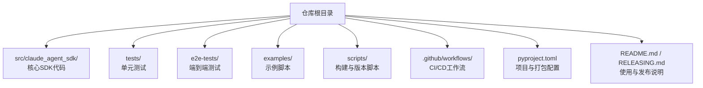
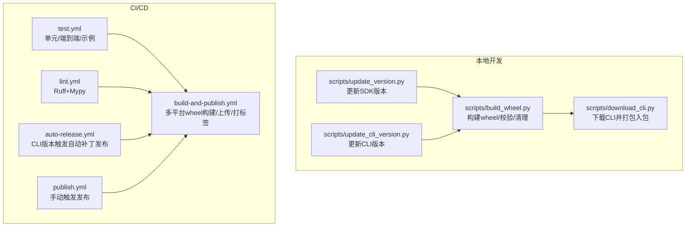
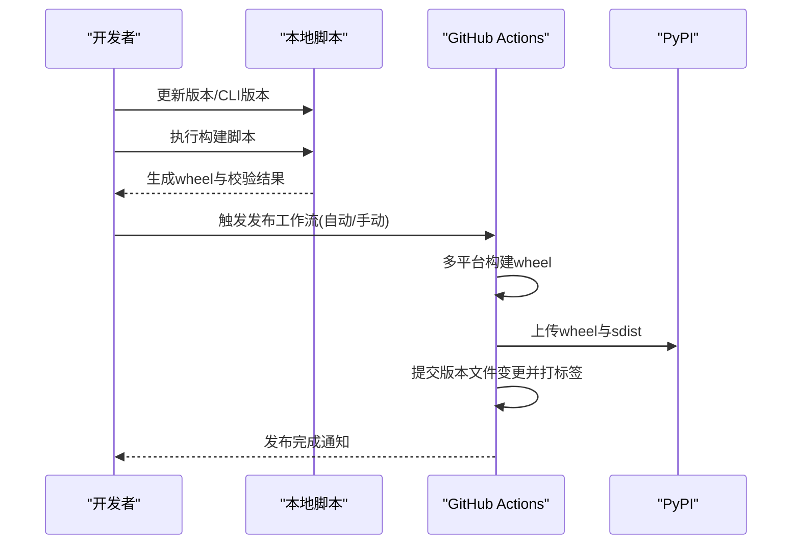
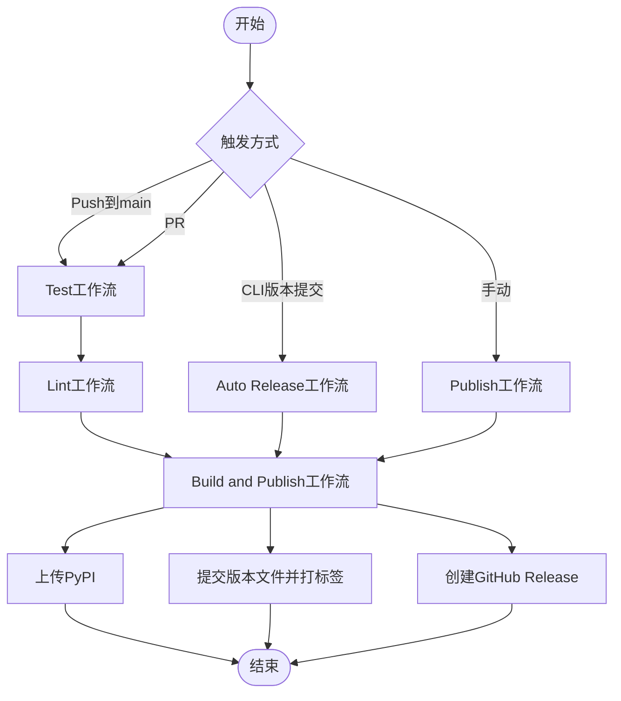
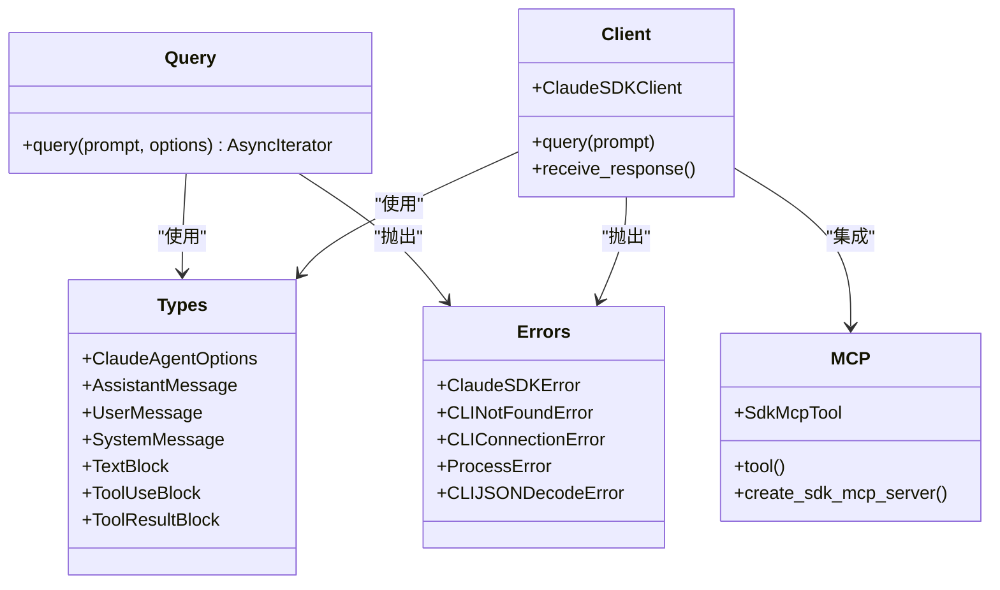

# 开发和贡献

<cite>
**本文引用的文件**
- [README.md](file://README.md)
- [RELEASING.md](file://RELEASING.md)
- [pyproject.toml](file://pyproject.toml)
- [src/claude_agent_sdk/_version.py](file://src/claude_agent_sdk/_version.py)
- [src/claude_agent_sdk/__init__.py](file://src/claude_agent_sdk/__init__.py)
- [scripts/build_wheel.py](file://scripts/build_wheel.py)
- [scripts/download_cli.py](file://scripts/download_cli.py)
- [scripts/update_version.py](file://scripts/update_version.py)
- [scripts/update_cli_version.py](file://scripts/update_cli_version.py)
- [.github/workflows/test.yml](file://.github/workflows/test.yml)
- [.github/workflows/lint.yml](file://.github/workflows/lint.yml)
- [.github/workflows/build-and-publish.yml](file://.github/workflows/build-and-publish.yml)
- [.github/workflows/auto-release.yml](file://.github/workflows/auto-release.yml)
- [.github/workflows/publish.yml](file://.github/workflows/publish.yml)
- [tests/conftest.py](file://tests/conftest.py)
- [tests/test_client.py](file://tests/test_client.py)
- [tests/test_query.py](file://tests/test_query.py)
- [tests/test_types.py](file://tests/test_types.py)
- [tests/test_errors.py](file://tests/test_errors.py)
- [tests/test_sessions.py](file://tests/test_sessions.py)
- [tests/test_session_mutations.py](file://tests/test_session_mutations.py)
- [tests/test_transport.py](file://tests/test_transport.py)
- [tests/test_message_parser.py](file://tests/test_message_parser.py)
- [tests/test_tool_callbacks.py](file://tests/test_tool_callbacks.py)
- [tests/test_build_wheel.py](file://tests/test_build_wheel.py)
- [tests/test_changelog.py](file://tests/test_changelog.py)
- [e2e-tests/test_agents_and_settings.py](file://e2e-tests/test_agents_and_settings.py)
- [e2e-tests/test_dynamic_control.py](file://e2e-tests/test_dynamic_control.py)
- [e2e-tests/test_hook_events.py](file://e2e-tests/test_hook_events.py)
- [e2e-tests/test_hooks.py](file://e2e-tests/test_hooks.py)
- [e2e-tests/test_structured_output.py](file://e2e-tests/test_structured_output.py)
- [e2e-tests/test_tool_permissions.py](file://e2e-tests/test_tool_permissions.py)
- [examples/quick_start.py](file://examples/quick_start.py)
- [examples/streaming_mode.py](file://examples/streaming_mode.py)
- [examples/hooks.py](file://examples/hooks.py)
</cite>

## 目录
1. [简介](#简介)
2. [项目结构](#项目结构)
3. [核心组件](#核心组件)
4. [架构总览](#架构总览)
5. [详细组件分析](#详细组件分析)
6. [依赖关系分析](#依赖关系分析)
7. [性能考虑](#性能考虑)
8. [故障排查指南](#故障排查指南)
9. [结论](#结论)
10. [附录](#附录)

## 简介
本指南面向希望参与 Claude Agent SDK Python 项目的开发者与贡献者，覆盖从开发环境搭建、本地构建与测试、到版本管理与发布的完整流程。内容基于仓库中的实际脚本、配置与工作流，确保可操作性与一致性。

## 项目结构
该项目采用“源码在 src/”的布局，核心模块位于 src/claude_agent_sdk/，并通过 pyproject.toml 进行打包与分发配置；测试位于 tests/ 与 e2e-tests/，CI/CD 工作流集中在 .github/workflows/。脚本目录 scripts/ 提供版本更新、CLI 下载与打包等辅助工具。

章节来源
- [pyproject.toml:1-109](file://pyproject.toml#L1-L109)
- [README.md:1-360](file://README.md#L1-L360)

## 核心组件
- 包版本与导出
  - 版本信息由 src/claude_agent_sdk/_version.py 提供，同时在 pyproject.toml 中声明。
  - 包导出通过 src/claude_agent_sdk/__init__.py 统一暴露，便于用户按需导入。
- 构建与打包
  - scripts/build_wheel.py 负责下载 CLI、打包 wheel、可选清理与校验。
  - scripts/download_cli.py 负责按平台下载 CLI 并放入包内 _bundled 目录。
  - scripts/update_version.py 与 scripts/update_cli_version.py 分别更新 SDK 与 CLI 版本文件。
- 测试与验证
  - 单元测试与覆盖率：pytest 配置见 pyproject.toml，测试入口在 tests/。
  - 端到端测试：e2e-tests/ 使用真实 API，需要 ANTHROPIC_API_KEY 秘钥。
  - 示例脚本：examples/ 展示基本用法与高级特性（如 hooks、MCP）。
- CI/CD
  - test.yml：跨平台单元测试、端到端测试与示例运行。
  - lint.yml：Ruff 与 mypy 检查。
  - build-and-publish.yml：多平台 wheel 构建、上传 PyPI、打标签与发布。
  - auto-release.yml：当 CLI 版本提交触发时自动补丁发布。
  - publish.yml：手动触发发布，先执行测试与检查再调用构建发布流程。

章节来源
- [src/claude_agent_sdk/_version.py:1-4](file://src/claude_agent_sdk/_version.py#L1-L4)
- [src/claude_agent_sdk/__init__.py:1-445](file://src/claude_agent_sdk/__init__.py#L1-L445)
- [pyproject.toml:60-109](file://pyproject.toml#L60-L109)
- [.github/workflows/test.yml:1-171](file://.github/workflows/test.yml#L1-L171)
- [.github/workflows/lint.yml:1-33](file://.github/workflows/lint.yml#L1-L33)
- [.github/workflows/build-and-publish.yml:1-135](file://.github/workflows/build-and-publish.yml#L1-L135)
- [.github/workflows/auto-release.yml:1-55](file://.github/workflows/auto-release.yml#L1-L55)
- [.github/workflows/publish.yml:1-84](file://.github/workflows/publish.yml#L1-L84)

## 架构总览
下图展示了从本地开发到 CI 发布的关键路径：本地脚本负责打包与版本更新，GitHub Actions 负责跨平台构建、上传与打标签。

图表来源
- [scripts/update_version.py:1-50](file://scripts/update_version.py#L1-L50)
- [scripts/update_cli_version.py:1-33](file://scripts/update_cli_version.py#L1-L33)
- [scripts/build_wheel.py:1-393](file://scripts/build_wheel.py#L1-L393)
- [scripts/download_cli.py:1-158](file://scripts/download_cli.py#L1-L158)
- [.github/workflows/test.yml:1-171](file://.github/workflows/test.yml#L1-L171)
- [.github/workflows/lint.yml:1-33](file://.github/workflows/lint.yml#L1-L33)
- [.github/workflows/build-and-publish.yml:1-135](file://.github/workflows/build-and-publish.yml#L1-L135)
- [.github/workflows/auto-release.yml:1-55](file://.github/workflows/auto-release.yml#L1-L55)
- [.github/workflows/publish.yml:1-84](file://.github/workflows/publish.yml#L1-L84)

## 详细组件分析

### 开发环境设置与本地构建
- 依赖安装
  - 开发依赖在 pyproject.toml 的 dev 组中定义，包含 pytest、pytest-asyncio、mypy、ruff 等。
  - 安装命令：pip install -e ".[dev]"。
- 代码规范
  - Ruff 配置在 pyproject.toml 的 [tool.ruff] 中，启用多项规则并忽略过长行警告。
  - mypy 配置严格模式，要求类型注解完整。
- 本地构建 wheel
  - 使用 scripts/build_wheel.py 支持指定版本、CLI 版本、跳过下载、清理等选项。
  - 自动检测平台并为含 CLI 的 wheel 添加平台标签。
  - 可选 twine 校验包元数据。
- 初始化钩子
  - README 指示可通过 ./scripts/initial-setup.sh 安装 pre-push 钩子以匹配 CI 规范。

章节来源
- [pyproject.toml:33-109](file://pyproject.toml#L33-L109)
- [scripts/build_wheel.py:310-393](file://scripts/build_wheel.py#L310-L393)
- [README.md:290-332](file://README.md#L290-L332)

### 版本管理与发布流程
- 版本跟踪
  - SDK 版本：pyproject.toml 与 src/claude_agent_sdk/_version.py。
  - 内置 CLI 版本：src/claude_agent_sdk/_cli_version.py。
  - 两者均遵循语义化版本（MAJOR.MINOR.PATCH），Git 标签格式为 vX.Y.Z。
- 自动发布（CLI 版本触发）
  - 当推送包含“chore: bump bundled CLI version to X.Y.Z”的提交且 _cli_version.py 发生变化时，触发 auto-release.yml。
  - 自动计算下一个补丁版本并调用 build-and-publish.yml。
- 手动发布
  - 在 Actions 页面选择 Publish to PyPI，输入目标版本号，依次执行测试、lint、构建发布。
- 发布步骤
  - 多平台构建 wheel（manylinux、macOS、Windows）。
  - 上传至 PyPI，提交版本文件变更并打标签，创建 GitHub Release。
  - 使用 Claude 自动生成变更日志条目（受 ANTHROPIC_API_KEY 限制）。

图表来源
- [scripts/update_version.py:1-50](file://scripts/update_version.py#L1-L50)
- [scripts/update_cli_version.py:1-33](file://scripts/update_cli_version.py#L1-L33)
- [scripts/build_wheel.py:1-393](file://scripts/build_wheel.py#L1-L393)
- [.github/workflows/build-and-publish.yml:1-135](file://.github/workflows/build-and-publish.yml#L1-L135)
- [.github/workflows/auto-release.yml:1-55](file://.github/workflows/auto-release.yml#L1-L55)
- [.github/workflows/publish.yml:1-84](file://.github/workflows/publish.yml#L1-L84)

章节来源
- [RELEASING.md:1-76](file://RELEASING.md#L1-L76)
- [src/claude_agent_sdk/_version.py:1-4](file://src/claude_agent_sdk/_version.py#L1-L4)
- [.github/workflows/build-and-publish.yml:16-135](file://.github/workflows/build-and-publish.yml#L16-L135)
- [.github/workflows/auto-release.yml:9-55](file://.github/workflows/auto-release.yml#L9-L55)
- [.github/workflows/publish.yml:11-84](file://.github/workflows/publish.yml#L11-L84)

### Git 工作流程与分支策略
- 主分支保护
  - main 分支受 CI 严格保护，所有 PR 必须通过测试与 lint。
- 提交规范
  - README 建议使用“chore: bump bundled CLI version to X.Y.Z”等明确信息，便于自动发布识别。
- PR 流程
  - 提交 PR → CI 自动运行 test.yml 与 lint.yml → 通过后合并到 main。
- 分支建议
  - 功能开发建议基于 main 新建分支，完成后发起 PR。

章节来源
- [.github/workflows/test.yml:1-171](file://.github/workflows/test.yml#L1-L171)
- [.github/workflows/lint.yml:1-33](file://.github/workflows/lint.yml#L1-L33)
- [README.md:290-299](file://README.md#L290-L299)

### 代码贡献指南
- 编码标准
  - 使用 Ruff 进行风格检查与格式化；mypy 严格类型检查。
  - 优先使用类型注解、避免未注解函数与装饰器。
- 测试要求
  - 单元测试：pytest，支持 asyncio 模式；覆盖率输出为 xml。
  - 端到端测试：e2e-tests/ 需要 ANTHROPIC_API_KEY 秘钥；在 CI 中按平台分别运行。
  - 示例脚本：examples/quick_start.py、examples/streaming_mode.py、examples/hooks.py。
- 文档更新
  - README.md 与 RELEASING.md 作为主要文档；变更日志由 Claude 自动生成。
- 质量门禁
  - lint.yml 与 test.yml 作为 PR 合并前的必要条件。

章节来源
- [pyproject.toml:60-109](file://pyproject.toml#L60-L109)
- [.github/workflows/test.yml:1-171](file://.github/workflows/test.yml#L1-L171)
- [.github/workflows/lint.yml:1-33](file://.github/workflows/lint.yml#L1-L33)
- [README.md:275-279](file://README.md#L275-L279)

### CI/CD 工作流详解
- Test 工作流
  - 跨平台运行单元测试，上传覆盖率至 Codecov。
  - 条件运行端到端测试与示例脚本，区分 fork 与主仓库。
- Lint 工作流
  - 对 src/ 与 tests/ 执行 ruff 检查与格式化检查，对 src/ 执行 mypy。
- Build and Publish 工作流
  - 多平台矩阵构建 wheel，收集产物并上传至 PyPI。
  - 提交版本文件变更、生成变更日志、打标签并创建 GitHub Release。
- Auto Release 工作流
  - 监听 Test 工作流完成事件，若满足 CLI 版本提交条件则自动计算新版本并发布。
- Publish 工作流
  - 手动触发，先执行多 Python 版本测试与 lint，再调用 Build and Publish。

图表来源
- [.github/workflows/test.yml:1-171](file://.github/workflows/test.yml#L1-L171)
- [.github/workflows/lint.yml:1-33](file://.github/workflows/lint.yml#L1-L33)
- [.github/workflows/build-and-publish.yml:1-135](file://.github/workflows/build-and-publish.yml#L1-L135)
- [.github/workflows/auto-release.yml:1-55](file://.github/workflows/auto-release.yml#L1-L55)
- [.github/workflows/publish.yml:1-84](file://.github/workflows/publish.yml#L1-L84)

章节来源
- [.github/workflows/test.yml:1-171](file://.github/workflows/test.yml#L1-L171)
- [.github/workflows/lint.yml:1-33](file://.github/workflows/lint.yml#L1-L33)
- [.github/workflows/build-and-publish.yml:1-135](file://.github/workflows/build-and-publish.yml#L1-L135)
- [.github/workflows/auto-release.yml:1-55](file://.github/workflows/auto-release.yml#L1-L55)
- [.github/workflows/publish.yml:1-84](file://.github/workflows/publish.yml#L1-L84)

### 代码结构与模块关系
- 导出与类型
  - __init__.py 汇总导出 query、ClaudeSDKClient、各类消息与权限类型、错误类型、MCP 工具与服务器相关接口。
- 内部实现
  - _internal/ 目录包含传输层、会话管理、查询与消息解析等内部逻辑。
- CLI 打包
  - download_cli.py 将平台二进制复制到 src/claude_agent_sdk/_bundled，供打包时包含。

图表来源
- [src/claude_agent_sdk/__init__.py:1-445](file://src/claude_agent_sdk/__init__.py#L1-L445)

章节来源
- [src/claude_agent_sdk/__init__.py:1-445](file://src/claude_agent_sdk/__init__.py#L1-L445)

## 依赖关系分析
- 依赖与可选依赖
  - 运行时依赖 anyio、typing_extensions（按需）、mcp。
  - 开发依赖 pytest、pytest-asyncio、pytest-cov、mypy、ruff。
- 打包与分发
  - 使用 hatchling 作为构建后端，wheel 目标仅包含 src/claude_agent_sdk，sdist 包含 tests 与文档。
- 测试与覆盖率
  - pytest 配置启用 asyncio 模式，覆盖率输出为 xml 文件，上传至 Codecov。

章节来源
- [pyproject.toml:27-41](file://pyproject.toml#L27-L41)
- [pyproject.toml:48-58](file://pyproject.toml#L48-L58)
- [pyproject.toml:60-69](file://pyproject.toml#L60-L69)

## 性能考虑
- 内置 CLI 打包
  - 通过 scripts/download_cli.py 将平台二进制打包入包，减少运行时外部依赖查找成本。
- 平台标签
  - build_wheel.py 为含 CLI 的 wheel 添加平台标签，提升兼容性与加载效率。
- MCP 服务器
  - SDK MCP 服务器在进程内运行，避免外部进程 IPC 开销，适合高性能场景。

章节来源
- [scripts/download_cli.py:101-137](file://scripts/download_cli.py#L101-L137)
- [scripts/build_wheel.py:114-150](file://scripts/build_wheel.py#L114-L150)
- [src/claude_agent_sdk/__init__.py:178-250](file://src/claude_agent_sdk/__init__.py#L178-L250)

## 故障排查指南
- 本地构建失败
  - 确认已安装 build、twine、wheel；检查 scripts/build_wheel.py 输出与返回码。
  - 若 twine 报告“License-File”警告，属已知误报，PyPI 可接受。
- CLI 未找到或无法下载
  - download_cli.py 会在不同平台路径查找已安装 CLI；若无则通过官方安装脚本下载。
  - Windows 使用 PowerShell 安装，其他系统使用 bash。
- CI 失败
  - 查看 test.yml 与 lint.yml 的具体步骤输出；确保 ANTHROPIC_API_KEY 秘钥正确配置。
  - 端到端测试在 fork 仓库可能被跳过，需在主仓库运行。
- 版本发布异常
  - 检查 DEPLOY_KEY、PYPI_API_TOKEN、ANTHROPIC_API_KEY 是否齐全。
  - 自动发布需满足“chore: bump bundled CLI version to X.Y.Z”提交与 _cli_version.py 变更。

章节来源
- [scripts/build_wheel.py:237-268](file://scripts/build_wheel.py#L237-L268)
- [scripts/download_cli.py:21-48](file://scripts/download_cli.py#L21-L48)
- [.github/workflows/test.yml:40-83](file://.github/workflows/test.yml#L40-L83)
- [.github/workflows/lint.yml:26-33](file://.github/workflows/lint.yml#L26-L33)
- [RELEASING.md:69-76](file://RELEASING.md#L69-L76)

## 结论
本指南基于仓库现有脚本与工作流，提供了从开发环境到发布上线的完整路径。建议贡献者遵循统一的代码规范与测试要求，利用本地脚本与 CI 工作流保证质量与一致性。版本管理采用双版本号策略与语义化版本，配合自动与手动发布流程，确保快速稳定地交付。

## 附录

### 常用命令速查
- 安装开发依赖：pip install -e ".[dev]"
- 运行测试：python -m pytest tests/ -v
- 运行端到端测试：python -m pytest e2e-tests/ -v -m e2e
- 运行示例：python examples/quick_start.py
- 本地构建 wheel：python scripts/build_wheel.py
- 更新 SDK 版本：python scripts/update_version.py <版本号>
- 更新 CLI 版本：python scripts/update_cli_version.py <版本号>

章节来源
- [pyproject.toml:60-69](file://pyproject.toml#L60-L69)
- [README.md:300-332](file://README.md#L300-L332)
- [scripts/update_version.py:1-50](file://scripts/update_version.py#L1-L50)
- [scripts/update_cli_version.py:1-33](file://scripts/update_cli_version.py#L1-L33)