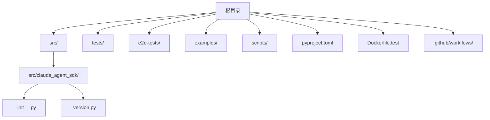
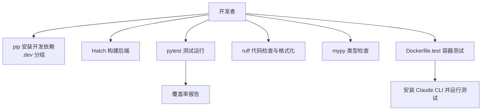
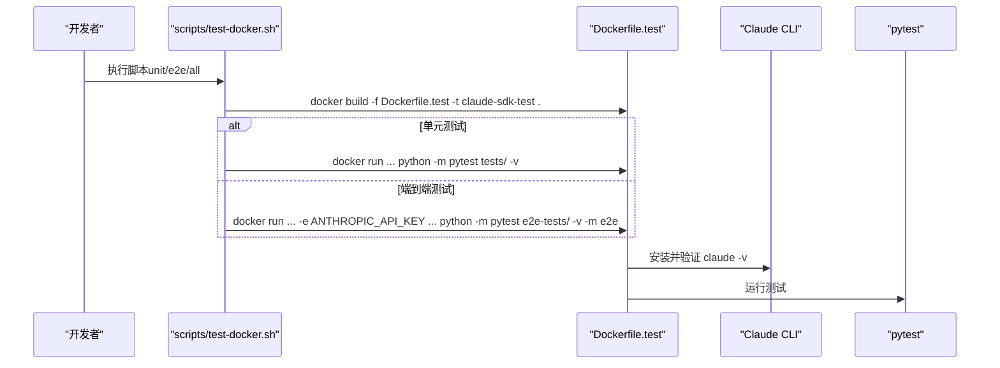
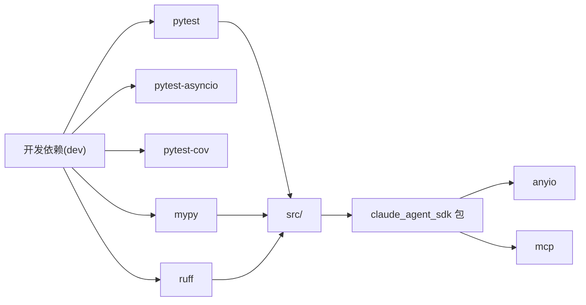

# 开发环境设置

<cite>
**本文引用的文件**
- [pyproject.toml](file://pyproject.toml)
- [README.md](file://README.md)
- [Dockerfile.test](file://Dockerfile.test)
- [scripts/initial-setup.sh](file://scripts/initial-setup.sh)
- [scripts/test-docker.sh](file://scripts/test-docker.sh)
- [.claude/settings.json](file://.claude/settings.json)
- [.github/workflows/lint.yml](file://.github/workflows/lint.yml)
- [.github/workflows/test.yml](file://.github/workflows/test.yml)
- [tests/conftest.py](file://tests/conftest.py)
- [e2e-tests/conftest.py](file://e2e-tests/conftest.py)
- [scripts/build_wheel.py](file://scripts/build_wheel.py)
- [src/claude_agent_sdk/__init__.py](file://src/claude_agent_sdk/__init__.py)
- [src/claude_agent_sdk/_version.py](file://src/claude_agent_sdk/_version.py)
</cite>

## 目录
1. [简介](#简介)
2. [项目结构](#项目结构)
3. [核心组件](#核心组件)
4. [架构总览](#架构总览)
5. [详细组件分析](#详细组件分析)
6. [依赖关系分析](#依赖关系分析)
7. [性能考虑](#性能考虑)
8. [故障排查指南](#故障排查指南)
9. [结论](#结论)
10. [附录](#附录)

## 简介
本指南面向贡献者与维护者，帮助你在本地与容器环境中快速搭建可用的开发环境。内容覆盖：
- Python 版本要求与依赖管理工具（Hatch、pip）
- 开发依赖安装与配置（pytest、mypy、ruff）
- 项目结构与模块导入路径设置
- Docker 开发环境与测试容器配置
- IDE 配置建议（VS Code、PyCharm）
- 代码格式化、类型检查与测试运行命令
- 常见开发工具安装与配置步骤

## 项目结构
该仓库采用“源码在 src 下”的标准布局，包名为 claude_agent_sdk，使用 Hatch 作为构建后端。测试位于 tests 与 e2e-tests 两个目录中；开发工具链通过 pyproject.toml 的可选分组 dev 进行统一管理。

图表来源
- [pyproject.toml:1-109](file://pyproject.toml#L1-L109)
- [src/claude_agent_sdk/__init__.py:1-445](file://src/claude_agent_sdk/__init__.py#L1-L445)
- [src/claude_agent_sdk/_version.py:1-4](file://src/claude_agent_sdk/_version.py#L1-L4)

章节来源
- [pyproject.toml:1-109](file://pyproject.toml#L1-L109)
- [README.md:1-360](file://README.md#L1-L360)

## 核心组件
- 构建系统：Hatch（build-backend），用于打包与分发
- 依赖管理：pip 安装可选开发依赖组 dev
- 测试框架：pytest，支持异步测试与覆盖率
- 类型检查：mypy，严格模式
- 代码风格：ruff，lint 与格式化
- 模块导入路径：pytest 配置将 src 设为 pythonpath，确保 import from src 成功

章节来源
- [pyproject.toml:1-109](file://pyproject.toml#L1-L109)
- [tests/conftest.py:1-5](file://tests/conftest.py#L1-L5)
- [e2e-tests/conftest.py:1-33](file://e2e-tests/conftest.py#L1-L33)

## 架构总览
下图展示了开发环境的关键流程：从安装依赖到运行测试与格式化/类型检查，以及容器化测试路径。

图表来源
- [pyproject.toml:33-41](file://pyproject.toml#L33-L41)
- [pyproject.toml:60-69](file://pyproject.toml#L60-L69)
- [pyproject.toml:71-86](file://pyproject.toml#L71-L86)
- [pyproject.toml:87-109](file://pyproject.toml#L87-L109)
- [Dockerfile.test:1-30](file://Dockerfile.test#L1-L30)

## 详细组件分析

### Python 版本与依赖管理
- Python 版本要求：>=3.10
- 构建后端：Hatch（hatchling）
- 开发依赖（dev 组）：pytest、pytest-asyncio、pytest-cov、mypy、ruff
- 项目入口与导出：src/claude_agent_sdk/__init__.py 提供对外 API 与类型导出

章节来源
- [pyproject.toml:10](file://pyproject.toml#L10)
- [pyproject.toml:2](file://pyproject.toml#L2)
- [pyproject.toml:33-41](file://pyproject.toml#L33-L41)
- [src/claude_agent_sdk/__init__.py:1-445](file://src/claude_agent_sdk/__init__.py#L1-L445)

### 测试配置与运行
- pytest 配置：
  - testpaths 指向 tests
  - pythonpath 包含 src，便于 import from src
  - 启用 asyncio 插件
- e2e 测试：
  - 使用标记 e2e，需要 ANTHROPIC_API_KEY 环境变量
  - conftest 中定义了 api_key 与事件循环策略
- 覆盖率：pytest-cov 生成 xml 报告

章节来源
- [pyproject.toml:60-69](file://pyproject.toml#L60-L69)
- [tests/conftest.py:1-5](file://tests/conftest.py#L1-L5)
- [e2e-tests/conftest.py:1-33](file://e2e-tests/conftest.py#L1-L33)
- [.github/workflows/test.yml:29-37](file://.github/workflows/test.yml#L29-L37)

### 代码质量工具配置
- ruff：
  - target-version 对齐 Python 3.10
  - 行宽 88
  - 启用 pycodestyle、pyflakes、isort、pep8-naming、flake8-* 等规则
  - 忽略过长行（由格式化处理）
  - first-party 包名已声明为 claude_agent_sdk
- mypy：
  - strict 模式，严格类型检查
  - 面向 3.10

章节来源
- [pyproject.toml:87-109](file://pyproject.toml#L87-L109)
- [pyproject.toml:71-86](file://pyproject.toml#L71-L86)

### Docker 开发与测试容器
- 基础镜像：python:3.12-slim
- 安装 Claude CLI（通过安装脚本）
- 工作目录：/app，复制仓库源码
- 以可编辑模式安装带 dev 依赖的 SDK
- 默认 CMD 运行 pytest tests/ -v
- 提供脚本 scripts/test-docker.sh 一键构建并运行单元或端到端测试

图表来源
- [Dockerfile.test:1-30](file://Dockerfile.test#L1-L30)
- [scripts/test-docker.sh:1-78](file://scripts/test-docker.sh#L1-L78)

章节来源
- [Dockerfile.test:1-30](file://Dockerfile.test#L1-L30)
- [scripts/test-docker.sh:1-78](file://scripts/test-docker.sh#L1-L78)

### Git 预提交钩子与本地校验
- initial-setup.sh 安装 pre-push 钩子，推送前执行 lint 检查
- .claude/settings.json 中配置了权限与 hooks，可在工具使用后自动触发 ruff 检查与格式化

章节来源
- [scripts/initial-setup.sh:1-23](file://scripts/initial-setup.sh#L1-L23)
- [.claude/settings.json:1-25](file://.claude/settings.json#L1-L25)

### 发布与打包脚本
- scripts/build_wheel.py 支持下载 CLI、构建 wheel 与 sdist、twine 校验、清理等完整流程
- 可按平台重打 wheel 标签，或保留独立 wheel

章节来源
- [scripts/build_wheel.py:1-393](file://scripts/build_wheel.py#L1-L393)

### IDE 配置建议
- VS Code
  - Python 解释器选择：指向你已安装 Python 3.10+ 的环境
  - 推荐扩展：Python（Microsoft）、Pylance、Ruff、ms-python.black-formatter（如需）
  - 设置：
    - Python > Interpreter: 选择正确版本
    - Python > Linting: 启用 ruff
    - Python > Analysis: 启用 mypy
    - Python > Testing: 启用 pytest
    - Python > Analysis: typeshedPaths 指向虚拟环境 site-packages（如需）
- PyCharm
  - Project Interpreter: 选择 Python 3.10+
  - Settings > Tools > Python Integrated Tools:
    - Default test runner: pytest
    - Docstring format: Google/NumPy（可选）
  - Settings > Tools > Ruff: 启用并配置路径
  - Settings > Tools > Python Mypy: 启用并配置目标 Python 版本
  - 运行/调试配置：新增 Python tests（pytest），工作目录设为仓库根

[本节为通用 IDE 配置建议，不直接分析具体文件，故无章节来源]

## 依赖关系分析
- 依赖分层
  - 运行时依赖：anyio、typing_extensions（针对旧版本 Python）、mcp
  - 开发依赖：pytest、pytest-asyncio、pytest-cov、mypy、ruff
- 导入路径
  - pytest 将 src 加入 pythonpath，保证 import from src 成功
- 工具链耦合
  - ruff 与 mypy 的 strict 模式共同保障代码质量
  - pytest 与 pytest-asyncio 共同支撑异步测试

图表来源
- [pyproject.toml:27-31](file://pyproject.toml#L27-L31)
- [pyproject.toml:33-41](file://pyproject.toml#L33-L41)
- [pyproject.toml:60-69](file://pyproject.toml#L60-L69)

章节来源
- [pyproject.toml:27-31](file://pyproject.toml#L27-L31)
- [pyproject.toml:33-41](file://pyproject.toml#L33-L41)
- [pyproject.toml:60-69](file://pyproject.toml#L60-L69)

## 性能考虑
- 使用 in-process MCP 服务器（SDK 内置）可避免外部进程 IPC 开销，提升工具调用性能
- 在 IDE 中启用增量类型检查与缓存，缩短 mypy 检查时间
- 使用 ruff 的缓存与并行能力，减少格式化与检查耗时

[本节为通用性能建议，不直接分析具体文件，故无章节来源]

## 故障排查指南
- Claude CLI 未找到
  - 现象：运行测试或示例时报错提示 CLI 未找到
  - 处理：确保已安装 Claude CLI 或在容器中使用 Dockerfile.test
- 缺少 ANTHROPIC_API_KEY
  - 现象：运行 e2e-tests 报错
  - 处理：设置环境变量 ANTHROPIC_API_KEY 后再运行
- pytest 无法导入模块
  - 现象：ImportError，无法从 src 导入
  - 处理：确认 pytest 配置中的 pythonpath 包含 src，或在 IDE 中将 src 添加为源码根
- ruff 格式化冲突
  - 现象：本地与 CI 格式化结果不一致
  - 处理：统一使用 ruff format 与 ruff check，保持 target-version 一致
- Docker 容器测试失败
  - 现象：容器内无法运行 claude 或测试
  - 处理：使用 scripts/test-docker.sh 自动构建镜像并运行；必要时在容器内手动验证 claude -v

章节来源
- [e2e-tests/conftest.py:8-17](file://e2e-tests/conftest.py#L8-L17)
- [Dockerfile.test:12-26](file://Dockerfile.test#L12-L26)
- [pyproject.toml:60-69](file://pyproject.toml#L60-L69)

## 结论
通过以上步骤，你可以完成从 Python 环境准备、依赖安装、工具配置到容器化测试的全流程开发环境搭建。建议在本地与 CI 中均启用 ruff 与 mypy 的严格模式，并结合 pytest 异步测试与覆盖率报告，确保代码质量与稳定性。

[本节为总结性内容，不直接分析具体文件，故无章节来源]

## 附录

### 命令速查
- 安装开发依赖
  - pip install -e ".[dev]"
- 运行单元测试
  - python -m pytest tests/ -v
- 运行端到端测试
  - ANTHROPIC_API_KEY=sk-... python -m pytest e2e-tests/ -v -m e2e
- 代码检查与格式化
  - ruff check src/ tests/
  - ruff format src/ tests/
- 类型检查
  - mypy src/
- 容器化测试
  - ./scripts/test-docker.sh unit
  - ./scripts/test-docker.sh e2e
  - ./scripts/test-docker.sh all

章节来源
- [pyproject.toml:24](file://pyproject.toml#L24)
- [pyproject.toml:60-69](file://pyproject.toml#L60-L69)
- [pyproject.toml:87-109](file://pyproject.toml#L87-L109)
- [pyproject.toml:71-86](file://pyproject.toml#L71-L86)
- [scripts/test-docker.sh:34-74](file://scripts/test-docker.sh#L34-L74)