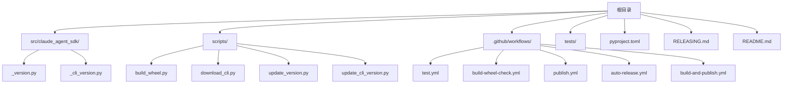
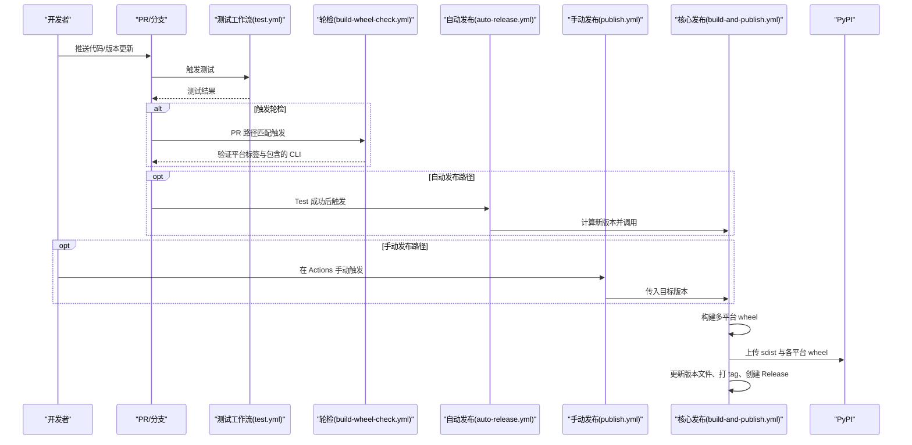
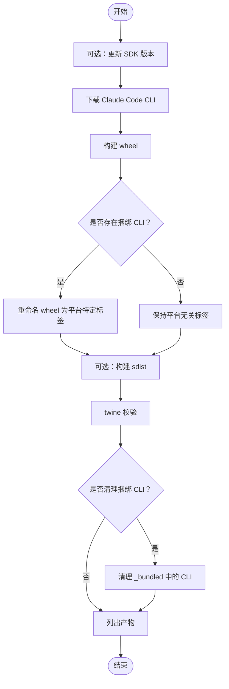
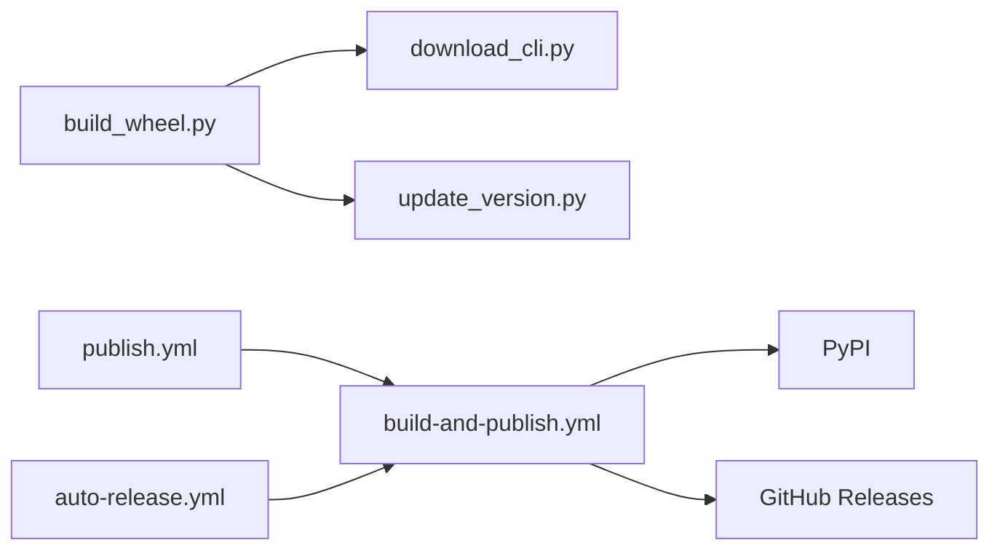

# 构建和发布

<cite>
**本文引用的文件**
- [pyproject.toml](file://pyproject.toml)
- [RELEASING.md](file://RELEASING.md)
- [README.md](file://README.md)
- [.github/workflows/auto-release.yml](file://.github/workflows/auto-release.yml)
- [.github/workflows/build-and-publish.yml](file://.github/workflows/build-and-publish.yml)
- [.github/workflows/publish.yml](file://.github/workflows/publish.yml)
- [.github/workflows/build-wheel-check.yml](file://.github/workflows/build-wheel-check.yml)
- [.github/workflows/test.yml](file://.github/workflows/test.yml)
- [scripts/build_wheel.py](file://scripts/build_wheel.py)
- [scripts/download_cli.py](file://scripts/download_cli.py)
- [scripts/update_version.py](file://scripts/update_version.py)
- [scripts/update_cli_version.py](file://scripts/update_cli_version.py)
- [src/claude_agent_sdk/_version.py](file://src/claude_agent_sdk/_version.py)
- [src/claude_agent_sdk/_cli_version.py](file://src/claude_agent_sdk/_cli_version.py)
- [tests/test_build_wheel.py](file://tests/test_build_wheel.py)
- [tests/test_changelog.py](file://tests/test_changelog.py)
</cite>

## 目录
1. [简介](#简介)
2. [项目结构](#项目结构)
3. [核心组件](#核心组件)
4. [架构总览](#架构总览)
5. [详细组件分析](#详细组件分析)
6. [依赖关系分析](#依赖关系分析)
7. [性能考量](#性能考量)
8. [故障排查指南](#故障排查指南)
9. [结论](#结论)
10. [附录](#附录)

## 简介
本文件系统性梳理该 Python SDK 的构建与发布流程，覆盖以下主题：
- 使用 Hatchling 作为构建后端的 wheel 包构建过程与打包配置
- 版本管理策略：语义化版本控制与版本号更新机制（SDK 版本与捆绑 CLI 版本）
- CI/CD 流水线：GitHub Actions 自动发布与手动发布的完整工作原理
- 发布前检查清单：测试验证、文档更新与变更日志维护
- 手动发布流程：PyPI 上传与包验证步骤
- 发布标签管理、变更日志生成与版本公告流程
- 回滚策略与紧急修复流程
- 不同环境（开发、测试、生产）的构建参数配置建议

## 项目结构
该项目采用“分层+功能模块”组织方式：
- 根目录包含构建配置、CI 工作流、示例与脚本
- 源码位于 src/claude_agent_sdk/，包含版本信息文件与内部实现
- scripts/ 提供构建、下载 CLI、版本更新等自动化脚本
- .github/workflows/ 定义了测试、自动发布、手动发布、轮检等流水线
- tests/ 提供单元测试与发布相关校验测试

图表来源
- [pyproject.toml](file://pyproject.toml)
- [RELEASING.md](file://RELEASING.md)
- [README.md](file://README.md)
- [scripts/build_wheel.py](file://scripts/build_wheel.py)
- [scripts/download_cli.py](file://scripts/download_cli.py)
- [scripts/update_version.py](file://scripts/update_version.py)
- [scripts/update_cli_version.py](file://scripts/update_cli_version.py)
- [src/claude_agent_sdk/_version.py](file://src/claude_agent_sdk/_version.py)
- [src/claude_agent_sdk/_cli_version.py](file://src/claude_agent_sdk/_cli_version.py)
- [.github/workflows/test.yml](file://.github/workflows/test.yml)
- [.github/workflows/build-wheel-check.yml](file://.github/workflows/build-wheel-check.yml)
- [.github/workflows/publish.yml](file://.github/workflows/publish.yml)
- [.github/workflows/auto-release.yml](file://.github/workflows/auto-release.yml)
- [.github/workflows/build-and-publish.yml](file://.github/workflows/build-and-publish.yml)

章节来源
- [pyproject.toml](file://pyproject.toml)
- [README.md](file://README.md)

## 核心组件
- 构建系统与打包配置
  - 使用 Hatchling 作为构建后端，wheel 目标仅包含 src/claude_agent_sdk，源码分发包含 tests 与文档
- 版本信息
  - SDK 版本：pyproject.toml 中的 version 字段与 src/claude_agent_sdk/_version.py
  - 捆绑 CLI 版本：src/claude_agent_sdk/_cli_version.py
- 自动化脚本
  - scripts/build_wheel.py：下载 CLI、构建 wheel/sdist、twine 校验、清理、平台标签重命名
  - scripts/download_cli.py：按平台下载 CLI 并放入包内 _bundled 目录
  - scripts/update_version.py 与 scripts/update_cli_version.py：分别更新 SDK 与 CLI 版本
- CI/CD 工作流
  - test.yml：多平台单元测试、覆盖率、端到端测试与示例运行
  - build-wheel-check.yml：PR 轮检，验证平台标签、包含的 CLI 二进制、可安装导入
  - publish.yml：手动发布入口，执行测试与静态检查后调用构建发布工作流
  - auto-release.yml：基于 CLI 版本提交触发的自动发布
  - build-and-publish.yml：核心发布流程，构建多平台 wheel、上传 PyPI、打标签与创建 GitHub Release

章节来源
- [pyproject.toml](file://pyproject.toml)
- [scripts/build_wheel.py](file://scripts/build_wheel.py)
- [scripts/download_cli.py](file://scripts/download_cli.py)
- [scripts/update_version.py](file://scripts/update_version.py)
- [scripts/update_cli_version.py](file://scripts/update_cli_version.py)
- [src/claude_agent_sdk/_version.py](file://src/claude_agent_sdk/_version.py)
- [src/claude_agent_sdk/_cli_version.py](file://src/claude_agent_sdk/_cli_version.py)
- [.github/workflows/test.yml](file://.github/workflows/test.yml)
- [.github/workflows/build-wheel-check.yml](file://.github/workflows/build-wheel-check.yml)
- [.github/workflows/publish.yml](file://.github/workflows/publish.yml)
- [.github/workflows/auto-release.yml](file://.github/workflows/auto-release.yml)
- [.github/workflows/build-and-publish.yml](file://.github/workflows/build-and-publish.yml)

## 架构总览
下图展示了从代码提交到 PyPI 发布的端到端流程，涵盖自动与手动两种路径。

图表来源
- [.github/workflows/test.yml](file://.github/workflows/test.yml)
- [.github/workflows/build-wheel-check.yml](file://.github/workflows/build-wheel-check.yml)
- [.github/workflows/auto-release.yml](file://.github/workflows/auto-release.yml)
- [.github/workflows/publish.yml](file://.github/workflows/publish.yml)
- [.github/workflows/build-and-publish.yml](file://.github/workflows/build-and-publish.yml)

## 详细组件分析

### 构建系统与打包配置（Hatchling）
- 构建后端：使用 hatchling
- wheel 目标：仅包含 src/claude_agent_sdk，确保包体最小化
- sdist 目标：包含源码、测试、README、LICENSE 等
- 依赖与元数据：名称、版本、描述、许可证、作者、关键字、依赖、Python 版本要求等均在 pyproject.toml 中集中定义

章节来源
- [pyproject.toml](file://pyproject.toml)

### 版本管理策略（语义化版本与版本号更新）
- 双版本模型
  - SDK 版本：pyproject.toml 与 src/claude_agent_sdk/_version.py 同步
  - 捆绑 CLI 版本：src/claude_agent_sdk/_cli_version.py
- 版本格式：语义化版本（MAJOR.MINOR.PATCH），Git 标签格式为 vX.Y.Z
- 自动发布规则（CLI 版本提升触发）
  - 触发条件：Test 工作流成功且提交消息以“chore: bump bundled CLI version to ...”开头
  - 行为：读取当前 SDK 版本，将 PATCH 递增；随后调用核心发布流程
- 手动发布规则
  - 在 Actions 中选择“Publish to PyPI”，输入目标版本
  - 先执行测试与静态检查，通过后再调用核心发布流程

章节来源
- [RELEASING.md](file://RELEASING.md)
- [src/claude_agent_sdk/_version.py](file://src/claude_agent_sdk/_version.py)
- [src/claude_agent_sdk/_cli_version.py](file://src/claude_agent_sdk/_cli_version.py)
- [.github/workflows/auto-release.yml](file://.github/workflows/auto-release.yml)
- [.github/workflows/publish.yml](file://.github/workflows/publish.yml)

### wheel 包构建流程与平台标签
- 步骤概览
  1) 可选：更新 SDK 版本
  2) 下载指定或默认的 Claude Code CLI 二进制
  3) 使用 build 构建 wheel
  4) 若存在捆绑 CLI，则使用 wheel 命令对 wheel 进行平台标签重命名
  5) 可选：构建 sdist
  6) 使用 twine 对产物进行检查
  7) 可选：清理 _bundled 中的 CLI 二进制
- 平台标签映射
  - macOS：macosx_11_0_arm64 / macosx_11_0_x86_64
  - Linux：manylinux_2_17_x86_64 / manylinux_2_17_aarch64
  - Windows：win_amd64 / win_arm64
- 轮检矩阵同步
  - build-wheel-check.yml 与 build-and-publish.yml 的构建矩阵保持一致，避免遗漏平台

图表来源
- [scripts/build_wheel.py](file://scripts/build_wheel.py)
- [.github/workflows/build-wheel-check.yml](file://.github/workflows/build-wheel-check.yml)
- [.github/workflows/build-and-publish.yml](file://.github/workflows/build-and-publish.yml)

章节来源
- [scripts/build_wheel.py](file://scripts/build_wheel.py)
- [scripts/download_cli.py](file://scripts/download_cli.py)
- [tests/test_build_wheel.py](file://tests/test_build_wheel.py)
- [.github/workflows/build-wheel-check.yml](file://.github/workflows/build-wheel-check.yml)
- [.github/workflows/build-and-publish.yml](file://.github/workflows/build-and-publish.yml)

### CI/CD 流水线工作原理
- 测试工作流（test.yml）
  - 多平台（ubuntu、macOS、Windows）并行执行
  - 安装开发依赖，运行 pytest，上传覆盖率
  - 端到端测试与容器化端到端测试，使用 Anthropic API 密钥
- 轮检工作流（build-wheel-check.yml）
  - PR 触发，针对关键脚本与配置文件变化
  - 验证每个平台的 wheel 文件名包含预期标签
  - 验证 wheel 内包含对应平台的 CLI 二进制
  - 安装 wheel 并导入验证
- 手动发布（publish.yml）
  - workflow_dispatch 输入版本号
  - 并行执行多 Python 版本的测试与静态检查
  - 获取上一个 tag，然后复用核心发布流程
- 自动发布（auto-release.yml）
  - 监听 Test 工作流完成事件
  - 校验触发提交消息与 CLI 版本文件变更
  - 计算下一个 SDK 版本（PATCH 递增），调用核心发布流程
- 核心发布（build-and-publish.yml）
  - 多平台构建 wheel，上传制品
  - 生产环境发布，更新版本文件、提交、打 tag、创建 GitHub Release
  - 使用 Anthropic API 生成变更日志条目

章节来源
- [.github/workflows/test.yml](file://.github/workflows/test.yml)
- [.github/workflows/build-wheel-check.yml](file://.github/workflows/build-wheel-check.yml)
- [.github/workflows/publish.yml](file://.github/workflows/publish.yml)
- [.github/workflows/auto-release.yml](file://.github/workflows/auto-release.yml)
- [.github/workflows/build-and-publish.yml](file://.github/workflows/build-and-publish.yml)

### 发布前检查清单
- 代码质量与规范
  - ruff 检查与格式校验
  - mypy 类型检查
- 功能与回归
  - 单元测试全量通过
  - 端到端测试（含容器化场景）
  - 示例脚本运行通过
- 打包与兼容性
  - 轮检工作流通过，确认平台标签与捆绑 CLI 存在
  - 产物可安装并导入，CLI 二进制路径正确
- 文档与变更日志
  - 更新 CHANGELOG.md，遵循条目格式与顺序
  - README 与相关文档同步更新
- 安全与密钥
  - PyPI API Token、Anthropic API Key、DEPLOY_KEY 等密钥配置正确

章节来源
- [.github/workflows/test.yml](file://.github/workflows/test.yml)
- [.github/workflows/build-wheel-check.yml](file://.github/workflows/build-wheel-check.yml)
- [tests/test_changelog.py](file://tests/test_changelog.py)
- [RELEASING.md](file://RELEASING.md)

### 手动发布流程（PyPI 上传与包验证）
- 触发入口
  - 在 Actions 中打开“Publish to PyPI”工作流，输入目标版本
- 执行步骤
  - 并行测试与静态检查通过
  - 调用核心发布工作流，构建多平台 wheel
  - 上传 sdist 与各平台 wheel 至 PyPI
  - 更新版本文件、提交至 main、打 tag、创建 GitHub Release
- 包验证
  - 本地安装并导入
  - 验证捆绑 CLI 二进制存在且可执行
  - 运行最小化用例确认基本功能

章节来源
- [.github/workflows/publish.yml](file://.github/workflows/publish.yml)
- [.github/workflows/build-and-publish.yml](file://.github/workflows/build-and-publish.yml)
- [README.md](file://README.md)

### 发布标签管理、变更日志生成与版本公告
- 标签管理
  - 使用 vX.Y.Z 格式打标签并推送
- 变更日志生成
  - 使用 Anthropic API 通过 claude-code-action 自动生成条目
  - 生成的发布说明包含 PyPI 链接与安装命令
- 版本公告
  - 创建 GitHub Release，附带自动生成的发布说明

章节来源
- [RELEASING.md](file://RELEASING.md)
- [.github/workflows/build-and-publish.yml](file://.github/workflows/build-and-publish.yml)

### 回滚策略与紧急修复流程
- 回滚策略
  - 若发布后发现严重问题，可创建紧急补丁版本
  - 通过回退标签与提交，必要时撤销已发布 wheel（需 PyPI 管理员权限）
- 紧急修复流程
  - 在 main 上创建热修复分支，修复后按常规流程发布
  - 如需快速验证，可在受控环境中先进行轮检与本地安装测试

章节来源
- [RELEASING.md](file://RELEASING.md)

### 不同环境的构建参数配置
- 开发环境
  - 本地安装开发依赖，使用 scripts/build_wheel.py 进行快速迭代构建
  - 可通过 --skip-download/--skip-sdist/--clean 等选项优化效率
- 测试环境
  - 使用 test.yml 的多平台矩阵进行一致性验证
  - 轮检工作流确保 PR 不引入打包回归
- 生产环境
  - 核心发布工作流在生产环境执行，使用受控密钥与严格校验
  - 产物上传至 PyPI，打标签并创建 GitHub Release

章节来源
- [scripts/build_wheel.py](file://scripts/build_wheel.py)
- [.github/workflows/test.yml](file://.github/workflows/test.yml)
- [.github/workflows/build-wheel-check.yml](file://.github/workflows/build-wheel-check.yml)
- [.github/workflows/build-and-publish.yml](file://.github/workflows/build-and-publish.yml)

## 依赖关系分析
- 组件耦合
  - scripts/build_wheel.py 依赖 scripts/download_cli.py、scripts/update_version.py
  - 核心发布工作流依赖轮检矩阵与平台标签策略
- 外部依赖
  - PyPI 上传依赖 twine 与 PYPI_API_TOKEN
  - 变更日志生成依赖 Anthropic API Key 与 GitHub Token
  - 直接推送 main 需要 DEPLOY_KEY

图表来源
- [scripts/build_wheel.py](file://scripts/build_wheel.py)
- [scripts/download_cli.py](file://scripts/download_cli.py)
- [scripts/update_version.py](file://scripts/update_version.py)
- [.github/workflows/publish.yml](file://.github/workflows/publish.yml)
- [.github/workflows/auto-release.yml](file://.github/workflows/auto-release.yml)
- [.github/workflows/build-and-publish.yml](file://.github/workflows/build-and-publish.yml)

章节来源
- [scripts/build_wheel.py](file://scripts/build_wheel.py)
- [.github/workflows/publish.yml](file://.github/workflows/publish.yml)
- [.github/workflows/auto-release.yml](file://.github/workflows/auto-release.yml)
- [.github/workflows/build-and-publish.yml](file://.github/workflows/build-and-publish.yml)

## 性能考量
- 构建时间优化
  - 使用轮检工作流在 PR 阶段尽早发现问题，减少发布阶段失败概率
  - 本地构建时可跳过 sdist 或清理捆绑 CLI 以缩短时间
- 上传与验证
  - twine 校验为轻量级，但会增加一次遍历；建议在本地先行检查
- 平台矩阵
  - 多平台构建会增加整体耗时，建议在必要时缩小矩阵范围（如紧急修复）

## 故障排查指南
- 轮检失败
  - 平台标签不匹配：核对 build_wheel.py 的平台映射逻辑与矩阵期望
  - 缺少捆绑 CLI：确认 download_cli.py 是否成功下载并复制到 _bundled
- 发布失败
  - PyPI 上传失败：检查 PYPI_API_TOKEN 权限与令牌有效性
  - 标签冲突：确认未重复打相同 tag
- 变更日志生成失败
  - Anthropic API Key 或 GitHub Token 缺失：检查密钥配置
- 本地构建异常
  - twine 未安装：按提示安装并重新检查
  - 权限问题：确保 _bundled 目录可写

章节来源
- [.github/workflows/build-wheel-check.yml](file://.github/workflows/build-wheel-check.yml)
- [.github/workflows/build-and-publish.yml](file://.github/workflows/build-and-publish.yml)
- [scripts/build_wheel.py](file://scripts/build_wheel.py)

## 结论
该 SDK 的构建与发布体系以 Hatchling 为基础，结合 GitHub Actions 实现了高度自动化与可追溯的发布流程。通过双版本模型（SDK 与捆绑 CLI）、严格的轮检与测试矩阵、以及自动化的变更日志与标签管理，确保了跨平台兼容性与发布质量。建议在日常开发中充分利用轮检与本地构建脚本，在需要时采用手动发布以满足特殊版本需求。

## 附录
- 关键文件速览
  - 构建与打包：pyproject.toml、scripts/build_wheel.py、scripts/download_cli.py
  - 版本管理：src/claude_agent_sdk/_version.py、src/claude_agent_sdk/_cli_version.py、scripts/update_version.py、scripts/update_cli_version.py
  - CI/CD：.github/workflows/test.yml、.github/workflows/build-wheel-check.yml、.github/workflows/publish.yml、.github/workflows/auto-release.yml、.github/workflows/build-and-publish.yml
  - 质量与测试：tests/test_build_wheel.py、tests/test_changelog.py