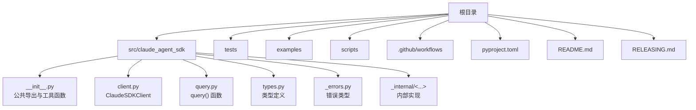
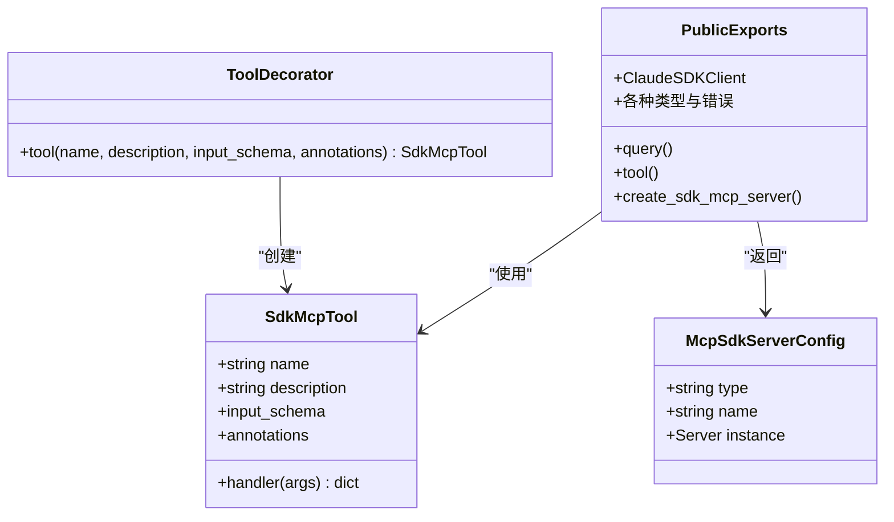
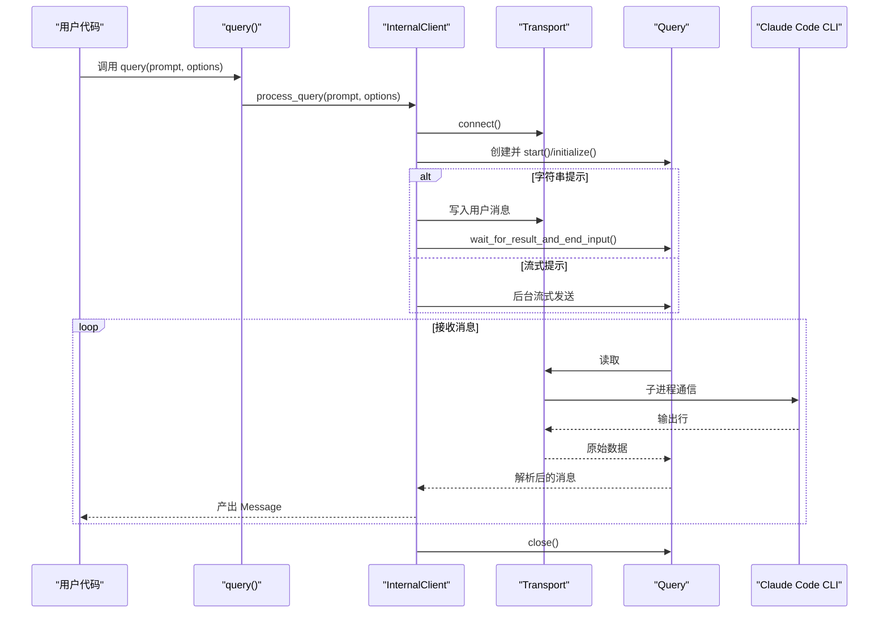
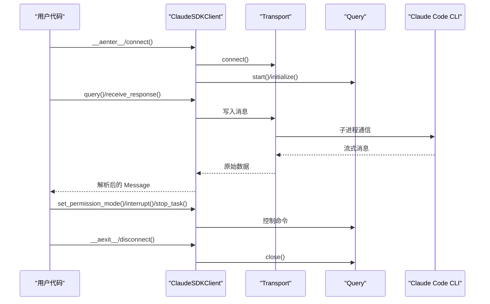
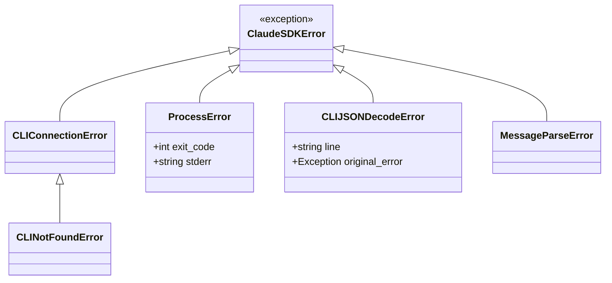
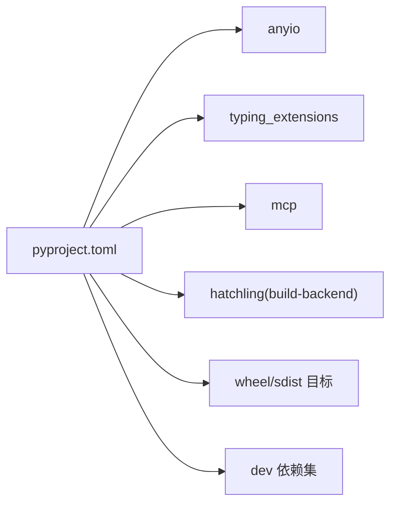
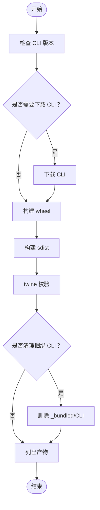

# 开发指南

<cite>
**本文档引用的文件**
- [README.md](file://README.md)
- [RELEASING.md](file://RELEASING.md)
- [CLAUDE.md](file://CLAUDE.md)
- [pyproject.toml](file://pyproject.toml)
- [src/claude_agent_sdk/__init__.py](file://src/claude_agent_sdk/__init__.py)
- [src/claude_agent_sdk/_version.py](file://src/claude_agent_sdk/_version.py)
- [src/claude_agent_sdk/_cli_version.py](file://src/claude_agent_sdk/_cli_version.py)
- [src/claude_agent_sdk/client.py](file://src/claude_agent_sdk/client.py)
- [src/claude_agent_sdk/query.py](file://src/claude_agent_sdk/query.py)
- [src/claude_agent_sdk/types.py](file://src/claude_agent_sdk/types.py)
- [src/claude_agent_sdk/_errors.py](file://src/claude_agent_sdk/_errors.py)
- [src/claude_agent_sdk/_internal/client.py](file://src/claude_agent_sdk/_internal/client.py)
- [scripts/initial-setup.sh](file://scripts/initial-setup.sh)
- [scripts/build_wheel.py](file://scripts/build_wheel.py)
- [scripts/update_version.py](file://scripts/update_version.py)
- [scripts/update_cli_version.py](file://scripts/update_cli_version.py)
</cite>

## 目录
1. [简介](#简介)
2. [项目结构](#项目结构)
3. [核心组件](#核心组件)
4. [架构总览](#架构总览)
5. [详细组件分析](#详细组件分析)
6. [依赖关系分析](#依赖关系分析)
7. [性能考虑](#性能考虑)
8. [故障排除指南](#故障排除指南)
9. [结论](#结论)
10. [附录](#附录)

## 简介
本指南面向希望为 Claude Agent SDK（Python）做出贡献的开发者，涵盖本地开发环境搭建、测试与调试、代码规范、构建与发布流程、CI/CD 配置以及常见问题排查。文档同时提供清晰的贡献路径，帮助新贡献者快速上手。

## 项目结构
仓库采用按功能模块组织的结构，核心包位于 src/claude_agent_sdk/，测试在 tests/，示例在 examples/，脚本在 scripts/，CI/CD 在 .github/workflows/。关键目录与文件职责如下：
- src/claude_agent_sdk：主包，包含公共 API（query、client、types）、内部实现与错误类型
- tests：单元测试与端到端测试
- examples：使用示例与交互式演示
- scripts：构建、版本更新与 CLI 下载工具
- .github/workflows：CI/CD 工作流定义
- pyproject.toml：项目元数据、依赖与构建配置
- README.md / RELEASING.md：用户与发布说明



**图表来源**
- [src/claude_agent_sdk/__init__.py:1-445](file://src/claude_agent_sdk/__init__.py#L1-L445)
- [src/claude_agent_sdk/client.py:1-500](file://src/claude_agent_sdk/client.py#L1-L500)
- [src/claude_agent_sdk/query.py:1-127](file://src/claude_agent_sdk/query.py#L1-L127)
- [src/claude_agent_sdk/types.py:1-800](file://src/claude_agent_sdk/types.py#L1-L800)
- [src/claude_agent_sdk/_errors.py:1-57](file://src/claude_agent_sdk/_errors.py#L1-L57)

**章节来源**
- [README.md:1-360](file://README.md#L1-L360)
- [pyproject.toml:1-109](file://pyproject.toml#L1-L109)

## 核心组件
- 公共 API 导出：通过包级 __init__.py 暴露 query、ClaudeSDKClient、类型与工具函数（如 tool、create_sdk_mcp_server）
- 查询接口：query() 提供一次性或单向流式查询；适合简单任务与批处理
- 客户端接口：ClaudeSDKClient 支持双向交互、会话管理、中断、权限模式切换等高级能力
- 类型系统：types.py 定义消息、内容块、Hook 输入输出、MCP 服务器配置与状态等强类型结构
- 错误体系：统一的 ClaudeSDKError 及其子类，便于定位连接、进程、JSON 解析等问题
- 内部实现：内部客户端与查询器负责控制协议、消息解析与传输层对接

**章节来源**
- [src/claude_agent_sdk/__init__.py:1-445](file://src/claude_agent_sdk/__init__.py#L1-L445)
- [src/claude_agent_sdk/query.py:1-127](file://src/claude_agent_sdk/query.py#L1-L127)
- [src/claude_agent_sdk/client.py:1-500](file://src/claude_agent_sdk/client.py#L1-L500)
- [src/claude_agent_sdk/types.py:1-800](file://src/claude_agent_sdk/types.py#L1-L800)
- [src/claude_agent_sdk/_errors.py:1-57](file://src/claude_agent_sdk/_errors.py#L1-L57)

## 架构总览
SDK 通过 Transport 抽象与 Claude Code CLI 进行通信，支持子进程传输与可插拔自定义传输。查询流程由 Query 协调，结合 Hook 匹配器与 MCP 服务器（含内建 SDK 服务器）实现权限控制与工具扩展。

```mermaid
graph TB
subgraph "应用层"
Q["query()<br/>一次性查询"]
C["ClaudeSDKClient<br/>交互式客户端"]
end
subgraph "控制与协议"
IQ["InternalClient<br/>内部客户端"]
QU["Query<br/>控制协议协调"]
HP["Hook 匹配器<br/>事件钩子"]
MCPS["MCP 服务器<br/>SDK/外部/代理"]
end
subgraph "传输层"
T["Transport<br/>抽象接口"]
SCT["SubprocessCLITransport<br/>子进程传输"]
end
subgraph "CLI"
CLI["Claude Code CLI<br/>二进制"]
end
Q --> IQ --> QU
C --> QU
QU --> HP
QU --> MCPS
IQ --> T
T --> SCT --> CLI
QU --> CLI
```

**图表来源**
- [src/claude_agent_sdk/query.py:1-127](file://src/claude_agent_sdk/query.py#L1-L127)
- [src/claude_agent_sdk/client.py:1-500](file://src/claude_agent_sdk/client.py#L1-L500)
- [src/claude_agent_sdk/_internal/client.py:1-146](file://src/claude_agent_sdk/_internal/client.py#L1-L146)
- [src/claude_agent_sdk/_internal/transport/subprocess_cli.py](file://src/claude_agent_sdk/_internal/transport/subprocess_cli.py)

## 详细组件分析

### 组件一：公共 API 与工具函数
- 公共导出：query、ClaudeSDKClient、各类类型与错误、工具装饰器 tool、SDK MCP 服务器 create_sdk_mcp_server
- 工具装饰器：提供类型安全的 SDK MCP 工具定义，自动注册 list_tools/call_tool 处理器
- SDK MCP 服务器：在进程中直接运行，避免 IPC 开销，便于调试与部署



**图表来源**
- [src/claude_agent_sdk/__init__.py:100-341](file://src/claude_agent_sdk/__init__.py#L100-L341)

**章节来源**
- [src/claude_agent_sdk/__init__.py:1-445](file://src/claude_agent_sdk/__init__.py#L1-L445)

### 组件二：查询流程（query 与 InternalClient）
- query()：设置入口标记、构造 InternalClient 并委托处理
- InternalClient.process_query()：校验权限回调配置、选择/创建传输、启动 Query、初始化并处理输入流，解析消息后逐条产出



**图表来源**
- [src/claude_agent_sdk/query.py:11-127](file://src/claude_agent_sdk/query.py#L11-L127)
- [src/claude_agent_sdk/_internal/client.py:44-146](file://src/claude_agent_sdk/_internal/client.py#L44-L146)

**章节来源**
- [src/claude_agent_sdk/query.py:1-127](file://src/claude_agent_sdk/query.py#L1-L127)
- [src/claude_agent_sdk/_internal/client.py:1-146](file://src/claude_agent_sdk/_internal/client.py#L1-L146)

### 组件三：交互式客户端（ClaudeSDKClient）
- 连接与初始化：支持空流自动连接、权限回调与控制协议、SDK MCP 服务器注入、会话与代理配置
- 交互能力：发送消息、接收消息、中断、切换权限模式/模型、文件回溯、MCP 服务器启停与重连、任务停止、状态查询
- 生命周期：上下文管理器自动连接/断开



**图表来源**
- [src/claude_agent_sdk/client.py:94-500](file://src/claude_agent_sdk/client.py#L94-L500)

**章节来源**
- [src/claude_agent_sdk/client.py:1-500](file://src/claude_agent_sdk/client.py#L1-L500)

### 组件四：类型系统与错误处理
- 类型系统：覆盖消息、内容块、Hook 输入输出、MCP 服务器配置与状态、权限规则、沙箱设置等
- 错误体系：统一异常基类与具体错误（连接失败、CLI 未找到、进程失败、JSON 解析失败、消息解析失败）



**图表来源**
- [src/claude_agent_sdk/_errors.py:1-57](file://src/claude_agent_sdk/_errors.py#L1-L57)

**章节来源**
- [src/claude_agent_sdk/types.py:1-800](file://src/claude_agent_sdk/types.py#L1-L800)
- [src/claude_agent_sdk/_errors.py:1-57](file://src/claude_agent_sdk/_errors.py#L1-L57)

## 依赖关系分析
- 语言与运行时：Python 3.10+，异步运行时 anyio
- 关键依赖：typing_extensions（低版本兼容）、mcp（MCP 协议支持）
- 构建与分发：hatchling 作为构建后端，wheel/sdist 目标仅包含 src/claude_agent_sdk
- 开发依赖：pytest、pytest-asyncio、pytest-cov、mypy、ruff



**图表来源**
- [pyproject.toml:1-109](file://pyproject.toml#L1-L109)

**章节来源**
- [pyproject.toml:1-109](file://pyproject.toml#L1-L109)

## 性能考虑
- 内建 SDK MCP 服务器：在进程内运行，避免 IPC 开销，提升工具调用性能
- 传输层：默认子进程传输，确保与 CLI 的稳定交互；可替换为自定义 Transport 实现
- 异步流式：query() 与 ClaudeSDKClient 均支持流式输入/输出，降低延迟与内存占用
- 版本与打包：构建脚本自动为包含 CLI 的轮子添加平台标签，减少安装后二次解压成本

[本节为通用指导，无需特定文件引用]

## 故障排除指南
- 连接与 CLI 未找到
  - 症状：抛出 CLIConnectionError 或 CLINotFoundError
  - 排查：确认 CLI 是否正确安装与路径配置；查看环境变量与入口标记
- 进程失败
  - 症状：ProcessError，包含退出码与错误输出
  - 排查：检查 CLI 日志、权限与工作目录设置
- JSON 解析失败
  - 症状：CLIJSONDecodeError
  - 排查：检查 CLI 输出格式变化或网络截断
- Hook 与权限回调冲突
  - 症状：参数校验错误（如 can_use_tool 与 permission_prompt_tool_name 互斥）
  - 排查：遵循内部逻辑自动设置 permission_prompt_tool_name，并避免同时使用两者

**章节来源**
- [src/claude_agent_sdk/_errors.py:1-57](file://src/claude_agent_sdk/_errors.py#L1-L57)
- [src/claude_agent_sdk/_internal/client.py:52-71](file://src/claude_agent_sdk/_internal/client.py#L52-L71)
- [src/claude_agent_sdk/client.py:112-131](file://src/claude_agent_sdk/client.py#L112-L131)

## 结论
本指南提供了从环境搭建到贡献发布的完整路径，强调了类型安全、异步流式与内建 MCP 服务器的性能优势，并给出了清晰的排错步骤。建议贡献者在提交前完成本地 lint、类型检查与测试，遵循既定的发布与 CI 流程。

[本节为总结性内容，无需特定文件引用]

## 附录

### 本地开发环境搭建
- 系统要求：Python 3.10+
- 安装开发依赖：使用项目提供的 dev 依赖集合
- 初始化 Git 钩子：运行初始设置脚本以启用推送前 lint 检查

**章节来源**
- [README.md:11-19](file://README.md#L11-L19)
- [pyproject.toml:33-41](file://pyproject.toml#L33-L41)
- [scripts/initial-setup.sh:1-23](file://scripts/initial-setup.sh#L1-L23)

### 代码规范与质量工具
- Lint 与格式化：Ruff（pycodestyle、flake8、isort 等规则）
- 类型检查：mypy（严格模式）
- 测试：pytest（支持 asyncio）

**章节来源**
- [pyproject.toml:87-109](file://pyproject.toml#L87-L109)
- [pyproject.toml:71-86](file://pyproject.toml#L71-L86)
- [pyproject.toml:60-69](file://pyproject.toml#L60-L69)
- [CLAUDE.md:4-17](file://CLAUDE.md#L4-L17)

### 测试运行
- 运行全部测试：pytest
- 运行指定测试文件：pytest tests/<file>.py
- 异步测试：pytest-asyncio 自动模式

**章节来源**
- [pyproject.toml:60-69](file://pyproject.toml#L60-L69)

### 构建与发布流程
- 本地构建轮子：使用构建脚本下载 CLI、打包 wheel 与 sdist，并进行 twine 校验
- 版本管理：SDK 版本与捆绑 CLI 版本分别维护，遵循语义化版本
- 发布方式：手动触发发布工作流或自动 CLI 版本提升触发



**图表来源**
- [scripts/build_wheel.py:1-393](file://scripts/build_wheel.py#L1-L393)

**章节来源**
- [README.md:300-356](file://README.md#L300-L356)
- [RELEASING.md:1-76](file://RELEASING.md#L1-L76)
- [scripts/build_wheel.py:1-393](file://scripts/build_wheel.py#L1-L393)
- [scripts/update_version.py:1-50](file://scripts/update_version.py#L1-L50)
- [scripts/update_cli_version.py:1-33](file://scripts/update_cli_version.py#L1-L33)

### CI/CD 配置与自动化测试
- 测试工作流：运行 pytest、覆盖率与 lint
- 发布工作流：构建多平台 wheel、发布到 PyPI、创建 Git Tag 与 GitHub Release
- 自动发布：当 CLI 版本提升时自动触发自动发布流程

**章节来源**
- [.github/workflows/test.yml](file://.github/workflows/test.yml)
- [.github/workflows/publish.yml](file://.github/workflows/publish.yml)
- [RELEASING.md:1-76](file://RELEASING.md#L1-L76)

### 贡献流程（分支管理、提交规范与审查）
- 分支策略：基于 main 分支进行功能开发与修复
- 提交规范：遵循项目约定的提交信息风格（例如包含版本提升相关关键字）
- 代码审查：推送前通过 pre-push 钩子执行 lint 检查；PR 需通过 CI 测试与审查

**章节来源**
- [README.md:290-356](file://README.md#L290-L356)
- [scripts/initial-setup.sh:1-23](file://scripts/initial-setup.sh#L1-L23)

### 调试技巧与性能分析
- 调试建议：利用 SDK MCP 服务器在进程内运行的优势，简化断点与日志；通过 ClaudeSDKClient 的状态查询与任务控制接口定位问题
- 性能分析：关注工具调用链路与传输层延迟；在需要时替换为自定义 Transport 以验证不同实现

**章节来源**
- [src/claude_agent_sdk/client.py:385-442](file://src/claude_agent_sdk/client.py#L385-L442)
- [src/claude_agent_sdk/__init__.py:178-341](file://src/claude_agent_sdk/__init__.py#L178-L341)