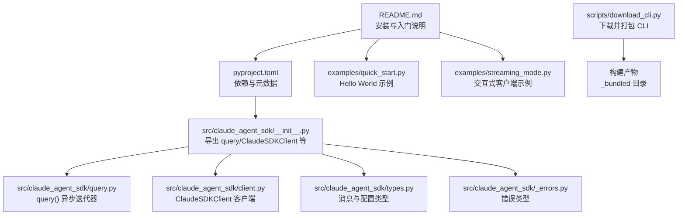
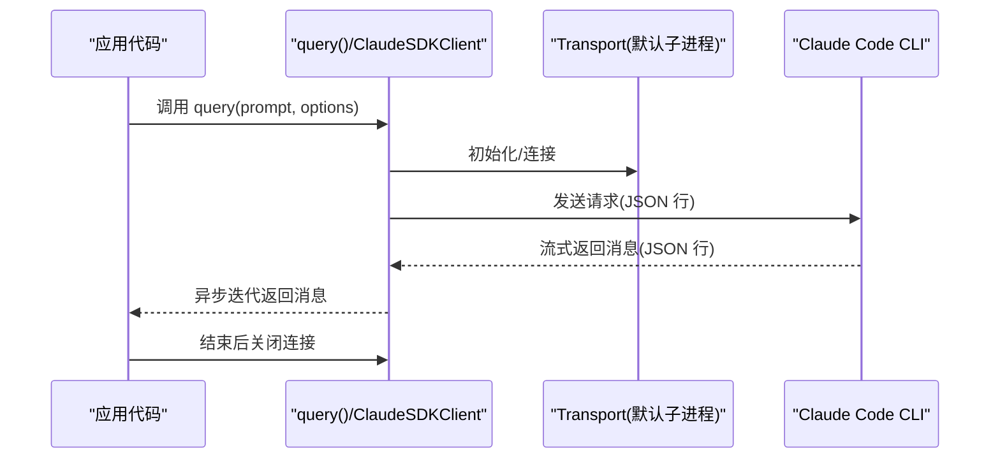
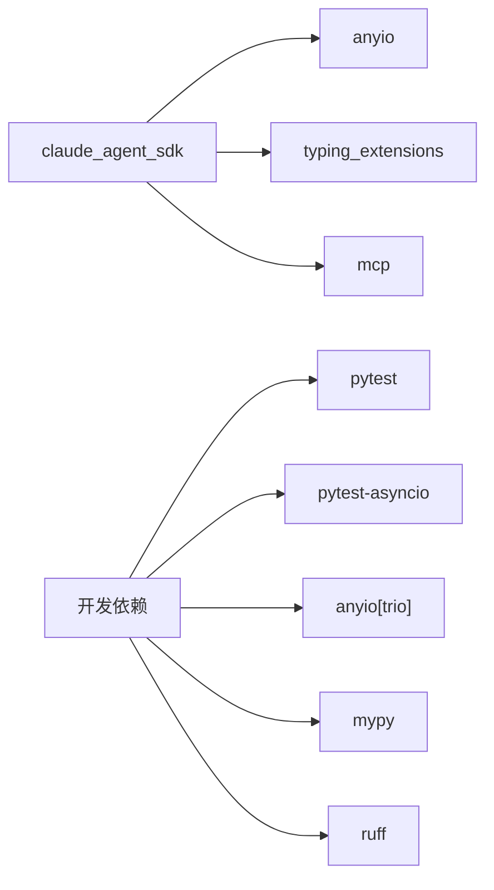

# 快速开始

<cite>
**本文引用的文件**
- [README.md](file://README.md)
- [pyproject.toml](file://pyproject.toml)
- [src/claude_agent_sdk/__init__.py](file://src/claude_agent_sdk/__init__.py)
- [src/claude_agent_sdk/query.py](file://src/claude_agent_sdk/query.py)
- [src/claude_agent_sdk/client.py](file://src/claude_agent_sdk/client.py)
- [src/claude_agent_sdk/types.py](file://src/claude_agent_sdk/types.py)
- [src/claude_agent_sdk/_errors.py](file://src/claude_agent_sdk/_errors.py)
- [examples/quick_start.py](file://examples/quick_start.py)
- [examples/streaming_mode.py](file://examples/streaming_mode.py)
- [scripts/download_cli.py](file://scripts/download_cli.py)
</cite>

## 目录
1. [简介](#简介)
2. [项目结构](#项目结构)
3. [核心组件](#核心组件)
4. [架构总览](#架构总览)
5. [详细组件分析](#详细组件分析)
6. [依赖分析](#依赖分析)
7. [性能考虑](#性能考虑)
8. [故障排查指南](#故障排查指南)
9. [结论](#结论)
10. [附录](#附录)

## 简介
本指南面向首次使用 Claude Agent SDK Python 的开发者，目标是帮助你在最短时间内完成安装、理解自动捆绑的 Claude Code CLI、运行第一个 Hello World 示例，并掌握异步编程与 anyio 的基础用法。你还将看到如何处理常见错误、进行简单文本查询以及解析响应消息。

## 项目结构
该仓库采用“源码在 src/claude_agent_sdk 下”的标准 Python 包布局，核心功能集中在：
- SDK 入口与导出：src/claude_agent_sdk/__init__.py
- 查询接口：src/claude_agent_sdk/query.py
- 客户端接口：src/claude_agent_sdk/client.py
- 类型定义：src/claude_agent_sdk/types.py
- 错误类型：src/claude_agent_sdk/_errors.py
- 示例：examples/quick_start.py、examples/streaming_mode.py
- CLI 自动下载与打包脚本：scripts/download_cli.py

图表来源
- [README.md:1-360](file://README.md#L1-L360)
- [pyproject.toml:1-109](file://pyproject.toml#L1-L109)
- [src/claude_agent_sdk/__init__.py:1-445](file://src/claude_agent_sdk/__init__.py#L1-L445)
- [src/claude_agent_sdk/query.py:1-127](file://src/claude_agent_sdk/query.py#L1-L127)
- [src/claude_agent_sdk/client.py:1-500](file://src/claude_agent_sdk/client.py#L1-L500)
- [src/claude_agent_sdk/types.py:1-200](file://src/claude_agent_sdk/types.py#L1-L200)
- [src/claude_agent_sdk/_errors.py:1-57](file://src/claude_agent_sdk/_errors.py#L1-L57)
- [examples/quick_start.py:1-77](file://examples/quick_start.py#L1-L77)
- [examples/streaming_mode.py:1-200](file://examples/streaming_mode.py#L1-L200)
- [scripts/download_cli.py:1-158](file://scripts/download_cli.py#L1-L158)

章节来源
- [README.md:1-360](file://README.md#L1-L360)
- [pyproject.toml:1-109](file://pyproject.toml#L1-L109)

## 核心组件
- query()：用于一次性或单向流式查询的异步迭代器，适合简单、无状态的任务。
- ClaudeSDKClient：用于双向、交互式的会话，支持中断、动态消息发送、权限模式切换等高级能力。
- 类型系统：包含消息类型（如 AssistantMessage、UserMessage、SystemMessage、ResultMessage）、内容块（TextBlock、ToolUseBlock、ToolResultBlock）以及 ClaudeAgentOptions 等配置项。
- 错误体系：提供 ClaudeSDKError 及其子类（如 CLINotFoundError、CLIConnectionError、ProcessError、CLIJSONDecodeError），便于定位问题。

章节来源
- [src/claude_agent_sdk/query.py:12-127](file://src/claude_agent_sdk/query.py#L12-L127)
- [src/claude_agent_sdk/client.py:21-60](file://src/claude_agent_sdk/client.py#L21-L60)
- [src/claude_agent_sdk/types.py:1-200](file://src/claude_agent_sdk/types.py#L1-L200)
- [src/claude_agent_sdk/_errors.py:6-57](file://src/claude_agent_sdk/_errors.py#L6-L57)

## 架构总览
SDK 通过 Transport 抽象与 Claude Code CLI 进行通信，默认使用子进程传输方式。query() 使用内部客户端处理一次性的请求-响应；ClaudeSDKClient 则维护长连接，支持多轮对话、中断、工具调用、钩子等。

图表来源
- [src/claude_agent_sdk/query.py:12-127](file://src/claude_agent_sdk/query.py#L12-L127)
- [src/claude_agent_sdk/client.py:94-180](file://src/claude_agent_sdk/client.py#L94-L180)

## 详细组件分析

### 安装与系统要求
- 使用 pip 安装：pip install claude-agent-sdk
- Python 版本要求：3.10 及以上
- Claude Code CLI 自动捆绑：无需单独安装，SDK 默认使用内置 CLI；也可指定系统路径或使用自定义路径

章节来源
- [README.md:5-19](file://README.md#L5-L19)
- [pyproject.toml:10](file://pyproject.toml#L10)

### 自动捆绑机制与自定义安装
- 自动捆绑：构建时通过脚本下载并复制 CLI 二进制到包内 _bundled 目录，随 wheel 一起分发
- 自定义安装：可通过环境变量或选项指定 CLI 路径，或使用系统已安装的 CLI

章节来源
- [README.md:15-18](file://README.md#L15-L18)
- [scripts/download_cli.py:51-137](file://scripts/download_cli.py#L51-L137)

### 第一个 Hello World 示例
- 使用 anyio.run 启动异步主函数
- 通过 query(prompt="...") 获取异步迭代器
- 遍历消息，识别 AssistantMessage 并提取 TextBlock 内容

章节来源
- [README.md:20-31](file://README.md#L20-L31)
- [examples/quick_start.py:15-24](file://examples/quick_start.py#L15-L24)

### 异步编程与 anyio 基础
- 以异步函数定义主流程
- 使用 anyio.run 运行事件循环
- query() 返回异步迭代器，逐条消费消息
- 对于更复杂的交互，可使用 ClaudeSDKClient 维护会话

章节来源
- [README.md:22-31](file://README.md#L22-L31)
- [examples/quick_start.py:68-77](file://examples/quick_start.py#L68-L77)

### 简单文本查询与响应处理
- query() 支持字符串提示或异步迭代器提示
- 响应消息类型包括：AssistantMessage、SystemMessage、ResultMessage 等
- 处理文本内容时，遍历 AssistantMessage.content，过滤 TextBlock 并读取文本

章节来源
- [src/claude_agent_sdk/query.py:45-97](file://src/claude_agent_sdk/query.py#L45-L97)
- [examples/quick_start.py:15-43](file://examples/quick_start.py#L15-L43)

### 错误处理模式与常见问题
- 常见错误类型：CLINotFoundError（未找到 CLI）、CLIConnectionError（连接失败）、ProcessError（进程失败）、CLIJSONDecodeError（JSON 解析失败）
- 建议的处理策略：捕获对应异常，打印提示或重试；检查 CLI 是否正确安装与可执行

章节来源
- [README.md:247-269](file://README.md#L247-L269)
- [src/claude_agent_sdk/_errors.py:6-57](file://src/claude_agent_sdk/_errors.py#L6-L57)

### 类型与配置
- ClaudeAgentOptions：系统提示、工作目录、工具白名单/黑名单、权限模式、思考配置等
- 消息类型：AssistantMessage、UserMessage、SystemMessage、ResultMessage
- 内容块：TextBlock、ToolUseBlock、ToolResultBlock

章节来源
- [src/claude_agent_sdk/types.py:17-200](file://src/claude_agent_sdk/types.py#L17-L200)

### 交互式客户端（ClaudeSDKClient）
- 适用于需要多轮对话、中断、动态消息发送的场景
- 提供 receive_messages()/receive_response()、query()、interrupt()、set_permission_mode() 等方法
- 适合构建聊天界面、调试探索、实时应用等

章节来源
- [src/claude_agent_sdk/client.py:21-60](file://src/claude_agent_sdk/client.py#L21-L60)
- [examples/streaming_mode.py:59-94](file://examples/streaming_mode.py#L59-L94)

## 依赖分析
- 运行时依赖：anyio（异步运行时）、typing_extensions（低版本 Python 的类型扩展）、mcp（MCP 协议支持）
- 可选开发依赖：pytest、pytest-asyncio、anyio[trio]、mypy、ruff 等

图表来源
- [pyproject.toml:27-41](file://pyproject.toml#L27-L41)

章节来源
- [pyproject.toml:27-41](file://pyproject.toml#L27-L41)

## 性能考虑
- 使用 SDK MCP 服务器（in-process）替代外部 MCP 服务器，避免 IPC 开销，提升工具调用性能
- 在批量任务中优先使用 query()，减少连接管理开销
- 合理设置权限模式与工具白名单，避免不必要的工具调用与阻塞

## 故障排查指南
- 未找到 CLI：确认 CLI 已安装或使用自定义路径；检查环境变量与 PATH
- 连接失败：检查网络与 CLI 状态；查看 CLI 输出日志
- 进程失败：查看退出码与 stderr 输出，定位具体原因
- JSON 解析失败：检查 CLI 输出格式是否符合预期；关注版本兼容性

章节来源
- [src/claude_agent_sdk/_errors.py:14-49](file://src/claude_agent_sdk/_errors.py#L14-L49)
- [README.md:247-269](file://README.md#L247-L269)

## 结论
通过本指南，你已经完成了 Claude Agent SDK Python 的安装与配置，理解了自动捆绑机制，成功运行了第一个 Hello World 示例，并掌握了异步编程与 anyio 的基础用法。你可以根据需求选择 query() 或 ClaudeSDKClient，结合类型系统与错误处理，快速构建从简单查询到复杂交互的应用。

## 附录

### 快速开始步骤清单
- 安装：pip install claude-agent-sdk
- 系统要求：Python 3.10+
- 运行 Hello World：参考 examples/quick_start.py 或 README.md 的示例
- 异步运行：使用 anyio.run 包裹你的异步主函数
- 错误处理：捕获 CLINotFoundError、CLIConnectionError、ProcessError、CLIJSONDecodeError

章节来源
- [README.md:5-31](file://README.md#L5-L31)
- [examples/quick_start.py:1-77](file://examples/quick_start.py#L1-L77)