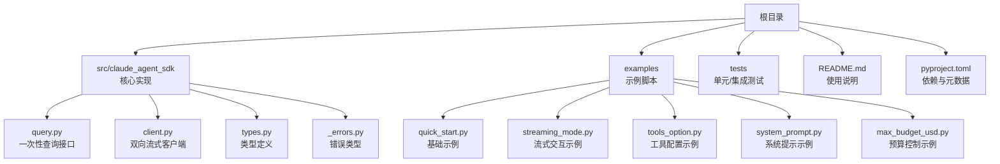
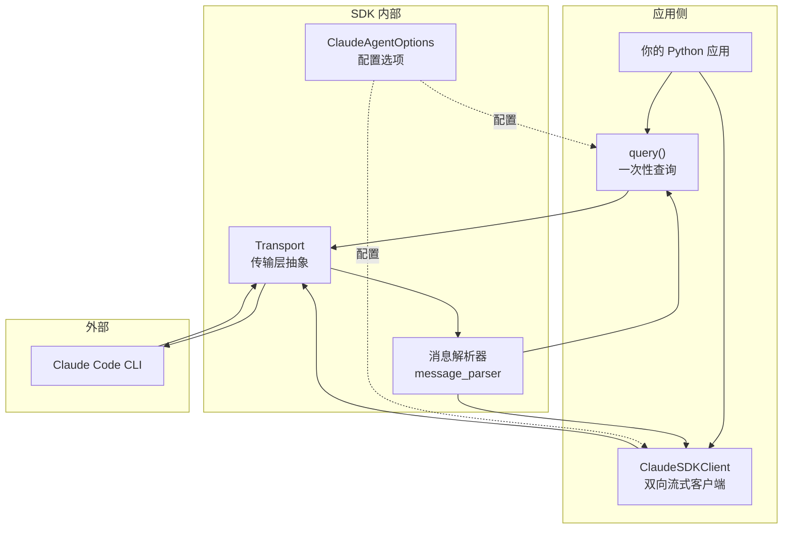
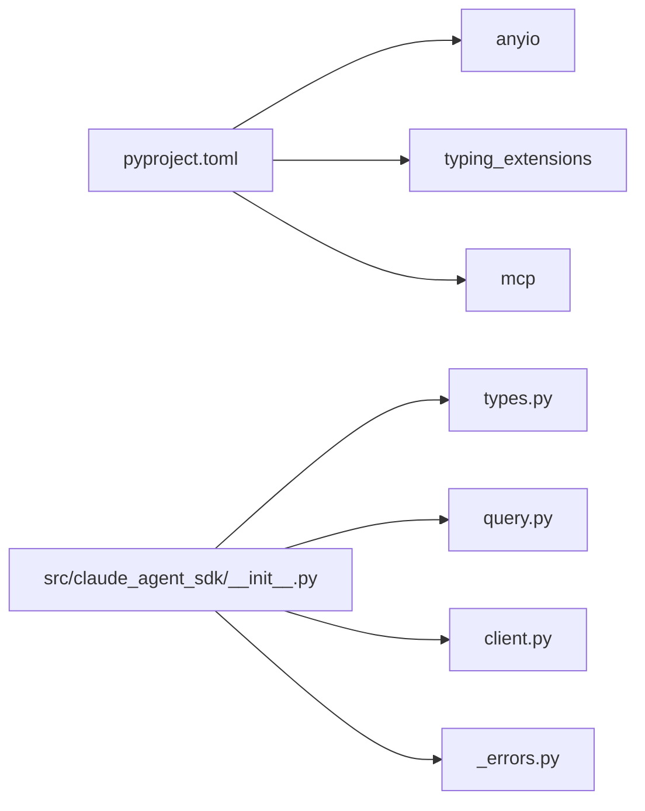

# 快速开始

<cite>
**本文引用的文件列表**
- [README.md](file://README.md)
- [pyproject.toml](file://pyproject.toml)
- [src/claude_agent_sdk/__init__.py](file://src/claude_agent_sdk/__init__.py)
- [src/claude_agent_sdk/query.py](file://src/claude_agent_sdk/query.py)
- [src/claude_agent_sdk/client.py](file://src/claude_agent_sdk/client.py)
- [src/claude_agent_sdk/types.py](file://src/claude_agent_sdk/types.py)
- [src/claude_agent_sdk/_errors.py](file://src/claude_agent_sdk/_errors.py)
- [examples/quick_start.py](file://examples/quick_start.py)
- [examples/streaming_mode.py](file://examples/streaming_mode.py)
- [examples/tools_option.py](file://examples/tools_option.py)
- [examples/system_prompt.py](file://examples/system_prompt.py)
- [examples/max_budget_usd.py](file://examples/max_budget_usd.py)
- [CHANGELOG.md](file://CHANGELOG.md)
</cite>

## 目录
1. [简介](#简介)
2. [项目结构](#项目结构)
3. [核心组件](#核心组件)
4. [架构总览](#架构总览)
5. [详细组件解析](#详细组件解析)
6. [依赖关系分析](#依赖关系分析)
7. [性能与异步编程要点](#性能与异步编程要点)
8. [故障排除与常见问题](#故障排除与常见问题)
9. [结论](#结论)
10. [附录：完整示例与预期输出路径](#附录完整示例与预期输出路径)

## 简介
本指南面向首次使用 Claude Agent SDK for Python 的开发者，目标是帮助你在最短时间内完成安装、运行第一个查询，并逐步掌握工具调用、权限控制、流式响应、错误处理等关键能力。文档覆盖：
- 安装与环境要求（Python 版本、依赖）
- 最小可用示例（query 与 ClaudeSDKClient）
- 关键概念（异步、流式响应、工具与钩子）
- 常见问题与排障建议
- 进阶示例与最佳实践

## 项目结构
该仓库采用“包内源码 + 示例 + 测试”的组织方式，核心入口位于 src/claude_agent_sdk，示例位于 examples，测试位于 tests。README 提供了总体说明与安装指引。

图表来源
- [README.md](file://README.md)
- [pyproject.toml](file://pyproject.toml)
- [src/claude_agent_sdk/query.py](file://src/claude_agent_sdk/query.py)
- [src/claude_agent_sdk/client.py](file://src/claude_agent_sdk/client.py)
- [src/claude_agent_sdk/types.py](file://src/claude_agent_sdk/types.py)
- [src/claude_agent_sdk/_errors.py](file://src/claude_agent_sdk/_errors.py)
- [examples/quick_start.py](file://examples/quick_start.py)
- [examples/streaming_mode.py](file://examples/streaming_mode.py)
- [examples/tools_option.py](file://examples/tools_option.py)
- [examples/system_prompt.py](file://examples/system_prompt.py)
- [examples/max_budget_usd.py](file://examples/max_budget_usd.py)

章节来源
- [README.md](file://README.md)
- [pyproject.toml](file://pyproject.toml)

## 核心组件
- query：一次性或单向流式查询接口，适合简单、无状态任务。
- ClaudeSDKClient：双向流式客户端，支持会话管理、中断、动态消息发送、工具与钩子等高级特性。
- 类型系统：Message、ContentBlock、ToolUseBlock、ResultMessage 等，用于强类型处理响应。
- 错误体系：CLIConnectionError、CLINotFoundError、ProcessError、CLIJSONDecodeError 等，便于定位问题。

章节来源
- [src/claude_agent_sdk/query.py](file://src/claude_agent_sdk/query.py)
- [src/claude_agent_sdk/client.py](file://src/claude_agent_sdk/client.py)
- [src/claude_agent_sdk/types.py](file://src/claude_agent_sdk/types.py)
- [src/claude_agent_sdk/_errors.py](file://src/claude_agent_sdk/_errors.py)

## 架构总览
SDK 通过 Transport 抽象与 Claude Code CLI 通信，内部使用 anyio 异步运行时。query 为一次性流程，ClaudeSDKClient 维持长连接以支持流式与交互。

图表来源
- [src/claude_agent_sdk/query.py](file://src/claude_agent_sdk/query.py)
- [src/claude_agent_sdk/client.py](file://src/claude_agent_sdk/client.py)
- [src/claude_agent_sdk/types.py](file://src/claude_agent_sdk/types.py)

## 详细组件解析

### 1) 安装与环境要求
- Python 版本：3.10 及以上
- 依赖：anyio、typing_extensions（在较老 Python 版本中）、mcp
- CLI：SDK 默认内置 Claude Code CLI，无需单独安装；也可指定自定义路径

章节来源
- [README.md](file://README.md)
- [pyproject.toml](file://pyproject.toml)

### 2) 最小可用示例：query
- 使用方法：导入 query，传入 prompt，异步迭代消息，打印文本块内容
- 典型场景：一次性问答、批处理、CI 脚本

章节来源
- [README.md](file://README.md)
- [examples/quick_start.py](file://examples/quick_start.py)

### 3) 流式交互：ClaudeSDKClient
- 适用场景：聊天界面、多轮对话、需要中断、动态消息发送
- 关键能力：receive_messages/receive_response、query、interrupt、set_permission_mode、set_model、rewind_files、get_mcp_status 等

章节来源
- [src/claude_agent_sdk/client.py](file://src/claude_agent_sdk/client.py)
- [examples/streaming_mode.py](file://examples/streaming_mode.py)

### 4) 工具与权限
- allowed_tools/disallowed_tools/permission_mode：控制工具可用性与自动批准策略
- tools 选项：可限制可用工具集合或使用预设工具集
- hooks：在特定事件点拦截并控制工具调用、权限请求等

章节来源
- [README.md](file://README.md)
- [examples/tools_option.py](file://examples/tools_option.py)
- [src/claude_agent_sdk/types.py](file://src/claude_agent_sdk/types.py)

### 5) 系统提示与预算控制
- system_prompt：字符串、预设或带追加内容的预设
- max_budget_usd：按会话设置最大消费额度，超支时返回错误状态

章节来源
- [examples/system_prompt.py](file://examples/system_prompt.py)
- [examples/max_budget_usd.py](file://examples/max_budget_usd.py)

### 6) 自定义工具（SDK MCP 服务器）
- 使用 @tool 装饰器定义工具函数，create_sdk_mcp_server 创建服务器，注入到 ClaudeAgentOptions.mcp_servers
- 优势：进程内运行、无 IPC 开销、类型安全、易调试

章节来源
- [src/claude_agent_sdk/__init__.py](file://src/claude_agent_sdk/__init__.py)
- [README.md](file://README.md)

### 7) 钩子（Hooks）
- 在 PreToolUse、PostToolUse、PermissionRequest 等事件点插入业务逻辑
- 支持同步决策与异步延后执行

章节来源
- [README.md](file://README.md)
- [src/claude_agent_sdk/types.py](file://src/claude_agent_sdk/types.py)

## 依赖关系分析
- 运行时依赖：anyio（异步）、mcp（MCP 协议）
- 类型与兼容：typing_extensions 在旧版本 Python 中提供类型扩展
- 包构建：hatchling 作为构建后端，wheel 打包，sdist 发布

图表来源
- [pyproject.toml](file://pyproject.toml)
- [src/claude_agent_sdk/__init__.py](file://src/claude_agent_sdk/__init__.py)
- [src/claude_agent_sdk/types.py](file://src/claude_agent_sdk/types.py)
- [src/claude_agent_sdk/query.py](file://src/claude_agent_sdk/query.py)
- [src/claude_agent_sdk/client.py](file://src/claude_agent_sdk/client.py)
- [src/claude_agent_sdk/_errors.py](file://src/claude_agent_sdk/_errors.py)

章节来源
- [pyproject.toml](file://pyproject.toml)
- [src/claude_agent_sdk/__init__.py](file://src/claude_agent_sdk/__init__.py)

## 性能与异步编程要点
- 异步模型：SDK 使用 anyio，推荐在 asyncio 或 trio 环境中运行。示例脚本展示了如何使用 anyio.run/main 启动异步主程序。
- 流式响应：ClaudeSDKClient 支持边发边收，适合实时交互；query 也支持流式输入（AsyncIterable）。
- MCP 服务器：SDK MCP 服务器在进程内运行，避免 IPC 开销，性能优于外部 MCP 服务器。
- 资源管理：使用上下文管理器（with 语句或 __aenter__/__aexit__）确保连接正确建立与释放。

章节来源
- [README.md](file://README.md)
- [examples/streaming_mode.py](file://examples/streaming_mode.py)
- [src/claude_agent_sdk/client.py](file://src/claude_agent_sdk/client.py)

## 故障排除与常见问题
- 未找到 Claude Code CLI
  - 现象：抛出 CLINotFoundError
  - 处理：确认 CLI 是否已随 SDK 自动安装，或手动指定 cli_path
- 连接失败
  - 现象：CLIConnectionError
  - 处理：检查网络、CLI 版本、环境变量（如 CLAUDE_CODE_STREAM_CLOSE_TIMEOUT）
- 进程异常退出
  - 现象：ProcessError（含 exit_code/stderr）
  - 处理：查看 stderr 输出，定位具体错误原因
- JSON 解析错误
  - 现象：CLIJSONDecodeError
  - 处理：检查 CLI 输出格式变化或日志截断
- 工具权限问题
  - 现象：工具被拒绝或需要确认
  - 处理：调整 allowed_tools、disallowed_tools、permission_mode 或使用 hooks 拦截并决策
- 预算超支
  - 现象：ResultMessage.subtype 为 error_max_budget_usd
  - 处理：提高 max_budget_usd 或减少调用次数

章节来源
- [README.md](file://README.md)
- [src/claude_agent_sdk/_errors.py](file://src/claude_agent_sdk/_errors.py)
- [examples/max_budget_usd.py](file://examples/max_budget_usd.py)

## 结论
Claude Agent SDK Python 提供了从简单查询到复杂流式交互的一体化能力。通过本指南，你可以：
- 快速安装并运行第一个 query 示例
- 掌握流式交互、工具与权限控制、系统提示与预算控制
- 了解自定义工具与钩子的使用方式
- 在遇到问题时快速定位并解决

建议后续深入阅读示例与类型定义，结合实际业务场景选择合适的交互模式与配置。

## 附录：完整示例与预期输出路径
以下示例均来自仓库中的脚本，你可以在本地运行它们以观察行为与输出。

- 基础示例
  - 示例脚本：[examples/quick_start.py](file://examples/quick_start.py)
  - 说明：演示 query 的基本用法、带选项的查询、工具使用与成本输出

- 流式交互示例
  - 示例脚本：[examples/streaming_mode.py](file://examples/streaming_mode.py)
  - 说明：涵盖多轮对话、并发收发、中断、手动消息处理、MCP 状态查询、错误处理等

- 工具配置示例
  - 示例脚本：[examples/tools_option.py](file://examples/tools_option.py)
  - 说明：tools 数组、空数组禁用工具、预设工具集三种模式

- 系统提示示例
  - 示例脚本：[examples/system_prompt.py](file://examples/system_prompt.py)
  - 说明：无系统提示、字符串系统提示、预设系统提示、带追加内容的预设

- 预算控制示例
  - 示例脚本：[examples/max_budget_usd.py](file://examples/max_budget_usd.py)
  - 说明：无预算、合理预算、紧预算下的不同表现与错误状态

- 查询接口参考
  - 实现位置：[src/claude_agent_sdk/query.py](file://src/claude_agent_sdk/query.py)
  - 说明：一次性或单向流式查询，支持自定义 Transport

- 客户端接口参考
  - 实现位置：[src/claude_agent_sdk/client.py](file://src/claude_agent_sdk/client.py)
  - 说明：双向流式客户端，支持会话管理、中断、MCP 状态查询、模型切换等

- 类型与错误参考
  - 类型定义：[src/claude_agent_sdk/types.py](file://src/claude_agent_sdk/types.py)
  - 错误类型：[src/claude_agent_sdk/_errors.py](file://src/claude_agent_sdk/_errors.py)

章节来源
- [examples/quick_start.py](file://examples/quick_start.py)
- [examples/streaming_mode.py](file://examples/streaming_mode.py)
- [examples/tools_option.py](file://examples/tools_option.py)
- [examples/system_prompt.py](file://examples/system_prompt.py)
- [examples/max_budget_usd.py](file://examples/max_budget_usd.py)
- [src/claude_agent_sdk/query.py](file://src/claude_agent_sdk/query.py)
- [src/claude_agent_sdk/client.py](file://src/claude_agent_sdk/client.py)
- [src/claude_agent_sdk/types.py](file://src/claude_agent_sdk/types.py)
- [src/claude_agent_sdk/_errors.py](file://src/claude_agent_sdk/_errors.py)