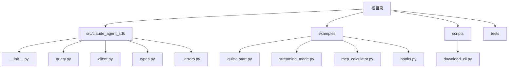
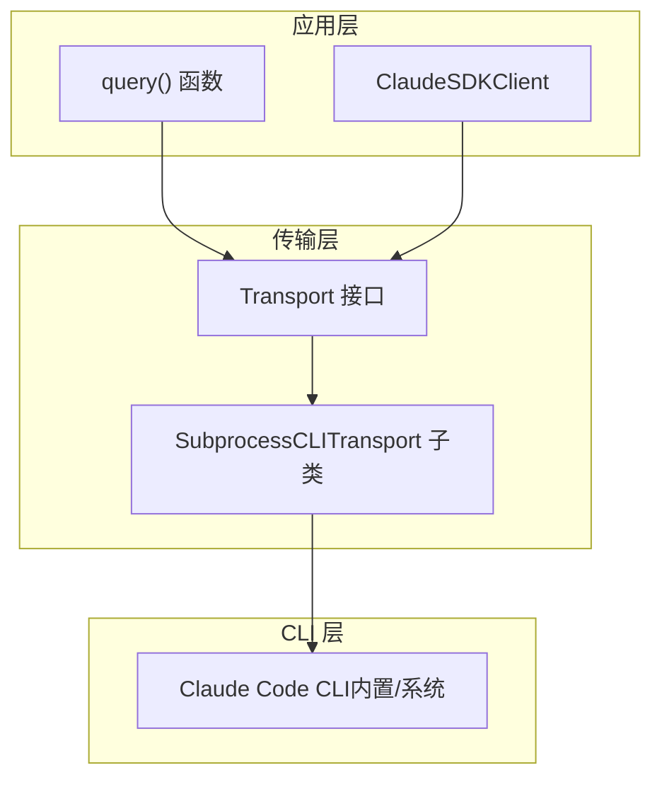
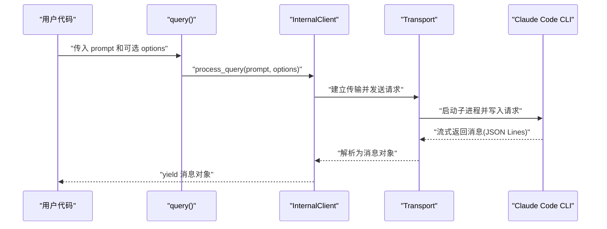
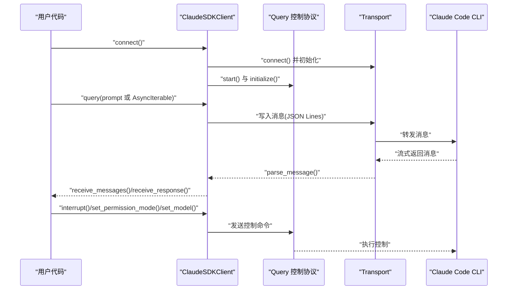
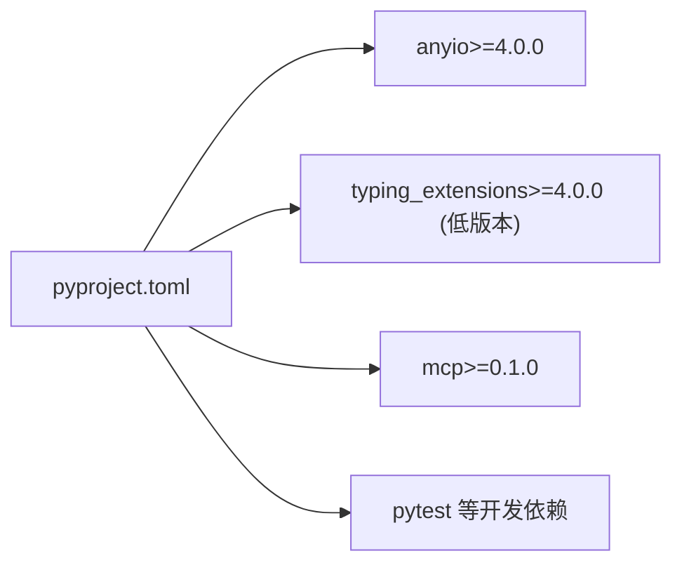

# 快速开始

<cite>
**本文引用的文件列表**
- [README.md](file://README.md)
- [pyproject.toml](file://pyproject.toml)
- [src/claude_agent_sdk/__init__.py](file://src/claude_agent_sdk/__init__.py)
- [src/claude_agent_sdk/query.py](file://src/claude_agent_sdk/query.py)
- [src/claude_agent_sdk/client.py](file://src/claude_agent_sdk/client.py)
- [src/claude_agent_sdk/types.py](file://src/claude_agent_sdk/types.py)
- [src/claude_agent_sdk/_errors.py](file://src/claude_agent_sdk/_errors.py)
- [examples/quick_start.py](file://examples/quick_start.py)
- [examples/streaming_mode.py](file://examples/streaming_mode.py)
- [examples/mcp_calculator.py](file://examples/mcp_calculator.py)
- [examples/hooks.py](file://examples/hooks.py)
- [scripts/download_cli.py](file://scripts/download_cli.py)
</cite>

## 目录
1. [简介](#简介)
2. [项目结构](#项目结构)
3. [核心组件](#核心组件)
4. [架构总览](#架构总览)
5. [详细组件解析](#详细组件解析)
6. [依赖关系分析](#依赖关系分析)
7. [性能与异步基础](#性能与异步基础)
8. [常见问题与故障排除](#常见问题与故障排除)
9. [结论](#结论)
10. [附录：完整可运行示例清单](#附录完整可运行示例清单)

## 简介
本指南面向首次接触 Claude Agent SDK Python 的开发者，目标是在 5 分钟内完成安装、运行第一个示例，并掌握基础用法（query() 与 ClaudeSDKClient 双向对话），同时了解 SDK 的自动捆绑机制与异步运行时 anyio 的使用方式。你将学会：
- 安装与系统要求（Python 3.10+）
- 自动捆绑的 Claude Code CLI 使用方式与自定义路径替代
- 最小可用示例：query() 基础调用与 ClaudeSDKClient 双向对话
- 异步编程基础与 anyio 运行时
- 常见安装问题排查

## 项目结构
该仓库采用“包源码 + 示例 + 脚本”的组织方式，核心入口位于 src/claude_agent_sdk，示例位于 examples，打包与 CLI 下载脚本位于 scripts。

图表来源
- [src/claude_agent_sdk/__init__.py](file://src/claude_agent_sdk/__init__.py)
- [examples/quick_start.py](file://examples/quick_start.py)
- [examples/streaming_mode.py](file://examples/streaming_mode.py)
- [examples/mcp_calculator.py](file://examples/mcp_calculator.py)
- [examples/hooks.py](file://examples/hooks.py)
- [scripts/download_cli.py](file://scripts/download_cli.py)

章节来源
- [README.md:1-360](file://README.md#L1-L360)
- [pyproject.toml:1-109](file://pyproject.toml#L1-L109)

## 核心组件
- query()：一次性或单向流式查询接口，适合简单问答、批量处理等场景。
- ClaudeSDKClient：支持双向交互、会话管理、中断、工具与钩子扩展的客户端。
- 类型系统：Message、ContentBlock、ClaudeAgentOptions 等类型定义。
- 错误体系：CLIConnectionError、CLINotFoundError、ProcessError、CLIJSONDecodeError 等。
- MCP 工具与钩子：通过装饰器与 HookMatcher 实现自定义工具与控制协议钩子。

章节来源
- [src/claude_agent_sdk/query.py:12-127](file://src/claude_agent_sdk/query.py#L12-L127)
- [src/claude_agent_sdk/client.py:21-500](file://src/claude_agent_sdk/client.py#L21-L500)
- [src/claude_agent_sdk/types.py:1-800](file://src/claude_agent_sdk/types.py#L1-L800)
- [src/claude_agent_sdk/_errors.py:1-57](file://src/claude_agent_sdk/_errors.py#L1-L57)
- [src/claude_agent_sdk/__init__.py:100-445](file://src/claude_agent_sdk/__init__.py#L100-L445)

## 架构总览
SDK 通过 Transport 抽象与 Claude Code CLI 通信；默认使用子进程传输；也可注入自定义 Transport。query() 用于一次性/单向流式查询；ClaudeSDKClient 提供连接、消息收发、中断、权限模式切换、模型切换、MCP 状态查询与工具重连等能力。

图表来源
- [src/claude_agent_sdk/query.py:12-127](file://src/claude_agent_sdk/query.py#L12-L127)
- [src/claude_agent_sdk/client.py:94-180](file://src/claude_agent_sdk/client.py#L94-L180)
- [src/claude_agent_sdk/__init__.py:18-20](file://src/claude_agent_sdk/__init__.py#L18-L20)

## 详细组件解析

### 安装与系统要求
- 使用 pip 安装：pip install claude-agent-sdk
- Python 版本要求：3.10 及以上
- 自动捆绑：SDK 默认自动捆绑 Claude Code CLI，无需单独安装
- 替代方案：可通过 ClaudeAgentOptions 指定自定义 CLI 路径

章节来源
- [README.md:5-19](file://README.md#L5-L19)
- [pyproject.toml:10](file://pyproject.toml#L10)

### 自动捆绑机制与系统安装替代
- 自动捆绑：构建脚本在打包时下载并复制 CLI 到包内，便于离线分发
- 系统安装：若已安装系统级 CLI，SDK 将优先使用系统版本
- 自定义路径：通过 ClaudeAgentOptions(cli_path=...) 指定 CLI 路径

章节来源
- [scripts/download_cli.py:51-137](file://scripts/download_cli.py#L51-L137)
- [README.md:15-18](file://README.md#L15-L18)

### query() 基础用法
- 用途：一次性或单向流式查询，适合简单问答、批处理
- 返回：异步迭代器，逐条产出消息
- 典型流程：准备选项（可选）→ 发送 prompt → 遍历消息 → 处理文本块

图表来源
- [src/claude_agent_sdk/query.py:12-127](file://src/claude_agent_sdk/query.py#L12-L127)
- [src/claude_agent_sdk/client.py:94-180](file://src/claude_agent_sdk/client.py#L94-L180)

章节来源
- [src/claude_agent_sdk/query.py:12-127](file://src/claude_agent_sdk/query.py#L12-L127)
- [examples/quick_start.py:15-77](file://examples/quick_start.py#L15-L77)

### ClaudeSDKClient 双向对话
- 适用场景：需要持续对话、发送后续消息、中断、权限/模型动态调整
- 关键能力：connect()/disconnect()、query()、receive_messages()/receive_response()、interrupt()、set_permission_mode()/set_model()、MCP 状态查询与重连
- 注意事项：实例不可跨异步运行时上下文使用，需在同一 async 上下文中完成所有操作

图表来源
- [src/claude_agent_sdk/client.py:94-483](file://src/claude_agent_sdk/client.py#L94-L483)

章节来源
- [src/claude_agent_sdk/client.py:21-500](file://src/claude_agent_sdk/client.py#L21-L500)
- [examples/streaming_mode.py:59-174](file://examples/streaming_mode.py#L59-L174)

### 异步编程与 anyio 运行时
- SDK 使用 anyio 作为异步运行时抽象
- 基本用法：在主协程中 anyio.run(main)，在 main 中使用 async/await
- 与 trio 的关系：optional-dependencies 中提供 anyio[trio]，但 SDK 默认 anyio>=4.0.0

章节来源
- [README.md:20-31](file://README.md#L20-L31)
- [pyproject.toml:28](file://pyproject.toml#L28)
- [pyproject.toml:37](file://pyproject.toml#L37)

### 类型与消息模型
- Message 体系：UserMessage、AssistantMessage、SystemMessage、ResultMessage
- 内容块：TextBlock、ThinkingBlock、ToolUseBlock、ToolResultBlock
- 选项：ClaudeAgentOptions（系统提示、工作目录、工具白名单/黑名单、钩子、MCP 服务器等）

章节来源
- [src/claude_agent_sdk/types.py:766-800](file://src/claude_agent_sdk/types.py#L766-L800)
- [src/claude_agent_sdk/types.py:730-764](file://src/claude_agent_sdk/types.py#L730-L764)
- [src/claude_agent_sdk/types.py:42-50](file://src/claude_agent_sdk/types.py#L42-L50)

### 错误处理
- 常见错误：CLINotFoundError（未找到 CLI）、CLIConnectionError（连接失败）、ProcessError（进程失败）、CLIJSONDecodeError（JSON 解析失败）
- 建议：在调用 query()/client.connect() 时捕获并处理相应异常

章节来源
- [src/claude_agent_sdk/_errors.py:1-57](file://src/claude_agent_sdk/_errors.py#L1-L57)
- [README.md:247-269](file://README.md#L247-L269)

### MCP 工具与钩子（进阶）
- 工具：使用 @tool 装饰器定义工具，create_sdk_mcp_server 创建 SDK 内置 MCP 服务器，允许在进程中直接调用 Python 函数
- 钩子：通过 HookMatcher 与 ClaudeAgentOptions.hooks 注册钩子，实现 PreToolUse、PostToolUse、UserPromptSubmit 等控制点

章节来源
- [src/claude_agent_sdk/__init__.py:111-341](file://src/claude_agent_sdk/__init__.py#L111-L341)
- [examples/mcp_calculator.py:138-194](file://examples/mcp_calculator.py#L138-L194)
- [examples/hooks.py:156-301](file://examples/hooks.py#L156-L301)

## 依赖关系分析
- 运行时依赖：anyio>=4.0.0、typing_extensions（低版本 Python 需要）、mcp>=0.1.0
- 开发依赖：pytest、pytest-asyncio、anyio[trio]、pytest-cov、mypy、ruff 等
- 包结构：仅包含 src/claude_agent_sdk，wheel 打包时仅包含该目录

图表来源
- [pyproject.toml:27-41](file://pyproject.toml#L27-L41)

章节来源
- [pyproject.toml:1-109](file://pyproject.toml#L1-L109)

## 性能与异步基础
- 传输层：默认子进程传输，开销较低且稳定
- MCP 服务器：SDK 内置 MCP 服务器避免外部进程 IPC 开销，性能更优
- 异步：建议使用 anyio.run(main) 启动事件循环；在 ClaudeSDKClient 中，消息消费必须活跃以启用中断等控制协议特性

章节来源
- [src/claude_agent_sdk/client.py:134-141](file://src/claude_agent_sdk/client.py#L134-L141)
- [src/claude_agent_sdk/__init__.py:178-341](file://src/claude_agent_sdk/__init__.py#L178-L341)

## 常见问题与故障排除
- 未找到 Claude Code CLI
  - 现象：抛出 CLINotFoundError
  - 处理：安装 CLI 或通过 ClaudeAgentOptions(cli_path=...) 指定路径
- 连接失败
  - 现象：CLIConnectionError
  - 处理：检查 CLI 是否可执行、网络与权限设置
- 进程失败
  - 现象：ProcessError（含 exit_code/stderr）
  - 处理：查看 stderr 输出定位问题
- JSON 解析失败
  - 现象：CLIJSONDecodeError
  - 处理：检查 CLI 输出格式是否被破坏

章节来源
- [src/claude_agent_sdk/_errors.py:14-49](file://src/claude_agent_sdk/_errors.py#L14-L49)
- [README.md:247-269](file://README.md#L247-L269)

## 结论
通过本指南，你已经完成了：
- 安装与系统要求确认
- 了解自动捆绑机制与系统安装替代
- 运行了最小可用示例（query() 与 ClaudeSDKClient）
- 掌握了异步与 anyio 的基础用法
- 了解了常见问题的排查思路

下一步建议：基于 examples/quick_start.py 与 examples/streaming_mode.py 继续探索工具与钩子能力。

## 附录：完整可运行示例清单
- 基础示例：examples/quick_start.py
- 流式对话示例：examples/streaming_mode.py
- MCP 计算器示例：examples/mcp_calculator.py
- 钩子示例：examples/hooks.py

章节来源
- [examples/quick_start.py:1-77](file://examples/quick_start.py#L1-L77)
- [examples/streaming_mode.py:1-512](file://examples/streaming_mode.py#L1-L512)
- [examples/mcp_calculator.py:1-194](file://examples/mcp_calculator.py#L1-L194)
- [examples/hooks.py:1-351](file://examples/hooks.py#L1-L351)