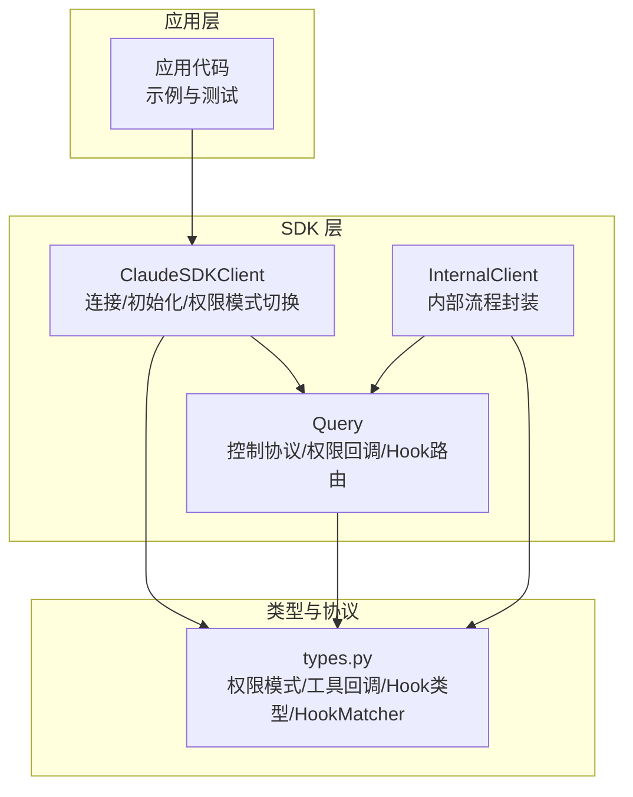
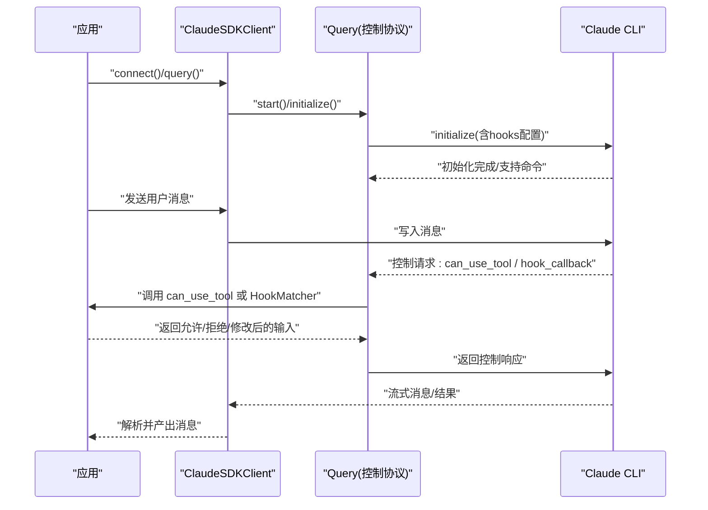
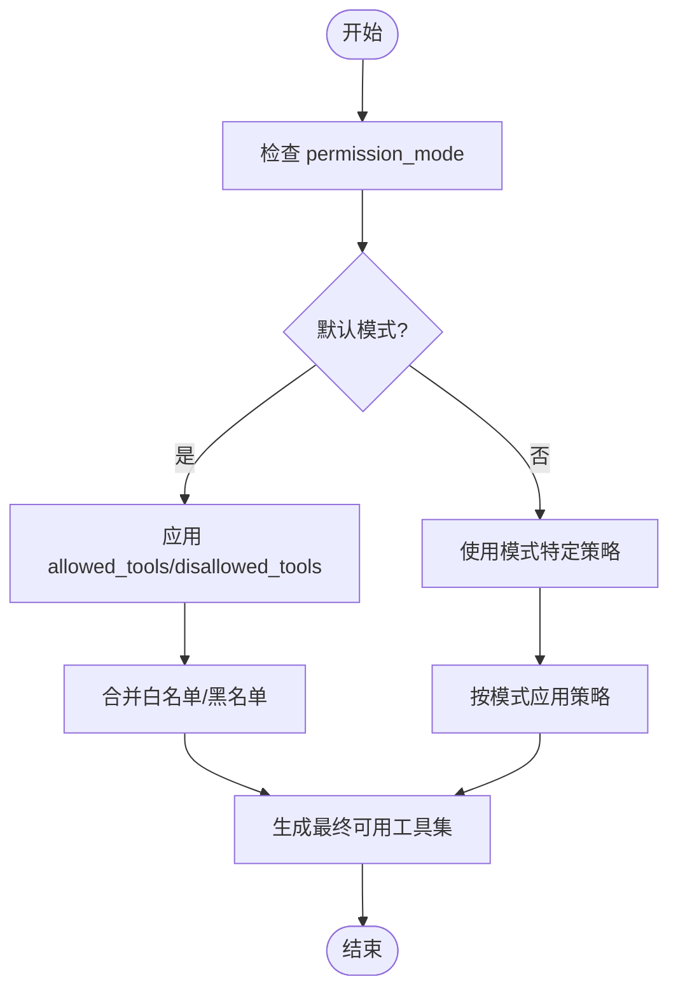
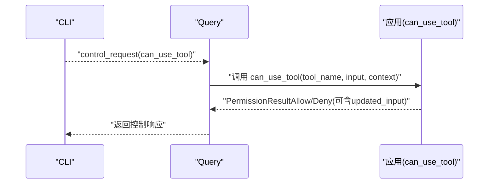
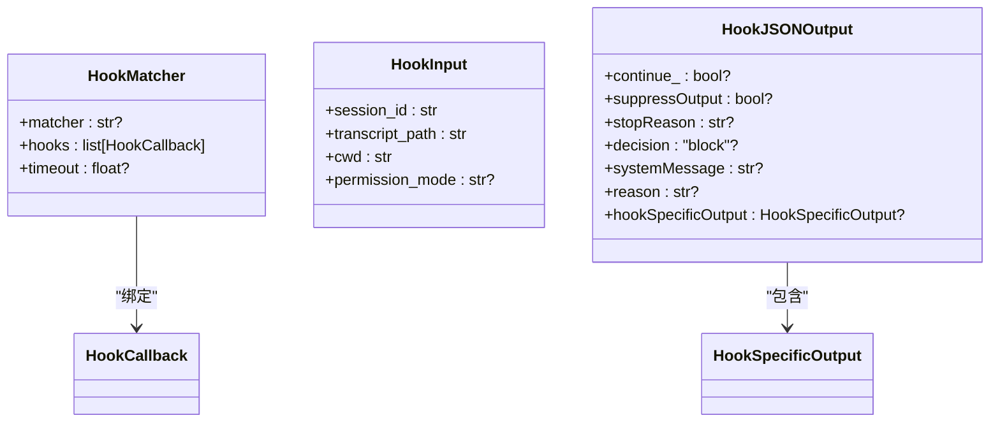
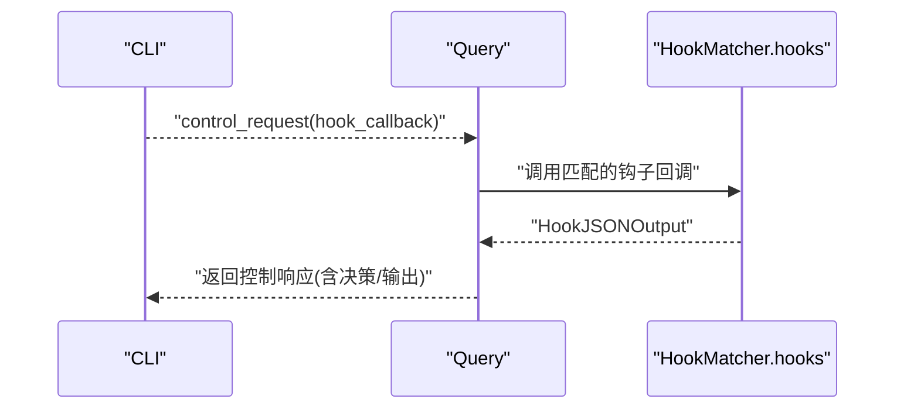
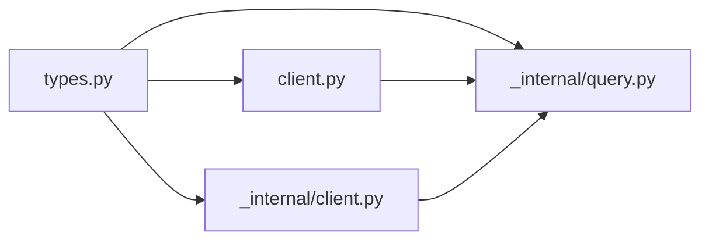

# 权限和安全

<cite>
**本文引用的文件**
- [src/claude_agent_sdk/types.py](file://src/claude_agent_sdk/types.py)
- [src/claude_agent_sdk/client.py](file://src/claude_agent_sdk/client.py)
- [src/claude_agent_sdk/_internal/query.py](file://src/claude_agent_sdk/_internal/query.py)
- [src/claude_agent_sdk/_internal/client.py](file://src/claude_agent_sdk/_internal/client.py)
- [examples/tool_permission_callback.py](file://examples/tool_permission_callback.py)
- [examples/hooks.py](file://examples/hooks.py)
- [e2e-tests/test_tool_permissions.py](file://e2e-tests/test_tool_permissions.py)
- [e2e-tests/test_hooks.py](file://e2e-tests/test_hooks.py)
</cite>

## 目录
1. [简介](#简介)
2. [项目结构](#项目结构)
3. [核心组件](#核心组件)
4. [架构总览](#架构总览)
5. [详细组件分析](#详细组件分析)
6. [依赖分析](#依赖分析)
7. [性能考虑](#性能考虑)
8. [故障排查指南](#故障排查指南)
9. [结论](#结论)
10. [附录](#附录)

## 简介
本文件系统性梳理 Claude Agent SDK 的权限与安全体系，覆盖以下主题：
- 权限模型设计：权限模式、工具访问控制（allowed_tools/disallowed_tools）、运行时权限管理
- permission_mode 的选项与行为差异
- 钩子系统安全机制：PreToolUse、PostToolUse 等事件的拦截与控制
- 工具权限回调函数的实现指南与最佳实践
- HookMatcher 的匹配规则与过滤逻辑
- 安全配置示例与细粒度权限控制
- 安全审计与监控建议
- 常见安全问题的预防与解决

## 项目结构
围绕权限与安全的关键模块分布如下：
- 类型定义与协议：types.py 提供权限模式、工具权限回调签名、Hook 输入输出、HookMatcher 等类型
- 客户端与初始化：client.py 负责连接、初始化、设置权限模式；内部实现位于 _internal/client.py
- 控制协议与权限决策：_internal/query.py 处理 SDK 控制协议，桥接 can_use_tool 回调与 Hook 输出
- 示例与测试：examples 下的工具权限与钩子示例；e2e-tests 验证端到端行为

图表来源
- [src/claude_agent_sdk/client.py:1-120](file://src/claude_agent_sdk/client.py#L1-L120)
- [src/claude_agent_sdk/_internal/client.py:1-146](file://src/claude_agent_sdk/_internal/client.py#L1-L146)
- [src/claude_agent_sdk/_internal/query.py:1-200](file://src/claude_agent_sdk/_internal/query.py#L1-L200)
- [src/claude_agent_sdk/types.py:1-120](file://src/claude_agent_sdk/types.py#L1-L120)

章节来源
- [src/claude_agent_sdk/types.py:1-120](file://src/claude_agent_sdk/types.py#L1-L120)
- [src/claude_agent_sdk/client.py:1-120](file://src/claude_agent_sdk/client.py#L1-L120)
- [src/claude_agent_sdk/_internal/client.py:1-146](file://src/claude_agent_sdk/_internal/client.py#L1-L146)

## 核心组件
- 权限模式（PermissionMode）：default、acceptEdits、plan、bypassPermissions
- 工具访问控制：allowed_tools、disallowed_tools
- 工具权限回调（can_use_tool）：在工具执行前进行动态决策
- Hook 系统：PreToolUse、PostToolUse、PostToolUseFailure、UserPromptSubmit、Stop、SubagentStop、PreCompact、Notification、SubagentStart、PermissionRequest
- HookMatcher：基于字符串匹配器与超时的钩子分发配置
- 运行时权限管理：通过 set_permission_mode 在会话中动态调整策略

章节来源
- [src/claude_agent_sdk/types.py:17-21](file://src/claude_agent_sdk/types.py#L17-L21)
- [src/claude_agent_sdk/types.py:1034-1042](file://src/claude_agent_sdk/types.py#L1034-L1042)
- [src/claude_agent_sdk/types.py:1062-1066](file://src/claude_agent_sdk/types.py#L1062-L1066)
- [src/claude_agent_sdk/types.py:160-172](file://src/claude_agent_sdk/types.py#L160-L172)
- [src/claude_agent_sdk/types.py:475-491](file://src/claude_agent_sdk/types.py#L475-L491)
- [src/claude_agent_sdk/client.py:234-256](file://src/claude_agent_sdk/client.py#L234-L256)

## 架构总览
SDK 通过双向控制协议与 Claude CLI 交互。客户端负责初始化、发送用户消息、接收响应，并在需要时触发权限决策与 Hook。

图表来源
- [src/claude_agent_sdk/client.py:94-180](file://src/claude_agent_sdk/client.py#L94-L180)
- [src/claude_agent_sdk/_internal/query.py:119-163](file://src/claude_agent_sdk/_internal/query.py#L119-L163)
- [src/claude_agent_sdk/_internal/query.py:196-200](file://src/claude_agent_sdk/_internal/query.py#L196-L200)

## 详细组件分析

### 权限模式与工具访问控制
- 权限模式（permission_mode）
  - default：对危险工具进行提示或询问
  - acceptEdits：自动接受文件编辑类操作
  - plan：计划模式（用于任务规划）
  - bypassPermissions：允许所有工具（高风险）
- 工具白名单/黑名单
  - allowed_tools：仅允许指定工具
  - disallowed_tools：禁止指定工具
- 运行时切换
  - set_permission_mode 支持在会话中动态变更

图表来源
- [src/claude_agent_sdk/types.py:17-21](file://src/claude_agent_sdk/types.py#L17-L21)
- [src/claude_agent_sdk/types.py:1034-1042](file://src/claude_agent_sdk/types.py#L1034-L1042)
- [src/claude_agent_sdk/client.py:234-256](file://src/claude_agent_sdk/client.py#L234-L256)

章节来源
- [src/claude_agent_sdk/types.py:17-21](file://src/claude_agent_sdk/types.py#L17-L21)
- [src/claude_agent_sdk/types.py:1034-1042](file://src/claude_agent_sdk/types.py#L1034-L1042)
- [src/claude_agent_sdk/client.py:234-256](file://src/claude_agent_sdk/client.py#L234-L256)

### 工具权限回调（can_use_tool）
- 回调签名：接收 tool_name、input、ToolPermissionContext，返回 PermissionResultAllow 或 PermissionResultDeny
- 允许场景：只读工具、受控路径、已授权命令
- 拒绝场景：系统目录写入、危险命令模式、未知工具
- 修改输入：对输入进行重定向或参数修正后允许
- 触发条件：当工具非“自动允许”的只读操作时，回调被调用

图表来源
- [src/claude_agent_sdk/_internal/query.py:264-286](file://src/claude_agent_sdk/_internal/query.py#L264-L286)
- [src/claude_agent_sdk/types.py:124-157](file://src/claude_agent_sdk/types.py#L124-L157)

章节来源
- [examples/tool_permission_callback.py:26-93](file://examples/tool_permission_callback.py#L26-L93)
- [e2e-tests/test_tool_permissions.py:19-65](file://e2e-tests/test_tool_permissions.py#L19-L65)
- [src/claude_agent_sdk/_internal/query.py:264-286](file://src/claude_agent_sdk/_internal/query.py#L264-L286)

### 钩子系统与 HookMatcher
- 钩子事件：PreToolUse、PostToolUse、PostToolUseFailure、UserPromptSubmit、Stop、SubagentStop、PreCompact、Notification、SubagentStart、PermissionRequest
- HookMatcher
  - matcher：字符串匹配器，如工具名或“工具A|工具B”组合
  - hooks：对应事件的回调列表
  - timeout：该匹配器下所有钩子的超时（秒）
- Hook 输出
  - 同步输出：continue_、suppressOutput、stopReason、decision、systemMessage、reason、hookSpecificOutput
  - 异步输出：async_、asyncTimeout
- 匹配与路由
  - 初始化时将 HookMatcher 转换为内部格式，注册回调 ID 并建立事件到回调的映射

图表来源
- [src/claude_agent_sdk/types.py:475-491](file://src/claude_agent_sdk/types.py#L475-L491)
- [src/claude_agent_sdk/types.py:160-172](file://src/claude_agent_sdk/types.py#L160-L172)
- [src/claude_agent_sdk/types.py:393-452](file://src/claude_agent_sdk/types.py#L393-L452)

章节来源
- [examples/hooks.py:46-135](file://examples/hooks.py#L46-L135)
- [src/claude_agent_sdk/_internal/query.py:128-155](file://src/claude_agent_sdk/_internal/query.py#L128-L155)
- [e2e-tests/test_hooks.py:17-157](file://e2e-tests/test_hooks.py#L17-L157)

### Hook 事件拦截与控制流程
- PreToolUse：可决定允许/拒绝、附加原因、修改输入、提供额外上下文
- PostToolUse：可审查输出、提供反馈、更新 MCP 工具输出
- PostToolUseFailure：错误时的拦截与处理
- PermissionRequest：权限请求事件的决策
- 执行控制：通过 continue_、stopReason 实现暂停/终止

图表来源
- [src/claude_agent_sdk/_internal/query.py:196-200](file://src/claude_agent_sdk/_internal/query.py#L196-L200)
- [src/claude_agent_sdk/_internal/query.py:34-50](file://src/claude_agent_sdk/_internal/query.py#L34-L50)

章节来源
- [examples/hooks.py:156-301](file://examples/hooks.py#L156-L301)
- [e2e-tests/test_hooks.py:17-157](file://e2e-tests/test_hooks.py#L17-L157)

### HookMatcher 匹配规则与过滤逻辑
- 字符串匹配器支持单个工具名或“工具A|工具B”的组合
- 匹配器可设置超时，避免阻塞
- 初始化阶段将匹配器转换为内部结构，分配回调 ID 并注册到事件路由表

章节来源
- [src/claude_agent_sdk/types.py:475-491](file://src/claude_agent_sdk/types.py#L475-L491)
- [src/claude_agent_sdk/_internal/query.py:128-155](file://src/claude_agent_sdk/_internal/query.py#L128-L155)

### 工具权限回调实现指南与最佳实践
- 回调职责
  - 识别工具类型与输入参数
  - 对只读工具直接放行
  - 对写操作进行路径校验与重定向
  - 对危险命令模式进行阻断
  - 对未知工具进行人工确认或记录
- 输入修改
  - 使用 updated_input 返回修改后的安全输入
  - 记录日志以便审计
- 错误处理
  - 明确 message 与 interrupt 标记
  - 在必要时中断后续流程
- 性能与可靠性
  - 回调应尽量轻量，避免长时间阻塞
  - 必要时结合 HookMatcher.timeout 进行超时控制

章节来源
- [examples/tool_permission_callback.py:26-93](file://examples/tool_permission_callback.py#L26-L93)
- [src/claude_agent_sdk/_internal/query.py:264-286](file://src/claude_agent_sdk/_internal/query.py#L264-L286)

### 安全配置示例（细粒度权限控制）
- 仅允许特定工具
  - 设置 allowed_tools 列表
- 显式禁止某些工具
  - 设置 disallowed_tools 列表
- 动态权限模式
  - 使用 set_permission_mode 在不同阶段切换策略
- 钩子保护
  - 通过 HookMatcher 为 Bash 等高危工具设置严格规则
  - 在 PostToolUse 中审查输出并提供系统消息与原因
- Hook 异步与超时
  - 为复杂钩子设置合理 timeout，避免阻塞

章节来源
- [examples/hooks.py:156-301](file://examples/hooks.py#L156-L301)
- [src/claude_agent_sdk/client.py:234-256](file://src/claude_agent_sdk/client.py#L234-L256)

## 依赖分析
- 客户端与内部实现
  - ClaudeSDKClient 将 HookMatcher 转换为内部格式并传递给 Query
  - InternalClient 在处理查询时同样进行 HookMatcher 转换
- 控制协议
  - Query 负责初始化 hooks 配置、路由控制请求、调用回调、组装响应
- 类型与协议
  - types.py 定义了权限模式、工具回调、Hook 输入输出、HookMatcher 等强类型

图表来源
- [src/claude_agent_sdk/types.py:1-120](file://src/claude_agent_sdk/types.py#L1-L120)
- [src/claude_agent_sdk/client.py:76-92](file://src/claude_agent_sdk/client.py#L76-L92)
- [src/claude_agent_sdk/_internal/client.py:26-42](file://src/claude_agent_sdk/_internal/client.py#L26-L42)
- [src/claude_agent_sdk/_internal/query.py:128-155](file://src/claude_agent_sdk/_internal/query.py#L128-L155)

章节来源
- [src/claude_agent_sdk/client.py:76-92](file://src/claude_agent_sdk/client.py#L76-L92)
- [src/claude_agent_sdk/_internal/client.py:26-42](file://src/claude_agent_sdk/_internal/client.py#L26-L42)
- [src/claude_agent_sdk/_internal/query.py:128-155](file://src/claude_agent_sdk/_internal/query.py#L128-L155)

## 性能考虑
- HookMatcher.timeout：为高风险或外部系统交互的钩子设置合理超时，避免阻塞主流程
- can_use_tool 回调应保持轻量，避免同步 I/O
- 流式模式下的消息处理与背压控制
- MCP 服务器连接状态监控与重连策略

## 故障排查指南
- 回调未触发
  - 确认使用的是流式模式（AsyncIterable），否则会抛出异常
  - 确认未同时设置 permission_prompt_tool_name
- 权限模式无效
  - 确认在会话中调用了 set_permission_mode
  - 检查 allowed_tools/disallowed_tools 是否与模式冲突
- 钩子不生效
  - 检查 HookMatcher.matcher 是否正确匹配工具名
  - 确认初始化时已注册 hooks 配置
- 错误输出与中断
  - 使用 PermissionRequest 事件的 decision 字段进行显式控制
  - 在 PostToolUseFailure 中记录错误并决定是否继续

章节来源
- [src/claude_agent_sdk/client.py:112-131](file://src/claude_agent_sdk/client.py#L112-L131)
- [src/claude_agent_sdk/_internal/query.py:128-155](file://src/claude_agent_sdk/_internal/query.py#L128-L155)
- [e2e-tests/test_hooks.py:17-157](file://e2e-tests/test_hooks.py#L17-L157)
- [e2e-tests/test_tool_permissions.py:19-65](file://e2e-tests/test_tool_permissions.py#L19-L65)

## 结论
本 SDK 提供了从权限模式、工具白/黑名单到运行时 Hook 的完整安全框架。通过 can_use_tool 回调与 HookMatcher，开发者可以在工具执行前后实施细粒度的安全控制与审计。建议在生产环境谨慎使用 bypassPermissions，优先采用 default/acceptEdits 并配合严格的 Hook 规则与超时控制。

## 附录
- 最佳实践清单
  - 仅暴露最小化 allowed_tools
  - 对写操作强制路径白名单与输入重定向
  - 为危险命令模式建立阻断规则
  - 使用 PermissionRequest 事件进行策略决策
  - 为复杂钩子设置超时，避免阻塞
  - 记录工具使用日志与权限决策上下文
  - 定期评估与更新 disallowed_tools 与 Hook 规则