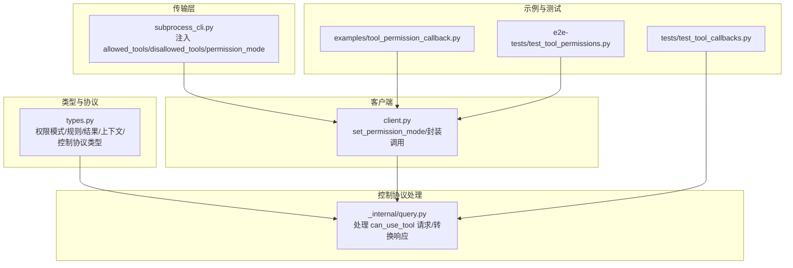
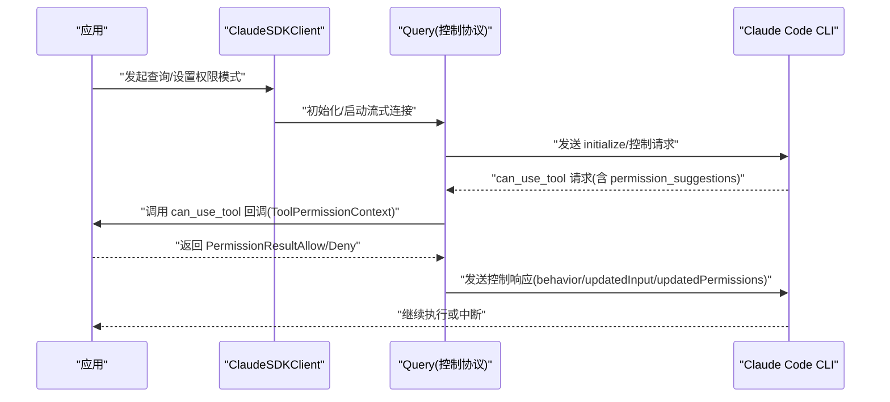
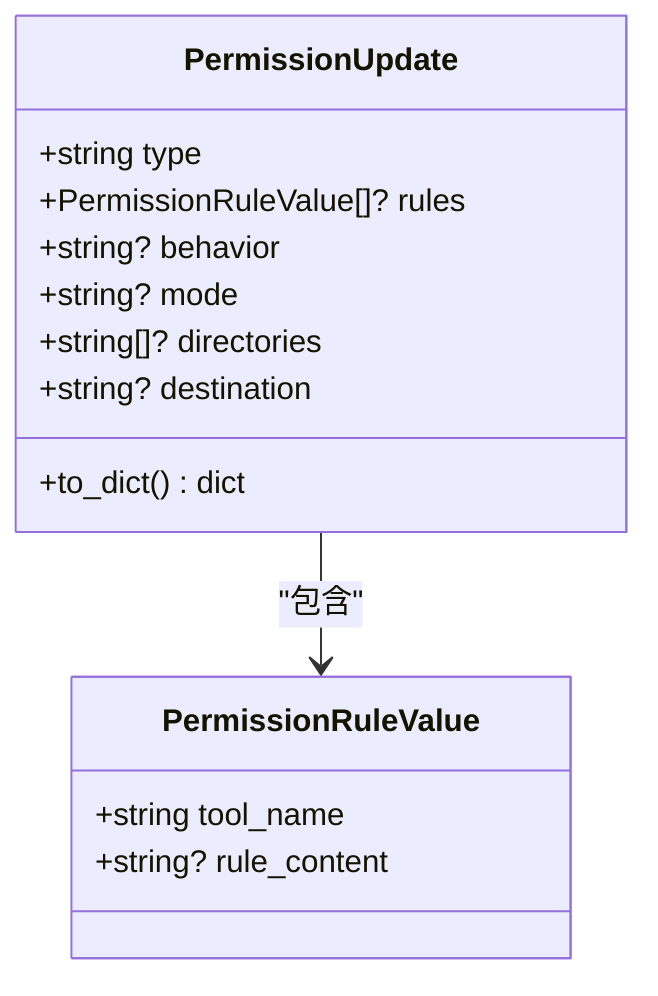
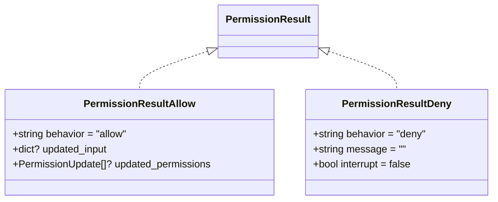
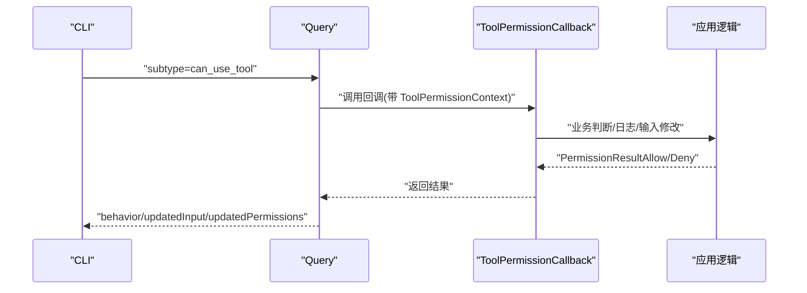
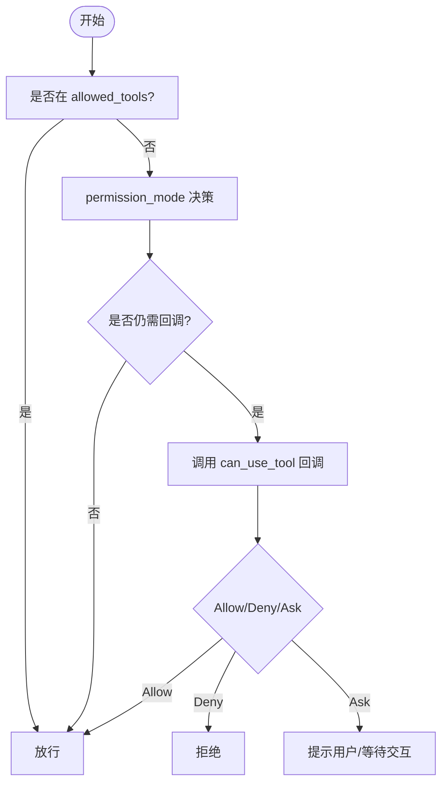
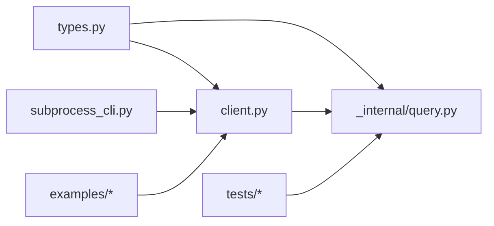

# 权限模型

<cite>
**本文引用的文件**
- [src/claude_agent_sdk/types.py](file://src/claude_agent_sdk/types.py)
- [src/claude_agent_sdk/_internal/query.py](file://src/claude_agent_sdk/_internal/query.py)
- [src/claude_agent_sdk/_internal/transport/subprocess_cli.py](file://src/claude_agent_sdk/_internal/transport/subprocess_cli.py)
- [src/claude_agent_sdk/client.py](file://src/claude_agent_sdk/client.py)
- [examples/tool_permission_callback.py](file://examples/tool_permission_callback.py)
- [tests/test_tool_callbacks.py](file://tests/test_tool_callbacks.py)
- [e2e-tests/test_tool_permissions.py](file://e2e-tests/test_tool_permissions.py)
</cite>

## 目录
1. [简介](#简介)
2. [项目结构](#项目结构)
3. [核心组件](#核心组件)
4. [架构总览](#架构总览)
5. [详细组件分析](#详细组件分析)
6. [依赖分析](#依赖分析)
7. [性能考虑](#性能考虑)
8. [故障排查指南](#故障排查指南)
9. [结论](#结论)
10. [附录](#附录)

## 简介
本文件系统化梳理并解释 Claude Agent SDK 的权限模型与工具权限回调机制，覆盖以下主题：
- 权限模式（PermissionMode）：default、acceptEdits、plan、bypassPermissions 的行为差异与适用场景
- 权限更新（PermissionUpdate）与规则值（PermissionRuleValue）：数据结构、规则类型、行为选项（allow、deny、ask）、目标位置（userSettings、projectSettings、localSettings、session）
- 权限结果（PermissionResult）：PermissionResultAllow 与 PermissionResultDeny 的字段与语义
- 字典转换机制与 to_dict() 实现细节
- 工具权限回调（ToolPermissionCallback）与上下文（ToolPermissionContext）：参数、返回值、建议（suggestions）传递
- allowed_tools 与 disallowed_tools 的使用方法与优先级规则
- 权限建议（suggestions）的传递机制与 CLI 的权限决策过程
- 实际配置示例与最佳实践

## 项目结构
权限模型相关代码主要分布在以下模块：
- 类型定义与协议：src/claude_agent_sdk/types.py
- 控制协议处理：src/claude_agent_sdk/_internal/query.py
- CLI 参数注入：src/claude_agent_sdk/_internal/transport/subprocess_cli.py
- 客户端封装与交互：src/claude_agent_sdk/client.py
- 示例与测试：examples/tool_permission_callback.py、tests/test_tool_callbacks.py、e2e-tests/test_tool_permissions.py

图表来源
- [src/claude_agent_sdk/types.py](file://src/claude_agent_sdk/types.py)
- [src/claude_agent_sdk/_internal/query.py](file://src/claude_agent_sdk/_internal/query.py)
- [src/claude_agent_sdk/_internal/transport/subprocess_cli.py](file://src/claude_agent_sdk/_internal/transport/subprocess_cli.py)
- [src/claude_agent_sdk/client.py](file://src/claude_agent_sdk/client.py)
- [examples/tool_permission_callback.py](file://examples/tool_permission_callback.py)
- [tests/test_tool_callbacks.py](file://tests/test_tool_callbacks.py)
- [e2e-tests/test_tool_permissions.py](file://e2e-tests/test_tool_permissions.py)

章节来源
- [src/claude_agent_sdk/types.py](file://src/claude_agent_sdk/types.py)
- [src/claude_agent_sdk/_internal/query.py](file://src/claude_agent_sdk/_internal/query.py)
- [src/claude_agent_sdk/_internal/transport/subprocess_cli.py](file://src/claude_agent_sdk/_internal/transport/subprocess_cli.py)
- [src/claude_agent_sdk/client.py](file://src/claude_agent_sdk/client.py)
- [examples/tool_permission_callback.py](file://examples/tool_permission_callback.py)
- [tests/test_tool_callbacks.py](file://tests/test_tool_callbacks.py)
- [e2e-tests/test_tool_permissions.py](file://e2e-tests/test_tool_permissions.py)

## 核心组件
- 权限模式（PermissionMode）：default、acceptEdits、plan、bypassPermissions
- 规则值（PermissionRuleValue）：tool_name、rule_content
- 权限更新（PermissionUpdate）：type、rules、behavior、mode、directories、destination；支持 to_dict() 转换
- 工具权限结果（PermissionResult）：PermissionResultAllow（behavior="allow"、updated_input、updated_permissions）与 PermissionResultDeny（behavior="deny"、message、interrupt）
- 工具权限上下文（ToolPermissionContext）：signal、suggestions
- 控制协议请求（SDKControlPermissionRequest）：subtype="can_use_tool"、tool_name、input、permission_suggestions、blocked_path

章节来源
- [src/claude_agent_sdk/types.py](file://src/claude_agent_sdk/types.py)
- [src/claude_agent_sdk/_internal/query.py](file://src/claude_agent_sdk/_internal/query.py)

## 架构总览
权限模型通过双向控制协议与 CLI 协作完成工具使用前的授权决策。流程概览如下：

图表来源
- [src/claude_agent_sdk/_internal/query.py](file://src/claude_agent_sdk/_internal/query.py)
- [src/claude_agent_sdk/client.py](file://src/claude_agent_sdk/client.py)

## 详细组件分析

### 权限模式（PermissionMode）详解
- default
  - 行为：对非只读工具（如写入、编辑、危险命令）触发回调或提示，允许用户介入决策
  - 适用：需要细粒度控制与安全审计的场景
- acceptEdits
  - 行为：自动接受文件编辑类操作，减少交互成本
  - 适用：代码审查、批量修改等以“编辑”为主的工作流
- plan
  - 行为：以计划模式运行，通常用于离线规划与预演
  - 适用：离线任务编排、策略验证
- bypassPermissions
  - 行为：绕过权限检查，允许所有工具使用（高风险）
  - 适用：内部测试、受控沙箱环境

章节来源
- [src/claude_agent_sdk/client.py](file://src/claude_agent_sdk/client.py)

### PermissionUpdate 与 PermissionRuleValue 数据结构
- PermissionRuleValue
  - tool_name：工具名
  - rule_content：规则内容（可选）
- PermissionUpdate
  - type：addRules、replaceRules、removeRules、setMode、addDirectories、removeDirectories
  - rules：PermissionRuleValue 列表
  - behavior：allow、deny、ask（仅规则类 type）
  - mode：PermissionMode（仅 setMode）
  - directories：目录列表（仅目录类 type）
  - destination：userSettings、projectSettings、localSettings、session
  - to_dict()：按类型分支序列化，统一输出 destination、rules、behavior、mode、directories

图表来源
- [src/claude_agent_sdk/types.py](file://src/claude_agent_sdk/types.py)

章节来源
- [src/claude_agent_sdk/types.py](file://src/claude_agent_sdk/types.py)

### PermissionResult 类型体系
- PermissionResultAllow
  - behavior: "allow"
  - updated_input: 可选，修改后的输入
  - updated_permissions: 可选，新的权限更新列表
- PermissionResultDeny
  - behavior: "deny"
  - message: 拒绝原因
  - interrupt: 是否中断后续流程

图表来源
- [src/claude_agent_sdk/types.py](file://src/claude_agent_sdk/types.py)

章节来源
- [src/claude_agent_sdk/types.py](file://src/claude_agent_sdk/types.py)

### ToolPermissionContext 与 ToolPermissionCallback
- ToolPermissionContext
  - signal：未来扩展的中止信号占位
  - suggestions：来自 CLI 的权限建议列表（PermissionUpdate）
- ToolPermissionCallback
  - 签名：(tool_name: str, input_data: dict, context: ToolPermissionContext) -> PermissionResult
  - 作用：在工具执行前进行决策，支持修改输入与返回新的权限更新

图表来源
- [src/claude_agent_sdk/_internal/query.py](file://src/claude_agent_sdk/_internal/query.py)
- [src/claude_agent_sdk/types.py](file://src/claude_agent_sdk/types.py)

章节来源
- [src/claude_agent_sdk/_internal/query.py](file://src/claude_agent_sdk/_internal/query.py)
- [src/claude_agent_sdk/types.py](file://src/claude_agent_sdk/types.py)

### 权限更新的字典转换机制与 to_dict()
- 统一输出字段：type、destination（若存在）
- 分支逻辑：
  - addRules/replaceRules/removeRules：附加 rules（每条含 toolName、ruleContent）与 behavior
  - setMode：附加 mode
  - addDirectories/removeDirectories：附加 directories
- 该机制确保与 TypeScript 控制协议保持一致

章节来源
- [src/claude_agent_sdk/types.py](file://src/claude_agent_sdk/types.py)

### allowed_tools 与 disallowed_tools 的使用与优先级
- allowed_tools：白名单，列出的工具直接放行，不进入回调
- disallowed_tools：黑名单，明确禁止的工具，即使在默认模式下也会被拦截
- 优先级规则（基于 README 描述）：
  1) 若工具在 allowed_tools 中，直接放行
  2) 否则交由 permission_mode 决策
  3) 若 permission_mode 仍无法决定，再调用 can_use_tool 回调
- CLI 层通过命令行参数注入 allowed_tools 与 disallowed_tools

图表来源
- [src/claude_agent_sdk/_internal/transport/subprocess_cli.py](file://src/claude_agent_sdk/_internal/transport/subprocess_cli.py)
- [src/claude_agent_sdk/client.py](file://src/claude_agent_sdk/client.py)

章节来源
- [src/claude_agent_sdk/_internal/transport/subprocess_cli.py](file://src/claude_agent_sdk/_internal/transport/subprocess_cli.py)
- [src/claude_agent_sdk/client.py](file://src/claude_agent_sdk/client.py)

### 权限建议（suggestions）的传递机制与 CLI 决策
- suggestions 来自 CLI 的 permission_suggestions 字段，作为 ToolPermissionContext.suggestions 提供给回调
- 回调可在返回 PermissionResultAllow 时携带 updated_permissions，Query 将其序列化后回传给 CLI
- 测试用例验证了 suggestions 的接收与 input 修改的响应

章节来源
- [src/claude_agent_sdk/_internal/query.py](file://src/claude_agent_sdk/_internal/query.py)
- [tests/test_tool_callbacks.py](file://tests/test_tool_callbacks.py)

### 权限模式动态切换与 CLI 集成
- 客户端提供 set_permission_mode 接口，底层通过控制协议发送 set_permission_mode 请求
- CLI 在初始化阶段读取 permission_mode 并据此调整工具授权策略

章节来源
- [src/claude_agent_sdk/client.py](file://src/claude_agent_sdk/client.py)
- [src/claude_agent_sdk/_internal/query.py](file://src/claude_agent_sdk/_internal/query.py)

### 实际权限配置示例
- 使用工具权限回调限制危险命令与重定向写入路径
- 结合 allowed_tools 与 disallowed_tools 实现最小权限原则
- 示例参考：
  - [examples/tool_permission_callback.py](file://examples/tool_permission_callback.py)
  - [tests/test_tool_callbacks.py](file://tests/test_tool_callbacks.py)
  - [e2e-tests/test_tool_permissions.py](file://e2e-tests/test_tool_permissions.py)

章节来源
- [examples/tool_permission_callback.py](file://examples/tool_permission_callback.py)
- [tests/test_tool_callbacks.py](file://tests/test_tool_callbacks.py)
- [e2e-tests/test_tool_permissions.py](file://e2e-tests/test_tool_permissions.py)

## 依赖分析
- 类型定义依赖：types.py 为 Query、Client、Transport 提供强类型支撑
- 控制协议依赖：Query 处理 can_use_tool 请求并转换为 CLI 兼容格式
- CLI 注入依赖：Transport 将 allowed_tools、disallowed_tools、permission_mode 注入 CLI 进程参数
- 客户端依赖：Client 封装 set_permission_mode 等能力，简化上层调用

图表来源
- [src/claude_agent_sdk/types.py](file://src/claude_agent_sdk/types.py)
- [src/claude_agent_sdk/_internal/query.py](file://src/claude_agent_sdk/_internal/query.py)
- [src/claude_agent_sdk/_internal/transport/subprocess_cli.py](file://src/claude_agent_sdk/_internal/transport/subprocess_cli.py)
- [src/claude_agent_sdk/client.py](file://src/claude_agent_sdk/client.py)
- [tests/test_tool_callbacks.py](file://tests/test_tool_callbacks.py)
- [examples/tool_permission_callback.py](file://examples/tool_permission_callback.py)

章节来源
- [src/claude_agent_sdk/types.py](file://src/claude_agent_sdk/types.py)
- [src/claude_agent_sdk/_internal/query.py](file://src/claude_agent_sdk/_internal/query.py)
- [src/claude_agent_sdk/_internal/transport/subprocess_cli.py](file://src/claude_agent_sdk/_internal/transport/subprocess_cli.py)
- [src/claude_agent_sdk/client.py](file://src/claude_agent_sdk/client.py)
- [tests/test_tool_callbacks.py](file://tests/test_tool_callbacks.py)
- [examples/tool_permission_callback.py](file://examples/tool_permission_callback.py)

## 性能考虑
- 回调同步执行：工具权限回调在控制协议线程中同步执行，应避免阻塞
- 建议：
  - 将耗时检查（网络/外部服务）异步化或缓存
  - 仅在必要时修改 input，减少不必要的序列化与传输
  - 合理使用 allowed_tools 白名单，降低回调触发频率

## 故障排查指南
- 回调未触发
  - 确认使用了 can_use_tool 回调且 permission_mode 设置为 default 或其他需要回调的模式
  - 参考：[tests/test_tool_callbacks.py](file://tests/test_tool_callbacks.py)
- 回调返回类型错误
  - 必须返回 PermissionResultAllow 或 PermissionResultDeny，否则抛出类型错误
  - 参考：[src/claude_agent_sdk/_internal/query.py](file://src/claude_agent_sdk/_internal/query.py)
- 输入修改未生效
  - 确保在 PermissionResultAllow 中设置 updated_input，并在 CLI 端正确接收
  - 参考：[tests/test_tool_callbacks.py](file://tests/test_tool_callbacks.py)
- 权限建议（suggestions）为空
  - 确认 CLI 发送了 permission_suggestions，且 Query 正确传递到 ToolPermissionContext
  - 参考：[src/claude_agent_sdk/_internal/query.py](file://src/claude_agent_sdk/_internal/query.py)

章节来源
- [src/claude_agent_sdk/_internal/query.py](file://src/claude_agent_sdk/_internal/query.py)
- [tests/test_tool_callbacks.py](file://tests/test_tool_callbacks.py)

## 结论
本权限模型通过清晰的类型体系、严格的控制协议与灵活的回调机制，实现了从白名单、模式决策到细粒度回调的多层权限控制。结合 allowed_tools 与 disallowed_tools，可在保证安全的前提下提升开发效率。建议在生产环境中谨慎使用 bypassPermissions，并充分利用 suggestions 与 updated_permissions 实现动态权限治理。

## 附录
- 关键接口与类型路径
  - 权限模式与行为：[src/claude_agent_sdk/types.py](file://src/claude_agent_sdk/types.py)
  - 规则与更新：[src/claude_agent_sdk/types.py](file://src/claude_agent_sdk/types.py)
  - 权限结果：[src/claude_agent_sdk/types.py](file://src/claude_agent_sdk/types.py)
  - 控制协议请求：[src/claude_agent_sdk/types.py](file://src/claude_agent_sdk/types.py)
  - 回调处理与响应转换：[src/claude_agent_sdk/_internal/query.py](file://src/claude_agent_sdk/_internal/query.py)
  - CLI 参数注入：[src/claude_agent_sdk/_internal/transport/subprocess_cli.py](file://src/claude_agent_sdk/_internal/transport/subprocess_cli.py)
  - 客户端封装：[src/claude_agent_sdk/client.py](file://src/claude_agent_sdk/client.py)
  - 示例与测试：[examples/tool_permission_callback.py](file://examples/tool_permission_callback.py)、[tests/test_tool_callbacks.py](file://tests/test_tool_callbacks.py)、[e2e-tests/test_tool_permissions.py](file://e2e-tests/test_tool_permissions.py)