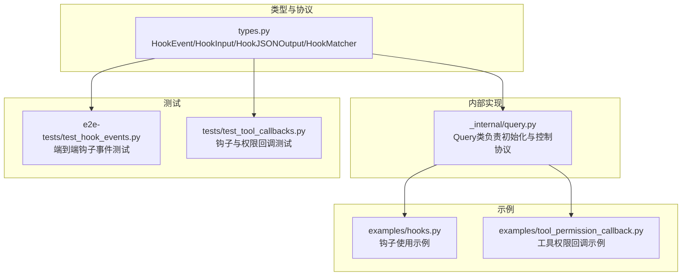
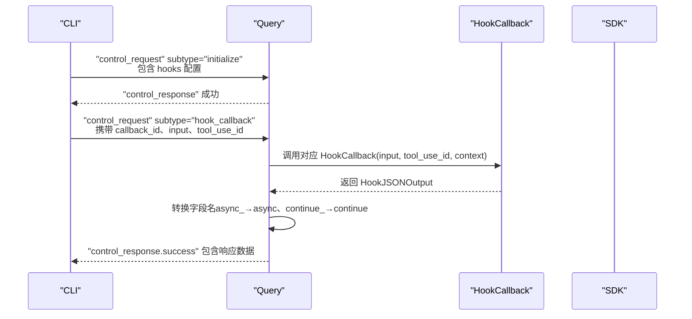
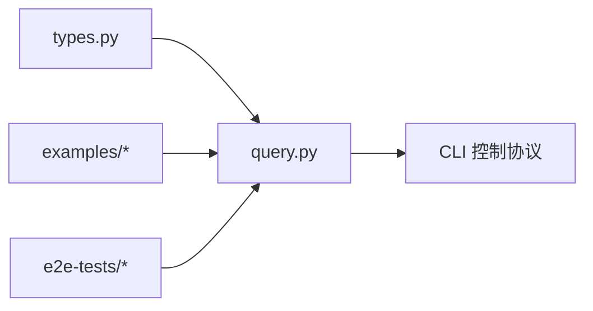

# 钩子系统

<cite>
**本文引用的文件**
- [types.py](file://src/claude_agent_sdk/types.py)
- [query.py](file://src/claude_agent_sdk/_internal/query.py)
- [hooks.py](file://examples/hooks.py)
- [tool_permission_callback.py](file://examples/tool_permission_callback.py)
- [test_hook_events.py](file://e2e-tests/test_hook_events.py)
- [test_tool_callbacks.py](file://tests/test_tool_callbacks.py)
</cite>

## 目录
1. [简介](#简介)
2. [项目结构](#项目结构)
3. [核心组件](#核心组件)
4. [架构总览](#架构总览)
5. [详细组件分析](#详细组件分析)
6. [依赖分析](#依赖分析)
7. [性能考量](#性能考量)
8. [故障排查指南](#故障排查指南)
9. [结论](#结论)
10. [附录](#附录)

## 简介
本文件系统性地解析 Claude Agent SDK 的钩子系统，覆盖以下关键主题：
- 所有 HookEvent 事件类型及其触发时机与用途
- HookInput 的强类型结构（BaseHookInput 及各事件类型的特定输入）
- HookJSONOutput 的同步与异步输出结构（控制字段与决策字段）
- HookCallback 的签名与实现模式
- HookMatcher 的配置（matcher 表达式、超时设置、回调函数列表）
- 子代理上下文（agent_id、agent_type）在钩子中的作用
- 实际使用示例：工具使用拦截、权限请求处理、会话控制
- 异步执行机制与超时处理
- 最佳实践与性能建议

## 项目结构
钩子系统主要由以下模块组成：
- 类型定义与协议：types.py
- 控制协议与钩子调度：_internal/query.py
- 示例与用法演示：examples/hooks.py、examples/tool_permission_callback.py
- 端到端与单元测试：e2e-tests/test_hook_events.py、tests/test_tool_callbacks.py

图表来源
- [types.py:160-472](file://src/claude_agent_sdk/types.py#L160-L472)
- [query.py:119-163](file://src/claude_agent_sdk/_internal/query.py#L119-L163)

章节来源
- [types.py:160-472](file://src/claude_agent_sdk/types.py#L160-L472)
- [query.py:119-163](file://src/claude_agent_sdk/_internal/query.py#L119-L163)

## 核心组件
- HookEvent：枚举所有可用的钩子事件类型，涵盖工具生命周期、用户提示提交、停止控制、子代理启动/停止、压缩前通知、权限请求等。
- HookInput：强类型输入结构，按事件类型细分，包含基础字段（如 session_id、transcript_path、cwd）以及事件特有字段（如工具名、输入、错误信息、agent_id/agent_type 等）。
- HookJSONOutput：钩子回调返回值，支持同步与异步两种形式：
  - 同步：包含控制字段（continue_、suppressOutput、stopReason）与决策字段（decision、systemMessage、reason），以及事件特有输出（hookSpecificOutput）。
  - 异步：通过 async_ 和 asyncTimeout 延迟执行。
- HookCallback：钩子回调函数签名，接收 HookInput、可选的 tool_use_id、HookContext，并返回 HookJSONOutput。
- HookMatcher：钩子匹配器配置，包含 matcher 表达式、回调函数列表、可选的超时（秒）。

章节来源
- [types.py:160-472](file://src/claude_agent_sdk/types.py#L160-L472)

## 架构总览
钩子系统通过控制协议在 SDK 与 CLI 之间传递事件。初始化阶段，Query 将用户配置的 hooks 转换为 CLI 可识别的结构；运行时，CLI 发送 hook_callback 控制请求，Query 调用已注册的 HookCallback 并将结果转换为 CLI 字段名后返回。

图表来源
- [query.py:119-163](file://src/claude_agent_sdk/_internal/query.py#L119-L163)
- [query.py:288-303](file://src/claude_agent_sdk/_internal/query.py#L288-L303)

章节来源
- [query.py:119-163](file://src/claude_agent_sdk/_internal/query.py#L119-L163)
- [query.py:288-303](file://src/claude_agent_sdk/_internal/query.py#L288-L303)

## 详细组件分析

### 事件类型与触发时机
- PreToolUse：在工具调用前触发，用于权限决策与输入修改。典型用途：拦截危险命令、注入额外上下文。
- PostToolUse：在工具调用成功后触发，用于输出审查、补充上下文或更新 MCP 工具输出。
- PostToolUseFailure：在工具调用失败后触发，用于错误处理与告警。
- UserPromptSubmit：用户提交提示时触发，适合添加会话上下文或个性化提示。
- Stop：会话级停止控制，允许在特定条件下阻止继续。
- SubagentStop：子代理停止时触发，携带 agent_id、agent_type 等上下文。
- PreCompact：压缩前触发，支持手动或自动触发场景。
- Notification：通知事件，用于记录或处理系统通知。
- SubagentStart：子代理启动时触发，携带 agent_id、agent_type。
- PermissionRequest：权限请求事件，用于细粒度权限控制与策略执行。

章节来源
- [types.py:161-172](file://src/claude_agent_sdk/types.py#L161-L172)

### HookInput 结构详解
- BaseHookInput：通用字段包括 session_id、transcript_path、cwd、permission_mode。
- 工具生命周期相关（PreToolUse、PostToolUse、PostToolUseFailure、PermissionRequest）：
  - 新增 _SubagentContextMixin：agent_id、agent_type（仅在子代理内存在），用于区分并关联并行子代理的工具调用。
  - PreToolUse：tool_name、tool_input、tool_use_id。
  - PostToolUse：tool_name、tool_input、tool_response、tool_use_id。
  - PostToolUseFailure：tool_name、tool_input、tool_use_id、error、is_interrupt（可选）。
  - PermissionRequest：tool_name、tool_input、permission_suggestions（可选）。
- 用户交互相关：
  - UserPromptSubmit：prompt。
  - Stop：stop_hook_active。
  - SubagentStop：stop_hook_active、agent_id、agent_transcript_path、agent_type。
  - PreCompact：trigger（manual/auto）、custom_instructions。
  - Notification：message、title（可选）、notification_type。
  - SubagentStart：agent_id、agent_type。

章节来源
- [types.py:176-310](file://src/claude_agent_sdk/types.py#L176-L310)
- [types.py:191-207](file://src/claude_agent_sdk/types.py#L191-L207)

### HookJSONOutput 输出结构
- 同步输出（SyncHookJSONOutput）：
  - 控制字段：continue_（默认 True）、suppressOutput（默认 False）、stopReason（当 continue_=False 时显示）。
  - 决策字段：decision（目前对非 PreToolUse 事件通常为 "block"）、systemMessage（向用户显示的警告消息）、reason（反馈给 Claude 的原因说明）。
  - 事件特有输出：hookSpecificOutput（例如 PreToolUse 的 permissionDecision、PostToolUse 的 updatedMCPToolOutput 等）。
- 异步输出（AsyncHookJSONOutput）：
  - async_ 必须为 True，asyncTimeout（毫秒）为可选超时时间，表示延迟执行的时间上限。
- 字段名转换：
  - Python 使用 async_、continue_ 避免关键字冲突，Query 在发送给 CLI 前自动转换为 async、continue。

章节来源
- [types.py:408-452](file://src/claude_agent_sdk/types.py#L408-L452)
- [query.py:34-50](file://src/claude_agent_sdk/_internal/query.py#L34-L50)

### HookCallback 签名与实现模式
- 签名：HookCallback(input: HookInput, tool_use_id: str | None, context: HookContext) -> Awaitable[HookJSONOutput]。
- 实现要点：
  - 使用强类型 HookInput 解构事件数据，避免运行时错误。
  - 对于工具生命周期事件，优先检查 tool_use_id 以支持并行子代理的精确关联。
  - 返回值中合理设置 continue_、decision、systemMessage、reason 与 hookSpecificOutput。
  - 异步钩子应设置 async_=True 与合适的 asyncTimeout。

章节来源
- [types.py:465-472](file://src/claude_agent_sdk/types.py#L465-L472)

### HookMatcher 配置
- matcher：字符串表达式，用于筛选事件（如工具名或组合工具名，如 "Write|MultiEdit|Edit"）。
- hooks：HookCallback 列表。
- timeout：单个匹配器的超时（秒），默认 60 秒。
- 初始化流程：Query 将用户提供的 hooks 映射为 CLI 可识别的结构，生成 callback_id 并注册到 hook_callbacks 中，随后发送 initialize 请求。

章节来源
- [types.py:476-491](file://src/claude_agent_sdk/types.py#L476-L491)
- [query.py:128-147](file://src/claude_agent_sdk/_internal/query.py#L128-L147)

### 子代理上下文（agent_id、agent_type）
- 仅在工具生命周期事件（PreToolUse、PostToolUse、PostToolUseFailure、PermissionRequest）中出现。
- 当多个子代理并行运行时，这些事件会交错在同一控制通道上，agent_id/agent_type 是区分它们的唯一可靠依据。
- SubagentStart/SubagentStop 事件强制要求 agent_id、agent_type。

章节来源
- [types.py:191-207](file://src/claude_agent_sdk/types.py#L191-L207)
- [types.py:281-286](file://src/claude_agent_sdk/types.py#L281-L286)

### 实际使用示例
- 工具使用拦截（PreToolUse）：示例演示基于工具名与输入内容进行阻断或放行，并通过 permissionDecision 与 reason/systemMessage 提供反馈。
- 权限请求处理（PermissionRequest）：示例展示如何在权限请求事件中返回决策与附加上下文。
- 会话控制（UserPromptSubmit、Stop、SubagentStop、PreCompact、Notification、SubagentStart）：示例演示如何在不同事件中注入上下文、控制执行流或记录通知。

章节来源
- [hooks.py:46-154](file://examples/hooks.py#L46-L154)
- [hooks.py:156-301](file://examples/hooks.py#L156-L301)
- [hooks.py:303-351](file://examples/hooks.py#L303-L351)
- [tool_permission_callback.py:26-94](file://examples/tool_permission_callback.py#L26-L94)

### 异步执行机制与超时处理
- 异步钩子：通过设置 async_=True 与 asyncTimeout（毫秒）延迟执行，Query 自动转换字段名并发送给 CLI。
- 超时处理：Query 在发送控制请求时使用 fail_after(timeout) 进行超时保护；HookMatcher 的 timeout 控制单个匹配器内的回调执行时限。
- 字段名转换：Python 使用 async_、continue_，Query 在响应前转换为 CLI 期望的 async、continue。

章节来源
- [types.py:393-406](file://src/claude_agent_sdk/types.py#L393-L406)
- [query.py:378-392](file://src/claude_agent_sdk/_internal/query.py#L378-L392)
- [query.py:34-50](file://src/claude_agent_sdk/_internal/query.py#L34-L50)

## 依赖分析
- 类型层：types.py 定义了 HookEvent、HookInput、HookJSONOutput、HookMatcher、HookCallback 等核心类型。
- 协议层：query.py 负责将用户配置转换为 CLI 可识别的 hooks 结构，处理 control_request/control_response，调度 HookCallback 并进行字段名转换。
- 示例与测试：examples 与 e2e-tests 展示了真实场景下的钩子使用与端到端验证。

图表来源
- [types.py:160-472](file://src/claude_agent_sdk/types.py#L160-L472)
- [query.py:119-163](file://src/claude_agent_sdk/_internal/query.py#L119-L163)

章节来源
- [types.py:160-472](file://src/claude_agent_sdk/types.py#L160-L472)
- [query.py:119-163](file://src/claude_agent_sdk/_internal/query.py#L119-L163)

## 性能考量
- 避免在钩子中执行耗时操作：若必须异步处理，使用 async_=True 并设置合理的 asyncTimeout，防止阻塞主流程。
- 合理使用 continue_：仅在必要时设置 continue_=False，减少不必要的中断。
- 选择性匹配：通过 matcher 精确匹配工具名，降低无关事件的处理开销。
- 并发与上下文：在子代理场景下，利用 agent_id/agent_type 精准路由事件，避免误判与重复处理。
- 日志与可观测性：在钩子中记录关键指标（如 tool_use_id、事件名称、耗时），便于问题定位与性能优化。

## 故障排查指南
- 钩子未触发：确认 HookMatcher 的 matcher 是否正确匹配工具名，或是否遗漏了某些事件类型。
- 字段名不生效：确保在 Python 代码中使用 async_、continue_，Query 会自动转换为 CLI 期望的 async、continue。
- 超时异常：检查 HookMatcher 的 timeout 设置与钩子内部逻辑，必要时增加超时或拆分任务。
- 子代理事件错乱：确认 _SubagentContextMixin 字段（agent_id、agent_type）是否正确传递，避免并行子代理事件相互干扰。
- 权限请求未生效：核对 PermissionRequest 事件的返回值结构，确保 decision/permissionDecision 与 reason/systemMessage 正确设置。

章节来源
- [test_tool_callbacks.py:350-398](file://tests/test_tool_callbacks.py#L350-L398)
- [test_hook_events.py:19-62](file://e2e-tests/test_hook_events.py#L19-L62)
- [test_hook_events.py:66-110](file://e2e-tests/test_hook_events.py#L66-L110)
- [test_hook_events.py:114-157](file://e2e-tests/test_hook_events.py#L114-L157)

## 结论
钩子系统提供了强大的扩展点，可在工具调用前后、用户提示提交、会话控制、子代理管理等多个环节进行精细化干预。通过强类型输入输出、异步执行与超时控制，开发者可以构建安全、可控且高性能的自动化工作流。建议在实际项目中结合具体业务需求，合理设计 HookMatcher 的匹配规则与回调逻辑，并充分利用子代理上下文与字段名转换机制，确保钩子行为稳定可预期。

## 附录
- 事件类型一览与用途概览
  - PreToolUse：工具调用前拦截与权限决策
  - PostToolUse：工具调用后输出审查与上下文补充
  - PostToolUseFailure：工具调用失败后的错误处理
  - UserPromptSubmit：用户提交提示时注入上下文
  - Stop：会话级停止控制
  - SubagentStop：子代理停止时的清理与记录
  - PreCompact：压缩前的通知与准备
  - Notification：系统通知的处理与记录
  - SubagentStart：子代理启动时的初始化
  - PermissionRequest：细粒度权限请求与策略执行

章节来源
- [types.py:161-172](file://src/claude_agent_sdk/types.py#L161-L172)