# 客户端系统 API

<cite>
**本文档引用的文件**
- [client.py](file://src/claude_agent_sdk/client.py)
- [query.py](file://src/claude_agent_sdk/query.py)
- [_internal/client.py](file://src/claude_agent_sdk/_internal/client.py)
- [_internal/query.py](file://src/claude_agent_sdk/_internal/query.py)
- [_internal/message_parser.py](file://src/claude_agent_sdk/_internal/message_parser.py)
- [_internal/transport/subprocess_cli.py](file://src/claude_agent_sdk/_internal/transport/subprocess_cli.py)
- [types.py](file://src/claude_agent_sdk/types.py)
- [_errors.py](file://src/claude_agent_sdk/_errors.py)
- [streaming_mode.py](file://examples/streaming_mode.py)
- [quick_start.py](file://examples/quick_start.py)
- [__init__.py](file://src/claude_agent_sdk/__init__.py)
</cite>

## 目录
1. [简介](#简介)
2. [项目结构](#项目结构)
3. [核心组件](#核心组件)
4. [架构概览](#架构概览)
5. [详细组件分析](#详细组件分析)
6. [依赖关系分析](#依赖关系分析)
7. [性能考虑](#性能考虑)
8. [故障排除指南](#故障排除指南)
9. [结论](#结论)

## 简介

Claude Agent SDK 客户端系统 API 提供了与 Claude Code 进行双向、交互式对话的能力。该系统支持流式传输、中断功能和动态消息发送，适用于构建聊天界面、对话式 UI 和需要实时交互的应用程序。

主要特性包括：
- **双向通信**：随时发送和接收消息
- **有状态会话**：跨消息保持对话上下文
- **交互式对话**：基于响应发送后续消息
- **控制流**：支持中断和会话管理
- **工具权限控制**：动态管理工具使用权限
- **MCP 服务器集成**：支持外部和内部 MCP 服务器

## 项目结构

```mermaid
graph TB
subgraph "客户端层"
A[ClaudeSDKClient<br/>主客户端类]
B[query()<br/>一次性查询函数]
end
subgraph "内部实现层"
C[InternalClient<br/>内部客户端实现]
D[Query<br/>控制协议处理]
E[MessageParser<br/>消息解析器]
end
subgraph "传输层"
F[SubprocessCLITransport<br/>子进程传输]
G[Transport<br/>传输接口]
end
subgraph "类型定义"
H[Types<br/>数据类型定义]
I[Errors<br/>错误类型]
end
A --> C
A --> D
A --> F
B --> C
C --> D
C --> F
D --> E
F --> G
A --> H
B --> H
C --> I
D --> I
```

**图表来源**
- [client.py:21-500](file://src/claude_agent_sdk/client.py#L21-L500)
- [_internal/client.py:20-146](file://src/claude_agent_sdk/_internal/client.py#L20-L146)
- [_internal/query.py:53-679](file://src/claude_agent_sdk/_internal/query.py#L53-L679)

**章节来源**
- [client.py:1-500](file://src/claude_agent_sdk/client.py#L1-L500)
- [query.py:1-127](file://src/claude_agent_sdk/query.py#L1-L127)
- [_internal/client.py:1-146](file://src/claude_agent_sdk/_internal/client.py#L1-L146)

## 核心组件

### ClaudeSDKClient 主类

ClaudeSDKClient 是客户端系统的核心类，提供了完整的连接管理和会话控制功能：

#### 初始化参数
- `options`: ClaudeAgentOptions - 配置选项
- `transport`: Transport - 自定义传输实现（可选）

#### 关键属性
- `_transport`: 当前传输实例
- `_query`: Query 控制协议处理器
- `_custom_transport`: 自定义传输配置

#### 主要方法
- `connect()`: 建立与 Claude Code 的连接
- `receive_messages()`: 接收所有消息
- `query()`: 发送新请求（支持流式模式）
- `interrupt()`: 发送中断信号
- `disconnect()`: 断开连接

**章节来源**
- [client.py:62-500](file://src/claude_agent_sdk/client.py#L62-L500)

### Query 控制协议类

Query 类处理双向控制协议，管理控制请求/响应路由、钩子回调和工具权限：

#### 核心功能
- 控制请求/响应路由
- 钩子回调处理
- 工具权限回调
- 消息流管理
- 初始化握手

#### 控制协议方法
- `initialize()`: 初始化控制协议
- `interrupt()`: 发送中断请求
- `set_permission_mode()`: 设置权限模式
- `set_model()`: 更改 AI 模型
- `get_mcp_status()`: 获取 MCP 服务器状态

**章节来源**
- [_internal/query.py:53-679](file://src/claude_agent_sdk/_internal/query.py#L53-L679)

### SubprocessCLITransport 传输层

SubprocessCLITransport 实现了与 Claude Code CLI 的子进程通信：

#### 主要特性
- 子进程管理
- 流式消息读写
- 版本检查
- 错误处理
- 资源清理

#### 传输方法
- `connect()`: 启动子进程
- `write()`: 写入数据
- `read_messages()`: 读取消息
- `close()`: 关闭连接

**章节来源**
- [_internal/transport/subprocess_cli.py:33-630](file://src/claude_agent_sdk/_internal/transport/subprocess_cli.py#L33-L630)

## 架构概览

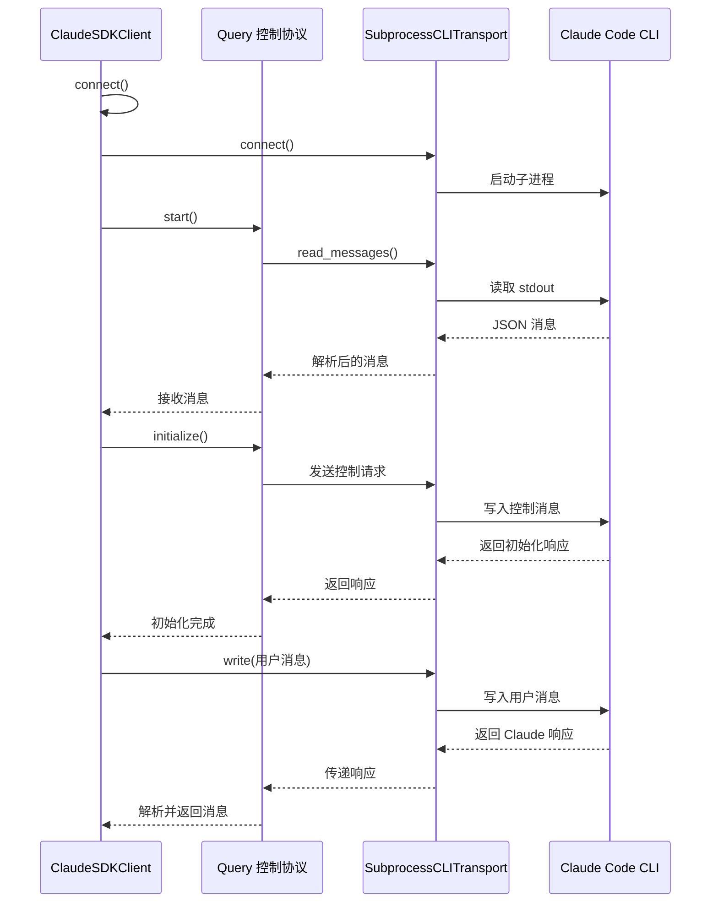

**图表来源**
- [client.py:94-185](file://src/claude_agent_sdk/client.py#L94-L185)
- [_internal/query.py:165-235](file://src/claude_agent_sdk/_internal/query.py#L165-L235)
- [_internal/transport/subprocess_cli.py:335-411](file://src/claude_agent_sdk/_internal/transport/subprocess_cli.py#L335-L411)

## 详细组件分析

### ClaudeSDKClient 类分析

ClaudeSDKClient 提供了完整的客户端功能，包括连接管理、消息处理和会话控制。

#### 初始化流程

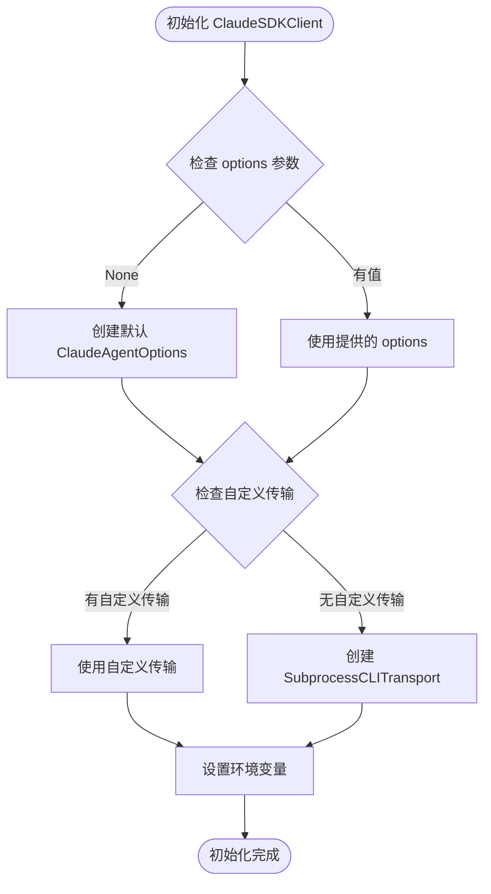

**图表来源**
- [client.py:62-75](file://src/claude_agent_sdk/client.py#L62-L75)

#### 连接管理

连接过程涉及多个步骤，确保客户端能够与 Claude Code 正确通信：

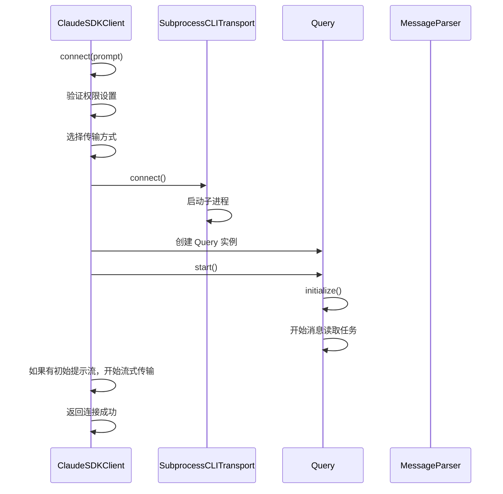

**图表来源**
- [client.py:94-185](file://src/claude_agent_sdk/client.py#L94-L185)
- [_internal/query.py:165-167](file://src/claude_agent_sdk/_internal/query.py#L165-L167)

#### 消息处理流程

消息处理是客户端的核心功能，支持多种消息类型的解析和分发：

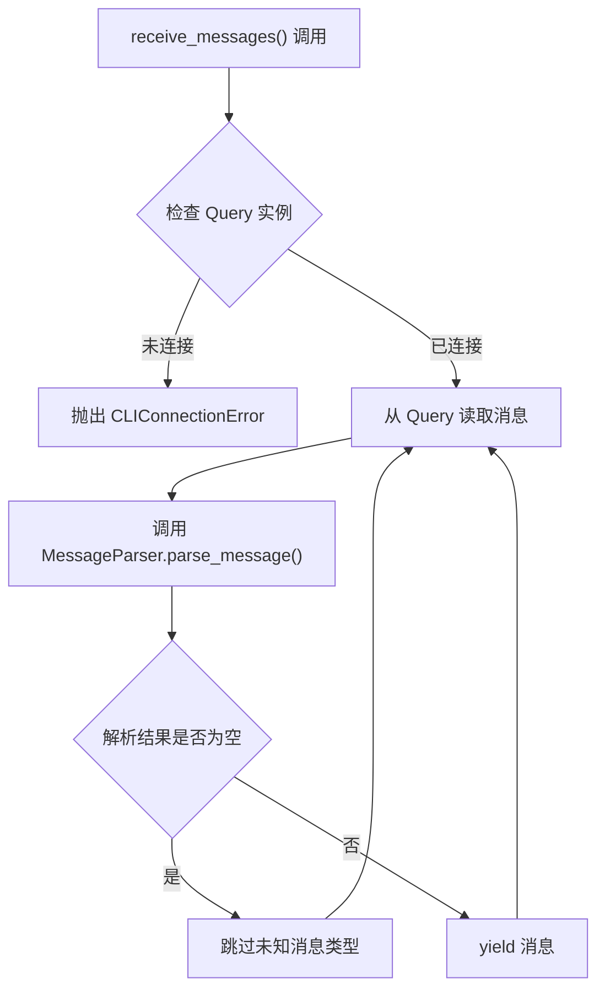

**图表来源**
- [client.py:186-197](file://src/claude_agent_sdk/client.py#L186-L197)
- [_internal/message_parser.py:29-51](file://src/claude_agent_sdk/_internal/message_parser.py#L29-L51)

#### 查询发送机制

查询发送支持两种模式：字符串模式和异步迭代器模式：

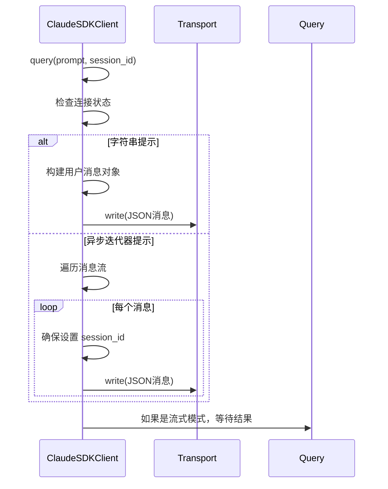

**图表来源**
- [client.py:198-227](file://src/claude_agent_sdk/client.py#L198-L227)

#### 中断功能实现

中断功能允许用户停止正在进行的 Claude 处理：

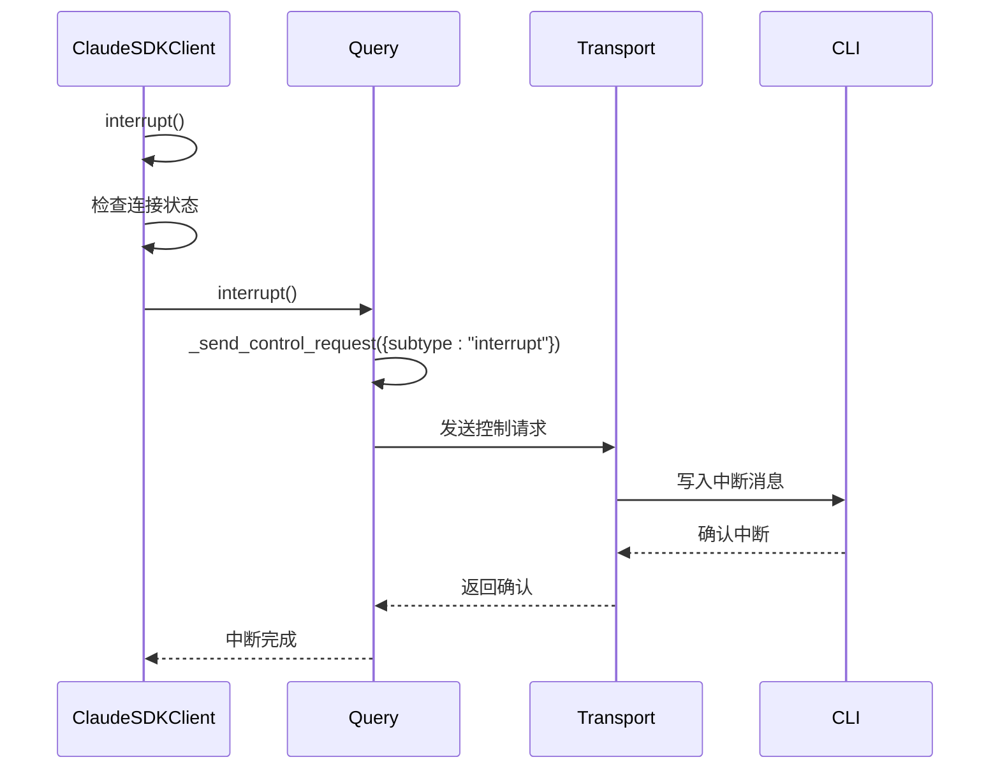

**图表来源**
- [client.py:228-233](file://src/claude_agent_sdk/client.py#L228-L233)
- [_internal/query.py:536-538](file://src/claude_agent_sdk/_internal/query.py#L536-L538)

### Query 类详细分析

Query 类实现了复杂的控制协议处理逻辑，是客户端系统的核心组件。

#### 控制协议状态管理

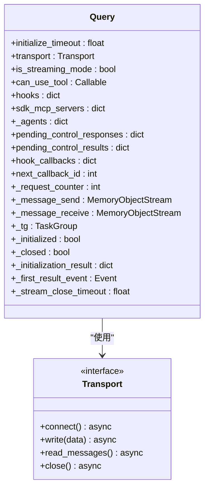

**图表来源**
- [_internal/query.py:64-118](file://src/claude_agent_sdk/_internal/query.py#L64-L118)
- [_internal/transport/subprocess_cli.py:33-630](file://src/claude_agent_sdk/_internal/transport/subprocess_cli.py#L33-L630)

#### 控制请求处理

Query 类处理来自 CLI 的各种控制请求：

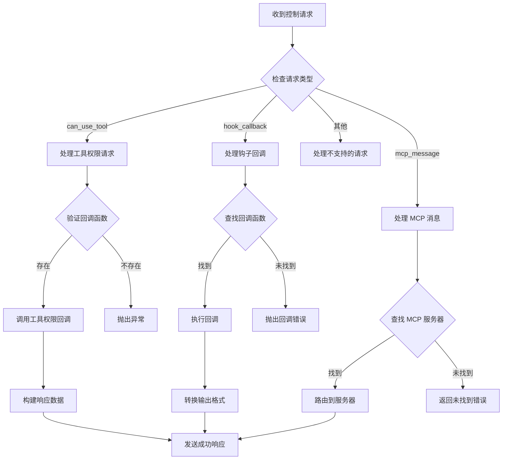

**图表来源**
- [_internal/query.py:236-346](file://src/claude_agent_sdk/_internal/query.py#L236-L346)

### SubprocessCLITransport 详细分析

SubprocessCLITransport 实现了与 Claude Code CLI 的底层通信。

#### 进程生命周期管理

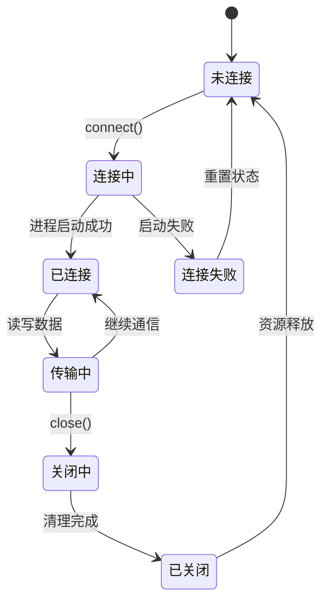

**图表来源**
- [_internal/transport/subprocess_cli.py:335-480](file://src/claude_agent_sdk/_internal/transport/subprocess_cli.py#L335-L480)

#### 消息读取机制

消息读取采用缓冲区机制，处理可能被截断的长行：

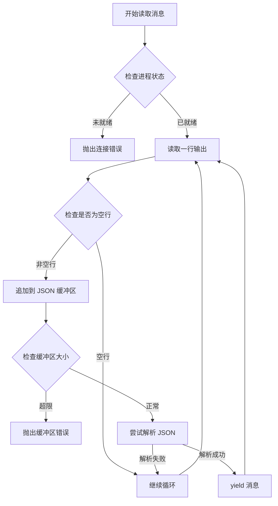

**图表来源**
- [_internal/transport/subprocess_cli.py:519-571](file://src/claude_agent_sdk/_internal/transport/subprocess_cli.py#L519-L571)

## 依赖关系分析

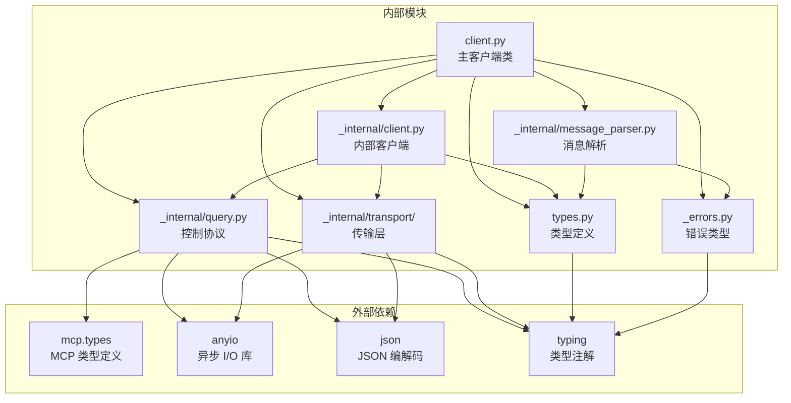

**图表来源**
- [client.py:9-18](file://src/claude_agent_sdk/client.py#L9-L18)
- [_internal/query.py:11-26](file://src/claude_agent_sdk/_internal/query.py#L11-L26)

### 关键依赖关系

1. **类型系统依赖**：所有模块都依赖于 types.py 中的类型定义
2. **异步运行时依赖**：使用 anyio 库进行异步 I/O 操作
3. **MCP 协议依赖**：通过 mcp.types 库支持 MCP 服务器集成
4. **错误处理依赖**：统一的错误类型定义便于错误传播

**章节来源**
- [client.py:1-500](file://src/claude_agent_sdk/client.py#L1-L500)
- [_internal/query.py:1-679](file://src/claude_agent_sdk/_internal/query.py#L1-L679)

## 性能考虑

### 流式传输优化

客户端系统采用了多种优化策略来提高性能：

1. **内存流缓冲**：使用 anyio 的内存对象流进行高效的消息传递
2. **异步 I/O**：完全基于异步 I/O 操作，避免阻塞
3. **连接复用**：单个连接支持双向通信，减少连接开销
4. **消息解析缓存**：解析后的消息类型信息用于快速分支判断

### 资源管理

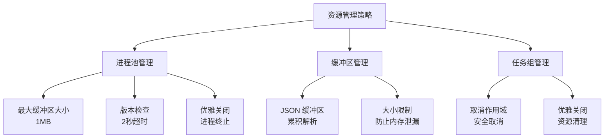

**图表来源**
- [_internal/transport/subprocess_cli.py:29-630](file://src/claude_agent_sdk/_internal/transport/subprocess_cli.py#L29-L630)
- [_internal/query.py:105-118](file://src/claude_agent_sdk/_internal/query.py#L105-L118)

### 并发处理

客户端系统支持高并发操作，但需要注意以下限制：

1. **运行时上下文限制**：不支持在不同异步运行时上下文之间共享客户端实例
2. **任务组隔离**：每个客户端实例维护独立的任务组
3. **传输锁保护**：写操作使用互斥锁防止竞态条件

## 故障排除指南

### 常见错误类型

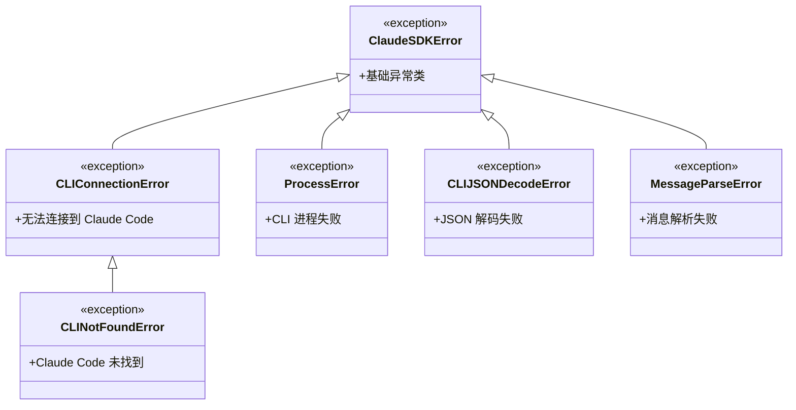

**图表来源**
- [_errors.py:6-57](file://src/claude_agent_sdk/_errors.py#L6-L57)

### 连接问题诊断

当遇到连接问题时，可以按照以下步骤进行诊断：

1. **检查 CLI 可用性**：验证 Claude Code 是否正确安装
2. **检查版本兼容性**：确保 CLI 版本满足最低要求
3. **验证工作目录**：确认指定的工作目录存在且可访问
4. **检查环境变量**：验证必要的环境变量设置

### 消息处理问题

消息处理问题通常由以下原因引起：

1. **JSON 解码错误**：消息格式不符合预期
2. **消息类型未知**：新版本 CLI 引入了新的消息类型
3. **传输中断**：子进程意外退出或被终止

**章节来源**
- [_errors.py:1-57](file://src/claude_agent_sdk/_errors.py#L1-L57)

## 结论

Claude Agent SDK 客户端系统 API 提供了一个功能完整、设计良好的框架，用于与 Claude Code 进行交互式对话。系统的主要优势包括：

1. **完整的功能覆盖**：支持双向通信、中断、权限控制等高级功能
2. **清晰的架构分离**：客户端层、内部实现层和传输层职责明确
3. **强大的扩展性**：支持自定义传输、MCP 服务器和钩子回调
4. **完善的错误处理**：提供详细的错误类型和诊断信息
5. **高性能设计**：基于异步 I/O 和内存流优化

对于开发者而言，建议重点关注以下方面：
- 正确管理客户端生命周期和连接状态
- 合理使用中断功能以提供良好的用户体验
- 在多客户端并发场景下遵循最佳实践
- 充分利用 MCP 服务器和钩子回调扩展功能

通过合理使用这些功能，开发者可以构建出强大而灵活的 AI 应用程序。