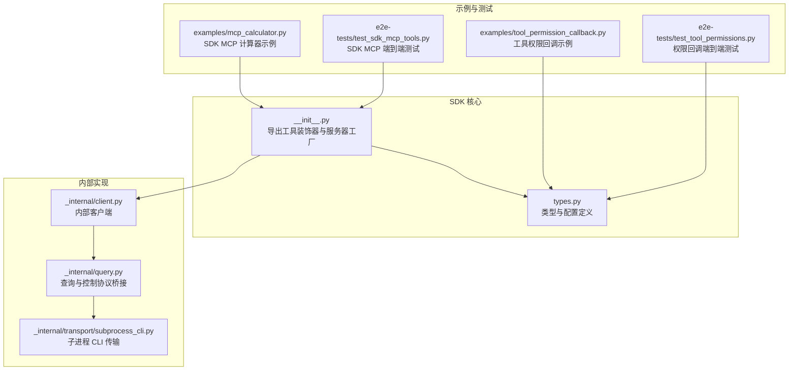
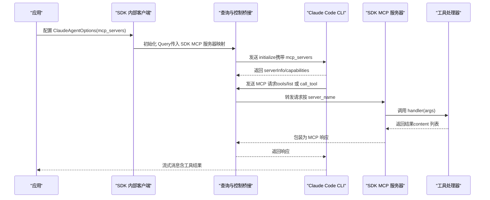
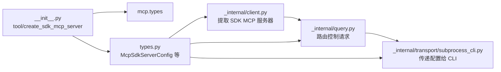

# 工具系统 API

<cite>
**本文引用的文件**
- [src/claude_agent_sdk/__init__.py](file://src/claude_agent_sdk/__init__.py)
- [src/claude_agent_sdk/types.py](file://src/claude_agent_sdk/types.py)
- [src/claude_agent_sdk/_internal/client.py](file://src/claude_agent_sdk/_internal/client.py)
- [src/claude_agent_sdk/_internal/query.py](file://src/claude_agent_sdk/_internal/query.py)
- [src/claude_agent_sdk/_internal/transport/subprocess_cli.py](file://src/claude_agent_sdk/_internal/transport/subprocess_cli.py)
- [examples/mcp_calculator.py](file://examples/mcp_calculator.py)
- [examples/tool_permission_callback.py](file://examples/tool_permission_callback.py)
- [e2e-tests/test_sdk_mcp_tools.py](file://e2e-tests/test_sdk_mcp_tools.py)
- [e2e-tests/test_tool_permissions.py](file://e2e-tests/test_tool_permissions.py)
</cite>

## 目录
1. [简介](#简介)
2. [项目结构](#项目结构)
3. [核心组件](#核心组件)
4. [架构总览](#架构总览)
5. [详细组件分析](#详细组件分析)
6. [依赖分析](#依赖分析)
7. [性能考量](#性能考量)
8. [故障排查指南](#故障排查指南)
9. [结论](#结论)
10. [附录](#附录)

## 简介
本文件面向 Claude Agent SDK 的工具系统 API，重点覆盖：
- @tool 装饰器的使用与 SdkMcpTool 配置项
- 工具函数的定义规范、输入参数校验与返回值格式
- create_sdk_mcp_server() 的用法与服务器配置
- 完整开发示例（简单工具、复杂参数工具、含错误处理）
- 权限管理与安全注意事项
- 外部 MCP 服务器集成与最佳实践

## 项目结构
工具系统 API 的核心位于 SDK 根模块与类型定义中，并通过内部传输层与查询层与 CLI 进行交互。示例与端到端测试展示了典型用法与行为。

图表来源
- [src/claude_agent_sdk/__init__.py:1-445](file://src/claude_agent_sdk/__init__.py#L1-L445)
- [src/claude_agent_sdk/types.py:1-800](file://src/claude_agent_sdk/types.py#L1-L800)
- [src/claude_agent_sdk/_internal/client.py:1-146](file://src/claude_agent_sdk/_internal/client.py#L1-L146)
- [src/claude_agent_sdk/_internal/query.py:309-538](file://src/claude_agent_sdk/_internal/query.py#L309-L538)
- [src/claude_agent_sdk/_internal/transport/subprocess_cli.py:1-630](file://src/claude_agent_sdk/_internal/transport/subprocess_cli.py#L1-L630)
- [examples/mcp_calculator.py:1-194](file://examples/mcp_calculator.py#L1-L194)
- [examples/tool_permission_callback.py:1-159](file://examples/tool_permission_callback.py#L1-L159)
- [e2e-tests/test_sdk_mcp_tools.py:1-169](file://e2e-tests/test_sdk_mcp_tools.py#L1-L169)
- [e2e-tests/test_tool_permissions.py:1-66](file://e2e-tests/test_tool_permissions.py#L1-L66)

章节来源
- [src/claude_agent_sdk/__init__.py:1-445](file://src/claude_agent_sdk/__init__.py#L1-L445)
- [src/claude_agent_sdk/types.py:1-800](file://src/claude_agent_sdk/types.py#L1-L800)

## 核心组件
- @tool 装饰器：用于声明 MCP 工具，返回 SdkMcpTool 实例，支持名称、描述、输入模式与注解。
- SdkMcpTool：工具定义的数据结构，包含 name、description、input_schema、handler、annotations。
- create_sdk_mcp_server：在应用内创建一个与 CLI 同进程的 MCP 服务器，注册 list_tools 与 call_tool 处理器。
- 类型系统：McpSdkServerConfig、McpServerConfig、McpToolAnnotations、McpToolInfo、McpServerStatus 等。
- 权限与钩子：CanUseTool 回调、PermissionResultAllow/Deny、Hook 输入输出类型等。

章节来源
- [src/claude_agent_sdk/__init__.py:100-340](file://src/claude_agent_sdk/__init__.py#L100-L340)
- [src/claude_agent_sdk/types.py:493-640](file://src/claude_agent_sdk/types.py#L493-L640)
- [src/claude_agent_sdk/types.py:124-157](file://src/claude_agent_sdk/types.py#L124-L157)

## 架构总览
SDK MCP 工具在应用内运行，通过内部查询层与 CLI 控制通道桥接，实现工具发现与调用。外部 MCP 服务器（HTTP/SSE/stdio）由 CLI 直接管理，SDK 仅负责传递配置。

图表来源
- [src/claude_agent_sdk/_internal/client.py:84-113](file://src/claude_agent_sdk/_internal/client.py#L84-L113)
- [src/claude_agent_sdk/_internal/query.py:394-538](file://src/claude_agent_sdk/_internal/query.py#L394-L538)
- [src/claude_agent_sdk/_internal/transport/subprocess_cli.py:240-265](file://src/claude_agent_sdk/_internal/transport/subprocess_cli.py#L240-L265)

## 详细组件分析

### @tool 装饰器与 SdkMcpTool
- 作用：将异步工具函数包装为 SdkMcpTool，供 create_sdk_mcp_server 注册。
- 关键字段：
  - name：工具唯一标识，用于被模型调用时的名称
  - description：工具用途描述
  - input_schema：输入参数定义，可为字典映射、TypedDict 或 JSON Schema 字典
  - handler：异步函数，接收单个参数字典，返回包含 content 的字典
  - annotations：工具注解（如只读、破坏性、开放世界）
- 使用要点：
  - handler 必须是异步函数
  - handler 接收的参数字典即为输入 schema 的实例
  - 返回值必须包含 content 键；content 为文本或图片内容列表
  - 可通过 is_error 标记错误状态

章节来源
- [src/claude_agent_sdk/__init__.py:111-176](file://src/claude_agent_sdk/__init__.py#L111-L176)
- [src/claude_agent_sdk/__init__.py:100-109](file://src/claude_agent_sdk/__init__.py#L100-L109)

### create_sdk_mcp_server 服务器工厂
- 功能：创建一个与应用同进程的 MCP 服务器实例，自动注册 list_tools 与 call_tool 处理器。
- 参数：
  - name：服务器名称（用于 mcp_servers 映射键）
  - version：版本字符串（仅元信息）
  - tools：SdkMcpTool 列表（可为空）
- 行为：
  - 若提供 tools，则构建工具映射并注册处理器
  - list_tools：将 input_schema 转换为 JSON Schema（若为 dict 映射则生成属性与必填字段）
  - call_tool：根据 name 查找工具，调用 handler(args)，将返回的 content 转换为 MCP 文本/图片内容
  - 返回 McpSdkServerConfig（type="sdk"，包含 name 与 instance）

章节来源
- [src/claude_agent_sdk/__init__.py:178-340](file://src/claude_agent_sdk/__init__.py#L178-L340)

### 工具函数定义规范与输入校验
- 输入参数：
  - 支持简单字典映射（键为参数名，值为类型）
  - 支持 TypedDict 或其他类型（会生成基础对象 schema）
  - 支持直接提供 JSON Schema 字典（需包含 type 与 properties）
- 校验策略：
  - 当 input_schema 为 dict 映射时，会将每个参数类型映射为 JSON Schema 的属性，并将所有参数标记为必填
  - 其他类型（如 TypedDict）会生成空属性对象，具体约束取决于上层使用
- 返回值格式：
  - 必须返回包含 content 的字典
  - content 为列表，元素类型支持文本或图片
  - 可选 is_error 标记错误状态

章节来源
- [src/claude_agent_sdk/__init__.py:261-306](file://src/claude_agent_sdk/__init__.py#L261-L306)
- [src/claude_agent_sdk/__init__.py:310-337](file://src/claude_agent_sdk/__init__.py#L310-L337)

### 工具权限管理与安全
- 工具权限回调：
  - can_use_tool：在非只读工具调用前触发，允许修改输入或拒绝执行
  - ToolPermissionContext：包含 suggestions 等上下文信息
  - PermissionResultAllow/Deny：允许或拒绝，可附带更新后的输入或拒绝原因
- 端到端行为：
  - 对于某些只读工具，CLI 可能自动放行；对于写操作或危险命令，通常需要回调确认
- 示例参考：
  - 工具权限回调示例展示了如何基于工具名与输入进行决策，并重定向路径或阻止危险命令

章节来源
- [src/claude_agent_sdk/types.py:124-157](file://src/claude_agent_sdk/types.py#L124-L157)
- [examples/tool_permission_callback.py:26-94](file://examples/tool_permission_callback.py#L26-L94)
- [e2e-tests/test_tool_permissions.py:19-61](file://e2e-tests/test_tool_permissions.py#L19-L61)

### 外部 MCP 服务器集成与最佳实践
- 支持类型：
  - stdio：命令行与参数、环境变量
  - sse：URL 与可选头部
  - http：URL 与可选头部
  - sdk：内建（已在应用内进程）
- 配置方式：
  - 通过 ClaudeAgentOptions.mcp_servers 提供映射
  - SDK 会过滤掉 type="sdk" 的服务器实例字段，仅传递可序列化配置给 CLI
- 最佳实践：
  - 将 SDK MCP 作为高性能内建工具源；外部服务器用于需要独立进程或第三方能力
  - 对外部服务器配置进行最小化授权，避免暴露敏感资源
  - 使用 get_mcp_status 检查连接状态与工具清单

章节来源
- [src/claude_agent_sdk/types.py:493-529](file://src/claude_agent_sdk/types.py#L493-L529)
- [src/claude_agent_sdk/_internal/transport/subprocess_cli.py:240-265](file://src/claude_agent_sdk/_internal/transport/subprocess_cli.py#L240-L265)
- [src/claude_agent_sdk/_internal/query.py:532-538](file://src/claude_agent_sdk/_internal/query.py#L532-L538)

### 完整开发示例

#### 简单工具示例
- 使用 @tool 定义一个接受字符串参数的工具
- 在 create_sdk_mcp_server 中注册该工具
- 通过 allowed_tools 指定允许使用的工具名称（命名规则为 mcp__<server_name>__<tool_name>）

章节来源
- [examples/mcp_calculator.py:24-30](file://examples/mcp_calculator.py#L24-L30)
- [examples/mcp_calculator.py:143-154](file://examples/mcp_calculator.py#L143-L154)

#### 复杂参数工具示例
- 使用浮点数参数与多参数组合
- 在 handler 中进行计算并返回文本内容

章节来源
- [examples/mcp_calculator.py:33-49](file://examples/mcp_calculator.py#L33-L49)
- [examples/mcp_calculator.py:89-97](file://examples/mcp_calculator.py#L89-L97)

#### 带错误处理的工具示例
- 在除法与平方根等场景下进行边界检查
- 返回包含 is_error 标记的错误内容

章节来源
- [examples/mcp_calculator.py:54-65](file://examples/mcp_calculator.py#L54-L65)
- [examples/mcp_calculator.py:72-86](file://examples/mcp_calculator.py#L72-L86)

#### 端到端测试要点
- SDK MCP 工具执行：通过 allowed_tools 触发工具调用，断言实际函数被执行
- 权限控制：disallowed_tools 阻止特定工具执行
- 未显式授权：不设置 allowed_tools 时，SDK MCP 工具不会执行

章节来源
- [e2e-tests/test_sdk_mcp_tools.py:21-50](file://e2e-tests/test_sdk_mcp_tools.py#L21-L50)
- [e2e-tests/test_sdk_mcp_tools.py:54-95](file://e2e-tests/test_sdk_mcp_tools.py#L54-L95)
- [e2e-tests/test_sdk_mcp_tools.py:99-137](file://e2e-tests/test_sdk_mcp_tools.py#L99-L137)
- [e2e-tests/test_sdk_mcp_tools.py:141-169](file://e2e-tests/test_sdk_mcp_tools.py#L141-L169)

## 依赖分析
- 组件耦合：
  - __init__.py 提供装饰器与服务器工厂，依赖 mcp.types（Server、Tool、ImageContent、TextContent）
  - _internal/client.py 从 options 中提取 SDK MCP 服务器映射，注入到 Query
  - _internal/query.py 负责将 CLI 控制请求路由到对应 SDK MCP 服务器实例
  - _internal/transport/subprocess_cli.py 将 mcp_servers 序列化后传递给 CLI
- 外部依赖：
  - mcp.server.Server：用于创建 MCP 服务器实例
  - mcp.types：用于工具定义与内容类型

图表来源
- [src/claude_agent_sdk/__init__.py:250-251](file://src/claude_agent_sdk/__init__.py#L250-L251)
- [src/claude_agent_sdk/_internal/client.py:84-113](file://src/claude_agent_sdk/_internal/client.py#L84-L113)
- [src/claude_agent_sdk/_internal/query.py:394-538](file://src/claude_agent_sdk/_internal/query.py#L394-L538)
- [src/claude_agent_sdk/_internal/transport/subprocess_cli.py:240-265](file://src/claude_agent_sdk/_internal/transport/subprocess_cli.py#L240-L265)

章节来源
- [src/claude_agent_sdk/__init__.py:250-251](file://src/claude_agent_sdk/__init__.py#L250-L251)
- [src/claude_agent_sdk/_internal/client.py:84-113](file://src/claude_agent_sdk/_internal/client.py#L84-L113)
- [src/claude_agent_sdk/_internal/query.py:394-538](file://src/claude_agent_sdk/_internal/query.py#L394-L538)
- [src/claude_agent_sdk/_internal/transport/subprocess_cli.py:240-265](file://src/claude_agent_sdk/_internal/transport/subprocess_cli.py#L240-L265)

## 性能考量
- SDK MCP 服务器优势：
  - 同进程运行，无 IPC 开销
  - 更易调试与部署
  - 直接访问应用状态
- 外部 MCP 服务器：
  - 需要进程间通信，可能引入延迟
  - 适合隔离第三方能力或独立扩展

## 故障排查指南
- 工具未执行：
  - 检查是否正确设置 allowed_tools（命名规则为 mcp__<server_name>__<tool_name>）
  - 确认未设置 disallowed_tools 导致阻断
- 权限问题：
  - 对于写操作或危险命令，确保 can_use_tool 回调允许或修正输入
- 服务器未找到：
  - 确认 mcp_servers 映射键与 server_name 一致
  - 检查 SDK MCP 服务器是否已注册处理器
- 端到端验证：
  - 使用 e2e 测试中的断言思路验证工具执行与权限控制

章节来源
- [e2e-tests/test_sdk_mcp_tools.py:21-50](file://e2e-tests/test_sdk_mcp_tools.py#L21-L50)
- [e2e-tests/test_sdk_mcp_tools.py:54-95](file://e2e-tests/test_sdk_mcp_tools.py#L54-L95)
- [e2e-tests/test_tool_permissions.py:19-61](file://e2e-tests/test_tool_permissions.py#L19-L61)

## 结论
Claude Agent SDK 的工具系统 API 提供了简洁而强大的内建 MCP 工具能力，结合装饰器与服务器工厂，开发者可以快速定义、注册与调用工具。配合权限回调与类型系统，既能保证安全性又能获得良好的开发体验。对外部 MCP 服务器的支持使系统具备灵活的扩展性，建议优先使用 SDK MCP 以获得更优性能与可控性。

## 附录

### API 一览与关键路径
- @tool 装饰器与 SdkMcpTool
  - [装饰器定义与说明:111-176](file://src/claude_agent_sdk/__init__.py#L111-L176)
  - [工具数据结构:100-109](file://src/claude_agent_sdk/__init__.py#L100-L109)
- create_sdk_mcp_server
  - [服务器工厂与处理器注册:178-340](file://src/claude_agent_sdk/__init__.py#L178-L340)
- 类型与配置
  - [McpSdkServerConfig/McpServerConfig:493-529](file://src/claude_agent_sdk/types.py#L493-L529)
  - [McpToolAnnotations/McpToolInfo:572-589](file://src/claude_agent_sdk/types.py#L572-L589)
  - [McpServerStatus/McpStatusResponse:604-640](file://src/claude_agent_sdk/types.py#L604-L640)
- 权限与钩子
  - [CanUseTool/PermissionResult:124-157](file://src/claude_agent_sdk/types.py#L124-L157)
  - [Hook 输入/输出类型:160-383](file://src/claude_agent_sdk/types.py#L160-L383)
- 与 CLI 的集成
  - [内部客户端提取 SDK 服务器:84-113](file://src/claude_agent_sdk/_internal/client.py#L84-L113)
  - [查询层路由 SDK MCP 请求:394-538](file://src/claude_agent_sdk/_internal/query.py#L394-538)
  - [CLI 传输层传递 mcp_servers:240-265](file://src/claude_agent_sdk/_internal/transport/subprocess_cli.py#L240-265)