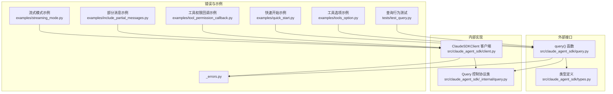
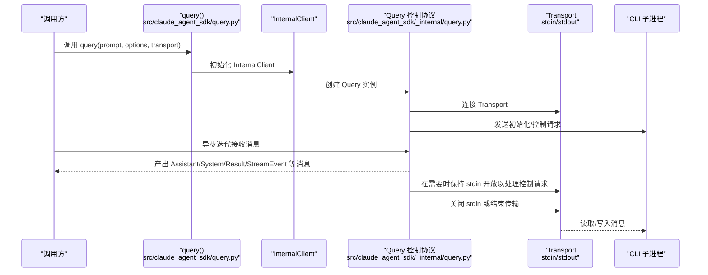
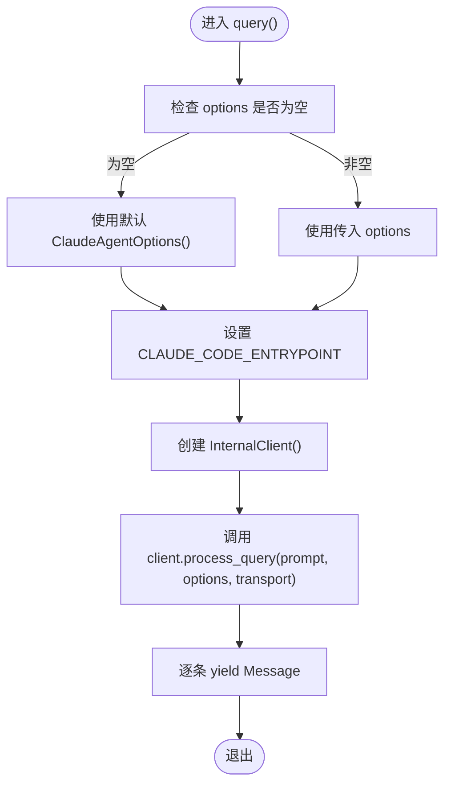
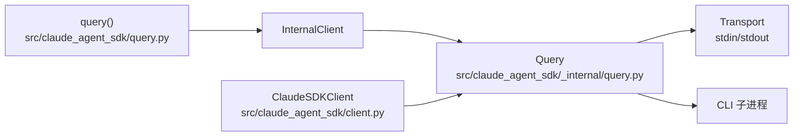

# 查询系统 API

<cite>
**本文引用的文件**
- [query.py](file://src/claude_agent_sdk/query.py)
- [types.py](file://src/claude_agent_sdk/types.py)
- [client.py](file://src/claude_agent_sdk/client.py)
- [_internal/query.py](file://src/claude_agent_sdk/_internal/query.py)
- [_errors.py](file://src/claude_agent_sdk/_errors.py)
- [quick_start.py](file://examples/quick_start.py)
- [tools_option.py](file://examples/tools_option.py)
- [streaming_mode.py](file://examples/streaming_mode.py)
- [include_partial_messages.py](file://examples/include_partial_messages.py)
- [tool_permission_callback.py](file://examples/tool_permission_callback.py)
- [test_query.py](file://tests/test_query.py)
</cite>

## 目录
1. [简介](#简介)
2. [项目结构](#项目结构)
3. [核心组件](#核心组件)
4. [架构总览](#架构总览)
5. [详细组件分析](#详细组件分析)
6. [依赖分析](#依赖分析)
7. [性能考虑](#性能考虑)
8. [故障排查指南](#故障排查指南)
9. [结论](#结论)
10. [附录](#附录)

## 简介
本文件面向 Claude Agent SDK 的查询系统 API，重点围绕以下目标展开：
- 全面介绍 query() 函数的功能、参数与使用方式
- 详解 ClaudeAgentOptions 配置项（含 tools、stream、max_tokens、temperature 等）
- 解释流式模式的工作原理与 partial_response_callback 的使用
- 提供多场景示例：简单查询、带工具的查询、流式响应等
- 说明错误处理机制与异常类型
- 给出性能优化建议与最佳实践

## 项目结构
查询系统 API 主要由以下模块组成：
- 外部 API：query() 函数位于顶层模块，负责一次性或单向流式交互
- 类型定义：types.py 中定义了 ClaudeAgentOptions、Message、权限与钩子等类型
- 内部实现：_internal/query.py 提供控制协议、工具权限回调、消息流等核心逻辑
- 客户端对比：client.py 展示了双向交互的 ClaudeSDKClient，便于区分与选择
- 错误类型：_errors.py 定义了连接、进程、JSON 解码、消息解析等错误
- 示例与测试：examples 与 tests 提供丰富的使用场景与行为验证

图表来源
- [query.py:12-127](file://src/claude_agent_sdk/query.py#L12-L127)
- [types.py:1030-1199](file://src/claude_agent_sdk/types.py#L1030-L1199)
- [_internal/query.py:53-679](file://src/claude_agent_sdk/_internal/query.py#L53-L679)
- [client.py:21-500](file://src/claude_agent_sdk/client.py#L21-L500)
- [_errors.py:6-57](file://src/claude_agent_sdk/_errors.py#L6-L57)

章节来源
- [query.py:12-127](file://src/claude_agent_sdk/query.py#L12-L127)
- [types.py:1030-1199](file://src/claude_agent_sdk/types.py#L1030-L1199)
- [_internal/query.py:53-679](file://src/claude_agent_sdk/_internal/query.py#L53-L679)
- [client.py:21-500](file://src/claude_agent_sdk/client.py#L21-L500)
- [_errors.py:6-57](file://src/claude_agent_sdk/_errors.py#L6-L57)

## 核心组件
- query()：面向一次性或单向流式交互的查询入口，返回异步迭代器，逐条产出消息
- ClaudeAgentOptions：查询配置对象，支持工具、系统提示、MCP 服务器、权限模式、环境变量、调试输出、钩子、部分消息等
- Query 控制协议：在流式模式下处理控制请求（如工具权限、钩子回调、MCP 消息）、初始化握手、中断、模型切换等
- ClaudeSDKClient：面向双向交互的客户端，适合需要实时会话、中断、动态消息发送的场景

章节来源
- [query.py:12-127](file://src/claude_agent_sdk/query.py#L12-L127)
- [types.py:1030-1199](file://src/claude_agent_sdk/types.py#L1030-L1199)
- [_internal/query.py:53-679](file://src/claude_agent_sdk/_internal/query.py#L53-L679)
- [client.py:21-500](file://src/claude_agent_sdk/client.py#L21-L500)

## 架构总览
query() 通过 InternalClient 调用内部 Query 控制协议，实现对 CLI 子进程的读写与控制。当启用 SDK MCP 服务器或钩子时，Query 会在首次结果到达前保持输入通道开放，确保双向控制协议通信完成。

图表来源
- [query.py:12-127](file://src/claude_agent_sdk/query.py#L12-L127)
- [_internal/query.py:165-235](file://src/claude_agent_sdk/_internal/query.py#L165-L235)
- [_internal/query.py:614-647](file://src/claude_agent_sdk/_internal/query.py#L614-L647)

## 详细组件分析

### query() 函数
- 功能定位
  - 单次或单向流式交互：适合一次性查询、批处理、自动化脚本等
  - 不维护会话状态、不可中断、不支持后续消息
- 输入参数
  - prompt：字符串或异步可迭代字典序列；后者用于“单向流式”持续输入
  - options：ClaudeAgentOptions，可选，默认构造
  - transport：自定义传输层，可选
- 返回值
  - 异步迭代器，逐条产出消息（Assistant/System/Result/StreamEvent 等）

图表来源
- [query.py:12-127](file://src/claude_agent_sdk/query.py#L12-L127)

章节来源
- [query.py:12-127](file://src/claude_agent_sdk/query.py#L12-L127)

### ClaudeAgentOptions 配置项详解
以下为常用配置项的语义与用途（并非穷举）：
- tools：指定可用工具数组、预设或禁用
- allowed_tools/disallowed_tools：白名单/黑名单工具
- system_prompt：系统提示词或预设
- mcp_servers：MCP 服务器配置（stdio/sse/http/sdk/proxy）
- permission_mode：权限模式（default/acceptEdits/bypassPermissions）
- cwd/cli_path/settings：工作目录、CLI 路径、设置来源
- env/extra_args：环境变量与额外 CLI 参数
- hooks：钩子匹配器与回调
- can_use_tool：工具权限回调
- include_partial_messages：是否包含部分消息事件
- thinking/effect/output_format：思维深度、思考预算、输出格式
- enable_file_checkpointing：是否启用文件检查点回溯
- max_turns/max_budget_usd/model/fallback_model/betas：回合数、预算、模型、beta 特性等

注意
- temperature、max_tokens 等常见参数在 ClaudeAgentOptions 中未直接暴露，可通过 extra_args 传递 CLI 支持的参数键值
- 该 SDK 的 Message 类型与流式事件类型在 types.py 中有完整定义

章节来源
- [types.py:1030-1199](file://src/claude_agent_sdk/types.py#L1030-L1199)

### 流式模式与部分消息
- 流式模式
  - query() 支持将 prompt 作为异步可迭代对象，实现“先发完所有消息，再收完所有响应”的单向流式交互
  - 当存在 SDK MCP 服务器或钩子时，Query 会在首个结果出现后再关闭 stdin，保证控制协议双向通信
- 部分消息（StreamEvent）
  - 通过 include_partial_messages=True 启用，可在完整响应前收到增量更新
  - 流中混杂普通消息与 StreamEvent，可用于实时 UI、进度监控等

章节来源
- [query.py:45-97](file://src/claude_agent_sdk/query.py#L45-L97)
- [types.py:888-896](file://src/claude_agent_sdk/types.py#L888-L896)
- [test_query.py:114-308](file://tests/test_query.py#L114-L308)
- [include_partial_messages.py:28-57](file://examples/include_partial_messages.py#L28-L57)

### 工具权限回调与钩子
- 工具权限回调 can_use_tool
  - 在流式模式下，当 CLI 请求工具使用许可时触发
  - 回调返回允许/拒绝，并可修改输入或更新权限规则
- 钩子（hooks）
  - 可按事件类型（如 PreToolUse/PostToolUse 等）注册匹配器与回调
  - 支持异步钩子与同步钩子输出格式转换

章节来源
- [_internal/query.py:236-346](file://src/claude_agent_sdk/_internal/query.py#L236-L346)
- [types.py:155-157](file://src/claude_agent_sdk/types.py#L155-L157)
- [types.py:160-310](file://src/claude_agent_sdk/types.py#L160-L310)
- [tool_permission_callback.py:26-94](file://examples/tool_permission_callback.py#L26-L94)

### 与 ClaudeSDKClient 的差异
- query()：单向、无状态、无中断、无后续消息
- ClaudeSDKClient：双向、有状态、可中断、可动态发送消息、可管理 MCP 服务器与钩子

章节来源
- [query.py:25-43](file://src/claude_agent_sdk/query.py#L25-L43)
- [client.py:21-60](file://src/claude_agent_sdk/client.py#L21-L60)

## 依赖分析
- query() 依赖 InternalClient 与 Transport，最终与 CLI 子进程通过 stdin/stdout 通信
- Query 类承担控制协议路由、工具权限处理、钩子回调、MCP 桥接、初始化握手等职责
- ClaudeSDKClient 基于 Query 实现更丰富的控制能力（中断、模型切换、任务停止、MCP 切换/重连等）

图表来源
- [query.py:12-127](file://src/claude_agent_sdk/query.py#L12-L127)
- [_internal/query.py:53-118](file://src/claude_agent_sdk/_internal/query.py#L53-L118)
- [client.py:94-180](file://src/claude_agent_sdk/client.py#L94-L180)

章节来源
- [query.py:12-127](file://src/claude_agent_sdk/query.py#L12-L127)
- [_internal/query.py:53-118](file://src/claude_agent_sdk/_internal/query.py#L53-L118)
- [client.py:94-180](file://src/claude_agent_sdk/client.py#L94-L180)

## 性能考虑
- 使用 include_partial_messages 时，消息流中包含增量事件，可能增加消息数量与解析开销，建议仅在需要实时 UI 场景开启
- 对于长轮询或大量 MCP 服务器/钩子，Query 会在首个结果到达前保持 stdin 打开，避免阻塞控制请求，但会占用资源时间更长
- 合理设置 extra_args 中的 CLI 参数（如超时、缓存大小等），可减少不必要的等待与重试
- 在批量查询场景，优先使用字符串 prompt 的 query()，避免不必要的异步迭代开销

[本节为通用指导，无需特定文件来源]

## 故障排查指南
- 连接失败/CLI 未找到
  - 检查 CLI 路径与安装状态，确认 CLAUDE_CODE_ENTRYPOINT 设置正确
- JSON 解码错误
  - CLI 输出不符合预期格式，检查 stderr 回调与日志
- 消息解析错误
  - 自定义传输或钩子输出格式不兼容，核对字段命名（async_/continue_ 转换）
- 控制请求超时
  - MCP 服务器或钩子处理耗时过长，适当增大超时或优化回调逻辑
- 权限问题
  - permission_mode 与 can_use_tool 配置不当，导致工具被拒绝或无法自动授权

章节来源
- [_errors.py:6-57](file://src/claude_agent_sdk/_errors.py#L6-L57)
- [_internal/query.py:347-393](file://src/claude_agent_sdk/_internal/query.py#L347-L393)

## 结论
- query() 适用于一次性、无状态、无需中断的查询场景；若需要实时会话、工具权限精细控制、MCP 管理与中断能力，请使用 ClaudeSDKClient
- ClaudeAgentOptions 提供了丰富的配置维度，包括工具集、系统提示、MCP 服务器、权限模式、钩子、部分消息、思维与输出格式等
- 流式模式与部分消息可满足实时 UI 与进度监控需求，但需权衡消息量与解析成本
- 建议结合示例与测试用例进行集成验证，确保在目标运行环境下稳定工作

[本节为总结，无需特定文件来源]

## 附录

### 使用示例路径
- 简单查询与工具使用
  - [quick_start.py:15-73](file://examples/quick_start.py#L15-L73)
  - [tools_option.py:16-108](file://examples/tools_option.py#L16-L108)
- 流式模式与部分消息
  - [streaming_mode.py:59-131](file://examples/streaming_mode.py#L59-L131)
  - [include_partial_messages.py:28-57](file://examples/include_partial_messages.py#L28-L57)
- 工具权限回调
  - [tool_permission_callback.py:96-159](file://examples/tool_permission_callback.py#L96-L159)
- 行为验证（测试）
  - [test_query.py:114-308](file://tests/test_query.py#L114-L308)

### API 与类型参考
- query() 函数签名与行为
  - [query.py:12-127](file://src/claude_agent_sdk/query.py#L12-L127)
- ClaudeAgentOptions 字段与默认值
  - [types.py:1030-1199](file://src/claude_agent_sdk/types.py#L1030-L1199)
- Message 类型与流事件
  - [types.py:766-952](file://src/claude_agent_sdk/types.py#L766-L952)
- 控制协议请求/响应
  - [types.py:1101-1199](file://src/claude_agent_sdk/types.py#L1101-L1199)
- Query 控制协议实现
  - [_internal/query.py:53-679](file://src/claude_agent_sdk/_internal/query.py#L53-L679)