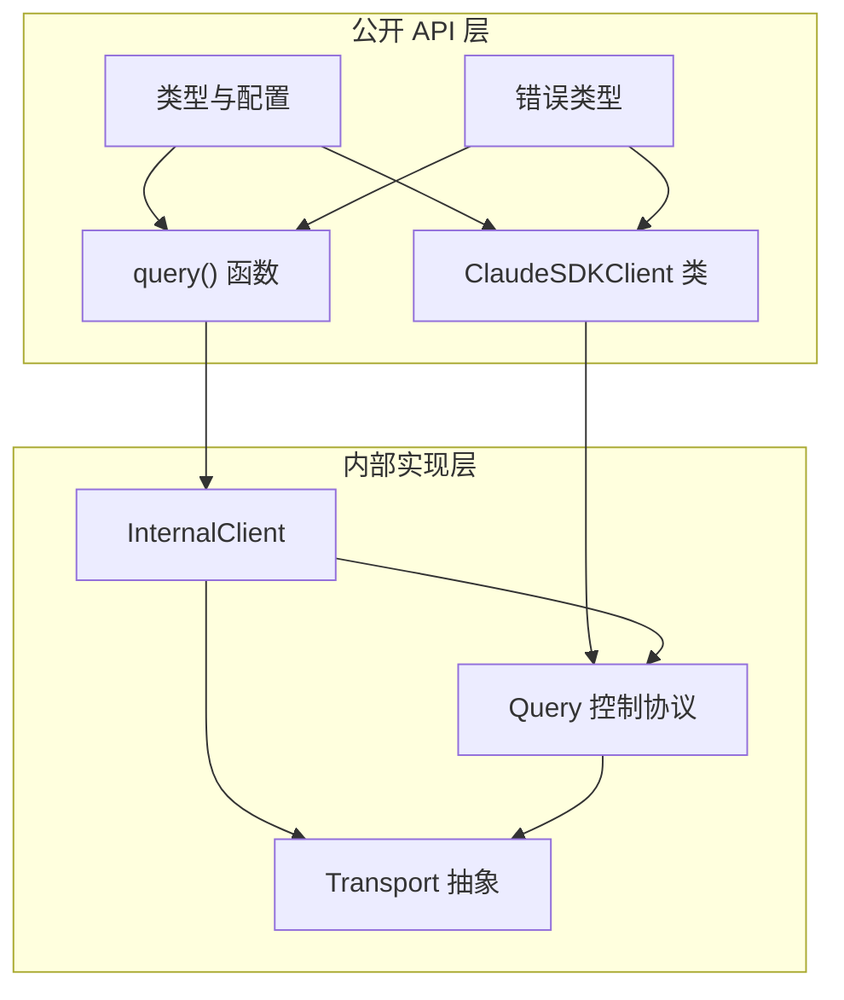
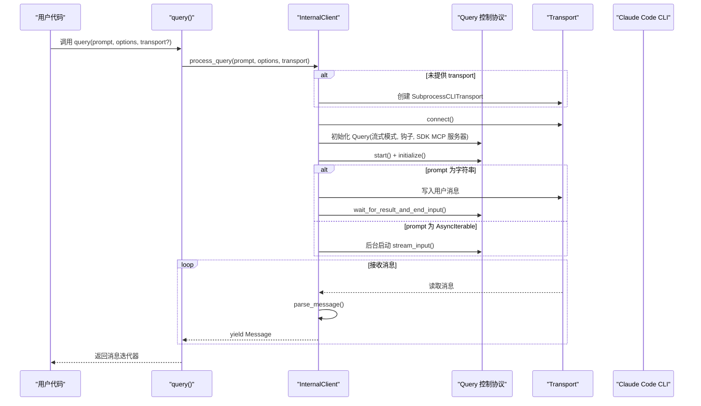
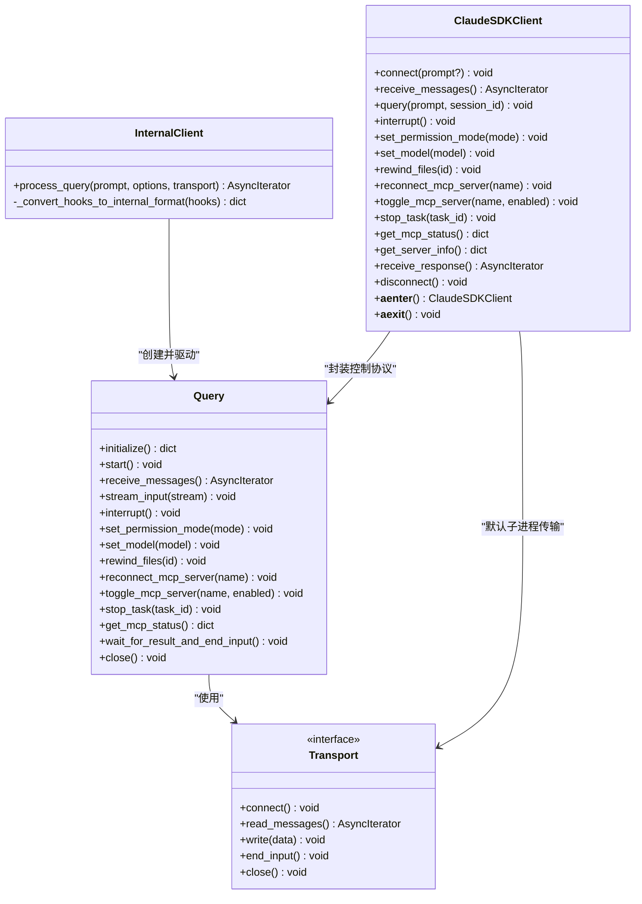
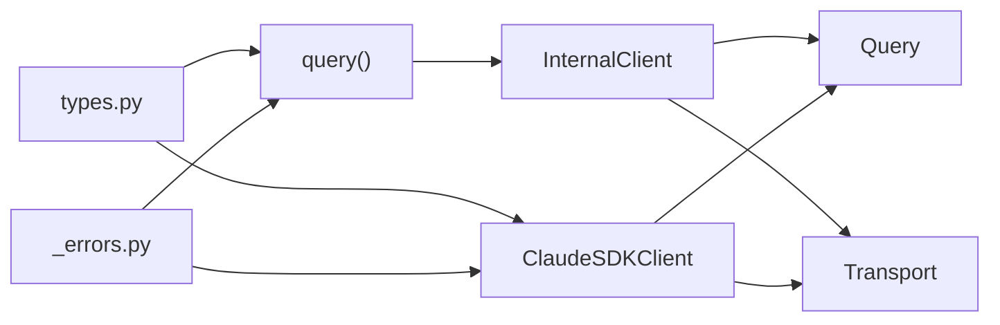

# 核心 API 参考

<cite>
**本文引用的文件**
- [src/claude_agent_sdk/__init__.py](file://src/claude_agent_sdk/__init__.py)
- [src/claude_agent_sdk/query.py](file://src/claude_agent_sdk/query.py)
- [src/claude_agent_sdk/client.py](file://src/claude_agent_sdk/client.py)
- [src/claude_agent_sdk/types.py](file://src/claude_agent_sdk/types.py)
- [_errors.py](file://src/claude_agent_sdk/_errors.py)
- [_internal/client.py](file://src/claude_agent_sdk/_internal/client.py)
- [_internal/query.py](file://src/claude_agent_sdk/_internal/query.py)
- [examples/quick_start.py](file://examples/quick_start.py)
- [examples/streaming_mode.py](file://examples/streaming_mode.py)
- [tests/test_query.py](file://tests/test_query.py)
- [tests/test_client.py](file://tests/test_client.py)
- [README.md](file://README.md)
</cite>

## 目录
1. [简介](#简介)
2. [项目结构](#项目结构)
3. [核心组件](#核心组件)
4. [架构总览](#架构总览)
5. [详细组件分析](#详细组件分析)
6. [依赖分析](#依赖分析)
7. [性能考量](#性能考量)
8. [故障排查指南](#故障排查指南)
9. [结论](#结论)
10. [附录](#附录)

## 简介
本参考文档聚焦于 Claude Agent SDK 的核心 API，系统性地介绍以下内容：
- query() 函数：一次性或单向流式交互入口，适合简单查询与自动化脚本。
- ClaudeSDKClient 类：双向、可中断、可动态控制的交互客户端，适合构建聊天应用、调试会话与多轮对话。
- 公共类型与配置：ClaudeAgentOptions、消息类型、工具与权限模型、钩子（hooks）与 MCP 服务器支持等。
- 错误类型与异常处理：连接失败、进程错误、JSON 解析失败等。
- 使用示例与最佳实践：从基础到高级场景，涵盖工具调用、权限控制、钩子拦截、MCP 自定义工具、流式中断与并发处理等。

## 项目结构
该 SDK 采用“公开 API + 内部实现 + 类型与错误”的分层设计：
- 公开 API 层：对外暴露 query()、ClaudeSDKClient、类型与工具装饰器等。
- 内部实现层：内部客户端与查询类负责与 CLI 子进程通信、控制协议、消息解析与流式处理。
- 类型与错误层：统一的消息类型、权限与钩子类型、MCP 配置类型，以及错误类型定义。

图表来源
- [src/claude_agent_sdk/query.py:12-127](file://src/claude_agent_sdk/query.py#L12-L127)
- [src/claude_agent_sdk/client.py:21-500](file://src/claude_agent_sdk/client.py#L21-L500)
- [src/claude_agent_sdk/_internal/client.py:20-146](file://src/claude_agent_sdk/_internal/client.py#L20-L146)
- [src/claude_agent_sdk/_internal/query.py:53-679](file://src/claude_agent_sdk/_internal/query.py#L53-L679)

章节来源
- [src/claude_agent_sdk/__init__.py:1-445](file://src/claude_agent_sdk/__init__.py#L1-L445)
- [README.md:1-360](file://README.md#L1-L360)

## 核心组件
- query()：面向一次性或单向流式交互的异步生成器，返回消息迭代器。适合批处理、CI/CD、自动化脚本等场景。
- ClaudeSDKClient：面向交互式、可中断、可动态控制的客户端，支持多轮对话、权限模式切换、模型切换、任务停止、MCP 状态查询与重连、文件回溯等。
- ClaudeAgentOptions：统一的配置对象，涵盖工具白名单/黑名单、系统提示、MCP 服务器、权限模式、工作目录、环境变量、钩子、思维配置、输出格式、插件、沙箱设置等。
- 消息类型与内容块：UserMessage、AssistantMessage、SystemMessage、ResultMessage、StreamEvent、RateLimitEvent 等；内容块包括 TextBlock、ThinkingBlock、ToolUseBlock、ToolResultBlock。
- 错误类型：ClaudeSDKError、CLIConnectionError、CLINotFoundError、ProcessError、CLIJSONDecodeError、MessageParseError。

章节来源
- [src/claude_agent_sdk/query.py:12-127](file://src/claude_agent_sdk/query.py#L12-L127)
- [src/claude_agent_sdk/client.py:21-500](file://src/claude_agent_sdk/client.py#L21-L500)
- [src/claude_agent_sdk/types.py:1030-1199](file://src/claude_agent_sdk/types.py#L1030-L1199)
- [_errors.py:6-57](file://src/claude_agent_sdk/_errors.py#L6-L57)

## 架构总览
下图展示了 query() 与 ClaudeSDKClient 的内部协作关系，以及与 Transport 和控制协议（Query）的交互。

图表来源
- [src/claude_agent_sdk/query.py:12-127](file://src/claude_agent_sdk/query.py#L12-L127)
- [src/claude_agent_sdk/_internal/client.py:44-146](file://src/claude_agent_sdk/_internal/client.py#L44-L146)
- [src/claude_agent_sdk/_internal/query.py:165-235](file://src/claude_agent_sdk/_internal/query.py#L165-L235)

章节来源
- [src/claude_agent_sdk/_internal/client.py:20-146](file://src/claude_agent_sdk/_internal/client.py#L20-L146)
- [src/claude_agent_sdk/_internal/query.py:53-235](file://src/claude_agent_sdk/_internal/query.py#L53-L235)

## 详细组件分析

### query() 函数
- 角色定位：一次性或单向流式交互入口，适合简单查询、批处理与自动化脚本。
- 输入参数
  - prompt: 字符串或 AsyncIterable[dict]。字符串用于单次请求；异步可迭代用于持续交互（仍为单向）。
  - options: 可选配置，默认使用 ClaudeAgentOptions()。可设置系统提示、工具白名单/黑名单、权限模式、工作目录、MCP 服务器、钩子、思维配置、输出格式、插件、沙箱等。
  - transport: 可选自定义传输实现；若不提供则自动选择子进程传输。
- 返回值：异步迭代器，逐条产出消息（如 AssistantMessage、SystemMessage、ResultMessage、StreamEvent、RateLimitEvent 等）。
- 异常处理：抛出 ClaudeSDKError 及其子类（CLIConnectionError、CLINotFoundError、ProcessError、CLIJSONDecodeError、MessageParseError）。
- 使用示例路径
  - 基础查询：[examples/quick_start.py:15-25](file://examples/quick_start.py#L15-L25)
  - 带选项查询：[examples/quick_start.py:27-44](file://examples/quick_start.py#L27-L44)
  - 工具调用示例：[examples/quick_start.py:46-66](file://examples/quick_start.py#L46-L66)
  - 单向流式示例（仍为单向）：[src/claude_agent_sdk/query.py:88-97](file://src/claude_agent_sdk/query.py#L88-L97)
- 最佳实践
  - 对于需要后续追问或多轮对话的场景，请改用 ClaudeSDKClient。
  - 若使用 can_use_tool 回调，必须以 AsyncIterable 提供 prompt（否则会触发参数校验错误）。
  - 当存在 SDK MCP 服务器或钩子时，query() 会在首个结果到达前保持 stdin 打开，确保控制协议往返正常完成。
- 性能考虑
  - 单向流式避免了双向控制协议的额外开销，适合批量处理。
  - 通过 options.max_buffer_size 可调节 CLI stdout 缓冲大小，避免内存峰值过高。

章节来源
- [src/claude_agent_sdk/query.py:12-127](file://src/claude_agent_sdk/query.py#L12-L127)
- [tests/test_query.py:114-197](file://tests/test_query.py#L114-L197)
- [tests/test_query.py:310-372](file://tests/test_query.py#L310-L372)

### ClaudeSDKClient 类
- 角色定位：交互式、可中断、可动态控制的客户端，适合聊天应用、调试会话、多轮对话与实时控制。
- 关键方法
  - connect(prompt?): 连接并初始化，支持空流或初始 prompt 流；自动配置 can_use_tool 与 permission_prompt_tool_name；提取 SDK MCP 服务器；计算初始化超时；发送 agents 定义。
  - receive_messages(): 接收所有消息并解析为强类型消息对象。
  - query(prompt, session_id): 发送新请求（支持字符串或异步可迭代），在流式模式下按需写入。
  - interrupt(): 发送中断信号（仅流式模式有效）。
  - set_permission_mode(mode): 切换权限模式（default、acceptEdits、bypassPermissions 等）。
  - set_model(model): 切换模型。
  - rewind_files(user_message_id): 将跟踪的文件回溯到指定用户消息的状态（需启用文件检查点）。
  - reconnect_mcp_server(server_name) / toggle_mcp_server(server_name, enabled): 重连或启停 MCP 服务器。
  - stop_task(task_id): 停止运行中的任务。
  - get_mcp_status(): 获取 MCP 服务器连接状态。
  - get_server_info(): 获取服务器初始化信息（可用命令、输出样式等）。
  - receive_response(): 便捷方法，接收直到 ResultMessage 的完整响应序列。
  - disconnect(): 断开连接。
  - 上下文管理：__aenter__/__aexit__ 支持 async with。
- 异常处理：当未连接时调用上述方法会抛出 CLIConnectionError。
- 使用示例路径
  - 基础流式示例：[examples/streaming_mode.py:59-72](file://examples/streaming_mode.py#L59-L72)
  - 多轮对话：[examples/streaming_mode.py:74-94](file://examples/streaming_mode.py#L74-L94)
  - 并发收发：[examples/streaming_mode.py:97-131](file://examples/streaming_mode.py#L97-L131)
  - 中断能力演示：[examples/streaming_mode.py:133-174](file://examples/streaming_mode.py#L133-L174)
  - 手动消息处理：[examples/streaming_mode.py:176-211](file://examples/streaming_mode.py#L176-L211)
  - 自定义选项：[examples/streaming_mode.py:213-246](file://examples/streaming_mode.py#L213-L246)
  - 异步可迭代 prompt：[examples/streaming_mode.py:248-294](file://examples/streaming_mode.py#L248-L294)
  - Bash 命令与工具块：[examples/streaming_mode.py:296-340](file://examples/streaming_mode.py#L296-L340)
  - 控制协议与中断：[examples/streaming_mode.py:342-419](file://examples/streaming_mode.py#L342-L419)
  - 错误处理：[examples/streaming_mode.py:421-465](file://examples/streaming_mode.py#L421-L465)
- 最佳实践
  - 在流式模式下消费消息才能启用中断处理；后台任务持续消费消息是关键。
  - 使用 receive_response() 可简化“收到 ResultMessage 即结束”的场景。
  - 权限模式与 can_use_tool 回调互斥，且 can_use_tool 需要流式输入。
  - MCP 服务器状态变化可通过 get_mcp_status() 实时监控，必要时调用 reconnect_mcp_server() 或 toggle_mcp_server()。
- 性能考虑
  - 流式模式下，Query 维护一个任务组用于读取消息；注意避免跨不同异步运行时上下文复用客户端实例。
  - 通过 CLAUDE_CODE_STREAM_CLOSE_TIMEOUT 环境变量控制等待首个结果的关闭超时，影响 stdin 关闭时机。

章节来源
- [src/claude_agent_sdk/client.py:21-500](file://src/claude_agent_sdk/client.py#L21-L500)
- [examples/streaming_mode.py:1-512](file://examples/streaming_mode.py#L1-L512)

### ClaudeAgentOptions 配置详解
- 工具与权限
  - tools/allowed_tools/disallowed_tools：工具集合、允许列表与禁止列表；allowed_tools 为预批准，其余走 permission_mode 或 can_use_tool。
  - permission_mode：default、acceptEdits、plan、bypassPermissions。
  - can_use_tool：异步回调，用于动态决策是否允许工具调用。
  - permission_prompt_tool_name：与 can_use_tool 互斥，用于控制协议的权限提示工具名。
- 系统与会话
  - system_prompt：系统提示或预设；支持 preset。
  - continue_conversation/resume/max_turns：续传、恢复与最大轮数。
  - fork_session：恢复时是否分叉为新会话。
- 模型与思维
  - model/fallback_model：主模型与回退模型。
  - thinking：思维配置（adaptive/enabled/disabled），优先于已弃用的 max_thinking_tokens。
  - effort：思维深度（low/medium/high/max）。
  - output_format：结构化输出格式（匹配 Messages API 结构）。
- MCP 与钩子
  - mcp_servers：SDK MCP 服务器（in-process）、外部 stdio/sse/http/claudeai-proxy 服务器。
  - hooks：事件驱动的钩子匹配器（PreToolUse、PostToolUse、PostToolUseFailure、UserPromptSubmit、Stop、SubagentStop、PreCompact、Notification、SubagentStart、PermissionRequest）。
- 文件与沙箱
  - enable_file_checkpointing：启用文件检查点以便回溯。
  - sandbox：沙箱网络与忽略违规项配置。
- 其他
  - cwd/cli_path/settings/add_dirs/env/extra_args：工作目录、CLI 路径、设置文件、附加目录、环境变量、任意 CLI 参数。
  - debug_stderr/stderr：调试输出回调。
  - agents/setting_sources/plugins/betas：自定义代理、设置来源、插件与 Beta 功能。
  - include_partial_messages：是否包含部分消息更新。
- 使用示例路径
  - 工具与系统提示：[examples/quick_start.py:27-66](file://examples/quick_start.py#L27-L66)
  - MCP 服务器与工具：[examples/streaming_mode.py:100-134](file://examples/streaming_mode.py#L100-L134)
  - 钩子示例：[README.md:187-238](file://README.md#L187-L238)

章节来源
- [src/claude_agent_sdk/types.py:1030-1199](file://src/claude_agent_sdk/types.py#L1030-L1199)

### 消息类型与内容块
- 消息类型
  - UserMessage：用户消息，可含文本或内容块，支持工具结果与父工具 use id。
  - AssistantMessage：助手消息，包含内容块与模型信息，可能携带错误码。
  - SystemMessage：系统消息（派生自通用类型）。
  - ResultMessage：结果消息，包含耗时、成本、turn 数、会话 id、停止原因、用量与结构化输出等。
  - StreamEvent：部分消息更新事件。
  - RateLimitEvent：速率限制状态变更事件。
- 内容块
  - TextBlock：纯文本。
  - ThinkingBlock：思考内容与签名。
  - ToolUseBlock：工具调用块（id、名称、输入）。
  - ToolResultBlock：工具结果块（关联工具 use id、内容与错误标记）。
- 使用示例路径
  - 消息类型处理：[examples/streaming_mode.py:176-211](file://examples/streaming_mode.py#L176-L211)
  - 工具使用与结果：[examples/streaming_mode.py:296-340](file://examples/streaming_mode.py#L296-L340)

章节来源
- [src/claude_agent_sdk/types.py:766-953](file://src/claude_agent_sdk/types.py#L766-L953)

### 错误类型与异常处理
- ClaudeSDKError：基础异常。
- CLIConnectionError：无法连接到 Claude Code。
- CLINotFoundError：未找到或未安装 Claude Code。
- ProcessError：CLI 进程失败，附带退出码与错误输出。
- CLIJSONDecodeError：无法解析 CLI 输出的 JSON。
- MessageParseError：无法解析消息。
- 使用示例路径
  - 错误处理示例：[examples/streaming_mode.py:421-465](file://examples/streaming_mode.py#L421-L465)
  - 错误类型说明：[README.md:247-269](file://README.md#L247-L269)

章节来源
- [_errors.py:6-57](file://src/claude_agent_sdk/_errors.py#L6-L57)
- [README.md:247-269](file://README.md#L247-L269)

### 类与关系图（代码级）

图表来源
- [src/claude_agent_sdk/_internal/query.py:53-679](file://src/claude_agent_sdk/_internal/query.py#L53-L679)
- [src/claude_agent_sdk/_internal/client.py:20-146](file://src/claude_agent_sdk/_internal/client.py#L20-L146)
- [src/claude_agent_sdk/client.py:21-500](file://src/claude_agent_sdk/client.py#L21-L500)

## 依赖分析
- query() 依赖 InternalClient 与 Transport；InternalClient 再依赖 Query 与 Transport。
- ClaudeSDKClient 直接依赖 Query 与 Transport，并在 connect() 中创建 Query。
- 类型与错误定义集中于 types.py 与 _errors.py，被 query() 与 ClaudeSDKClient 使用。
- 示例与测试验证了 API 的行为边界（如 stdin 关闭时机、can_use_tool 与 permission_prompt_tool_name 的互斥、MCP 控制请求的处理等）。

图表来源
- [src/claude_agent_sdk/query.py:12-127](file://src/claude_agent_sdk/query.py#L12-L127)
- [src/claude_agent_sdk/_internal/client.py:20-146](file://src/claude_agent_sdk/_internal/client.py#L20-L146)
- [src/claude_agent_sdk/_internal/query.py:53-235](file://src/claude_agent_sdk/_internal/query.py#L53-L235)
- [src/claude_agent_sdk/client.py:21-500](file://src/claude_agent_sdk/client.py#L21-L500)

章节来源
- [src/claude_agent_sdk/__init__.py:1-445](file://src/claude_agent_sdk/__init__.py#L1-L445)
- [tests/test_query.py:114-197](file://tests/test_query.py#L114-L197)
- [tests/test_client.py:11-130](file://tests/test_client.py#L11-L130)

## 性能考量
- 流式模式 vs 单向模式
  - 流式模式（ClaudeSDKClient）具备双向控制协议能力，但有额外的读取任务与控制请求处理开销。
  - 单向模式（query()）适合批处理与自动化，避免控制协议往返，吞吐更高。
- stdin 关闭策略
  - 当存在 SDK MCP 服务器或钩子时，query() 与 ClaudeSDKClient 会在首个结果到达前保持 stdin 打开，确保控制协议往返成功；可通过 CLAUDE_CODE_STREAM_CLOSE_TIMEOUT 调整等待时间。
- 缓冲与内存
  - 通过 options.max_buffer_size 控制 CLI stdout 缓冲大小，避免大消息导致内存峰值过高。
- 并发与中断
  - 在流式模式下，必须持续消费消息以启用中断；后台任务消费消息是关键，避免阻塞控制协议响应。
- MCP 服务器
  - SDK MCP 服务器（in-process）相比外部服务器具有更低的 IPC 开销，适合频繁调用的工具。

[本节为通用指导，无需特定文件引用]

## 故障排查指南
- 连接问题
  - CLINotFoundError：确认 Claude Code CLI 是否正确安装或通过 cli_path 指定路径。
  - CLIConnectionError：检查 CLI 是否可执行、环境变量与工作目录设置。
- 进程与输出
  - ProcessError：查看 exit_code 与 stderr，定位 CLI 执行失败原因。
  - CLIJSONDecodeError：检查 CLI 输出是否为合法 JSON，关注 CLI 版本与编码。
- 权限与工具
  - can_use_tool 与 permission_prompt_tool_name 互斥，且需使用流式输入；否则会触发参数校验错误。
  - MCP 服务器断开或失败时，使用 get_mcp_status() 查看状态，再调用 reconnect_mcp_server() 或 toggle_mcp_server()。
- 中断与流式
  - 未消费消息会导致中断无效；确保在流式模式下有后台任务持续消费消息。
- 示例与测试参考
  - 错误处理示例：[examples/streaming_mode.py:421-465](file://examples/streaming_mode.py#L421-L465)
  - stdin 关闭时机测试：[tests/test_query.py:114-197](file://tests/test_query.py#L114-L197)、[tests/test_query.py:310-372](file://tests/test_query.py#L310-L372)

章节来源
- [_errors.py:6-57](file://src/claude_agent_sdk/_errors.py#L6-L57)
- [examples/streaming_mode.py:421-465](file://examples/streaming_mode.py#L421-L465)
- [tests/test_query.py:114-197](file://tests/test_query.py#L114-L197)

## 结论
- query() 适合一次性或单向流式交互，简洁高效，适用于批处理与自动化。
- ClaudeSDKClient 提供完整的交互式能力，支持中断、权限与模型切换、MCP 管理、文件回溯与任务控制，适合聊天应用与复杂会话。
- 通过 ClaudeAgentOptions 可精细控制工具、权限、系统提示、MCP 与钩子、思维与输出格式、沙箱与插件等。
- 正确处理异常与流式生命周期（stdin 关闭时机）是稳定运行的关键。

[本节为总结，无需特定文件引用]

## 附录
- 快速开始与示例
  - 基础查询与工具使用：[examples/quick_start.py:15-66](file://examples/quick_start.py#L15-L66)
  - 流式客户端综合示例：[examples/streaming_mode.py:1-512](file://examples/streaming_mode.py#L1-L512)
- 类型与配置参考
  - ClaudeAgentOptions 字段与默认值：[src/claude_agent_sdk/types.py:1030-1199](file://src/claude_agent_sdk/types.py#L1030-L1199)
  - 消息与内容块类型：[src/claude_agent_sdk/types.py:766-953](file://src/claude_agent_sdk/types.py#L766-L953)
- 内部实现参考
  - query() 实现与生命周期：[src/claude_agent_sdk/query.py:12-127](file://src/claude_agent_sdk/query.py#L12-L127)
  - InternalClient 与 Query 控制协议：[src/claude_agent_sdk/_internal/client.py:20-146](file://src/claude_agent_sdk/_internal/client.py#L20-L146)、[src/claude_agent_sdk/_internal/query.py:53-679](file://src/claude_agent_sdk/_internal/query.py#L53-L679)