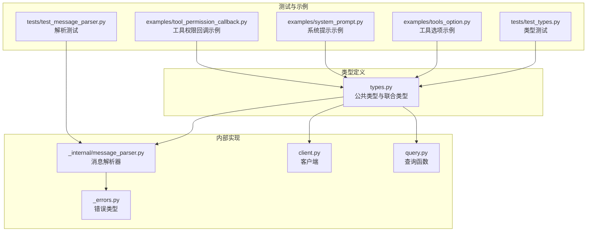
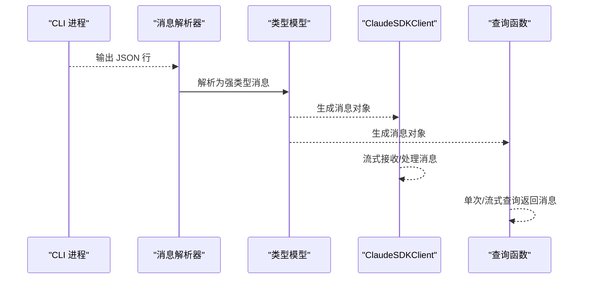
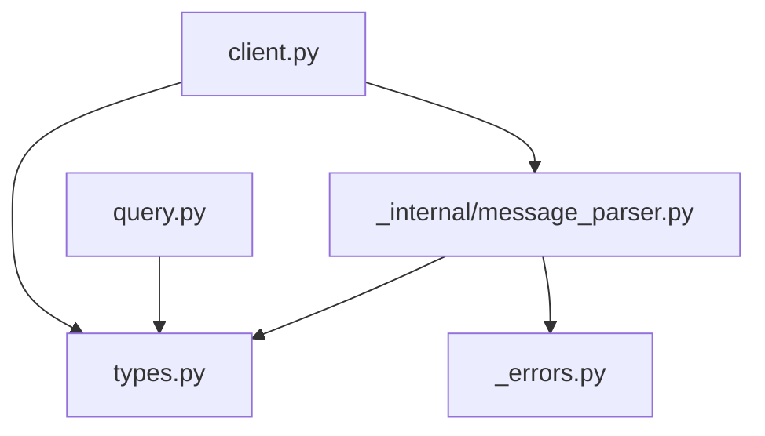
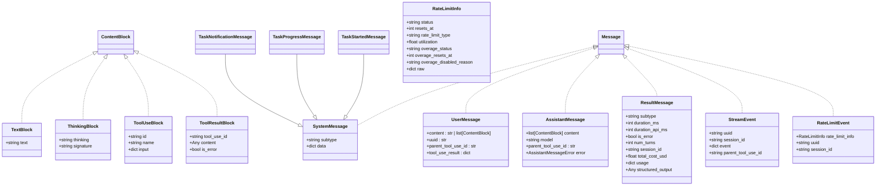
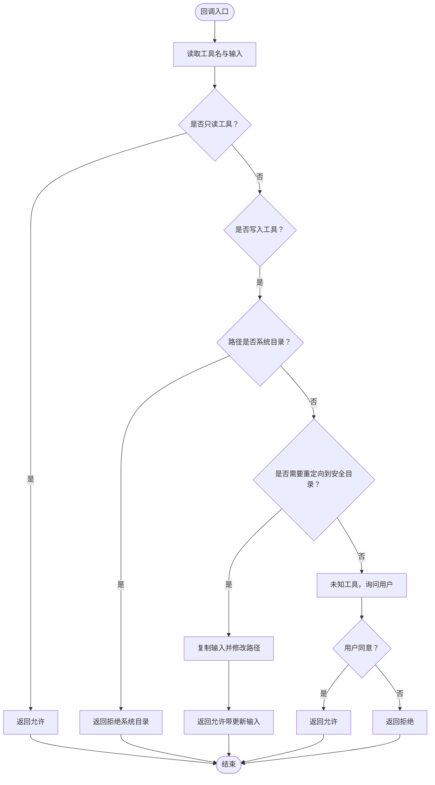
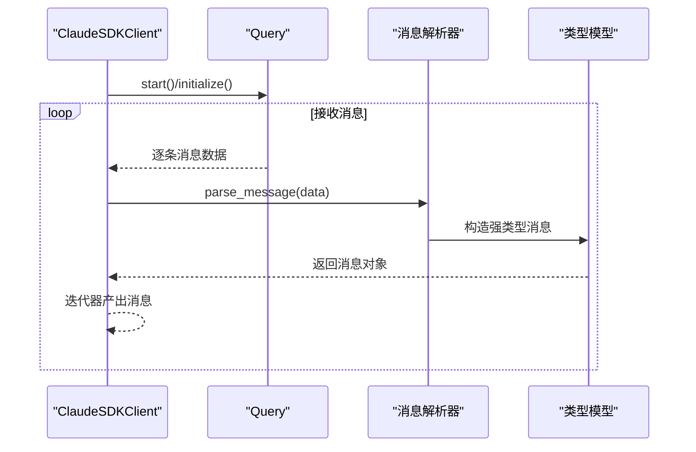

# 类型系统参考

<cite>
**本文档引用的文件**
- [types.py](file://src/claude_agent_sdk/types.py)
- [message_parser.py](file://src/claude_agent_sdk/_internal/message_parser.py)
- [_errors.py](file://src/claude_agent_sdk/_errors.py)
- [client.py](file://src/claude_agent_sdk/client.py)
- [query.py](file://src/claude_agent_sdk/query.py)
- [test_types.py](file://tests/test_types.py)
- [test_message_parser.py](file://tests/test_message_parser.py)
- [tools_option.py](file://examples/tools_option.py)
- [system_prompt.py](file://examples/system_prompt.py)
- [tool_permission_callback.py](file://examples/tool_permission_callback.py)
</cite>

## 目录
1. [简介](#简介)
2. [项目结构](#项目结构)
3. [核心组件](#核心组件)
4. [架构总览](#架构总览)
5. [详细组件分析](#详细组件分析)
6. [依赖分析](#依赖分析)
7. [性能考虑](#性能考虑)
8. [故障排除指南](#故障排除指南)
9. [结论](#结论)
10. [附录](#附录)

## 简介
本参考文档面向 Claude Agent SDK 的类型系统，系统性梳理并解释所有公共类型定义与使用方式，覆盖消息类型、内容块类型、选项配置、权限控制、钩子系统、MCP 服务器状态、会话信息等。文档通过类图、序列图、流程图等形式展示类型之间的关系与交互，并提供最佳实践、验证机制与错误处理建议，帮助开发者高效、安全地使用 SDK。

## 项目结构
类型系统主要集中在 types.py 中，配合内部的消息解析器 message_parser.py 将 CLI 输出转换为强类型对象；错误类型在 _errors.py 中定义；客户端 client.py 与查询函数 query.py 使用这些类型进行交互。

**图表来源**
- [types.py](file://src/claude_agent_sdk/types.py)
- [message_parser.py](file://src/claude_agent_sdk/_internal/message_parser.py)
- [_errors.py](file://src/claude_agent_sdk/_errors.py)
- [client.py](file://src/claude_agent_sdk/client.py)
- [query.py](file://src/claude_agent_sdk/query.py)
- [test_types.py](file://tests/test_types.py)
- [test_message_parser.py](file://tests/test_message_parser.py)
- [tools_option.py](file://examples/tools_option.py)
- [system_prompt.py](file://examples/system_prompt.py)
- [tool_permission_callback.py](file://examples/tool_permission_callback.py)

**章节来源**
- [types.py](file://src/claude_agent_sdk/types.py)
- [message_parser.py](file://src/claude_agent_sdk/_internal/message_parser.py)
- [_errors.py](file://src/claude_agent_sdk/_errors.py)
- [client.py](file://src/claude_agent_sdk/client.py)
- [query.py](file://src/claude_agent_sdk/query.py)

## 核心组件
本节概述 SDK 类型系统的关键模块与职责：
- 消息与内容块：用户消息、助手消息、系统消息、任务消息、结果消息、流事件、限流事件等。
- 内容块：文本块、思考块、工具调用块、工具结果块。
- 选项配置：ClaudeAgentOptions，支持工具、系统提示、MCP 服务器、权限模式、钩子、思维配置、输出格式等。
- 权限控制：权限模式、行为、规则值、更新请求、权限结果（允许/拒绝）。
- 钩子系统：事件枚举、输入类型、特定输出类型、同步/异步输出、钩子回调签名。
- MCP 服务器：配置类型、状态类型、工具信息、连接状态。
- 会话信息：会话元数据、会话消息。
- 错误类型：统一异常体系，含消息解析错误。

**章节来源**
- [types.py](file://src/claude_agent_sdk/types.py)
- [_errors.py](file://src/claude_agent_sdk/_errors.py)

## 架构总览
类型系统围绕“消息解析—类型建模—客户端交互”展开，CLI 输出经解析器转换为强类型消息对象，供上层客户端与查询函数消费。

**图表来源**
- [message_parser.py](file://src/claude_agent_sdk/_internal/message_parser.py)
- [types.py](file://src/claude_agent_sdk/types.py)
- [client.py](file://src/claude_agent_sdk/client.py)
- [query.py](file://src/claude_agent_sdk/query.py)

## 详细组件分析

### 消息与内容块类型
- 内容块类型
  - TextBlock：文本内容块，包含纯文本字段。
  - ThinkingBlock：思考内容块，包含思考内容与签名。
  - ToolUseBlock：工具调用块，包含工具 ID、名称与输入。
  - ToolResultBlock：工具结果块，包含工具调用 ID、内容与错误标记。
  - ContentBlock 联合类型：上述四种内容块的联合。
- 消息类型
  - UserMessage：用户消息，支持字符串或内容块列表，可携带 UUID、父工具调用 ID、工具结果。
  - AssistantMessage：助手消息，包含内容块列表、模型名、可选父工具调用 ID 与错误码。
  - SystemMessage：系统消息，包含子类型与原始数据字典。
  - TaskStartedMessage/TaskProgressMessage/TaskNotificationMessage：系统消息的子类，分别表示任务开始、进度与通知。
  - ResultMessage：结果消息，包含时长、是否错误、轮次数、会话 ID、可选停止原因、总费用、用量、结果与结构化输出。
  - StreamEvent：流事件，用于流式过程中的部分更新。
  - RateLimitEvent/RateLimitInfo：限流事件与状态信息。
  - Message 联合类型：上述消息类型的联合，便于统一处理。

使用场景与组合方式
- 用户与助手消息通过内容块承载多模态内容；系统消息承载任务生命周期与元数据；结果消息承载最终统计与成本。
- ContentBlock 在 AssistantMessage.content 中组合，支持文本与工具链路的混合表达。

验证与错误处理
- 解析器对缺失字段抛出明确的解析错误，包含原始数据以便调试。
- 对未知消息类型采用前向兼容策略，跳过以避免旧 SDK 不被新 CLI 版本破坏。

最佳实践
- 在需要文件回溯能力时，启用用户消息的 UUID 字段并通过客户端方法进行重放。
- 处理工具调用链时，保持 ToolUseBlock 与 ToolResultBlock 的 ID 对应，确保上下文关联。

**章节来源**
- [types.py](file://src/claude_agent_sdk/types.py)
- [message_parser.py](file://src/claude_agent_sdk/_internal/message_parser.py)
- [test_message_parser.py](file://tests/test_message_parser.py)

### 选项配置类型：ClaudeAgentOptions
ClaudeAgentOptions 提供丰富的配置项，涵盖工具、系统提示、MCP 服务器、权限、钩子、思维配置、输出格式、沙箱、插件、文件检查点等。

关键字段与用途
- tools：工具数组或预设，控制可用工具集合。
- allowed_tools/disallowed_tools：白名单/黑名单工具。
- system_prompt：字符串或系统提示预设（含追加文本）。
- mcp_servers：MCP 服务器配置（stdio、sse、http、sdk）。
- permission_mode：权限模式（默认、接受编辑、计划、绕过）。
- continue_conversation/resume/max_turns：会话延续、恢复与轮数限制。
- max_budget_usd：最大预算。
- model/fallback_model：主/备用模型。
- betas：Beta 功能标识。
- permission_prompt_tool_name：权限提示工具名。
- cwd/cli_path/settings：工作目录、CLI 路径、设置来源。
- add_dirs/env/extra_args：额外目录、环境变量、任意 CLI 参数。
- include_partial_messages/fork_session：部分消息流与会话分叉。
- agents/setting_sources：自定义代理与设置来源。
- sandbox/plugins：沙箱与插件配置。
- thinking/effort/output_format：思维深度、努力级别与结构化输出格式。
- enable_file_checkpointing：启用文件检查点以便回溯。

使用示例路径
- 工具选项示例：[tools_option.py](file://examples/tools_option.py)
- 系统提示示例：[system_prompt.py](file://examples/system_prompt.py)

最佳实践
- 明确工具集，避免不必要的危险工具暴露。
- 合理设置权限模式与钩子，确保安全可控。
- 使用思维配置与输出格式提升结构化结果质量。

**章节来源**
- [types.py](file://src/claude_agent_sdk/types.py)
- [tools_option.py](file://examples/tools_option.py)
- [system_prompt.py](file://examples/system_prompt.py)

### 权限控制类型
- 权限模式 PermissionMode：default、acceptEdits、plan、bypassPermissions。
- 权限行为 PermissionBehavior：allow、deny、ask。
- 规则值 PermissionRuleValue：工具名与规则内容。
- 权限更新 PermissionUpdate：支持添加/替换/移除规则、设置模式、增删目录，且提供 to_dict 转换以匹配控制协议。
- 权限结果 PermissionResultAllow/PermissionResultDeny：允许/拒绝决策，支持更新输入与权限建议、中断标志等。

工具权限回调
- CanUseTool：异步回调签名，接收工具名、输入与上下文，返回权限结果。
- ToolPermissionContext：上下文包含信号与来自 CLI 的权限建议。

最佳实践
- 回调中对输入进行最小化修改，仅在必要时调整路径或参数。
- 对系统目录写入与危险命令实施严格限制。
- 使用 PermissionUpdate 返回更细粒度的权限变更建议。

**章节来源**
- [types.py](file://src/claude_agent_sdk/types.py)
- [tool_permission_callback.py](file://examples/tool_permission_callback.py)

### 钩子系统类型
- 事件枚举 HookEvent：PreToolUse、PostToolUse、PostToolUseFailure、UserPromptSubmit、Stop、SubagentStop、PreCompact、Notification、SubagentStart、PermissionRequest。
- 输入类型：BaseHookInput 及各事件的强类型输入（如 PreToolUseHookInput、PostToolUseHookInput、PermissionRequestHookInput 等），支持可选的子代理标识。
- 输出类型：AsyncHookJSONOutput（异步钩子）、SyncHookJSONOutput（同步钩子），包含控制字段（继续、抑制输出、停止原因）与决策字段（阻断、系统消息、原因）及事件特定输出。
- 钩子匹配器 HookMatcher：包含匹配器字符串、回调列表与超时。
- 钩子回调签名 HookCallback：接收强类型输入、可选工具使用 ID 与上下文，返回钩子输出。

最佳实践
- 使用 HookMatcher 为不同事件配置合适的匹配器与超时。
- 在 PreToolUse 中尽早决定权限，减少后续失败开销。
- 利用 HookSpecificOutput 传递事件相关上下文给 CLI。

**章节来源**
- [types.py](file://src/claude_agent_sdk/types.py)

### MCP 服务器类型
- 配置类型：McpStdioServerConfig、McpSSEServerConfig、McpHttpServerConfig、McpSdkServerConfig。
- 状态类型：McpServerStatus、McpStatusResponse，包含连接状态、服务器信息、错误、配置与工具列表。
- 工具信息：McpToolInfo、McpToolAnnotations。
- 连接状态：McpServerConnectionStatus。

最佳实践
- 通过 get_mcp_status 实时监控服务器健康状况。
- 对失败状态及时重连或禁用对应服务器。
- 使用工具注解识别只读、破坏性与开放世界工具。

**章节来源**
- [types.py](file://src/claude_agent_sdk/types.py)

### 会话信息类型
- SDKSessionInfo：会话元数据（ID、摘要、最后修改时间、文件大小、自定义标题、首条提示、Git 分支、工作目录）。
- SessionMessage：历史会话消息（类型、UUID、会话 ID、原始消息、父工具调用 ID）。

最佳实践
- 使用 list_sessions 获取会话列表，结合 limit 与工作树扫描优化性能。
- 通过 get_session_messages 重建对话链，注意逻辑父链与紧凑边界的区别。

**章节来源**
- [types.py](file://src/claude_agent_sdk/types.py)

### 错误类型
- ClaudeSDKError：基础异常。
- CLIConnectionError/CLINotFoundError/ProcessError：连接、未找到 CLI、进程失败。
- CLIJSONDecodeError：CLI 输出 JSON 解码失败。
- MessageParseError：消息解析失败，携带原始数据以便诊断。

最佳实践
- 捕获 MessageParseError 并记录 data 字段辅助排障。
- 对未知消息类型采用前向兼容策略，避免版本升级导致崩溃。

**章节来源**
- [_errors.py](file://src/claude_agent_sdk/_errors.py)
- [message_parser.py](file://src/claude_agent_sdk/_internal/message_parser.py)

## 依赖分析
类型系统内部依赖关系清晰：消息解析器依赖类型定义；客户端与查询函数依赖类型与解析器；测试与示例依赖类型与实现。

**图表来源**
- [types.py](file://src/claude_agent_sdk/types.py)
- [message_parser.py](file://src/claude_agent_sdk/_internal/message_parser.py)
- [_errors.py](file://src/claude_agent_sdk/_errors.py)
- [client.py](file://src/claude_agent_sdk/client.py)
- [query.py](file://src/claude_agent_sdk/query.py)

**章节来源**
- [types.py](file://src/claude_agent_sdk/types.py)
- [message_parser.py](file://src/claude_agent_sdk/_internal/message_parser.py)
- [_errors.py](file://src/claude_agent_sdk/_errors.py)
- [client.py](file://src/claude_agent_sdk/client.py)
- [query.py](file://src/claude_agent_sdk/query.py)

## 性能考虑
- 消息解析采用轻量级字段提取与前向兼容策略，避免全量 JSON 解析带来的开销。
- 会话列表扫描通过 stat + head/tail 读取，避免全量解析 JSONL。
- 建议合理设置 include_partial_messages 与 max_buffer_size，平衡实时性与内存占用。
- 对 MCP 服务器状态查询使用批量接口，减少频繁 IO。

## 故障排除指南
常见问题与处理
- 消息解析失败：检查输入数据结构，确认必需字段存在；捕获 MessageParseError 并查看 data 字段。
- 权限回调未触发：确认使用了 can_use_tool 且 permission_mode 设置为默认或计划模式。
- MCP 服务器连接失败：通过 get_mcp_status 获取状态与错误信息，必要时重连或禁用。
- 会话列表为空：确认项目目录与工作树扫描设置，检查路径规范化与哈希后缀匹配。

**章节来源**
- [test_message_parser.py](file://tests/test_message_parser.py)
- [tool_permission_callback.py](file://examples/tool_permission_callback.py)
- [client.py](file://src/claude_agent_sdk/client.py)

## 结论
Claude Agent SDK 的类型系统以强类型消息与内容块为核心，辅以完善的选项配置、权限控制、钩子与 MCP 服务器状态管理，形成从解析到交互的完整闭环。通过本文档的参考与最佳实践，开发者可以安全、高效地构建与扩展应用。

## 附录

### 类型关系类图

**图表来源**
- [types.py](file://src/claude_agent_sdk/types.py)

### 工具权限回调流程图

**图表来源**
- [types.py](file://src/claude_agent_sdk/types.py)
- [tool_permission_callback.py](file://examples/tool_permission_callback.py)

### 客户端消息接收序列图

**图表来源**
- [client.py](file://src/claude_agent_sdk/client.py)
- [message_parser.py](file://src/claude_agent_sdk/_internal/message_parser.py)
- [types.py](file://src/claude_agent_sdk/types.py)