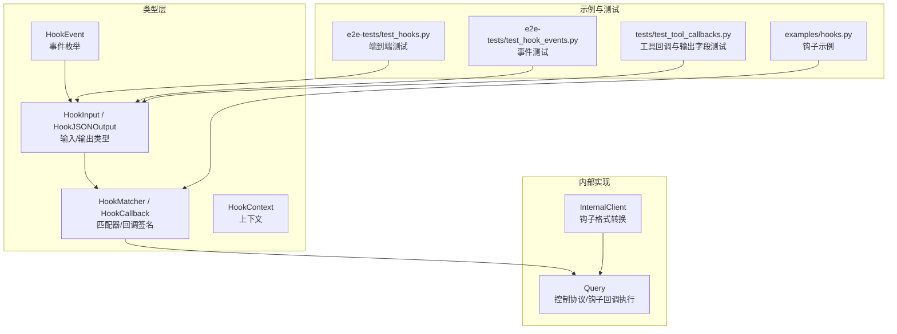
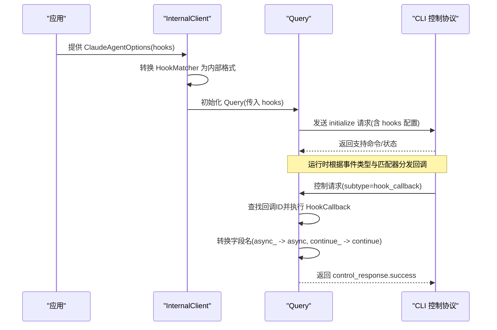
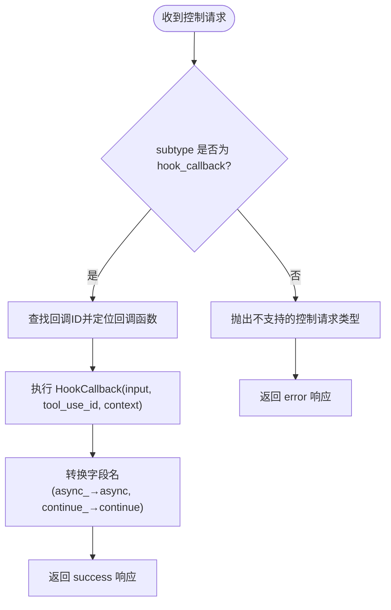
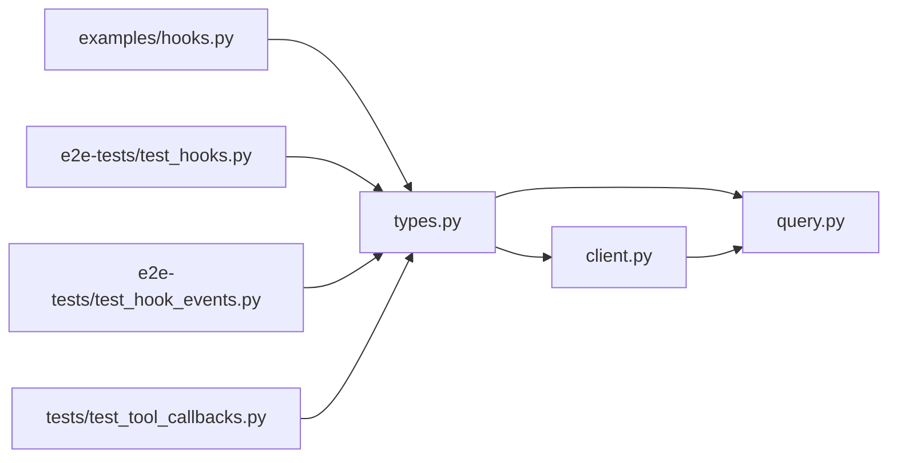
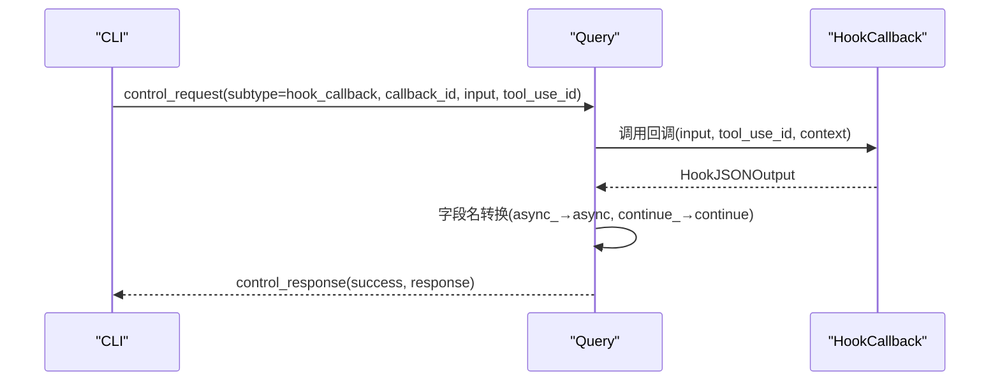

# 钩子系统 API

<cite>
**本文引用的文件**
- [types.py](file://src/claude_agent_sdk/types.py)
- [client.py](file://src/claude_agent_sdk/_internal/client.py)
- [query.py](file://src/claude_agent_sdk/_internal/query.py)
- [hooks.py](file://examples/hooks.py)
- [test_hooks.py](file://e2e-tests/test_hooks.py)
- [test_hook_events.py](file://e2e-tests/test_hook_events.py)
- [test_tool_callbacks.py](file://tests/test_tool_callbacks.py)
</cite>

## 目录
1. [简介](#简介)
2. [项目结构](#项目结构)
3. [核心组件](#核心组件)
4. [架构总览](#架构总览)
5. [详细组件分析](#详细组件分析)
6. [依赖分析](#依赖分析)
7. [性能考量](#性能考量)
8. [故障排查指南](#故障排查指南)
9. [结论](#结论)
10. [附录](#附录)

## 简介
本文件面向 Claude Agent SDK 的钩子系统 API，系统性地介绍钩子类型、匹配器与回调的定义与使用方式，解释事件触发时机与处理流程，并提供完整实现示例（监控工具使用、处理权限请求、响应系统通知）。同时说明钩子的执行顺序、错误处理机制、调试技巧与性能考虑，帮助开发者在 Python 中安全、可控地扩展 Claude 的行为控制能力。

## 项目结构
钩子系统主要由以下模块组成：
- 类型定义：集中于类型模块，定义所有钩子输入输出、上下文、匹配器与回调签名等。
- 内部客户端：负责将用户配置的钩子转换为内部格式并初始化控制协议。
- 查询类：负责双向控制协议的读写、事件分发、钩子回调执行与响应转换。
- 示例与测试：提供可运行的钩子示例与端到端测试，验证钩子行为。

图表来源
- [types.py:160-472](file://src/claude_agent_sdk/types.py#L160-L472)
- [client.py:26-42](file://src/claude_agent_sdk/_internal/client.py#L26-L42)
- [query.py:119-163](file://src/claude_agent_sdk/_internal/query.py#L119-L163)
- [hooks.py:1-351](file://examples/hooks.py#L1-L351)
- [test_hooks.py:1-157](file://e2e-tests/test_hooks.py#L1-L157)
- [test_hook_events.py:1-197](file://e2e-tests/test_hook_events.py#L1-L197)
- [test_tool_callbacks.py:220-372](file://tests/test_tool_callbacks.py#L220-L372)

章节来源
- [types.py:160-472](file://src/claude_agent_sdk/types.py#L160-L472)
- [client.py:26-42](file://src/claude_agent_sdk/_internal/client.py#L26-L42)
- [query.py:119-163](file://src/claude_agent_sdk/_internal/query.py#L119-L163)

## 核心组件
- 钩子事件类型：PreToolUse、PostToolUse、PostToolUseFailure、UserPromptSubmit、Stop、SubagentStop、PreCompact、Notification、SubagentStart、PermissionRequest。
- 钩子输入类型：针对每个事件的强类型输入结构，如 PreToolUseHookInput、PostToolUseHookInput、PermissionRequestHookInput 等。
- 钩子输出类型：同步输出（SyncHookJSONOutput）与异步输出（AsyncHookJSONOutput），支持控制字段（continue_、suppressOutput、stopReason）、决策字段（decision、systemMessage、reason）与事件特定输出（hookSpecificOutput）。
- 匹配器：HookMatcher，用于按工具名或组合工具名进行匹配，支持超时配置。
- 回调签名：HookCallback，接收强类型 HookInput、可选 tool_use_id、HookContext，返回 HookJSONOutput。
- 上下文：HookContext，当前预留信号字段，未来可用于中止信号。

章节来源
- [types.py:160-472](file://src/claude_agent_sdk/types.py#L160-L472)

## 架构总览
钩子系统通过双向控制协议与 CLI 交互，内部以 Query 统一调度。初始化阶段将用户配置的 HookMatcher 转换为内部格式并注册回调 ID；运行时根据事件类型与匹配器规则分发到对应回调，执行后将 Python 字段名转换为 CLI 兼容名称并返回。

图表来源
- [client.py:26-42](file://src/claude_agent_sdk/_internal/client.py#L26-L42)
- [query.py:119-163](file://src/claude_agent_sdk/_internal/query.py#L119-L163)
- [query.py:236-346](file://src/claude_agent_sdk/_internal/query.py#L236-L346)

## 详细组件分析

### 钩子事件与输入类型
- 事件枚举：包括 PreToolUse、PostToolUse、PostToolUseFailure、UserPromptSubmit、Stop、SubagentStop、PreCompact、Notification、SubagentStart、PermissionRequest。
- 输入类型：每个事件都有对应的 TypedDict 输入类型，包含会话标识、转录路径、工作目录、权限模式等通用字段，以及事件特有的字段（如工具名、工具输入、工具响应、错误信息、消息内容等）。

章节来源
- [types.py:160-310](file://src/claude_agent_sdk/types.py#L160-L310)

### 钩子输出与控制字段
- 同步输出（SyncHookJSONOutput）：
  - 控制字段：continue_（是否继续）、suppressOutput（抑制输出）、stopReason（停止原因）。
  - 决策字段：decision（阻断）、systemMessage（系统消息）、reason（理由）。
  - 事件特定输出：hookSpecificOutput，包含各事件的专用字段（如 PreToolUse 的 permissionDecision、PostToolUse 的 additionalContext 等）。
- 异步输出（AsyncHookJSONOutput）：async_=True 且可选 asyncTimeout，用于延迟钩子执行。

章节来源
- [types.py:386-452](file://src/claude_agent_sdk/types.py#L386-L452)

### 匹配器与回调签名
- HookMatcher：包含 matcher（工具名或“工具1|工具2”组合）、hooks（回调列表）、timeout（秒）。
- HookCallback：函数签名接收 HookInput、tool_use_id（可选）、HookContext，返回 HookJSONOutput（异步）。
- HookContext：当前预留 signal 字段，未来支持中止信号。

章节来源
- [types.py:455-472](file://src/claude_agent_sdk/types.py#L455-L472)
- [types.py:475-491](file://src/claude_agent_sdk/types.py#L475-L491)

### 执行流程与字段转换
- 初始化：InternalClient 将 HookMatcher 转换为内部字典格式，Query 在 initialize 请求中注册回调 ID 列表。
- 运行时：CLI 发出 hook_callback 控制请求，Query 定位回调并执行；随后将 Python 字段名转换为 CLI 名称（async_→async，continue_→continue）再返回。
- 错误处理：捕获异常并返回 control_response.error，等待方收到异常后抛出。

图表来源
- [query.py:236-346](file://src/claude_agent_sdk/_internal/query.py#L236-L346)
- [query.py:34-50](file://src/claude_agent_sdk/_internal/query.py#L34-L50)

章节来源
- [client.py:26-42](file://src/claude_agent_sdk/_internal/client.py#L26-L42)
- [query.py:236-346](file://src/claude_agent_sdk/_internal/query.py#L236-L346)
- [query.py:34-50](file://src/claude_agent_sdk/_internal/query.py#L34-L50)

### 权限请求钩子（PermissionRequest）
- 输入：包含 session_id、transcript_path、cwd、hook_event_name、tool_name、tool_input、可选 permission_suggestions。
- 输出：hookSpecificOutput.decision（例如允许/拒绝/询问），并可携带 additionalContext 等。

章节来源
- [types.py:289-296](file://src/claude_agent_sdk/types.py#L289-L296)
- [types.py:367-372](file://src/claude_agent_sdk/types.py#L367-L372)
- [test_tool_callbacks.py:591-596](file://tests/test_tool_callbacks.py#L591-L596)

### 工具生命周期钩子
- PreToolUse：在工具调用前触发，可设置 permissionDecision、permissionDecisionReason、updatedInput、additionalContext。
- PostToolUse：在工具调用后触发，可设置 additionalContext、updatedMCPToolOutput。
- PostToolUseFailure：工具调用失败时触发，包含 error 与可选 is_interrupt。

章节来源
- [types.py:210-237](file://src/claude_agent_sdk/types.py#L210-L237)
- [types.py:314-337](file://src/claude_agent_sdk/types.py#L314-L337)
- [test_hook_events.py:19-61](file://e2e-tests/test_hook_events.py#L19-L61)

### 用户提示与通知钩子
- UserPromptSubmit：用户提交提示时触发，可设置 additionalContext。
- Notification：系统通知时触发，包含 message、title、notification_type 等。

章节来源
- [types.py:240-245](file://src/claude_agent_sdk/types.py#L240-L245)
- [types.py:272-279](file://src/claude_agent_sdk/types.py#L272-L279)
- [test_hook_events.py:114-157](file://e2e-tests/test_hook_events.py#L114-L157)

### 实现示例与最佳实践
- 监控工具使用：在 PreToolUse 中检查工具名与输入，必要时返回 permissionDecision='deny' 或 'allow'，并设置 reason/systemMessage。
- 处理权限请求：在 PermissionRequest 中返回 hookSpecificOutput.decision（如允许/拒绝），并提供 additionalContext。
- 响应系统通知：在 Notification 中记录消息与类型，添加 additionalContext。
- 控制执行流：在 PostToolUse 中根据工具输出决定 continue_=False 与 stopReason，或在 PreToolUse 中直接阻断。

章节来源
- [hooks.py:46-154](file://examples/hooks.py#L46-L154)
- [hooks.py:156-301](file://examples/hooks.py#L156-L301)
- [hooks.py:303-351](file://examples/hooks.py#L303-L351)
- [test_hooks.py:17-112](file://e2e-tests/test_hooks.py#L17-L112)
- [test_hook_events.py:114-197](file://e2e-tests/test_hook_events.py#L114-L197)

## 依赖分析
- InternalClient 依赖类型模块中的 HookEvent、HookMatcher、HookCallback 等，负责将用户提供的 HookMatcher 转换为 Query 可识别的内部格式。
- Query 依赖类型模块中的 HookInput、HookJSONOutput、HookContext、SDKControlRequest 等，负责控制协议的收发、回调执行与字段转换。
- 示例与测试文件依赖类型模块与 Query 的行为，验证钩子事件、输出字段与异步钩子等特性。

图表来源
- [types.py:160-472](file://src/claude_agent_sdk/types.py#L160-L472)
- [client.py:26-42](file://src/claude_agent_sdk/_internal/client.py#L26-L42)
- [query.py:119-163](file://src/claude_agent_sdk/_internal/query.py#L119-L163)
- [hooks.py:1-351](file://examples/hooks.py#L1-L351)
- [test_hooks.py:1-157](file://e2e-tests/test_hooks.py#L1-L157)
- [test_hook_events.py:1-197](file://e2e-tests/test_hook_events.py#L1-L197)
- [test_tool_callbacks.py:220-372](file://tests/test_tool_callbacks.py#L220-L372)

章节来源
- [types.py:160-472](file://src/claude_agent_sdk/types.py#L160-L472)
- [client.py:26-42](file://src/claude_agent_sdk/_internal/client.py#L26-L42)
- [query.py:119-163](file://src/claude_agent_sdk/_internal/query.py#L119-L163)

## 性能考量
- 钩子超时：HookMatcher 支持 timeout 配置，默认 60 秒；建议为耗时操作设置合理超时，避免阻塞主流程。
- 异步钩子：使用 AsyncHookJSONOutput 的 async_=True 与 asyncTimeout 可将长任务延迟执行，提升交互流畅度。
- 字段转换开销：Python 字段名到 CLI 名称的转换为常量时间映射，开销极小。
- 流式模式：内部始终以流式模式运行，确保与 CLI 的双向通信，避免不必要的阻塞。

章节来源
- [types.py:475-491](file://src/claude_agent_sdk/types.py#L475-L491)
- [types.py:393-406](file://src/claude_agent_sdk/types.py#L393-L406)
- [query.py:119-163](file://src/claude_agent_sdk/_internal/query.py#L119-L163)

## 故障排查指南
- 钩子未触发：确认 HookMatcher 的 matcher 是否与工具名匹配；若为 None，则对所有事件生效。
- 字段名不生效：确保使用 Python SDK 的字段名（async_、continue_），内部会自动转换为 CLI 名称。
- 超时问题：为 HookMatcher 设置合适的 timeout；若钩子逻辑复杂，考虑使用异步钩子。
- 错误返回：Query 捕获异常后返回 error 响应，上层应检查 control_response.error 并处理。
- 权限请求：确保 can_use_tool 回调正确返回 PermissionResultAllow/Deny，否则 CLI 会报错。

章节来源
- [query.py:236-346](file://src/claude_agent_sdk/_internal/query.py#L236-L346)
- [query.py:34-50](file://src/claude_agent_sdk/_internal/query.py#L34-L50)
- [test_tool_callbacks.py:220-372](file://tests/test_tool_callbacks.py#L220-L372)

## 结论
Claude Agent SDK 的钩子系统通过强类型输入输出、灵活的匹配器与回调签名，提供了对工具生命周期、用户提示、系统通知与权限请求的细粒度控制。结合异步钩子与超时配置，可在保证安全性的同时提升用户体验。建议在生产环境中为关键钩子设置合理的超时与日志，以便快速定位问题并优化性能。

## 附录

### 钩子事件与典型用途
- PreToolUse：工具调用前的安全检查、输入修改、权限决策。
- PostToolUse：工具调用后的结果审查、上下文补充、输出修正。
- PostToolUseFailure：失败场景的错误处理与恢复建议。
- UserPromptSubmit：会话开始时的上下文注入。
- Notification：系统通知的监听与处理。
- PermissionRequest：权限请求的动态决策。
- SubagentStart/Stop：子代理生命周期的监控与审计。

章节来源
- [types.py:160-172](file://src/claude_agent_sdk/types.py#L160-L172)
- [types.py:210-296](file://src/claude_agent_sdk/types.py#L210-L296)

### 关键流程图（钩子回调序列）

图表来源
- [query.py:288-302](file://src/claude_agent_sdk/_internal/query.py#L288-L302)
- [query.py:34-50](file://src/claude_agent_sdk/_internal/query.py#L34-L50)