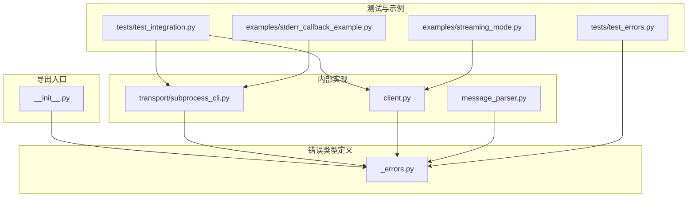
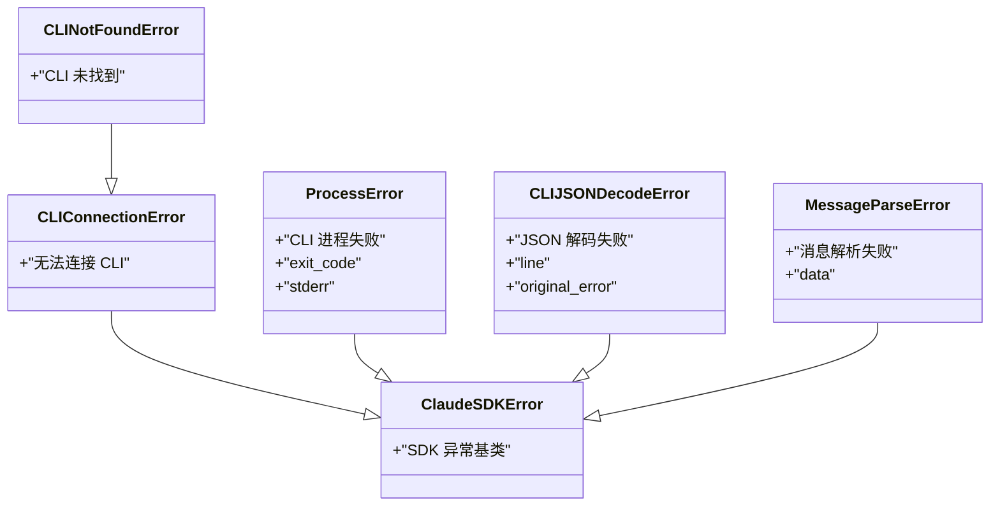
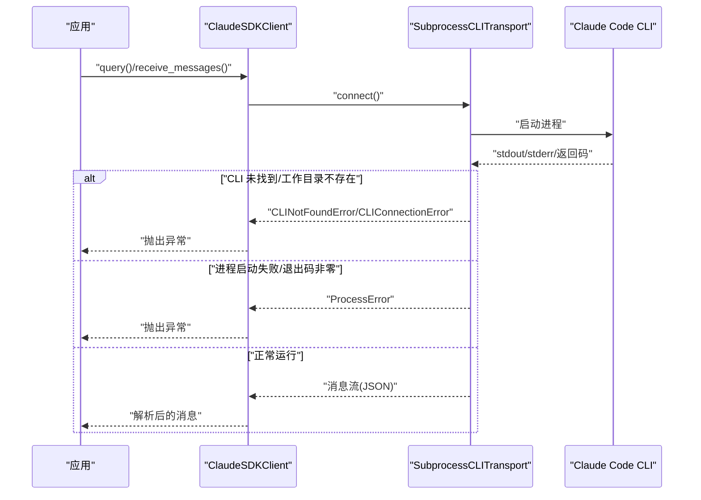
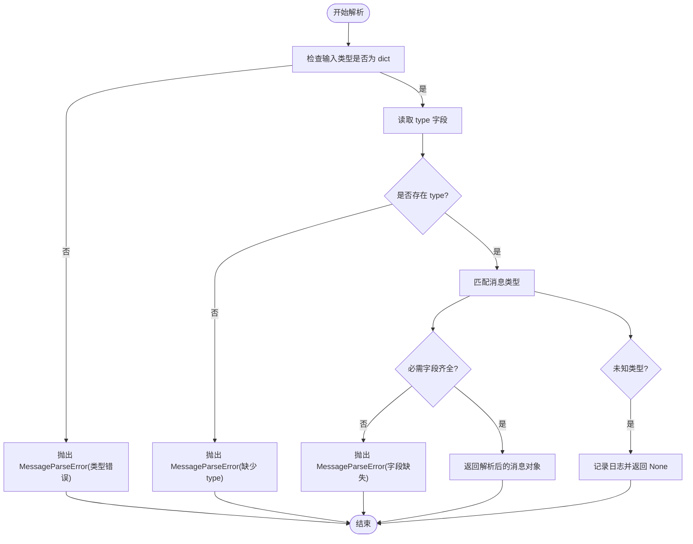
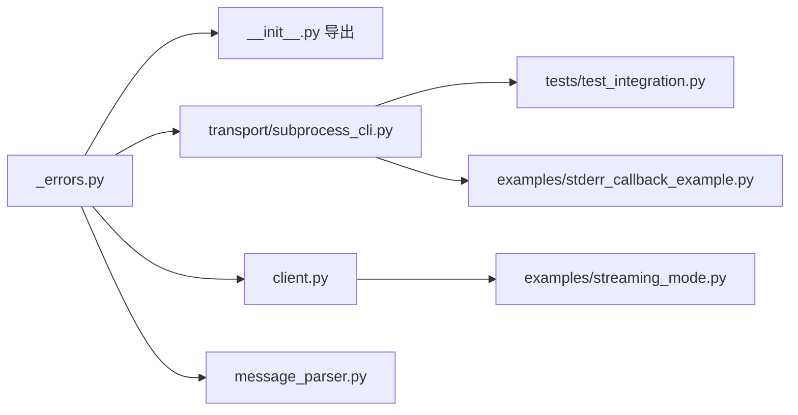

# 错误处理 API

<cite>
**本文引用的文件**
- [_errors.py](file://src/claude_agent_sdk/_errors.py)
- [__init__.py](file://src/claude_agent_sdk/__init__.py)
- [subprocess_cli.py](file://src/claude_agent_sdk/_internal/transport/subprocess_cli.py)
- [client.py](file://src/claude_agent_sdk/client.py)
- [message_parser.py](file://src/claude_agent_sdk/_internal/message_parser.py)
- [test_errors.py](file://tests/test_errors.py)
- [test_integration.py](file://tests/test_integration.py)
- [stderr_callback_example.py](file://examples/stderr_callback_example.py)
- [streaming_mode.py](file://examples/streaming_mode.py)
</cite>

## 目录
1. [简介](#简介)
2. [项目结构](#项目结构)
3. [核心组件](#核心组件)
4. [架构总览](#架构总览)
5. [详细组件分析](#详细组件分析)
6. [依赖分析](#依赖分析)
7. [性能考虑](#性能考虑)
8. [故障排查指南](#故障排查指南)
9. [结论](#结论)
10. [附录](#附录)

## 简介
本文件系统性梳理 Claude Agent SDK 的错误处理 API，覆盖所有错误类型（ClaudeSDKError、CLIConnectionError、CLINotFoundError、ProcessError、CLIJSONDecodeError、MessageParseError）的定义、触发条件、错误信息与处理建议，并给出继承关系、使用示例、恢复策略与重试机制、调试技巧与常见问题解决方案，帮助开发者在集成与使用过程中高效定位与解决问题。

## 项目结构
围绕错误处理的关键代码分布在以下模块：
- 错误类型定义：src/claude_agent_sdk/_errors.py
- 导出入口：src/claude_agent_sdk/__init__.py
- 连接与传输层：src/claude_agent_sdk/_internal/transport/subprocess_cli.py
- 客户端封装：src/claude_agent_sdk/client.py
- 消息解析与解析错误：src/claude_agent_sdk/_internal/message_parser.py
- 单元测试与集成测试：tests/test_errors.py、tests/test_integration.py
- 示例：examples/stderr_callback_example.py、examples/streaming_mode.py

图表来源
- [_errors.py:1-57](file://src/claude_agent_sdk/_errors.py#L1-L57)
- [__init__.py:9-15](file://src/claude_agent_sdk/__init__.py#L9-L15)
- [subprocess_cli.py:21-22](file://src/claude_agent_sdk/_internal/transport/subprocess_cli.py#L21-L22)
- [client.py:188-438](file://src/claude_agent_sdk/client.py#L188-L438)
- [message_parser.py:6-24](file://src/claude_agent_sdk/_internal/message_parser.py#L6-L24)
- [test_errors.py:3-9](file://tests/test_errors.py#L3-L9)
- [test_integration.py:164-178](file://tests/test_integration.py#L164-L178)
- [stderr_callback_example.py:1-44](file://examples/stderr_callback_example.py#L1-L44)
- [streaming_mode.py:448-458](file://examples/streaming_mode.py#L448-L458)

章节来源
- [__init__.py:9-15](file://src/claude_agent_sdk/__init__.py#L9-L15)
- [subprocess_cli.py:21-22](file://src/claude_agent_sdk/_internal/transport/subprocess_cli.py#L21-L22)
- [client.py:188-438](file://src/claude_agent_sdk/client.py#L188-L438)
- [message_parser.py:6-24](file://src/claude_agent_sdk/_internal/message_parser.py#L6-L24)
- [test_errors.py:3-9](file://tests/test_errors.py#L3-L9)
- [test_integration.py:164-178](file://tests/test_integration.py#L164-L178)
- [stderr_callback_example.py:1-44](file://examples/stderr_callback_example.py#L1-L44)
- [streaming_mode.py:448-458](file://examples/streaming_mode.py#L448-L458)

## 核心组件
本节对所有错误类型进行逐一说明，包括触发条件、错误信息特征与处理建议。

- ClaudeSDKError
  - 触发条件：SDK 内部通用基类异常，用于统一捕获 SDK 相关异常。
  - 错误信息：由子类自定义消息；通常包含上下文描述。
  - 处理建议：作为顶层捕获目标，便于区分 SDK 内部错误与其他异常；不直接抛出实例化对象，而是使用具体子类。
  - 参考路径：[ClaudeSDKError:6-7](file://src/claude_agent_sdk/_errors.py#L6-L7)

- CLIConnectionError
  - 触发条件：无法连接到 Claude Code CLI 或连接状态异常（如未调用 connect() 就进行读写）。
  - 错误信息：包含“未连接”或“传输未就绪”的提示；常伴随“请先调用 connect()”等引导信息。
  - 处理建议：在执行任何读写操作前确保已成功 connect()；若出现“未连接”，先重建连接再重试。
  - 参考路径：[CLIConnectionError:10-11](file://src/claude_agent_sdk/_errors.py#L10-L11)，[client.py 中多处抛出:188-438](file://src/claude_agent_sdk/client.py#L188-L438)，[transport 中多处抛出:485-521](file://src/claude_agent_sdk/_internal/transport/subprocess_cli.py#L485-L521)

- CLINotFoundError
  - 触发条件：找不到 Claude Code CLI，包括系统未安装、环境变量未配置、工作目录不存在等。
  - 错误信息：包含“未找到”提示及可选的 CLI 路径信息；建议参考安装指引与 PATH 配置。
  - 处理建议：确认 CLI 已安装且在 PATH 中；必要时通过选项显式指定 cli_path；检查工作目录存在性。
  - 参考路径：[CLINotFoundError:14-22](file://src/claude_agent_sdk/_errors.py#L14-L22)，[transport 中的查找逻辑与抛出:64-95](file://src/claude_agent_sdk/_internal/transport/subprocess_cli.py#L64-L95)

- ProcessError
  - 触发条件：CLI 子进程启动失败或运行中退出码非零；常伴随 stderr 输出。
  - 错误信息：包含原始错误消息、exit_code 与 stderr；便于定位具体失败原因。
  - 处理建议：优先查看 stderr 输出；根据 exit_code 判断是否需要重试或调整参数；避免重复触发相同错误。
  - 参考路径：[ProcessError:25-39](file://src/claude_agent_sdk/_errors.py#L25-L39)，[transport 中的进程退出处理:572-585](file://src/claude_agent_sdk/_internal/transport/subprocess_cli.py#L572-L585)

- CLIJSONDecodeError
  - 触发条件：从 CLI 输出解析 JSON 时失败，或缓冲区超限导致无法完整解析。
  - 错误信息：包含截断的行内容摘要与原始异常；提示“无法解码 JSON”。
  - 处理建议：检查 CLI 输出格式是否被截断或损坏；增大缓冲区或优化输出；修复上游生成 JSON 的逻辑。
  - 参考路径：[CLIJSONDecodeError:42-48](file://src/claude_agent_sdk/_errors.py#L42-L48)，[transport 中的 JSON 解析与缓冲区限制:519-585](file://src/claude_agent_sdk/_internal/transport/subprocess_cli.py#L519-L585)

- MessageParseError
  - 触发条件：解析来自 CLI 的消息字典时缺少必需字段或数据类型不合法。
  - 错误信息：包含“无效消息数据类型”、“缺失 type 字段”或各消息类型缺失字段的具体键名。
  - 处理建议：检查上游消息结构是否符合 SDK 支持的消息类型；补充缺失字段；对未知类型保持向前兼容（返回 None）。
  - 参考路径：[MessageParseError:51-56](file://src/claude_agent_sdk/_errors.py#L51-L56)，[message_parser 中的解析逻辑与异常抛出:29-250](file://src/claude_agent_sdk/_internal/message_parser.py#L29-L250)

章节来源
- [_errors.py:6-56](file://src/claude_agent_sdk/_errors.py#L6-L56)
- [client.py:188-438](file://src/claude_agent_sdk/client.py#L188-L438)
- [subprocess_cli.py:64-95](file://src/claude_agent_sdk/_internal/transport/subprocess_cli.py#L64-L95)
- [subprocess_cli.py:519-585](file://src/claude_agent_sdk/_internal/transport/subprocess_cli.py#L519-L585)
- [message_parser.py:29-250](file://src/claude_agent_sdk/_internal/message_parser.py#L29-L250)

## 架构总览
下图展示了错误类型在 SDK 中的继承关系与主要使用位置：

图表来源
- [_errors.py:6-56](file://src/claude_agent_sdk/_errors.py#L6-L56)

章节来源
- [_errors.py:6-56](file://src/claude_agent_sdk/_errors.py#L6-L56)

## 详细组件分析

### CLI 连接与传输层中的错误
- CLI 启动阶段
  - 当 CLI 路径不存在或工作目录不存在时，抛出 CLIConnectionError 或 CLINotFoundError。
  - 参考路径：[transport.connect 中的异常分支:396-410](file://src/claude_agent_sdk/_internal/transport/subprocess_cli.py#L396-L410)
- 写入阶段
  - 若传输未就绪或进程已终止，抛出 CLIConnectionError。
  - 参考路径：[transport.write 中的就绪检查与异常:481-505](file://src/claude_agent_sdk/_internal/transport/subprocess_cli.py#L481-L505)
- 读取阶段
  - 若未连接或进程退出码非零，抛出 CLIConnectionError 或 ProcessError。
  - 参考路径：[transport.read_messages 中的连接检查与退出码处理:519-585](file://src/claude_agent_sdk/_internal/transport/subprocess_cli.py#L519-L585)
- JSON 解码
  - 缓冲区超限或 JSON 不完整时，抛出 CLIJSONDecodeError。
  - 参考路径：[transport.read_messages 中的缓冲区与解码逻辑:519-585](file://src/claude_agent_sdk/_internal/transport/subprocess_cli.py#L519-L585)

图表来源
- [client.py:188-227](file://src/claude_agent_sdk/client.py#L188-L227)
- [subprocess_cli.py:335-410](file://src/claude_agent_sdk/_internal/transport/subprocess_cli.py#L335-L410)
- [subprocess_cli.py:519-585](file://src/claude_agent_sdk/_internal/transport/subprocess_cli.py#L519-L585)

章节来源
- [client.py:188-227](file://src/claude_agent_sdk/client.py#L188-L227)
- [subprocess_cli.py:335-410](file://src/claude_agent_sdk/_internal/transport/subprocess_cli.py#L335-L410)
- [subprocess_cli.py:519-585](file://src/claude_agent_sdk/_internal/transport/subprocess_cli.py#L519-L585)

### 消息解析中的错误
- 输入类型校验：非 dict 类型直接抛出 MessageParseError。
- 必需字段缺失：各消息类型（user/assistant/system/result/rate_limit_event 等）缺少关键字段时抛出 MessageParseError。
- 未知类型：跳过并记录日志，返回 None，保持向前兼容。
- 参考路径：[message_parser.parse_message:29-250](file://src/claude_agent_sdk/_internal/message_parser.py#L29-L250)

图表来源
- [message_parser.py:29-250](file://src/claude_agent_sdk/_internal/message_parser.py#L29-L250)

章节来源
- [message_parser.py:29-250](file://src/claude_agent_sdk/_internal/message_parser.py#L29-L250)

### 错误处理示例与最佳实践
- 基础异常捕获
  - 使用 ClaudeSDKError 作为顶层捕获，区分 SDK 内部错误与其他异常。
  - 参考路径：[tests 中的基础异常测试:15-20](file://tests/test_errors.py#L15-L20)
- CLI 未找到处理
  - 在查询前捕获 CLINotFoundError，提示安装与 PATH 配置。
  - 参考路径：[集成测试中的 CLI 未找到用例:164-178](file://tests/test_integration.py#L164-L178)
- 连接异常处理
  - 对 CLIConnectionError 进行重连或提示用户先 connect()。
  - 参考路径：[client.py 中的连接检查:188-438](file://src/claude_agent_sdk/client.py#L188-L438)
- 进程失败处理
  - 捕获 ProcessError，读取 exit_code 与 stderr，决定重试或修正参数。
  - 参考路径：[transport 中的退出码处理:572-585](file://src/claude_agent_sdk/_internal/transport/subprocess_cli.py#L572-L585)
- JSON 解码失败处理
  - 捕获 CLIJSONDecodeError，检查缓冲区大小与输出格式，必要时增大缓冲或修复上游。
  - 参考路径：[transport 中的缓冲区与解码:519-585](file://src/claude_agent_sdk/_internal/transport/subprocess_cli.py#L519-L585)
- 消息解析失败处理
  - 捕获 MessageParseError，打印 data 以便定位问题；对未知类型保持兼容。
  - 参考路径：[message_parser 中的异常抛出:29-250](file://src/claude_agent_sdk/_internal/message_parser.py#L29-L250)

章节来源
- [test_errors.py:15-20](file://tests/test_errors.py#L15-L20)
- [test_integration.py:164-178](file://tests/test_integration.py#L164-L178)
- [client.py:188-438](file://src/claude_agent_sdk/client.py#L188-L438)
- [subprocess_cli.py:519-585](file://src/claude_agent_sdk/_internal/transport/subprocess_cli.py#L519-L585)
- [message_parser.py:29-250](file://src/claude_agent_sdk/_internal/message_parser.py#L29-L250)

## 依赖分析
- 导出与可见性
  - 所有错误类型均通过包级导出，可在外部直接 import 使用。
  - 参考路径：[__init__.py 中的导出列表:9-15](file://src/claude_agent_sdk/__init__.py#L9-L15)
- 内部使用
  - transport 层广泛使用 CLIConnectionError、CLINotFoundError、ProcessError、CLIJSONDecodeError。
  - client 层在方法前置检查中使用 CLIConnectionError。
  - message_parser 层使用 MessageParseError。
  - 参考路径：[transport:21-22](file://src/claude_agent_sdk/_internal/transport/subprocess_cli.py#L21-L22)，[client:188-438](file://src/claude_agent_sdk/client.py#L188-L438)，[message_parser:6-7](file://src/claude_agent_sdk/_internal/message_parser.py#L6-L7)

图表来源
- [__init__.py:9-15](file://src/claude_agent_sdk/__init__.py#L9-L15)
- [subprocess_cli.py:21-22](file://src/claude_agent_sdk/_internal/transport/subprocess_cli.py#L21-L22)
- [client.py:188-438](file://src/claude_agent_sdk/client.py#L188-L438)
- [message_parser.py:6-7](file://src/claude_agent_sdk/_internal/message_parser.py#L6-L7)
- [test_integration.py:164-178](file://tests/test_integration.py#L164-L178)
- [streaming_mode.py:448-458](file://examples/streaming_mode.py#L448-L458)
- [stderr_callback_example.py:1-44](file://examples/stderr_callback_example.py#L1-L44)

章节来源
- [__init__.py:9-15](file://src/claude_agent_sdk/__init__.py#L9-L15)
- [subprocess_cli.py:21-22](file://src/claude_agent_sdk/_internal/transport/subprocess_cli.py#L21-L22)
- [client.py:188-438](file://src/claude_agent_sdk/client.py#L188-L438)
- [message_parser.py:6-7](file://src/claude_agent_sdk/_internal/message_parser.py#L6-L7)
- [test_integration.py:164-178](file://tests/test_integration.py#L164-L178)
- [streaming_mode.py:448-458](file://examples/streaming_mode.py#L448-L458)
- [stderr_callback_example.py:1-44](file://examples/stderr_callback_example.py#L1-L44)

## 性能考虑
- 缓冲区大小
  - JSON 消息缓冲区存在上限，超限会触发 CLIJSONDecodeError；可根据消息规模适当调整（通过 options 控制）。
  - 参考路径：[transport 中的缓冲区限制与异常:546-554](file://src/claude_agent_sdk/_internal/transport/subprocess_cli.py#L546-L554)
- 进程生命周期
  - 正确关闭 stdin/stdout/stderr，避免资源泄漏；在异常时设置 _exit_error，防止后续写入。
  - 参考路径：[transport.close 与 write 中的资源管理:440-505](file://src/claude_agent_sdk/_internal/transport/subprocess_cli.py#L440-L505)
- 版本检查开销
  - 启动时进行 CLI 版本检查，超时即忽略；避免阻塞主流程。
  - 参考路径：[transport._check_claude_version:587-626](file://src/claude_agent_sdk/_internal/transport/subprocess_cli.py#L587-L626)

## 故障排查指南
- CLI 未找到
  - 现象：抛出 CLINotFoundError，提示未找到 CLI。
  - 排查：确认 CLI 是否安装、是否在 PATH 中、工作目录是否存在；必要时通过选项显式指定 cli_path。
  - 参考路径：[transport._find_cli:64-95](file://src/claude_agent_sdk/_internal/transport/subprocess_cli.py#L64-L95)，[集成测试用例:164-178](file://tests/test_integration.py#L164-L178)
- 连接异常
  - 现象：抛出 CLIConnectionError，提示“未连接”或“传输未就绪”。
  - 排查：确保先调用 connect()；检查 stderr 回调是否正确接收调试信息；必要时启用 debug-to-stderr。
  - 参考路径：[client 方法中的连接检查:188-438](file://src/claude_agent_sdk/client.py#L188-L438)，[stderr 回调示例:14-25](file://examples/stderr_callback_example.py#L14-L25)
- 进程失败
  - 现象：抛出 ProcessError，包含 exit_code 与 stderr。
  - 排查：根据 exit_code 与 stderr 定位问题；调整参数或修复上游逻辑后重试。
  - 参考路径：[transport 退出码处理:572-585](file://src/claude_agent_sdk/_internal/transport/subprocess_cli.py#L572-L585)
- JSON 解码失败
  - 现象：抛出 CLIJSONDecodeError，提示“无法解码 JSON”。
  - 排查：检查 CLI 输出是否被截断；增大缓冲区或优化输出；修复上游 JSON 生成逻辑。
  - 参考路径：[transport JSON 解析与缓冲区:519-585](file://src/claude_agent_sdk/_internal/transport/subprocess_cli.py#L519-L585)
- 消息解析失败
  - 现象：抛出 MessageParseError，包含 data 与缺失字段信息。
  - 排查：补齐缺失字段；对未知类型保持兼容；记录 data 便于定位。
  - 参考路径：[message_parser 异常抛出:29-250](file://src/claude_agent_sdk/_internal/message_parser.py#L29-L250)

章节来源
- [subprocess_cli.py:64-95](file://src/claude_agent_sdk/_internal/transport/subprocess_cli.py#L64-L95)
- [test_integration.py:164-178](file://tests/test_integration.py#L164-L178)
- [client.py:188-438](file://src/claude_agent_sdk/client.py#L188-L438)
- [stderr_callback_example.py:14-25](file://examples/stderr_callback_example.py#L14-L25)
- [subprocess_cli.py:519-585](file://src/claude_agent_sdk/_internal/transport/subprocess_cli.py#L519-L585)
- [message_parser.py:29-250](file://src/claude_agent_sdk/_internal/message_parser.py#L29-L250)

## 结论
Claude Agent SDK 的错误处理体系以 ClaudeSDKError 为基类，按“连接—进程—JSON 解析—消息解析”四个层面覆盖常见异常场景。通过明确的异常类型、清晰的错误信息与完善的测试与示例，开发者可以快速定位问题、采取针对性恢复策略，并在生产环境中稳定运行。

## 附录
- 错误类型速查表
  - ClaudeSDKError：SDK 异常基类，用于统一捕获。
  - CLIConnectionError：连接异常，常见于未 connect() 或传输未就绪。
  - CLINotFoundError：CLI 未找到，常见于安装或 PATH 问题。
  - ProcessError：进程失败，包含 exit_code 与 stderr。
  - CLIJSONDecodeError：JSON 解码失败，常与缓冲区超限相关。
  - MessageParseError：消息解析失败，字段缺失或类型不合法。
- 常见恢复策略
  - 连接失败：先 connect()，检查 PATH 与工作目录，必要时显式指定 cli_path。
  - 进程失败：根据 exit_code 与 stderr 修正参数或修复上游；避免重复触发相同错误。
  - JSON 解码失败：检查输出格式与缓冲区大小；修复上游 JSON 生成逻辑。
  - 消息解析失败：补齐缺失字段；对未知类型保持兼容。
- 重试机制建议
  - 对瞬时性网络/IO 错误（如连接超时）可采用指数退避重试。
  - 对参数错误（如权限不足、模型不可用）应先修正参数再重试。
  - 对 CLI 未找到错误，应在重试前验证安装状态与 PATH 配置。